# Flex vs Grid

CSS 中的 Flex 布局和 Grid 布局都是非常强大的布局方案，那什么情况下应该使用 Grid 布局，什么情况下应该使用 Flex 布局呢？本文就来通过一些示例看看两者之间的区别以及使用场景！

## Grid 和 Flexbox 的区别

Grid 是一个**二维布局模型**，它有列和行。而 Flexbox 是一个**一维布局模型**，可以将其子项目布局为列或行，但不能同时布局。

```css
/* Flexbox */
.wrapper {
  display: flex;
}

/* Grid */
.wrapper {
  display: grid;
  grid-template-columns: 2fr 1fr;
  grid-gap: 16px;
}
```

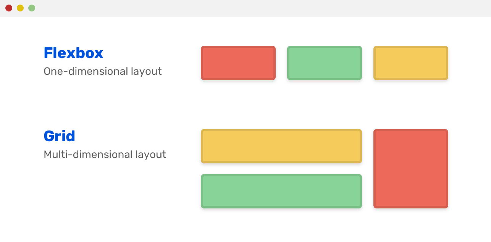

可以看到，Flexbox 正在布局元素的内联列表（对一行元素进行布局），而 CSS 网格使它们组成列和行的网格。当然，也可以使用 Flexbox 布局对一列元素进行布局：

```css
/* Flexbox */
.wrapper {
  display: flex;
  flex-direction: column;
}
```

## 如何决定使用哪个？

在选择其中一种布局时，可以考虑以下问题：

* 组件的子项如何显示？ 内联还是作为列和行？
* 组件如何在各种尺寸的屏幕上显示？

大多数情况下，如果组件的子项都以内联的方式显示，那么 Flexbox 布局可能是最好的解决方案。考虑以下组件：

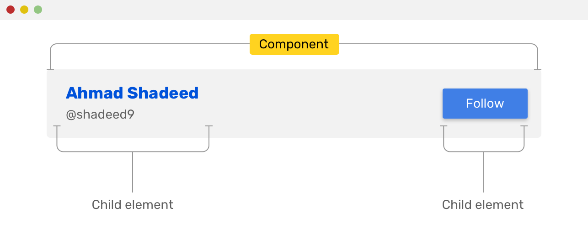

这个组件中包含两个子元素，需要在一行中显示，就非常适合使用 Flex 布局。

如果布局需要多个列和行，那么 Grid 布局就是最合适的解决方案。考虑以下组件：

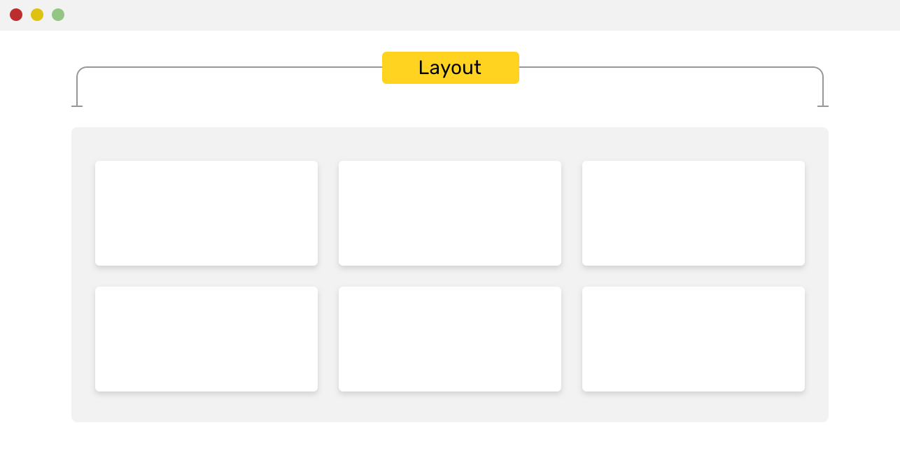看完这些示例，下面来通过一些具体的示例学习如何决定使用哪个布局方案。

## 使用场景

### CSS Flexbox

#### （1）网站导航

大多数情况下，网站导航可以使用 CSS Flexbox 来构建。最常见的模式就是左侧为网站 Logo，右侧为网站导航，中间为空白区域。Flex 就可以轻松实现这个布局：

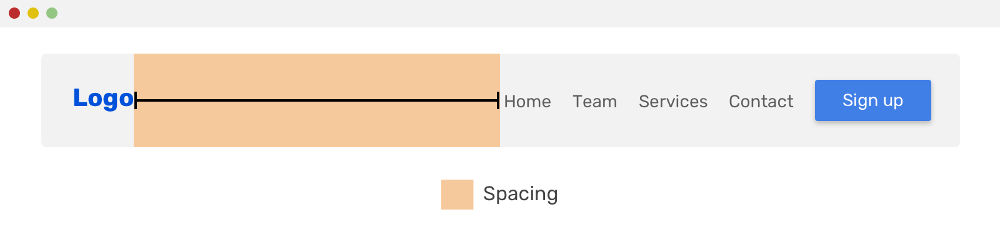

布局代码如下：

```css
.site-header {
  display: flex;
  flex-wrap: wrap;
  justify-content: space-between;
}
```

#### （2）操作列表

操作列表由一组可以执行的操作按钮组成，它们排列在一行中：

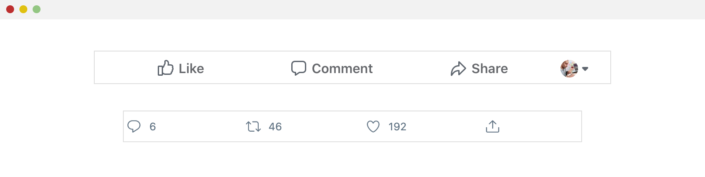

可以看到，这些操作按钮都是相邻的，并且是水平分布的。这种情况就非常适合使用 Flex 来布局：

```css
.actions-list {
  display: flex;
}

.actions-list__item {
  flex: 1;
}
```

下面这种包含标题栏或操作栏的场景也同样适用 Flex 布局：

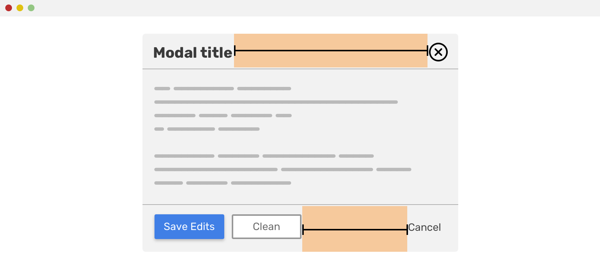

这个组件的页眉和页脚都有内联显示的子元素。对于页眉，布局代码如下：

```css
.modal-header {
  display: flex;
  justify-content: space-between;
}
```

对于页脚，Cancel 按钮比较特殊，可以使用自动左边距将其推到右侧。

```css
.cancel__action {
  margin-left: auto;
}
```

#### （3）表单元素

下图第一个组件中，左侧的输入框和右侧的按钮组合是 Flexbox 布局的完美用例：

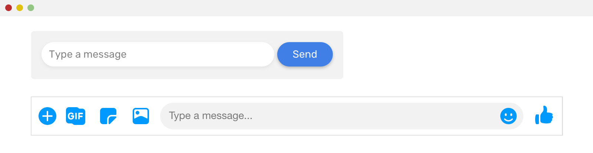

在第二个组件中，使用 Flex 也可以快速完成布局。这里输入框占据了所有剩余空间，其具有动态宽度。布局代码如下：

```css
.input {
  flex: 1 1 auto;
}
```

#### （4）评论组件

Flexbox 的另一个常见用例就是评论组件。考虑以下示例：

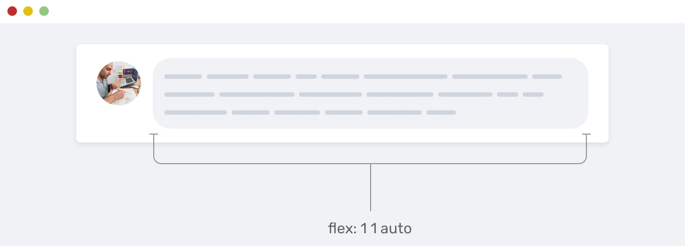

这里左侧是用户的头像，右侧是评论内容，其占据了父元素的剩余空间。

#### （5）卡片组件

卡片组件有很多类型，最常见的卡片设计如下：

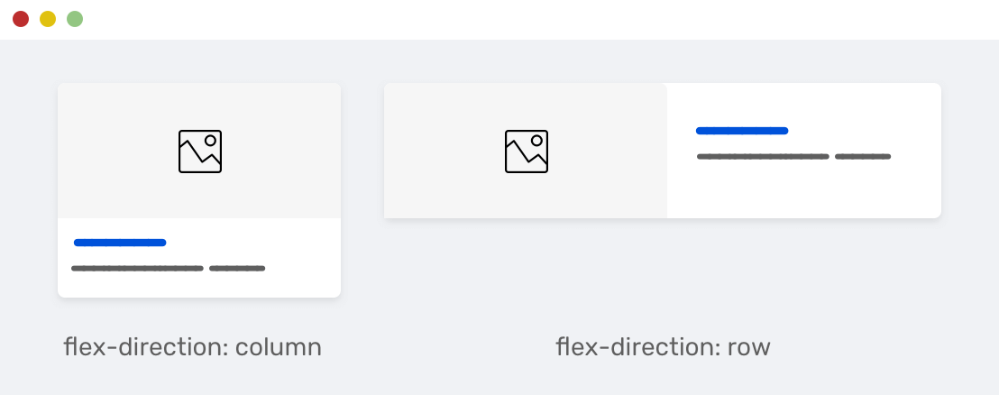

左侧的卡片组件为上下布局，此时 Flex 容器的方向是列。右侧的卡片组件为左右布局，此时 Flex 容器的方向是行，这是 Flex 布局方向的默认值。

```css
.card {
  display: flex;
  flex-direction: column;
}

@media (min-width: 800px) {
  .card {
    flex-direction: row;
  }
}
```

另一种卡片，图标的下方带有文本，它可以是一个按钮、链接。这种模式下 Flex 布局同样适用：

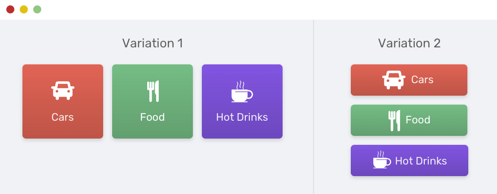

第一种模式的布局代码如下：

```css
.card {
  display: flex;
  justify-content: center;
}
```

第二种模式的布局代码如下：

```css
.card {
  display: flex;
  flex-direction: column;
  align-items: center;
}
```

#### （6）Tab 菜单

当涉及到占据整个屏幕宽度的元素并且具有应该填满所有可用空间的项目时，Flexbox 也是完美的解决方案。

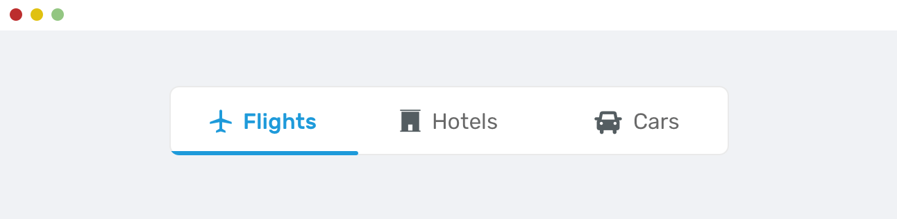

这里，每个项目都应该填充可用空间，并且它们的宽度是相等的。通过将容器元素的 `display` 属性设置为 `flex`，即可轻松完成。

```css
.tabs__item {
  flex-grow: 1;
}
```

#### （7）功能列表

Flexbox 的一个很实用功能就是可以反转元素的方向。默认情况下，Flexbox 的方向是从从左到右的行，我们可以可以这样来反转它：

```css
.item {
  flex-direction: row-reverse;
}
```

在下面的例子中，这个功能就非常实用：

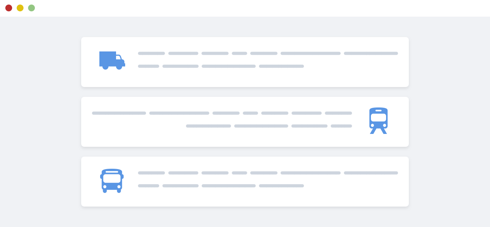

在布局时，可以对偶数行的元素使用上述的方向反转的属性值。

#### （8）内容居中

假设有一个组件，它的内容需要在水平和垂直方向居中。可以通过 text-align 实现文本的水平居中。

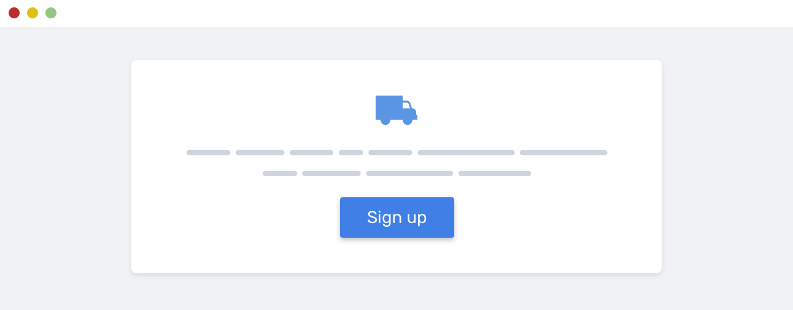

```css
.hero {
  text-align: center;
}
```

可以使用 Flexbox 布局让内容在水平和垂直方向居中：

```css
.hero {
  display: flex;
  flex-direction: column;
  align-items: center; /* 水平居中 */
  justify-content: center; /* 垂直居中 */
}
```

### CSS Grid

#### （1）侧边栏+内容区

当有侧边栏和内容区时，网格布局就是一个完美的解决方案。 考虑以下组件：

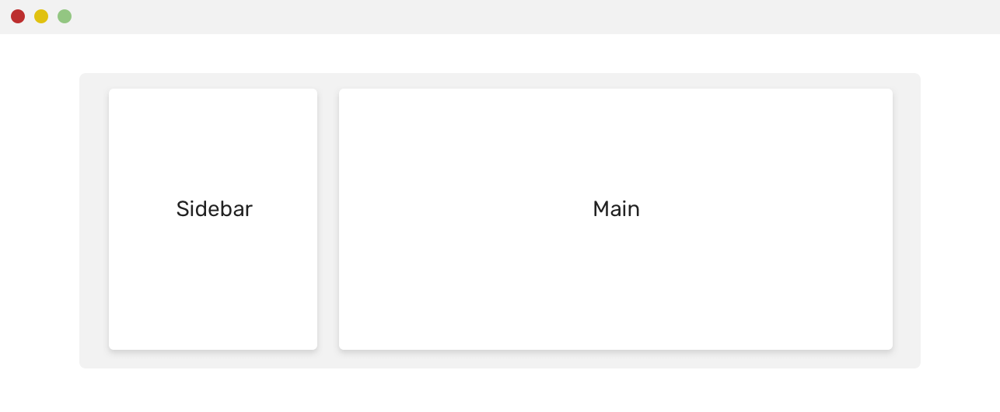

可以在 CSS 中这样定义：

```html
<div class="wrapper">
  <aside>Sidebar</aside>
  <main>Main</main>
</div>
```

```css
@media (min-width: 800px) {
  .wrapper {
    display: grid;
    grid-template-columns: 200px 1fr;
    grid-gap: 16px;
  }

  aside {
    align-self: start;
  }
}
```

如果 `<aside>` 元素不使用 `align-self`，它的高度将与 `main` 元素相同，无论内容长度如何。

#### （2）卡片网格

网格布局从名字就可以很好地理解，它很适合布局卡片网格：

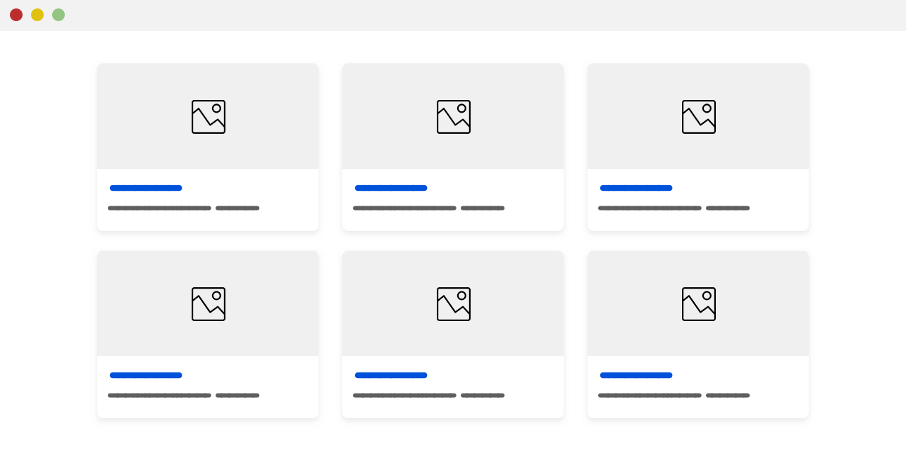

布局代码如下：

```css
.wrapper {
  display: grid;
  grid-template-columns: repeat(auto-fit, minmax(200px, 1fr));
  grid-gap: 16px;
}
```

这里的列宽至少为 200px，如果空间不够，它会将卡片换行。如果视口宽度小于 200px，上面的布局会出现水平滚动。

我们可以仅在视口宽度足够时才添加网格布局的定义：

```css
@media (min-width: 800px) {
  .wrapper {
    display: grid;
    grid-template-columns: repeat(auto-fit, minmax(200px, 1fr));
    grid-gap: 16px;
  }
}
```

#### （3）部分布局

在下面的设计中，可以使用两次网格布局。第一次将整个区域划分为左右两个区域（左侧的侧边栏，右侧的表单），第二次在表单中使用网格布局。

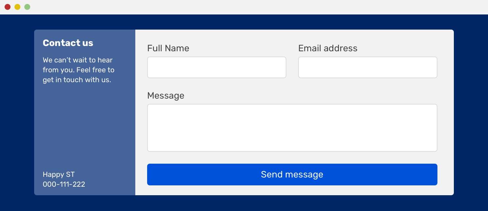

布局代码如下：

```css
@media (min-width: 800px) {
  .wrapper {
    display: grid;
    grid-template-columns: 200px 1fr;
  }

  .form-wrapper {
    display: grid;
    grid-template-columns: 1fr 1fr;
    grid-gap: 16px;
  }

  .form-message,
  .form-button {
    grid-column: 1 / 3;
  }
}
```

## Grid 和 Flexbox 结合使用

上面介绍了这两种布局单独使用的场景，当然也可以结合使用这两种布局。考虑下面的例子，对于卡片列表，可以使用 Grid 布局来实现，对于每个卡片组件，就可以使用 Flexbox 布局来实现：

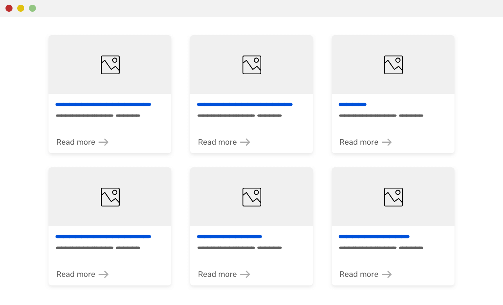

以下是对布局的要求：

* 每行卡片的高度应该相等；
* Read more 链接应位于卡片的末尾，高度不固定；
* Grid 应该使用 `minmax()` 函数

```html
<div class="wrapper">
  <article class="card">
    
    <div class="card__content">
      <h2><!-- Title --></h2>
      <p><!-- Desc --></p>
      <p class="card_link"><a href="#">Read more</a></p>
    </div>
  </article>
</div>
```

```css
@media (min-width: 500px) {
  .wrapper {
    display: grid;
    grid-template-columns: repeat(auto-fill, minmax(200px, 1fr));
    grid-gap: 16px;
  }
}

.card {
  display: flex; /* [1] */
  flex-direction: column; /* [2] */
}

.card__content {
  flex-grow: 1; /* [3] */
  display: flex; /* [4] */
  flex-direction: column;
}

.card__link {
  margin-top: auto; /* [5] */
}
```

对于上面的代码：

1. card 元素作为 Flexbox 的容器；
2. 布局方向为 column，表示卡片元素垂直分布；
3. 让卡片内容扩展并填充剩余空间；
4. 卡片内容作为 Flexbox 的容器；
5. 使用 margin-top: auto 将链接下推，无论卡片高度如何，这都会使其保持在末端。

可以看到，Grid 和 Flexbox 结合使用并不难，使用它们可以轻松实现日常开发的大多数布局。

> 参考文章：
>
> * <https://ishadeed.com/article/grid-layout-flexbox-components/>
> * <https://mp.weixin.qq.com/s/FB_sVjU-KdUMiM7S5__2Eg>
> * <https://mp.weixin.qq.com/s/dQvrijZxOMJjzwuUZGbQGw>


> 更新: 2023-02-19 23:27:30  
> 原文: <https://www.yuque.com/cuggz/feplus/splvz6g0q9m8eru9>