# Flex布局

### 一、Flexbox布局的概念

Flexbox布局也叫Flex布局，弹性盒子布局。它的\*\*<font style="color:rgb(18, 18, 18);">目标</font>\*\*<font style="color:rgb(18, 18, 18);">是提供一个更有效地布局、</font>对齐方式，并且能够使父元素在子元素的大小未知或动态变化情况下仍然能够分配好子元素之间的间隙。**主要思想**是使父元素能够调整子元素的宽度、高度、排列方式，从而更好的适应可用的布局空间。设定为flex布局的元素能够放大子元素使之尽可能填充可用空间，也可以收缩子元素使之不溢出。

Flex布局更适合小规模的布局，可以简便、完整、响应式的实现各种页面布局。但是，设为Flex布局以后，其子元素的`float`、`clear`和`vertical-align`属性将失效。Flex弹性盒模型的优势在于只需声明布局应该具有的⾏为，⽽不需要给出具体的实现⽅式，浏览器负责完成实际布局，当布局涉及到不定宽度，分布对⻬的场景时，就要优先考虑弹性盒布局。

***

Flex布局是一个完整的模块，它包括了一套完整的属性。其中采用 Flex 布局的元素，称为 Flex 容器，简称"**容器**"。它的所有子元素就是容器成员，称为 Flex 项目，简称"**项目**"。

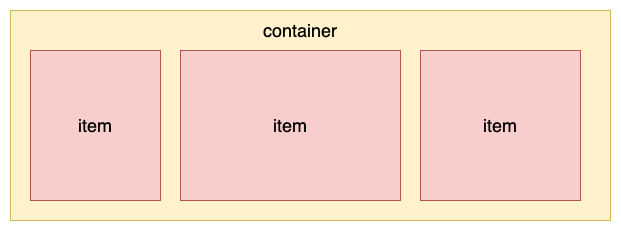

容器默认存在两个轴：**水平轴**（main axis）和**垂直轴**（cross axis），项目默认沿主轴排列（水平轴）：

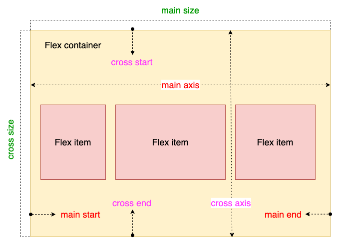

这里面涉及到了几个概念，下面来看一下：

* **<font style="color:rgb(18, 18, 18);">main axis</font>**<font style="color:rgb(18, 18, 18);">: Flex 父元素的主轴是指子元素布局的主要方向轴，它由属性flex-direction来确定主轴是水平还是垂直的，默认为水平轴。</font>
* **<font style="color:rgb(18, 18, 18);">main-start & main-end</font>**<font style="color:rgb(18, 18, 18);">: 分别表示主轴的开始和结束，子元素在父元素中会沿着主轴从main-start到main-end排布。</font>
* **<font style="color:rgb(18, 18, 18);">main size</font>**<font style="color:rgb(18, 18, 18);">: 单个项目占据主轴的长度大小。</font>
* **<font style="color:rgb(18, 18, 18);">cross axis</font>**<font style="color:rgb(18, 18, 18);">: 交叉轴，与主轴垂直。</font>
* **<font style="color:rgb(18, 18, 18);">cross-start & cross-end</font>**<font style="color:rgb(18, 18, 18);">: 分别表示交叉轴的开始和结束。子元素在交叉轴的排布从cross-start开始到cross-end。</font>
* **<font style="color:rgb(18, 18, 18);">cross size</font>**<font style="color:rgb(18, 18, 18);">: 子元素在交叉轴方向上的大小。</font>

### 二、父元素属性

想要使用flex布局，首先需要给父元素指定为flex布局，这样容器内的元素才能实现flex布局：

```css
<div class="container"></div>

.container {
    display: flex | inline-flex;
}
```

这里有两种方式可以设置flex布局，使用`display: flex;`会生成一个块状的flex容器盒子，使用`display: inline-flex;`会生成一个行内的flex容器盒子。如果我们使用块状元素，比如div标签，就可以使用flex，如果使用行内元素，就可以使用inline-flex。多数情况下，我们会使用**display: flex;**。

父元素（容器）可以设置以下六个属性：

* flex-direction
* flex-wrap
* flex-flow
* justify-content
* align-items
* align-content

#### 1. flex-direction

**flex-direction**：主轴方向，它决定了容器内元素排列方向，它有四个属性值：

```css
.container {
    flex-direction: row | row-reverse | column | column-reverse;
}
```

（1）`flex-direction: row`：默认值，沿水平主轴从左到右排列，起点在左沿

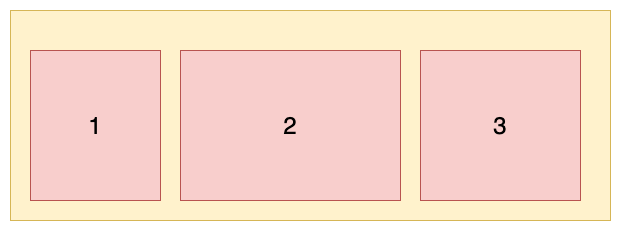

（2）`flex-direction: row-reverse`：沿水平主轴从右到左排列，起点在右沿\
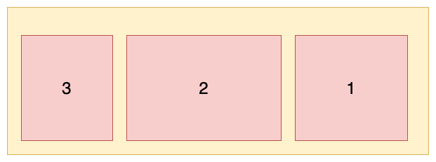

（3）`flex-direction: column`：沿垂直主轴从上到下排列，起点在上沿\
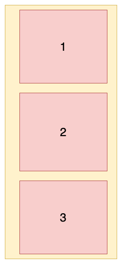

（4）`flex-direction: column-reverse`：沿垂直主轴从下到上排列，起点在下沿\
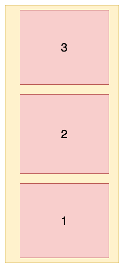

#### 2. flex-wrap

**flex-wrap**：容器内元素是否可以换行，它有三个属性值：

```css
.container {
    flex-wrap: nowrap | wrap | wrap-reverse;
}
```

（1）`flex-wrap: nowrap`：默认值，不换行。当主轴的长度是固定并且空间不足时，项目尺寸会随之进行调整，而不会换行。\
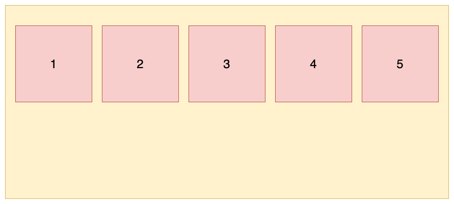

（2）`flex-wrap: wrap`：换行，第一行在上面\
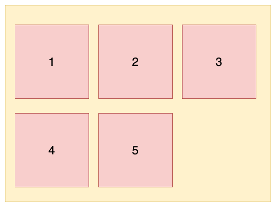

（3）`flex-wrap: wrap-reverse`：换行，第一行在下面\
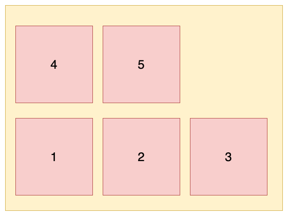

#### 3. flex-flow

`flex-flow` 是 `flex-direction` 属性和`flex-wrap`属性的简写，默认为:`flex-flow:row nowrap`，用处不大，最好还是分开来写。该属性的书写格式如下：

```css
.container {
    flex-flow: <flex-direction> <flex-wrap>;
}
```

#### 4. justify-content

**justify-content**：元素在主轴的对齐方式，它有五个属性值：

```css
.container {
    justify-content: flex-start | flex-end | center | space-between | space-around;
}
```

这里以水平方向为主轴进行举例，即\*\*<font style="color:rgb(18, 18, 18);">flex-direction: row。</font>\*\*

（1）`justify-content : flex-start`：默认值，元素在主轴上**左对齐**（**上对齐**）

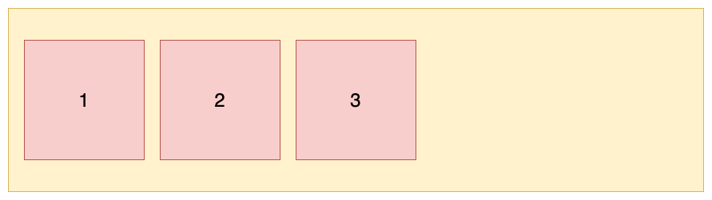

（2）`justify-content : flex-end`：元素在主轴上**右对齐**（**下对齐）**\
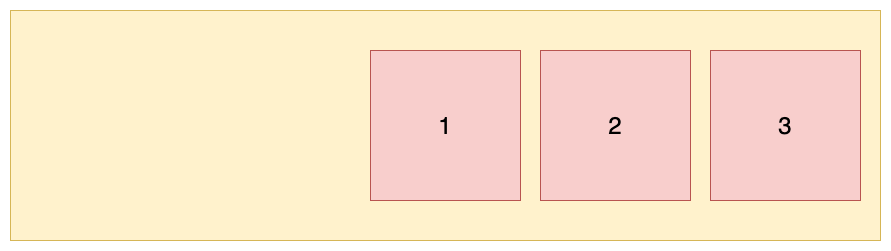

（3）`justify-content : center` ：元素在主轴上**居中对齐**

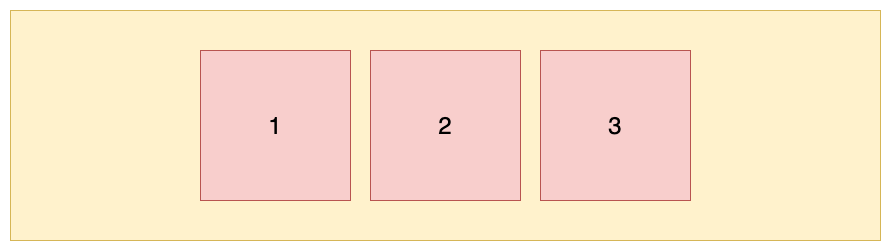

（4）`justify-content : space-between`：元素在主轴上**两端对齐**，元素之间间隔相等\
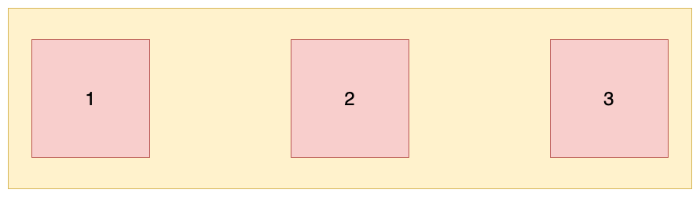

（5）`justify-content : space-around` ：每个项目两侧的间隔相等。所以，项目之间的间隔比项目与边框的间隔大一倍。\
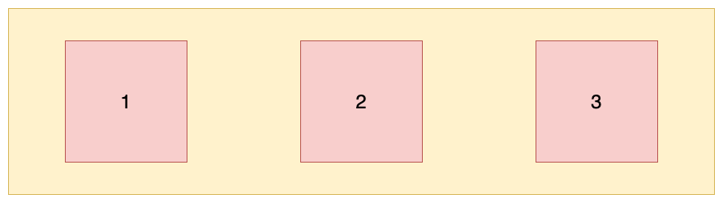

#### 5. align-items

**align-item**：元素在交叉轴上的对齐方式，它有五个属性值：

```css
.container {
    align-items: flex-start | flex-end | center | baseline | stretch;
}
```

这里以水平方向为主轴进行举例，即\*\*<font style="color:rgb(18, 18, 18);">flex-direction: row。</font>\*\*

（1）`align-item：flex-start`：交叉轴的起点对齐（上面或左边）。设置<font style="color:rgb(18, 18, 18);">容器高度为 100px，项目高度分别为 20px、40px、60px、80px、100px，效果如图所示：</font>\
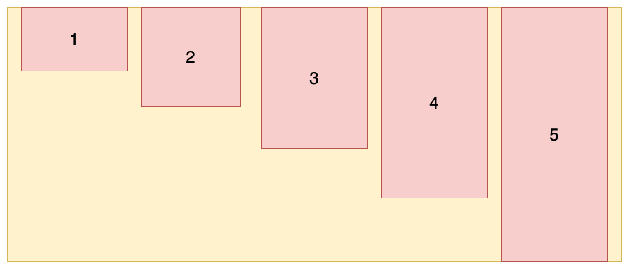

（2）`align-item：flex-end`：交叉轴的终点对齐（下面或右边）。设置<font style="color:rgb(18, 18, 18);">容器高度为 100px，项目高度分别为 20px、40px、60px、80px、100px，效果如图所示：</font>\
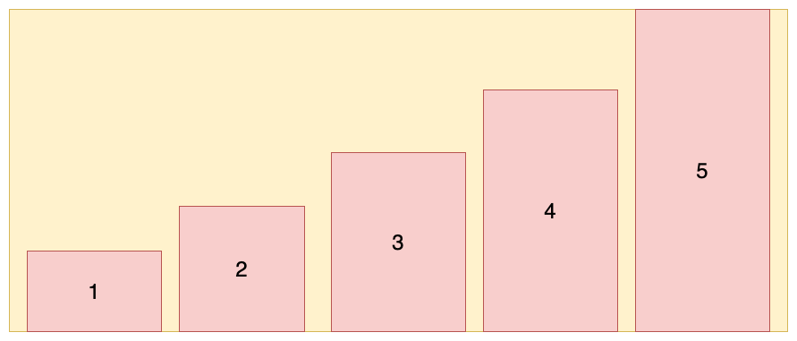

（3）`align-item：center`：交叉轴的中点对齐。设置<font style="color:rgb(18, 18, 18);">容器高度为 100px，项目高度分别为 20px、40px、60px、80px、100px，效果如图所示：</font>\
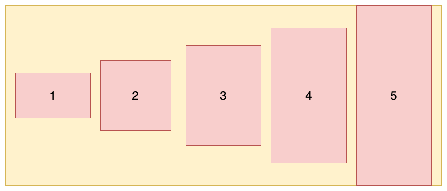

（4）`align-item：stretch`：默认值、如果元素未设置高度或设为auto，将占满整个容器的高度。<font style="color:rgb(18, 18, 18);">假设容器高度设置为 100px，而项目没有设置高度，则项目的高度也为 100px：</font>\
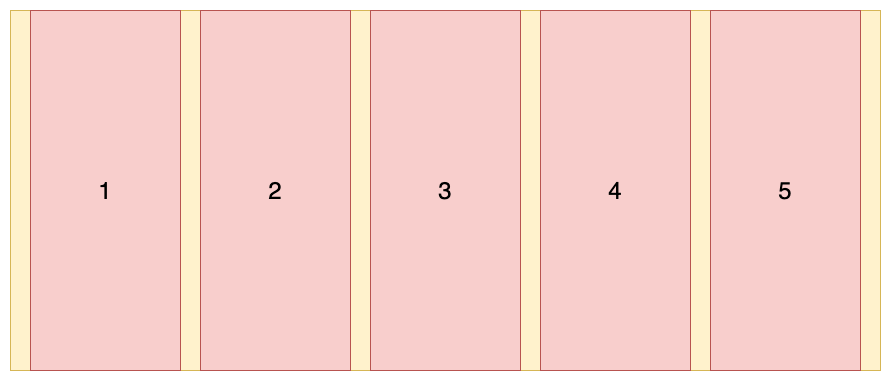

（5）`align-item：baseline`：以元素的第一行文字的基线对齐\
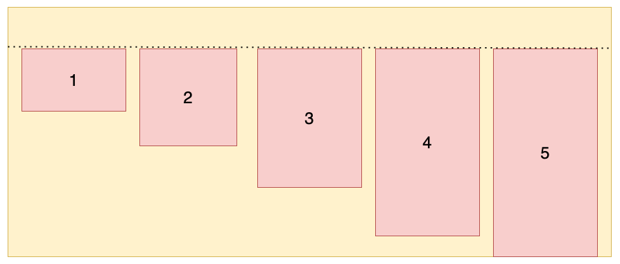

#### 6. align-content

**align-content**：多根轴线对齐方式。如果元素只有一根轴线，该属性不起作用。它有六个属性值：

```css
.container {
    align-content: flex-start | flex-end | center | space-between | space-around | stretch;
}
```

那这个轴线数怎么确定呢？实际上这主要是由flex-wrap属性决定的，当<font style="color:rgb(18, 18, 18);">flex-wrap 设置为 nowrap 时，容器仅存在一根轴线，因为项目不会换行，就不会产生多条轴线。当 flex-wrap 设置为 wrap 时，容器可能会出现多条轴线，这时就需要去设置多条轴线之间的对齐方式。</font>

<font style="color:rgb(18, 18, 18);"></font>

<font style="color:rgb(18, 18, 18);">这里以水平方向为主轴时举例，即：flex-direction: row; flex-wrap: wrap;</font>

（1）`align-content: stretch`：默认值，轴线占满整个交叉轴。这里我们先设置每个项目都是固定宽度，效果如下：

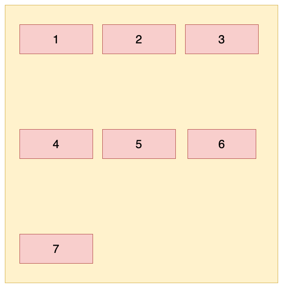

下面就去掉每个项目的高度，它会占满整个交叉轴，效果如下：\
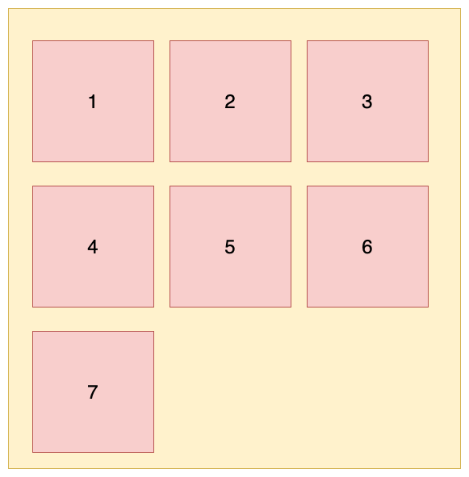

（2）`align-content: flex-start`：从交叉轴开始位置填充\
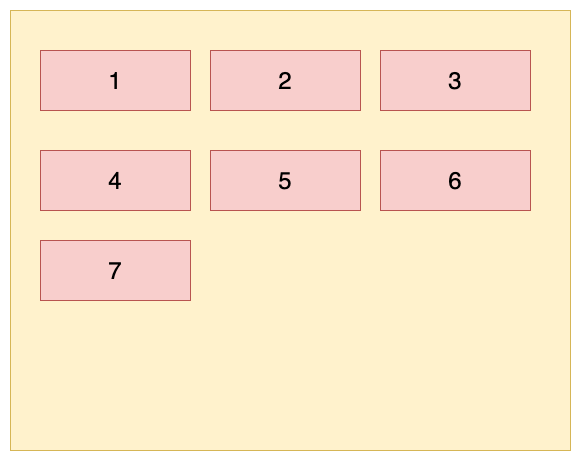

（3）`align-content: flex-end`：从交叉轴结尾位置填充\
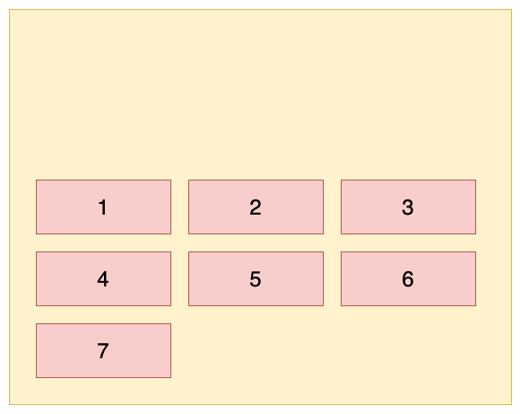

（4）`align-content: center`：与交叉轴中点对齐\
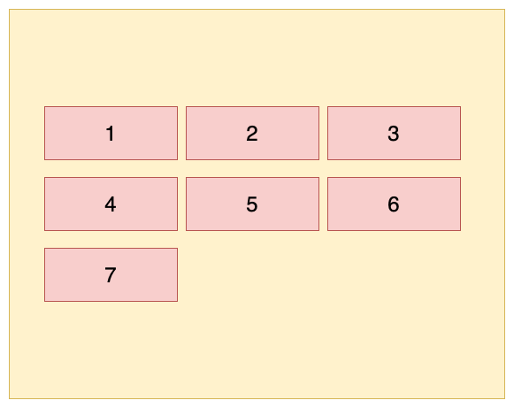

（5）`align-content: space-between`：与交叉轴两端对齐，轴线之前的间隔平均分布\
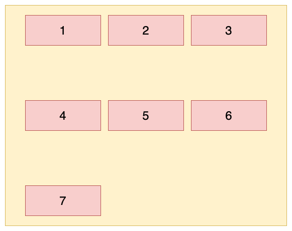

（6）`align-content: space-around`：每根轴线两侧的间隔都相等。所以，轴线之间的间隔比轴线与边框的间隔大一倍\
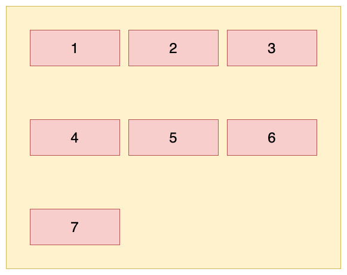

### 三、子元素属性

子元素有以下六个属性：

* order
* flex-grow
* flex-shrink
* flex-basis
* flex
* align-self

#### 1. order

`order`属性用来定义项目的排列顺序。数值越小，排列越靠前，默认为`0`。使用形式如下：

```css
.item {
    order: <integer>;
}
```

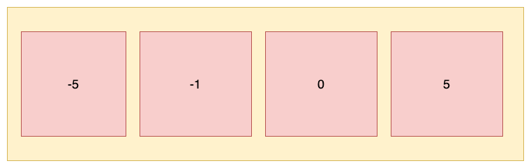

#### 2. flex-basis

`flex-basis`属性定义了在分配多余空间之前，项目占据的主轴空间，浏览器会根据这个属性来计算主轴是否有多余空间。它的默认值为auto，即项目的本来大小。使用形式如下：

```css
.item {
    flex-basis: <length> | auto;
}
```

当主轴设置为水平时，当设置了\*\*<font style="color:rgb(18, 18, 18);"> </font>\*\*<font style="color:rgb(18, 18, 18);">flex-basis，设置的项目宽度值会失效，</font><code><font style="color:rgb(18, 18, 18);">flex-basis</font></code><font style="color:rgb(18, 18, 18);"> 需要跟 </font><code><font style="color:rgb(18, 18, 18);">flex-grow</font></code><font style="color:rgb(18, 18, 18);"> 和 </font><code><font style="color:rgb(18, 18, 18);">flex-shrink</font></code><font style="color:rgb(18, 18, 18);"> 配合使用才能生效。有两种特殊的值：</font>

* <font style="color:rgb(18, 18, 18);">当 </font><code><font style="color:rgb(18, 18, 18);">flex-basis</font></code><font style="color:rgb(18, 18, 18);"> 值为 0 % 时，项目尺寸会被认为是0，因此无论项目尺寸设置多少都用；</font>
* <font style="color:rgb(18, 18, 18);">当 </font><code><font style="color:rgb(18, 18, 18);">flex-basis</font></code><font style="color:rgb(18, 18, 18);"> 值为 auto 时，则跟根据尺寸的设定值来设置大小。</font>

#### 3. flex-grow

`flex-grow`属性定义项目的放大比例，默认为0，即如果存在剩余空间时也不放大。

当容器中所有的项目都设置了<font style="color:rgb(18, 18, 18);">flex-basis属性时，如果仍有是剩余的空间，设置的 </font>`flex-grow` 属性才能生效。

* 如果所有项目的flex-grow属性都设置为1，那么它们会均分剩余的空间，如下图所示：

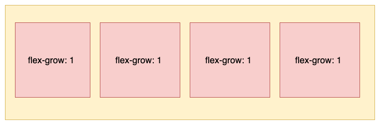

* 如果其中一个项目的flex-grow属性设置为2，其他均为1，那么它占据的剩余空间就是其他项目的两倍，如下图所示：

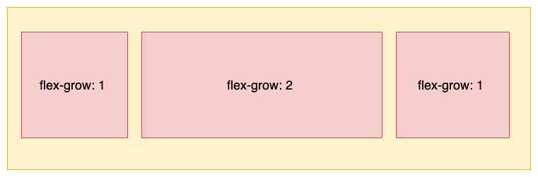

#### 3. flex-shrink

`flex-shrink`属性定义了项目的缩小比例，默认为1，即如果空间不足，该项目将缩小。不能设置负值，使用形式如下：

```css
.item {
    flex-shrink: <number>;
}
```

* <font style="color:rgb(18, 18, 18);">如果所有项目的 flex-shrink 属性都为 1，当空间不足时，都将等比例缩小，如下图所示：</font>

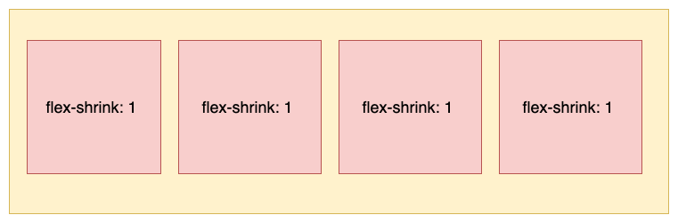

* <font style="color:rgb(18, 18, 18);">如果一个项目的 flex-shrink 属性为 0，其他项目都为 1，则空间不足时，前者不缩小，如下图所示：</font>

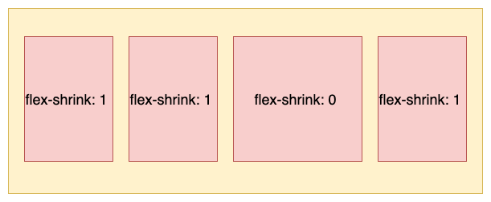

#### 5. flex

`flex`属性是`flex-grow`, `flex-shrink` 和 `flex-basis`的简写，后两个属性可选。默认值为：`flex:0 1 auto。`使用形式如下：

```css
.item{
    flex: none | [ <'flex-grow'> <'flex-shrink'>? || <'flex-basis'> ]
}
```

对于flex的取值有几种常用的特殊情况：

（1）默认值：flex:0 1 auto，即在有剩余空间时，只放大不缩小

```css
.item {
  flex:0 1 auto;
}
.item {
  flex-grow: 0;
  flex-shrink: 1;
  flex-basis: auto;
}
```

（2）flex: none，即有剩余空间时，不放大也不缩小，<font style="color:rgb(51, 51, 51);">最终尺寸通常表现为最大内容宽度。</font>

```css
.item {
  flex:0 0 auto;
}
.item {
  flex-grow: 0;
  flex-shrink: 0;
  flex-basis: auto;
}
```

（3）flex: 0，即当有剩余空间时，项目宽度为其内容的宽度，<font style="color:rgb(51, 51, 51);">最终尺寸表现为最小内容宽度。</font>

```css
.item {
  flex:0 1 0%;
}
.item {
  flex-grow: 0;
  flex-shrink: 1;
  flex-basis: 0%;
}
```

（4）flex: auto，即元素尺寸可以弹性增大，也可以弹性变小，具有十足的弹性，但在尺寸不足时会优先最大化内容尺寸。

```css
.item {
  flex:1 1 auto;
}
.item {
  flex-grow: 1;
  flex-shrink: 1;
  flex-basis: auto;
}
```

（5）flex: 1，即元素尺寸可以弹性增大，也可以弹性变小，具有十足的弹性，但是在尺寸不足时会优先最小化内容尺寸，

```css
.item {
  flex:1 1 0%;
}
.item {
  flex-grow: 1;
  flex-shrink: 1;
  flex-basis: 0%;
}
```

#### 6. align-self

`align-self`属性允许单个项目有与其他项目不一样的对齐方式，可覆盖`align-items`属性。默认值为`auto`，表示继承父元素的`align-items`属性，如果没有父元素，则等同于`stretch`。

```css
.item {
     align-self: auto | flex-start | flex-end | center | baseline | stretch;
}
```

这个属性和align-items属性的效果是一样的，只不过这个属性只对单个项目生效，而align-items是对容器中所有的项目生效。

设置容器的align-items属性为flex-start，容器中第三个项目的align-self属性为flex-end，效果如下：

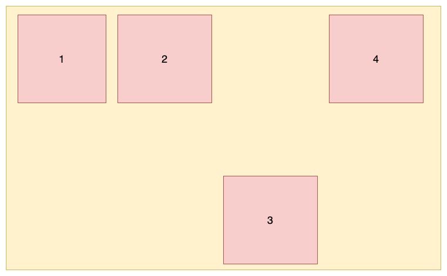

Flex布局的基本使用主要就是这些了，flex布局可能是目前最好用的布局方式之一，不过仅限于小规模的布局，对于大规模的布局，可以使用grid布局等，后面会有一篇文章专门介绍grid布局，敬请期待！

如果觉得这篇文章有用，就点个赞吧！


> 更新: 2021-09-23 11:05:42  
> 原文: <https://www.yuque.com/cuggz/feplus/vmygbg>