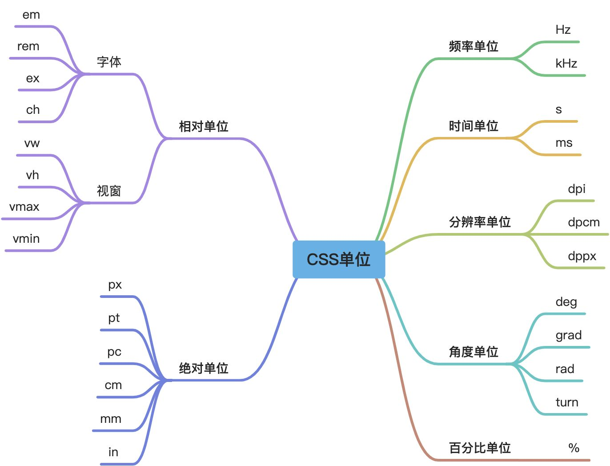
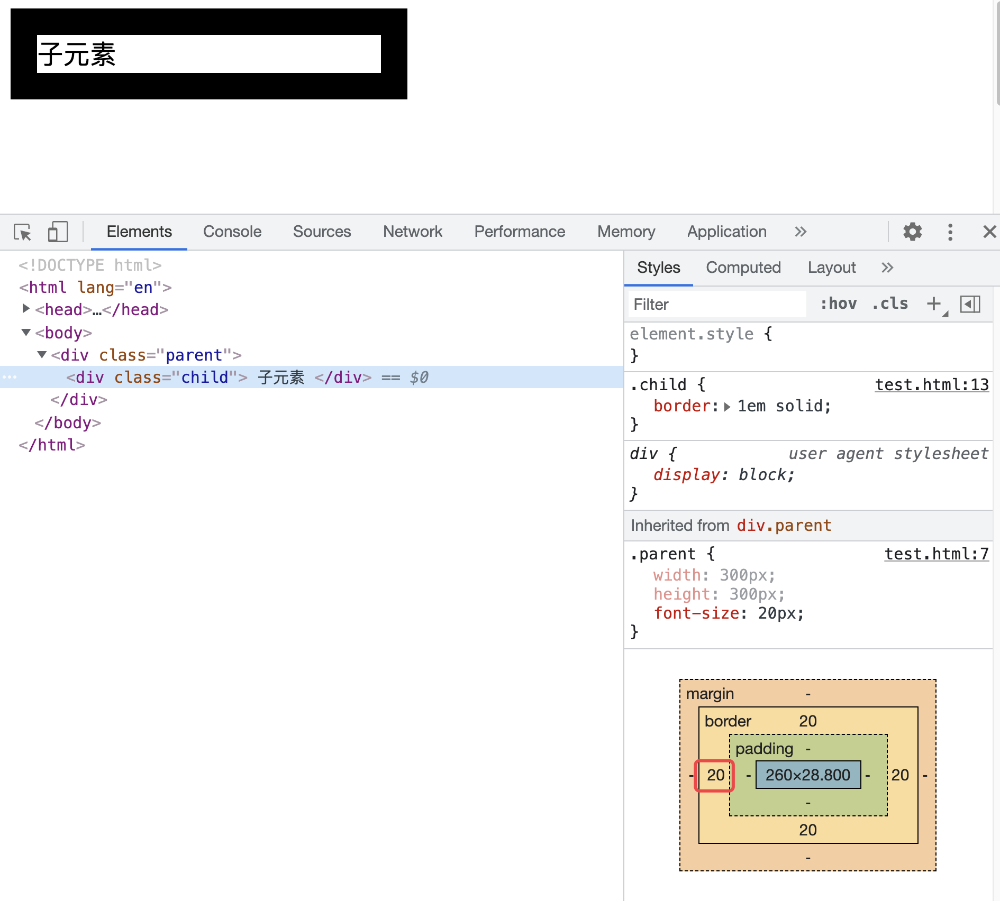
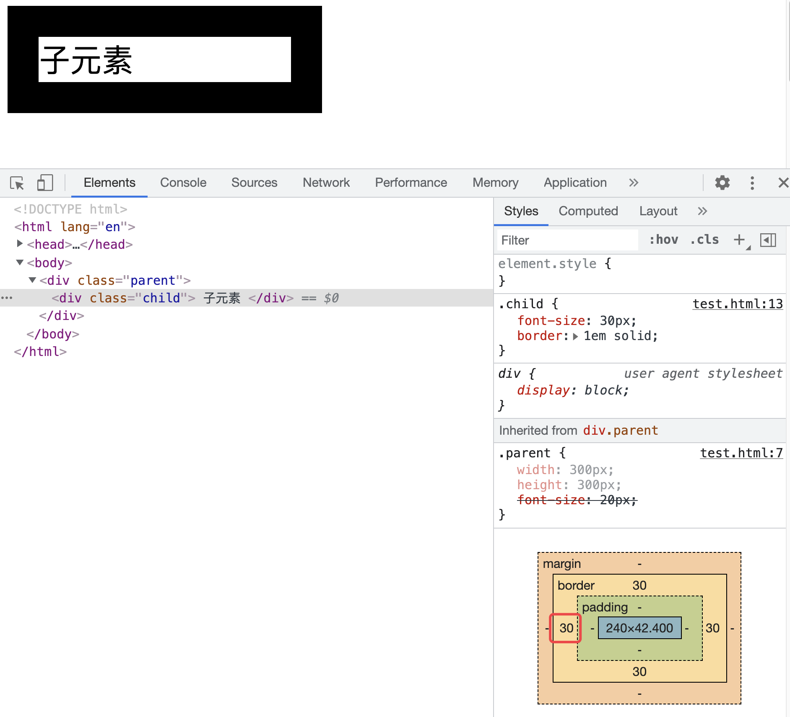
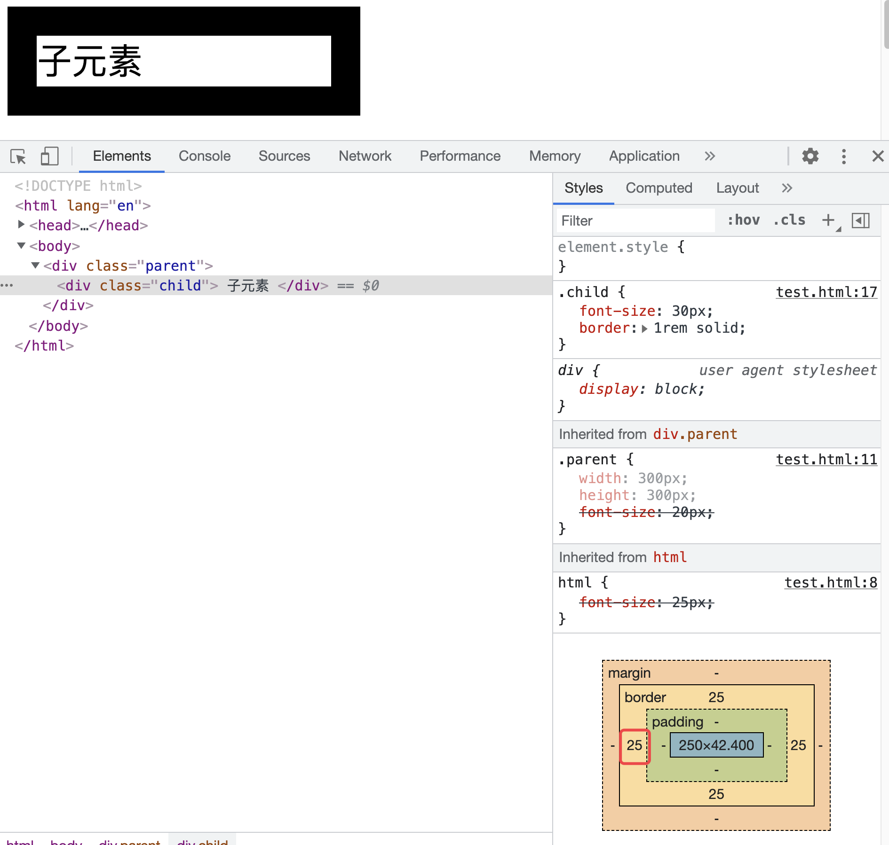

# 单位

说起CSS单位，我们最熟悉的可能就是像素单位（px），它是一个绝对单位，也就是说一个10px的文字，放在哪里都是一样大的。单位可以影响颜色、距离、尺寸等一系列的属性。CSS中单位的形式有很多种，下面就分别来看看这些单位。



### 1. 相对单位
相对单位就是相对于另一个长度的长度。CSS中的相对单位主要分为两大类：

+ 字体相对单位，他们都是根据font-size来进行计算的。常见的字体相对单位有：em、rem、ex、ch；
+ 视窗相对单位，他们都是根据视窗大小来决定的。常见的视窗相对单位有vw、vh、vmax、vmin。


下面就来看看这些常见的CSS单位。

#### （1）em 和 rem
em是最常见的相对长度单位，适合基于特定的字号进行排版。根据CSS的规定，1em 等于元素的font-size属性的值。


em 是相对于父元素的字体大小进行计算的。如果当前对行内文本的字体尺寸未进行显示设置，则相对于浏览器的默认字体尺寸。当DOM元素嵌套加深时，并且同时给很多层级显式的设置了font-size的值的单位是em，那么就需要层层计算，复杂度会很高。


当然，上面的这个说法是不严谨 的。来看一个例子：

```css
<!DOCTYPE html>
<html lang="en">
<head>
    <meta charset="UTF-8">
    <title>Document</title>
    <style>
        .parent {
            width: 300px;
            height: 300px;
            font-size: 20px;
        }
        .child {
            border: 1em solid ;
        }
    </style>
</head>
<body>
    <div class="parent">
        <div class="child">
           子元素
        </div>
    </div>
</body>
</html>

```

这里给父元素设置了字体大小为20px，然后给子元素的border宽度设置为1em，这时，子元素的border值为20px，确实是相对于父元素的字体大小设置的：



那如果我们给子元素的字体设置为30px：

```css
.child {
  font-size: 30px;
  border: 1em solid ;
}
```

这时可以看到，子元素的边框宽度就是30px，它是相对自己大小进行计算的：



所以，可以得出结论：**如果自身元素是没有设置字体大小的，那么就会根据其父元素的字体大小作为参照去计算，如果元素本身已经设置了字体，那么就会基于自身的字体大小进行计算**。


em单位除了可以作用于 font-size之外，还可以运用于其他使用长度的属性，比如border-width、width、height、margin、padding、text-shadow等。


所以，em的使用还是比较复杂的，它可能会继承任意一级父元素的字体大小。需要谨慎使用。


rem相对于em就简单了很多，它是根据页面的根元素（根元素）的字体大小来计算的。来对上面的例子进行修改：

```css
.child {
  font-size: 30px;
  border: 1rem solid ;
}

html {
	font-size: 25px;
}
```

效果如下，可以看到，边框的长度变成了25px，它是根据根元素html的字体大小计算的：



如果没有对根元素设定字号的话，font-size: 1rem的作用与font-size: initial相同。


使用 em 和 rem 可以让我们灵活的够控制元素整体的放大和缩小，而不是固定大小。那何时应使用 em，何时应使用 rem 呢？可以根据两者的差异来进行选择：

+ 两者在客户端中计算出来的样式都会以px的形式显示；
+ rem是相对于根元素html的font-size计算，em 相对于元素的font-size计算；
+ 当需要根据浏览器的font-size设置缩放时，应该使用 rem；
+ 使用 em 应该根据组件的font-size来定，而不是根元素的font-size来定；
+ rem 可以从浏览器字体设置中继承 font-size 值， em 可能受任何继承过来的父元素 font-size 的影响。

#### （2）ex 和 ch
ex 和 ch 都是排版用的单位，它们的大小取决于元素的font-size 和 font-family属性。

+ ex 指的是所用字体中小写字母 x 的高度。因此，如果两个字体不一样，那么 ex 的值是不一样的。因为每种字体的小写 x 的高度是不一样的。
+ ch 和 ex 类似，不过它是基于数字 0 的宽度计算的。会随着字体的变化而变化。而0 的宽度通常是对字体的平均字符宽度，它是一个估计值。由于 ch 是一个近似等宽的单元，所以在设置容器的宽度时很有用，比如一个容器想要显示指定个数的字符串时，就可以使用这个单位。

#### （3）vw、vh、vmax 和 vmin
这四个单位都是视窗单位，所谓的视窗，在web端指的就是可视区域，移动端的视窗指的就是布局视窗。如果视窗大小发生了变化，那么这些值都会随之变化。这四个单位指的是：

+ vw：视窗宽度的百分比；
+ vh：视窗高度的百分比；
+ vmax：较大的 vh 和 vw；
+ vmin：较小的 vh 和 vw。  


假如一个浏览器的高度是800px，那么1vh的值就是8px。vh和vw的大小总是和视窗的高度和宽度有关。


vmin 和 vmax 与视窗宽度和高度的最大值和最小值有关。假如一个浏览器高度为500px，宽度为1200px，那么1vmin就是5px，1vmax就是12px。


这些单位都是长度单位，所以可以在任何允许使用长度单位的地方使用。这些单位比较适合用于创建全视区界面，例如移动设备的界面，因为元素是根据视区的尺寸而变化的，与文档树中的任何元素都没有关系。

### 2. 绝对单位
在 CSS 中，绝对单位包括： px 、pt 、pc、 cm 、 mm 、in 等。绝对单位是一个固定的值，它反应了一个真实的物理尺寸。它不会受屏幕大小或者字体的影响。它们的大小取决于值以及屏幕的分辨率（DPI，每英寸的点数）。px就是我们最常用的绝对单位之一。这些绝对单位的换算关系如下：

```css
1in = 25.4mm = 2.54cm = 6pc = 72pt =96px
```

#### （1）px
px 全称为 Pixels，表示像素，它并不严格等于显示器的像素，尤其在高清屏下。尽管CSS单位会根据浏览器、操作系统或者硬件适当缩放，在某些设备或者用户的分辨率设置下也会发生变化，但是96px通常等于一个物理英寸的大小。


CSS 将光栅图像(如照片等)的显示方式定义为默认每一个图像大小为1px。 一个“600x400”解析度的照片的长宽分别为“600px”和“400px”，所以照片本身的像素并不会与显示装置像素一致，而是与 px 单位一致。如此就可以将图像完整的与网页的其它元素排列起来。


很多时候， px 也常被称为 CSS 像素。它是一个绝对单位，但也可以被视为相对单位，因为像素单位相对的是设备像素。在同一个设备上，每 1 个 CSS 像素所代表的物理像素是可以变化的；在不同的设备之间，每 1 个 CSS 像素所代表的物理像素是可以变化的。

```css
.box {
    width: 100px;
    height: 100px;
}
```

#### （2）pt
pt 全称为 Point，表示点。常用于软件设计和排版印刷行业（笔者做的前端系统，最终的产物就是一个需要拿去印刷的PDF，所以会经常用到这个单位）。当使用这个单位时，无论显示器的分辨率是多少，打印在纸上的结果都是一样的。


如果单纯为了网页的显示，建议就使用px像素单位，如果需要输出印刷产品，就可以考虑使用pt。

#### （3）pc
pc 全程为 Picas，表示派卡。相当于我国新四号铅字的尺寸。派卡也是印刷的术语，1派卡等于12点。它和 px 的换算关系如下：

```css
1pc = 16px
```

#### （4）cm
cm 全称为 Centimeters，表示厘米。它和 px 的换算关系如下：

```css
1cm = 37.8px
```

#### （5）mm
mm 全称为 Millimeters，表示毫米。它和 px 的换算关系如下：

```css
1mm = 3.78px
```

#### （6）in
in 全称为 Inches，表示英寸。它和 px 的换算关系如下：

```css
1in = 96px
```

### 3. 频率单位
CSS中的频率单位有两个：赫兹（Hz）和千赫兹（kHz）。它们的换算关系如下：

```css
1kHz = 1000Hz
```

通常情况下，频率单位使用在<font style="color:rgb(61, 70, 77);">听或说级联样式表中。频率可以被用来改变一个语音阅读文本的音调。低频率就是低音，高频率就是高音。</font>

```css
.low { 
  pitch: 105Hz; 
} 

.squeal { 
  pitch: 135Hz; 
}
```

需要注意，当数值为0时，单位对值没有影响，但是单位是不能省略的。也就是说0、0Hz、0kHz是不一样的。所以，在使用频率单位时，不要直接写0。另外，这两个单位是不区分大小写的。

### 4. 时间单位
CSS中的时间单位有两个：秒（s）和毫秒（ms）。这两个时间单位都是CSS新增的单位。这两个单位的换算关系如下：

```css
1s = 1000ms
```

时间单位主要用于**过度和动画**中，用于定义持续时间或延迟时间。下面两种定义是等效的：

```css
a[href] {
	transition-duration: 2.5s;
}

a[href] {
	transition-duration: 2500s;
}
```

### 5. 分辨率单位
CSS中的分辨率单位有三个：dpi、dpcm、dppx。这三个单位都是CSS3中华新增的单位。他们都是正值，不允许为负值。这三个单位的换算关系如下：

```css
1dppx = 96dpi
1dpi ≈ 0.39dpcm
1dpcm ≈ 2.54dpi
```

分辨率单位主要用于**媒体查询**等操作。

#### （1）dpi
dpi 全称为 dots per inch，表示每英寸包含的点的数量。普通屏幕通常包含 72或96个点，大于 192dpi 的屏幕被称为高分屏。

```css

@media screen and (min-resolution: 96dpi) { ... }
@media print and (min-resolution: 300dpi) { ... }
```

#### （2）dpcm
dpcm 全称为 dots per centimeter，表示每厘米包含的点的数量。

```css
@media screen and (min-resolution: 28dpcm) { ... }
@media print and (min-resolution: 118dpcm) { ... }
```

#### （3）dppx
dppx 全称为 dots per pixel，表示每像素（px）包含点的数量。由于CSS px的固定比率为1:96，因此1dppx相当于96dpi。它对应于由图像分辨率定义的CSS中显示的图像的默认分辨率。

```css
@media screen and (min-resolution: 2dppx) { ... }
@media screen and (min-resolution: 1dppx) and (max-resolution: 1.9dppx) { ... }
```

### 6. 角度单位
<font style="color:rgb(0, 0, 0);">CSS中的角度单位有四个：deg、grad、rad、turn。这些角度单位都是CSS3中新增的单位。它们的换算关系如下：</font>

```css
90deg = 100grad = 0.25turn ≈ 1.570796326794897rad
```

一般这些角度单位用于元素的**旋转操作，**包括2D旋转、3D旋转等。

+ 当旋转值为正值时，元素会顺时针旋转；
+ 当旋转值为负值时，元素会逆时针旋转。


通常情况下，一个完整的旋转就是360度。所以，所有的角度都在0-360度之间。但是，超出这个范围的值也是允许的，只不过都会归到0-360度之间。比如，顺时针旋转420度（450deg）、逆时针旋转270度（-270deg）、顺时针旋转90度（90deg）都是一样的效果，都会归为90deg。但是当使用动画时，这些角度值就非常重要了。


CSS的旋转主要依赖于 transform 属性中的 rotate() 、<font style="color:rgb(51, 51, 51);">rotate3d、</font> skew() 等方法。只需给它们传递旋转的角度即可。


除了旋转会使用角度之外，线性渐变也会经常使用角度值：

```css
background: linear-gradient(45deg, #000, #fff);
```

#### （1）deg
deg 全称为 Degress，表示度，一个圆总共360度。

```css
transform: rotate(2deg);
```

#### （2）grad
grad 全称为 Gradians，表示梯度，一个圆总共400梯度。

```css
transform: rotate(2grad);
```

#### （4）rad
rad 全称为 Radians，表示弧度，一个圆总共2π弧度。

```css
transform: rotate(2rad);
```

#### （4）turn
turn 全称为 Turns，表示圈（转），一个圆总共一圈（转）。

```css
transform:rotate(.5turn);
```

### 7. 百分比单位
百分比（%）也是我们比较常用的单位之一，所有接受长度值的属性都可以使用百分比单位。但是不同属性使用该单位的效果可能并不一样。但是都需要有一个参照值，也就是说百分比值是一个相对的值。


下面来看看常见场景中的百分比单位的使用。

#### （1）盒模型中的百分比
在CSS中的盒模型包含的属性有：width、max-width、min-width、height、max-height、min-height、padding、margin等。这些属性在使用百分比时，参照物不尽相同：

+ width、max-width、min-width：值为百分比时，其相对于包含块的 width 进行计算；
+ height、max-height、min-height：值为百分比时，其相对于包含块的 height 进行计算；
+ padding、margin：值为百分比时，如果是水平的值，就是相对于包含块的 width 进行计算；如果是垂直的值，就是相对于包含块的 height 进行计算。

#### （2）文本中的百分比
在CSS中文本控制的属性有font-size、line-height 、vertical-align、 text-indent等。这些属性在使用百分比时，参照物不尽相同：

+ font-size：根据父元素的font-size 进行计算；
+ line-height：根据font-size进行计算；
+ vertical-align：根据line-height进行计算；
+ text-indent：如果是水平的，则根据width进行计算，如果是垂直的，则根据 height 进行计算。

#### （3）定位中的百分比
在CSS中用控制 position 位置的top、right、bottom、left都可以使用百分比作为单位。其参照物就是包含块的同方向的width和height。不同定位的包含块不尽相同：

+ 如果元素为静态（ static ）或相对定位（ relative ），包含块一般是其父容器；
+ 如果元素为绝对定位（ absolute ），包含块应该是离它最近的 position 为 absolute 、 relative 或 fixed 的祖先元素；
+ 如果元素为固定定位（ fixed ），包含块就是视窗（ viewport ）。

#### （4）<font style="color:rgb(64, 64, 64);">变换中的百分比</font>
CSS 中的 transform 属性中的 translate 和 transform-origin 值也可以设置百分比。

+ translateX() 根据容器的 width 计算
+ translateY() 根据容器的 height 计算
+ transform-origin 中横坐标（ x ）相对于容器的 width 计算；纵坐标（ y ）相对于容器的 height 计算


注意，在 translate 还有一个 z 轴的函数 translateZ() 。它是不接受百分比为单位的值。


> 更新: 2021-11-26 09:57:53  
> 原文: <https://www.yuque.com/cuggz/feplus/vug9ms>