# 数学函数

CSS 数学函数允许在 CSS 属性值中执行数学表达式。CSS 数学函数仅支持加法（+）、减法（-）、乘法（\*）、除法（/）。目前在 CSS 中有四个得到很好支持的数学函数：

* <code>**min()**</code>：该函数允许你从逗号分隔符表达式中选择一个最小值作为 CSS 的属性值；
* <code>**max()**</code>\*\*：\*\*该函数可以从一个逗号分隔的表达式列表中选择最大（正方向）的值作为属性的值；
* <code>**calc()**</code>\*\*：\*\*该函数允许在声明 CSS 属性值时执行一些计算；
* <code>**clamp()**</code>\*\*：\*\*该函数的作用是把一个值限制在一个上限和下限之间，当这个值超过最小值和最大值的范围时，在最小值和最大值之间选择一个值使用。它接收三个参数：最小值、首选值、最大值。

这些 CSS 函数可能会以意想不到的方式使用，例如在渐变和颜色函数中以及与 CSS 自定义属性结合使用。下面就来看看这四个CSS函数！

## 1. calc()

### 基本使用

calc() 函数有助于在 CSS 属性值中执行计算。它可以用在如下属性中：`length`、`frequency`、`angle`、`time`、`percentage`、`number`、`integer`。

```css
width: calc(100% - 80px);
```

`calc()` 函数用一个表达式作为它的参数，用这个表达式的结果作为值。这个表达式可以是任何如下操作符的组合（`+`、`-`、`*`、`/`），采用标准操作符处理法则的简单表达式。表达式中的运算对象可以使用任意长度的值。如果你愿意，甚至可以在一个表达式中混用这类值的不同单位。在需要时，还可以使用小括号来建立计算顺序。

该函数具有广泛的用途，例如，如果希望某些内容占据大部分视口高度。这时就可以使用相对的单位vh和绝对单位px进行混合计算：

```css
.content {
  height: calc(100vh - 60px);
}
```

当视口大小发生变化或者用户使用较大或较小的设备时，100vh的值将动态更新，因此计算也将动态更新。使用`calc()` 的好处在于，它既可以避免添加一些 magic number，也可以避免使用 JavaScript 来计算样式的属性值。

### 生成调色板

我们可以通过传入CSS自定义属性来扩展 `calc()` 的功能。一个非常有用的例子就是使用 `hsl()` （表示色调、饱和度和亮度）来创建一致的调色板。给定饱和度、亮度和起始色调的值，就可以使用 calc() 函数计算互补值来构建完整的调色板。

```css
.colors {
  --base-hue: 140;
  --saturation: 95%;
  --lightness: 80%;
  --rotation: 60;

  color: #222;
  text-align: center;
}

.color {
  padding: 0.25rem;
  background-color: hsl(var(--hue), var(--saturation), var(--lightness));
}

.color1 {
  --hue: calc(var(--base-hue));
}

.color2 {
  --hue: calc(var(--base-hue) + var(--rotation));
}

.color3 {
  --hue: calc(var(--base-hue) + var(--rotation) * 2);
}
```

生成的调色板：

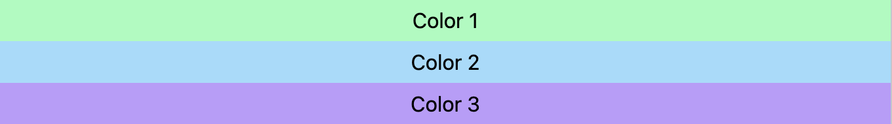

### 注意事项

在使用 `calc()` 函数时需要注意：

* \*\*+ 和 - 运算符的两边必须要有空白字符。\*\*比如，`calc(50% -8px)` 会被解析成为一个无效的表达式，解析结果是：一个百分比 后跟一个负数长度值。而加有空白字符的、有效的表达式 `calc(8px + -50%)`会被解析成为：一个长度 后跟一个加号 再跟一个负百分比。
* * 和 / 这两个运算符前后不需要空白字符，但如果考虑到统一性，仍然推荐加上空白符。
* 用 0 作除数会使 HTML 解析器抛出异常。
* 涉及自动布局和固定布局的表格中的表列、表列组、表行、表行组和表单元格的宽度和高度百分比的数学表达式，auto 可视为已指定。
* `calc()` 函数支持嵌套，但支持的方式是：把被嵌套的 calc() 函数全当成普通的括号。所以，函数内直接用括号就好了。

### 浏览器兼容性

clac() 函数在这四个函数中具有最好的跨浏览器支持：

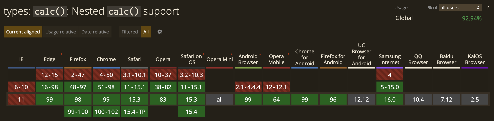

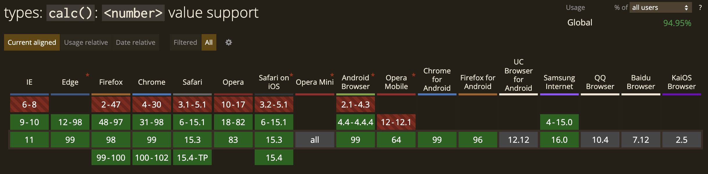

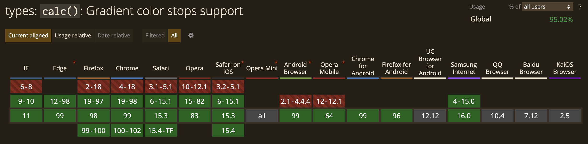

## 2. clamp()

### 基本使用

clamp() 的实际用途：在可接受的值范围内设置边界。`clamp()` 被用在 `length`、`frequency`、`angle`、`time`、`percentage`、`number`、`integer` 属性中。其语法如下：

```css
clamp(MIN, VAL, MAX) 
```

clamp(MIN, VAL, MAX) 其实就是表示 max(MIN, min(VAL, MAX))。clamp() 函数接收三个用逗号分隔的表达式作为参数，按最小值、首选值、最大值的顺序排列，这三个值得顺序很重要。

* 当首选值比最小值要小时，则使用最小值。
* 当首选值介于最小值和最大值之间时，用首选值。
* 当首选值比最大值要大时，则使用最大值。

这个表达式可以是数学函数、字面量或其它计算为有效的参数类型表达式，如 attr()，或嵌套的 min 和 max 。作为数学表达式，可以使用加减乘除运算而无需使用 calc() 函数。也可以用括号来确定计算顺序。表达式中的每一个值都可以用不同的单位。

来看下面的例子：

```css
.element {
  width: clamp(200px, 50%, 1000px);
}
```

有一个元素，其最小宽度为200px，首选值为50%，最大值为1000px。

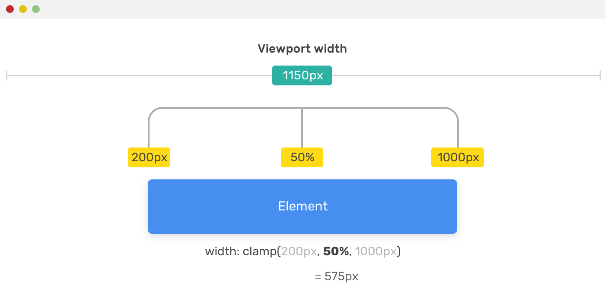

这个元素的宽度永远不会低于200px，首选值是50%并且仅在视口宽度大于400px和小于2000px 时才有效，宽度不会超过1000px。

那 `clamp()` 是如何计算的呢？当` clamp()` 用作值时，它等同于使用`max()`和`min()`函数：

```css
.element {
  width: clamp(200px, 50%, 1000px);
  width: max(200px, min(50%, 1000px));
}
```

这里的50%取决于浏览器视口宽度，假设视口宽度为1150px，解析的过程如下：

```css
1. width: max(200px, min(50%, 1000px));
2. width: max(200px, min(575px, 1000px));
3. width: max(200px, 575px);
4. width: 575px;
```

### 字体大小

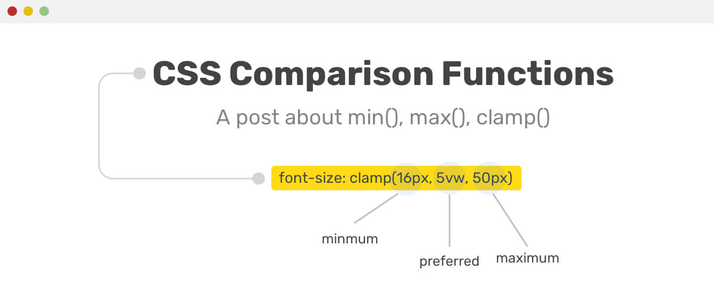

假设需要要一个最小为16px，最大为50px的标题。clamp()函数将给出一个介于两者之间的值，而不会低于最小值或超过最大值。

```css
.title {
  font-size: clamp(16px, 5vw, 50px);
}
```

在这里使用`clamp()` 就非常完美，因为它可以确保使用的字体大小易于访问和阅读。如果要使用 `min()` 设置最大字体，就无法在小视口中控制字体。

```css
.title {
  font-size: min(3vw, 24px); 
}
```

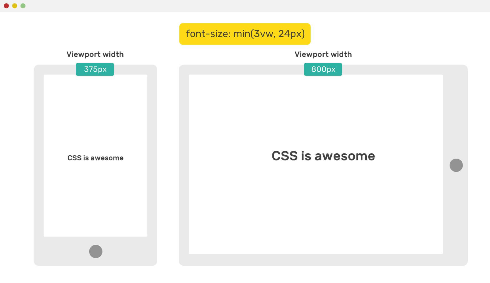

在移动视口中，字体很小。因此，不要只对字体大小使 `min()` 函数。当然，也可以通过媒体查询来取消或添加它。正如上面所说的，可以在 `max()` 函数中嵌套一个 `min()`，这将模拟`clamp()`函数：

```css
.title {
  font-size: max(16px, min(10vw, 50px));
}
```

### 边框和阴影

有时需要边框宽度和半径应该在移动设备上更小，通过使用 `clamp()` 就可以根据视口宽度来使它们动态变化。

```css
.element {
  box-shadow: 0 3px 10px 0 red;
  border: min(1vw, 10px) solid #468eef;
  border-radius: clamp(7px, 2vw, 20px);
  box-shadow: 0 3px clamp(5px, 4vw, 50px) 0 rgba(0, 0, 0, 0.2);
}

```

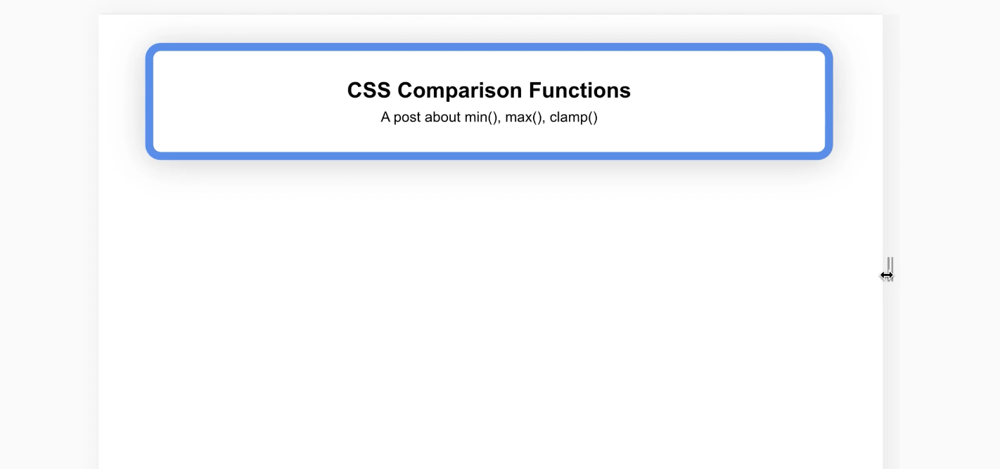

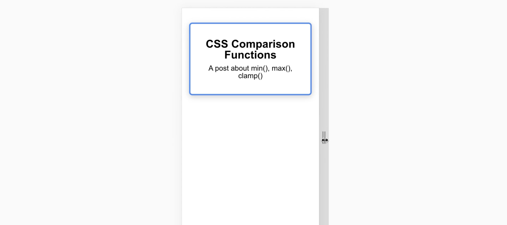

### Grid 间隙

当使用 CSS Grid 布局时设置网格间隙，并且希望为移动视口缩小间隙。就可以使用 `clamp()`：

```css
.wrapper {
  display: grid;
  grid-template-columns: repeat(auto-fit, minmax(200px, 1fr));
  grid-gap: clamp(1rem, 2vw, 24px);
}
```

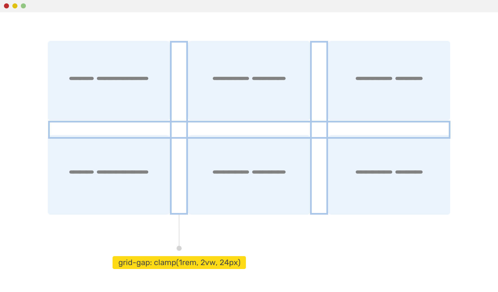

### 注意事项

* 允许设置表达式的值为 max() 和 min() 。这些表达式是数学表达式，所以你可以进行加减乘除运算。
* 表达式可以是使用标准运算符优先规则组合  + 、- 、\* 、/ 等运算符的值，确保在 + 、- 两侧各有一个空格。表达式中的操作数可以是长度值。可以给每一个值设置不同的单位。还可以用括号来确定计算顺序。

### 浏览器兼容性

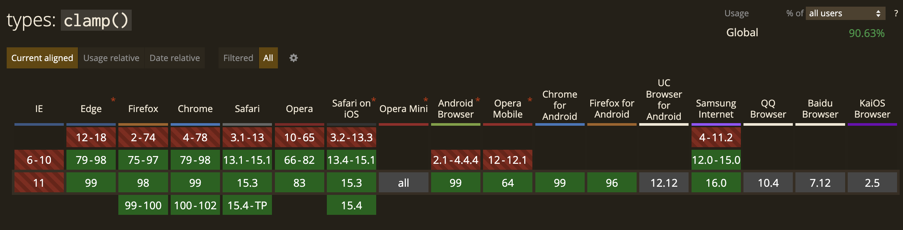

## 3. min()

### 基本使用

`min()` 函数方法接受一个或多个用逗号分隔的表达式作为他的参数，数值最小的表达式的值将会作为指定的属性的值。

`min()` 的实际用途：以包含元素响应上下文的方式，在最大允许值上设置边界。尽管是 `min()` 函数，但结果是提供的值将作为属性允许的最大值。

下面来看一个简单的例子，希望元素的最大宽度为500px：

```css
.element {
  width: min(50%, 500px);
}
```

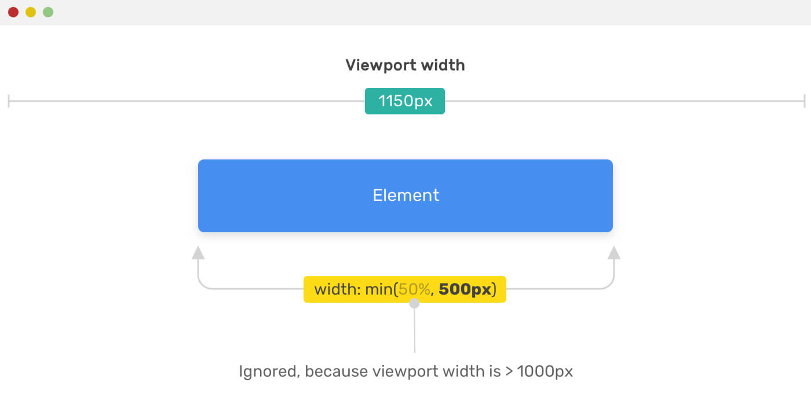

浏览器必须选择最小的值（50%，500px）。选择该选项取决于视口宽度。如果50%的计算值大于500px，那么它将被忽略，而使用500px。否则，如果50%的计算值小于500px，则50%将用作宽度值。视口宽度为1000px：

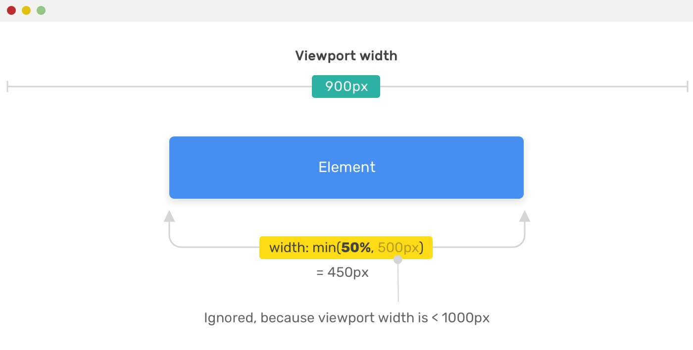

### 容器宽度

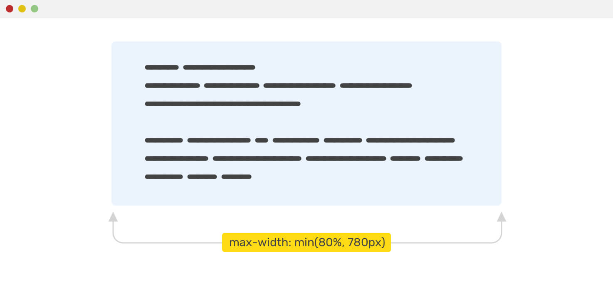

有一个容器的宽度是其父级宽度的80%，并且宽度不应超过780px，那么该如何写：

```css
.container {
  max-width: 780px;
  width: 80%;
}
```

如果使用 `min()` 函数，就可以这样设置最大值，代码简洁了很多：

```css
.container {
  max-width: min(80%, 780px);
}
```

### 平滑渐变

在 CSS 中使用渐变时，可能需要通过使颜色之间的过渡更平滑一些来针对移动设备进行一些调整。来看一个例子：

```css
.element {
  background: linear-gradient(135deg, #2c3e50, #2c3e50 60%, #3498db);
}
```

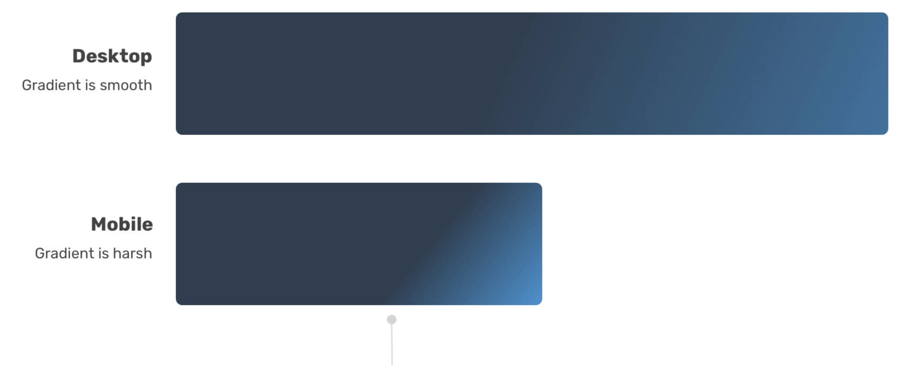\
在移动设备中，这个颜色渐变就会有一条分割线，不是很好看。可以通过媒体查询来解决这个问题：

```css
@media (max-width: 700px) {
  .element {
    background: linear-gradient(135deg, #2c3e50, #2c3e50 25%, #3498db);
  }
}
```

虽然这样是可行的，但我们可以使用CSS 中的 min() 函数使这个颜色渐变更加动态：

```css
.element {
  background: linear-gradient(135deg, #2c3e50, #2c3e50 min(20vw, 60%), #3498db);
}
```

这样颜色渐变就看起来顺滑了很多：

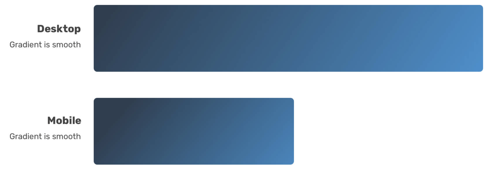

### 注意事项

* 表达式中的操作数可以是任何长度值。表达式中的每个值可以使用不同的单位。必要时，还可以使用括号来确定计算顺序。
* 通常需要组合 `min()`和 `max()`的值，或者在 `clamp()` 或 `calc()` 函数中使用 `min()`。
* 如果需要应用多个长度约束，则可以提供两个以上的参数。

### 浏览器兼容性

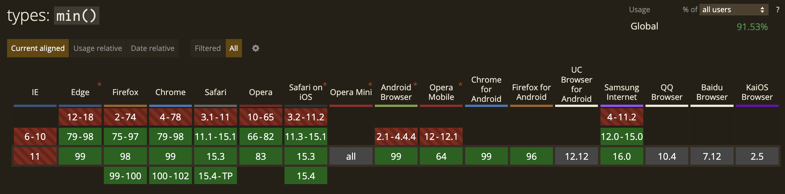

## 4. max()

### 基本使用

`max()` 函数方法接受一个或多个用逗号分隔的表达式作为他的参数，数值最大的表达式的值将会作为指定的属性的值。

`max()` 的实际用途：以包含元素响应上下文的方式，在最小允许值上设置边界。

下面来看一个简单的例子，通常，页面的侧边栏有一个固定的宽度，而主宽度是灵活大小的。如果视口足够大，可以使侧边栏更具动态性以占用更多空间。为此，需要使用 `max()` 函数为其设置**最小宽度。**

```css
.wrapper {
  display: flex;
}

aside {
  flex-basis: max(30vw, 150px);
}

main {
  flex-grow: 1;
}
```

侧边栏的最小宽度为150px，如果视口宽度大于500px（500\*30%=150），则最小宽度为30vw。

### 浏览器兼容性

### 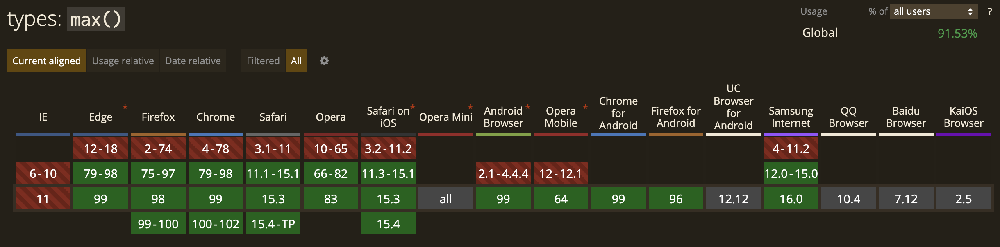

参考：

1. <https://moderncss.dev/practical-uses-of-css-math-functions-calc-clamp-min-max/>
2. <https://ishadeed.com/article/css-min-max-clamp/>


> 更新: 2022-04-04 23:02:02  
> 原文: <https://www.yuque.com/cuggz/feplus/toonbe>