# 颜色

<font style="color:rgb(18, 18, 18);">在 CSS 中颜色无处不在，它们可以作为文字、背景、阴影、表格、边框、链接等属性。</font>我们在 CSS 中使用的大多数颜色都是 hex 和 RGB，其实表示颜色的方式有很多，下面就来看看CSS中的颜色体系。

## 1. CSS 命名颜色
CSS中提供了148个命名颜色，所有浏览器都支持这些名称，这些名称都是被预定义过色值的。下面是部分颜色名称以及对应的十六进制颜色值：

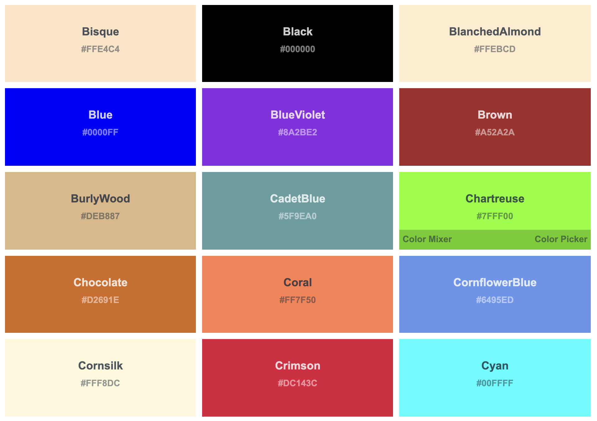

查看所有预定义颜色名称：[https://www.w3schools.com/colors/colors_names.asp](https://www.w3schools.com/colors/colors_names.asp)


下面是使用颜色名称的示例：

```css
div {
	color: black;
  border: 1px solid blueviolet;
  background: skyblue;
}
```

注意：<font style="color:rgb(9, 9, 9);">所有命名颜色都不区分大小写。</font>

<font style="color:rgb(9, 9, 9);"></font>

<font style="color:rgb(9, 9, 9);">除了颜色名称，还有一些其他命名的颜色和关键字值得一提：</font>

#### <font style="color:rgb(9, 9, 9);">（1）transparent</font>
<font style="color:rgb(9, 9, 9);">transparent关键字用作rgba(0, 0, 0, 0)的快捷方式，它表示完全透明。该关键字目前在所有浏览器都是支持的。</font><font style="color:rgb(51, 51, 51);"> 它是background-color属性的默认值。</font>

```css
div {
	background-color:transparent;
}
```

#### （2）currentColor
currentColor <font style="color:rgb(9, 9, 9);">表示当前的颜色。如果没有指定，就会从父容器继承的文本颜色。所以，以下 CSS 规则是等效的：</font>

```css
div {
  color: red;
  background-color: currentColor;
}

div {
  color: red;
  background-color: red;
}
```

该属性在SVG中使用时很方便，可以将指定的填充或描边颜色设置为currentColor，以确保SVG颜色与其父级的文本颜色匹配。

#### （3）inherit
inherit<font style="color:rgb(9, 9, 9);"> 是一个保留字，它不局限于颜色，表示该属性采用与元素父级的属性相同的值。对于继承的属性，主要用途就是覆盖另一个规则。</font>

#### <font style="color:rgb(9, 9, 9);">（4）系统颜色</font>
<font style="color:rgb(9, 9, 9);">还有一些其他特殊的颜色关键字，它们用来匹配一些系统元素，旨在保持浏览器上应用程序的一致性。系统颜色成对出现：背景颜色-前景颜色。下面是系统颜色相关关键字：</font>

| **<font style="color:rgb(9, 9, 9);">背景颜色</font>** | **<font style="color:rgb(9, 9, 9);">前景颜色</font>** |
| :---: | :---: |
| buttonFace | buttonText |
| canvas | activeText<font style="color:rgb(9, 9, 9);">   </font>canvasText<font style="color:rgb(9, 9, 9);">   </font>linkText<font style="color:rgb(9, 9, 9);">   </font>visitedText |
| field | fieldText |
| highlight | highlightText |


<font style="color:rgb(9, 9, 9);">下面是不同浏览器对系统颜色支持：</font>

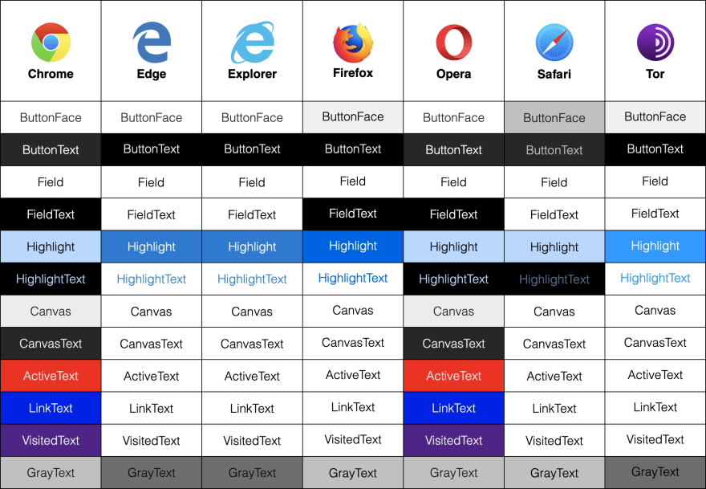

## 2. <font style="color:rgb(41, 41, 41);">RGB 颜色</font>
<font style="color:rgb(41, 41, 41);"> RGB 值也是我们常用的颜色表示方式。RGB 指的就是红-绿-蓝，这个顺序非常重要。每种颜色使用 0 到 255 之间的数字指定。最常见的 RGB 值黑色：rgb(0,0,0) 和白色：rgb(255,255,255)。</font><font style="color:rgb(51, 51, 51);">RGB表示法使我们以更易读的形式来访问与十六进制值相同的颜色范围。</font>

<font style="color:rgb(41, 41, 41);"></font>

下面是使用<font style="color:rgb(41, 41, 41);">RGB 值表示颜色</font>的示例：

```css
div {
	color: rgb(0,0,0);
  border: 1px solid rgb(155,55,89);
  background: rgb(255,255,255);
}
```

<font style="color:rgb(41, 41, 41);">除此之外，我们还可以使用名为rgba() 的属性为 rgb 值</font><font style="color:rgb(25, 25, 25);">定义 alpha 值，alpha 值是透明度的百分比</font><font style="color:rgb(41, 41, 41);">。它类似于 rgb，但允许添加第四个值。不透明度范围可以是 0 到 1 之间的任何值，0 是最小值（无不透明度），1 是最大值（完全不透明度）：</font>

```css
div {
	color: rgba(0,0,0,0.5);
  border: 1px solid rgba(255,0,0,0.8);
  background: rgba(0,125,0,0.2);
}
```

<font style="color:rgb(9, 9, 9);">注意，十六进制颜色值不区分大小写。所以，#ff0000、#FF0000、#Ff0000的显示效果是一致的。</font>

## <font style="color:rgb(41, 41, 41);">3. Hex 颜色</font>
我们还可以使用十六进制值来表示 CSS 中的颜色，这也是我们用的最多的颜色表示方式。十六进制使用 16 个符号表示，使用 0 - 9 表示值 0 到 9，A - F 表示值 10 到 15，如下：

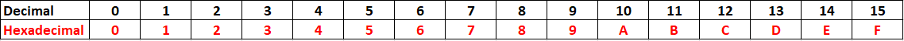

<font style="color:rgb(41, 41, 41);">在 CSS 中，使用 6 个十六进制数字来表示颜色。这意味着分别使用两个数字来表示红色 (R)、绿色 (G) 和蓝色 (B) 分量。例如，#000000表示黑色，它是最小的十六进制值；#FFFFFF表示白色，它是最大的十六进制值。</font>

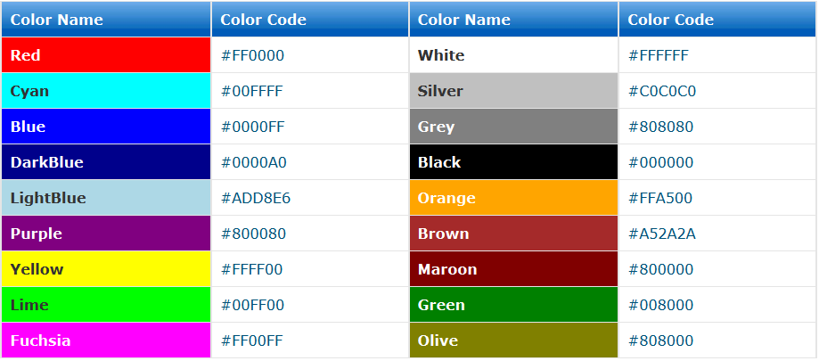

下面是使用颜色名称的示例：

```css
div {
	color: #000000;
  border: 1px solid #00FF00;
  background: #FF0000;
}
```

<font style="color:rgb(41, 41, 41);">我们也可以使用 3 个值（每种颜色一个）来缩短十六进制值，</font><font style="color:rgb(77, 77, 77);">如果每两位的值相同，就可以缩写一半：</font>

```css
div {
	color: #000;
  border: 1px solid #0F0;
  background: #F00;
}
```

<font style="color:rgb(51, 51, 51);">我们也可以给十六进制</font><font style="color:rgb(25, 25, 25);">颜色定义 alpha 值，alpha 值是透明度的百分比。在十六进制代码中，将另外两位数字添加到六位数字序列中，形成一个八位数字序列。例如，要在十六进制代码中设置黑色</font><font style="color:rgb(25, 25, 25);">#000000</font><font style="color:rgb(25, 25, 25);">，要添加 50% 的透明度，可以将其更改为</font><font style="color:rgb(25, 25, 25);">#00000080</font><font style="color:rgb(25, 25, 25);">。</font>

<font style="color:rgb(51, 51, 51);"></font>

<font style="color:rgb(51, 51, 51);">可以看到，十六进制颜色值是很难阅读的。我们基本不太可能通过读取十六进制值来猜测元素的颜色。</font>

## 4. <font style="color:rgb(41, 41, 41);">HSL 颜色</font>
<font style="color:rgb(25, 25, 25);">HSL 全称是 </font><font style="color:rgb(9, 9, 9);">Hue-Saturation-Lightness，分别表示</font><font style="color:rgb(25, 25, 25);">色</font><font style="color:rgb(9, 9, 9);">调、饱和度和亮度。它基于 RGB 色轮的。每种颜色都有一个角度以及饱和度和亮度值的百分比值。下</font><font style="color:rgb(25, 25, 25);">面就先来了解一下这三个概念，</font>

+ **<font style="color:rgb(25, 25, 25);">色调：</font>**<font style="color:rgb(25, 25, 25);">色调描述了色轮上的值，从 0 到 360 度，从红色开始（0 和 360）；</font>

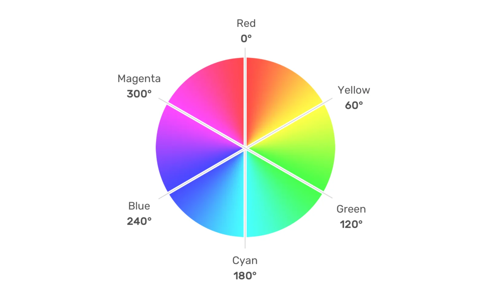

+ **饱和度：**<font style="color:rgb(25, 25, 25);">饱和度是所选色调的鲜艳程度</font><font style="color:rgb(9, 9, 9);">，100% 表示完全饱和的亮色，0% 表示完全不饱和的灰色；</font>

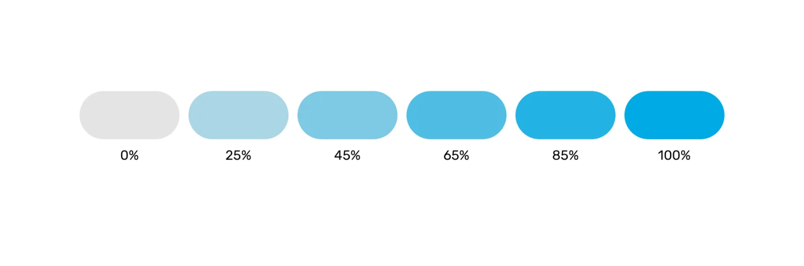

+ **<font style="color:rgb(9, 9, 9);">亮度：</font>**<font style="color:rgb(9, 9, 9);">颜色的亮度级别，较低的值会更暗，更接近黑色，较高的值会更亮，更接近白色。</font>

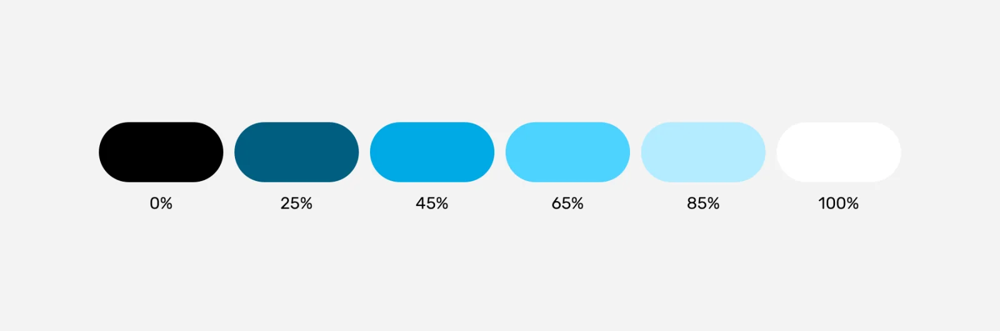

<font style="color:rgb(9, 9, 9);">HSL颜色函数的表示形式如下：</font>

```css
hsl(Hue, Saturation, Lightness)
```

其中Hue是色调值，即在色轮上的位置，可以是 0到360deg之间的任何值，该参数还可以接

角度单位 turn（圈）和无单位。下面三种规则的显式效果是一样的：

```css
div {
  background-color: hsl(180deg, 50%, 50%);
}

div {
  background-color: hsl(0.5turn, 50%, 50%);
}

div {
  background-color: hsl(180, 50%, 50%);
}
```

一些常见的HSL颜色值：

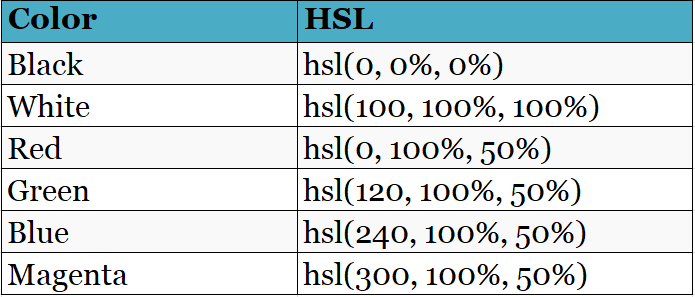

除此之外，HSL颜色值也可以添加alpha值，表示透明度，其使用形式如下：

```css
hsla(Hue, Saturation, Lightness / alpha)
```

这里就不再需要用逗号分隔值，而使用斜杠，比如：

```css
div {
  background-color: hsl(0 100% 50% / 0.5);
}
```

## 5. HWB 颜色
HWB 全称为<font style="color:rgb(9, 9, 9);">Hue-Whiteness-Blackness，</font>表示色调、白度和黑度。

+ <font style="color:rgb(9, 9, 9);">色调：色轮中的一个角度；</font>
+ <font style="color:rgb(9, 9, 9);">白度：表示要混合的白色量的百分比。值越高，颜色越白。</font>
+ <font style="color:rgb(9, 9, 9);">黑度：表示要混合的黑色量的百分比。值越高，颜色越黑。</font>


与 HSL 一样，色调可以是 0 到 360 内的任何值。黑度和白度用来控制有多少黑色和白色混合在已选色调中，它们也是0-100%之间的值，当为100%时，就会出现全黑或者全白。如果等量的白色或者黑色混合在一起，颜色就会变得越来越灰。这个函数对于创建单色调色板非常有用：

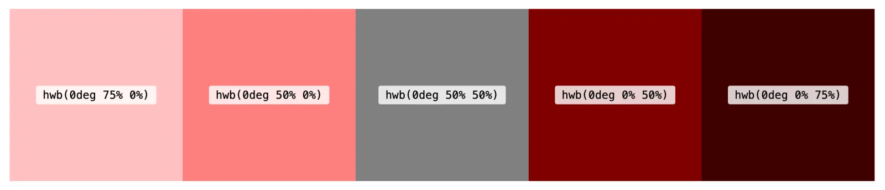

hwb()也可以添加alpha值来表示透明度，也使用斜杠来分隔：

```css
hwb(194 0% 0%) 
hwb(194 0% 0% / .5) 
```

注意：<font style="color:rgb(9, 9, 9);">这种颜色格式目前只在Safari 15上得到了支持，谨慎使用。</font>

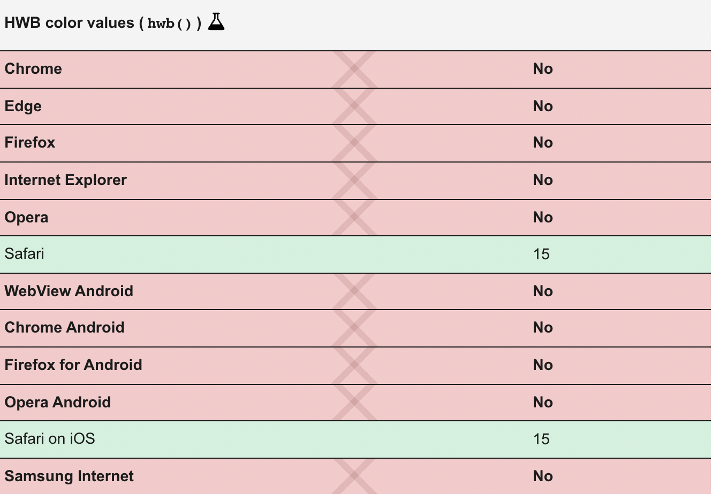

## 6. LAB 颜色
LAB 是一个可以在 Photoshop 等软件中访问的颜色空间，<font style="color:rgb(27, 27, 27);">它代表了人类可以看到的整个颜色范围。</font>它使用三个轴表示：亮度、a 轴和b 轴。

+ **<font style="color:rgb(9, 9, 9);">亮度：</font>**<font style="color:rgb(9, 9, 9);">从黑色到白色。值越低，颜色越接近黑色。</font>
+ **<font style="color:rgb(9, 9, 9);">a轴：</font>**<font style="color:rgb(9, 9, 9);">从绿色到红色。较低的值接近绿色，较高的值更接近红色。</font>
+ **<font style="color:rgb(9, 9, 9);">b轴：</font>**<font style="color:rgb(9, 9, 9);">从蓝色到黄色。较低的值接近蓝色，越高的值更接近黄色。</font>


亮度的值可以是任意百分比，不限于0%和100%，可以超过 100%。超亮白色可以使用高达 400% 的百分比。a和b轴的值可以是正值或者负值。两个负值将导致颜色朝向光谱的绿色/蓝色端，而两个正值可以产生更橙色/红色的色调。所有参数由空格分隔：

```css

div {
  background-color: lab(80% 100 50);
}

div {
  background-color: lab(80% -80 -100);
}
```

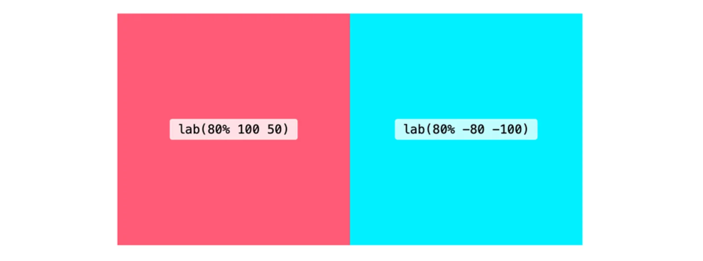

lab()也可以添加alpha值来表示透明度，也使用斜杠来分隔：

```css
div {
  background-color: lab(80% -80 -100 / .5);
}
```

注意：<font style="color:rgb(9, 9, 9);">这种颜色格式目前只在Safari 15上得到了支持，谨慎使用。</font>

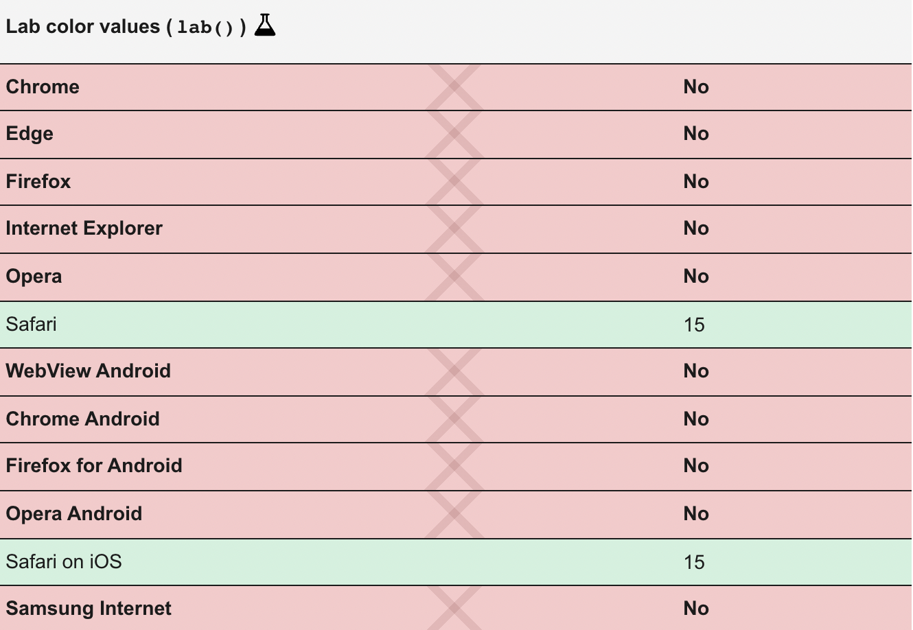

## 7. LCH 颜色
LCH <font style="color:rgb(9, 9, 9);">代表亮度、色度和色调。它与 Lab 具有相同的 L 值，但不是使用坐标 a* 和 b*，而是使用 C（色度）和 H（色调</font>）。色调可以是 0 到 360 之间的值。色度代表颜色的量，它类似于 HSL 中<font style="color:rgb(9, 9, 9);">的饱和度。但是色度值可以超过 100</font>，理论上它是无上限的。

```css
div {
  background-color: lch(80% 100 50);
}
```

对于色度值，目前的浏览器和显示器可以显示颜色量是有限的，只有0-230之间的值是有用的，超过之后就和230的差异就不大了：

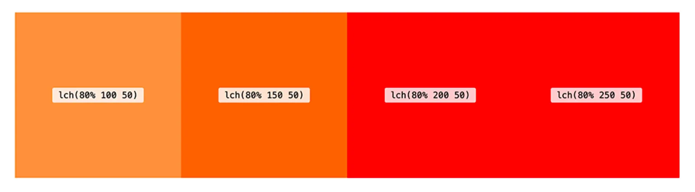

这个方法也可以添加第四个可选参数 alpha。该函数遵循空格分隔（alpha 带有斜杠）：

```css
div {
  background-color: lch(80% 100 50 / .5);
}
```

注意：<font style="color:rgb(9, 9, 9);">这种颜色格式目前只在Safari 15上得到了支持，谨慎使用。</font>


那为什么有了 HSL还需要 LAB 和 LCH 呢？因为使用 LAB 或 LCH 可以获得更大范围的颜色。LCH 和 LAB 旨在让我们能够接触到人类视觉的整个范围。除此之外，HSL 和 RGB 在感知上并不均匀，并且在 HSL 中，增加或减少亮度会根据色调产生完全不同的效果。

## 8. CMYK 颜色
<font style="color:rgb(9, 9, 9);">CMYK 代表 Cyan、Magenta、Yellow 和 Key，它们与打印机中的墨水颜色相匹配。虽然屏幕通常以 RGB 来显示颜色，而打印机通常使用青色、品红色、黄色和黑色的组合来表示颜色，这些是最常见的墨水颜色。</font>

<font style="color:rgb(9, 9, 9);"></font>

<font style="color:rgb(9, 9, 9);">可以使用device-cmyk()来指定CMYK颜色，使用空格来分隔参数，也可以添加alpha值来设置透明度。</font>

```css
div {
  background-color: device-cmyk(1 0 0 0);
}
```

注意，该方法存在兼容性问题，谨慎使用。

## 9. 颜色混合
在 CSS Color Module Level 5 提案中提出了颜色混合的概念和相关方法 color-mix()，该方法可以混合了两种颜色，类似于 Sass 中的mix()函数。color-mix() 允许我们指定颜色空间，默认使用 LCH，具有出色的混合效果。可以指定每种颜色混合多少：

```css
div {
  background-color: color-mix(in lch, red, blue);
}

div {
	background-color: color-mix(in lch, red 30%, 70% blue);
}
```

注意：这种颜色格式目前只在Safari 15上得到了支持，谨慎使用。


> 更新: 2022-01-27 16:47:11  
> 原文: <https://www.yuque.com/cuggz/feplus/gsc2fv>