# 实现3D骰子

在CSS 中创建 3D 骰子，通过本文可以学到以下知识；

* 使用 CSS 中的 `transform` 来定义3D形状；
* 使用 CSS 中的 Flex 布局来实现骰子布局；
* 使用 CSS 中的 Grid 布局来实现骰子布局。

## 1. 使用 Flex 布局实现六个面

首先，来定义骰子六个面的 HTML 结构：

```html
<div class="dice-box">
  <div class="dice first-face">
    <span class="dot"></span>
  </div>
  <div class="dice second-face">
    <span class="dot"></span>
    <span class="dot"></span>
  </div>
  <div class="dice third-face">
    <span class="dot"></span>
    <span class="dot"></span>
    <span class="dot"></span>
  </div>
  <div class="dice fourth-face">
    <div class="column">
      <span class="dot"></span>
      <span class="dot"></span>
    </div>
    <div class="column">
      <span class="dot"></span>
      <span class="dot"></span>
    </div>
  </div>
  <div class="fifth-face dice">
    <div class="column">
      <span class="dot"></span>
      <span class="dot"></span>
    </div>
    <div class="column">
      <span class="dot"></span>
    </div>
    <div class="column">
      <span class="dot"></span>
      <span class="dot"></span>
    </div>
  </div>
  <div class="dice sixth-face">
    <div class="column">
      <span class="dot"></span>
      <span class="dot"></span>
      <span class="dot"></span>
    </div>
    <div class="column">
      <span class="dot"></span>
      <span class="dot"></span>
      <span class="dot"></span>
    </div>
  </div>
</div>

```

下面来实现**每个面**和**每个点**的的基本样式：

```css
.dice {
  width: 200px;  
  height: 200px;  
  padding: 20px;  
  background-color: tomato;
  border-radius: 10%;
}

.dot {
   display: inline-block;
   width: 50px;
   height: 50px;
   border-radius: 50%;
   background-color: white;
}
```

实现效果如下：

、

### （1）一个点

HTML 结构如下：

```html
<div class="dice first-face">
  <span class="dot"></span>
</div>
```

实现第一个面，只需要让它水平和垂直方向都居中即可：

* `justify-content:center`：使点与主轴（水平）的中心对齐。
* `align-items:center`：使点与交叉轴（垂直）的中心对齐。

代码实现如下：

```css
.first-face {
  display: flex;
  justify-content: center;
  align-items: center;
}
```

现在第一面是这样的：


### （2）两个点

HTML 结构如下：

```html
<div class="dice second-face">
  <span class="dot"></span>
  <span class="dot"></span>
</div>
```

首先来将第二个面的父元素设置为flex布局，并添加以下属性：

* `justify-content: space-between`：将子元素放置在 flex 容器的开头和结尾。

```css
.second-face {
   display: flex;
   justify-content : space-between;
}
```

现在点的位置如下：

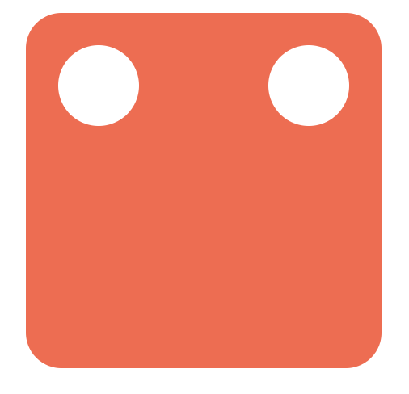

这时，第一个点在正确的位置：左上角。而第二个点需要再右下角。因此，下面来使用 align-self 属性单独调整第二个点的位置：

* `align-self: flex-end`：将项目对齐到 Flex 容器的末尾。

```css
.second-face .dot:nth-of-type(2) {
	align-self: flex-end;
}
```

现在第二面是这样的：

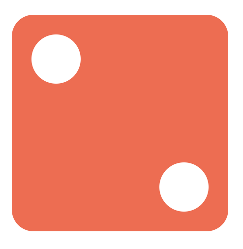

### （3）三个点

HTML 结构如下：

```html
<div class="dice third-face">
  <span class="dot"></span>
  <span class="dot"></span>
  <span class="dot"></span>
</div>
```

可以通过在第二面放置另一个中心点来实现第三面。

* `align-self: flex-end`：将项目对齐到 Flex 容器的末尾。
* `align-self: center`：将项目对齐到 Flex 容器的中间。

```css
.third-face {
	display: flex;
  justify-content : space-between;
}

.third-face .dot:nth-of-type(2) {
	align-self: center;
}

.third-face .dot:nth-of-type(3) {
	align-self: flex-end;
}
```

现在第三面是这样的：


如果想要第一个点在右上角，第三个点在左下角，可以将第一个点的 align-self 更改为 flex-end，第二个点不变，第三个点无需设置，默认在最左侧：

```css
.third-face {
	display: flex;
  justify-content : space-between;
}

.third-face .dot:nth-of-type(1) {
	align-self :flex-end;
}

.third-face .dot:nth-of-type(2) {
	align-self :center;
}
```

现在第三面是这样的：


### （4）四个点

HTML 结构如下：

```html
<div class="dice fourth-face">
  <div class="column">
    <span class="dot"></span>
    <span class="dot"></span>
  </div>
  <div class="column">
    <span class="dot"></span>
    <span class="dot"></span>
  </div>
</div>
```

在四个点的面中，可以将其分为两行，每行包含两列。一行将在 flex-start ，另一行将在 flex-end 。并添加 justify-content: space-between 以便将其放置在骰子的左侧和右侧。

```css
.fourth-face {
	display: flex;
	justify-content: space-between
}
```

接下来需要对两列点分别进行布局：

* 将列设置为 `flex` 布局；
* 将 `flex-direction` 设置为 `column`，以便将点放置在垂直方向上
* 将 `justify-content` 设置为 `space-between`，它将使第一个点在顶部，第二个点在底部。

```css
.fourth-face .column {
	display: flex;
  flex-direction: column;
  justify-content: space-between;
}
```

现在第四面是这样的：

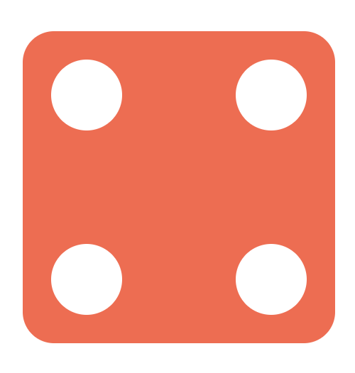

### （5）五个点

HTML 结构如下：

```html
<div class="fifth-face dice">
  <div class="column">
    <span class="dot"></span>
    <span class="dot"></span>
  </div>
  <div class="column">
    <span class="dot"></span>
  </div>
  <div class="column">
    <span class="dot"></span>
    <span class="dot"></span>
  </div>
</div>
```

第五面和第四面的差异在于多了中间的那个点。所以，可以基于第四面，来在中间增加一列，样式如下：

```css
.fifth-face {
	display: flex;
	justify-content: space-between
}

.fifth-face .column {
	display: flex;
  flex-direction: column;
  justify-content: space-between;
}
```

现在第五面是这样的：

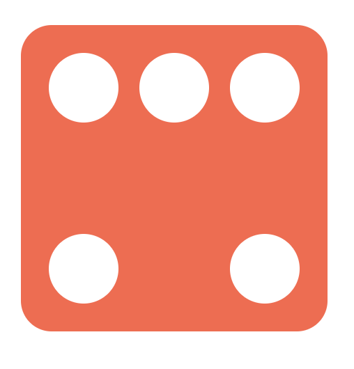

还需要对中间的点进行调整，可以设置 justify-content 为 center 让它垂直居中：

```css
.fifth-face .column:nth-of-type(2) {
	justify-content: center;
}
```

现在第五面是这样的：

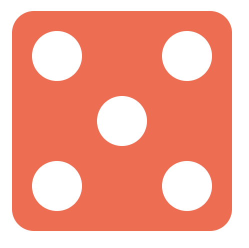

### （6）六个点

HTML 结构如下：

```html
<div class="dice sixth-face">
  <div class="column">
    <span class="dot"></span>
    <span class="dot"></span>
    <span class="dot"></span>
  </div>
  <div class="column">
    <span class="dot"></span>
    <span class="dot"></span>
    <span class="dot"></span>
  </div>
</div>
```

第六个面的布局和第四个几乎完全一样，只不过每一列多了一个元素，布局实现如下：

```css
.sixth-face {
	display: flex;
	justify-content: space-between
}
	
.sixth-face .column {
	display: flex;
  flex-direction: column;
  justify-content: space-between;
}
```

现在第六面是这样的：

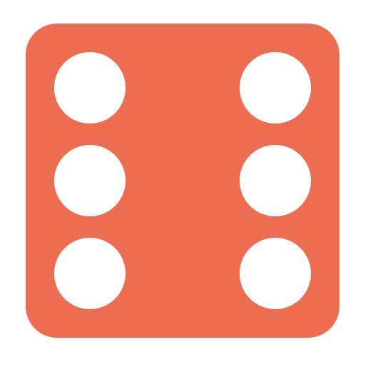

## 2. 使用 Grid 布局实现六个面

骰子每个面其实可以想象成一个 3 x 3 的网格，其中每个单元格代表一个点的位置：

```css
+---+---+---+
| a | b | c |
+---+---+---+
| d | e | f |
+---+---+---+
| g | h | i |
+---+---+---+
```

要创建一个 3 x 3 的网格，只需要设置一个容器元素，并且设置三个大小相同的行和列：

```css
.dice {
    display: grid;
    grid-template-rows: 1fr 1fr 1fr;
    grid-template-columns: 1fr 1fr 1fr;
}
```

这里的 fr 单位允许将行或列的大小设置为网格容器可用空间的一部分，这上面的例子中，我们需要三分之一的可用空间，所以设置了 1fr 三次。

我们还可以使用 repeat(3, 1fr) 将 1fr 重复 3 次，来代替 1fr 1fr 1fr。还可以使用定义行/列的 `grid-template` 速记属性将上述代码进行简化：

```css
.dice {
    display: grid;
    grid-template: repeat(3, 1fr) / repeat(3, 1fr);
}
```

每个面所需要定义的 HTML 就像是这样：

```html
<div class="dice">
  <span class="dot"></span>
  <span class="dot"></span>
  <span class="dot"></span>
  <span class="dot"></span>
</div>
```

所有的点将自动放置在每个单元格中，从左到右：


现在我们需要为每个骰子值定位点数。开始时我们提到，可以将每个面分成 3 x 3 的表格，但是这些表格并不是每一个都是我们需要的，分析骰子的六个面，可以发现，我们只需要以下七个位置的点：

```html
+---+---+---+
| a |   | c |
+---+---+---+
| e | g | f |
+---+---+---+
| d |   | b |
+---+---+---+
```

我们可以使用 `grid-template-areas` 属性将此布局转换为 CSS：

```css
.dice {
  display: grid;
  grid-template-areas:
    "a . c"
    "e g f"
    "d . b";
}
```

因此，我们可以不使用传统的单位来调整行和列的大小，而只需使用名称来引用每个单元格。其语法本身提供了网格结构的可视化，名称由网格项的网格区域属性定义。 中间列中的句点表示一个空单元格。

下面来使用 `grid-area` 属性为网格项命名，然后，网格模板可以通过其名称引用该项目，以将其放置在网格中的特定区域中。 `:nth-child()` 伪选择器允许单独定位每个点。

```css
.dot:nth-child(2) {
    grid-area: b;
}

.dot:nth-child(3) {
    grid-area: c;
}

.dot:nth-child(4) {
    grid-area: d;
}

.dot:nth-child(5) {
    grid-area: e;
}

.dot:nth-child(6) {
    grid-area: f;
}
```

现在六个面的样式如下：

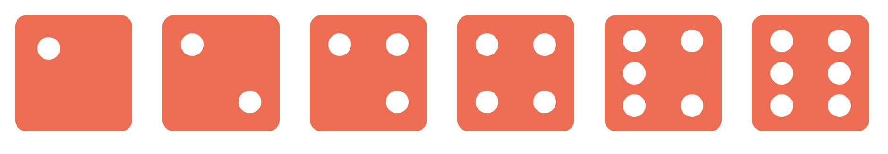

可以看到，1、3、5的布局仍然是不正确的，只需要重新定位每个骰子的最后一个点即可：

```css
.dot:nth-child(odd):last-child {
    grid-area: g;
}
```

这时所有点的位置都正确了：

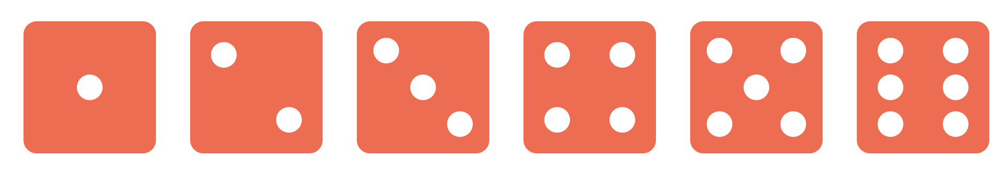

对于上面的 CSS，对应的 HTML分别是父级为一个div标签，该面有几个点，子级就有几个span标签。代码如下：

```html
<div class="dice-box">
  <div class="dice first-face">
    <span class="dot"></span>
  </div>
  <div class="dice second-face">
    <span class="dot"></span>
    <span class="dot"></span>
  </div>
  <div class="dice third-face">
    <span class="dot"></span>
    <span class="dot"></span>
    <span class="dot"></span>
  </div>
  <div class="dice fourth-face">
    <span class="dot"></span>
    <span class="dot"></span>
    <span class="dot"></span>
    <span class="dot"></span>
  </div>
  <div class="fifth-face dice">
    <span class="dot"></span>
    <span class="dot"></span>
    <span class="dot"></span>
    <span class="dot"></span>
    <span class="dot"></span>
  </div>
  <div class="dice sixth-face">
    <span class="dot"></span>
    <span class="dot"></span>
    <span class="dot"></span>
    <span class="dot"></span>
    <span class="dot"></span>
    <span class="dot"></span>
  </div>
</div>
```

整体的 CSS 代码如下：

```css
.dice {
  width: 200px;  
  height: 200px;  
  padding: 20px;  
  background-color: tomato;
  border-radius: 10%;
  display: grid;
  grid-template: repeat(3, 1fr) / repeat(3, 1fr);
  grid-template-areas:
    "a . c"
    "e g f"
    "d . b";
}

.dot {
  display: inline-block;
  width: 50px;
  height: 50px;
  border-radius: 50%;
  background-color: white;
}

.dot:nth-child(2) {
  grid-area: b;
}

.dot:nth-child(3) {
  grid-area: c;
}

.dot:nth-child(4) {
  grid-area: d;
}

.dot:nth-child(5) {
  grid-area: e;
}

.dot:nth-child(6) {
  grid-area: f;
}

.dot:nth-child(odd):last-child {
  grid-area: g;
}
```

## 3. 实现 3D 骰子

上面我们分别使用 Flex 和 Grid 布局实现了骰子的六个面，下面来这将六个面组合成一个正方体。

首先对六个面进行一些样式修改：

```css
.dice {
  width: 200px;  
  height: 200px;  
  padding: 20px;
  box-sizing: border-box;
  opacity: 0.7;
  background-color: tomato;
  position: absolute;
}
```

定义它们的父元素：

```css
.dice-box {
  width: 200px;
  height: 200px;
  position: relative;
  transform-style: preserve-3d;
  transform: rotateY(185deg) rotateX(150deg) rotateZ(315deg);
}
```

其中，`transform-style: preserve-3d;` 表示所有子元素在3D空间中呈现。这里的transform 的角度不重要，主要是便于后面查看。

此时六个面的这样的：

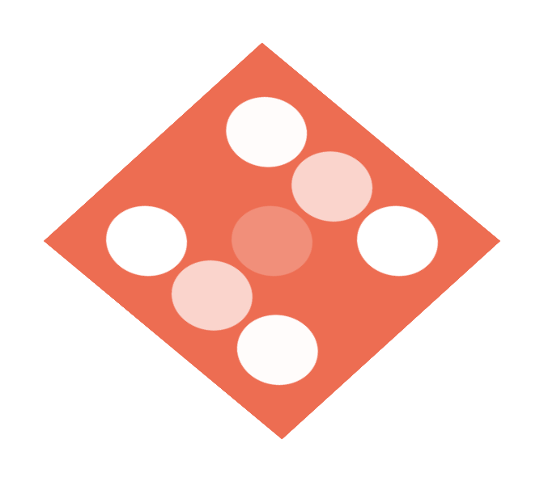

看起来有点奇怪，所有面都叠加在一起。不要急，我们来一个个调整位置。

首先将第一个面在 Z 轴移动 100px：

```css
.first-face {
  transform: translateZ(100px);
}
```

第一面就到了所有面的上方：


因为每个面的宽高都是 200px，所以将第六面沿 Z 轴向下调整 100px：

```css
.sixth-face {
  transform: translateZ(-100px);
}
```

第六面就到了所有面的下方：

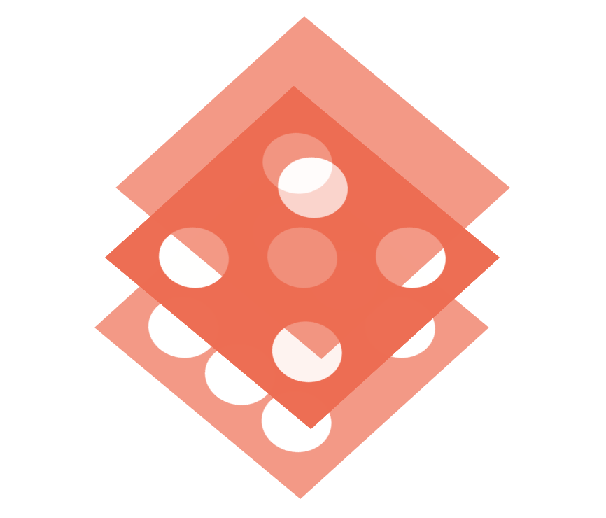

下面来调整第二面，将其在X轴向后移动 100px，并沿着 Y 轴旋转 -90 度：

```css
.second-face {
  transform: translateX(-100px) rotateY(-90deg);
}
```

此时六个面是这样的：

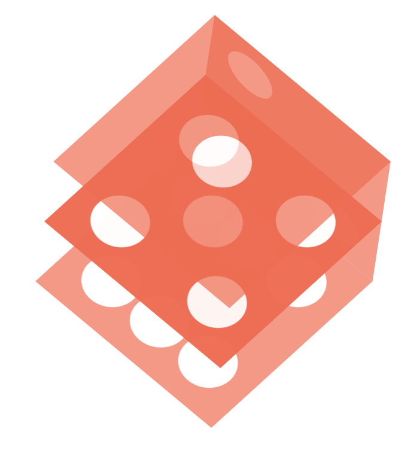

下面来调整第二面的对面：第五面，将其沿 X 轴的正方向移动 100px，并沿着 Y 轴方向选择 90 度：

```css
.fifth-face {
  transform: translateX(100px) rotateY(90deg);
}
```

此时六个面是这样的：

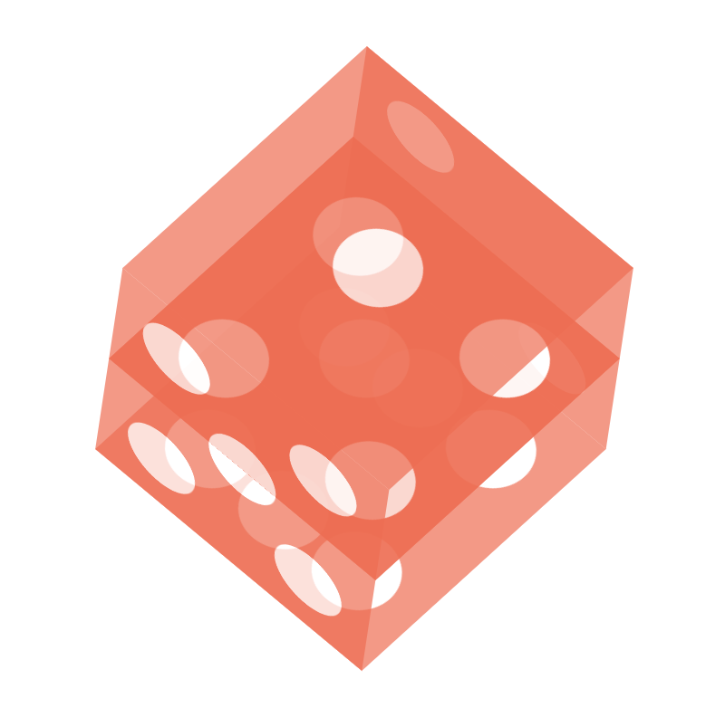

下面来调整第三面，道理同上：

```css
.third-face {
  transform: translateY(100px) rotateX(90deg);
}
```

此时六个面是这样的：

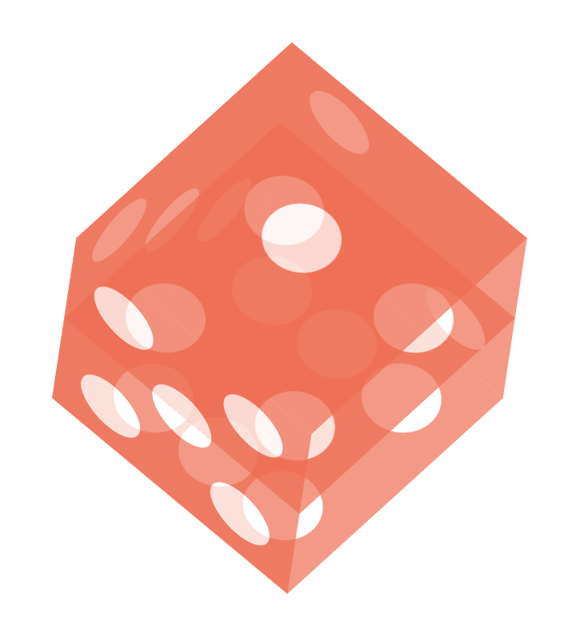

最后来调整第五面：

```css
.fourth-face {
  transform: translateY(-100px) rotateX(90deg);
}
```

此时六个面就组成了一个完整的正方体：

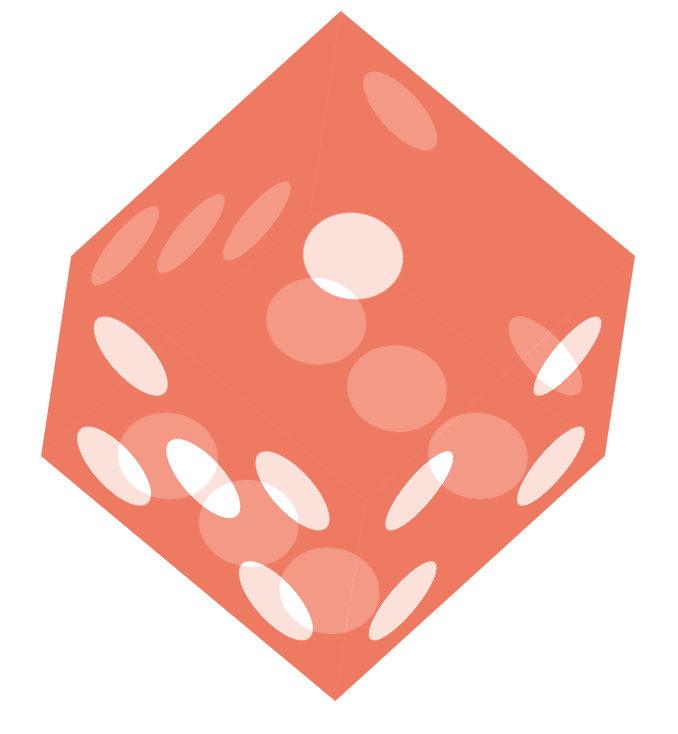

下面来为这个骰子设置一个动画，让它转起来：

```css
@keyframes rotate {
  from {
    transform: rotateY(0) rotateX(45deg) rotateZ(45deg);
  }
  to {
    transform: rotateY(360deg) rotateX(45deg) rotateZ(45deg);
  }
}

.dice-box {
  animation: rotate 5s linear infinite;
}
```

最终的效果如下：

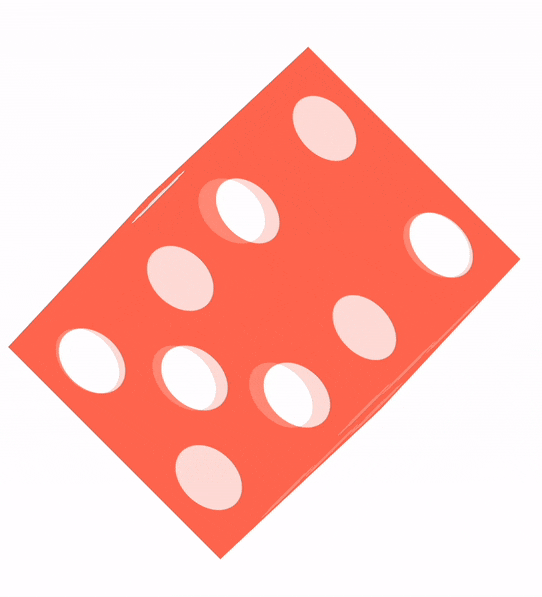

在线体验-3D 骰子-Flex：

[codepen](https://codepen.io/cugergz/embed/jOzYGyV)

在线体验-3D 骰子-Grid：

[codepen](https://codepen.io/cugergz/embed/GROMgEe)


> 更新: 2022-08-09 17:06:20  
> 原文: <https://www.yuque.com/cuggz/feplus/nfasg5>