# 实现三角形

CSS 提供了三种出色的方法可以实现基本的形状。本文就来看看如何使用这些方法来实现一个三角形。三种方法如下：

* border；
* linear-gradient；
* clip-path。

## 1. border

使用 CSS 绘制三角形的第一种方法就是使用 **border** 属性。

给定一个宽度和高度都为 0 的元素，其 border 的任何值都会直接相交，我们可以利用这个交点来创建三角形。也就是说，border属性是三角形组成的，下面给每一边都提供不同的边框颜色：

```css
.triangle {
    width: 0;
    height: 0;
    border: 100px solid;
    border-color: orangered skyblue gold yellowgreen;
}
```

将元素的长宽都设置为0，效果是这样的：

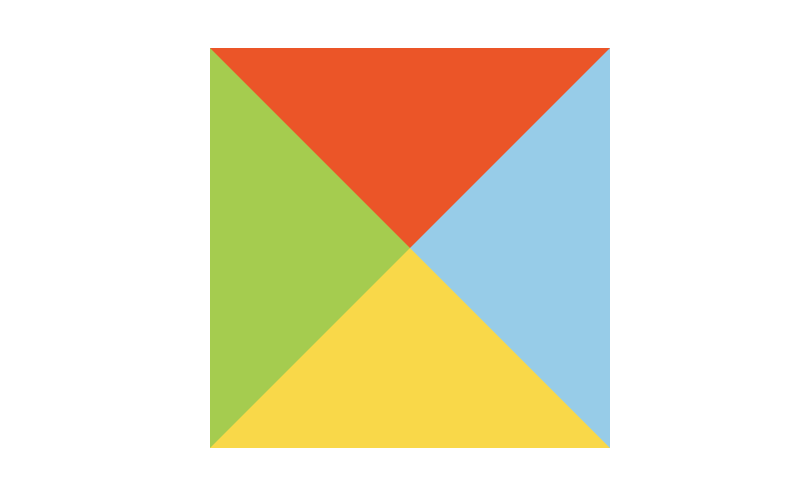

可以看到，我们已经基本上实现了4个三角形形状。所以可以根据border这个特性来绘制三角形。

***

如果想要一个指向下面的三角形，可以让 border 的上边可见，其他边都设置为透明：

```css
.triangle {
    width: 0;
    height: 0;
    border-top: 50px solid skyblue;
    border-right: 50px solid transparent;
    border-left: 50px solid transparent;
}
```

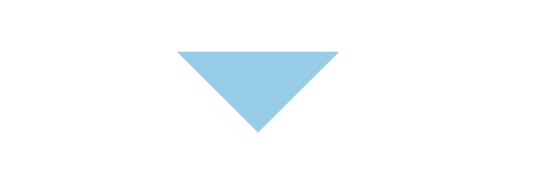

如果想要一个指向右面的三角形，可以让 border 的左边可见，其他边都设置为透明：

```css
.triangle {
    width: 0;
    height: 0;
    border-left: 50px solid skyblue;
    border-top: 50px solid transparent;
    border-bottom: 50px solid transparent;
}
```

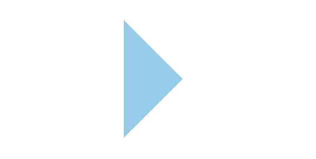

上面的代码也可以这样写：

```css
.triangle {
	border-style: solid;
  border-color: transparent;
  border-width: 50px 0 50px 50px;
  border-left-color: skyblue;
}
```

我们还可以通过调整不同方向边框的值来实现不同方向和大小的三角形：

```css
.triangle {
    width: 0;
    height: 0;
    border-top: 100px solid skyblue;
    border-right: 100px solid transparent;
}
```

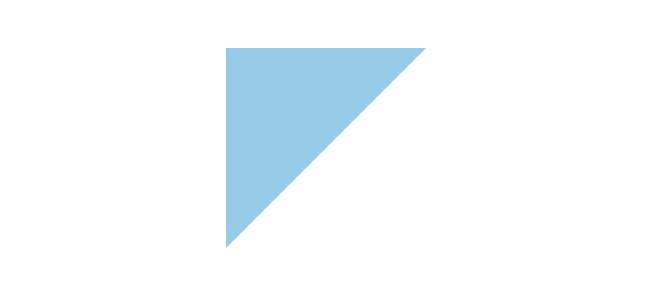

当然，实现一个等边三角形也是可以的：

```css
.triangle {
		width: 0;
		height: 0;
		border-left: 69px solid transparent;  
		border-right: 69px solid transparent;  
		border-bottom: 120px solid skyblue; 
}
```

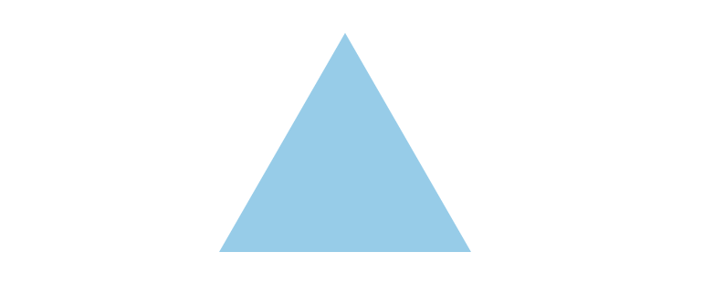

## 2. linear-gradient

linear-gradient 需要结合 background-image 来实现三角形，下面就来逐步使用渐变实现一个三角形。

首先，我们先来画一个长方形：

```css
.triangle {
  width: 80px;
  height: 100px;
  background-repeat: no-repeat;
  outline: 1px solid skyblue;
}
```

效果如下：

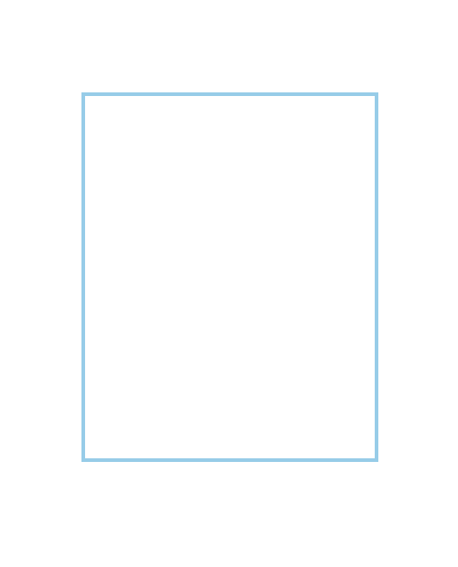

接下来，添加一个渐变，这会使元素的一半呈现红色：

```css
background-image: linear-gradient(45deg, orangered 50%, rgba(255, 255, 255, 0) 50%);
```

效果如下：

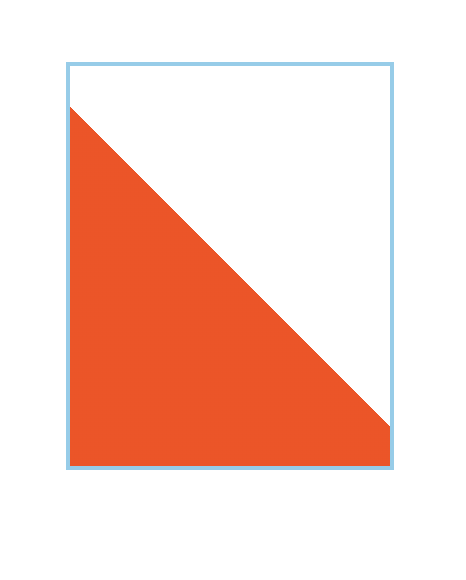

我们的目标是创建一个与使用 border 方法时外观相同的三角形。 因此，需要调整 background-size 和 background-position 值：

```css
background-size: 100% 50%;
```

效果如下：

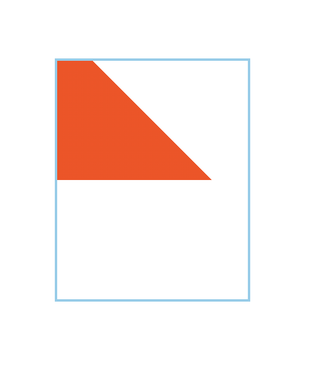

由于渐变设置了 45 度角，形状看起来有些奇怪。 需要调整角度，使三角形的顶边是从左上角开始，直到右侧的中间。可以使用浏览器开发者工具进行调试，直到预期的效果。将 linear-gradient 值更新为：

```css
background-image: linear-gradient(32deg, orangered 50%, rgba(255, 255, 255, 0) 50%);
```

效果如下：

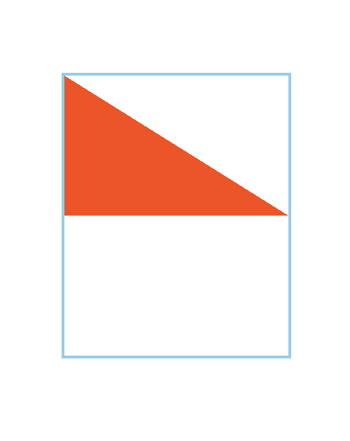

这其实已经是一个三角形了，但还不是我们想要的效果。对于线性渐变，我们需要添加多个背景来实现三角形。下面来添加一个它的镜像效果：

```css
background-image: linear-gradient(32deg, orangered 50%, rgba(255, 255, 255, 0) 50%), linear-gradient(148deg, orangered 50%, rgba(255, 255, 255, 0) 50%);
```

效果如下：\
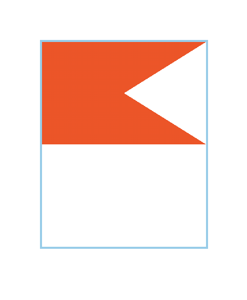

看似距离三角形还很远，但是只需最后一步，只需调整两个三角形的位置即可，这里使用 `background-position` 属性来调整：

```css
background-position: top left, bottom left;
```

效果如下：

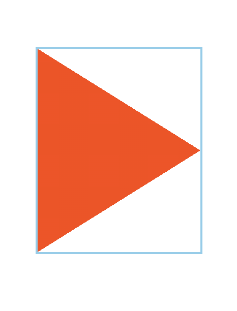

这样就实现了三角形的效果（去掉outline即可），最终的代码如下：

```css
.triangle {
		width: 160px;
  	height: 200px;
  	outline: 2px solid skyblue;
  	background-repeat: no-repeat;
		background-image: linear-gradient(32deg, orangered 50%, rgba(255, 255, 255, 0) 50%), linear-gradient(148deg, orangered 50%, rgba(255, 255, 255, 0) 50%);
		background-size: 100% 50%;
		background-position: top left, bottom left;
}
```

CSS 线性渐变可用于创建很多种形状。不过它是有缺点的，就是需要调试出合适的渐变角度。

## 3. clip-path

最后一种方法——clip-path，它是最精简和最可具扩展性的。 不过目前其在浏览器兼容性不是很好，使用时要考虑浏览器是否支持。

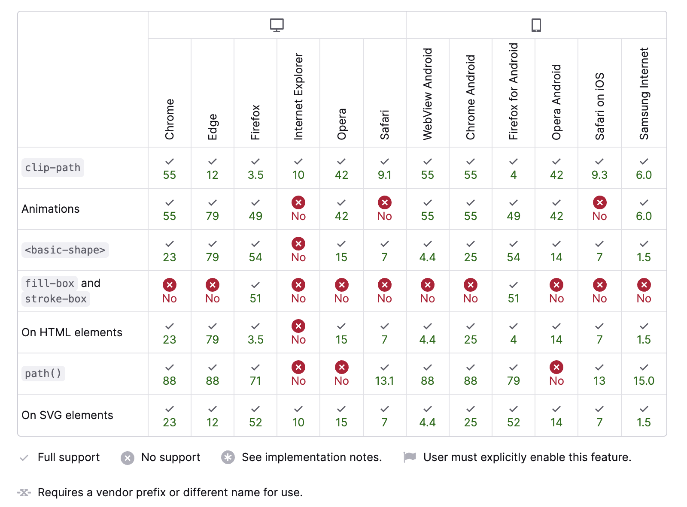

下面先画一个带背景颜色的长方形：

```css
.triangle {
  width: 80px;
  height: 100px;
  background-color: skyblue;
}
```

效果如下：

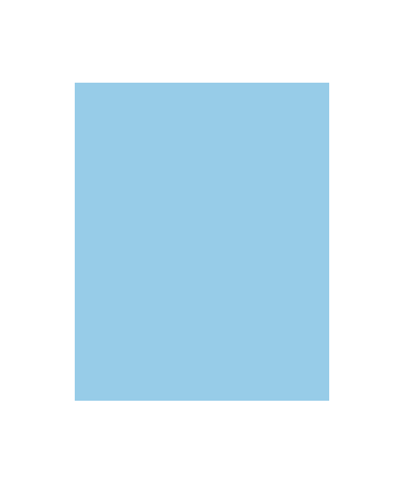

clip-path 就是使用它来绘制多边形（或圆形、椭圆形等）并将其定位在元素内。实际上，浏览器不会绘制 clip-path 之外的任何区域，因此我们看到的是 clip-path 的边界。

下面来绘制一个指向右侧的三角形：

```css
clip-path: polygon(0 0, 0% 100%, 100% 50%);
```

这个值是怎么来的呢？使用 clip-path 可以为沿路径放置的每个点定义坐标。在这种情况下，就定义了三个点：`top-left (0 0)`、`bottom-left (0% 100%)`、`right-center (100% 50%)`。效果如下：

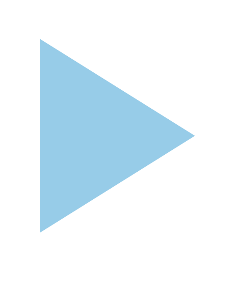

完整代码如下：

```css
.triangle{
		margin: 100px;
		width: 160px;
  	height: 200px;
  	background-color: skyblue;
		clip-path: polygon(0 0, 0% 100%, 100% 50%);
}
```

可以使用在线工具来尝试这个属性，绘制不同的图形：<https://bennettfeely.com/clippy/>


> 更新: 2023-03-10 00:09:06  
> 原文: <https://www.yuque.com/cuggz/feplus/ixy9y8>