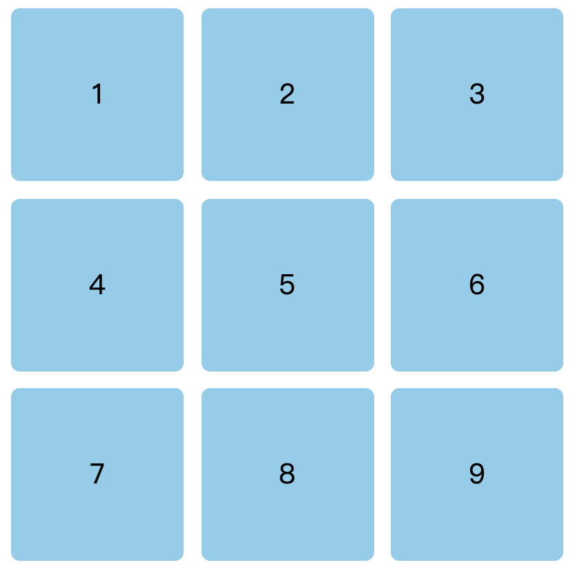
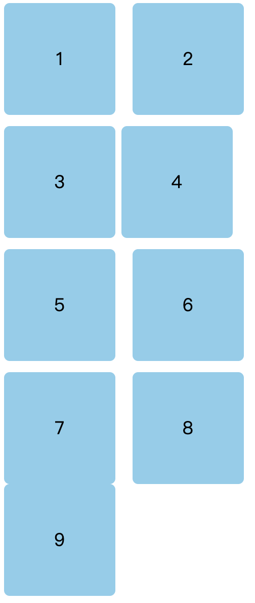

# 实现九宫格

最近看到一个面试题：**实现一个九宫格布局，用尽可能多的方式去实现？**搜了一下牛客面经，腾讯、字节、百度、网易、京东等的面经中都出现过这道题目。所以今天就来实现一下，看有多少种实现方式（下面实现的九宫格布局是自适应页面大小的）。


实现效果如下：



首先，定义好通用的HTML结构：

```html
<div class="box">
  <ul>
    <li>1</li>
    <li>2</li>
    <li>3</li>
    <li>4</li>
    <li>5</li>
    <li>6</li>
    <li>7</li>
    <li>8</li>
    <li>9</li>
  </ul>
</div>
```

公共样式：

```html
ul {
	padding: 0;
}

li { 
	list-style: none;
  text-align: center;
	border-radius: 5px;
	background: skyblue;
}
```

### 1. flex实现
对于九宫格布局，我首先想到的就是flex布局，flex布局实现九宫格很简单，需要设置一个flex-wrap: wrap;使得盒子在该换行的时候进行换行。


由于我们给每个元素设置了下边距和右边距，所以最后同一列（3、6、9）的右边距和最后一行（7、8、9）的下边距撑大了ul，所以这里使用类型选择器来消除他们的影响。最终的实现代码如下：

```css
ul {
  display: flex;
  flex-wrap: wrap;
  width: 100%;
  height: 100%;
}

li {
  width: 30%;
  height: 30%;
  margin-right: 5%;
  margin-bottom: 5%;
}

li:nth-of-type(3n){ 
  margin-right: 0;
}

li:nth-of-type(n+7){ 
  margin-bottom: 0;
}
```

### 2. grid实现
grid布局相对于flex布局来说，实现九宫格就更加容易了，只需要设置几个属性即可：

```css
ul {
  width: 100%;
  height: 100%;
  display: grid;
  grid-template-columns: 30% 30% 30%; 
  grid-template-rows: 30% 30% 30%; 
  grid-gap: 5%; 
}
```

其中grid-template-columns属性用来设置每一行中单个元素的宽度，grid-template-rows属性用来设置每一列中单个元素的高度，grid-gap属性用来设置盒子之间的间距。


其实Grid布局还是很有用，很方便的，近期会有一篇详解grid布局的文章，有想了解的小伙伴可以关注一波嗷~

### 3. float实现
这里首先需要给父元素的div设置一个宽度，宽度值为：**盒子宽 * 3 + 间距 * 2；**然后给每个盒子设置固定的宽高，为了让他换行，可以使用float来实现，由于子元素的浮动，形成了BFC，所以父元素ul使用overflow:hidden；来消除浮动带来的影响。最终的实现代码如下：

```css
ul {
  width: 100%;
  height: 100%;
  overflow: hidden;
}

li {
  float: left;
  width: 30%;
  height: 30%;
  margin-right: 5%;
  margin-bottom: 5%;
}

li:nth-of-type(3n){ 
  margin-right: 0;
}

li:nth-of-type(n+7){ 
  margin-bottom: 0;
}
```

### 4. inline-block实现
其实inline-block的作用和上面float的作用是一样的，都是用来让元素换行的，实现代码如下：

```css
ul {
  width: 100%;
  height: 100%;
  letter-spacing: -10px;
}

li {
  width: 30%;
  height: 30%;
  display: inline-block;
  margin-right: 5%;
  margin-bottom: 5%;
}

li:nth-of-type(3n){ 
  margin-right: 0;
}

li:nth-of-type(n+7){ 
  margin-bottom: 0;
}
```

需要注意的是，设置为inline-block的元素之间可能会出现间隙，就可能出现下面这种情况：



这里使用了letter-spacing属性来消除这种影响，该属性可以用来增加或减少字符间的空白（字符间距）。使用之后就正常了，出现了预期的效果。也可以给ul设置font-size: 0;来消除盒子之间的字符间距：

```css
ul {
  font-size: 0;
}
```

### 5. table实现
HTML结构：

```css
<ul class="table">
  <li>
    <div>1</div>
    <div>2</div>
    <div>3</div>
  </li>
  <li>
    <div>4</div>
    <div>5</div>
    <div>6</div>
  </li>
  <li>
    <div>7</div>
    <div>8</div>
    <div>9</div>
  </li>
</ul>
```

table布局也不算太难，首先给父元素设置为table布局，然后使用border-spacing设置单元格之间的间距，最后将li设置为表格行，将div设置为表格单元格，CSS样式如下：

```css
.table {
  width: 100%;
  height: 100%;
  display: table;
  border-spacing: 10px;
}

li {
  display: table-row; 
}

div {
  width: 30%;
  height: 30%;
  display: table-cell;
  text-align: center;
  border-radius: 5px;
  background: skyblue;
}
```

### 6. 总结
对于上述实现方式，总结如下：

+ flex布局也是我平时用的比较多的布局方式，虽然其还有一些兼容性问题，但是由于我做的是B端项目，基本不需要考虑兼容问题。其实flex布局主要适用于移动端项目；
+ grid布局实现起来非常方便，但是它的规范并未成熟，主流的浏览器使用较少，不推荐使用在企业项目中；
+ 使用float可以使元素脱离文档流，形成BFC，在重新渲染时不会影响其他的元素。需要注意使用float的元素其父元素会塌陷，需要清除浮动。
+ 使用inline-block来实现九宫格布局时，定义了inline-block的元素之间会出现间隙，需要清除；
+ table布局现在感觉用的比较少了，几乎很少在项目中使用table布局。


> 更新: 2022-01-27 17:04:43  
> 原文: <https://www.yuque.com/cuggz/feplus/pps8q5>