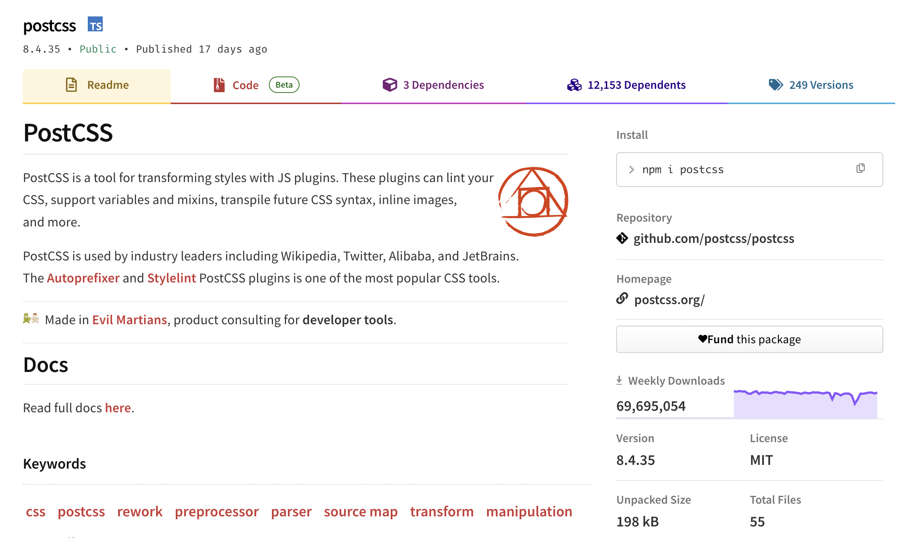
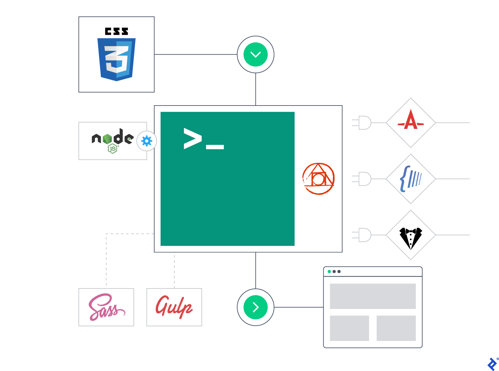
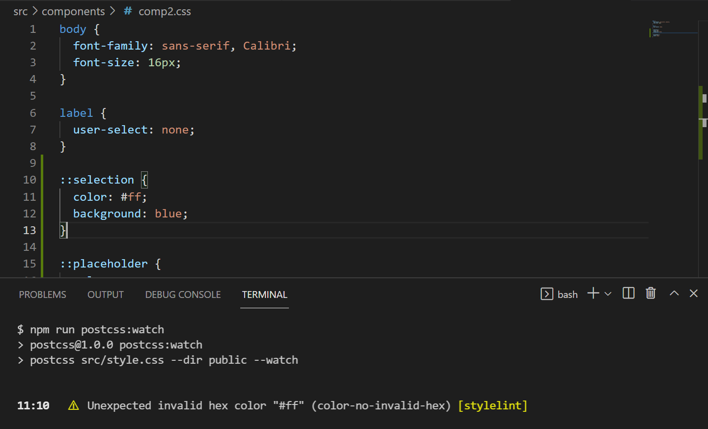

# PostCSS

本文来分享一个前端必备的工具，其每天在 npm 上的下载量高达 1000 万次，几乎每个前端项目都在用，它就是 PostCSS。这款工具已经成为前端开发领域中不可或缺的一部分，之所以如此受欢迎，不仅是因为它能够帮助开发者自动化处理 CSS 中的兼容性问题，更是因为它提供了一个强大的插件生态系统。这些插件可以让开发者轻松实现各种高级的 CSS 功能，如自动添加浏览器前缀、使用最新的 CSS 语法特性，以及进行代码优化和压缩等。本文就来揭开这款热门前端工具的神秘面纱，探索其背后的强大功能和魅力所在。



## PostCSS 是什么？

PostCSS是一种通过JavaScript插件来转换CSS的工具。它本身并不做任何事情。它将 CSS 代码转换为抽象语法树（AST），并提供一个API，以便使用JavaScript插件分析和修改它。一旦所有插件都完成了工作，PostCSS会重新格式化所有内容并将其输出为CSS文件的字符串。



PostCSS 的生态系统非常丰富，目前约有 **360** 个插件可供选择，其中大多数插件只执行单个任务。如内联`@import`声明、简化`calc()`函数、处理图像资源、语法linting、压缩等。

PostCSS 的特点如下：

* **基于标准CSS**：PostCSS对CSS的处理类似于Babel对JavaScript的处理。它能够将适用于最新浏览器的标准样式表转化为在各种环境下均可运行的CSS。例如，它能将较新的`inset`属性转换回`top`、`bottom`、`left`和`right`属性。随着时间的推移，随着浏览器支持的增加，这个转换过程甚至可能变得不再必要。
* **插件驱动的灵活性**：PostCSS允许仅使用所需的插件和功能。它不像某些预处理器那样强制使用特定的功能集。可以选择支持部分和嵌套，同时排除变量、循环、混入等特性。
* **项目定制性**：每个项目都可以有独特的PostCSS配置，以满足特定的需求。这种高度的可定制性使得PostCSS成为了一个功能丰富且适应性强的工具。
* **强大的扩展性**：PostCSS的插件生态系统极为丰富，从扩展语法、解析未来属性、添加回退到优化代码、处理颜色、图像和字体等，应有尽有。如果现有的插件无法满足的需求，甚至可以使用JavaScript编写自己的插件。
* **潜在的集成优势**：可能已经在项目中使用了PostCSS，例如通过Autoprefixer插件。这意味着可能能够减少或消除对传统预处理器的依赖，因为PostCSS可以在单个步骤中处理所有CSS相关任务。

那 PostCSS 和 Less、Sass 这些 CSS 预处理器有什么区别呢？

* 功能定位：
  * PostCSS 是一个使用 JavaScript 插件来转换样式的工具。它本身并不提供任何预定义的样式或功能，而是通过加载各种插件来实现对 CSS 的转换和优化。PostCSS 可以解析 CSS 为抽象语法树（AST），并使用插件来操作这个树，然后输出转换后的 CSS。
  * Less 和 Sass 是 CSS 预处理器，它们提供了变量、嵌套、混合（mixin）、继承等更高级的特性，使得 CSS 更易于组织和维护。它们有自己的语法，编译成标准的 CSS 代码。
* 使用方式：
  * PostCSS 通常与构建工具集成，如 Webpack，并依赖于各种插件来实现其功能。PostCSS 的插件生态系统非常丰富，可以实现各种样式转换和优化任务。
  * Less 和 Sass 有自己的编译器，可以将 `.less` 或 `.scss` 文件编译成 .css 文件。它们也可以与构建工具集成，但通常不需要额外的插件就能提供丰富的功能。
* 扩展性：
  * PostCSS 的最大优势在于其高度可扩展性。由于它基于插件架构，可以轻松地添加新功能或与其他工具集成。
  * Less 和 Sass 虽然也有扩展性，但通常需要通过自定义函数或导入其他文件来实现，不如 PostCSS 灵活。
* 用途：
  * <font style="color:rgb(5, 7, 59);background-color:rgb(253, 253, 254);">PostCSS 作为一个CSS转换工具，能够执行许多任务，如自动添加浏览器前缀、优化CSS、提取公共样式等。PostCSS通常与构建工具集成，并在项目构建过程中自动处理CSS代码。</font>
  * <font style="color:rgb(5, 7, 59);background-color:rgb(253, 253, 254);">Sass 和 Less 是 CSS 预处理器，它的主要用途是提供一种更简洁、结构化的语法来编写CSS代码。它们支持变量、嵌套规则、混合（mixin）、函数等高级功能，使得CSS代码更易于维护和扩展，可以帮助开发人员更高效地编写和组织CSS代码。</font>

了解了 PostCSS 的基本概念，下面就来看看 PostCSS 是如何使用的！

## PostCSS 怎么用？

在前端项目中，我们提供通过构建工具或者命令行来使用 PostCSS。下面分别来看看这两种方式。

### 命令行

通过命令行使用 PostCSS 的步骤如下：

1. **安装PostCSS和PostCSS CLI**：需要在项目中安装PostCSS和PostCSS的命令行接口（CLI）。可以通过npm来安装，命令如下：

```bash
npm install postcss postcss-cli --save-dev
```

2. **安装插件**：根据需求，安装相应的PostCSS插件。例如，如果想自动添加浏览器前缀，可以安装`autoprefixer`插件。安装命令如下：

```bash
npm install autoprefixer --save-dev
```

3. **运行 PostCSS**：在命令行中，使用`npx`命令来运行PostCSS，并指定要使用的插件和目标文件。例如，以下命令将使用`autoprefixer`插件对`origin.css`文件中的CSS样式添加浏览器前缀，并将结果输出到`target.css`文件中：

```bash
npx postcss --use autoprefixer -o target.css origin.css
```

这里，`--use autoprefixer`指定了要使用的插件，`-o target.css`指定了输出文件的名称，`origin.css`是要处理的源文件。

可以看到，通过命令行使用 PostCSS 是很麻烦的，每个插件都需要执行单独的命令。在现代前端项目中，我们基本都会使用构建工具（例如 Webpack、Vite）来构建项目，下面就来看看如何使用构建工具便捷的使用 PostCSS。

### 构建工具

下面分别来看看如何通过 Webpack 和 Vite 来使用 PostCSS。

#### Webpack

1. **安装依赖**：在项目中安装`postcss-loader`和 postcss。postcss-loader是Webpack的加载器，用于处理PostCSS，而postcss是核心库。可以通过以下 npm 或 yarn 命令来安装：

```bash
# 使用 npm 安装
npm install postcss postcss-loader --save-dev
# 使用 yarn 安装
yarn add postcss postcss-loader --dev
```

2. **配置Webpack**：接下来，在Webpack的配置文件（通常是`webpack.config.js`）中添加一个新的规则，以便Webpack能够识别和处理CSS文件，并使用`postcss-loader`。这个规则应该被添加到`module.rules`数组中：

```javascript
module.exports = {  
  // ... 其他Webpack配置 ...  
  module: {  
    rules: [  
      // ... 其他规则 ...  
      {  
        test: /\.css$/, // 匹配CSS文件  
        use: [  
          'style-loader', // 将JS字符串生成style节点  
          'css-loader',   // 将CSS转化成CommonJS  
          'postcss-loader' // 使用PostCSS处理CSS  
        ],  
      },  
    ],  
  },  
};
```

> 注意：在使用 postcss 之前，需要确保已经安装了style-loader 和 css-loader，因为 postcss-loader 是用于处理 CSS 文件并应用 PostCSS 插件的 Webpack 加载器。然而，postcss-loader 本身并不负责将 CSS 插入到 DOM 中或将 CSS 转换为 JavaScript 模块。这是 style-loader 和 css-loader 的职责。

3. **安装并配置PostCSS插件**：PostCSS的功能是通过插件提供的，可以根据需要安装不同的插件。例如，`autoprefixer`是一个常用的插件，用于自动添加浏览器前缀。安装插件的命令如下：

```bash
npm install autoprefixer --save-dev
```

然后，在项目的根目录下创建一个 `postcss.config.js` 文件，用于配置 PostCSS 插件：

```javascript
module.exports = {  
  plugins: [  
    // 使用 autoprefixer 插件添加浏览器前缀  
    require('autoprefixer'),  
    // 使用 cssnano 插件进行 CSS 压缩和优化  
    require('cssnano')({  
      preset: 'default', // 使用 cssnano 的默认预设  
    }),  
  ],  
};
```

4. **运行Webpack**：当运行Webpack时，它会根据配置文件中的规则处理CSS文件。postcss-loader 将自动应用于匹配到的 CSS 文件，并使用在`postcss.config.js`中配置的插件来处理这些文件。

#### Vite

Vite 本身已经集成了 PostCSS，因此无需额外安装 PostCSS。Vite 在处理 CSS 文件时会自动使用 PostCSS，并且可以直接在 `vite.config.js` 文件中配置 PostCSS 插件。

在 `vite.config.js` 文件中，可以配置 `css.postcss` 选项来指定要使用的 PostCSS 插件。例如：

```javascript
// vite.config.js  
import { defineConfig } from 'vite'  
import autoprefixer from 'autoprefixer'  
  
export default defineConfig({  
  css: {  
    postcss: {  
      plugins: [  
        autoprefixer(),  
        // 其他插件...  
      ],  
    },  
  },  
  // 其他配置...  
})
```

## PostCSS 常用插件

下面来看一些常用的 PostCSS 插件。

> <font style="color:rgb(31, 35, 40);">PostCSS 全部插件：</font><https://github.com/postcss/postcss/blob/main/docs/plugins.md>

### postcss-import

`postcss-import` 用于简化 CSS 文件的导入过程。通过引入该插件，可以使用类似于Sass或Less的`@import`语法来导入外部 CSS 文件，同时也支持导入Node.js模块。

```javascript
@import './components/comp1.css';
@import './components/comp2.css';
```

要使用`postcss-import`插件，首先需要通过npm或yarn将其安装到项目中。然后，PostCSS配置文件中（通常是`postcss.config.js`），将`postcss-import`添加到`plugins`列表中。这样，当在 CSS 文件中使用`@import`规则时，PostCSS 就会自动使用`postcss-import`插件来处理这些导入。

那你可能要问了，CSS 中本来不就有 `@import` 功能吗，为什么还要使用 `postcss-import` 呢？

这是因为，原生CSS的`import`规则可能会阻止样式表同时下载，这会影响加载速度和性能。因为浏览器必须等待每个导入的文件加载完成，而无法一次性加载所有CSS文件。这可能导致页面渲染延迟，影响用户体验。而`postcss-import`插件则试图解决这个问题。它遵循CSS`@import`规范，可以将样式表分割成多个部分，然后再重新组合它们，从而减少HTTP请求次数，提高页面加载速度。此外，它还可以引入第三方的样式表，或者使用bower\_components或npm\_modules文件夹中的样式表，使得CSS文件的管理和组织更为灵活和高效。

### autoprefixer

Autoprefixer 用于自动管理浏览器前缀。它可以解析CSS文件并且根据 Can I Use 网站的数据来决定哪些前缀是需要的，然后自动添加这些前缀到 CSS 内容里。这样，开发者就无需手动为CSS属性添加各种浏览器前缀，简化了开发过程。

> 注意：不同浏览器对CSS属性的支持程度可能不同。浏览器厂商为了实现一些新的CSS特性，可能会在实现前加上自己的前缀，以示区别。

要使用 Autoprefixer，首先需要通过通过 npm 或 yarn 在项目中安装它。安装完成后，可以在PostCSS的配置文件中引入Autoprefixer，并将其添加到插件列表中。

在配置Autoprefixer时，可以通过设置`browsers`参数来指定需要支持的浏览器版本。例如，如果项目需要支持最新的两个浏览器版本，可以将`browsers`参数设置为\['last 2 versions']。

```javascript
module.exports = {  
  plugins: [  
    require('autoprefixer')({  
      browsers: [  
        '> 1%', // 支持全球使用率超过1%的浏览器  
        'last 2 versions', // 支持每种浏览器的最后两个版本  
        'not ie < 9', // 不支持IE8及以下版本  
        'Firefox ESR' // 支持Firefox的Extended Support Release（ESR）版本  
      ]  
    })  
  ]  
};
```

在这个例子中，autoprefixer 插件被添加到了 `plugins` 数组中。插件的配置对象被传递给了 `require('autoprefixer')` 函数。在配置对象中，`browsers` 属性定义了Autoprefixer 应该支持哪些浏览器。

`browsers` 属性可以是一个字符串或字符串数组，表示浏览器范围和版本。在这个例子中，它被设置为一个数组，包含了四个不同的浏览器范围：

* `'> 1%'`：支持全球使用率超过1%的浏览器。
* `'last 2 versions'`：支持每种浏览器的最后两个版本。
* `'not ie < 9'`：不支持IE8及以下版本。
* `'Firefox ESR'`：支持Firefox的Extended Support Release（ESR）版本。

此外，Autoprefixer 还使用`Browserslist`库来对浏览器的版本进行精确设置，这使得配置更加灵活和强大。可以在 `package.json` 文件中使用`“browserslist”`配置 Browserslist：

```javascript
"browserslist": [   
    "defaults"    
]
```

`"defaults"` 表示默认的浏览器支持范围，这个默认范围会随着时间的推移和浏览器使用率的变化而更新。默认范围即：

* 支持全球使用率超过 0.5% 的所有浏览器。
* 支持每种浏览器的最后两个版本。
* 不支持那些已经停止更新和不再受到官方支持的浏览器（即“死”浏览器）。

上面的配置就等同于：

```javascript
"browserslist": [  
  "> 0.5%",  
  "last 2 versions",  
  "not dead"  
]
```

对于以下 CSS 代码：

```css
label {
  user-select: none;
}

::selection {
  color: white;
  background: blue;
}

::placeholder {
  color: gray;
}
```

基于上面的 `browserslist` 设置，使用 Autoprefixer 插件之后，转换结果如下：

```css
label {
  -webkit-user-select: none;
     -moz-user-select: none;
      -ms-user-select: none;
          user-select: none;
}

::-moz-selection {
  color: white;
  background: blue;
}

::selection {
  color: white;
  background: blue;
}

::-moz-placeholder {
  color: gray;
}

:-ms-input-placeholder {
  color: gray;
}

::placeholder {
  color: gray;
}
```

### postcss-preset-env

postcss-preset-env 可以将一些现代的CSS特性，转成大多数浏览器认识的CSS，并且会根据目标浏览器或者运行时环境添加所需的polyfill，添加私有前缀等配置。该插件默认集成 Autoprefixer 插件，并且 `browsers` 选项将自动传递给它。

postcss-preset-env 有一个`stage`配置项，用于指定需要对哪个阶段的CSS语法进行兼容处理的。

```javascript
module.exports = {
    plugins: [
        require('postcss-preset-env')({ stage: 2 })
    ],
}
```

这个配置项有五个可选项，分别是：

* Stage 0: Aspirational。这个阶段只是一个早期草案，非常不稳定，并且可能会发生变化。
* Stage 1: Experimental。在这个阶段，提议已经被W3C公认，但是CSS特性仍然非常不稳定，并且可能会发生变化。
* Stage 2: Allowable。默认值，即默认会对Stage 2的CSS特性进行兼容处理。尽管CSS特性仍然不稳定，但是已经可以使用了，并且正在积极研究中。
* Stage 3: Embraced。这个阶段的CSS特性已经比较稳定，可能将来会发生一些小的变化，但是它即将成为最终的标准。
* Stage 4: Standardized。在这个阶段，所有的主流浏览器都应该支持这个W3C标准的CSS特性。

### Stylelint

Stylelint 用于检测 CSS 代码质量和一致性的工具，可以帮助开发者避免语法错误、不符合规范的样式声明以及其他潜在问题，从而确保代码质量和风格统一。

可以按照以下步骤使用 Stylelint 插件：

1. **安装 Stylelint：**

```bash
npm install stylelint --save-dev
```

2. **创建配置文件**：在项目根目录中创建 Stylelint 配置文件，通常命名为 `.stylelintrc`。在这个文件中，可以定义 Stylelint 的规则和配置选项。

> 注意：默认情况下不启用任何规则，也没有默认值，必须显式配置每个规则才能将其打开。

```json
{  
  "extends": "stylelint-config-recommended",  
  "rules": {  
    "color-no-invalid-hex": true,  
    "font-family-no-missing-generic-family-keyword": true,  
    "declaration-no-important": true  
  }  
}
```

这里使用了 `stylelint-config-recommended` 作为默认规则集，并添加了一些自定义规则。

3. **配置 PostCSS**：在 PostCSS 配置文件中添加 Stylelint 插件，并传递 Stylelint 的配置对象。

```javascript
module.exports = {  
  plugins: [  
    require('stylelint')({  
      configFile: '.stylelintrc', // 指向 Stylelint 配置文件  
    }),  
  ],  
};
```

如果没有提供 `configFile` 选项，Stylelint 将使用默认的查找算法来查找配置。

4. **运行 PostCSS**：现在，当运行 PostCSS 时，Stylelint 插件将自动检测 CSS 文件并报告任何发现的问题。如果通过命令行运行：

```bash
npx postcss your-css-file.css -o output.css
```

如果使用的是构建工具（如 Webpack、Vite 等），确保在构建过程中调用 PostCSS，这样 Stylelint 就会自动运行。

5. **处理报告**：Stylelint 会在控制台输出报告，显示任何发现的问题，包括问题的类型、位置以及可能的解决方案。可以根据这些报告来修复 CSS 代码。



### Cssnano

Cssnano 插件用于优化和压缩 CSS 代码的工具。Cssnano 通过移除注释、空白、重复规则、过时的浏览器前缀以及执行其他优化来减少 CSS 文件的大小，从而确保在开发环境中下载量尽可能的小。

可以按照以下步骤使用 Cssnano 插件：

1. **安装 Cssnano**

```bash
npm install cssnano --save-dev
```

2. **配置 PostCSS**：在 PostCSS 配置文件中添加 Cssnano 插件。

```javascript
module.exports = {  
  plugins: [  
    require('cssnano')({  
      preset: 'default', // 使用默认的优化预设  
    }),  
  ],  
};
```

3. **运行 PostCSS**：现在，当运行 PostCSS 时，Cssnano 插件将自动优化和压缩 CSS 代码。
4. **处理输出**：Cssnano 会生成一个优化后的 CSS 文件，该文件将具有更小的文件大小，并且仍然与原始文件保持功能上的等价。可以将这个压缩后的文件用于生产环境，以减小加载时间并提高性能。

## <font style="color:rgb(5, 7, 59);">小结</font>

<font style="color:rgb(5, 7, 59);background-color:rgb(253, 253, 254);">PostCSS 是一个功能强大的工具，它为 CSS 提供了转换和优化能力，可以在 CSS 代码被编写出来后，对其进行各种有用的转换。PostCSS 的核心优势在于其插件系统，这个系统允许开发者根据需要选择和组合各种插件，以扩展 PostCSS 的功能。</font>

<font style="color:rgb(5, 7, 59);background-color:rgb(253, 253, 254);"></font>

<font style="color:rgb(5, 7, 59);background-color:rgb(253, 253, 254);">使用 PostCSS 的过程相对简单，只需要将它与构建工具集成，并在配置文件中指定所需的插件即可。设置完成之后，PostCSS 将在构建过程中自动处理 CSS 代码，使其更加高效、兼容和可维护。</font>


> 更新: 2024-03-13 21:49:45  
> 原文: <https://www.yuque.com/cuggz/feplus/vsv0iam5u2woy7hf>