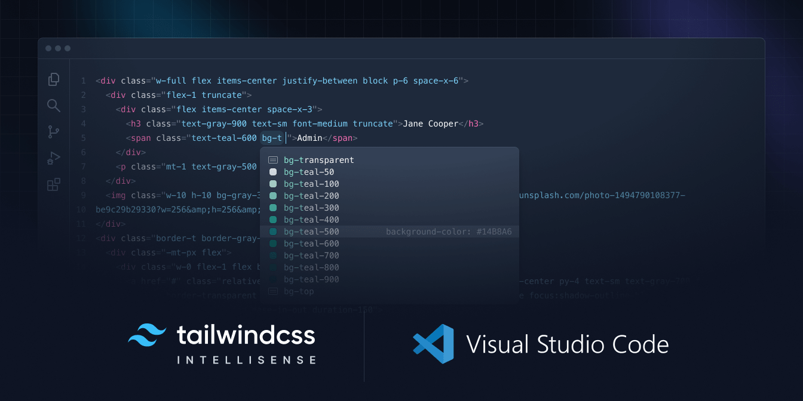
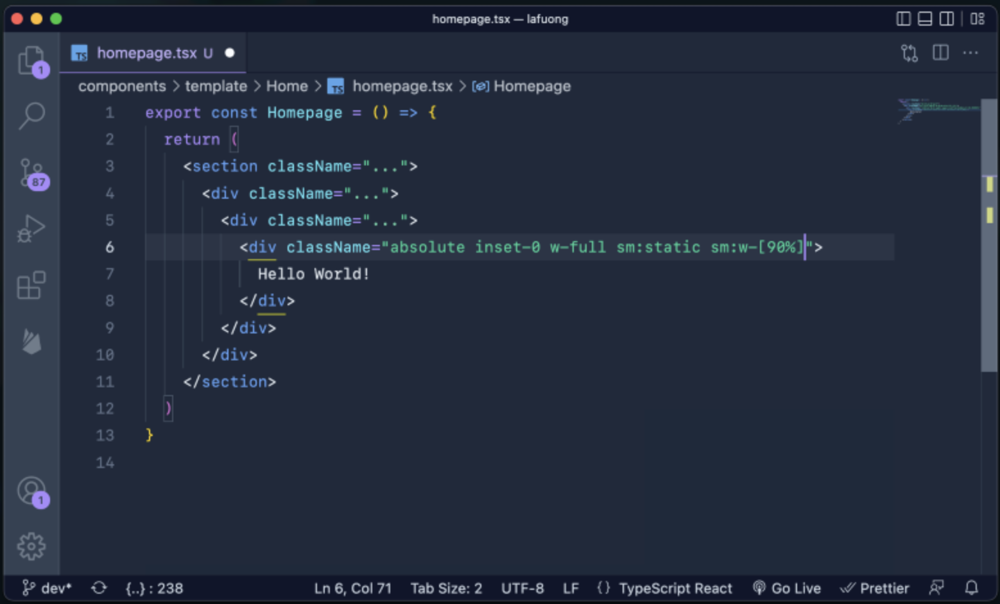

# Tailwind CSS

## Tailwind CSS 是什么？

Tailwind CSS 是一个实用类优先的 CSS 框架。与传统的 CSS 框架不同，它不提供预设的设计组件（如按钮、表格等），而是将 CSS 拆分成最小的、可复用的单元，即原子类。每个原子类只负责一个样式属性，这样可以完全根据自己的设计需求来构建界面，而不会受到框架本身样式的限制。

Tailwind CSS 的特点如下：

* **实用程序优先**：提供了一套低级别的CSS工具类，可以直接应用于 HTML，从而构建任何设计。这种方式与传统的预设组件的框架不同，可以创建完全自定义的设计。
* **响应式设计**：内置了对响应式设计的支持，可以通过添加前缀的方式轻松地调整不同屏幕尺寸下的样式。
* **高度可定制**：Tailwind CSS 高度可配置，通过配置文件可以修改或扩展默认的样式选项。这包括但不限于颜色、字体系列、间距、断点等，可以根据项目的需要定制化设计系统。
* **插件生态系统**：Tailwind CSS 拥有丰富的官方和社区贡献的插件，这些插件可以进一步扩展其功能，提供额外的工具类或者帮助处理复杂的UI需求。
* **一致的设计语言**：使用Tailwind CSS有助于在整个项目中维持一致的设计语言，因为所有的样式都是基于一个统一的命名约定和配置。
* **快速原型开发**：对于快速原型开发和迭代设计来说，Tailwind CSS的工具类可以迅速实现想法，而无需编写大量的CSS代码。

举个例子，传统的 CSS 这样写：

```html
<div class="card">
  <h2 class="title">Hello, World!</h2>
  <p class="content">前端充电宝</p>
</div>
```

```css
.card {
  padding: 1rem;
  background-color: #f9fafb;
  border-radius: 0.5rem;
}

.title {
  font-size: 1.25rem;
  font-weight: bold;
  margin-bottom: 0.5rem;
}

.content {
  font-size: 1rem;
  color: #6b7280;
}
```

在 Tailwind CSS 中，同样的设计可以直接使用实用类实现：

```html
<div class="p-4 bg-gray-100 rounded-lg">
  <h2 class="text-xl font-bold mb-2">Hello, World!</h2>
  <p class="text-gray-600">前端充电宝</p>
</div>
```

## Tailwind CSS 怎么用？

### 准备工作

1. **安装 Tailwind CSS**：在使用之前，在终端中使用 npm 或 yarn 等工具来安装 Tailwind CSS：

```shell
# 使用 npm 安装
npm install tailwindcss
# 使用 yarn 安装
yarn add tailwindcss
```

2. \*\*初始化配置文件：\*\*在终端中通过以下命令来生成 Tailwind CSS 的配置文件`tailwind.config.js`。

```javascript
npx tailwindcss init
```

3. **配置 Tailwind CSS**：根据项目需求配置`tailwind.config.js`文件。例如，指定 Tailwind 应该扫描哪些文件以提取类名，或者自定义主题颜色、字体等。

```javascript
module.exports = {
  content: [
    "./src/**/*.{html,js,jsx,ts,tsx}",
  ],
  theme: {
    extend: {}, // 主题配置
  },
  plugins: [], // 添加插件
}
```

4. \*\*创建全局样式表：\*\*创建一个CSS文件（例如 `./src/input.css`），并在其中引入 Tailwind CSS 的基础样式、组件样式以及实用类。

```javascript
@tailwind base;
@tailwind components;
@tailwind utilities;
```

5. **构建 CSS 文件**：确保构建工具（如 Webpack、Vite 等）能够处理 PostCSS，需要设置 Tailwind CSS 作为插件。例如，如果使用的是 Vite，可以在 `vite.config.js`文件中添加以下配置：

```javascript
import { defineConfig } from 'vite';
import react from '@vitejs/plugin-react';
import tailwindcss from 'tailwindcss';

export default defineConfig({
  plugins: [react()],
  css: {
    postcss: {
      plugins: [tailwindcss()],
    },
  },
});
```

6. **使用 Tailwind CSS 类**：现在就可以在HTML中使用Tailwind提供的工具类了。

```javascript
import React from 'react';

function App() {
  return (
    <div className="bg-blue-500 text-white p-4">
      Hello, 前端充电宝!
    </div>
  );
}

export default App;
```

### 实用功能

#### 实用程序类

Tailwind CSS 的核心理念是提供一组低级别的实用程序类，这些类可以用来直接在HTML中构建完全自定义的设计，而无需编写额外的CSS。

常用的 Tailwind CSS 类如下：

* **布局类**
  * **容器类**：如`container`，用于创建响应式的容器，它会根据屏幕大小自动调整宽度。
  * **弹性布局类**：如`flex`、`flex-col`（垂直排列）、`flex-row`（水平排列）、`flex-wrap`（换行）、`flex-nowrap`（不换行）等，用于创建弹性布局。
  * **网格布局类**：如`grid`、`grid-cols-3`（3列网格）、`grid-rows-2`（2行网格）、`gap-4`（网格项间距为4）等，用于创建网格布局。
  * **对齐类**：如`items-center`（垂直居中）、`justify-center`（水平居中）、`center`（水平和垂直居中）等，用于控制元素的对齐方式。
* **间距类**
  * **外边距类**：如`m-4`（外边距为4）、`mt-2`（顶部外边距为2）、`mr-auto`（右侧外边距为自动）等。
  * **内边距类**：如`p-2`（内边距为2）、`py-4`（垂直方向内边距为4）、`px-auto`（水平方向内边距为自动）等。
  * **X轴间距类**：如`mx-auto`（水平方向外边距为自动）、`px-4`（水平方向内边距为4）等。
  * **Y轴间距类**：如`my-6`（垂直方向外边距为6）、`py-auto`（垂直方向内边距为自动）等。
* **尺寸类**
  * **宽度类**：如`w-full`（宽度为100%）、`w-1/2`（宽度为父容器宽度的一半）、`max-w-md`（最大宽度为中等屏幕大小）等。
  * **高度类**：如`h-screen`（高度为屏幕高度）、`h-16`（高度为16像素）、`min-h-full`（最小高度为100%）等。
* **文本类**
  * **文本颜色类**：如`text-red-500`（文本颜色为红色500）、`text-black`（文本颜色为黑色）等。
  * **文本大小类**：如`text-xl`（文本大小为大号字体）、`text-sm`（文本大小为小号字体）等。
  * **字体粗细类**：如`font-bold`（使用粗体字体）、`font-light`（使用细体字体）等。
  * **行间距类**：如`leading-6`（行间距为6）等。
* **背景类**
  * **背景颜色类**：如`bg-gray-300`（背景颜色为灰色300）等。
  * **背景图片类**：如`bg-cover`（使用覆盖整个元素的背景图片）等。
  * **背景位置类**：如`bg-center`（背景图像居中对齐）等。
  * **背景尺寸类**：如`bg-auto`（使用原始背景图像大小）等。
* **边框类**
  * **边框颜色类**：如`border-red-500`（边框颜色为红色500）等。
  * **边框大小类**：如`border-2`（边框宽度为2像素）等。
  * **边框位置类**：如`border-l`（只在元素左侧添加边框）等。
  * **圆角类**：如`rounded-full`（使用完全圆角）等。
* **其他类**
  * **阴影类**：如`shadow-lg`（添加大号阴影效果）等。
  * **过渡与动画类**：如`transition-all`（全部过渡效果）、`duration-1000`（过渡时长为1000毫秒）、`ease-in-out`（过渡曲线为先慢后快再慢）等。
  * **响应式前缀类**：如`md:`（中等屏幕及以上尺寸的前缀）、`lg:`（大屏幕及以上尺寸的前缀）等，用于实现响应式设计。

#### 暗黑模式

Tailwind CSS 提供了对暗黑模式的原生支持，可以轻松地为应用添加深色主题。

要启用暗黑模式，首先需要在 `tailwind.config.js` 文件中进行配置。Tailwind 提供了三种方式来处理暗黑模式：

* `media`：默认选项，基于用户的系统偏好（`prefers-color-scheme`）自动切换暗黑模式。当用户的系统设置为暗黑模式时，Tailwind CSS 会自动应用带有 `dark:` 前缀的样式类。
* `class`：通过手动添加 `dark` 类来切换暗黑模式。这种模式允许开发者通过 JavaScript 或其他方式动态地添加或移除 `dark` 类，从而实现用户控制的暗黑模式切换。
* `false`：禁用暗黑模式。

```javascript
// tailwind.config.js
module.exports = {
  darkMode: 'class', // 或者 'media' 或 false
  theme: {
    extend: {},
  },
  plugins: [],
}
```

当启用了暗黑模式，可以使用 `dark:` 前缀来为特定元素指定在暗黑模式下的样式。这适用于任何 Tailwind 的工具类。

```html
<!-- 在暗黑模式下背景为黑色，文本为白色 -->
<div class="bg-white text-black dark:bg-gray-900 dark:text-white">
  Hello World
</div>
```

如果选择了 `darkMode: 'class'`，可以通过JavaScript动态地切换暗黑模式。这通常涉及到监听用户的偏好设置或提供一个手动切换按钮。

```javascript
function toggleDarkMode() {
  document.documentElement.classList.toggle('dark');
}

// 监听用户系统偏好
if (window.matchMedia && window.matchMedia('(prefers-color-scheme: dark)').matches) {
  document.documentElement.classList.add('dark');
}
```

#### 响应式

Tailwind CSS 可以通过简单的类名组合来快速创建适应不同屏幕尺寸和设备的布局。Tailwind CSS提供了丰富的响应式工具类，可以为不同设备指定特定样式。这些响应式类通常基于**屏幕宽度**断点来应用不同的样式规则。

* \*\*内置的响应式断点：\*\*Tailwind CSS 中的默认断点包括：
  * `sm:` - 小型屏幕（最小宽度为 640px）
  * `md:` - 中型屏幕（最小宽度为 768px）
  * `lg:` - 大型屏幕（最小宽度为 1024px）
  * `xl:` - 超大型屏幕（最小宽度为 1280px）
  * `2xl:` - 非常大的屏幕（最小宽度为 1536px）
* \*\*响应式定义：\*\*可以将这些前缀添加到任何 Tailwind 工具类之前，以指定在特定屏幕尺寸下应用的样式。响应式类的语法通常为`{断点}:属性-[值]`，例如`md:w-[8%]`表示在中等屏幕上宽度设为8%。

```html
<!-- 默认情况下是红色，在中等及以上屏幕变为绿色 -->
<div class="bg-red-500 md:bg-green-500">
  Hello World
</div>
```

* \*\*自定义断点：\*\*如果默认的断点不满足需求，可以在 `tailwind.config.js` 文件中自定义或扩展它们。

```javascript
module.exports = {
  theme: {
    screens: {
      'xs': '480px',
      'sm': '640px',
      'md': '768px',
      'lg': '1024px',
      'xl': '1280px',
      '2xl': '1536px',
    },
  },
}
```

* **使用容器类**：为了确保页面内容在一个固定的宽度内居中，并且随着屏幕尺寸的变化自动调整宽度，可以使用 Tailwind 的 `container` 类。这个类会根据当前屏幕尺寸自动调整最大宽度，并保持水平居中。

```html
<div class="container mx-auto">
  <!-- 页面内容 -->
</div>
```

* \*\*流体布局与固定宽度：\*\*Tailwind 还提供了流体布局和固定宽度的工具类。例如，`w-full` 类可以使元素宽度占满父元素，而 `max-w-lg` 类则可以限制元素的最大宽度。

```html
<!-- 宽度占满父元素，但在大屏幕时不超过最大宽度 -->
<div class="w-full max-w-lg">
  <!-- 内容 -->
</div>
```

#### 主题

Tailwind CSS 主题是指基于预定义样式类所创建的一组特定的样式集合，用于定义应用的整体视觉风格。

在 Tailwind CSS 中，主题的配置主要通过修改 `tailwind.config.js` 文件来实现。这个文件包含了 Tailwind CSS 的核心配置选项，如颜色、间距、断点、字体等。通过调整这些配置选项，可以定制自己的主题风格。

* **颜色配置**：在 `tailwind.config.js` 文件中，可以定义自己的颜色调色板，并指定这些颜色在 Tailwind CSS 中的使用方式。例如，可以定义主色调、辅助色调、背景色等，并指定它们在按钮、链接、文本等元素上的应用方式。
* **间距配置**：间距配置允许定义一系列预定义的间距值，这些值可以在布局和组件中使用。通过调整间距配置，可以控制元素之间的间距大小，从而优化页面的整体布局和视觉效果。
* **断点配置**：断点配置用于定义响应式设计的断点。通过指定不同的屏幕尺寸和视口宽度，可以为不同的设备和屏幕大小设置不同的样式规则。这有助于确保网页在各种设备上都能正常显示和交互。
* **字体配置**：字体配置允许指定应用中使用的字体类型、字体大小和字体样式等。通过调整字体配置，可以创建出符合品牌风格和用户体验需求的字体样式。

```javascript
// tailwind.config.js
module.exports = {
  theme: {
    extend: {
      colors: {
        primary: '#3490dc',
        secondary: '#ffed4a',
      },
      spacing: {
        '96': '24rem',
        '128': '32rem',
      },
      // 更多自定义...
    }
  }
}
```

在配置了 Tailwind CSS 主题之后，可以在 HTML 中使用这些预定义的样式类来应用主题样式。例如，可以使用颜色类来设置元素的背景颜色和文本颜色，使用间距类来控制元素之间的间距大小，使用布局类来定义页面的整体布局结构等。

#### \*\*Tailwind CSS \*\*插件

Tailwind CSS 插件系统可以扩展 Tailwind 的核心功能，添加新的工具类、修改现有行为或引入完全自定义的样式。

官方提供了几个非常有用的插件来扩展 Tailwind 的功能：

* `@tailwindcss/forms`：为表单元素提供额外的样式和实用程序。
* `@tailwindcss/typography`：用于创建美观的排版，包含对文章内容的优化样式。
* `@tailwindcss/aspect-ratio`：提供 `aspect-ratio` 实用程序，用于保持元素的比例。
* `@tailwindcss/line-clamp`：提供一个简单的解决方案来限制文本行数。
* `@tailwindcss/container-queries`：实现基于容器查询的功能，允许根据容器大小调整样式。

除此之外，Tailwind 提供了简单的方法来创建自定义插件。这可以通过 `plugin` 函数完成，它接受两个参数：一个是添加到设计系统的函数，另一个是可选的默认配置对象。例如，添加两个新的工具类：

```javascript
const plugin = require('tailwindcss/plugin')

module.exports = {
  plugins: [
    plugin(function ({ addUtilities }) {
      addUtilities({
        '.content-auto': {
          'content-visibility': 'auto',
        },
        '.content-visible': {
          'content-visibility': 'visible',
        },
      })
    }),
  ],
}
```

要在项目中使用插件，需要将它们添加到 `tailwind.config.js` 文件中的 `plugins` 数组里。

```javascript
module.exports = {
  content: ['./src/**/*.{html,js,jsx,ts,tsx}'],
  theme: {
    extend: {},
  },
  plugins: [
    require('@tailwindcss/forms'),
    require('@tailwindcss/typography'),
    // 添加其他插件
  ],
}
```

#### VS Code 插件

Tailwind CSS 官方提供了一个 VS Code 插件——**Tailwind CSS IntelliSense**，它提供了自动完成、语法突出显示和 linting 等高级功能以增强 Tailwind 开发体验。



另外，推荐一个第三方的 VS Code 插件——**Inline Fold**，它的核心功能是将匹配的内容折叠成单行，从而提高代码的可读性和整洁度。这对于处理包含大量类名或属性的代码行特别有用，例如在使用 Tailwind CSS 时，类名可能会非常长且复杂，导致代码视觉结构混乱。通过 Inline Fold 可以轻松地折叠这些类名，使代码更加简洁明了。




> 更新: 2025-01-23 22:57:14  
> 原文: <https://www.yuque.com/cuggz/feplus/diezh3ov7o4feat9>