# 容器查询

近期，主流浏览器终于都支持了 CSS 容器查询功能：

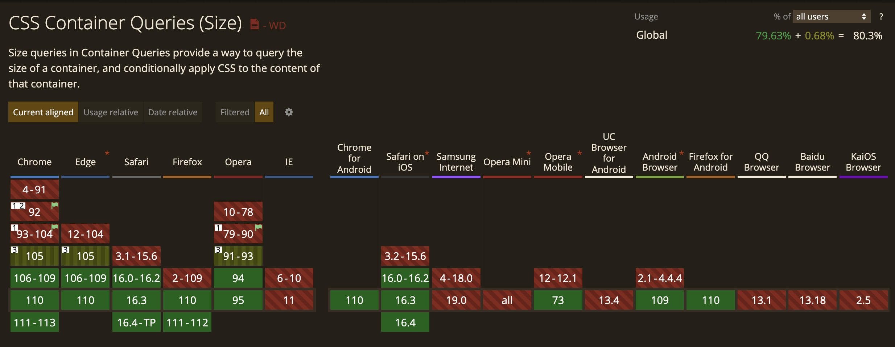

在引入响应式设计之前，许多公司通过提供不同的站点来处理基于屏幕尺寸更改布局的问题。2010 年，Ethan Marcotte 引入了响应式设计的概念。响应式网页设计的理念是设计和开发应根据屏幕尺寸、设备和方向响应用户的行为和环境。 这个想法实现的核心就是 CSS 媒体查询，它允许根据视口的大小设置各种布局规则。

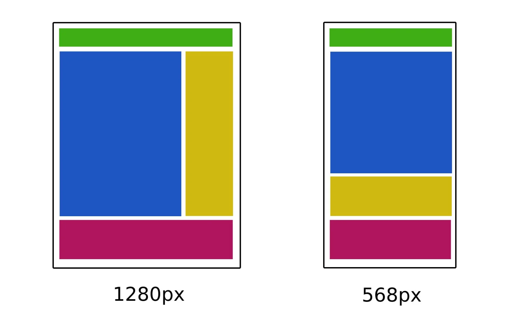

如今，开发人员通常使用基于组件的 JavaScript 框架（如 React、Vue 等）以及 CSS 框架（如 Tailwind CSS、Material UI 和 Bootstrap）来制作响应式和可重用的布局和应用。一种新的响应式设计方法出现了——容器查询，容器查询可以根据组件的大小或样式而不是设备的视口直接查询组件。

## 媒体查询的问题？

在介绍容器查询之前，先来看看媒体查询的概念。通常网页由不同的组件组成，我们可以通过使用 CSS 媒体查询使它们具有响应性。但是它是有局限性的。例如，可以使用媒体查询在移动设备和桌面设备上显示组件的最小版本。

通常，响应式网页设计与视口或屏幕尺寸无关，而是于容器的大小有关。来看下面的例子：

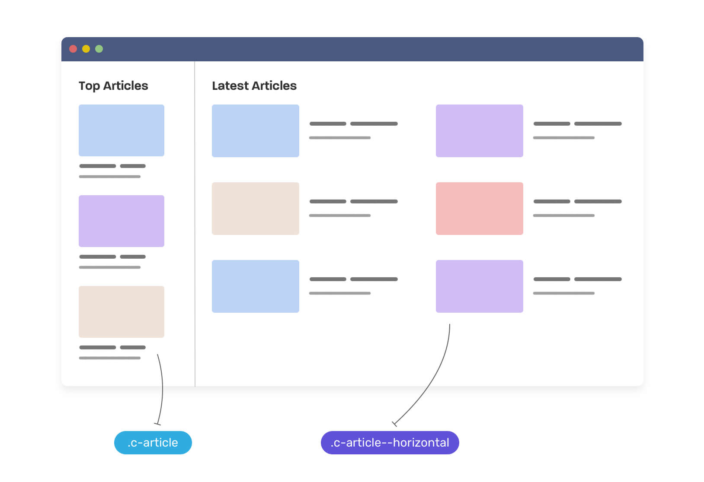

这里是一个非常经典的带有卡片组件布局，这里有两种显示形式：左侧的堆叠式和右侧的平铺式。

这在CSS 中有多种实现方法，最常见的方法如下所示。我们需要创建一个基础组件，然后对其进行媒体查询：

```css
.c-article > * + * {
  margin-top: 1rem;
}

@media (min-width: 46rem) {
	/* 右侧平铺部分 */
  .c-article--horizontal {
    display: flex;
    flex-wrap: wrap;
  }

  .c-article > * + * {
    margin-top: 0;
  }

  .c-article__thumb {
    margin-right: 1rem;
  }
}
```

这里创建了 `.c-article--horizontal` 类来处理组件的平铺部分，如果视口宽度大于 `46rem`，则组件应切换到平铺模式。这确实可以实现预期的效果，但是有局限，我们希望组件根据其父级宽度进行变化，而不是浏览器的视口或屏幕尺寸。

可以用 CSS 容器查询来实现这个布局。我们需要当右侧区域的父级大于 `400px` 时切换到平铺模式：

```html
<div class="o-grid">
  <div class="o-grid__item">
    <article class="c-article">
      <!-- 内容 -->
    </article>
  </div>
  <div class="o-grid__item">
    <article class="c-article">
      <!-- 内容 -->
    </article>
  </div>
</div>
```

```css
.o-grid__item {
  container-type: inline-size;
}

@container (min-width: 400px) {
  .c-article {
    /* 使文章平铺的样式 */
  }
}
```

使用容器查询，就可以在将组件放入窄的父组件中，它会变成堆叠版本，将组件放入宽的父组件中，它会变成平铺版本，所有这些都与视口宽度无关。

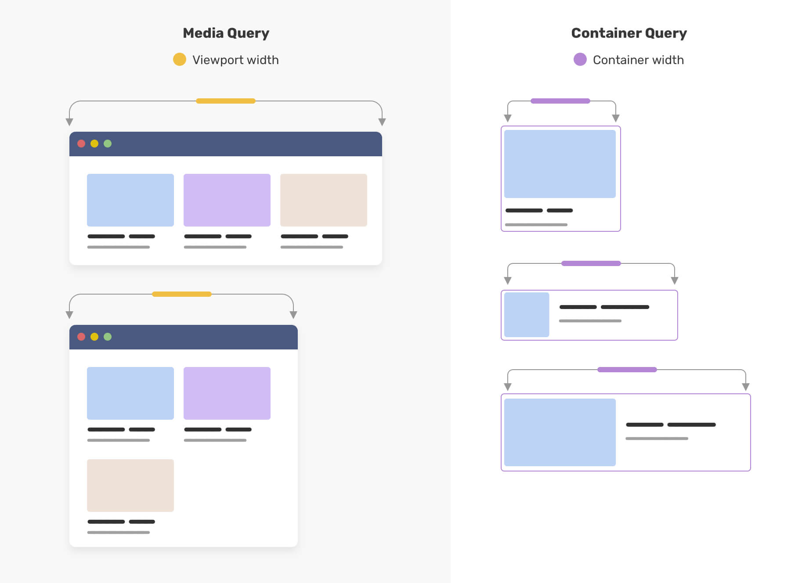

上面的代码只是简单的实现，下面就来看看 CSS 容器查询特性是如何使用的！

## 什么是容器查询？

容器是包含另一个元素的元素。 因此，简单来说，CSS 容器查询就是指定元素相对于其父容器或元素的更改，而不是整个视口。

因此，仍然可以使用响应式网格来进行整体页面布局，但该网格中的组件可以通过查询其容器来定义自己的行为变化。然后，它可以根据它是在窄容器还是宽容器中显示来调整其样式。

容器查询能够以非常精确和可预测的方式定义组件的全部样式，例如：增加或减少padding、更改字体大小、添加或删除背景图片，或者更改子元素的 `display` 属性和方向。

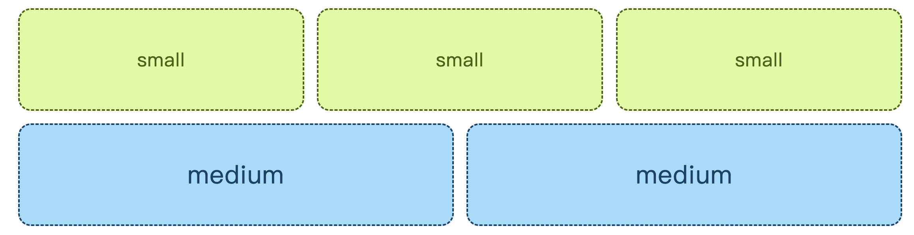

## 如何使用容器查询？

容器查询中的“容器”就是被查询的元素，但是容器查询中规则仅影响后代元素。容器查询将允许定义这些元素如何在容器大小之间变化的规则。

### 容器查询语法

要想设置容器查询，需要给被查询的元素设置 `container-type` 属性来指定容器的类型。语法如下：

```css
container-type: inline-size; 
```

`container-type` 属性有以下属性值：

* \*\*size：\*\*创建一个查询容器，支持内联轴和块轴维度上进行查询。
* \*\*inline-size：\*\*创建一个查询容器，支持在内联轴（文本流方向）维度上进行查询，这是最常用的选项。
* \*\*block-size：\*\*创建一个查询容器，支持在块轴维度上维度查询。
* \*\*style：\*\*允许通过定义查询容器进行样式查询。
* \*\*state：\*\*允许通过定义查询容器进行状态查询。

例如：

```css
.card-layout {
  container-type: inline-size;
}
 
@container (min-width: 768px) {
  .card {
    display: grid;
    font-size: 3rem;
    color: blue;
  }
}
```

我们可以使用 container-name 属性为容器指定一个名称，以区分具有唯一名称的容器。

```css
.card-layout {
  container-type: inline-size;
  container-name: card;
}
```

现在，我们就可以使用 `card` 为对应容器定义容器查询：

```css
@container card (min-width: 480px) {
  .card{
    display: grid;
    font-size: 2rem;
    color: gray;
  }
}
```

这样，定义的容器查询样式就不会干扰到其他容器，只会对指定的容器生效。

我们可以使用 `container` 来简写 `container-type` 和 `container-name` 属性，格式如下：

```css
container: card / inline-size;
```

下面来看一个例子：

```html
<main class="container">
  <article>...</article>
  <article>...</article>
  <article>...</article>
</main>
```

这里我们给 `main` 标签定义了一个 `container` 类，它将作为容器查询中的容器。接下来，可以设置一个容器查询来更改文章及其任何后代，这些样式将基于 `main` 的宽度发生改变。使用容器查询会随着容器的增长而改变样式。

```css
article {
  padding: 1rem;
  font-size: 1rem;
}

.container {
	container-type: inline-size;
}

@container (min-width: 60ch) {
  article {
    padding: 2rem;
    font-size: 1.25rem;
  }
}
```

这里的代码很简单，当容器 `container` 的宽度达到 60ch 时，就增大 `padding` 和 `font-size` 的值。

* `min-width`：当容器的大于或等于指定的宽度时，`min-width` 定义的样式会生效；
* `max-width`：当容器的小于或等于指定的宽度时，`max-width` 定义的样式会生效；
* `@container`：检测元素的父元素何时更改宽度，并指定每次宽度更改时要在子元素中进行哪些更改。

### 容器查询长度单位

除此之外，容器查询还引入了几个专用的长度单位，当使用容器查询将样式应用于容器时，可以使用**容器查询长度单位**。这些单位指定相对于查询容器尺寸的长度。使用相对于其容器的长度单位的组件可以更灵活地用于不同的容器，而无需重新计算具体的长度值。

容器查询长度单位包含：

* `cqw`：查询容器宽度的 1%
* `cqh`：查询容器高度的 1%
* `cqi`：查询容器内联大小的 1%
* `cqb`：查询容器块大小的 1%
* `cqmin`：`cqi` 或 `cqb` 中较小的值
* `cqmax`：`cqi` 或 `cqb` 中较大的值

下面来看一个例子，根据容器的大小来设置二级标题的字体大小：

```css
@container (min-width: 600px) {
  .card h2 {
    font-size: max(1.5em, 1.2em + 2cqi);
  }
}
```

### 容器元素选择器规则

上面我们说过，容器本身是不能在容器查询中设置样式的（除非它是嵌套容器并响应其祖先容器的查询）。但是，**容器可以用作其子项的 CSS 选择器的一部分**。

这有什么作用吗？这样的话，就可以保留对可能需要源自容器的 CSS 伪类和选择器的访问，例如 `:nth-child`。

```css
@container (min-width: 60ch) {
  .container:nth-child(odd) > article {
    border: 1px solid grey;
  }
} 
```

## 举个例子

### 卡片布局

下面来看一个卡片布局的例子：

```html
<div class="o-grid">
  <div class="o-grid__item">
    <article class="c-article"></article>
  </div>
  <div class="o-grid__item">
    <article class="c-article"></article>
  </div>
  <div class="o-grid__item">
    <article class="c-article"></article>
  </div>
  <div class="o-grid__item">
    <article class="c-article"></article>
  </div>
</div>
```

```css
.o-grid {
  display: grid;
  grid-template-columns: repeat(auto-fit, minmax(200px, 1fr));
  grid-gap: 1rem;
}
```

当有四个元素时，是这样的：

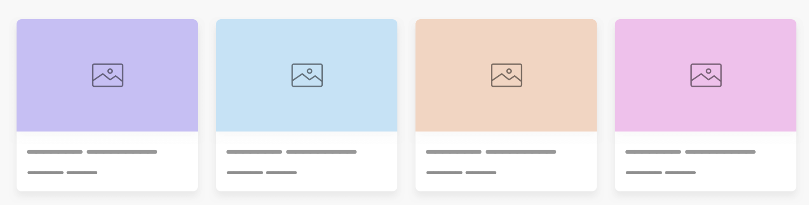

卡片的数量减少时，由于我们使用了 `auto-fit` 属性，卡片的宽度就会变宽。

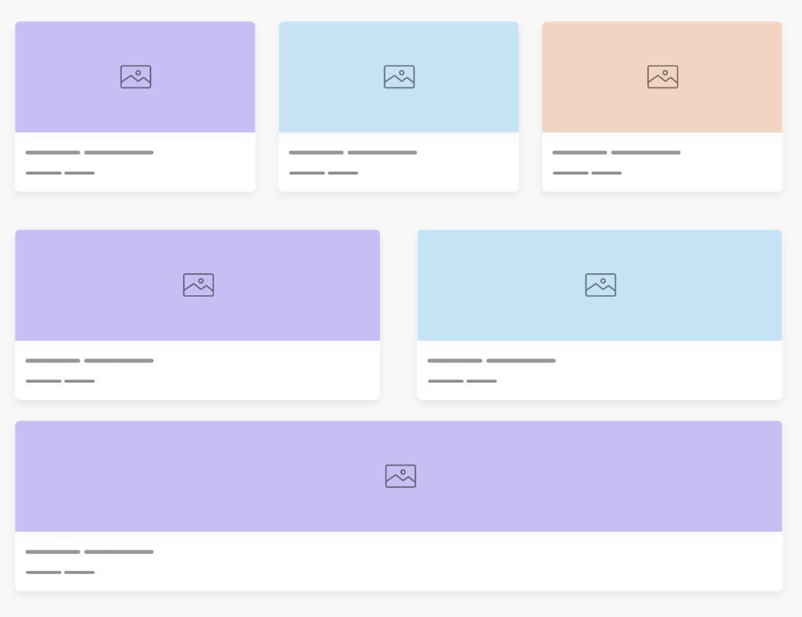

这看起来太宽了，影响了视觉效果。如果每个卡片的布局能根据父元素的宽度来设置就太好了，这时就可以使用容器查询：

```css
.o-grid__item {
  container-type: inline-size;
}

@container (min-width: 400px) {
  .c-article {
    display: flex;
    flex-wrap: wrap;
  }
}

@container (min-width: 700px) {
  .c-article {
    display: flex;
    justify-content: center;
    align-items: center;
    min-height: 350px;
  }

  .card__thumb {
    position: absolute;
    left: 0;
    top: 0;
    width: 100%;
    height: 100%;
    object-fit: cover;
  }
}
```

效果如下：

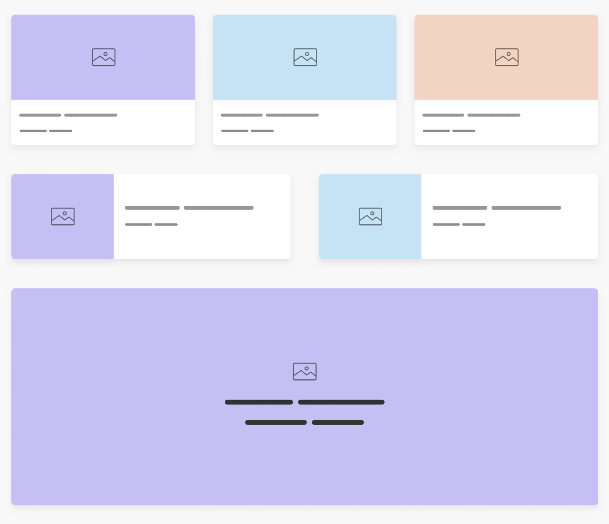

这样就得到了一个根据父级宽度进行样式响应的卡片组件。

### 表单布局

下面再来看一个表单的例子，当表单所在容器宽度不同时，分别显示为水平或堆叠模式。

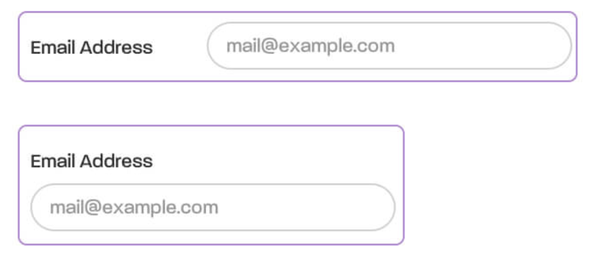

可以用容器查询轻松实现该布局：

```css
.form-item {
  container-type: inline-size;
}

.input-group {
  @container (min-width: 350px) {
    display: flex;
    align-items: center;
    gap: 1.5rem;

    input {
      flex: 1;
    }
  }
}
```

完成了这个样式，可以给父元素添加一个`resize`属性，使其大小可变，以测试容器查询是否生效：

```css
.parent {
  container-type: inline-size;
  resize: horizontal;
  overflow: auto;
}
```

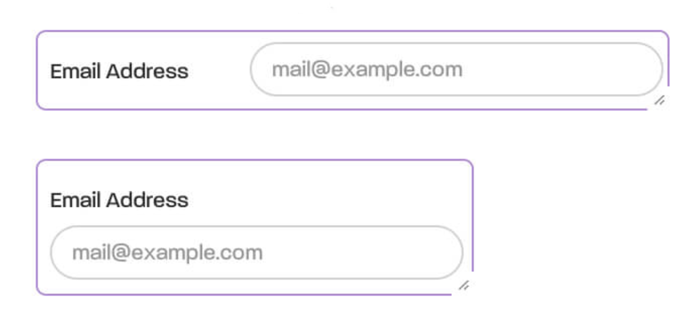

使用容器查询完美实现了预期效果！

## 调试容器查询

目前 Chrome DevTools 中已经支持检查和调试容器查询。在 Elements 中，容器元素后面会显示 `container` 标志：

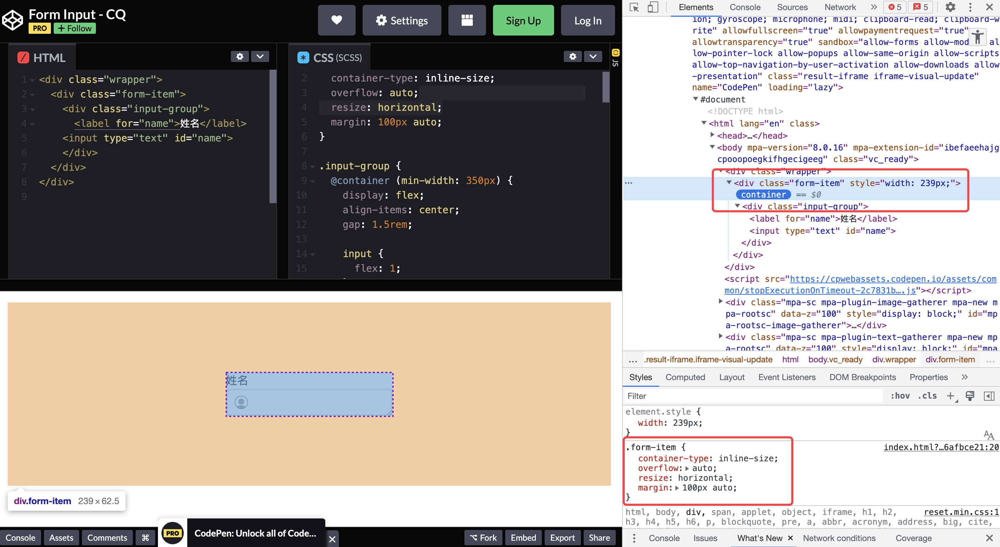

当容器满足查询条件时，可以检查`@container`应用于后代的规则：

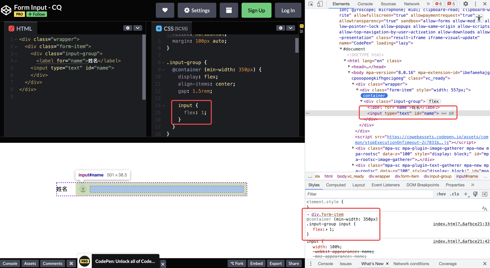

当鼠标悬浮在父元素（`div.form-item`）上时，就会显示当前父元素的宽度：

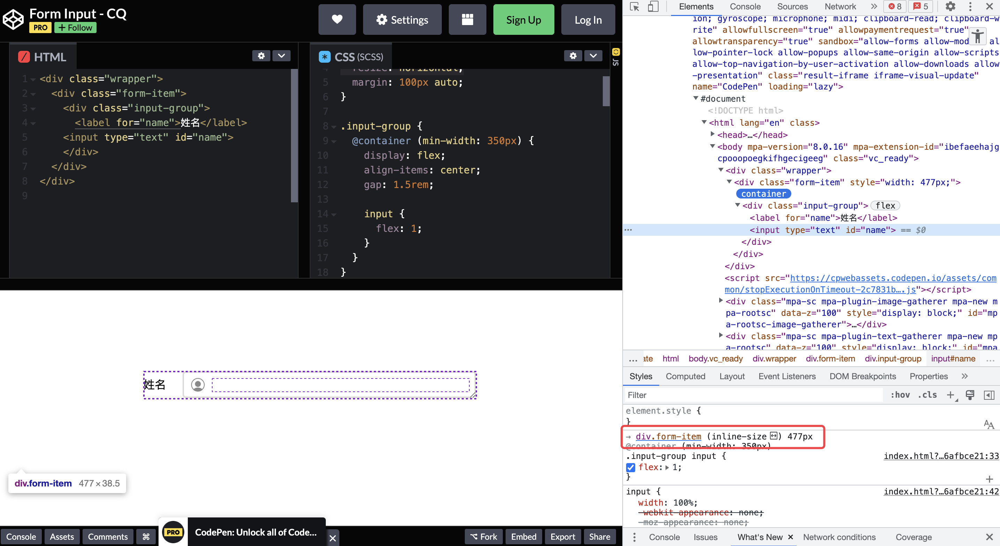


> 更新: 2023-04-20 21:15:15  
> 原文: <https://www.yuque.com/cuggz/feplus/qxvwbi62od1f2xia>