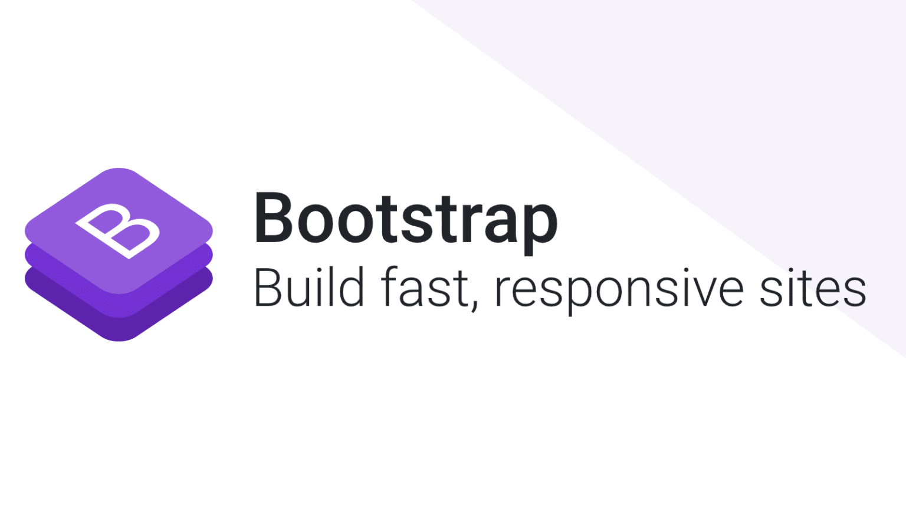
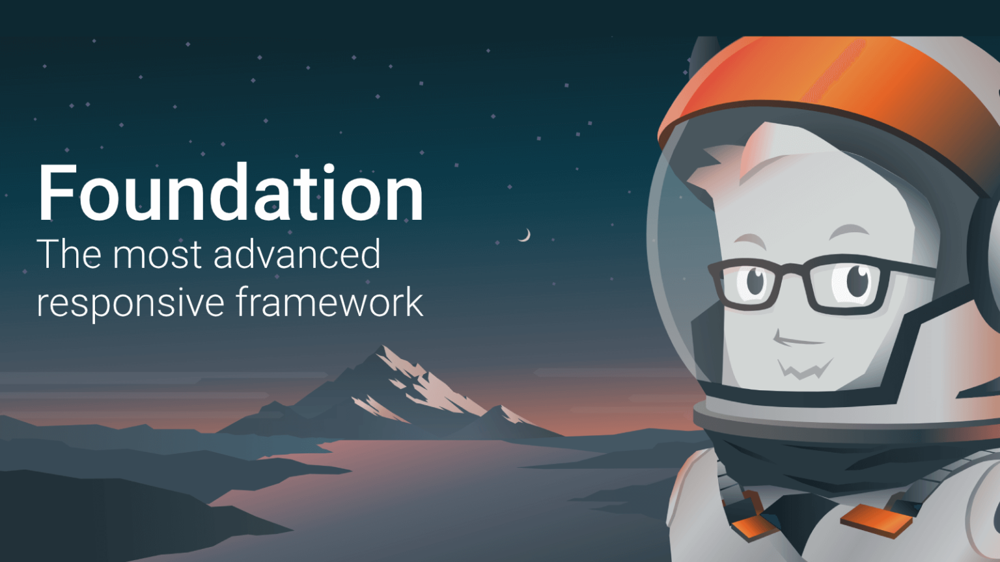
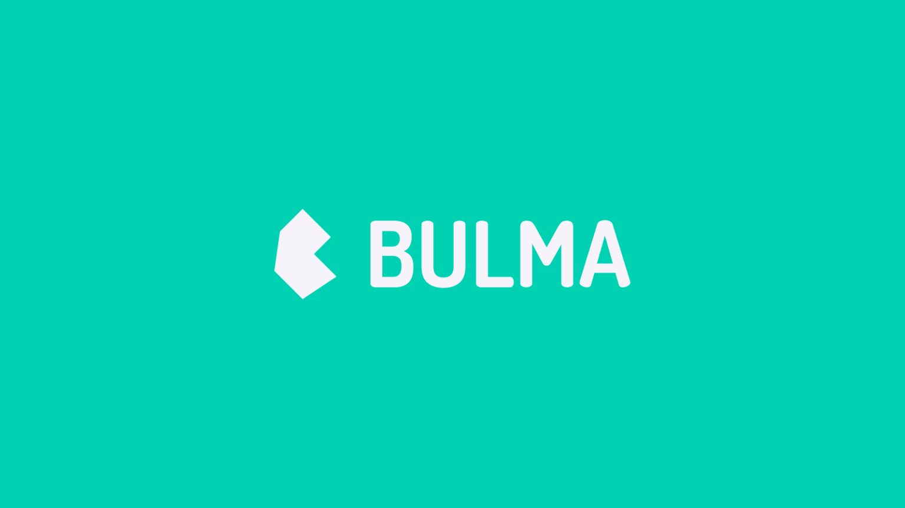
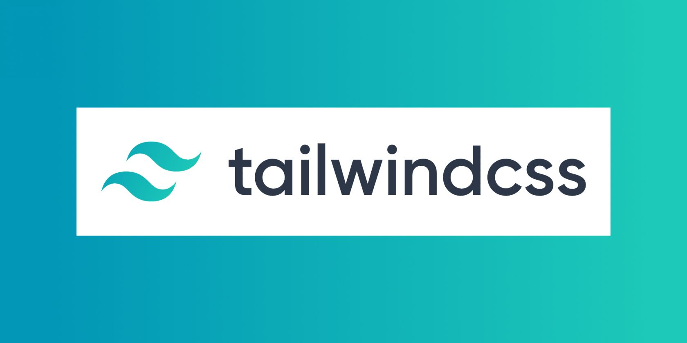
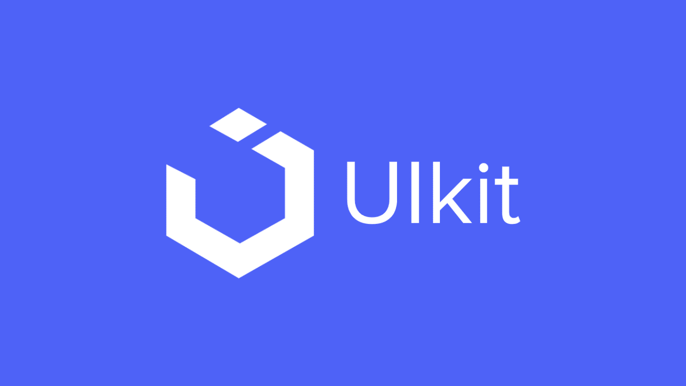
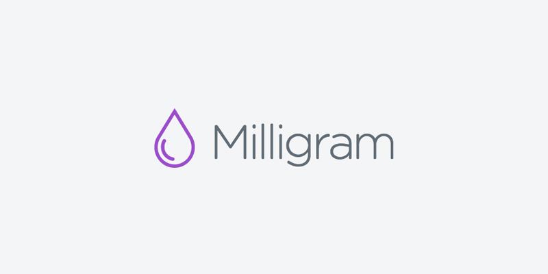
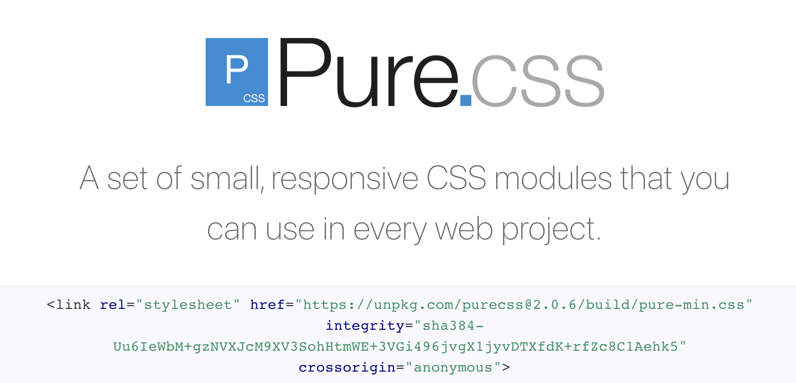
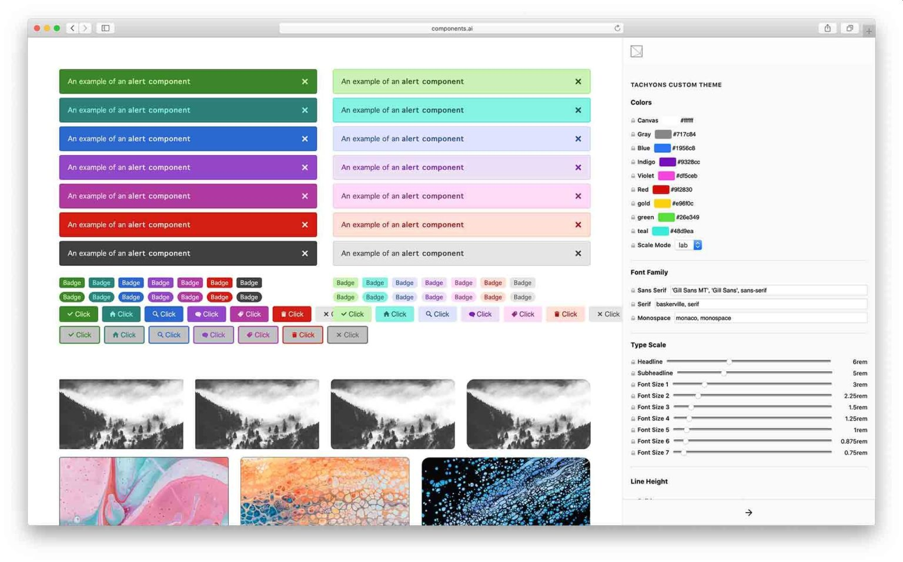
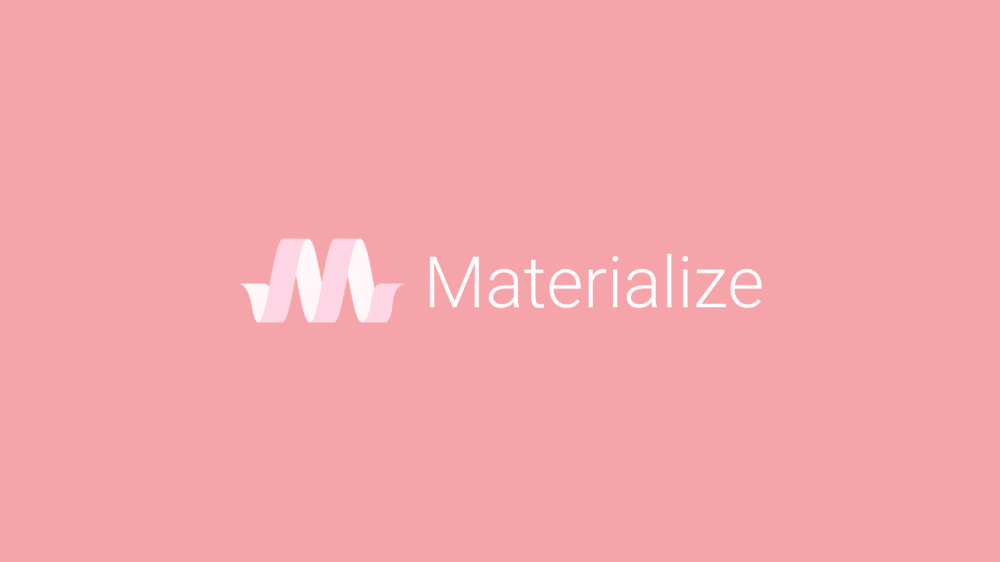

# 框架

## 1. Bootstrap
Bootstrap是 Twitter 推出的基于HTML、CSS、JavaScript 开发的简洁、直观、强悍的CSS开发框架，使得 Web 开发更加快捷。Bootstrap 提供了优雅的HTML和CSS规范，它由动态CSS语言Less写成。Bootstrap 推出后颇受欢迎，一直是GitHub上的热门开源项目。  

**Bootstrap 的优点：**

+ **最流行的前端框架：** Bootstrap 是最流行的开源项目之一。在遇到问时可以很容易的找到解决方案。
+ **功能齐全：**它不仅是一个开发框架，还是一个预构建的动态模板，包含很多现成的组件。这可以使任何开发人员，即使没有前端经验，也可以更轻松地开发结构良好的页面。
+ **可定制：**使用 SASS 可以轻松定制 Bootstrap。可以使用 npm 安装项目，导入需要的部分，并使用 SASS 变量自定义几乎所有内容。使用 SASS 自定义 Bootstrap 网站可以缩短开发时间。
+ **成熟且受支持：**Bootstrap 最初由 Twitter 退出，现在由数百名开发人员组成的社区维护，确保稳定发布和长期支持。

**Bootstrap 的缺点：**

+ **难以覆盖：** Bootstrap 具有非常具体的设计和外观，如果想要不同的风格，就很难覆盖。由于它广泛的使用 CSS 中的!important规则，因此可能很难覆盖默认值。
+ **依赖 jQuery：**与其他仅支持 CSS 的框架不同，Bootstrap 4 的许多交互功能都依赖于 jQuery。这使得将它与 React 或 Vue 等 JavaScript 框架一起使用变得更加困难，但也不是不可能。不过，即将发布的 Boostrap 5 将删除 jQuery 依赖项。
+ **依赖繁重：** Bootstrap 在项目中非常繁重，尽管可以只导入需要的部分，但它不像其他框架那样轻量级或模块化。

**GitHub：**[https://github.com/twbs/bootstrap](https://github.com/twbs/bootstrap)

## 2. Foundation
Foundation 是一个用于开发响应式的 HTML, CSS 和 JavaScript 框架。它是一个易用、强大而且灵活的框架，用于构建基于任何设备上的 Web 应用，是一个移动优先的流行框架。

实际上，Foundation 不仅仅是一个 CSS 框架，而是一系列前端开发工具。这些工具可以一起使用，也可以完全独立使用。  

**Foundation 的优点：**

+ **通用风格：**与 Bootstrap 不同，Foundation 没有为其组件使用独特的风格。其广泛的模块化和灵活的组件具有最小的样式，并且可以轻松定制。
+ **功能齐全：** Foundation  提供了很多内置组件。还可以访问由开发团队或社区创建的预定义的 HTML 模板，可以根据需求去使用这些模板。
+ **电子邮件设计：**oundation for Emails 可以为任何客户端创建响应式电子邮件模板，包括旧版本的 Microsoft Outlook。
+ **动画：** Foundation 可以轻松地与 ZURB 的 Motion UI 库集成，让我们可以使用内置效果来创建过渡和动画。

****

**Foundation 的缺点：**

+ **难学：** Foundation 有很多特性，比其他框架复杂得多。在进行前端布局时，它提供了很大的自由度，所以我们就需要了解这一切是如何工作的。
+ **依赖 Javascript：** Foundation 的许多功能都依赖于 Javascript，使用 jQuery 或 Zepto。Zepto 是一个与 jQuery 使用相同语法但占用空间更小的库。这使得 Foundation 不太适合 React 或 Angular 项目。Zepto 也是一个鲜为人知的库，没有多少开发人员熟悉。

**GitHub：**[https://github.com/foundation/foundation-sites](https://github.com/foundation/foundation-sites)

## 3. Bulma
Bulma 是一个免费的开源CSS框架，它提供了现成的前端组件，可以轻松地组合这些组件来构建响应式 Web 界面。Bulma 框架最大的特点就是简单好用。所有样式都基于class，只需为 HTML 元素指定class，样式立刻生效。

  
**Bulma 的优点：**

+ **美学设计：**Bulma 它采用简洁现代的设计，即使不更改默认设置，最终也会得到一个漂亮的网页。
+ **现代：**CSS 的 flexbox 布局使得创建响应式布局变得更加容易，而 Bulma 是最早基于 flexbox 实现的框架之一。
+ **对开发人员友好：**Bulma 旨在为开发人员提供出色的体验。考虑到这一点，Bulma 提供了易于使用和记忆的命名约定。
+ **易于定制：** Bulma 的颜色、填充和许多默认属性都可以使用 SASS 进行定制。这样，可以在几分钟内设置项目的默认值。
+ **没有 Javascript：** Bulma 不包含 JavaScript 功能。由于它是纯 CSS 的，因此可以轻松地与 Vue 或 React 等 Javascript 框架集成。

**Bulma 的缺点：**

+ **独特的风格：**Bulma的独特风格是一把双刃剑。由于它非常独特，如果它被过度使用，最终会得到看起来非常相似的网站，就像 Bootstrap 一样。
+ **不太完整：** Bulma 在许多情况下都在与 Boostrap 竞争，但在可访问性和其他企业级功能方面并不完整。

**GitHub：**[https://github.com/jgthms/bulma](https://github.com/jgthms/bulma)

## 4. Tailwind
Tailwind CSS 是一个功能类优先的 CSS 框架，它集成了诸如 flex, pt-4, text-center 和 rotate-90 这样的类，它们能直接在HTML中组合起来，构建出任何设计。

**Tailwind 的优点：**

+ **原子 CSS：**Tailwind 通过提供强大的实用程序类使常见的样式易于实现。这种方法有时被称为原子 CSS，其中 HTML 元素的类清楚地描述了它的外观。只需使用指定的class，样式即可生效。
+ **没有设计：** Tailwind 没有预制组件或特定的设计语言。所以不必覆盖现有样式，在自定义设计时可以提高工作效率。
+ **可重用组件：**尽Tailwind 允许创建自己的自定义组件，可以在整个项目中重用这些组件，还可以在官网上找到一些组件示例。
+ **强大的 PostCSS/SASS 集成：**要充分利用 Tailwind，需要安装并将其导入 SASS 或 PostCSS 项目。这使可以利用 Tailwind 的所有功能来编写更有效的 CSS。

  
**Tailwind 的缺点：**

+ **学习成本高：**对于经验不足的开发人员来说，Tailwind 并不是最佳选择。由于它不提供预制组件，因此需要充分了解前端技术的工作原理。Tailwind 的学习成本较高，必须学习相关语法才能使用该框架高效工作。
+ **不能直接使用：** Tailwind 可以作为捆绑的 CSS 文件添加到项目中。但如果这样添加框架，它的许多功能将不可用，并且将无法使用压缩版本（压缩版 27 KB、原始版 348 KB ）。要充分利用 Tailwind，需要知道如何使用 Webpack、Gulp 或其他前端构建工具。

**GitHub：**[https://github.com/tailwindlabs/tailwindcss](https://github.com/tailwindlabs/tailwindcss)

## 5. UIkit
UIkit 是 YOOtheme 团队开发的一款轻量级、模块化的前端框架，可快速构建强大的web前端界面。UIKit提供了全面的HTML、CSS、JavaScript组件，它们使用简单，容易定制和扩展。它基于LESS开发，代码结构清晰简单，易于扩展和维护，并且具有体积小、反应灵敏的响应式组件，可以根据 UIKit 基本的风格样式，轻松地自定义创建出自己喜欢的主题样式。

**UIkit 的优点：**

+ **数十个组件：** UIKit 通过了数十个组件，可以实现复杂的前端布局。它包括所有典型的实用程序和组件，并且可以访问高级元素，如导航栏、画布外边栏和视差设计等。
+ **可扩展：** UIKit 可以使用 LESS 或 SASS 预处理器轻松定制和扩展。
+ **基于 UI 的定制器：** UIKit 提供了一个基于 Web 的定制器，可以实时定制设计，然后将 SASS 或 LESS 变量复制到项目中。

**<u>  
</u>****UIkit 的缺点：**

+ **不适合小型项目：**不建议经验不足的开发人员使用 UIKit，因为它是一个复杂的框架，需要深入了解。它非常适合高级应用程序，但对于小型项目可能太复杂了。
+ **社区较小：**它不像其他框架那样受欢迎，遇到问题可能较难找到答案。

**GitHub：**[https://github.com/uikit/uikit](https://github.com/uikit/uikit)

## 6. Milligram
Milligram 提供了最小的样式设置，以快速和干净为起点。压缩后只有 2kb！它为更好的性能和更高的生产力而设计，需要重置的属性更少，代码更简洁。

**Milligram ****的优点：**

+ **极简 CSS 框架：** Milligram 易于设置和上手。尽管它提供了强大的功能来提高生产力，但它在压缩后仅有 2 KB。
+ **无默认样式：**与其他框架不同，Milligram 没有默认样式。在实现自定义样式时，无需重置或覆盖不符合目标的属性。
+ **易于学习：**非常简单，阅读官方文档足以入门。

**Milligram ****的缺点：**

+ **无模板：**Milligram 没有提供预制的模板。
+ **社区较小：** Milligram 有一个小而紧密的社区。寻找社区的支持并不像使用更流行的 CSS 框架那么容易。

**GitHub：**[https://github.com/milligram/milligram](https://github.com/milligram/milligram)

## 7. Pure
Pure.css是美国雅虎公司出品的一组轻量级、响应式纯CSS模块，适用于任何Web项目。这个框架非常小，在使用所有模块时压缩后只有 3.7 KB。

**Pure 的优点：**

+ **轻量：**每一行 CSS 都经过仔细考虑和编写，以使框架轻量级和高性能。
+ **可定制：**可以以模块化方式导入 Pure 并仅实现需要的内容。
+ **支持良好：**与社区项目不同，Pure 得到  Yahoo 的支持，这使得该项目成为长期使用的安全选择。
+ **现成的组件：** Pure 带有响应式和为现代网络构建的预制组件。

****

**Pure 的缺点：**

+ **不适用于小团队：** Pure 不适合经验不足或者小型的团队，因为需要创建自己的设计来使用该框架。

**GitHub：**[https://github.com/pure-css/pure](https://github.com/pure-css/pure)

## 8. Tachyons
Tachyons与其他流行的前端框架不同，Tachyons旨在将CSS规则分解为小型的、可管理的、以及可复用的部件。Tachyons可以帮助开发人员创建出具有高度可读性、能够快速加载和响应的网站，而且无需使用大量CSS代码。

**Tachyons 的优点：**

+ **即用型组件：**尽管 Tachyons 专注于提供出色的实用程序类以提高生产力，但官方文档也包含许多即用型组件。
+ **多样化：**Tachyons 提供可用于不同设置的功能模板，例如静态 HTML、Rails、React、Angular 等。
+ **可重复使用：** Tachyon 是创建可扩展设计系统的绝佳选择。该框架允许创建可重用的属性来构建多样化和灵活的组件。

****

**Tachyons 的缺点：**

+ **主要用于 PostCSS：** PostCSS 是使用 Tachyons 的主要方式，但不像 LESS 或 SASS 那样广泛使用。Tachyons 确实提供了 SASS 的集成，但它并未得到广泛使用和支持。

**GitHub：**[https://github.com/tachyons-css/tachyons](https://github.com/tachyons-css/tachyons)

## 9. Materialize
Materialize是一个使用CSS，JavaScript和HTML创建的UI组件库。实现UI组件有助于构建有吸引力，一致和功能的网页和网络应用程序，同时坚持现代网络设计原则，如浏览器可移植性，设备独立性和优雅的降级。它有助于创建更快，更美观，更灵敏的网站。它的灵感来自Google Material Design。

**Materialize 的优点：**

+ **功能齐全：** Materialize CSS 提供了很多预制组件，还带有更高级的 Javascript 功能来支持交互。
+ **移动友好：**可以使用框架的类似移动设备的组件（例如浮动导航栏和滑动交互）创建渐进式 Web 应用程序。

**Materialize 的缺点：**

+ **严格的设计语言：**如果想做一些不接近材料设计的事情，最好避免使用 Materialise。
+ **独立项目：** Materialise 有一个活跃的社区，但它是一个小型且独立的项目，没有企业支持。

**GitHub：**[https://github.com/Dogfalo/materialize](https://github.com/Dogfalo/materialize)

## 10. 总结
这些 CSS 框架都在一定程度上有助于提高工作效率。那该如何选择这些框架呢？

+ 想要更多的功能以及预制的组件，选择 Bootstrap、Bulma、Materialize；
+ 想要只提供实用程序类而不提供样式的框架，选择 Tailwind、Milligram、Pure；
+ 想要高水平社区支持的框架，选择 Bootstrap、Foundation；
+ 想要更轻量的框架，选择 Tailwind、Milligram。

最后，还是要根据实际的项目需求和个人喜好来选择最适合自己的CSS框架。

> 更新: 2022-04-04 23:03:26  
> 原文: <https://www.yuque.com/cuggz/feplus/gu6q2w>