# 父选择器

你有没有想过使用CSS选择器来检查父元素中是否存在特定的元素？例如，如果一个卡片组件中有图片，就给它添加一个`display:flex`。这以前在CSS中是无法实现的，但是新的CSS选择器`:has`就可以帮助我们选择包含特定元素的父元素。下面来看看这个全新的 CSS 选择器吧！

## :has 选择器概述

在CSS中，我们无法根据元素中是否存在特定的元素来设置父元素的样式，要想实现这一点，就必须创建CSS类，并根据需要进行类的切换。来看下面的例子：

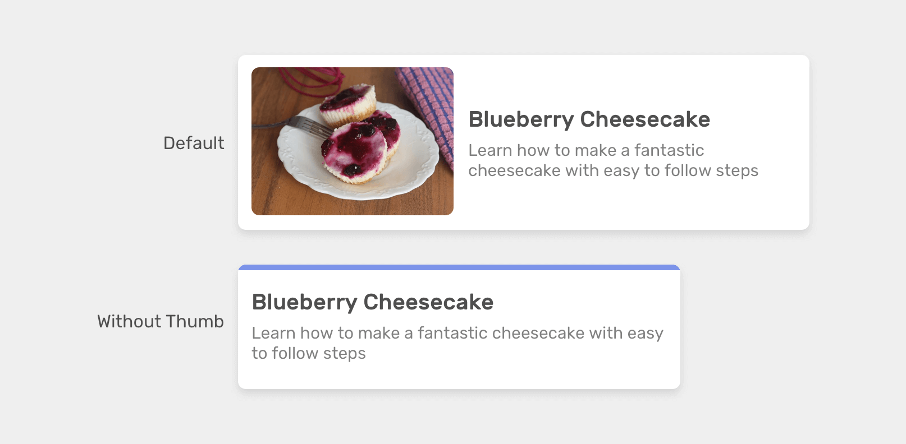

这里我们有两种卡片：包含图片和不包含图片。在CSS中需要这样做：

```css
/* 有图片的卡片 */
.card {
  display: flex;
  align-items: center;
  gap: 1rem;
}

/* 没有图片的卡片 */
.card-plain {
  display: block;
  border-top: 3px solid #7c93e9;
}
```

```html
<!-- 有图片的卡片 -->
<div class="card">
  <div class="card-image">
    
  </div>
  <div class="card-content">
    卡片内容
  </div>
</div>

<!-- 没有图片的卡片 -->
<div class="card card-plain">
  <div class="card-content">
    卡片内容
  </div>
</div>
```

这里创建了一个类`card-plain`，专门用于没有图片的卡片，在没有图片时就不需要`flex`布局。如果使用 CSS 中的父选择器 `:has` 就不需要再写这个类，只需要使用它来检查卡片中是否包含`.card-image`即可：

```css
.card:has(.card-image) {
  display: flex;
  align-items: center;
}
```

**根据 CSS 规范，**<code>**:has**</code>\*\* 选择器可以检查父元素是否包含至少一个元素，或者一个条件，例如输入是否获取到焦点。\*\*

## :has 选择器不仅与父元素有关

:has 选择器不仅可以检查父元素是否包含特定的子元素，还可以检查一个元素后面是否跟有另一个元素：

```css
.card h2:has(+ p) { }
```

这将检查 `<h2>` 元素是否直接跟在 `<p>` 元素之后。

我们也可以将它与表单元素一起使用来检查输入是否获取到了焦点：

```css
form:has(input:focused) {
    background-color: lightgrey;
}
```

## :has 选择器使用示例

下面来看看一些使用`:has`选择器实现页面效果的案例吧！

### 1. 标题样式

当处理章节标题时有两种情况，一种是只包含标题，另一种包含标题和链接。

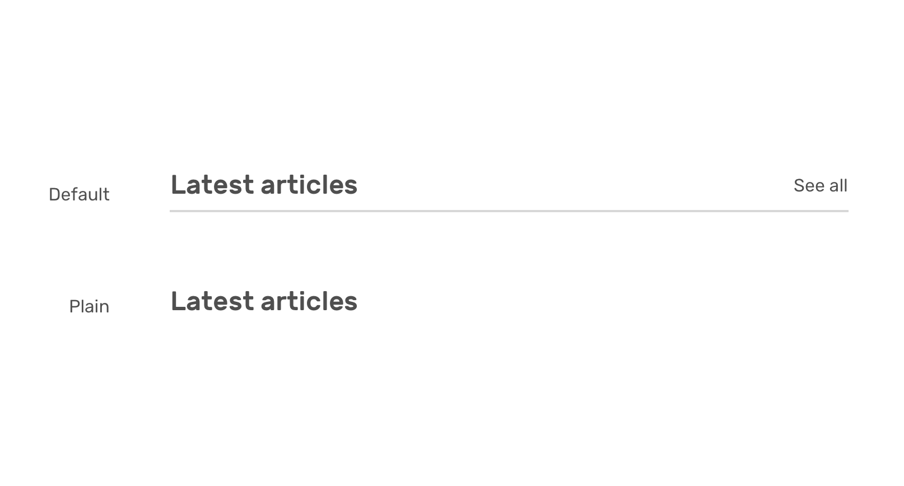

根据是否有链接来定义不同的样式：

```html
<section>
  <div class="section-header">
    <h2>Latest articles</h2>
    <a href="/articles/>See all</a>
  </div>
</section>
```

```css
.section-header {
  display: flex;
  justify-content: space-between;
}

.section-header:has(> a) {
  align-items: center;
  border-bottom: 1px solid;
  padding-bottom: 0.5rem;
}
```

这里使用了`:has(> a)`，它表示只选择直接子元素。

### 2. 卡片布局

有两种类型的卡片操作：一种只有一个操作（链接），另一种具有多个操作（保存、分享等）。

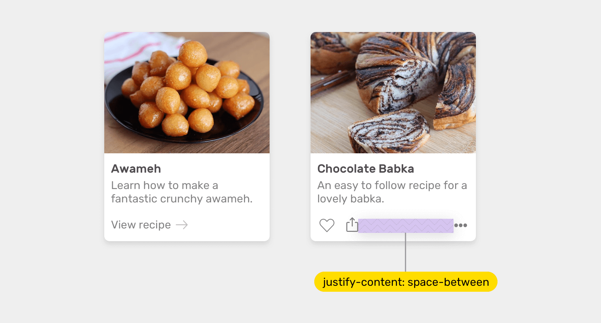

当图片具有多个操作时需要给这些操作添加`display: flex`，可以这样来实现:

```html
<div class="card">
    <div class="card-thumb></div>
    <div class="card-content">
        <div class="card-actions">
            <div class="start">
                <a href="#">Like</a>
                <a href="#">Save</a>
            </div>
            <div class="end">
                <a href="#">More</a>
            </div>
        </div>
    </div>
</div>
```

```css
.card-actions:has(.start, .end) {
  display: flex;
  justify-content: space-between;
}
```

### 3. 卡片圆角

根据是否有图片来重置卡片组件的`border-radius`。

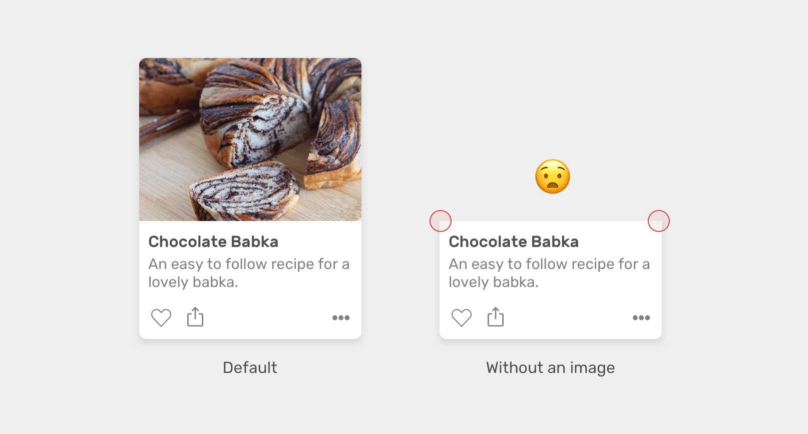

```css
.card:not(:has(img)) .card-content {
    border-top-left-radius: 12px;
    border-top-right-radius: 12px;
}

.card img {
    border-top-left-radius: 12px;
    border-top-right-radius: 12px;
}

.card-content {
    border-bottom-left-radius: 12px;
    border-bottom-right-radius: 12px;
}
```

实现效果如下：

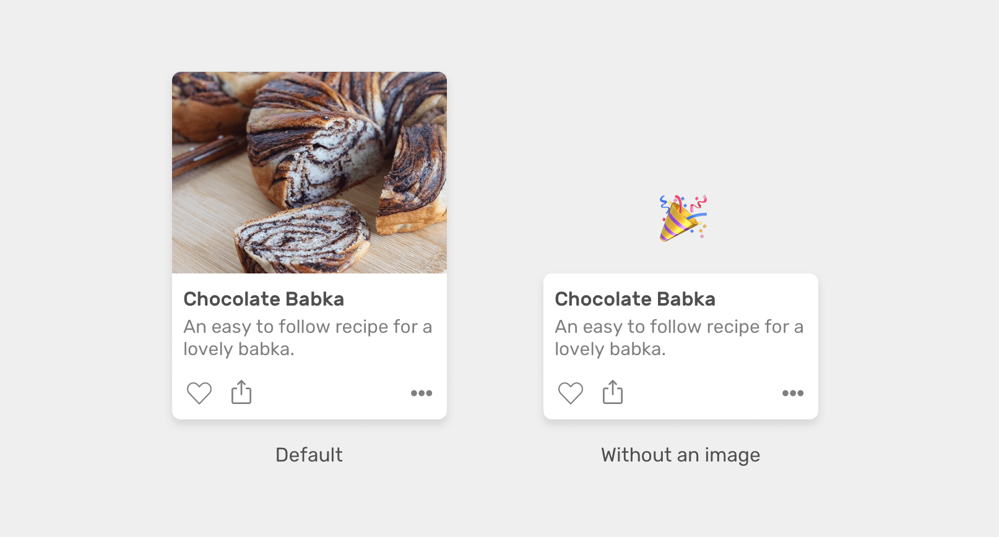

### 4. 过滤组件

有一个具有多个选项的组件，当它们没有被选中时，不显示重置按钮。当选中其中一个选项时，显示重置按钮。

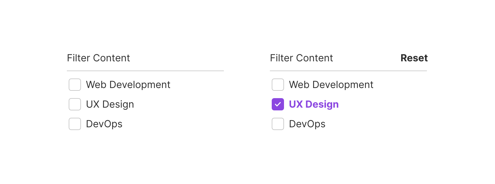

可以使用 `:has`选择器轻松实现这个功能：

```css
.btn-reset {
    display: none;
}

.multiselect:has(input:checked) .btn-reset {
    display: block;
}
```

### 5. 显示或隐藏表单元素

有时可能需要根据之前的选择来显示特定的表单字段。 在下面的例子中，当下拉框选中“other”字段时，就展示 other reason 输入框：

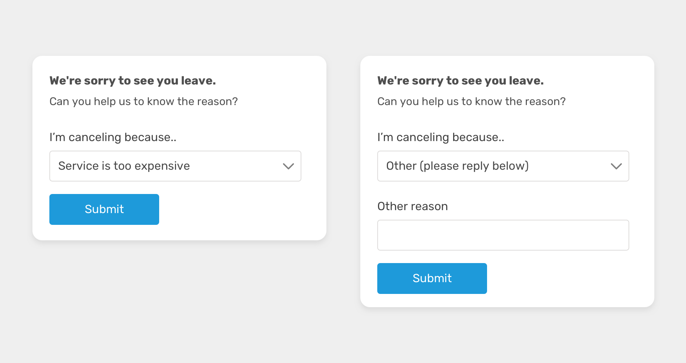

使用 CSS `:has` 选择器就可以检查选择菜单是否选择了 other 字段，并在此基础上显示 other reason 输入框：

```css
.other-field {
    display: block;
}

form:has(option[value="other"]:checked) .other-field {
    display: block;
}
```

### 6. 导航栏

有一个带有子菜单的导航栏，当鼠标悬停在菜单项上时展示子菜单：

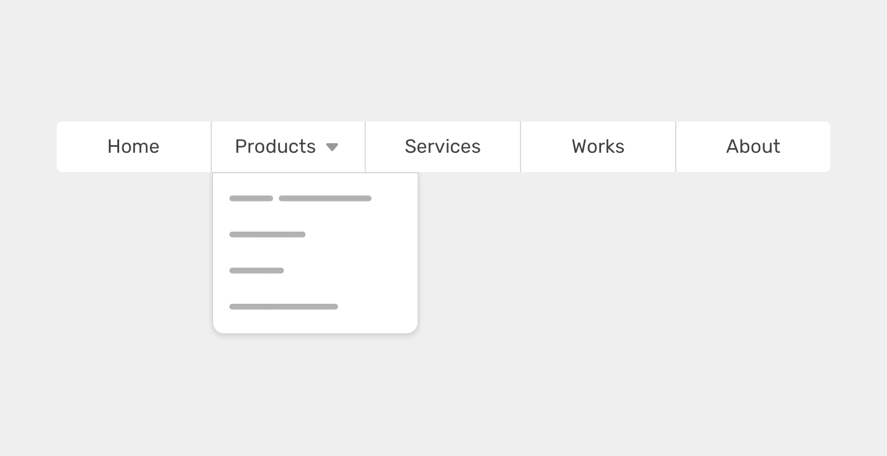

我们需要做的就是根据是否展示子菜单来显示或隐藏右侧的箭头。可以使用`:has` 选择器轻松实现这一点，这里只需检查`li`元素中是否包含`ul`即可：

```css
li:has(ul) > a:after {
    content: "";
}
```

### 7. 强制警报

在某些仪表板中，可能需要用户必须注意重要警报。在这种情况下，拥有页内警报可能还不够。例如，在这种情况下，可能会为标题元素添加红色边框和暗红色背景色。这样会增加用户快速注意到警报的可能性。

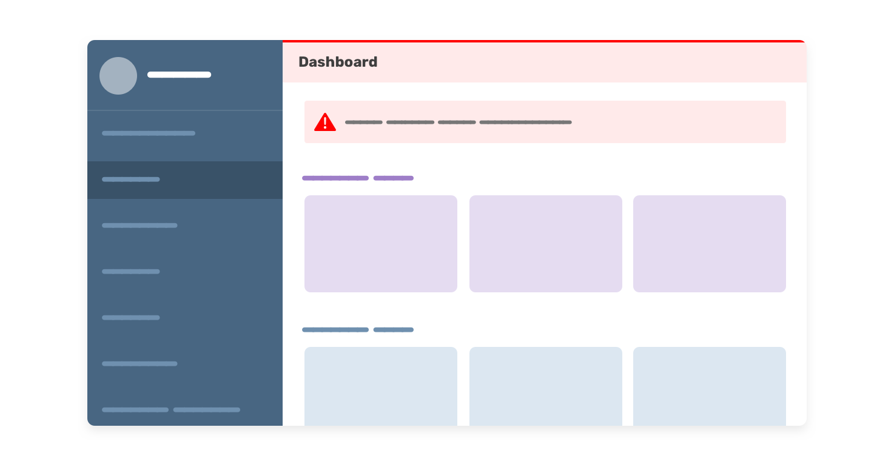

CSS `:has` 就可以检查`.main`元素是否有警报。如果有，将以下样式添加到标题中：

```css
.main:has(.alert) .header {
    border-top: 2px solid red;
    background-color: #fff4f4;
}
```

### 8. 切换配色方案

可以使用 CSS `:has` 来更改网站的配色方案。例如，如果有多个使用 CSS 变量构建的主题，可以通过`<select>`菜单来进行切换。

```css
html {
    --color-1: #9e7ec8;
    --color-2: #f1dceb;
}
```

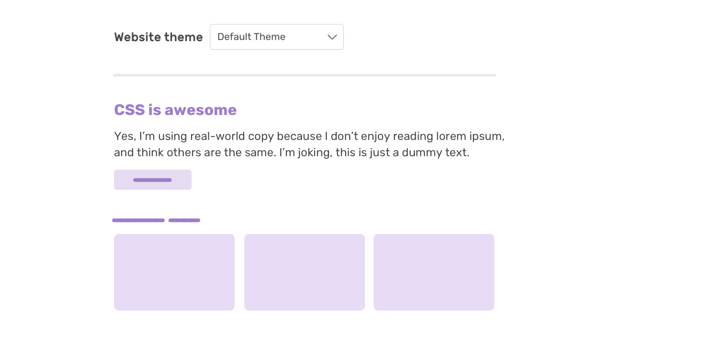

当选择另一个主题时，CSS 变量将被更改：

```css
html:has(option[value="blueish"]:checked) {
    --color-1: #9e7ec8;
    --color-2: #f1dceb;
}
```

显示效果如下：

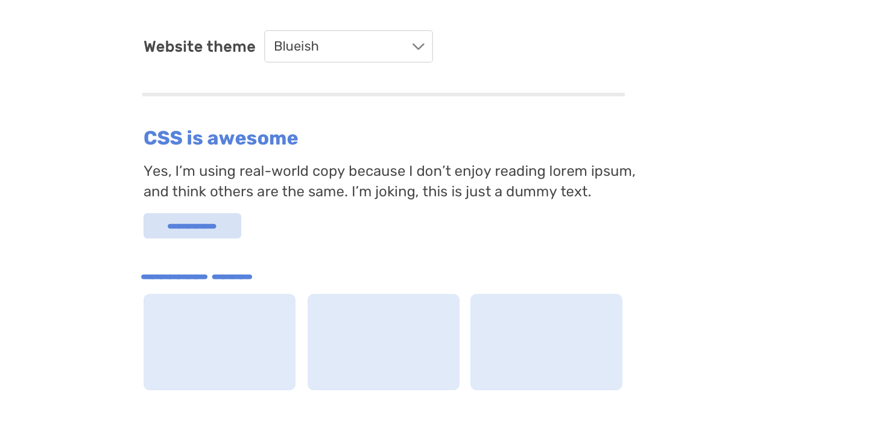

### 10. 带有图标的按钮

有一个默认的按钮样式。当按钮中包含图标时，使用 flexbox 来居中对齐按钮的内容：

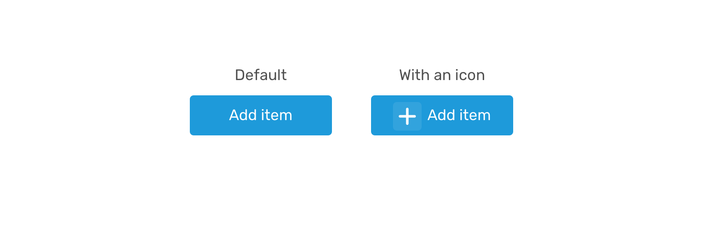

```css
.button:has(.c-icon) {
    display: inline-flex;
    justify-content: center;
    align-items: center;
}
```

### 11. 多个按钮

有一组操作按钮，如果超过 2 个按钮，则最后一个按钮显示在右侧：

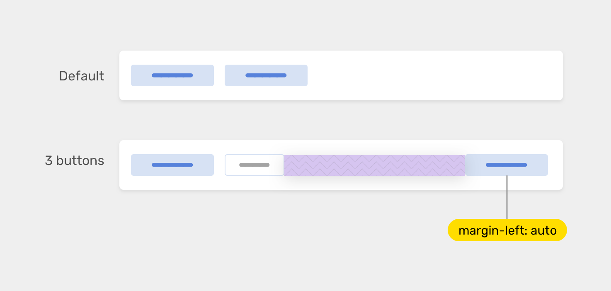

可以使用数量查询来实现这一点。下面的 CSS 将检查按钮的数量是否为 3 或更多。如果是，则最后一个 flex 项目将使用 `margin-left: auto`：

```css
.btn-group {
    display: flex;
    align-items: center;
    gap: 0.5rem;
}
  
.btn-group:has(.button:nth-last-child(n + 3)) .button:last-child {
    margin-left: auto;
}
```

### 12. 根据项目数更改网格

使用 CSS grid 布局中，可以使用 `minmax()` 功能创建真正响应式和自动调整大小的网格项。然而，这可能还不够，我们还想根据项目数量来改变网格。

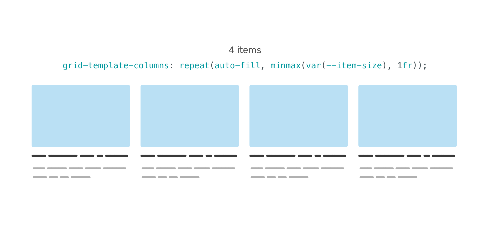

```css
.wrapper {
    --item-size: 200px;
    display: grid;
    grid-template-columns: repeat(auto-fill, minmax(var(--item-size), 1fr));
    gap: 1rem;
}
```

当有 5 个项目时，最后一个将换行：

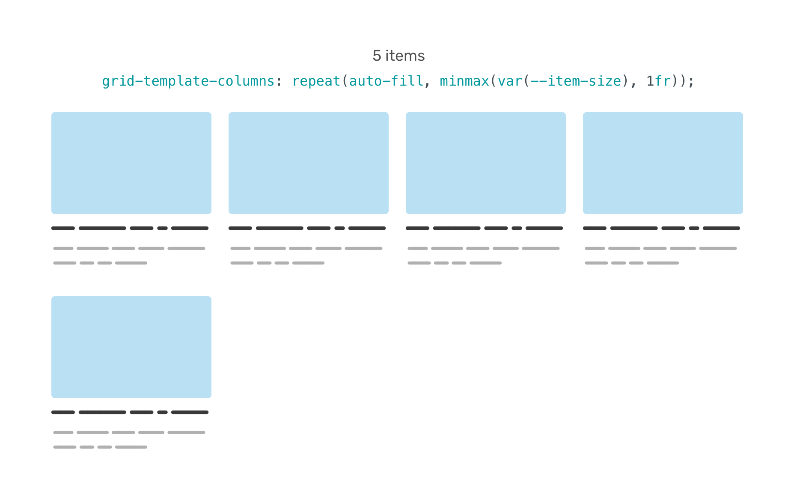

可以通过检查`.wrapper`中是否有 5 个或更多项目来解决这个问题。同样，这是使用到了数量查询的概念。

```css
.wrapper:has(.item:nth-last-child(n + 5)) {
    --item-size: 120px;
}
```

实现效果如下：

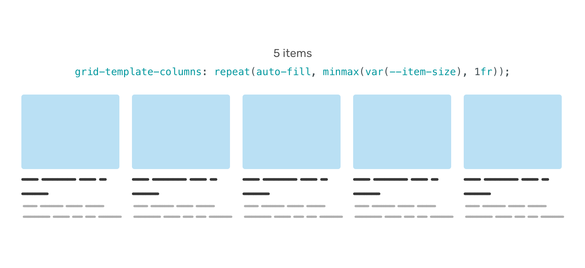

## 浏览器支持

目前，`:has` 选择器已经在 Safari 15.4 和 Chrome Canary 中得到了支持。

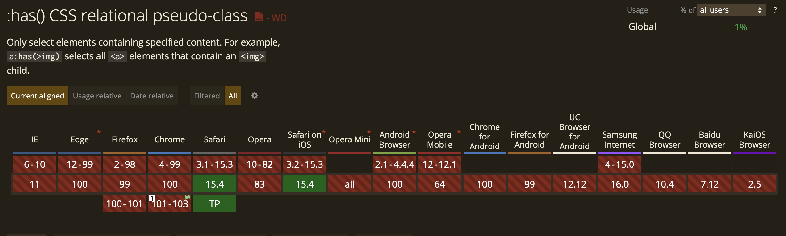

可以使用 CSS 中的`@supports`规则来判断浏览器是否支持该选择器：

```css
@supports selector(:has(*)) {
  
}
```

> 参考：<https://ishadeed.com/article/css-has-parent-selector/>


> 更新: 2023-01-15 20:03:44  
> 原文: <https://www.yuque.com/cuggz/feplus/cbihb9>