# 网页置灰

从前端的角度看看网页置灰是如何实现的，以及相关使用技巧！

## 实现思路

先来看看一些主流网站是如何实现置灰的：

* **BiliBili：**

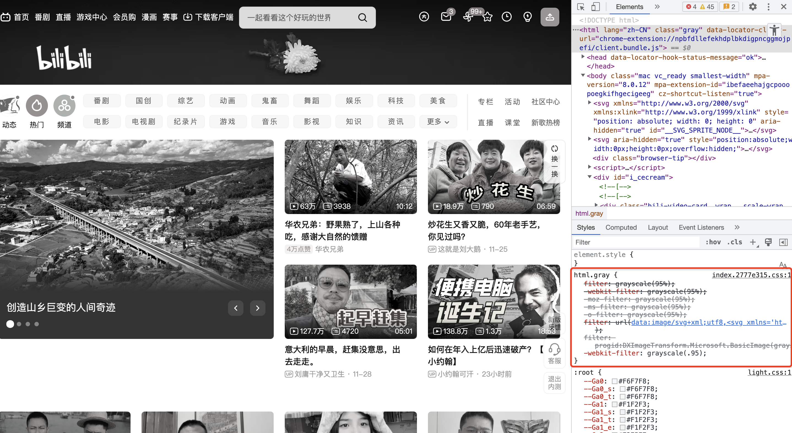

* **淘宝：**


* **京东：**

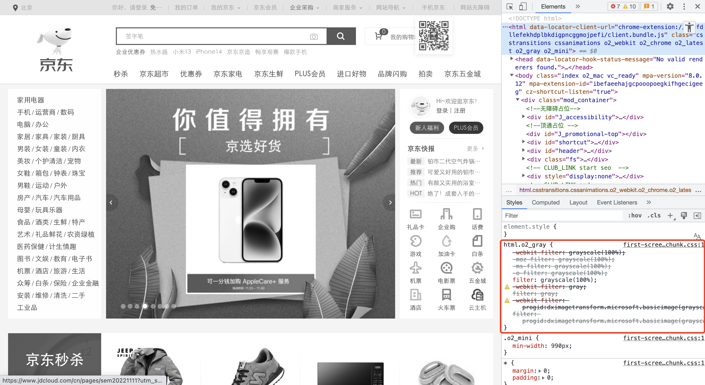

* **掘金：**

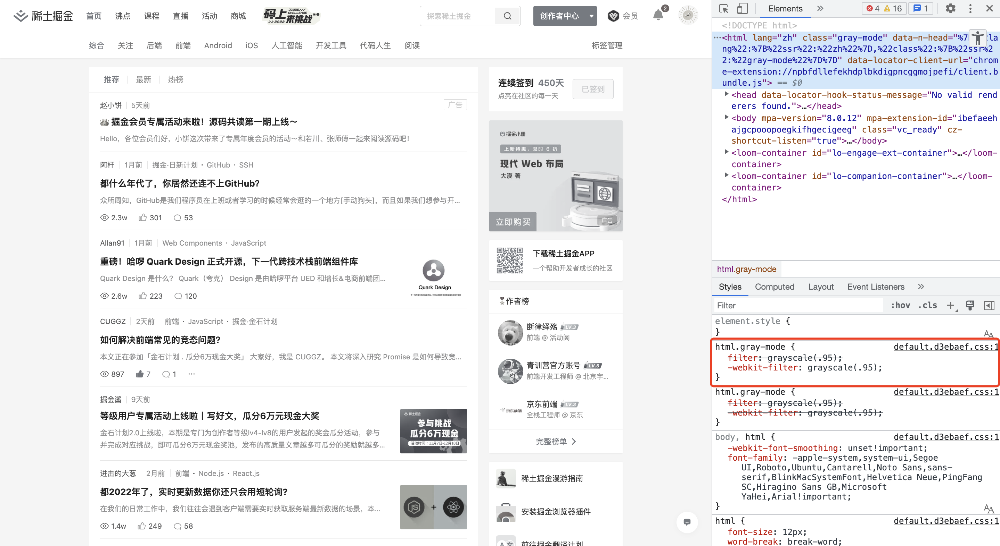

可以看到，这些网站实现置灰的方式都完全一样，但都大同小异。本质上都是使用了 CSS 中的 filter 属性。下面是 MDN 对 filter 属性的解释：

> CSS 属性 **filter** 将模糊或颜色偏移等图形效果应用于元素。滤镜通常用于调整图像、背景和边框的渲染。

简单来说，**filter 属性就是用来给元素添加不同的滤镜**。该属性中支持传入多种 Filter 函数，其中 grayscale() 函数就是用于置灰的关键。grayscale() 函数将改变输入图像灰度，该函数有一个参数，表示转换为灰度的比例。当值为 100% 时，完全转为灰度图像；当值为 0% 时图像无变化。值在 0% 到 100% 之间，则是效果的线性乘数。若未设置值，默认是 0。

因此，只要将页面 html 元素设置以下样式即可实现页面置灰：

```css
html {
     filter: grayscale(100%);
}
```

那为啥很多网站的置灰不止这一条呢？可以看到京东的置灰代码如下：

```css
html.o2_gray {
    -webkit-filter: grayscale(100%);
    -moz-filter: grayscale(100%);
    -ms-filter: grayscale(100%);
    -o-filter: grayscale(100%);
    filter: grayscale(100%);
    -webkit-filter: gray;
    filter: gray;
    -webkit-filter: progid:dximagetransform.microsoft.basicimage(grayscale=1);
    filter: progid:dximagetransform.microsoft.basicimage(grayscale=1);
}
```

其实这些属性最终的实现效果都是一样的，它们为了对 filter 属性进行兼容。filter 属性是 CSS3 增加的属性，在不同浏览器以及低版本浏览器上，filter 属性的兼容性不尽相同：

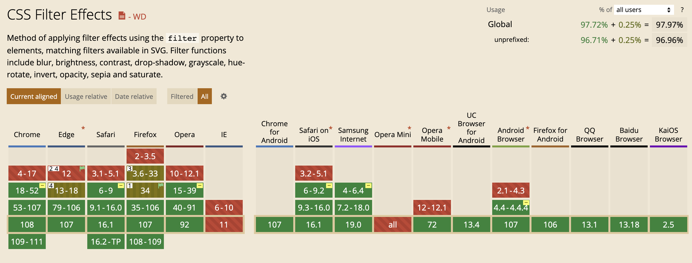

对于上面的代码，其中：

* `-webkit-filter`： 带有 webkit 前缀可以在 webkit 内核的浏览器中生效；
* `-moz-filter`：带有 moz  前缀可以在 Firefox 浏览器中生效；
* `-ms-filter`：带有 ms 前缀可以在 IE 浏览器生效；
* `-o-filter`：带有 o 前缀可以在 Opera 浏览器生效；
* 最后三行都是为了兼容 IE 内核的浏览器。

那如何实现动态添加呢？只需要将这些滤镜属性写在一个类中，在需要的时候动态的将该类型添加到 html 标签上即可。

```css
.gray {
    -webkit-filter: grayscale(100%);
    -moz-filter: grayscale(100%);
    -ms-filter: grayscale(100%);
    -o-filter: grayscale(100%);
    filter: grayscale(100%);
    -webkit-filter: gray;
    filter: gray;
    -webkit-filter: progid:dximagetransform.microsoft.basicimage(grayscale=1);
    filter: progid:dximagetransform.microsoft.basicimage(grayscale=1);
}
```

## 相关拓展

接下来我们看看 filter 属性还有哪些实用的属性值！

```css
filter: blur() | brightness() | contrast() | drop-shadow() | grayscale() | hue-rotate() | invert() | opacity() | sepia() | saturate() | url();
```

#### （1）blur()：模糊

blur() 函数用于设置元素\*\*模糊效果，\*\*它将高斯模糊视觉效果应用于元素。此函数接受一个 CSS 长度值来确定屏幕上有多少像素需要相互融合以生成模糊结果。 传递的 CSS 长度值越大，应用到元素的模糊度就越高。如果不提供值，则使用默认值 0。

```css
.image {
  -webkit-filter: blur(0|2px|5px); 
  filter: blur(0|2px|5px);
}
```

下面是使用三个值时对应的效果：

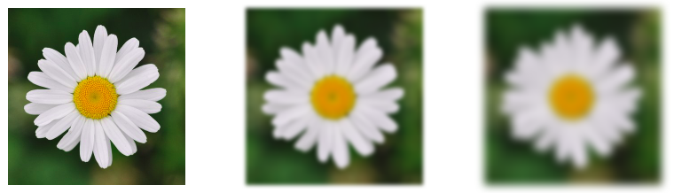

这个属性可以用来实现常见的毛玻璃效果。

#### （2）brightness()：亮度

brightness() 函数可用于调整图像的亮度级别，使其看起来更亮或更暗。当值为 0% 时，会产生全黑图像。值为 100% 或 1 会使图像保持其原始亮度级别。大于或小于 100% 或 1 的值决定图像的暗度或亮度。

```css
.image {
  -webkit-filter: brightness(50%|100%|200%); 
  filter: brightness(50%|100%|200%);
}
```

下面是使用三个值时对应的效果：

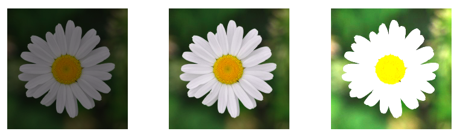

#### （3）contrast()：对比度

contrast() 函数用于调整图像的对比度，也就是调整图像最暗和最亮部分之间的亮度差异 。 它接受百分比或小数值来确定图像的对比度级别——值为 0 会导致完全灰色的图像。高于 100% 和 1 的值会增加对比度，而低于 100% 的参数会降低图像的对比度。

```css
.image {
  -webkit-filter: contrast(50%|100%|200%); 
  filter: contrast(50%|100%|200%);
}
```

下面是使用三个值时对应的效果：

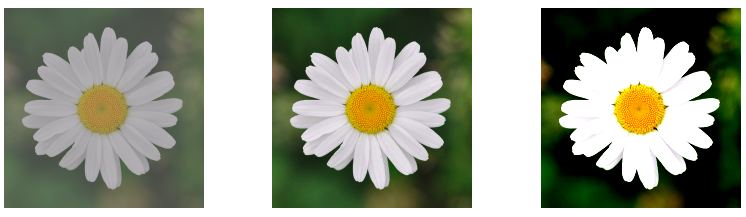

#### （4）opacity()：不透明度

opacity() 函数将透明效果应用于图像。它接受百分比或小数值来决定应用于图像的透明度。0% 或 0 的不透明度将产生完全透明的元素。100% 不透明度将显示不透明。将不透明度设置在 0% 和 100% 之间将使元素或图像部分透明。

```css
.image {
  -webkit-filter: opacity(10%|40%|80%); 
  filter: opacity(10%|40%|80%);
}
```

下面是使用三个值时对应的效果：

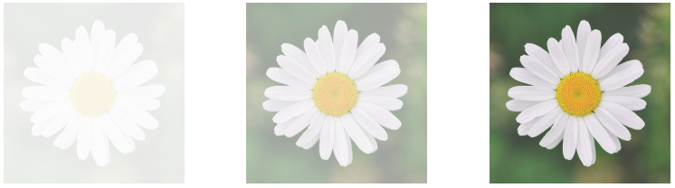

那这个不透明度滤镜和CSS中的 opacity 属性有啥区别的？它们都用于控制元素的透明度。但是 filter 属性会**启动硬件加速**。浏览器会将计算任务卸载到图形处理单元 (GPU) — 一种旨在加速系统内图形渲染的专用处理器。这会提高浏览器的效率并释放 CPU 来执行其他任务。

#### （5）sepia() ：棕褐色

sepia() 函数可以为图像添加柔和的褐色色调，使图像看起来更温暖、更复古。它类似于使用灰度滤镜，但色调为褐色。它接受 0 到 1 之间的小数值，或最大为 100% 的百分比值。值为 0 会使图像保持不变。值为 100% 或 1 会将图像完全变为棕褐色，而介于 0% 和 100% 之间的值会使图像的色调介于其原始颜色和完全棕褐色之间。

```css
.image {
  -webkit-filter: sepia(10%|40%|80%); 
  filter: sepia(10%|40%|80%);
}
```

下面是使用三个值时对应的效果：

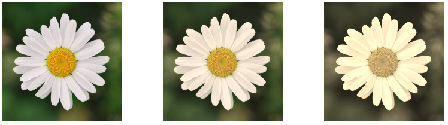

#### （6）drop-shadow()：阴影

drop-shadow() 函数用于增加图像的阴影，和 box-shadow 的作用类似，使图像看起来更加立体。

drop-shadow() 函数接受四个参数：

* `<offset-x>`：长度值，指定元素和投影之间的水平距离。正值将阴影置于元素右侧，负值将阴影置于左侧。
* `<offset-y>`：长度值，指定元素和投影之间的垂直距离。正值将阴影置于元素下方，负值将阴影置于其上方。
* `<blur-radius>`: 阴影的模糊半径指定为 CSS 长度单位。值越大，阴影变得越模糊。如果未指定，则默认为 0，产生清晰且不模糊的阴影。不允许使用负值。
* `<color>`：阴影的颜色。如果未指定，则默认为黑色。

```css
.image-1 {
  filter: drop-shadow(0);
}

.image-2 {
  -webkit-filter: drop-shadow(4px 4px 10px yellow);
  filter: drop-shadow(4px 4px 10px yellow);
}

.image-3 {
  -webkit-filter: drop-shadow(8px 8px 12px yellow);
  filter: drop-shadow(8px 8px 12px yellow);
}
```

下面是使用三个值时对应的效果：

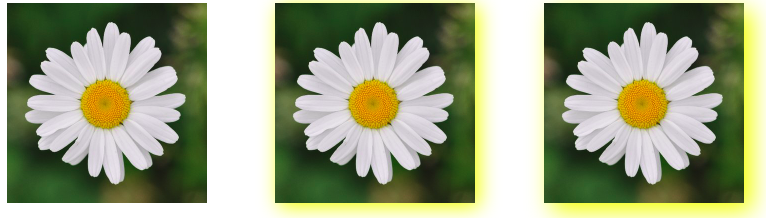

#### （7）saturate()：**饱和度**

saturate() 函数用于改变元素中颜色的饱和度。饱和元素的颜色比较鲜艳；对于曝光不足的图像可以增加饱和度，反之亦然。 饱和度可以用百分比表示，0% 表示完全不饱和，100% 表示与原图像一样。

```css
.image {
  -webkit-filter: saturate(10%|150%|350%); 
  filter: saturate(10%|150%|350%);
}
```

下面是使用三个值时对应的效果：

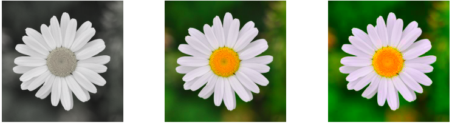

#### （8）注意事项

上面介绍的滤镜都是单个使用的，其实 filter 属性支持设置多个滤镜，其语法如下：

```css
.multiple-effects {
    filter: blur() | brightness() | contrast() | drop-shadow() | grayscale() | hue-rotate() | invert() | opacity() | saturate() | sepia() | url();
}
```

CSS 会根据它们出现的顺序将它们应用于元素：

```css
img {
   filter: opacity(50%) drop-shadow(20px 10px 0px black);
}
```

除此之外，`filter` 属性还接受以下两个值：

* `initial`：`filter` 属性的默认值，会解析为 `none`。
* `inherit`：从元素的直接父级计算的 `filter` 属性的值。


> 更新: 2022-12-02 22:51:49  
> 原文: <https://www.yuque.com/cuggz/feplus/zi9brsxh5kcldg9i>