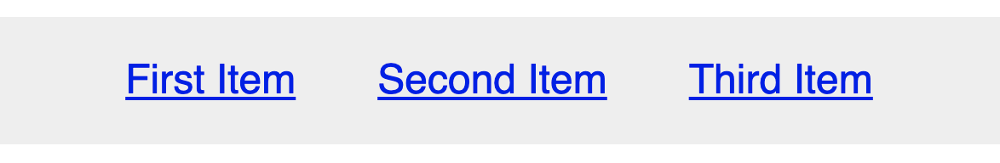
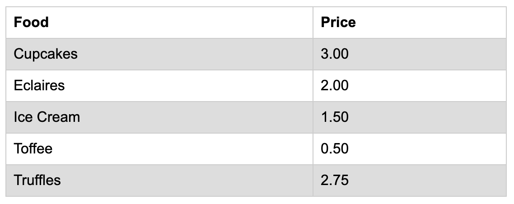
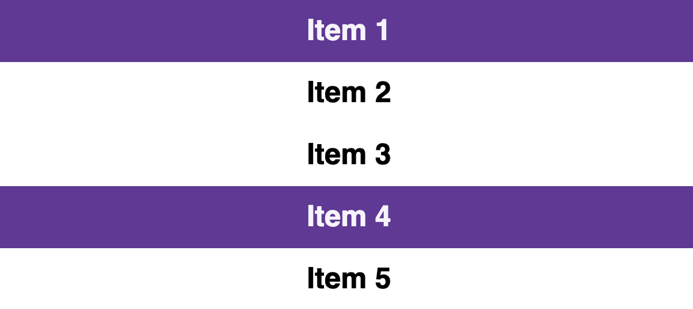
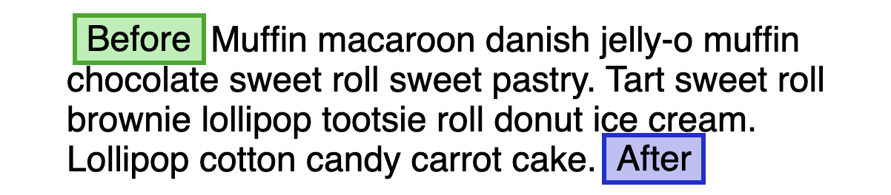
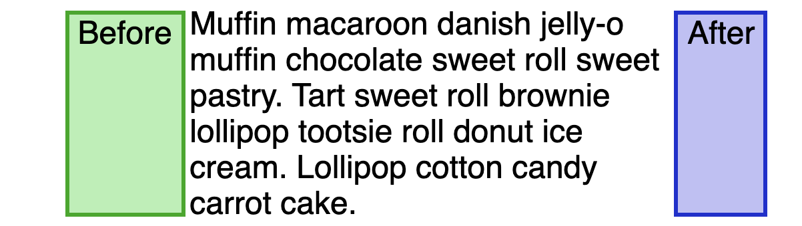
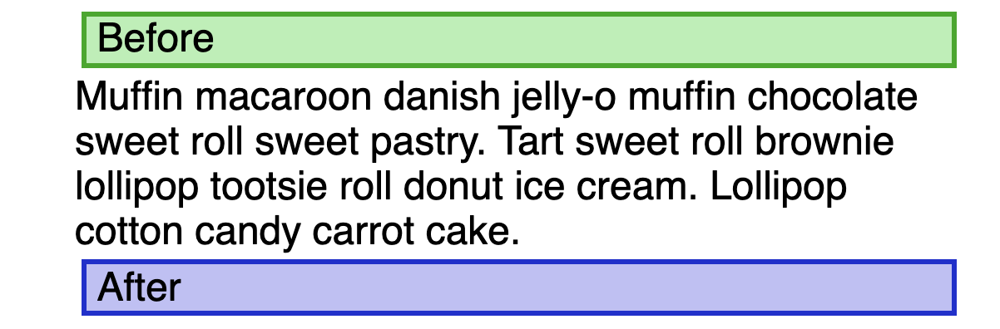

# 高级选择器

## 一、基础选择器

在说高级选择器之前，先来回顾一下CSS中的基础选择器。

### 1. 元素选择器

最常见的 CSS 选择器就是元素选择器。选择器通常将是某个 HTML 元素：

```css
h1 {
  color: red;
  font-size: 50px;
}
```

在 W3C 标准中，元素选择器又称为类型选择器（type selector）。类型选择器匹配文档语言元素类型的名称。类型选择器匹配文档树中该元素类型的每一个实例。

### 2. ID 选择器

id 选择器用来指定具有ID的元素的样式。ID 选择器前面有一个 # 号 - 也称为棋盘号或井号。

```css
#my_id {
  color: red;
  font-size: 50px;
}
```

需要注意，在一个 HTML 文档中，ID 选择器会使用一次，而且仅一次。并且 ID 选择器不能结合使用，因为 ID 属性不允许有以空格分隔的词列表。

### 3. 类选择器

CSS类选择器会根据元素的类属性中的内容匹配元素。类属性被定义为一个以空格分隔的列表项，在这组类名中，必须有一项与类选择器中的类名完全匹配，此条样式声明才会生效。类选择器也是我们最常用的选择器之一。

```css
.my_class {
  color: red;
  font-size: 50px;
}
```

## 二、通配选择器

在CSS中，一个星号(\*)就是一个通配选择器，之所以如此命名，是因为它普遍适用于所有元素，可以匹配任意类型的HTML元素。那通配符选择器有啥实际应用呢？其会常用于全局样式重置，比如 CSS 盒子模型重置：

```css
*,
*::before,
*::after {
  box-sizing: border-box;
}
```

这意味着我们希望所有元素在盒子模型计算中包括padding和border，而不是将这些宽度添加到任何定义的尺寸。例如，在以下规则中，`.box`宽度将是200px，而不是200px + 20px：

```css
.box {
  width: 200px;
  padding: 10px;
}
```

## 三、属性选择器

CSS 属性选择器通过已经存在的属性名或属性值匹配元素。这是一个非常强大的选择器，但是通常没有充分发挥其潜力。CSS 属性选择器可以获得类似于正则表达式的匹配结果。这对于修改 BEM 风格的系统或其他使用相关类名但可能不是单个通用类名的框架非常有用。来看一个例子：

```css
[class*="component_"]
```

这个选择器将选择所有具有包含 `component_` 字符串的类的元素。

可以通过在关闭属性选择器之前包含 i 来确保匹配不区分大小写：

```css
[class*="component_" i]
```

当然我们也可以不指定属性值，而是简单的检查它是否存在，例如下面的选择器会选择具有任何class值 的所有 a 标签：

```css
a[class]
```

属性选择器可以用来执行一些基本的**可访问性检查**，例如：

```css
img:not([alt]) {
  outline: 2px solid red;
}
```

这将为所有不包含 `alt` 属性的图像添加轮廓。

## 四、子代选择器

当使用  > 选择符分隔两个元素时，它只会匹配那些作为第一个元素的\*\*直接后代(\*\*子元素)的第二元素。子组合选择器是唯一处理元素级别的选择器，并且可以组合以选择嵌套元素。

✅ 选择 article > p

```html
<article>
  <p>Hello world</p>
</article>
```

🚫 未选择 article > p

```html
<article>
  <blockquote>
    <p>Hello world</p>
  </blockquote>
</article>
```

有一个侧边栏导航列表，从语义上讲，这会是一个包含 li 元素的 ul 元素列表。我们可能希望顶层链接的样式与嵌套链接的样式不同。要仅针对顶级链接，可以使用以下选项：

```css
nav > ul > li > a {
  font-weight: bold;
}
```

## 五、通用兄弟选择器

兄弟选择符，位置无须紧邻，只须同层级，A~B 选择A元素之后所有同层级B元素。

例如，p~img 将为位于段落后面某个位置的所有图像设置样式，前提是它们属于同一个父元素：

```html
<article>
  <p>Paragraph</p>
  <h2>Headline 2</h2>
  
  <h3>Headline 3</h3>
  
</article>
```

将通用兄弟选择器与有状态伪类选择器（如：checked）相结合，可以产生有趣的效果。复选框的HTML结构如下：

```html
<input id="terms" type="checkbox" />
<label for="terms">terms</label>
```

只有选中复选框之后下面的样式才会生效：

```css
#terms:checked ~ p {
  font-style: italic;
  color: #797979;
}
```

## 六、相邻兄弟选择器

**相邻兄弟选择器** (+) 介于两个选择器之间，当第二个元素\_紧跟在\_第一个元素之后，并且两个元素都是属于同一个父元素的子元素，则第二个元素将被选中。

当我们想给一个列表之间添加间隙时，最常用的方式是给每个元素添加一个外边距，但是这样就还需要去除第一个元素的外边距。我们可以使用相邻兄弟选择器来协助添加外边距：

```css
nav ul li + li {
  margin-left: 2rem;
}
```

这样就可以在列表项之间产生间隙效果，而无需在第一个项目上清除额外的边距。



除此之外，我们还可以使用相邻兄弟选择器方便得给label标签和表单标签之间添加间隙：

```css
label + input {
  margin-left: 10px;
}
```

## 七、伪类选择器

CSS 伪类是添加到选择器的关键字，指定要选择的元素的特殊状态。这些极大地增强了 CSS 的功能，并启用了过去经常被错误地归入 JavaScript 的功能。

下面这些伪类选择器是有状态的：

选择器是有状态的：

* :focus
* :hover
* :visited
* :target
* :checked

以下选择器依赖于元素顺序：

* :nth-child()、:nth-of-type()
* :first-child、:first-of-type
* :last-child、:last-of-type
* :only-child、:only-of-type

还有一些非常有用的伪类比如:not()，新支持的伪类:is()，以及随着 CSS 自定义属性（变量）的支持而出现在最前沿的伪类:root。

nth系列的选择器有着很多应用，比如想实现一个交投背景色的表格，就可以使用nth-child选择器，使用even（偶数行）或者odd（奇数行）关键字即可：

```css
tbody tr:nth-child(odd) {
  background-color: #ddd;
}
```

效果如下：



当然也可以自己指定间隔规则：

```css
li:nth-child(3n + 1) {
  background-color: rebeccapurple;
}
```

这将第一个元素开始，每隔每三个元素选一个：



我们可以使用`:not()`选择器从选择器中排除元素，上面我们就使用a:not(\[class])来定位没有应用class的链接。我们可以链接:not()选择器使用，如果想为表单字段输入创建规则，但不是某些类型就可以这样写：

```css
input:not([type="hidden"]):not([type="radio"]):not([type="checkbox"])
```

也可以在:not()中包含其他伪类选择器，例如排除:disabled状态的按钮：

```css
button: not(: disabled);
```

## 八、伪元素选择器

伪元素是一个附加至选择器末的关键词，允许对被选择元素的特定部分修改样式。它们在应用中差异很大，目前最受支持的伪元素选择器如下：

* ::after
* ::before
* ::first-letter
* ::first-line
* ::selection

::before 和 ::after 伪元素可以用来创建一个额外的元素，它们在视觉上似乎是DOM的一部分，但不是真正的HTMLDOM的一部分。由于它们的行为类似于真实元素，所以在使用flexbox或grid布局时，它们会被计算为子元素，这大大增强了它们的功能。

在使用::before 和 ::after之前需要了解两个重要的概念：

* 在使其可见之前需要设置content属性，此属性可以设置为空字符串；
* 一般情况下，::before将显示在主元素内容之前，而::after将显示在其之后。

默认情况下，它们的行为类似于内联元素：



当给段落添加 `display:flex` 之后的效果如下：



切换为`display:grid`的效果如下：



我们可以使用伪元素`::selection`来定义选中文本的样式：

```css
::selection {
  background: yellow;
  color: black;
}
```


> 更新: 2022-08-11 18:07:33  
> 原文: <https://www.yuque.com/cuggz/feplus/ggcc0v>