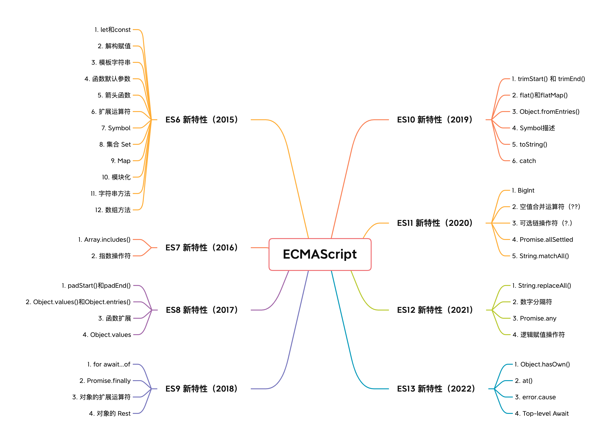
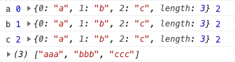
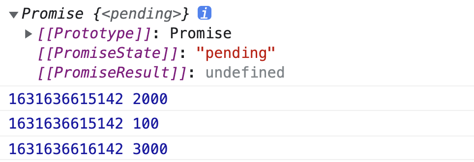

# ES6—ES13

ECMAScript 是 JavaScript 的标准与规范，JavaScript 是 ECMAScript 标准的实现和扩展。今天来看看 ECMAScript 各版本有哪些使用技巧吧！



## 一、ES6 新特性（2015）

### 1. let和const

在ES6中，新增了let和const关键字，其中 let 主要用来声明变量，而 const 通常用来声明常量。let、const相对于var关键字有以下特点：

| **特性** | **var** | **let** | **const** |
| :---: | :---: | :---: | :---: |
| 变量提升 | ✔️ | × | × |
| 全局变量 | ✔️ | × | × |
| 重复声明 | ✔️ | × | × |
| 重新赋值 | ✔️ | ✔️ | × |
| 暂时性死区 | × | ✔️ | ✔️ |
| 块作用域 | × | ✔️ | ✔️ |
| 只声明不初始化 | ✔️ | ✔️ | × |

这里主要介绍其中的四点：

#### （1）重新赋值

const 关键字声明的变量是“不可修改”的。其实，const 保证的并不是变量的值不能改动，而是变量指向的那个内存地址不能改动。对于基本类型的数据（数值、字符串、布尔值），其值就保存在变量指向的那个内存地址，因此等同于常量。但对于引用类型的数据（主要是对象和数组），变量指向数据的内存地址，保存的只是一个指针，const只能保证这个指针是不变的，至于它指向的数据结构就不可控制了。

#### （2）块级作用域

在引入let和const之前是不存在块级作用域的说法的，这也就导致了很多问题，比如内层变量会覆盖外层的同名变量：

```typescript
var a = 1;
if (true) {
  var a = 2;
}

console.log(a); // 输出结果：2 
```

循环变量会泄漏为全局变量：

```typescript
var arr = [1, 2, 3];
for (var i = 0; i < arr.length; i++) {
  console.log(arr[i]);  // 输出结果：1  2  3
}

console.log(i); // 输出结果：3
```

而通过let和const定义的变量存在块级作用域，就不会产生上述问题：

```typescript
let a = 1;
if (true) {
  let a = 2;
}

console.log(a); // 输出结果：1

const arr = [1, 2, 3];
for (let i = 0; i < arr.length; i++) {
  console.log(arr[i]);  // 输出结果：1  2  3
}

console.log(i); // Uncaught ReferenceError: i is not defined
```

#### （3）变量提升

我们知道，在ES6之前是存在变量提升的，所谓的变量提升就是变量可以在声明之前使用：

```typescript
console.log(a); // 输出结果：undefined
var a = 1;
```

变量提升的本质是JavaScript引擎在执行代码之前会对代码进行编译分析，这个阶段会将检测到的变量和函数声明添加到 JavaScript 引擎中名为 Lexical Environment 的内存中，**并赋予一个初始化值 undefined**。然后再进入代码执行阶段。所以在代码执行之前，JS 引擎就已经知道声明的变量和函数。

这种现象就不太符合我们的直觉，所以在ES6中，let和const关键字限制了变量提升，let 定义的变量添加到 Lexical Environment 后不再进行初始化为 undefined 操作，JS 引擎只会在执行到词法声明和赋值时才进行初始化。而在变量创建到真正初始化之间的时间跨度内，它们无法访问或使用，ES6 将其称之为**暂时性死区：**

```typescript
// 暂时性死区 开始
a = "hello";     //  Uncaught ReferenceError: Cannot access 'a' before initialization

let a;   
//  暂时性死区 结束
console.log(a);  // undefined
```

#### （4）重复声明

在ES6之前，var关键字声明的变量对于一个作用域内变量的重复声明是没有限制的，甚至可以声明与参数同名变量，以下两个函数都不会报错：

```typescript
function funcA() {
  var a = 1;
  var a = 2;
}

function funcB(args) {
  var args = 1; 
}
```

而let修复了这种不严谨的设计：

```typescript
function funcA() {
  let a = 1;
  let a = 2;  // Uncaught SyntaxError: Identifier 'a' has already been declared
}

function funcB(args) {
  let args = 1;  // Uncaught SyntaxError: Identifier 'args' has already been declared
}
```

现在我们项目中已经完全放弃了var，而使用let来定义变量，使用const来定义常量。在ESlint开启了如下规则：

```javascript
"no-var": 0;
```

### 2. 解构赋值

ES6中还引入了解构赋值的概念，解构赋值遵循“模式匹配”，即只要等号两边的模式相等，左边的变量就会被赋予对应的值。不同类型数据的解构方式不同，下面就分别来看看不同类型数据的解构方式。

平时在开发中，我主要会用到**对象的解构赋值**，比如在React中解构porps值等，使用解构赋值来获取父组件传来的值；在React Hooks中的useState使用到了数组的解构赋值；

#### （1）数组解构

具有 Iterator 接口的数据结构，都可以采用数组形式的解构赋值。

```typescript
const [foo, [[bar], baz]] = [1, [[2], 3]];
console.log(foo, bar, baz) // 输出结果：1  2  3
```

这里，ES6实现了对数组的结构，并依次赋值变量foo、bar、baz。数组的解构赋值按照位置将值与变量对应。

数组还可以实现不完全解构，只解构部分内容：

```typescript
const [x, y] = [1, 2, 3];   // 提取前两个值
const [, y, z] = [1, 2, 3]  // 提取后两个值
const [x, , z] = [1, 2, 3]  // 提取第一三个值
```

如果解构时对应的位置没有值就会将变量赋值为undefined：

```typescript
const [x, y, z] = [1, 2]; 
console.log(z）  // 输出结果：undefined
```

数组解构赋值可以使用rest操作符来捕获剩余项：

```typescript
const [x, ...y] = [1, 2, 3];   
console.log(x);  // 输出结果：1
console.log(y);  // 输出结果：[2, 3]
```

在解构时还支持使用默认值，当对应的值为undefined时才会使用默认值：

```typescript
const [x, y, z = 3] = [1, 2]; 
console.log(z）  // 输出结果：3
```

#### （2）对象解构

对象的解构赋值的本质其实是先找到同名的属性，在赋值给对应的变量：

```typescript
let { foo, bar } = { foo: 'aaa', bar: 'bbb' };
console.log(foo, bar); // 输出结果：aaa  bbb
```

需要注意的是，在JavaScript中，对象的属性是没有顺序的。所以，在解构赋值时，变量必须与属性同名才能去取到值。

对象的解构赋值也是支持默认值的，当定义的变量在对象中不存在时，其默认值才会生效：

```typescript
let { foo, bar, baz = 'ccc'} = { foo: 'aaa', bar: 'bbb', baz: null };
console.log(foo, bar, baz); // 输出结果：aaa  bbb  null

let { foo, bar, baz = 'ccc'} = { foo: 'aaa', bar: 'bbb' };
console.log(foo, bar, baz); // 输出结果：aaa  bbb  ccc
```

可以看到，只有定义的变量是严格的===undefined时，它的默认值才会生效。

除此之外，我们还需要注意，不能给已声明的变量进行赋值，因为当缺少 let、const、var 关键词时，将会把 {baz} 理解为代码块从而导致语法错误，所以下面代码会报错：

```typescript
let baz;
{ baz } = { foo: 'aaa', bar: 'bbb', baz: 'ccc' };
```

可以使用括号包裹整个解构赋值语句来解决上述问题：

```typescript
let baz;
({ baz } = { foo: 'aaa', bar: 'bbb', baz: 'ccc' });
console.log(baz)
```

在对象的解构赋值中，可以将现有对象的方法赋值给某个变量，比如：

```typescript
let { log, sin, cos } = Math;
log(12)  // 输出结果：2.4849066497880004
sin(1)   // 输出结果：0.8414709848078965
cos(1)   // 输出结果：0.5403023058681398
```

#### （3）其他解构赋值

剩下的几种解构赋值，目前我在项目中应用的较少，来简单看一下。

* **字符串解构**

字符串解构规则：只要等号右边的值不是对象或数组，就先将其转为类数组对象，在进行解构：

```javascript
const [a, b, c, d, e] = 'hello';
console.log(a, b, c, d, e)  // 输出结果：h e l l o
```

类数组对象有 length 属性，因此可以给这个属性进行解构赋值：

```javascript
let {length} = 'hello';    // 输出结果： 5
```

由于字符串都是一个常量，所以我们通常是知道它的值是什么的，所以很少会使用变量的解构赋值。

* **数值和布尔值解构赋值**

对数值和布尔值进行解构时，它们将会先被转为对象，然后再应用解构语法：

```javascript
let {toString: s} = 123;
s === Number.prototype.toString // 输出结果：true

let {toString: s} = true;
s === Boolean.prototype.toString // 输出结果：true

```

注意null和undefined不能转换为对象，所以如果右边是这两个值，就会报错。

* **函数参数解构赋值**

函数参数表面上是一个数组，在传入参数的那一刻，就会被解构为x和y。

```javascript
function add([x, y]){
  return x + y;
}
add([1, 2]);   // 3
```

除此之外，我们还可以解构函数的返回值：

```javascript
function example() {
  return [1, 2, 3];
}
let [a, b, c] = example();
```

### 3. 模板字符串

传统的JavaScript语言中，输出模板经常使用的是字符串拼接的形式，这样写相当繁琐，在ES6中引入了模板字符串的概念来解决以上问题。

模板字符串是增强版的字符串，用反引号\`\`来标识，他可以用来定义单行字符串，也可以定义多行字符串，或者在字符串中嵌入变量。

```javascript
// 字符串中嵌入变量
let name = "Bob", time = "today";
`Hello ${name}, how are you ${time}?`

// 字符串中调用函数
` ${fn()} 
```

在平时的开发中，除了上面代码中的应用，很多地方会用到模板字符串，比如拼接一个DOM串，在Emotion/styled中定义DOM结构等，都会用到模板字符串。不过在模板字符串中定义DOM元素就不会有代码提示了。

在使用模板字符串时，需要注意以下几点：

* 如果在字符串中使用反引号，需要使用\来转义；
* 如果在多行字符串中有空格和缩进，那么它们都会被保留在输出中；
* 模板字符串中嵌入变量，需要将变量名写在${}之中；
* 模板字符串中可以放任意的表达式，也可以进行运算，以及引用对象的属性，甚至可以调用函数；
* 如果模板字符中的变量没有声明，会报错。

### 4. 函数默认参数

在ES6之前，函数是不支持默认参数的，ES6实现了对此的支持，并且只有不传入参数时才会触发默认值：

```javascript
function getPoint(x = 0, y = 0) {
  console.log(x, y);
}

getPoint(1, 2);   // 1  2
getPoint()        // 0  0 
getPoint(1)       // 1  0
```

当使用函数默认值时，需要注意以下几点：

#### （1）函数length属性值

函数length属性通常用来表示函数参数的个数，当引入函数默认值之后，length表示的就是第一个有默认值参数之前的普通参数个数：

```javascript
const funcA = function(x, y) {};
console.log(funcA.length);  // 输出结果：2 

const funcB = function(x, y = 1) {};
console.log(funcB.length);  // 输出结果：1

const funcC = function(x = 1, y) {};
console.log(funcC.length);  // 输出结果 0 
```

#### （2）参数作用域

当给函数的参数设置了默认值之后，参数在被初始化时将形成一个独立作用域，初始化完成后作用域消解：

```javascript
let x = 1;

function func(x, y = x) {
  console.log(y);
}

func(2);  
```

这里最终会打印出2。在函数调用时，参数 x, y 将形成一个独立的作用域，所以参数中的y会等于第一个参数中的x，而不是上面定义的1。

### 5. 箭头函数

ES6中引入了箭头函数，用来简化函数的定义：

```javascript
const counter = (x, y) => x + y;
```

相对于普通函数，箭头函数有以下特点：

#### （1）更加简洁

* 如果没有参数，就直接写一个空括号即可
* 如果只有一个参数，可以省去参数的括号
* 如果有多个参数，用逗号分割
* 如果函数体的返回值只有一句，可以省略大括号

```javascript
// 1. 不传入参数
const funcA = () => console.log('funcA');
// 等价于
const funcA = function() {
  console.log('funcA');
} 

// 2. 传入参数
const funcB = (x, y) => x + y;
// 等价于
const funcB = function(x, y) {
  return x + y;
} 

// 3. 单个参数的简化
const funcC = (x) => x;
// 对于单个参数，可以去掉 ()，简化为
const funcC = x => x;
// 等价于
const funcC = function(x) {
  return x;
}

// 4. 上述代码函数体只有单条语句，如果有多条，需要使用 {}
const funcD = (x, y) => { console.log(x, y); return x + y; }
// 等价于
const funcD = function(x, y) {
  console.log(x, y);
  return x + y;
}
```

#### （2）不绑定 this

箭头函数不会创建自己的this， 所以它没有自己的this，它只会在自己作用域的上一层继承this。所以箭头函数中this的指向在它在定义时已经确定了，之后不会改变。

```javascript
var id = 'GLOBAL';
var obj = {
  id: 'OBJ',
  a: function(){
    console.log(this.id);
  },
  b: () => {
    console.log(this.id);
  }
};
obj.a();    // 'OBJ'
obj.b();    // 'GLOBAL'
new obj.a()  // undefined
new obj.b()  // Uncaught TypeError: obj.b is not a constructor
```

对象obj的方法b是使用箭头函数定义的，这个函数中的this就永远指向它定义时所处的全局执行环境中的this，即便这个函数是作为对象obj的方法调用，this依旧指向Window对象。需要注意，定义对象的大括号`{}`是无法形成一个单独的执行环境的，它依旧是处于全局执行环境中。

***

同样，使用call()、apply()、bind()等方法也不能改变箭头函数中this的指向：

```javascript
var id = 'Global';
let fun1 = () => {
    console.log(this.id)
};
fun1();                     // 'Global'
fun1.call({id: 'Obj'});     // 'Global'
fun1.apply({id: 'Obj'});    // 'Global'
fun1.bind({id: 'Obj'})();   // 'Global'
```

#### （3）不可作为构造函数

构造函数 new 操作符的执行步骤如下：

1. 创建一个对象
2. 将构造函数的作用域赋给新对象（也就是将对象的\_\_proto\_\_属性指向构造函数的prototype属性）
3. 指向构造函数中的代码，构造函数中的this指向该对象（也就是为这个对象添加属性和方法）
4. 返回新的对象

实际上第二步就是将函数中的this指向该对象。 但是由于箭头函数时没有自己的this的，且this指向外层的执行环境，且不能改变指向，所以不能当做构造函数使用。

#### （4）不绑定 arguments

箭头函数没有自己的arguments对象。在箭头函数中访问arguments实际上获得的是它外层函数的arguments值。

### 6. 扩展运算符

扩展运算符：...  就像是rest参数的逆运算，将一个数组转为用逗号分隔的参数序列，对数组进行解包。

spread 扩展运算符有以下**用途**：

（1）将数组转化为用逗号分隔的参数序列：

```javascript
function  test(a,b,c){
    console.log(a); // 1
    console.log(b); // 2
    console.log(c); // 3
}

var arr = [1, 2, 3];
test(...arr);

```

（2）将一个数组拼接到另一个数组：

```javascript
var arr1 = [1, 2, 3,4];
var arr2 = [...arr1, 4, 5, 6];
console.log(arr2);  // [1, 2, 3, 4, 4, 5, 6]

```

（3）将字符串转为逗号分隔的数组：

```javascript
var str='JavaScript';
var arr= [...str];
console.log(arr); // ["J", "a", "v", "a", "S", "c", "r", "i", "p", "t"]
```

### 7. Symbol

ES6中引入了一个新的基本数据类型Symbol，表示独一无二的值。它是一种类似于字符串的数据类型，它的特点如下：

* Symbol的值是唯一的，用来解决命名冲突的问题
* Symbol值不能与其他类型数据进行运算
* Symbol定义的对象属性不能使用`for...in`遍历循环，但是可以使用`Reflect.ownKeys` 来获取对象的所有键名

```javascript
let s1 = Symbol();
console.log(typeof s1); // "symbol"

let s2 = Symbol('hello');
let s3 = Symbol('hello');
console.log(s2 === s3); // false
```

基于以上特性，Symbol 属性类型比较适合用于两类场景中：**常量值和对象属性**。

#### （1）避免常量值重复

getValue 函数会根据传入字符串参数 key 执行对应代码逻辑：

```javascript
function getValue(key) {
  switch(key){
    case 'A':
      ...
    case 'B':
      ...
  }
}
getValue('B');
```

这段代码对调用者而言非常不友好，因为代码中使用了魔术字符串（Magic string，指的是在代码之中多次出现、与代码形成强耦合的某一个具体的字符串或者数值），导致调用 getValue 函数时需要查看函数代码才能找到参数 key 的可选值。所以可以将参数 key 的值以常量的方式声明：

```javascript
const KEY = {
  alibaba: 'A',
  baidu: 'B',
}
function getValue(key) {
  switch(key){
    case KEY.alibaba:
      ...
    case KEY.baidu:
      ...
  }
}
getValue(KEY.baidu);
```

但这样也并非完美，假设现在要在 KEY 常量中加入一个 key，根据对应的规则，很有可能会出现值重复的情况：

```javascript
const KEY = {
  alibaba: 'A',
  baidu: 'B',
  tencent: 'B'
}
```

这就会出现问题：

```javascript
getValue(KEY.baidu) // 等同于 getValue(KEY.tencent)
```

所以在这种场景下更适合使用 Symbol，不需要关心值本身，只关心值的唯一性：

```javascript
const KEY = {
  alibaba: Symbol(),
  baidu: Symbol(),
  tencent: Symbol()
}
```

#### （2）避免对象属性覆盖

函数 fn 需要对传入的对象参数添加一个临时属性 user，但可能该对象参数中已经有这个属性了，如果直接赋值就会覆盖之前的值。此时就可以使用 Symbol 来避免这个问题。创建一个 Symbol 数据类型的变量，然后将该变量作为对象参数的属性进行赋值和读取，这样就能避免覆盖的情况：

```javascript
function fn(o) { // {user: {id: xx, name: yy}}
  const s = Symbol()
  o[s] = 'zzz'
}
```

### 8. 集合 Set

ES6提供了新的数据结构Set（集合）。它类似于数组，但是成员的值都是唯一的，集合实现了iterator接口，所以可以使用扩展运算符和 for…of 进行遍历。

Set的属性和方法：

| **属性和方法** | **概述** |
| :---: | :---: |
| size | 返回集合的元素个数 |
| add | 增加一个新的元素，返回当前的集合 |
| delete | 删除元素，返回布尔值 |
| has | 检查集合中是否包含某元素，返回布尔值 |
| clear | 清空集合，返回undefined |

```javascript
//创建一个空集合
let s = new Set();
//创建一个非空集合
let s1 = new Set([1,2,3,1,2,3]);
//返回集合的元素个数
console.log(s1.size);       // 3
//添加新元素
console.log(s1.add(4));     // {1,2,3,4}
//删除元素
console.log(s1.delete(1));  //true
//检测是否存在某个值
console.log(s1.has(2));     // true
//清空集合
console.log(s1.clear());    //undefined
```

由于集合中元素的唯一性，所以在实际应用中，可以使用set来实现数组去重：

```javascript
let arr = [1,2,3,2,1]
Array.from(new Set(arr))  // {1, 2, 3}
```

这里使用了Array.form()方法来将数组集合转化为数组。

可以通过set来求两个数组的交集和并集：

```javascript
// 模拟求交集 
let intersection = new Set([...set1].filter(x => set2.has(x)));

// 模拟求差集
let difference = new Set([...set1].filter(x => !set2.has(x)));

```

用以下方法可以进行数组与集合的相互转化：

```javascript
// Set集合转化为数组
const arr = [...mySet]
const arr = Array.from(mySet)

// 数组转化为Set集合
const mySet = new Set(arr)
```

### 9. Map

ES6提供了Map数据结构，它类似于对象，也是键值队的集合，但是它的键值的范围不限于字符串，可以是任何类型（包括对象）的值，也就是说， Object 结构提供了“ 字符串—值” 的对应， Map 结构提供了“ 值—值” 的对应， 是一种更完善的 Hash 结构实现。 如果需要“ 键值对” 的数据结构， Map 比 Object 更合适。Map也实现了iterator接口，所以可以使用扩展运算符和 for…of 进行遍历。

Map的属性和方法：

| **属性和方法** | **概述** |
| :---: | :---: |
| size | 返回Map的元素个数 |
| set | 增加一个新的元素，返回当前的Map |
| get | 返回键名对象的键值 |
| has | 检查Map中是否包含某元素，返回布尔值 |
| clear | 清空Map，返回undefined |

```javascript
//创建一个空 map
let m = new Map();
//创建一个非空 map
let m2 = new Map([
 ['name', 'hello'],
]);
//获取映射元素的个数
console.log(m2.size);          // 1
//添加映射值
console.log(m2.set('age', 6)); // {"name" => "hello", "age" => 6}
//获取映射值
console.log(m2.get('age'));    // 6
//检测是否有该映射
console.log(m2.has('age'));    // true
//清除
console.log(m2.clear());       // undefined
```

需要注意， 只有对同一个对象的引用， Map 结构才将其视为同一个键：

```javascript
let map = new Map(); 
map.set(['a'], 555); 
map.get(['a']) // undefined
```

上面代码的set和get方法， 表面是针对同一个键， 但实际上这是两个值， 内存地址是不一样的， 因此get方法无法读取该键， 所以会返回undefined。

由上可知， Map 的键实际上是跟内存地址绑定的， 只要内存地址不一样， 就视为两个键。 这就解决了同名属性碰撞（ clash） 的问题，在扩展库时， 如果使用对象作为键名， 就不用担心自己的属性与原来的属性同名。

如果 Map 的键是一个简单类型的值（ 数字、 字符串、 布尔值）， 则只要两个值严格相等， Map 将其视为一个键， 包括0和 - 0。 另外， 虽然NaN不严格相等于自身， 但 Map 将其视为同一个键。

```javascript
let map = new Map(); 
map.set(NaN, 123); 
map.get(NaN) // 123 
map.set(-0, 123); 
map.get(+0) // 123 
```

### 10. 模块化

ES6中首次引入模块化开发规范ES Module，让Javascript首次支持原生模块化开发。ES Module把一个文件当作一个模块，每个模块有自己的独立作用域，那如何把每个模块联系起来呢？核心点就是模块的导入与导出。

#### （1）export 导出模块

* **正常导出：**

```javascript
// 方式一
export var first = 'test';
export function func() {
    return true;
}

// 方式二
var first = 'test';
var second = 'test';
function func() {
    return true;
}
export {first, second, func};
```

* **as关键字:**

```javascript
var first = 'test';
export {first as second};
```

as关键字可以重命名暴露出的变量或方法，经过重命名后同一变量可以多次暴露出去。

***

* **export default**

export default会导出默认输出，即用户不需要知道模块中输出的名字，在导入的时候为其指定任意名字。

```javascript
// 导出
export default function () {
  console.log('foo');
}
// 导入
import customName from './export-default';
```

\*\*注意：\*\*导入默认模块时不需要大括号，导出默认的变量或方法可以有名字，但是对外无效。export default只能使用一次。

#### （2）import 导入模块

* **正常导入：**

```javascript
import {firstName, lastName, year} from './profile';
复制代码
```

导入模块位置可以是相对路径也可以是绝对路径，.js可以省略，如果不带路径只是模块名，则需要通过配置文件告诉引擎查找的位置。

* **as关键字：**

```javascript
import { lastName as surname } from './profile';
```

import 命令会被提升到模块头部，所以写的位置不是那么重要，但是不能使用表达式和变量来进行导入。

* **加载整个模块（无输出）**

```javascript
import 'lodash'; //仅仅是加载而已，无法使用
```

* **加载整个模块（有输出）**

```javascript
import * as circle from './circle';
console.log('圆面积：' + circle.area(4));
console.log('圆周长：' + circle.circumference(14));
```

\*\*注意：\*\*import \* 会忽略default输出

#### （3）导入导出复合用法

* **先导入后导出**

```javascript
export { foo, bar } from 'my_module';
// 等同于
import { foo, bar } from 'my_module';
export { foo, boo};
```

* **整体先导入再输出以及default**

```javascript
// 整体输出
export * from 'my_module';
// 导出default，正如前面所说，export default 其实导出的是default变量
export { default } from 'foo';
// 具名接口改default
export { es6 as default } from './someModule';
```

#### （4）模块的继承

```javascript
export * from 'circle';
export var e = 2.71828182846;
export default function(x) {
  return Math.exp(x);
}
```

\*\*注意：\*\*export \* 会忽略default。

### 11. 字符串方法

#### （1）includes()

`includes()`：该方法用于判断字符串是否包含指定的子字符串。如果找到匹配的字符串则返回 true，否则返回 false。该方法的语法如下：

```javascript
string.includes(searchvalue, start)
```

该方法有两个参数：

* searchvalue：必需，要查找的字符串；
* start：可选，设置从那个位置开始查找，默认为 0。

```javascript
let str = 'Hello world!';

str.includes('o')  // 输出结果：true
str.includes('z')  // 输出结果：false
str.includes('e', 2)  // 输出结果：false
```

#### （2）startsWith()

`startsWith()`：该方法用于检测字符串**是否以指定的子字符串开始**。如果是以指定的子字符串开头返回 true，否则 false。其语法和上面的includes()方法一样。

```javascript
let str = 'Hello world!';

str.startsWith('Hello') // 输出结果：true
str.startsWith('Helle') // 输出结果：false
str.startsWith('wo', 6) // 输出结果：true
```

#### （3）endsWith()

`endsWith()`：该方法用来判断当前字符串**是否是以指定的子字符串结尾**。如果传入的子字符串在搜索字符串的末尾则返回 true，否则将返回 false。其语法如下：

```javascript
string.endsWith(searchvalue, length)
```

该方法有两个参数：

* searchvalue：必需，要搜索的子字符串；
* length： 设置字符串的长度，默认值为原始字符串长度 string.length。

```javascript
let str = 'Hello world!';

str.endsWith('!')       // 输出结果：true
str.endsWith('llo')     // 输出结果：false
str.endsWith('llo', 5)  // 输出结果：true
```

可以看到，当第二个参数设置为5时，就会从字符串的前5个字符中进行检索，所以会返回true。

#### （4）repeat()

repeat() 方法返回一个新字符串，表示将原字符串重复n次：

```javascript
'x'.repeat(3)     // 输出结果："xxx"
'hello'.repeat(2) // 输出结果："hellohello"
'na'.repeat(0)    // 输出结果：""
```

如果参数是小数，会向下取整：

```javascript
'na'.repeat(2.9) // 输出结果："nana"
```

如果参数是负数或者Infinity，会报错：

```javascript
'na'.repeat(Infinity)   // RangeError
'na'.repeat(-1)         // RangeError
```

如果参数是 0 到-1 之间的小数，则等同于 0，这是因为会先进行取整运算。0 到-1 之间的小数，取整以后等于-0，repeat视同为 0。

```javascript
'na'.repeat(-0.9)   // 输出结果：""
```

如果参数是NaN，就等同于 0：

```javascript
'na'.repeat(NaN)    // 输出结果：""
```

如果repeat的参数是字符串，则会先转换成数字。

```javascript
'na'.repeat('na')   // 输出结果：""
'na'.repeat('3')    // 输出结果："nanana"
```

### 12. 数组方法

#### （1）reduce()

reduce() 方法对数组中的每个元素执行一个reducer函数(升序执行)，将其结果汇总为单个返回值。其使用语法如下：

```javascript
arr.reduce(callback,[initialValue])
```

reduce 为数组中的每一个元素依次执行回调函数，不包括数组中被删除或从未被赋值的元素，接受四个参数：初始值（或者上一次回调函数的返回值），当前元素值，当前索引，调用 reduce 的数组。

(1) `callback` （执行数组中每个值的函数，包含四个参数）

* previousValue （上一次调用回调返回的值，或者是提供的初始值（initialValue））
* currentValue （数组中当前被处理的元素）
* index （当前元素在数组中的索引）
* array （调用 reduce 的数组）

(2) `initialValue` （作为第一次调用 callback 的第一个参数。）

```javascript
let arr = [1, 2, 3, 4]
let sum = arr.reduce((prev, cur, index, arr) => {
    console.log(prev, cur, index);
    return prev + cur;
})
console.log(arr, sum);
```

输出结果如下：

```javascript
1 2 1
3 3 2
6 4 3
[1, 2, 3, 4] 10
```

再来加一个初始值看看：

```javascript
let arr = [1, 2, 3, 4]
let sum = arr.reduce((prev, cur, index, arr) => {
    console.log(prev, cur, index);
    return prev + cur;
}, 5)
console.log(arr, sum);
```

输出结果如下：

```javascript
5 1 0
6 2 1
8 3 2
11 4 3
[1, 2, 3, 4] 15
```

通过上面例子，可以得出结论：**如果没有提供initialValue，reduce 会从索引1的地方开始执行 callback 方法，跳过第一个索引。如果提供initialValue，从索引0开始。**

注意，该方法如果添加初始值，就会改变原数组，将这个初始值放在数组的最后一位。

#### （2）filter()

`filter()`方法用于过滤数组，满足条件的元素会被返回。它的参数是一个回调函数，所有数组元素依次执行该函数，返回结果为true的元素会被返回。该方法会返回一个新的数组，不会改变原数组。

```javascript
let arr = [1, 2, 3, 4, 5]
arr.filter(item => item > 2) 
// 结果：[3, 4, 5]
```

可以使用`filter()`方法来移除数组中的undefined、null、NAN等值

```javascript
let arr = [1, undefined, 2, null, 3, false, '', 4, 0]
arr.filter(Boolean)
// 结果：[1, 2, 3, 4]
```

#### （3）Array.from

Array.from 的设计初衷是快速基于其他对象创建新数组，准确来说就是从一个类似数组的可迭代对象中创建一个新的数组实例。其实，只要一个对象有迭代器，Array.from 就能把它变成一个数组（注意：该方法会返回一个的数组，不会改变原对象）。

从语法上看，Array.from 有 3 个参数：

* 类似数组的对象，必选；
* 加工函数，新生成的数组会经过该函数的加工再返回；
* this 作用域，表示加工函数执行时 this 的值。

这三个参数里面第一个参数是必选的，后两个参数都是可选的：

```javascript
var obj = {0: 'a', 1: 'b', 2:'c', length: 3};

Array.from(obj, function(value, index){
  console.log(value, index, this, arguments.length);
  return value.repeat(3);   //必须指定返回值，否则返回 undefined
}, obj);
```

结果如图：



以上结果表明，通过 Array.from 这个方法可以自定义加工函数的处理方式，从而返回想要得到的值；如果不确定返回值，则会返回 undefined，最终生成的是一个包含若干个 undefined 元素的空数组。

实际上，如果这里不指定 this，加工函数就可以是一个箭头函数。上述代码可以简写为以下形式。

```javascript
Array.from(obj, (value) => value.repeat(3));
//  控制台打印 (3) ["aaa", "bbb", "ccc"]
```

除了上述 obj 对象以外，拥有迭代器的对象还包括 String、Set、Map 等，`Array.from` 都可以进行处理：

```javascript
// String
Array.from('abc');                             // ["a", "b", "c"]
// Set
Array.from(new Set(['abc', 'def']));           // ["abc", "def"]
// Map
Array.from(new Map([[1, 'ab'], [2, 'de']]));   // [[1, 'ab'], [2, 'de']]
```

#### （1）fill()

使用`fill()`方法可以向一个已有数组中插入全部或部分相同的值，开始索引用于指定开始填充的位置，它是可选的。如果不提供结束索引，则一直填充到数组末尾。如果是负值，则将从负值加上数组的长度而得到的值开始。该方法的语法如下：

```javascript
array.fill(value, start, end)
```

其参数如下：

* value：必需。填充的值；
* start：可选。开始填充位置；
* end：可选。停止填充位置 (默认为 *array*.length)。

使用示例如下：

```javascript
const arr = [0, 0, 0, 0, 0];

// 用5填充整个数组
arr.fill(5);
console.log(arr); // [5, 5, 5, 5, 5]
arr.fill(0);      // 重置

// 用5填充索引大于等于3的元素
arr.fill(5, 3);
console.log(arr); // [0, 0, 0, 5, 5]
arr.fill(0);      // 重置

// 用5填充索引大于等于1且小于等于3的元素
arr.fill(5, 3);
console.log(arr); // [0, 5, 5, 0, 0]
arr.fill(0);      // 重置

// 用5填充索引大于等于-1的元素
arr.fill(5, -1);
console.log(arr); // [0, 0, 0, 0, 5]
arr.fill(0);      // 重置
```

## 二、ES7 新特性（2016）

### 1. Array.includes()

**includes()** 方法用来判断一个数组是否包含一个指定的值，如果包含则返回 true，否则返回false。该方法不会改变原数组。其语法如下：

```javascript
arr.includes(searchElement, fromIndex)
```

该方法有两个参数：

* searchElement：必须，需要查找的元素值。
* fromIndex：可选，从fromIndex 索引处开始查找目标值。如果为负值，则按升序从 array.length + fromIndex 的索引开始搜 （即使从末尾开始往前跳 fromIndex 的绝对值个索引，然后往后搜寻）。默认为 0。

```javascript
[1, 2, 3].includes(2);  //  true
[1, 2, 3].includes(4);  //  false
[1, 2, 3].includes(3, 3);  // false
[1, 2, 3].includes(3, -1); // true
```

在 ES7 之前，通常使用 indexOf 来判断数组中是否包含某个指定值。但 indexOf 在语义上不够明确直观，同时 indexOf 内部使用 === 来判等，所以存在对 NaN 的误判，includes 则修复了这个问题：

```javascript
[1, 2, NaN].indexOf(NaN);   // -1
[1, 2, NaN].includes(NaN);  //  true
```

注意：使用\*\* \*\*includes()比较字符串和字符时是区分大小写。

### 2. 指数操作符

ES7 还引入了指数操作符 \*\*，用来更为方便的进行指数计算，它与 Math.pow() 等效：

```javascript
Math.pow(2, 10));  // 1024
2**10;           // 1024
```

## 三、ES8 新特性（2017）

ES8中引入了异步函数的解决方案async/await，这里不在多介绍，参考文章：[《万字长文，重学JavaScript异步编程》](https://juejin.cn/post/6995357238277701668)

### 1. padStart()和padEnd()

padStart()和padEnd()方法用于补齐字符串的长度。如果某个字符串不够指定长度，会在头部或尾部补全。

#### （1）padStart()

`padStart()`用于头部补全。该方法有两个参数，其中第一个参数是一个数字，表示字符串补齐之后的长度；第二个参数是用来补全的字符串。

如果原字符串的长度，等于或大于指定的最小长度，则返回原字符串：

```javascript
'x'.padStart(1, 'ab') // 'x'
```

如果用来补全的字符串与原字符串，两者的长度之和超过了指定的最小长度，则会截去超出位数的补全字符串：

```javascript
'x'.padStart(5, 'ab') // 'ababx'
'x'.padStart(4, 'ab') // 'abax'
```

如果省略第二个参数，默认使用空格补全长度：

```javascript
'x'.padStart(4, 'ab') // 'a   '
```

padStart()的常见用途是为数值补全指定位数，笔者最近做的一个需求就是将返回的页数补齐为三位，比如第1页就显示为001，就可以使用该方法来操作：

```javascript
"1".padStart(3, '0')   // 输出结果： '001'
"15".padStart(3, '0')  // 输出结果： '015'
```

#### （2）padEnd()

`padEnd()`用于尾部补全。该方法也是接收两个参数，第一个参数是字符串补全生效的最大长度，第二个参数是用来补全的字符串：

```javascript
'x'.padEnd(5, 'ab') // 'xabab'
'x'.padEnd(4, 'ab') // 'xaba'
```

### 2. Object.values()和Object.entries()

在ES5中就引入了Object.keys方法，在ES8中引入了跟Object.keys配套的Object.values和Object.entries，作为遍历一个对象的补充手段，供for...of循环使用。它们都用来遍历对象，它会返回一个由给定对象的自身可枚举属性（不含继承的和Symbol属性）组成的数组，数组元素的排列顺序和正常循环遍历该对象时返回的顺序一致，这个三个元素返回的值分别如下：

* Object.keys()：返回包含对象键名的数组；
* Object.values()：返回包含对象键值的数组；
* Object.entries()：返回包含对象键名和键值的数组。

```javascript
let obj = { 
  id: 1, 
  name: 'hello', 
  age: 18 
};
console.log(Object.keys(obj));   // 输出结果: ['id', 'name', 'age']
console.log(Object.values(obj)); // 输出结果: [1, 'hello', 18]
console.log(Object.entries(obj));   // 输出结果: [['id', 1], ['name', 'hello'], ['age', 18]
```

注意

* Object.keys()方法返回的数组中的值都是字符串，也就是说不是字符串的key值会转化为字符串。
* 结果数组中的属性值都是对象本身**可枚举的属性**，不包括继承来的属性。

### 3. 函数扩展

ES2017 规定函数的参数列表的结尾可以为逗号：

```javascript
function person( name, age, sex, ) {}
```

该特性的主要作用是方便使用git进行多人协作开发时修改同一个函数减少不必要的行变更。

### 4. **<font style="color:rgb(77, 77, 77);">Object.values</font>**

<font style="color:rgb(77, 77, 77);">之前可以通过 Object.keys 来获取一个对象所有的 key。在ES8中提供了 Object.values 来获取对象所有的 value 值：</font>

```javascript
const person = {
  name: "zhangsan",
  age: 18,
  height: 188,
};

console.log(Object.values(person)); // ['zhangsan', 18, 188]
```

## 四、ES9 新特性（2018）

### 1. for await…of

`for await...of`方法被称为**异步迭代器**，该方法是主要用来遍历异步对象。

`for await...of` 语句会在异步或者同步可迭代对象上创建一个迭代循环，包括 String，Array，类数组，Map， Set和自定义的异步或者同步可迭代对象。这个语句只能在 `async function`内使用：

```javascript
function Gen (time) {
  return new Promise((resolve,reject) => {
    setTimeout(function () {
       resolve(time)
    },time)
  })
}

async function test () {
   let arr = [Gen(2000),Gen(100),Gen(3000)]
   for await (let item of arr) {
      console.log(Date.now(),item)
   }
}
test()
```

输出结果：



### 2. Promise.finally

ES2018 为 Promise 添加了 finally() 方法，表示无论 Promise 实例最终成功或失败都会执行的方法：

```javascript
const promise = new Promise((resolve, reject) => {
  setTimeout(() => {
    const one = '1';
    reject(one);
  }, 1000);
});

promise
  .then(() => console.log('success'))
  .catch(() => console.log('fail'))
  .finally(() => console.log('finally'))
```

finally() 函数不接受参数，finally() 内部通常不知道 promise 实例的执行结果，所以通常在 finally() 方法内执行的是与 promise 状态无关的操作。

### 3. 对象的扩展运算符

在ES6中就引入了扩展运算符，但是它只能作用于数组，ES2018中的扩展运算符可以作用于对象：

（1）将元素组织成对象

```javascript
const obj = {a: 1, b: 2, c: 3};
const {a, ...rest} = obj;
console.log(rest);    // 输出 {b: 2, c: 3}

(function({a, ...obj}) {
  console.log(obj);    // 输出 {b: 2, c: 3}
}({a: 1, b: 2, c: 3}));
```

（2）将对象扩展为元素

```javascript
const obj = {a: 1, b: 2, c: 3};
const newObj ={...obj, d: 4};
console.log(newObj);  // 输出 {a: 1, b: 2, c: 3, d: 4}
```

（3）可以用来合并对象

```javascript
const obj1 = {a: 1, b:2};
const obj2 = {c: 3, d:4};
const mergedObj = {...obj1, ...obj2};
console.log(mergedObj);  // 输出 {a: 1, b: 2, c: 3, d: 4}
```

### 4. 对象的 Rest

在对象的解构中，除了已经指定的属性之外，rest将会拷贝对象其他的所有可枚举属性：

```javascript
const obj = {foo: 1, bar: 2, baz: 3};
const {foo, ...rest} = obj;

console.log(rest); // {bar: 2, baz: 3}
```

如果用在函数参数中，rest 表示所有剩下的参数：

```javascript
function func({param1, ...rest}) {
    return rest;
}

console.log(func({param1:1, b:2, c:3, d:4}))  // {b: 2, c: 3, d: 4}
```

注意，在对象字面量中，rest运算符只能放在对象的最顶层，并且只能使用一次，要放在最后：

```javascript
const {...rest, foo} = obj; // Uncaught SyntaxError: Rest element must be last element
const {foo, ...rest1, ...rest2} = obj; // Uncaught SyntaxError: Rest element must be last element
```

## 五、ES10 新特性（2019）

### 1. trimStart() 和 trimEnd()

在ES10之前，JavaScript提供了trim()方法，用于移除字符串首尾空白符。在ES9中提出了trimStart()和trimEnd() 方法用于移除字符串首尾的头尾空白符，空白符包括：空格、制表符 tab、换行符等其他空白符等。

#### （1）trimStart()

trimStart() 方法的的行为与`trim()`一致，不过会返回一个**从原始字符串的开头删除了空白的新字符串**，不会修改原始字符串：

```javascript
const s = '  abc  ';

s.trimStart()   // "abc  "
```

#### （2）trimStart()

trimEnd() 方法的的行为与`trim()`一致，不过会返回一个**从原始字符串的结尾删除了空白的新字符串**，不会修改原始字符串：

```javascript
const s = '  abc  ';

s.trimEnd()   // "  abc"
```

注意，这两个方法都不适用于null、undefined、Number类型。

### 2. flat()和flatMap()

#### （1）flat()

在ES2019中，flat()方法用于创建并返回一个新数组，这个新数组包含与它调用flat()的数组相同的元素，只不过其中任何本身也是数组的元素会被打平填充到返回的数组中：

```javascript
[1, [2, 3]].flat()        // [1, 2, 3]
[1, [2, [3, 4]]].flat()   // [1, 2, [3, 4]]
```

在不传参数时，flat()默认只会打平一级嵌套，如果想要打平更多的层级，就需要传给flat()一个数值参数，这个参数表示要打平的层级数：

```javascript
[1, [2, [3, 4]]].flat(2)  // [1, 2, 3, 4]
```

如果数组中存在空项，会直接跳过：

```javascript
[1, [2, , 3]].flat());    //  [1, 2, 3]
```

如果传入的参数小于等于0，就会返回原数组：

```javascript
[1, [2, [3, [4, 5]]]].flat(0);    //  [1, [2, [3, [4, 5]]]]
[1, [2, [3, [4, 5]]]].flat(-10);  //  [1, [2, [3, [4, 5]]]]
```

#### （2）flatMap()

flatMap()方法使用映射函数映射每个元素，然后将结果压缩成一个新数组。它与 map 和连着深度值为1的 flat 几乎相同，但 flatMap 通常在合并成一种方法的效率稍微高一些。该方法会返回一个新的数组，其中每个元素都是回调函数的结果，并且结构深度 depth 值为1。

```javascript
[1, 2, 3, 4].flatMap(x => x * 2);      //  [2, 4, 6, 8]
[1, 2, 3, 4].flatMap(x => [x * 2]);    //  [2, 4, 6, 8]

[1, 2, 3, 4].flatMap(x => [[x * 2]]);  //  [[2], [4], [6], [8]]
[1, 2, 3, 4].map(x => [x * 2]);        //  [[2], [4], [6], [8]]
```

### 3. Object.fromEntries()

Object.fromEntries()方法可以把键值对列表转换为一个对象。该方法相当于 Object.entries() 方法的逆过程。 Object.entries()方法返回一个给定对象自身可枚举属性的键值对数组，而Object.fromEntries() 方法把键值对列表转换为一个对象。

```javascript
const object = { key1: 'value1', key2: 'value2' }
 
const array = Object.entries(object)  // [ ["key1", "value1"], ["key2", "value2"] ]
 
 
Object.fromEntries(array)             // { key1: 'value1', key2: 'value2' }

```

使用该方法主要有以下两个用途：

#### （1）将数组转成对象

```javascript
const entries = [
  ['foo', 'bar'],
  ['baz', 42]
]
Object.fromEntries(entries)  //  { foo: "bar", baz: 42 }
```

#### （2）将 Map 转成对象

```javascript
const entries = new Map([
  ['foo', 'bar'],
  ['baz', 42]
])
Object.fromEntries(entries)  //  { foo: "bar", baz: 42 }
```

### 4. Symbol描述

通过 Symbol() 创建符号时，可以通过参数提供字符串作为描述：

```javascript
let dog = Symbol("dog");  // dog 为描述 
```

在 ES2019 之前，获取一个 Symbol 值的描述需要通过 String 方法 或 toString 方法：

```javascript
String(dog);              // "Symbol(dog)" 
dog.toString();           // "Symbol(dog)" 
```

ES2019 补充了属性 description，用来直接访问**描述**：

```javascript
dog.description;  // dog
```

### 5. toString()

ES2019 对函数的 toString() 方法进行了扩展，以前这个方法只会输出函数代码，但会省略注释和空格。ES2019 的 toString()则会保留注释、空格等，即输出的是原始代码：

```javascript
function sayHi() {
  /* dog */
  console.log('wangwang');
}

sayHi.toString();  // 将输出和上面一样的原始代码
```

### 6. catch

在 ES2019 以前，catch 会带有参数，但是很多时候 catch 块是多余的。而现在可以不带参数：

```javascript
// ES2019 之前
try {
   ...
} catch(error) {
   ...
}

// ES2019 之后
try {
   ...
} catch {
   ...
}
```

## 六、ES11 新特性（2020）

### 1. BigInt

在 JavaScript 中，数值类型 Number 是 64 位浮点数\*\*，所以计算精度和表示范围都有一定限制。ES2020 新增了 BigInt 数据类型，这也是 JavaScript 引入的\*\*第八种基本类型。BigInt 可以表示任意大的整数。其语法如下：

```javascript
BigInt(value);
```

其中 value 是创建对象的数值。可以是字符串或者整数。

在 JavaScript 中，Number 基本类型可以精确表示的最大整数是2<sup>53</sup>。因此早期会有这样的问题：

```javascript
let max = Number.MAX_SAFE_INTEGER;    // 最大安全整数

let max1 = max + 1
let max2 = max + 2

max1 === max2   // true
```

有了BigInt之后，这个问题就不复存在了：

```javascript
let max = BigInt(Number.MAX_SAFE_INTEGER);

let max1 = max + 1n
let max2 = max + 2n

max1 === max2   // false
```

可以通过typeof操作符来判断变量是否为BigInt类型（返回字符串"bigint"）：

```javascript
typeof 1n === 'bigint'; // true 
typeof BigInt('1') === 'bigint'; // true 
```

还可以通过`Object.prototype.toString`方法来判断变量是否为BigInt类型（返回字符串"\[object BigInt]"）：

```javascript
Object.prototype.toString.call(10n) === '[object BigInt]';    // true
```

注意，BigInt 和 Number 不是严格相等的，但是宽松相等：

```javascript
10n === 10 // false 
10n == 10  // true 
```

Number 和 BigInt 可以进行比较：

```javascript
1n < 2;    // true 
2n > 1;    // true 
2 > 2;     // false 
2n > 2;    // false 
2n >= 2;   // true
```

### 2. 空值合并运算符（??）

在编写代码时，如果某个属性不为 null 和 undefined，那么就获取该属性，如果该属性为 null 或 undefined，则取一个默认值：

```javascript
const name = dogName ? dogName : 'default'; 
```

可以通过 || 来简化：

```javascript
const name =  dogName || 'default'; 
```

但是 || 的写法存在一定的缺陷，当 dogName 为 0 或 false 的时候也会走到 default 的逻辑。所以 ES2020 引入了 ?? 运算符。只有 ?? 左边为 null 或 undefined时才返回右边的值：

```javascript
const dogName = false; 
const name =  dogName ?? 'default';  // name = false;
```

### 3. 可选链操作符（?.）

在开发过程中，我们经常需要获取深层次属性，例如 system.user.addr.province.name。但在获取 name 这个属性前需要一步步的判断前面的属性是否存在，否则并会报错：

```javascript
const name = (system && system.user && system.user.addr && system.user.addr.province && system.user.addr.province.name) || 'default';
```

为了简化上述过程，ES2020 引入了「链判断运算符」?.，可选链操作符( ?. )允许读取位于连接对象链深处的属性的值，而不必明确验证链中的每个引用是否有效。?. 操作符的功能类似于 . 链式操作符，不同之处在于，在引用为null 或 undefined 的情况下不会引起错误，该表达式短路返回值是 undefined。与函数调用一起使用时，如果给定的函数不存在，则返回 undefined。

```javascript
const name = system?.user?.addr?.province?.name || 'default';
```

当尝试访问可能不存在的对象属性时，可选链操作符将会使表达式更短、更简明。在探索一个对象的内容时，如果不能确定哪些属性必定存在，可选链操作符也是很有帮助的。

可选链有以下三种形式：

```javascript
a?.[x]
// 等同于
a == null ? undefined : a[x]

a?.b()
// 等同于
a == null ? undefined : a.b()

a?.()
// 等同于
a == null ? undefined : a()
```

在使用TypeScript开发时，这个操作符可以解决很多问题。

### 4. <font style="color:rgb(56, 56, 56);">Promise.allSettled</font>

Promise.allSettled 的参数接受一个 Promise 的数组，返回一个新的 Promise。唯一的不同在于，执行完之后不会失败，也就是说当 Promise.allSettled 全部处理完成后，我们可以拿到每个 Promise 的状态，而不管其是否处理成功。

下面使用 allSettled 实现的一段代码：

```javascript
const resolved = Promise.resolve(2);
const rejected = Promise.reject(-1);
const allSettledPromise = Promise.allSettled([resolved, rejected]);
allSettledPromise.then(function (results) {
  console.log(results);
});
// 返回结果：
// [
//    { status: 'fulfilled', value: 2 },
//    { status: 'rejected', reason: -1 }
// ]
```

可以看到，Promise.allSettled 最后返回的是一个数组，记录传进来的参数中每个 Promise 的返回值，这就是和 all 方法不太一样的地方。你也可以根据 all 方法提供的业务场景的代码进行改造，其实也能知道多个请求发出去之后，Promise 最后返回的是每个参数的最终状态。

### 5. String.matchAll()

matchAll() 是新增的字符串方法，它返回一个包含所有匹配正则表达式的结果及分组捕获组的迭代器。因为返回的是遍历器，所以通常使用for...of循环取出。

```javascript
for (const match of 'abcabc'.matchAll(/a/g)) {
    console.log(match)
}
//["a", index: 0, input: "abcabc", groups: undefined]
//["a", index: 3, input: "abcabc", groups: undefined]
```

需要注意，该方法的第一个参数是一个正则表达式对象，如果传的参数不是一个正则表达式对象，则会隐式地使用 new RegExp(obj) 将其转换为一个 RegExp 。另外，RegExp必须是设置了全局模式g的形式，否则会抛出异常 TypeError。

## 七、ES12 新特性（2021）

### 1. String.replaceAll()

replaceAll()方法会返回一个全新的字符串，所有符合匹配规则的字符都将被替换掉，替换规则可以是字符串或者正则表达式。

```javascript
let string = 'hello world, hello ES12'
string.replace(/hello/g,'hi')    // hi world, hi ES12
string.replaceAll('hello','hi')  // hi world, hi ES12
```

注意的是，replaceAll 在使用正则表达式的时候，如果非全局匹配（/g），会抛出异常：

```javascript
let string = 'hello world, hello ES12'
string.replaceAll(/hello/,'hi') 
// Uncaught TypeError: String.prototype.replaceAll called with a non-global
```

### 2. 数字分隔符

数字分隔符可以在数字之间创建可视化分隔符，通过 `_`下划线来分割数字，使数字更具可读性，可以放在数字内的任何地方：

```javascript
const money = 1_000_000_000
//等价于
const money = 1000000000
```

该新特性同样支持在八进制数中使用：

```javascript
const number = 0o123_456
//等价于
const number = 0o123456
```

### 3. Promise.any

Promise.any是是 ES2021 新增的特性，它接收一个 Promise 可迭代对象（例如数组），只要其中的一个 promise 成功，就返回那个已经成功的 promise\
如果可迭代对象中没有一个 promise 成功（即所有的 promises 都失败/拒绝），就返回一个失败的 promise 和 AggregateError 类型的实例，它是 Error 的一个子类，用于把单一的错误集合在一起

```javascript
const promises = [
  Promise.reject('ERROR A'),
  Promise.reject('ERROR B'),
  Promise.resolve('result'),
]

Promise.any(promises).then((value) => {
  console.log('value: ', value)
}).catch((err) => {
  console.log('err: ', err)
})

// 输出结果：value:  result
```

如果所有传入的 promises 都失败：

```javascript
const promises = [
  Promise.reject('ERROR A'),
  Promise.reject('ERROR B'),
  Promise.reject('ERROR C'),
]

Promise.any(promises).then((value) => {
  console.log('value：', value)
}).catch((err) => {
  console.log('err：', err)
  console.log(err.message)
  console.log(err.name)
  console.log(err.errors)
})
```

输出结果：

```javascript
err：AggregateError: All promises were rejected
All promises were rejected
AggregateError
["ERROR A", "ERROR B", "ERROR C"]
```

### 4. <font style="color:rgb(0, 0, 0);">逻辑赋值操作符</font>

ES12中新增了几个逻辑赋值操作符，可以用来简化一些表达式：

```javascript
// 等同于 a = a || b
a ||= b;
// 等同于 c = c && d
c &&= d;
// 等同于 e = e ?? f
e ??= f;
```

## 八、ES13 新特性（2022）

### 1. Object.hasOwn()

在ES2022之前，可以使用 `Object.prototype.hasOwnProperty()` 来检查一个属性是否属于对象。

`Object.hasOwn` 特性是一种更简洁、更可靠的检查属性是否直接设置在对象上的方法：

```javascript
const example = {
  property: '123'
};

console.log(Object.prototype.hasOwnProperty.call(example, 'property'));
console.log(Object.hasOwn(example, 'property'));
```

### 2. at()

`at()` 是一个数组方法，用于通过给定索引来获取数组元素。当给定索引为正时，这种新方法与使用括号表示法访问具有相同的行为。当给出负整数索引时，就会从数组的最后一项开始检索：

```javascript
const array = [0,1,2,3,4,5];

console.log(array[array.length-1]);  // 5
console.log(array.at(-1));  // 5

console.log(array[array.lenght-2]);  // 4
console.log(array.at(-2));  // 4
```

除了数组，字符串也可以使用`at()`方法进行索引：

```javascript
const str = "hello world";

console.log(str[str.length - 1]);  // d
console.log(str.at(-1));  // d
```

### 3. error.cause

在 ECMAScript 2022 规范中，`new Error()` 中可以指定导致它的原因：

```javascript
function readFiles(filePaths) {
  return filePaths.map(
    (filePath) => {
      try {
        // ···
      } catch (error) {
        throw new Error(
          `While processing ${filePath}`,
          {cause: error}
        );
      }
    });
}
```

### 4. Top-level Await

在ES2017中，引入了 `async` 函数和 `await` 关键字，以简化 `Promise` 的使用，但是 `await` 关键字只能在 `async` 函数内部使用。尝试在异步函数之外使用 `await` 就会报错：`SyntaxError - SyntaxError: await is only valid in async function`。

顶层 `await` 允许我们在 `async` 函数外面使用 `await` 关键字。它允许模块充当大型异步函数，通过顶层 `await`，这些 `ECMAScript` 模块可以等待资源加载。这样其他导入这些模块的模块在执行代码之前要等待资源加载完再去执行。

由于 `await` 仅在 `async` 函数中可用，因此模块可以通过将代码包装在 `async` 函数中来在代码中包含 `await`：

```javascript
  // a.js
  import fetch  from "node-fetch";
  let users;

  export const fetchUsers = async () => {
    const resp = await fetch('https://jsonplaceholder.typicode.com/users');
    users =  resp.json();
  }
  fetchUsers();

  export { users };

  // usingAwait.js
  import {users} from './a.js';
  console.log('users: ', users);
  console.log('usingAwait module');
```

我们还可以立即调用顶层`async`函数（IIAFE）：

```javascript
import fetch  from "node-fetch";
  (async () => {
    const resp = await fetch('https://jsonplaceholder.typicode.com/users');
    users = resp.json();
  })();
  export { users };
```

这样会有一个缺点，直接导入的 `users` 是 `undefined`，需要在异步执行完成之后才能访问它：

```javascript
// usingAwait.js
import {users} from './a.js';

console.log('users:', users); // undefined

setTimeout(() => {
  console.log('users:', users);
}, 100);

console.log('usingAwait module');
```

当然，这种方法并不安全，因为如果异步函数执行花费的时间超过100毫秒， 它就不会起作用了，`users` 仍然是 `undefined`。

另一个方法是导出一个 `promise`，让导入模块知道数据已经准备好了：

```javascript
//a.js
import fetch  from "node-fetch";
export default (async () => {
  const resp = await fetch('https://jsonplaceholder.typicode.com/users');
  users = resp.json();
})();
export { users };

//usingAwait.js
import promise, {users} from './a.js';
promise.then(() => { 
  console.log('usingAwait module');
  setTimeout(() => console.log('users:', users), 100); 
});
```

虽然这种方法似乎是给出了预期的结果，但是有一定的局限性：**导入模块必须了解这种模式才能正确使用它**。

而顶层`await`就可以解决这些问题：

```javascript
  // a.js
  const resp = await fetch('https://jsonplaceholder.typicode.com/users');
  const users = resp.json();
  export { users};

  // usingAwait.js
  import {users} from './a.mjs';

  console.log(users);
  console.log('usingAwait module');
```

顶级 `await` 在以下场景中将非常有用：

* 动态加载模块：

```javascript
 const strings = await import(`/i18n/${navigator.language}`);
```

* 资源初始化：

```javascript
const connection = await dbConnector();
```

* 依赖回退：

```javascript
let translations;
try {
  translations = await import('https://app.fr.json');
} catch {
  translations = await import('https://fallback.en.json');
}
```


> 更新: 2022-08-09 17:26:31  
> 原文: <https://www.yuque.com/cuggz/feplus/flzunb>