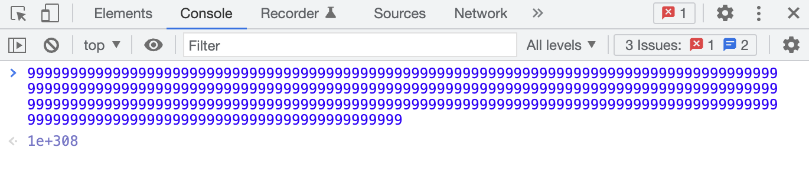
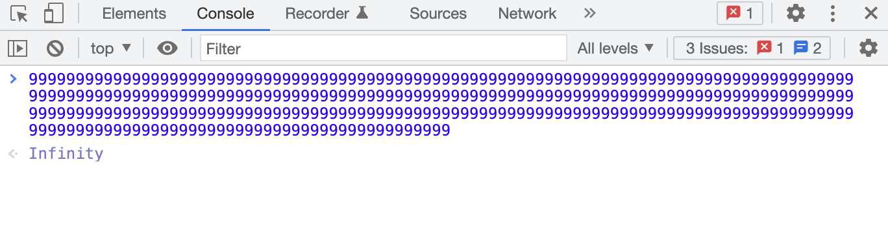
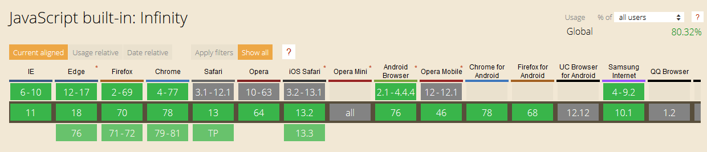

# Infinity

JavaScript中的 Infinity 是一个可以应用于任何变量的数值，表示无穷，下面就来看看Infinity 是如何工作的，以及有哪些注意事项。

## 1. Infinity 概念

Infinity 是全局对象的一个属性，即它是一个全局变量：

```javascript
console.log(window.Infinity); // Infinity
console.log(window.Infinity > 100); // true
console.log(window.Infinity < 100); // false
```

Infinity 的初始值是 `Number.POSITIVE_INFINITY`。Infinity（正无穷大）大于任何值。在数学上，这个值的行为与无穷大相同。例如，任何正数乘以Infinity等于Infinity，任何数字除以Infinity等于 0。在 ECMAScript 5 的规范中， Infinity 是只读的，即不可写、不可枚举或不可配置。

数字 Infinity 是 JavaScript 中的一个特殊值，它的值约为 1.79e+308 或 2¹⁰²⁴——JavaScript 中可以存储为数字类型的最大值。

```javascript
let bigNumber = 1e308,
    biggerNumber = 1e309;

console.log(bigNumber); // 1e+308
console.log(biggerNumber); // Infinity
```

根据规范，\*\*Infinity \*\*表示所有大于 **1.7976931348623157e+308 的**值：

```javascript
let largeNumber = 1.7976931348623157e+308,
    largerNumber = 1.7976931348623157e+309;

console.log(largeNumber); // 1.7976931348623157e+308
console.log(largerNumber); // Infinity
```

我们可以在浏览器的控制台输入9，当输入308位时，结果还是1e+308，当输入309位时，就会打印出 Infinity：





所有浏览器都是支持 Infinity 的：



## 2. Infinity 正负

Infinity 是有正负之分的，Infinity表示无穷大，-Infinity表示无穷小。超出 **1.797693134862315E+308** 的数值即为 Infinity，小于 **-1.797693134862316E+308** 的数值为无穷小。

```javascript
console.log(1.7976931348623157e+309); // Infinity
console.log(-1.7976931348623157e+309); // -Infinity
```

可以通过以下方式来得到 Infinity：

```javascript

console.log(Infinity)                 // Infinity
console.log(Number.POSITIVE_INFINITY) // Infinity
console.log(Math.pow(2,1024))         // Infinity
console.log(1.8e+308)                 // Infinity
console.log(1/0)                      // Infinity
```

可以通过以下方式来得到 -Infinity：

```javascript
console.log(-Infinity)                 // -Infinity
console.log(Number.NEGATIVE_INFINITY)  // -Infinity
console.log(-1*Math.pow(2,1024))       // -Infinity
console.log(-1.8e+308)                 // -Infinity
console.log(1/-0)                      // -Infinity
```

将正数除以 Infinity 会得到 0；Infinity 除以 Infinity 会得到 NaN；正数除以 -Infinity 或负数除以 Infinity 得到 -0：

```javascript
console.log(1/Infinity) // 0
console.log(Infinity/Infinity) // NaN
console.log(1/-Infinity) // -0
```

## 3. Infinity 计算

Infinity 的行为基本上类似于数学上的无穷大，加、减或乘以它仍然是 Infinity：

```javascript
console.log(Infinity + 3) // Infinity
console.log(Infinity - 3) // Infinity
console.log(Infinity * 3) // Infinity
console.log(Infinity / 3) // Infinity

console.log(Math.pow(Infinity, 2)) // Infinity

console.log(Infinity + Infinity) // Infinity
console.log(Infinity - Infinity) // NaN
console.log(Infinity * Infinity) // NaN
console.log(Infinity / Infinity) // NaN
```

对于 JavaScript 中所有的数字，即使是强大的 Infinity，使用 NaN 执行数学运算都得到 NaN：

```javascript
console.log(Infinity + NaN) // NaN
console.log(Infinity - NaN) // NaN
console.log(Infinity * NaN) // NaN
console.log(Infinity / NaN) // NaN

console.log(Math.pow(Infinity, NaN)) // NaN
```

## 4. Infinity 和 BigInt

在 JavaScript 中，对于任意大的整数值，有 BigInt 原始类型。但是，BigInt 不能很好地与 Infinity 配合使用，因为 Infinity 是 JavaScript 原始类型 number，不能与 BigInt 混合使用。

```javascript
try{console.log(37/0)} catch(e) {console.log(e)} // Infinity

// BigInts 用数字后面的 n 表示：
try{console.log(37n/0)} catch(e) {console.log(e)} // TypeError: "can't convert BigInt to number"
try{console.log(37/0n)} catch(e) {console.log(e)} // TypeError: "can't convert BigInt to number"
try{console.log(37n/0n)} catch(e) {console.log(e)} // RangeError: "BigInt division by zero"

// 可以将 BigInts 转换为 Numbers：
try{console.log(Infinity+37n)} catch(e) {console.log(e)} // TypeError: "can't convert BigInt to number"
try{console.log(Infinity+Number(37n))} catch(e) {console.log(e)} // Infinity

// 可能不需要BigInts，因为它可以是任意大小，并且 JavaScript 中的最大安全整数只有 16 位长：
console.log(Number.MAX_SAFE_INTEGER) // 9007199254740991
```

## 5. Infinity 检查

可以通过使用 == 或 === 将值与 Infinity 进行比较来检查 Infinity：

```javascript
console.log(Infinity == 1/0) // true
console.log(Infinity === 1/0) // true

// ==将强制字符串转换为数字，但===不会：
console.log(Infinity == "Infinity") // true
console.log(Infinity === "Infinity") // false

// 使用除法运算符将在比较之前强制执行强制转换：
console.log(Infinity == "1"/"0") // true
console.log(Infinity === "1"/"0") // true

// 当强制转换后值为NaN时：
console.log(Infinity == "1/0") // false
console.log(Infinity === "1/0") // false
```

当然，在处理 Infinity 时，ES6 中的 `Object.is()` 与 === 运算符的工作方式相同：

```javascript

console.log(Object.is(Infinity, 1/0)) // true
console.log(Infinity === 1/0) // true
console.log(Infinity == 1/0) // true

console.log(Object.is(Infinity, "Infinity")) // false
console.log(Infinity === "Infinity") // false
console.log(Infinity == "Infinity") // true
```

可以使用辅助函数 `Number.isFinite()` 检查值是否为有限数（不是 Infinity、-Infinity 或 NaN）。还有一个全局 isFinite() 函数，它会执行强制类型转化，也就是它会先尝试将值转换为数字类型，然后再检查它是否为有限数。

```javascript
console.log(isFinite(45)); // true
console.log(isFinite(-45)); // true
console.log(isFinite('45')); // true
console.log(isFinite('-75')); // true
console.log(isFinite(Infinity)); // false
console.log(isFinite(1.7976931348623157e+308)); // true
console.log(isFinite(1.7976931348623157e+309)); // false
```

## 6. 注意事项

### （1）max() 和 min()

如果没有传入值，<code>**Math.max()**</code>（返回传入值中的最大值）将返回 **-Infinity**，<code>**Math.min()**</code>（返回传入值中的最小值）将返回**Infinity**。

```javascript
console.log(Math.max()); // -Infinity
console.log(Math.min()); // Infinity
```

### （2）Infinity 作为默认值

由于\*\*Infinity \*\*大于所有数字，因此它在检查数组中的最小数字的函数中可能很有用：

```javascript
function findMinimum(numbers) {
  let min = Infinity;
  for (const n of numbers) {
    if (n < min) {
      min = n
    };
  }
  return min;
}

console.log(findMinimum([20, 6, 90])); // 6
```

因为 **Infinity** 大于所有数字，所以除非数组中的所有数字都超过 \*\*Infinity \*\*阈值，否则结果不会有任何问题。

### （3）转换为 JSON 时

在处理 JSON 数据时，如果使用 `JSON.stringify()` 将 JavaScript 对象转换为有效的 JSON 字符串，Infinity将会被转化为null：

```javascript
let myJSON = {
  value1: 6,
  value2: 'Example',
  value3: Infinity,
  value4: -Infinity,
  value5: 1.7976931348623157e+309
};

console.log(JSON.stringify(myJSON, null, 2));
```

打印结果如下：

```javascript

{
  "value1": 6,
  "value2": "Example",
  "value3": null,
  "value4": null,
  "value5": null
}
```

### （4）parseFloat() 和 parseInt()

`parseFloat()` 用来解析一个字符串，并返回一个浮点数。`parseInt()` 用来解析一个字符串，并返回一个整数。`parseFloat()` 可以正确解析Infinity， 而 `parseInt()` 无法识别 Infinity ：

```javascript
parseFloat('Infinity');   // => Infinity 
parseInt('Infinity', 10); // => NaN
```


> 更新: 2022-04-04 23:04:58  
> 原文: <https://www.yuque.com/cuggz/feplus/vmbgyw>