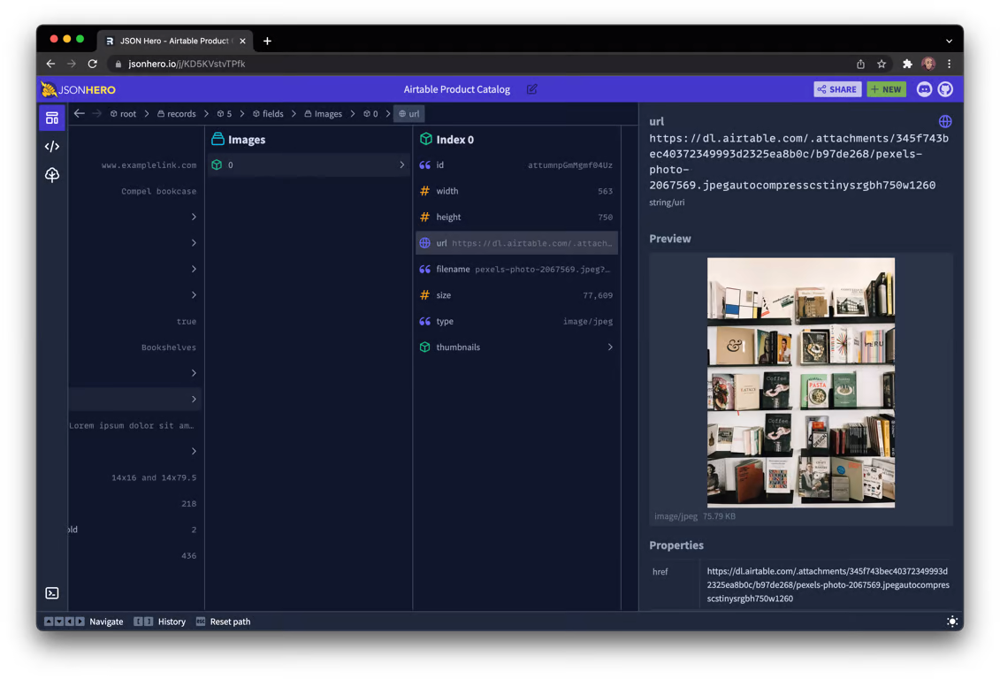
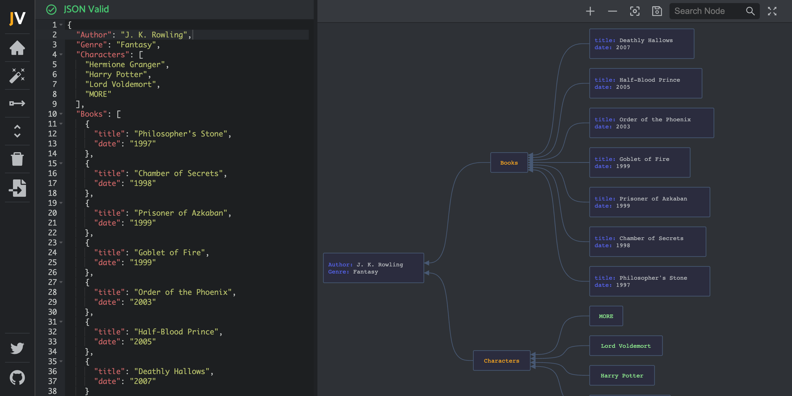
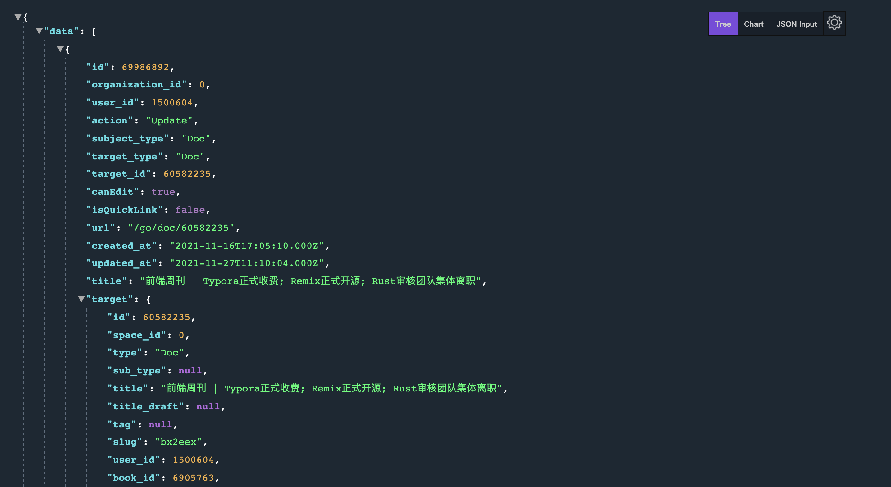

# JSON

## 一、JSON 概述

### 1. 概念

JSON 全称为 JavaScript Object Notation，是一种轻量级的数据交换格式。它是 JavaScript 中用于描述对象数据的语法的扩展。不过并不限于与 JavaScript 一起使用。它采用完全独立于语言的文本格式，这些特性使JSON成为理想的数据交换语言。易于阅读和编写，同时也易于机器解析和生成。所有现代编程语言都支持这些数据结构，使 JSON 完全独立于语言。

### 2. 历史

在 2000 年代初期，Douglas Crockford 创建了 JSON 以实现最小化、可移植和文本化。作为 JavaScript 的一个子集（因此得名），JSON 与 Web 浏览器脚本语言大约在同一时间流行起来。到 2010 年代初，JSON 成为新公共 API 的流行选择。

JSON 于 2013 年标准化为 ECMA-404，并于 2017 年发布为 RFC8259。RFC 和 ECMA 标准保持一致。JSON 的官方媒体类型是 `application/json`，JSON 文件名使用扩展名 `.json`。

JSON 源于对无状态、实时的服务器到浏览器通信协议的需求，它旨在成为 XML 的轻量级替代方案，以允许在移动处理场景和Web 上轻松解析 JavaScript。

JSON 通常与 REST 服务相关联，尤其是对于 Web 上的 API。尽管 API 的 REST 架构允许使用任何格式，但 JSON 提供了一种更灵活的消息格式，可以提高通信速度。在开发需要快速、紧凑和方便的数据序列化的 Web 或移动应用程序时，它非常有用。

### 3. 优点

JSON 流行度的上升正是因为网站和移动应用程序需要更轻松、更有效地将数据从一个系统传输到另一个系统。JSON 可以通过多种方式共享数据、存储设置以及与系统交互。它的简单性和灵活性使其适用于许多不同的情况。

JSON 最常见的用法是通过网络连接交换序列化数据。JSON 的其他一些常见用途包括公共、前端或内部 API、NoSQL 数据库、模式描述、配置文件、公共数据或数据导出。

JSON 的优点包括：

* **紧凑、高效的格式**：JSON 语法提供了简单的数据解析和更快的实现；
* \*\*易于阅读：\*\*人类和计算机都可以快速解释语法且错误最少；
* \*\*广泛支持：\*\*大多数语言、操作系统和浏览器都可以使用开箱即用的 JSON，这允许使用 JSON 而不存在兼容性问题；
* **自我描述**：很容易区分数据类型，并且更容易解释数据，而无需提前知道会发生什么；
* **格式灵活**：JSON支持多种数据类型，可以组合起来表达大多数数据的结构。

## 二、**JSON 结构和语法**

JSON 易于编写和阅读，并且易于在大多数语言使用的数据结构之间进行转换。下面看一下 JSON 对象的组成、JSON 支持的数据类型以及这种数据格式语法的其他细节。

### 1. 结构

下面是一个最基本的示例：

```json
{"name": "zhangsan"}
```

在上面的示例中，key是 `name`，值是 `zhangsan`。JSON 可以保存多个 `key:value`对：

```json
{"name": "zhangsan", "age": 18, "city": "beijing"}
```

当然这只是一个简单的例子，在实际应用中JSON会存在多层嵌套。对象和数组是可以保存其他值的值，因此 JSON 数据可能会发生无限嵌套。这允许 JSON 描述大多数数据类型。

下面是 JSON 数据类型的完整列表：

* string：用引号括起来的文字。
* number：正整数或负整数或浮点数。
* object：用花括号括起来的键值对
* array：一个或多个 JSON 对象的集合。
* boolean：不带引号的 true 或 false 值。
* null：表示键值对没有数据，表示为null，不带引号。

下面是一个包含所有这些数据类型的 JSON 对象示例：

```json
{
  "name": "zhangsan",
  "age": 28,
  "badperson":true,
  "child": {
    "name": "zhangxiaosan",
    "age": 8
  },
  "job": ["React", "JavaScript"],
  "wages": null,
}
```

### 2. 语法

下面来看看 JSON 的语法，如何避免常见的 JSON 错误：

* 始终将键值对保存在双引号内，大多数 JSON 解析器使用双引号解析 JSON 对象；
* 切勿在 key 中使用连字符。而是使用下划线 (\_)、全部小写或驼峰式大小写；
* 使用 JSON linter 来确认 JSON 是有效的，可以使用 [JSONLint](https://jsonlint.com/) 等工具。

## 三、JSON 解析与序列化

JSON 提供了两种方法：

* `JSON.parse()` ：将数据转换为 JavaScript 对象。
* `JSON.stringify()` ：将 JavaScript 对象转换为字符串。

### 1. JSON.parse()

`JSON.parse()` 的语法如下：

```json
JSON.parse(text, reviver)
```

* \*\*text：\*\*必需， 一个有效的 JSON 字符串。
* **reviver**：可选，一个转换结果的函数， 将为对象的每个成员调用此函数。

```json
const json = '{"name": "zhangsan", "age": 18, "city": "beijing"}';

const myJSON = JSON.parse(json);
 
console.log(myJSON.name, myJSON.age);  // zhangsan 18
```

我们可以启用 `JSON.parse` 的第二个参数 `reviver`，一个转换结果的函数，对象的每个成员调用此函数：

```json
const json = '{"name": "zhangsan", "age": 18, "city": "beijing"}';

const myJSON = JSON.parse(json, (key, value) => {
  if(typeof value === "number") {
     return String(value).padStart(3, "0");
  }
  return value;
});
 
console.log(myJSON.name, myJSON.age);  // zhangsan 018
```

### 2. JSON.stringify()

`JSON.stringify()` 的语法如下：

```json
JSON.stringify(value, replacer, space)
```

* \*\*value：\*\*必需， 要转换的 JavaScript 值（通常为对象或数组）。
* \*\*replacer：\*\*可选。用于转换结果的函数或数组。如果 replacer 为函数，则 JSON.stringify 将调用该函数，并传入每个成员的键和值。使用返回值而不是原始值。如果此函数返回 undefined，则排除成员。根对象的键是一个空字符串：""。如果 replacer 是一个数组，则仅转换该数组中具有键值的成员。成员的转换顺序与键在数组中的顺序一样。当 value 参数也为数组时，将忽略 replacer 数组。
* \*\*space：\*\*可选，文本添加缩进、空格和换行符，如果 space 是一个数字，则返回值文本在每个级别缩进指定数目的空格，如果 space 大于 10，则文本缩进 10 个空格。space 也可以使用非数字，如：`\t`。

```json
const json = {"name": "zhangsan", "age": 18, "city": "beijing"};

const myJSON = JSON.stringify(json);
 
console.log(myJSON);  // {"name":"zhangsan","age":18,"city":"beijing"}
```

### 3. 异常处理

那如果JSON无效怎么办呢？比如缺少了逗号，引号等，上面的两种方法都会抛出异常。建议在使用这两个方法时使用`try...catch`来包裹，也可以将其封装成一个函数。

```json
let myJSON = {}
const json = '{"name": "zhangsan", "age": 18, "city": "beijing"}';

try {
  myJSON = JSON.parse(json);
} catch (e){
  console.error(e.message)
}
console.log(myJSON.name, myJSON.age);  // zhangsan 18
```

如果 JSON 操作时出现问题，这将确保应用程序不会因此中断。

### 4. 其他操作

#### ① 删除键值对

可以使用 `delete` 运算符来删除键值对：

```json
const json = {"name": "zhangsan", "age": 18, "city": "beijing"};

delete json.city;
 
console.log(json);  // {name: 'zhangsan', age: 18}
```

#### ② 访问数组项

可以使用方括号`[]`和索引从 JSON 中访问数组项：

```json
const json = {
  "name": "zhangsan",
  "age": 18,
  "job": ["React", "JavaScript"],
};

console.log(json.job[0]); // React 
```

#### ③ 遍历数组项

可以使用`for`循环来遍历JSON中的数组项：

```json
const json = {
  "name": "zhangsan",
  "age": 18,
  "job": ["React", "JavaScript"],
};

for (item of json.job) {
    console.log(item);  // React JavaScript
}

```

## 四、实用技巧

下面来看看JSON有哪些实用技巧。

### 1. 格式化JSON

上面我们说了可以`JSON.stringify()`来将JSON对象转换为字符串。它支持第二个和第三个参数。我们可以借助第二三参数来格式化JSON字符串。支持情况下，格式化后的字符串长这样：

```json
const json = {"name": "zhangsan", "age": 18, "city": "beijing"};

const myJSON = JSON.stringify(json);
 
console.log(myJSON);  // {"name":"zhangsan","age":18,"city":"beijing"}
```

添加第二三个参数：

```json
const json = {"name": "zhangsan", "age": 18, "city": "beijing"};

const myJSON = JSON.stringify(json, null, 2);
 
console.log(myJSON);  
```

生成的字符串格式如下：

```json
{
  "name": "zhangsan",
  "age": 18,
  "city": "beijing"
}
```

这里的 2 其实就是为返回值文本在每个级别缩进 2 个空格。

如果缩进是一个字符串而不是空格，就可以传入需要缩进的填充字符串：

```json
const json = {"name": "zhangsan", "age": 18, "city": "beijing"};

const myJSON = JSON.stringify(json, null, "--");
 
console.log(myJSON);  
```

输出结果如下：

```json
{
--"name": "zhangsan",
--"age": 18,
--"city": "beijing"
}
```

### 2. 隐藏某些属性

我们知道`JSON.stringify()`支持第二个参数，用来处理JSON中的数据：

```json
const user = {
  "name": "John",
  "password": "12345",
  "age": 30
};

console.log(JSON.stringify(user, (key, value) => {
    if (key === "password") {
       return;
    }
    return value;
}));

// 输出结果：{"name":"John","age":30}
```

可以将第二个参数抽离出一个函数：

```json
function stripKeys(...keys) {
    return (key, value) => {
        if (keys.includes(key)) {
           return;
        }
        return value;
    };
}

const user = {
  "name": "John",
  "password": "12345",
  "age": 30,
  "gender": "male"
};

console.log(JSON.stringify(user, stripKeys('password', 'gender')))

// 输出结果：{"name":"John","age":30}
```

### 3. 过滤结果

当JSON中的内容很多是，想要查看指定字段是比较难的。我们可以借助`JSON.stringify()`的第二个属性来获取指定值，只需传入指定一个包含要查看的属性 `key` 的数组即可：

```json
const user = {
    "name": "John",
    "password": "12345",
    "age": 30
}

console.log(JSON.stringify(user, ['name', 'age']))

// 输出结果：{"name":"John","age":30}
```

## 五、JSON 工具

最后来推荐几个好用的 JSON 查看器。

### 1. JSON Hero

JSON Hero 是一个开源的、漂亮的 JSON 查看器，它提供了包含额外功能的干净美观的 UI，使阅读和理解 JSON 文件变得容易。

* 以任何方式查看 JSON：列视图、树视图、编辑器视图等；
* 自动推断字符串的内容并提供有用的预览；
* 创建可用于验证 JSON 的推断 JSON 模式；
* 快速扫描相关值以检查边缘情况；
* 搜索您的 JSON 文件（键和值）；
* 可使用键盘；
* 具有路径支持的可轻松共享的 URL。



**Github**：<https://github.com/jsonhero-io/jsonhero-web>

### 2. JSON Visio

JSON Visio 是一个 JSON 数据的可视化工具，它可以无缝地在图表上展示数据，而无需重组任何内容、直接粘贴或导入文件。



**Github**：<https://github.com/AykutSarac/jsonvisio.com>

### 3. JSON Viewer Pro

JSON Viewer Pro也是一个Chrome扩展程序，主要用于可视化JSON文件。其核心功能包括：

* 支持将JSON数据进行格式化，并使用属性或者图表进行展示；
* 使用面包屑深入遍历 JSON 属性；
* 在输入区写入自定义 JSON；
* 导入本地 JSON 文件；
* 使用上下文菜单下载 JSON 文件；
* 网址过滤器；
* 改变主题；
* 自定义 CSS ；
* 复制属性和值；

输入界面如下：


格式化之后：



### 4. 其他工具

* [JSONLint](https://jsonlint.com/)<font style="color:rgb(22, 36, 65);">：JSON 数据的验证器；</font>
* [JSONedit](https://mb21.github.io/JSONedit/)<font style="color:rgb(22, 36, 65);">：一个可视化 JSON 构建器，可以轻松构建具有不同数据类型的复杂 JSON 结构；</font>
* [JSON API](https://jsonapi.org/)<font style="color:rgb(22, 36, 65);">：用于在 JSON 中构建 API 的规范；</font>
* [JSON Formatter](https://jsonformatter.org/)<font style="color:rgb(22, 36, 65);">：用于验证、美化、缩小和转换 JSON 数据的在线工具；</font>
* [JSON Generator](https://extendsclass.com/json-generator.html)<font style="color:rgb(22, 36, 65);">：生成随机 JSON 数据的在线工具。</font>


> 更新: 2022-05-24 22:34:04  
> 原文: <https://www.yuque.com/cuggz/feplus/bv296p>