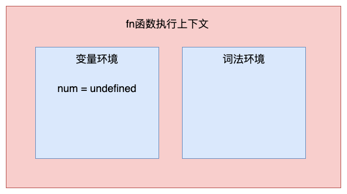
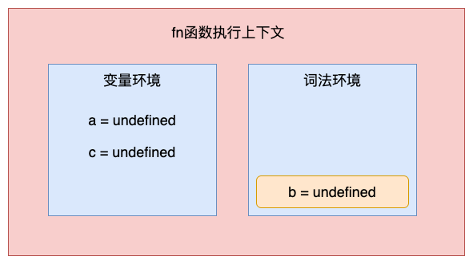
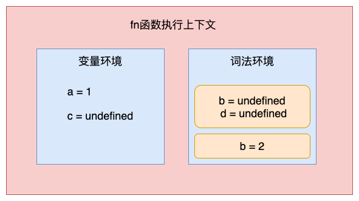
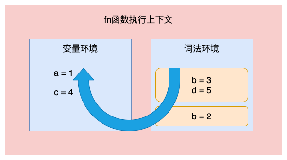
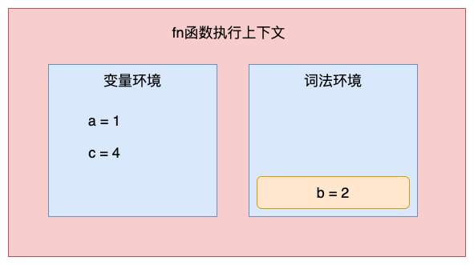

# 变量提升

在 ECMAScript6 中，新增了 let 和 const 关键字用来声明变量。在前端面试中也常被问到 let、const和 var 的区别，这就涉及到了变量提升、暂时性死区等知识点。下面就来看看什么是变量提升和暂时性死区。

### 1. 什么变量提升？

先来看看MDN中对变量提升的描述：

> 变量提升（Hoisting）被认为是， Javascript中执行上下文 （特别是创建和执行阶段）工作方式的一种认识。在 ECMAScript® 2015 Language Specification 之前的JavaScript文档中找不到变量提升（Hoisting）这个词。
>
> 从概念的字面意义上说，“变量提升”意味着变量和函数的声明会在物理层面移动到代码的最前面，但<font style="color:rgb(27, 27, 27);">这么说并不准确。实际上变量和函数声明在代码里的位置是不会动的，而是在编译阶段被放入内存中。</font>

***

\*\*通俗来说，变量提升是指在 JavaScript 代码执行过程中，JavaScript 引擎把变量的声明部分和函数的声明部分提升到代码开头的行为。变量被提升后，会给变量设置默认值为 undefined。\*\*正是由于 JavaScript 存在变量提升这种特性，导致了很多与直觉不太相符的代码，这也是 JavaScript 的一个设计缺陷。虽然 ECMAScript6 已经通过引入块级作用域并配合使用 let、const 关键字，避开了这种设计缺陷，但是由于 JavaScript 需要向下兼容，所以变量提升在很长时间内还会继续存在。

在 ECMAScript6 之前，JS 引擎用 var 关键字声明变量。在 var 时代，\*\*不管变量声明是写在哪里，最后都会被提到作用域的顶端。\*\*下面在全局作用域中声明一个num 变量，并在声明之前打印它：

```javascript
console.log(num) 
var num = 1
```

这里会输出 undefined，因为变量的声明被提升了，它等价于：

```javascript
var num
console.log(num)
num = 1
```

可以看到，num 作为全局变量会被提升到全局作用域的顶端。

除此之外，在函数作用域中也存在变量提升：

```javascript
function getNum() {
  console.log(num) 
  var num = 1  
}
getNum()
```

这里也会输出 undefined，因为函数内部的变量声明会被提升至函数作用域的顶端。它等价于：

```javascript
function getNum() {
  var num 
  console.log(num) 
  num = 1  
}
getNum()
```

除了变量提升，函数实际上也是存在提升的。JavaScript中具名的函数的声明形式有两种：

```javascript
//函数声明式：
function foo () {}
//变量形式声明： 
var fn = function () {}
```

当使用**变量形式声明**函数时，和普通的变量一样会存在提升的现象，而<font style="color:rgb(64, 64, 64);">函数声明式会提升到作用域最前边，并且将声明内容一起提升到最上边。</font>如下：

```javascript
fn()
var fn = function () {
	console.log(1)  
}
// 输出结果：Uncaught TypeError: fn is not a function

foo()
function foo () {
	console.log(2)
}
// 输出结果：2
```

可以看到，使用变量形式声明fn并在其前面执行时，会报错fn不是一个函数，因为此时fn只是一个变量，还没有赋值为一个函数，所以是不能执行fn方法的。

### 2. 为什么会有变量提升？

变量提升和 JavaScript 的编译过程密切相关：JavaScript 和其他语言一样，都要经历编译和执行阶段。在这个短暂的**编译阶段**，JS 引擎会搜集所有的变量声明，并且提前让声明生效。而剩下的语句需要等到执行阶段、等到执行到具体的某一句时才会生效。这就是变量提升背后的机制。

那为什么 JavaScript 中会存在变量提升这个特性呢？

首先要从作用域说起。**作用域是指在程序中定义变量的区域，该位置决定了变量的生命周期。通俗理解，作用域就是变量与函数的可访问范围，即作用域控制着变量和函数的可见性和生命周期。**

在 ES6 之前，作用域分为两种：

* **全局作用域**中的对象在代码中的任何地方都可以访问，其生命周期伴随着页面的生命周期。
* **函数作用域**是在函数内部定义的变量或者函数，并且定义的变量或者函数只能在函数内部被访问。函数执行结束之后，函数内部定义的变量会被销毁。

相较而言，其他语言则普遍支持**块级作用域**。块级作用域就是使用一对大括号包裹的一段代码，比如函数、判断语句、循环语句，甚至一个单独的{}都可以被看作是一个块级作用域（注意，对象声明中的{}不是块级作用域）。简单来说，如果一种语言支持块级作用域，那么其代码块内部定义的变量在代码块外部是访问不到的，并且等该代码块中的代码执行完成之后，代码块中定义的变量会被销毁。

***

**ES6 之前是不支持块级作用域的**，没有块级作用域，将作用域内部的变量统一提升无疑是最快速、最简单的设计，不过这也直接导致了函数中的变量无论是在哪里声明的，在编译阶段都会被提取到执行上下文的变量环境中，所以这些变量在整个函数体内部的任何地方都是能被访问的，这也就是 JavaScript 中的变量提升。

**使用变量提升有如下两个好处：**

#### （1）提高性能

在JS代码执行之前，会进行语法检查和预编译，并且这一操作只进行一次。这么做就是为了提高性能，如果没有这一步，那么每次执行代码前都必须重新解析一遍该变量（函数），这是没有必要的，因为变量（函数）的代码并不会改变，解析一遍就够了。

在解析的过程中，还会为函数生成预编译代码。在预编译时，会统计声明了哪些变量、创建了哪些函数，并对函数的代码进行压缩，去除注释、不必要的空白等。这样做的好处就是每次执行函数时都可以直接为该函数分配栈空间（不需要再解析一遍去获取代码中声明了哪些变量，创建了哪些函数），并且因为代码压缩的原因，代码执行也更快了。

#### （2）容错性更好

变量提升可以在一定程度上提高JS的容错性，看下面的代码：

```javascript
a = 1;
var a;
console.log(a); // 1
```

如果没有变量提升，这两行代码就会报错，但是因为有了变量提升，这段代码就可以正常执行。

虽然在可以开发过程中，可以完全避免这样写，但是有时代码很复杂，可能因为疏忽而先使用后定义了，而由于变量提升的存在，代码会正常运行。当然，在开发过程中，还是尽量要避免变量先使用后声明的写法。

**总结：**

* 解析和预编译过程中的声明提升可以提高性能，让函数可以在执行时预先为变量分配栈空间；
* 声明提升还可以提高JS代码的容错性，使一些不规范的代码也可以正常执行。

### 3. 变量提升导致的问题

由于变量提升的存在，使用 JavaScript 来编写和其他语言相同逻辑的代码，都有可能会导致不一样的执行结果。主要有以下两种情况。

#### （1）变量被覆盖

来看下面的代码：

```javascript
var name = "JavaScript"
function showName(){
  console.log(name);
  if(0){
   var name = "CSS"
  }
}
showName()
```

这里会输出 undefined，而并没有输出“JavaScript”，为什么呢？

首先，当刚执行 showName 函数调用时，会创建 showName 函数的执行上下文。之后，JavaScript 引擎便开始执行 showName 函数内部的代码。首先执行的是：

```plain
console.log(name);
```

执行这段代码需要使用变量 name，代码中有两个 name 变量：一个在全局执行上下文中，其值是JavaScript；另外一个在 showName 函数的执行上下文中，由于if(0)永远不成立，所以 name 值是 CSS。那该使用哪个呢？**应该先使用函数执行上下文中的变量**。因为在函数执行过程中，JavaScript 会优先从当前的执行上下文中查找变量，由于变量提升的存在，当前的执行上下文中就包含了if(0)中的变量 name，其值是 undefined，所以获取到的 name 的值就是 undefined。

这里输出的结果和其他支持块级作用域的语言不太一样，比如 C 语言输出的就是全局变量，所以这里会很容易造成误解。

#### （2）变量没有被销毁

```javascript
function foo(){
  for (var i = 0; i < 5; i++) {
  }
  console.log(i); 
}
foo()
```

使用其他的大部分语言实现类似代码时，在 for 循环结束之后，i 就已经被销毁了，但是在 JavaScript 代码中，i 的值并未被销毁，所以最后打印出来的是 5。这也是由变量提升而导致的，在创建执行上下文阶段，变量 i 就已经被提升了，所以当 for 循环结束之后，变量 i 并没有被销毁。

### 4. 禁用变量提升

为了解决上述问题，**ES6 引入了 let 和 const 关键字**，从而使 JavaScript 也能像其他语言一样拥有块级作用域。let 和 const 是不存在变量提升的。下面用 let 来声明变量：

```javascript
console.log(num) 
let num = 1

// 输出结果：Uncaught ReferenceError: num is not defined
```

如果改成 const 声明，也会是一样的结果——用 let 和 const 声明的变量，它们的声明生效时机和具体代码的执行时机保持一致。

变量提升机制会导致很多误操作：那些忘记被声明的变量无法在开发阶段被明显地察觉出来，而是以 undefined 的形式藏在代码中。为了减少运行时错误，防止 undefined 带来不可预知的问题，ES6 特意将声明前不可用做了强约束。不过，let 和 const 还是有区别的，使用 let 关键字声明的变量是可以被改变的，而使用 const 声明的变量其值是不可以被改变的。

下面来看看 ES6 是如何通过块级作用域来解决上面的问题：

```javascript
function fn() {
  var num = 1;
  if (true) {
    var num = 2;  
    console.log(num);  // 2
  }
  console.log(num);  // 2
}
fn()
```

在这段代码中，有两个地方都定义了变量 num，函数块的顶部和 if 的内部，由于 var 的作用范围是整个函数，所以在编译阶段，会生成如下执行上下文：



从执行上下文的变量环境中可以看出，最终只生成了一个变量 num，函数体内所有对 num 的赋值操作都会直接改变变量环境中的 num 的值。所以上述代码最后输出的是 2，而对于相同逻辑的代码，其他语言最后一步输出的值应该是 1，因为在 if 里面的声明不应该影响到块外面的变量。

下面来把 var 关键字替换为 let 关键字，看看效果：

```javascript
function fn() {
  let num = 1;
  if (true) {
    let num = 2;  
    console.log(num);  // 2
  }
  console.log(num);  // 1
}
fn()
```

执行这段代码，其输出结果就和预期是一致的。这是因为 let 关键字是支持块级作用域的，所以，在编译阶段 JavaScript 引擎并不会把 if 中通过 let 声明的变量存放到变量环境中，这也就意味着在 if 中通过 let 声明的关键字，并不会提升到全函数可见。所以在 if 之内打印出来的值是 2，跳出语块之后，打印出来的值就是 1 了。这就符合我们的习惯了\*\*：作用块内声明的变量不影响块外面的变量\*\*。

### 5. JS如何支持块级作用域

那么问题来了，ES6 是如何做到既要支持变量提升的特性，又要支持块级作用域的呢？下面**从执行上下文的角度**来看看原因。

JavaScript 引擎是通过变量环境实现函数级作用域的，那么 ES6 又是如何在函数级作用域的基础之上，实现对块级作用域的支持呢？先看下面这段代码：

```javascript
function fn(){
    var a = 1
    let b = 2
    {
      let b = 3
      var c = 4
      let d = 5
      console.log(a)
      console.log(b)
      console.log(d)
    }
    console.log(b) 
    console.log(c)
}   
fn()
```

当这段代码执行时，JavaScript 引擎会先对其进行编译并创建执行上下文，然后再按照顺序执行代码。let 关键字会创建块级作用域，那么 let 关键字是如何影响执行上下文的呢？

#### （1）创建执行上下文

创建的执行上下文如图所示：



通过上图可知：

* 通过 var 声明的变量，在编译阶段会被存放到**变量环境**中。
* 通过 let 声明的变量，在编译阶段会被存放到**词法环境**中。
* 在函数作用域内部，通过 let 声明的变量并没有被存放到词法环境中。

#### （2）执行代码

当执行到代码块中时，变量环境中 a 的值已经被设置成了 1，词法环境中 b 的值已经被设置成了 2，这时函数的执行上下文如图所示：



可以看到，当进入函数的作用域块时，作用域块中通过 let 声明的变量，会被存放在词法环境的一个单独的区域中，这个区域中的变量并不影响作用域块外面的变量，比如在作用域外面声明了变量 b，在该作用域块内部也声明了变量 b，当执行到作用域内部时，它们都是独立的存在。

其实，在词法环境内部，维护了一个栈结构，栈底是函数最外层的变量，进入一个作用域块后，就会把该作用域块内部的变量压到栈顶；当作用域执行完成之后，该作用域的信息就会从栈顶弹出，这就是词法环境的结构。这里的变量是指通过 let 或者 const 声明的变量。

接下来，当执行到作用域块中的`console.log(a)`时，就需要在词法环境和变量环境中查找变量 a 的值了，查找方式：沿着词法环境的栈顶向下查询，如果在词法环境中的某个块中查找到了，就直接返回给 JavaScript 引擎，如果没有查找到，那么继续在变量环境中查找。这样变量查找就完成了：



当作用域块执行结束之后，其内部定义的变量就会从词法环境的栈顶弹出，最终执行上下文如图所示：



块级作用域就是通过词法环境的栈结构来实现的，而变量提升是通过变量环境来实现，通过这两者的结合，JavaScript 引擎就同时支持了变量提升和块级作用域。

### 6. 暂时性死区

最后再来看看暂时性死区的概念：

```javascript
var name = 'JavaScript';
{
	name = 'CSS';
	let name;
}

// 输出结果：Uncaught ReferenceError: Cannot access 'name' before initialization
```

ES6 规定：如果区块中存在 let 和 const，这个区块对这两个关键字声明的变量，从一开始就形成了封闭作用域。假如尝试在声明前去使用这类变量，就会报错。这一段会报错的区域就是暂时性死区。上面代码的第4行上方的区域就是暂时性死区。

如果想成功引用全局的 name 变量，需要把 let 声明给去掉：

```javascript
var name = 'JavaScript';
{
	name = 'CSS';
}
```

这时程序就能正常运行了。其实，这并不意味着引擎感知不到 name 变量的存在，恰恰相反，它感知到了，而且它清楚地知道 name 是用 let 声明在当前块里的。正因如此，它才会给这个变量加上暂时性死区的限制。一旦去掉 let 关键字，它也就不起作用了。

其实这也就是暂时性死区的本质：当程序的控制流程在新的作用域进行实例化时，在此作用域中用 let 或者 const 声明的变量会先在作用域中被创建出来，但此时还未进行词法绑定，所以是不能被访问的，如果访问就会抛出错误。因此，在这运行流程进入作用域创建变量，到变量可以被访问之间的这段时间，就称之为暂时死区。

在 let 和 const关键字出现之前，typeof运算符是百分之百安全的，现在也会引发暂时性死区的发生，像import关键字引入公共模块、使用new class创建类的方式，也会引发暂时性死区，究其原因还是变量的声明先与使用。

```javascript
typeof a    // Uncaught ReferenceError: a is not defined
let a = 1
```

可以看到，在a声明之前使用typeof关键字报错了，这就是暂时性死区导致的。


> 更新: 2021-09-13 00:21:52  
> 原文: <https://www.yuque.com/cuggz/feplus/uqbbyt>