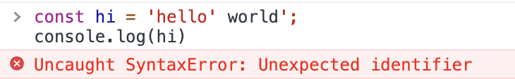
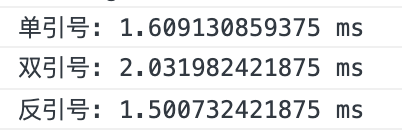

# 引号区别

<font style="color:rgb(32, 33, 49);">在 JavaScript 中，单</font>引号<font style="color:rgb(32, 33, 49);">(' ')和双</font>引号<font style="color:rgb(32, 33, 49);">(“ ”) 经常用于创建</font>字符串<font style="color:rgb(32, 33, 49);">。通常情况下，使用双引号或单引号没有区别，它们最后都代表一个字符串。当我们需要使用反斜杠字符(\)来转义字符时，他们之间的唯一区别就体现出来了。</font>

<font style="color:rgb(32, 33, 49);"></font>

<font style="color:rgb(41, 41, 41);">如果使用单引号来创建字符串，那么就不能在该字符串中使用单引号，只能使用反斜杠 (</font><font style="color:rgb(41, 41, 41);background-color:rgb(242, 242, 242);">\</font><font style="color:rgb(41, 41, 41);">)对其进行转义。比如：</font>

```javascript
const hi = 'hello' world';
console.log(hi)
```



只能使用反斜杠来转义：

```javascript
const hi = 'hello\' world';
console.log(hi)  // 输出结果：hello' world
```

如果想在双引号中使用双引号，也需要使用反斜杠来转义：

```javascript
const hi = "hello\" world";
console.log(hi)  // 输出结果：hello" world
```

而如果想在双引号中使用单引号，可以直接使用：

```javascript
const hi = "hello' world";
console.log(hi)  // 输出结果：hello' world
```

<font style="color:rgb(32, 33, 49);">另外，JSON 文件中是不支持单引号，如果想要在 JSON 和 JavaScript 文件之间复制和粘贴时，就需要额外注意了。</font>


<font style="color:rgb(41, 41, 41);">虽然单引号和双引号是使用较多的，但我们还有第三个方案，就是ES6中的模板字符串（反引号）。</font>

（1）<font style="color:rgb(41, 41, 41);">字符串连接</font>

```javascript
const name = 'javascript';
console.log(`hello ${name}`);  // 输出结果：hello javascript
```

（2）无需转义<font style="color:rgb(41, 41, 41);">单引号或双引号</font>

```javascript
console.log(`hello "JS"`);   // 输出结果：hello "JS"
console.log(`hello 'CSS'`);  // 输出结果：hello 'CSS'
```

<font style="color:rgb(41, 41, 41);">（3）不使用换行符写多行内容</font>

```javascript
console.log(`hello

JS`);
// 输出结果：
hello 

JS
```

那当我们使用<font style="color:rgb(41, 41, 41);">单引号、双引号或反引号时，性能会有什么不同吗？下面来通过三个方法简单来看一下三种形式的性能差别：</font>

```javascript
function testingDoubleQuotes(){
  console.time('单引号');
  for (let i = 0; i < 100000; i++) {
   const string1 = "String One";
  }
  console.timeEnd('单引号');
}

function testingSingleQuotes(){
  console.time('双引号');
  for (let i = 0; i < 100000; i++) {
   const string2 = 'String Two';
  }
  console.timeEnd('双引号');
}

function testingbackticks(){
  console.time('反引号');
  for (let i = 0; i < 100000; i++) {
   const string1 = `String Three`;
  }
  console.timeEnd('反引号');
}

testingDoubleQuotes();
testingSingleQuotes();
testingbackticks();
```

结果如下：



根据以上结果，可以看到，<font style="color:rgb(41, 41, 41);">反引号是最快的，双引号是最慢的。当然</font>这个结果并不是每次都一样，仅供参考。不过，这样细微的差异对项目是不会产生任何影响的。


综上，<font style="color:rgb(41, 41, 41);">使用单引号、双引号或反引号之间没有太大的区别。可以根据自己的喜好选择一种或多种样式。不过，最好在项目中使用单一的格式以保持整洁和一致。</font>


除此之外，我们<font style="color:rgb(41, 41, 41);">可以使用代码格式化程序或者根据样式指南来做处理。它们都有默认的类型：</font>

+ Prettier <font style="color:rgb(41, 41, 41);">默认使用双引号；</font>
+ Eslint <font style="color:rgb(41, 41, 41);">默认使用双引号；</font>
+ <font style="color:rgb(41, 41, 41);">Airbnb 风格指南更推荐使用单引号。</font>

<font style="color:rgb(32, 33, 49);"></font>

<font style="color:rgb(32, 33, 49);">在</font><font style="color:rgb(42, 62, 74);">比较流行的 JavaScript 开源项目的源代码中，单引号比双引号更受青睐：</font>

| **<font style="color:rgb(42, 62, 74);">开源项目</font>** | **<font style="color:rgb(42, 62, 74);">使用单引号的比例</font>** |
| :---: | :---: |
| <font style="color:rgb(42, 62, 74);">lodash</font> | <font style="color:rgb(42, 62, 74);">99%</font> |
| <font style="color:rgb(42, 62, 74);">react</font> | <font style="color:rgb(42, 62, 74);">90%</font> |
| <font style="color:rgb(42, 62, 74);">request</font> | <font style="color:rgb(42, 62, 74);">97%</font> |
| <font style="color:rgb(42, 62, 74);">moment</font> | <font style="color:rgb(42, 62, 74);">90%</font> |
| <font style="color:rgb(42, 62, 74);">express</font> | <font style="color:rgb(42, 62, 74);">92% </font> |
| <font style="color:rgb(42, 62, 74);">debug</font> | <font style="color:rgb(42, 62, 74);">97%</font> |
| <font style="color:rgb(42, 62, 74);">axios</font> | <font style="color:rgb(42, 62, 74);">81%</font> |


  


> 更新: 2022-01-27 16:49:01  
> 原文: <https://www.yuque.com/cuggz/feplus/taiyyi>