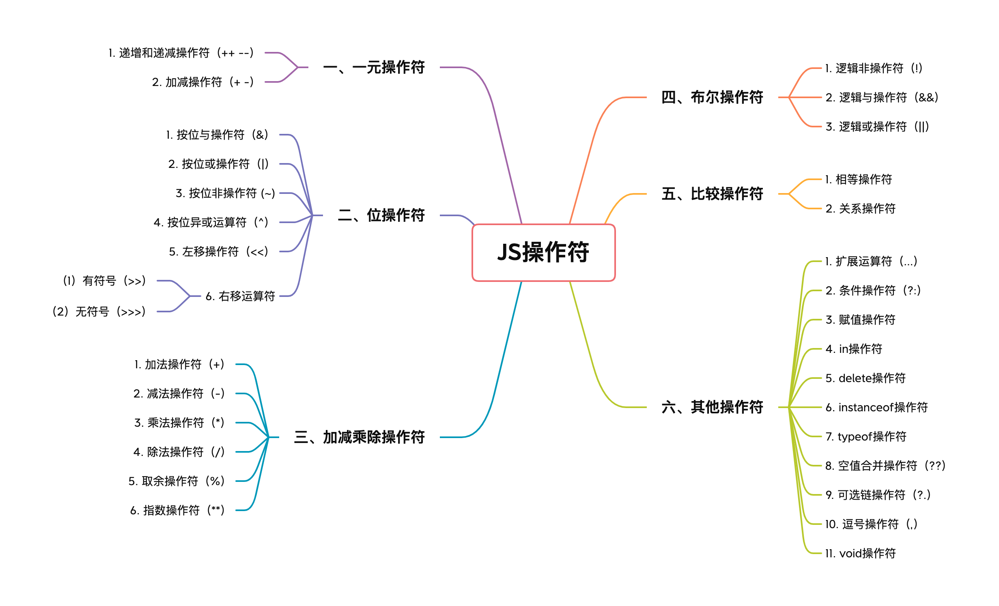
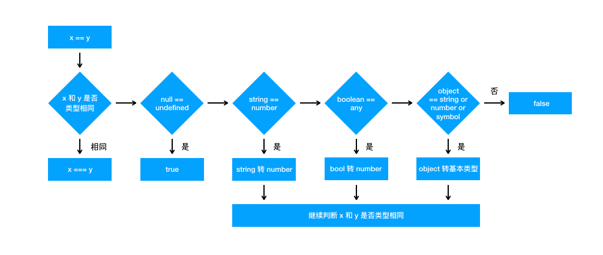

# 操作符



## 一、一元操作符

操作符可以根据他们期待的操作符个数来分类，多数的JavaScript操作符都是二元操作符，二元操作符可以将两个表达式合成一个更复杂的表达式。JavaScript也支持一元操作符，这些操作符可以将一个表达式转化为另一个更复杂的表达式。同时，JavaScript中也有一个三元操作符，就是条件操作符（?:），它用于将三个表达式组成一个表达式。下面就先来看看一元操作符。

一元操作符具有以下特点：

* 最简单的操作符，用来操作一个表达式；
* 具有高优先级和右结合性；
* 在必要时将操作数自动转化为数值。

### 1. 递增和递减操作符（++ --）

递增和递减操作符在大学的计算机语言课（我学的第一门是C++🤣）大家应该就已经学过了。JavaScript的递增和递减操作符和其他语言基本一致。递增操作符顾名思义就是递增其操作数，递减操作符就是递减其操作数。它们都有两个版本：

* 前缀版（++i）：操作符位于变量的前面，表示先递增(递减)，后执行语句；
* 后缀版（i++）：操作符位于变量的后面，表示先执行语句，后递增(递减)；

简单看两个例子：

```javascript
// 前置递增操作符：
let num1 = 1, num2 = 2;
console.log(++num1 + num2) // 4

// 后置递增操作符：
let num1 = 1, num2 = 2;
console.log(num1++ + num2) // 3
```

可以看到，两种类型的结果是不一样的，原因就在于后置递增递减操作是在包含它们的语句被求值之后才执行的。

这四个操作符可以作用于任何类型的数据。对于这些类型，JavaScript会将他们转化为数值，再在这个数值上进行加一或减一操作。如果不能转化为一个数字，那么递增或递减的结果就是NaN：

```javascript
let str = "hello";
console.log(str++)  // NaN
```

递增和递减操作符主要用于for循环中控制计算器递增或递减。

### 2. 加和减操作符

加和减操作符既是一元操作符，也是二元操作符。这里我们先来看一元加和减操作符。

#### （1）一元加运算符（+）

一元加操作符会将其操作数转化为数值，并返回转化后的值。需要注意：

* 如果操作数是数值，那它什么都不做；
* 如果操作数不能转化为数值，那么会返回NaN；
* 由于BigInt值不能转化为数值，因此这个操作符不能用于BigInt。

```javascript
let a = -1;
let b = "hello";
let c = BigInt;
console.log(+a)  // -1
console.log(+b)  // NaN
console.log(+c)  // NaN
```

#### （2）一元减运算符（-）

一元减操作符和一元加操作符类似，会先将操作数转化为数值，然后会改变结果的符号：

```javascript
let a = -1;
let b = 2;
console.log(-a)  // 1
console.log(-b)  // 2
```

一元加和减操作符主要用于基本的算术运算，也可以用于数据类型的转换，将不同类型的数据转化为数字类型，像Number()方法一样。

## 二、位操作符

现代计算机中数据都是以二进制的形式存储的，即0、1两种状态，计算机对二进制数据进行的运算加减乘除等都是叫位运算，即将符号位共同参与运算的运算。

JavaScript中所有的数字都是以IEEE 754 64位格式存储，但是位操作并不直接应用到64位，而是先将值转化为32位整数，再进行位操作。之后再把运算结果转化为64位，所以我们只需要考虑32位整数即可。位操作是在数值的底层完成的，所以运算速度会相对于其他运算符快很多。

常见的位运算有以下几种：

| **运算符** | **描述** | **运算规则** |
| :---: | :---: | :---: |
| `&` | 与 | 两个位都为1时，结果才为1 |
| `|` | 或 | 两个位都为0时，结果才为0 |
| `^` | 异或 | 两个位相同为0，相异为1 |
| `~` | 取反 | 0变1，1变0 |
| `<<` | 左移 | 各二进制位全部左移若干位，高位丢弃，低位补0 |
| `>>` | 右移 | 各二进制位全部右移若干位，正数左补0，负数左补1，右边丢弃 |

在说这些操作符之前，先来看几个相关的概念。计算机中的**有符号数**有三种表示方法，即原码、反码和补码。三种表示方法均有符号位和数值位两部分，符号位都是用0表示“正”，用1表示“负”，而数值位，三种表示方法各不相同。

**（1）原码**

原码就是一个数的二进制数。例如：10的原码为0000 1010

**（2）反码**

* 正数的反码与原码相同，如：10    反码为 0000 1010
* 负数的反码为除符号位，按位取反，即0变1，1变0。

例如，-10的反码如下：

```javascript
原码：1000 1010
反码：1111 0101
```

**（3）补码**

* 正数的补码与原码相同，如：10    补码为 0000 1010
* 负数的补码是原码除符号位外的所有位取反即0变1，1变0，然后加1，也就是反码加1。

例如，-10的补码如下：

```javascript
原码：1000 1010
反码：1111 0101
补码：1111 0110
```

### 1. 按位与操作符（&）

按位与操作符（&）会对参加运算的两个数据**按二进制位**进行与运算，即两位同时为 1 时，结果才为1，否则结果为0。运算规则如下：

```javascript
0 & 0 = 0  
0 & 1 = 0  
1 & 0 = 0  
1 & 1 = 1
```

例如，3 & 5 的运算结果如下：

```javascript
   0000 0011 
   0000 0101 
 = 0000 0001
```

因此 3 & 5 的值为 1。需要注意：负数按补码形式参加按位与运算。

**用途：**

**（1）判断奇偶**

只要根据最未位是0还是1来决定，为0就是偶数，为1就是奇数。因此可以用`if ((i & 1) === 0)`代替`if (i % 2 === 0)`来判断a是不是偶数。

**（2）清零**

如果想将一个单元清零，即使其全部二进制位为0，只要与一个各位都为零的数值相与，结果为零。

### 2. <font style="color:rgb(79, 79, 79);">按位或操作符（|）</font>

<font style="color:rgb(79, 79, 79);">按位或操作符（|）会对</font>参加运算的两个对象按二进制位进行或运算，即参加运算的两个对象只要有一个为1，其值为1。运算规则如下：

```javascript
0 | 0 = 0
0 | 1 = 1  
1 | 0 = 1  
1 | 1 = 1
```

例如，3 | 5 的运算结果如下：

```javascript
  0000 0011
  0000 0101 
= 0000 0111
```

因此，3 | 5的值为7。需要注意：负数按补码形式参加按位或运算。

### 3. 按位<font style="color:rgb(79, 79, 79);">非操作符 (~)</font>

按位非操作符 (~)会对参加运算的一个数据按二进制进行取反运算。即将0变成1，1变成0。运算规则如下：

```javascript
~ 1 = 0
~ 0 = 1
```

例如：~6 的运算结果如下：

```javascript
  0000 0110
= 1111 1001
```

在计算机中，正数用原码表示，负数使用补码存储，首先看最高位，最高位1表示负数，0表示正数。此计算机二进制码为负数，最高位为符号位。

当按位取反为负数时，就**直接取其补码**，变为十进制：

```javascript
     0000 0110
   = 1111 1001
反码：1000 0110
补码：1000 0111
```

因此，~6的值为-7。按位非的操作结果实际上是对数值进行取反并减1，

### 4. 按位<font style="color:rgb(79, 79, 79);">异或运算符（^）</font>

按位异或运算符（^）会对参加运算的两个数据按二进制位进行“异或”运算，即如果两个相应位相同则为0，相异则为1。运算规则如下：

```javascript
0 ^ 0 = 0  
0 ^ 1 = 1  
1 ^ 0 = 1  
1 ^ 1 = 0
```

例如， 3 ^ 5的运算结果如下：

```javascript
  0000 0011
  0000 0101 
= 0000 0110
```

因此，3^5的值为6。

异或运算具有以下性质:

* 交换律：`(a^b)^c == a^(b^c)`
* 结合律：`(a + b)^c == a^b + b^c`
* 对于任何数x，都有 `x^x=0，x^0=x`
* 自反性: `a^b^b=a^0=a`;

### 5. <font style="color:rgb(79, 79, 79);">左移操作符（<<）</font>

<font style="color:rgb(79, 79, 79);">左移操作符（<<）会</font>将运算对象的各二进制位全部左移若干位，左边的二进制位丢弃，右边补0。若左移时舍弃的高位不包含1，则每左移一位，相当于该数乘以2。

例如：

```javascript
a = 1010 1110
a = a << 2
```

这里将a的二进制位左移2位、右补0，即得 a = 1011 1000。

需要注意，左移会保留他所操作数值的符号。比如，将-2左移5位，会得到-64，而不是64。

### 6. <font style="color:rgb(79, 79, 79);">右移运算符</font>

#### （1）有符号右移操作符<font style="color:rgb(79, 79, 79);">（>>）</font>

有符号右移操作符（>>）会<font style="color:rgb(77, 77, 77);">将数值的32位全部右移若干位（同时会保留正负号）。正数左补0，负数左补1，右边丢弃。操作数每右移一位，相当于该数除以2。</font>

<font style="color:rgb(77, 77, 77);"></font>

<font style="color:rgb(77, 77, 77);">例如：a = a >>2 就是将a的二进制位右移2位，左补0 或者 左补1得看被移数是正还是负。</font>

#### （2）无符号右移操作符<font style="color:rgb(79, 79, 79);">（>>>）</font>

无符号右移操作符（>>>）会<font style="color:rgb(77, 77, 77);">将数值的32位全部右移。对于正数，有符号右移操作符和无符号右移操作符的结果是一样的。对于负数的操作，两者就会有较大的差异。</font>

无符号右移操作符将负数的二进制表示当成正数的二进制表示来处理。所以，对负数进行无符号右移操作之后就会变的特别大。

## 三、加减乘除操作符

### 1. 加法操作符（+）

这里说的加法操作符就是二元的加操作符了。二元加操作符用于**计算数值操作**或者**拼接字符串操作**。

```javascript
1 + 1             // 2
"1" + "2"         // "12"
"hello" + "world" // "helloworld"
```

在进行加操作时，如果两个操作数都是数值或者都是字符串，那么执行结果就分别是计算出来的数值和拼接好的字符串。除此之外，执行结果都取决于类型转化的结果：它会优先进行字符串拼接，只有操作数是字符串或者是可以转化为字符串的对象，另一个操作数也会被转化为字符串，并执行拼接操作。只有任何操作数都不是字符串时才会执行加法操作。

```javascript
1 + 2             // 3
"1" + "2"         // "12"
"1" + 2           // "12"
1 + {}            // "1[object Object]"
true + false      // 1  布尔值会先转为数字，再进行运算
1 + null          // 1	null会转化为0，再进行计算
1 + undefined     // NaN undefined转化为数字是NaN
```

需要注意加操作的顺序：

```javascript
let a = 1;
let b = 2;
let c = "hello" + a + b;  // "hello12"
```

这里，由于每次加法操作都是独立完成的，第一次是字符串hello和数字a做加法操作，得到的结果是"hello1"，第二次加法操作仍然是一个字符串加一个数字，所以最终结果是一个字符串。如果想让a和b两个数字相加，就需要加上括号。

除此之外，还需要注意以下特殊情况：

* 如果有一个操作数是NaN，则结果是NaN；
* 如果是Infinity加Infinity，则结果是Infinity；
* 如果是-Infinity加-Infinity，则结果是-Infinity；
* 如果是Infinity加-Infinity，则结果是NaN；
* 如果是+0加+0，则结果是+0；
* 如果是-0加-0，则结果是-0；
* 如果是+0加-0，则结果是+0。

### 2. 减法操作符（-）

减法操作和加法操作符类似， 但是减法操作符只能用于数值的计算，不能用于字符串的拼接。当进行减法操作时，如果两个操作数都是数值，就会直接进行减法操作，如果有一个操作数是非数值，就会将其转化为数值，再进行减法操作。如果转化结果为NaN，则运算结果也是NaN。

```javascript
3 - 1      // 2
3 - true   // 2
3 - ""     // 3
3 - null   // 3
NaN - 1    // NaN
```

需要注意以下特殊情况：

1. 如果是Infinity减Infinity，则结果是NaN；
2. 如果是-Infinity减-Infinity，则结果是NaN；
3. 如果是Infinity减-Infinity，则结果是Infinity；
4. 如果是-Infinity减Infinity，则结果是-Infinity；
5. 如果是+0减+0，则结果是+0；
6. 如果是-0减+0，则结果是-0；
7. 如果是-0减-0，则结果是+0。

### 3. 乘法操作符（\*）

乘法操作符用于计算两个数的乘积。如果两个操作数都是数值，则会执行常规的乘法运算。如果不是数值，会将其转化为数值，在进行乘法操作。

需要注意以下特殊情况：

* 如果有一个操作数是NaN，则结果是NaN；
* 如果Infinity与0相乘，则结果是NaN；
* 如果Infinity与非0数值相乘，则结果是Infinity或-Infinity，取决于有符号操作数的符号；
* 如果Infinity与Infinity相乘，则结果是Infinity。

### 4. 除法操作符（/）

除法操作符用于计算一个操作数除以第二个操作数的商。如果两个操作数都是数值，则会执行常规的除法运算。如果不是数值，会将其转化为数值，在进行除法操作。

需要注意以下特殊情况：

* 如果有一个操作数是NaN，则结果是NaN；
* 如果0除以0，则结果是NaN；
* 如果Infinity除以Infinity，则结果是Infinity。
* 如果是非零的有限数被零除，则结果是Infinity或-Infinity，取决于有符号操作数的符号；
* 如果是Infinity被任何非零数值除，则结果是Infinity或-Infinity，取决于有符号操作数的符号。

### 5. 取余操作符（%）

取余操作符用于计算一个数除以第二个数的余数。计算规则和上述运算符类似。

需要注意以下特殊情况：

* 如果被除数是无穷大值而除数是有限大的数值，则结果是NaN；
* 如果被除数是有限大的数值而除数是零，则结果是NaN；
* 如果是Infinity被Infinity除，则结果是NaN；
* 如果被除数是有限大的数值而除数是无穷大的数值，则结果是被除数；
* 如果被除数是零，则结果是零。

### 6. 指数操作符（\*\*）

在ECMAScript 7中新增了指数操作符（\*\*），它的计算效果是Math.pow()是一样的：

```javascript
Math.pow(2, 10);    // 1024
2 ** 10;            // 1024
```

指数运算符和上面的加减乘除运算符都有对应的赋值操作运算符：

```javascript
let a = 2;
a **= 10;
console.log(a);   // 1024
```

```javascript
let a = 1;
let b = 2;
let c = 3;
let d = 4;
a += 1;     // 2
b -= 2;     // 0
c *= 3;     // 9
d /= 4;			// 1
```

## 四、布尔操作符

在开发时，布尔操作符是很有用的，可以精简很多代码，干掉很多多余的id-else语句，下面来看看常见的三种布尔操作符。

### 1. 逻辑非操作符（!）

逻辑非操作符可以用于JavaScript中的任何值，这个操作符使用返回布尔值。逻辑非操作符首先会将操作数转化为布尔值，然后在对其取反。

逻辑非操作规则如下：

* 如果操作数是对象，则返回 false；
* 如果操作数是空字符串，则返回 true；
* 如果操作数是非空字符串，则返回 false；
* 如果操作数是数值0，则返回 true；
* 如果操作数是非0数值（包括 Infinity)，则返回 false；
* 如果操作数是 null，则返回 true；
* 如果操作数是 NaN，则返回 true；
* 如果操作数是 undefined， 则返回 true.

逻辑非操作符也可以用于将任何值转化为布尔值，同时使用两个!，相当于调用了Boolean()方法：

```javascript
!!"blue" // true
!!0;     // false
!!NaN    // false
!!""     // false
!!12345  // true
```

### 2. 逻辑与操作符（&&）

逻辑与操作符的两个操作数都为真时，最终结果才会返回真。该运算符可以用于任何类型的数据。如果有操作数不是布尔值，则结果并一定会返回布尔值，会遵循以下规则：

* 如果第一个操作数是对象，则返回第二个操作数；
* 如果第二个操作数是对象，则只有在第一个操作数的求值结果为true的情况下才会返回该对象；
* 如果两个操作数都是对象，则返回第二个操作数；
* 如果第一个操作数是null，则返回null；
* 如果第一个操作数是NaN，则返回NaN；
* 如果第一个操作数是undefined，则返回undefined；

根据第二条规则，我们可以对我们项目代码中的代码进行优化：

```javascript
if(data) {
  setData(data);
}

// 改写后：
data && setData(data);
```

这里当data为真时，也就是存在时，才会执行setData方法，代码就精简了很多。

逻辑与操作符是一种短路操作符，只要第一个操作数为false，就不会继续执行运算符后面的表达式，直接返回false。上面的data如果是不存在的，就会直接发生短路，不会继续执行后面的方法。

### 3. 逻辑或操作符（||）

逻辑或操作符和逻辑与操作符类似，不过只要两个操作数中的一个为真，最终的结果就为真。该运算符可以用于任何类型的数据。如果有操作数不是布尔值，则结果并一定会返回布尔值，会遵循以下规则：

* 如果第一个操作数是对象，则返回第一个操作对象；
* 如果第一个操作数的求值结果是false，则返回第二个操作数；
* 如果两个操作数都是对象，则返回第一个操作数；
* 如果两个操作数都是null，则返回null；
* 如果两个数都是NaN，则返回NaN；
* 如果两个数都是undefined，则返回undefined。

逻辑或操作符也是具有短路特性，如果第一个操作数为真，那么第二个操作数就不需要在进行判断了，会直接返回true。

可以利用这个特性给变量设置默认值：

```javascript
let datas = data || {};
```

这里，如果data不存在，就会将datas赋值为第二个操作数（默认值）。

## 五、比较操作符

### 1. 相等操作符

相等操作符包括四种：

* 等于（==）
* 不等于（!=）
* 全等（===）
* 不全等（!==）

JavaScript中的等于用两个等号（==）表示，如果两个操作数相等，那么就返回true。不等于和等于相反。在进行比较时，两个操作数都会进行强制类型转换，在确实是否相等。其判断规则如下：

1. 首先会判断两者类型是否\*\*相同，\*\*相同的话就比较两者的大小；
2. 类型不相同的话，就会进行类型转换；
3. 会先判断是否在对比 `null` 和 `undefined`，是的话就会返回 `true`
4. 判断两者类型是否为 `string` 和 `number`，是的话就会将字符串转换为 `number`

```javascript
1 == '1'
      ↓
1 ==  1
```

5. 判断其中一方是否为 `boolean`，是的话就会把 `boolean` 转为 `number` 再进行判断

```javascript
'1' == true
        ↓
'1' ==  1
        ↓
 1  ==  1
```

6. 判断其中一方是否为 `object` 且另一方为 `string`、`number` 或者 `symbol`，是的话就会把 `object` 转为原始类型再进行判断

```javascript
'1' == { name: 'js' }        
 ↓
'1' == '[object Object]'
```

其流程图如下：\


需要注意，如果其中一个操作数是NaN，相等运算符会返回false，不相等运算符会返回true。

对于不等于运算符（!=），只有在强制类型转化后不相等才会返回true。

对于全等运算符（===），只有当两个操作数的数据类型和值都相等时，才会返回true。它并不会进行数据类型的转化。

对于不全等运算符（!==），只有两个操作数在不进行类型转化的情况下是不相等的，才会返回true。

在平时的开发中，建议使用全等和不全等在做比较，这样会更加严谨，避免出现意料之外的结果。

### 2. 关系操作符

关系操作符包括四种：

* 小于（<）
* 大于（>）
* 小于等于（<=）
* 大于等于（>=）

这几个操作符都会返回一个布尔值，他们操作时会遵循以下规则：

* 如果这两个操作数都是数值，则执行数值比较；
* 如果两个操作数都是字符串，则比较两个字符串对应的字符编码值；
* 如果一个操作数是数值，则将另一个操作数转换为一个数值，然后执行数值比较；
* 如果一个操作数是对象，则调用这个对象的valueOf()方法，并用得到的结果根据前面的规则执行比较；
* 如果一个操作数是布尔值，则先将其转换为数值，然后再执行比较。

## 六、其他操作符

最后这一部分的一些操作符在平时的开发中就很实用了，下面来看看它们的用法吧。

### 1. 扩展操作符（...）

<font style="color:rgb(34, 34, 34);">扩展操作符(Spread operator)可以用来扩展一个数组对象和字符串。它用三个点（…）表示，可以将可迭代对象转为用逗号分隔的参数序列。</font>

**<font style="color:rgb(34, 34, 34);"></font>**

**<font style="color:rgb(34, 34, 34);">（1）用于展开数组</font>**<font style="color:rgb(34, 34, 34);">：</font>

```javascript
const a = [1, 2, 3],
      b = [4, 5, 6];
const c = [...a]       // [1, 2, 3]
const d = [...a, ...b] // [1, 2, 3, 4, 5, 6]
const e = [...a, 4, 5] // [1, 2, 3, 4, 5]
```

**<font style="color:rgb(34, 34, 34);">（2）将类数组对象变成数组：</font>**<font style="color:rgb(34, 34, 34);">\ </font>

```javascript
const list = document.getElementsByTagName('a');
const arr = [..list];
```

**<font style="color:rgb(34, 34, 34);">（3）用于展开对象：</font>**

```javascript
const obj1 = { a: 1, b: 2 };
const obj2 = { c: 3, d: 4 };
const merged = { ...obj1, ...obj2 };  // { a: 1, b: 2, c: 3, d: 4 }
```

需要注意，如果<font style="color:rgb(34, 34, 34);">合并时的多个对象有相同属性，则后面的对象的会覆盖前面对象的属性。</font>

**<font style="color:rgb(34, 34, 34);">（4）用于展开字符串</font>**

```javascript
const str = "hello";
[...str]  // ["h", "e", "l", "l", "o"]
```

**（5）用于函数传参**

```javascript
const f = (foo, bar) => {}
const a = [1, 2]
f(...a)

const numbers = [1, 2, 3, 4, 5]
const sum = (a, b, c, d, e) => a + b + c + d + e
const sum = sum(...numbers)
```

**（6）用于具有 Iterator 接口的对象**

具有 Iterator 接口的对象Map 和 Set 结构，Generator 函数，可以使用展开操作符:

```javascript
const s = new Set();
s.add(1);
s.add(2);
const arr = [...s]// [1,2]


function * gen() {
  yield 1;
  yield 2;
  yield 3;
}

const arr = [...gen()] // 1，2，3
```

如果是map，会把每个key 和 value 转成一个数组：

```javascript
const m = new Map();
m.set(1,1)
m.set(2,2)
const arr = [...m]  // [[1,1],[2,2]]
```

注意 ，对象不是一个Iterator对象。

### 2. 条件操作符（?:）

这里的条件运算符实际上就是我们常说的三元表达式。看一个例子：

```javascript
let res = num1 > num2 ? num1 : num2;
```

这里，将num1和num2中的最大值赋值给了res。

使用条件表达式可以代替很多if-else，使得代码很简洁。在React的项目中，我个人就经常使用条件操作符来做组件的条件渲染。当然如果判断的层数过多，感觉代码就有些难读懂了。（React-Router源码中就有嵌套了六七层条件操作符的地方，很难理解...）

### 3. 赋值操作符

其实赋值操作符有很多种，包括简单的赋值操作符（=），以及一些复合赋值操作符：

* 乘赋值操作符：\*=
* 除赋值操作符：/=
* 模赋值操作符：%=
* 加赋值操作符：+=
* 减赋值操作符：-=
* 左移操作符: <<=
* 有符号右移赋值操作符：>>=
* 无符号右移赋值操作符：>>>=

这些仅仅是他们对应的简写形式，并不会产生其他影响。

### 4. in操作符（in）

in操作符<font style="color:rgb(0, 0, 0);">可以用来判断一个属性是否属于一个对象，它的返回值是一个布尔值：</font>

```javascript
const author = {
  name: "CUGGZ",
  age: 18
}

"height" in author;  // false
"age" in author;     // true
```

还可以用来判断一个属性是否属于对象原型链的一部分：

```javascript
let arr = ["hello", "jue", "jin"];
"length" in arr;   // true
```

### 5. delete操作符（delete）

delete 操作符用于删除对象的某个属性或者数组元素。对于引用类型的值，它也是删除对象属性的本身，不会删除属性指向的对象。

```javascript
const o = {};
const a = { x: 10 };
o.a = a;
delete o.a; // o.a属性被删除
console.log(o.a); // undefined
console.log(a.x); // 10, 因为{ x: 10 } 对象依然被 a 引用，所以不会被回收
```

需要注意：

* 原型中声明的属性和对象自带的属性无法被删除；
* 通过var声明的变量和通过function声明的函数拥有dontdelete特性，是不能被删除。

### 6. instanceof操作符（instanceof）

<font style="color:rgb(51, 51, 51);">instanceof运算符用来判断一个构造函数的prototype属性所指向的对象是否存在另外一个要检测对象的原型链上。</font>

```javascript
console.log(2 instanceof Number);                    // false
console.log(true instanceof Boolean);                // false 
console.log('str' instanceof String);                // false 
 
console.log([] instanceof Array);                    // true
console.log(function(){} instanceof Function);       // true
console.log({} instanceof Object);                   // true
```

可以看到，instanceof只能正确判断引用数据类型，而不能判断基本数据类型。instanceof运算符可以用来测试一个对象在其原型链中是否存在一个构造函数的 prototype 属性。

可以简单来实现一下 instanceof 操作符：

```javascript
function myInstanceof(left, right) {
  // 获取对象的原型
  let proto = Object.getPrototypeOf(left)
  // 获取构造函数的 prototype 对象
  let prototype = right.prototype; 
 
  // 判断构造函数的 prototype 对象是否在对象的原型链上
  while (true) {
    if (!proto) return false;
    if (proto === prototype) return true;
    // 如果没有找到，就继续从其原型上找，Object.getPrototypeOf方法用来获取指定对象的原型
    proto = Object.getPrototypeOf(proto);
  }
}
```

### 7. typeof操作符（typeof）

typeof是一元运算符，它的返回值是一个字符串，它是操作数的类型，JavaScript常见数据对应的类型如下：

| **x** | **typeof** |
| :---: | :---: |
| undefined | undefined |
| null | object |
| true或false | boolean |
| 数值或NaN | number |
| BigInt | bigInt |
| 字符串 | string |
| symbol | symbol |
| 函数 | function |
| 非函数对象 | object |

```javascript
typeof 2               // number
typeof true            // boolean
typeof 'str'           // string
typeof []              // object    
typeof function(){}    // function
typeof {}              // object
typeof undefined       // undefined
typeof null            // object
```

那这里为什么 typeof null 的结果是Object呢？

在 JavaScript 第一个版本中，所有值都存储在 32 位的单元中，每个单元包含一个小的 **类型标签(1-3 bits)** 以及当前要存储值的真实数据。类型标签存储在每个单元的低位中，共有五种数据类型：

```javascript
000: object   - 当前存储的数据指向一个对象。
  1: int      - 当前存储的数据是一个 31 位的有符号整数。
010: double   - 当前存储的数据指向一个双精度的浮点数。
100: string   - 当前存储的数据指向一个字符串。
110: boolean  - 当前存储的数据是布尔值。
```

如果最低位是 1，则类型标签标志位的长度只有一位；如果最低位是 0，则类型标签标志位的长度占三位，为存储其他四种数据类型提供了额外两个 bit 的长度。

有两种特殊数据类型：

* undefined的值是 (-2)30(一个超出整数范围的数字)；
* null 的值是机器码 NULL 指针(null 指针的值全是 0)

那也就是说null的类型标签也是000，和Object的类型标签一样，所以会被判定为Object。

### 8. <font style="color:rgb(0, 0, 0);">空值合并操作符（??）</font>

在编写代码时，如果某个属性不为 null 和 undefined，那么就获取该属性，如果该属性为 null 或 undefined，则取一个默认值：

```javascript
const name = dogName ? dogName : 'default'; 
```

可以通过 || 来简化：

```javascript
const name =  dogName || 'default'; 
```

但是 || 的写法存在一定的缺陷，当 dogName 为 0 或 false 的时候也会走到 default 的逻辑。所以 ES2020 引入了 ?? 运算符。只有 ?? 左边为 null 或 undefined时才返回右边的值：

```javascript
const dogName = false; 
const name =  dogName ?? 'default';  // name = false;
```

### <font style="color:rgb(0, 0, 0);">9. 可选链操作符（?.）</font>

<font style="color:rgb(0, 0, 0);"></font>在开发过程中，我们可能需要获取深层次属性，例如 system.user.addr.province.name。但在获取 name 这个属性前需要一步步的判断前面的属性是否存在，否则并会报错：

```javascript
const name = (system && system.user && system.user.addr && system.user.addr.province && system.user.addr.province.name) || 'default';
```

为了简化上述过程，ES2020 引入了「链判断运算符」?.，可选链操作符( ?. )允许读取位于连接对象链深处的属性的值，而不必明确验证链中的每个引用是否有效。?. 操作符的功能类似于 . 链式操作符，不同之处在于，在引用为null 或 undefined 的情况下不会引起错误，该表达式短路返回值是 undefined。与函数调用一起使用时，如果给定的函数不存在，则返回 undefined。

```javascript
const name = system?.user?.addr?.province?.name || 'default';
```

当尝试访问可能不存在的对象属性时，可选链操作符将会使表达式更短、更简明。在探索一个对象的内容时，如果不能确定哪些属性必定存在，可选链操作符也是很有帮助的。

可选链有以下三种形式：

```javascript
a?.[x]
// 等同于
a == null ? undefined : a[x]

a?.b()
// 等同于
a == null ? undefined : a.b()

a?.()
// 等同于
a == null ? undefined : a()
```

### 10. 逗号操作符（,）

逗号操作符也没啥好说的，当同时声明多个变量时会用到：

```javascript
let a = 1, b = 2, c = 3;
```

还有一种使用场景就是有多个循环变量的 for 循环中：

```javascript
for(let i = 0, j = 10; i < j; i++, j--){
	 console.log(i + j);
}
```

### 11. void操作符（void）

void 是一元运算符，它可以出现在任意类型的操作数之前执行操作数，会忽略操作数的返回值，返回一个 undefined。void 常用于 HTML 脚本中执行 JavaScript 表达式，但不需要返回表达式的计算结果。比如对于链接标签，我们并不想让它发生跳转，就可以设置`href="javascript:void(0)`。

在下面代码中，使用 void 运算符让表达式返回 undefined：

```javascript
let a = b = c = 2;  // 定义并初始化变量的值
d = void (a -= (b *= (c += 5)));  // 执行void运算符，并把返回值赋予变量d
console.log(a);  // -12
console.log(b);  // 14
console.log(c);  // 7
console.log(d);  // undefined
```

<font style="color:rgb(68, 68, 68);">由于 void 运算符的优先级比较高，高于普通运算符的优先级，所以在使用时应该使用小括号明确 void 运算符操作的操作数，避免引发错误。</font>

####


> 更新: 2022-09-07 11:22:18  
> 原文: <https://www.yuque.com/cuggz/feplus/kvp5qg>