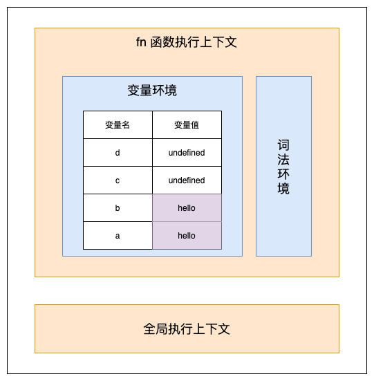
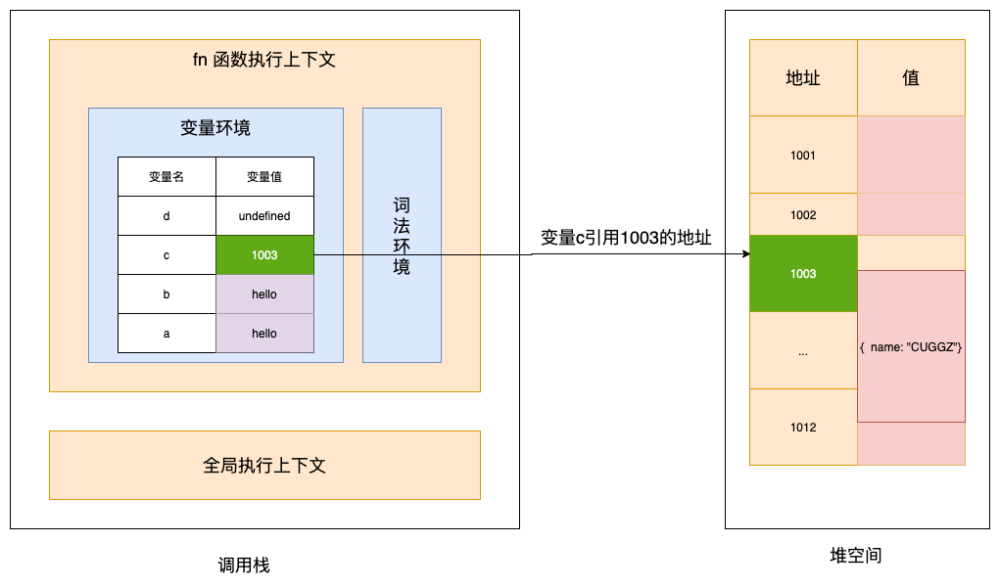
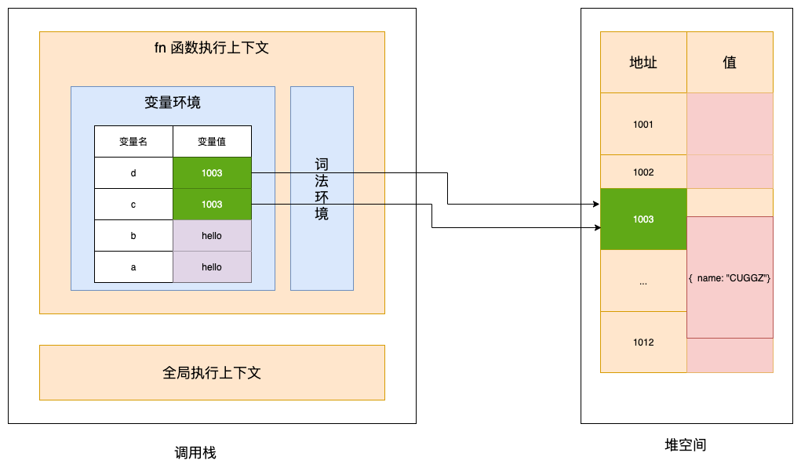

# 数据类型

数据类型是计算机语言的基础知识，数据类型广泛用于变量、函数参数、表达式、函数返回值等场合。JavaScript 规定了七种数据类型：未定义（Undefined）、空（Null）、数字（Number）、字符串（String）、布尔值（Boolean）、符号（Symbol）、任意大整数（BigInt）、对象（Object）。

## 一、数据存储

下面我们就先来看看 JavaScript 中的数据是如何存储的。

### 1. 语言类型

说到JavaScript的数据存储机制，首先我们需要知道，JavaScript 究竟是什么类型的语言？

一般情况下可以根据声明变量的特点，将语言分为静态语言和动态语言：

* \*\*静态语言：\*\*在使用之前就需要确认其变量数据类型的称为静态语言；
* \*\*动态语言：\*\*相反的，在运行过程中需要检查数据类型的语言称为动态语言。

很显然，JavaScript 就是一门动态语言，因为在声明变量之前并不需要确认其数据类型。

对于一个变量，我们既可以给他设置为一个数字，也可以给他设置为一个字符串，还可以让字符串类型的变量和数值类型的变量相加。在这个过程中，可以发生隐式的类型转化。弱类型语言可以发生隐式类型转换，而强类型语言不能发生隐式类型转换。而JavaScript就是弱类型语言。

现在我们知道了，JavaScript是一种弱类型、动态的语言。这就意味着，无需告诉JavaScript引擎变量是什么类型，JavaScript 引擎在运行代码时会自己计算出来。同时，我们可以使用同一个变量保存不同类型的数据。

### 2. 堆栈空间

对于 JavaScript 中的 8 种数据类型，其中前7种都是基础类型，最后1种是引用类型。

这些数据主要存储在**栈空间和堆空间**中，下面来看看栈空间和堆空间的概念。

下面来看一段代码：

```javascript
function fn() {
	var a = "hello";
  var b = a;
  var c = { name: "CUGGZ"};
	var d = c;
}
fn()
```

当这段代码执行时，需要先进行编译，并创建执行上下文，最后在按照顺序执行代码。当执行到第三行时，调用栈执行状态如下：



此时变量 a 和 b 的值都被保存在执行上下文中， 而执行上下文又被压入到了栈中，所以变量 a 和 b 的值都是存放在栈中 的。

接下来继续执行后面的代码。当执行到第四行代码时，JavaScript 引擎判断变量 c 的值是一个引用类型，这时JavaScript 引擎会将该对象分配到堆空间里，分配后该对象会有一个在堆中的地址，然后再将该数据的地址写进 c 的变量值，最终分配好内存的执行上下文如下：



可以看到，对象类型存储在堆空间中，在栈空间中只保留了对象的引用地址，当 JavaScript 访问该数据时，会通过栈中的引用地址来访问。

所以，基本数据类型的值直接保存在栈中，引用类型的值会存放在堆中。

那为什么要区分堆空间和栈空间呢？将数据都存在栈空间中不行吗？

答案肯定是不可以的。JavaScript 引擎需要使用栈来维护程序执行期间上下文的状态，如果将所有数据都放在栈空间中，就会影响到上下文切换的效率，进而影响到整个程序的执行效率。

所以，通常情况下，栈空间不会设置的很大，主要用来存放一些基本类型的小数据。由于引用类型的数据占用空间都比较大，所以这类数据会被存放到堆中，堆空间比较大，能存放很多较大的数据。

最后，我们再看看上面实例代码中第五行，也就是将变量 c 赋值给变量 d 是怎么执行的。在 JavaScript 中，原始类型的赋值会完整复制变量值，而引用类型的赋值是复制引用地址。 所以d = c 的操作就是把 c 的引用地址赋值给 d，如下图所示：



可以看到，变量 c 和 d 都指向了同一个堆中的对象，当我们修改c的值时，d也会发生变化。

## 二、数据类型

说完JavaScript数据的存储方式，下面再来看看JavaScript中8种数据类型的一些细节，一些概念这里就不再提了。

### 1. Undefined

Undefined 类型表示**未定义**，它的类型只有一个值，就是 undefined。任何变量在赋值前是 Undefined 类型、值为 undefined，可以用全局变量 undefined 来表达这个值。可以通过以下方式来得到 undefined：

（1）<font style="color:rgb(77, 77, 77);">声明了一个变量，但没有赋值</font>

```javascript
var foo; //undefined
```

<font style="color:rgb(77, 77, 77);">（2）</font>引用未定义的对象属性

```javascript
var obj = {}
obj.b // undefined
```

（3）<font style="color:rgb(77, 77, 77);">函数定义了形参，但没有传递实参</font>

```javascript
function fn(a) {
    console.log(a); //undefined
}
fn();
```

（4）执行 void 表达式；

```javascript
void 0 // undefined
```

推荐通过 void 表达式来得到 undefined 值，因为这种方式既简便又不需要引用额外的变量和属性；同时它作为表达式还可以配合三目运算符使用，代表不执行任何操作。

如下面的代码就表示满足条件 x 大于 0 且小于 5 的时候执行函数 fn，否则不进行任何操作：

```javascript
x > 0 && x < 5 ? fn() : void 0;
```

那如何判断一个变量的值是否为 undefined 呢？可以<font style="color:#404952;">通过 typeof 关键字获取变量 x 的类型，然后与 'undefined' 字符串做</font>真值比较\*\*：\*\*

```javascript
if(typeof x === 'undefined') {
  ...
}
```

### 2. Null

Null 数据类型和 Undefined 类似，只有一个值 null，<font style="color:rgb(77, 77, 77);">表示变量被置为空对象，而非一个变量最原始的状态</font>。null 是 JavaScript 保留关键字，而 undefined 只是一个常量。也就是说可以声明名称为 undefined 的变量，但将 null 作为变量使用时则会报错。

对于null，还有一个比较关键的问题，来看代码：

```javascript
typeof null == 'object' // true
```

<font style="color:rgb(51, 51, 51);">实际上，null 有自己的类型 Null，而不属于Object类型，typeof 之所以会判定为 Object 类型，如下：</font>

在 JavaScript 第一个版本中，所有值都存储在 32 位的单元中，每个单元包含一个小的 **类型标签(1-3 bits)** 以及当前要存储值的真实数据。类型标签存储在每个单元的低位中，共有五种数据类型：

```javascript
000: object   - 当前存储的数据指向一个对象。
  1: int      - 当前存储的数据是一个 31 位的有符号整数。
010: double   - 当前存储的数据指向一个双精度的浮点数。
100: string   - 当前存储的数据指向一个字符串。
110: boolean  - 当前存储的数据是布尔值。
```

如果最低位是 1，则类型标签标志位的长度只有一位；如果最低位是 0，则类型标签标志位的长度占三位，为存储其他四种数据类型提供了额外两个 bit 的长度。

有两种特殊数据类型：

* undefined的值是 (-2)<sup>30</sup>(一个超出整数范围的数字)；
* null 的值是机器码 NULL 指针(null 指针的值全是 0)。

那也就是说null的类型标签也是000，和Object的类型标签一样，所以会被判定为Object。

<font style="color:rgb(77, 77, 77);">可以通过另一种方法获取 null 的真实类型：</font>

```javascript
Object.prototype.toString.call(null) ; // [object Null]
```

<font style="color:rgb(51, 51, 51);">当然 undefined 类型也可以通过这种方式来获取：</font>

```javascript
Object.prototype.toString.call(undefined) ; // [object Undefined]
```

当通过 “==” 来比较null 和 undefined 是否相等时，得到的结果是 true：

```javascript
undefined == null; //true
```

在 <font style="color:rgb(77, 77, 77);">Javascript 规范中</font><font style="color:rgb(77, 77, 77);">提到，</font>**<font style="color:rgb(77, 77, 77);">要比较相等性之前，不能将 null 和 undefined 转换成其他任何值</font>**<font style="color:rgb(77, 77, 77);">，</font>**<font style="color:rgb(77, 77, 77);">并且规定null 和 undefined 是相等的</font>**<font style="color:rgb(77, 77, 77);">。null 和 undefined都代表着无效的值。</font>

### 3. Boolean

Boolean 数据类型只有两个值：true 和 false，分别代表真和假。很多时候我们需要将各种表达式和变量转换成 Boolean 数据类型来当作判断条件。

下面是将星期数转换成中文的函数，比如输入数字 1，函数就会返回“星期一”，输入数字 2 会返回“星期二”，以此类推，如果未输入数字则返回 undefined：

```javascript
function getWeek(week) {
  const dict = ['日', '一', '二', '三', '四', '五', '六'];
  if(week) return `星期${dict[week]}`;
}
```

这里在 if 语句中会进行类型转换，将 week 变量转换成 Boolean 数据类型，而 0、空字符串、null、undefined 在转换时都会返回 false。所以在输入 0 并不会返回“星期日”，而会返回 undefined。这是我们需要注意的问题。

### 4. String

String 用于表示字符串，String 有最大长度是 2<sup>53</sup> - 1，\*\*这个所谓的最大长度并不是指字符数，而是字符串的 UTF16 编码长度。\*\*字符串的 charAt、charCodeAt、length 等方法针对的都是 UTF16 编码。所以，字符串的最大长度，实际上是受字符串的编码长度影响的。

JavaScript 中的字符串是**永远无法变更**的，一旦构造出来，就无法用任何方式改变其内容，所以字符串具有值类型的特征。

字符串的关键就在于它常用的那些方法了，这里不再多介绍。

### 5. Number

Number 类型表示数字。JavaScript 中的 Number 类型有 18437736874454810627(即 2<sup>64</sup>-2<sup>53</sup>+3) 个值。JavaScript 中的 Number 类型基本符合 IEEE 754-2008 规定的双精度浮点数规则，但是 JavaScript 为了表达几个额外的语言场景（比如为了不让除以 0 出错，而引入了无穷大的概念），规定了几个例外情况：

* **NaN**，占用了 9007199254740990，这原本是符合 IEEE 规则的数字，通常在计算失败时会得到该值。要判断一个变量是否为 NaN，则可以通过 Number.isNaN 函数进行判断。
* **Infinity**，无穷大，在某些场景下比较有用，比如通过数值来表示权重或者优先级，Infinity 可以表示最高优先级或最大权重。
* **-Infinity**，无穷小。

注意，JavaScript 中有 `+0` 和 `-0` 的概念，在加法类运算中它们没有区别，但是除法时需要特别注意。可以使用 1/x 是 Infinity 还是 -Infinity来区分 +0 和 -0。

根据双精度浮点数的定义，Number 类型中有效的整数范围是 `-0x1fffffffffffff` 至 `0x1fffffffffffff`，所以 Number 无法精确表示此范围外的整数。根据浮点数的定义，非整数的 Number 类型无法用 `==` 或者 `===` 来比较，这也就是在 JavaScript 中为什么 `0.1+0.2 !== 0.3`。

出现这种情况的原因在于计算的时候，JavaScript 引擎会先将十进制数转换为二进制，然后进行加法运算，再将所得结果转换为十进制。在进制转换过程中如果小数位是无限的，就会出现误差。

实际上，这里错误的不是结果，而是比较的方法，正确的比较方法是使用 JavaScript 提供的最小精度值，检查等式左右两边差的绝对值是否小于最小精度：

```javascript
console.log( Math.abs(0.1 + 0.2 - 0.3) <= Number.EPSILON);  // true
```

### 6. Symbol

Symbol 是 ES6 中引入的新数据类型，它表示一个唯一的常量，通过 Symbol 函数来创建对应的数据类型，创建时可以添加变量描述，该变量描述在传入时会被强行转换成字符串进行存储：

```javascript
var a = Symbol('1')
var b = Symbol(1)
a.description === b.description // true
var c = Symbol({id: 1})
c.description // [object Object]
var d = Symbol('1')
d == a // false
```

基于以上特性，Symbol 属性类型比较适合用于两类场景中：**常量值和对象属性**。

#### （1）避免常量值重复

getValue 函数会根据传入字符串参数 key 执行对应代码逻辑：

```javascript
function getValue(key) {
  switch(key){
    case 'A':
      ...
    case 'B':
      ...
  }
}
getValue('B');
```

这段代码对调用者而言非常不友好，因为代码中使用了魔术字符串（Magic string，指的是在代码之中多次出现、与代码形成强耦合的某一个具体的字符串或者数值），导致调用 getValue 函数时需要查看函数代码才能找到参数 key 的可选值。所以可以将参数 key 的值以常量的方式声明：

```javascript
const KEY = {
  alibaba: 'A',
  baidu: 'B',
}
function getValue(key) {
  switch(key){
    case KEY.alibaba:
      ...
    case KEY.baidu:
      ...
  }
}
getValue(KEY.baidu);
```

但这样也并非完美，假设现在要在 KEY 常量中加入一个 key，根据对应的规则，很有可能会出现值重复的情况：

```javascript
const KEY = {
  alibaba: 'A',
  baidu: 'B',
  tencent: 'B'
}
```

这就会出现问题：

```javascript
getValue(KEY.baidu) // 等同于 getValue(KEY.tencent)
```

所以在这种场景下更适合使用 Symbol，不需要关心值本身，只关心值的唯一性：

```javascript
const KEY = {
  alibaba: Symbol(),
  baidu: Symbol(),
  tencent: Symbol()
}
```

#### （2）避免对象属性覆盖

函数 fn 需要对传入的对象参数添加一个临时属性 user，但可能该对象参数中已经有这个属性了，如果直接赋值就会覆盖之前的值。此时就可以使用 Symbol 来避免这个问题。创建一个 Symbol 数据类型的变量，然后将该变量作为对象参数的属性进行赋值和读取，这样就能避免覆盖的情况：

```javascript
function fn(o) { // {user: {id: xx, name: yy}}
  const s = Symbol()
  o[s] = 'zzz'
}
```

### 7. BigInt

BigInt 可以表示任意大的整数。其语法如下：

```javascript
BigInt(value);
```

其中 value 是创建对象的数值。可以是字符串或者整数。

在 JavaScript 中，Number 基本类型可以精确表示的最大整数是253。因此早期会有这样的问题：

```javascript
let max = Number.MAX_SAFE_INTEGER;    // 最大安全整数

let max1 = max + 1
let max2 = max + 2

max1 === max2   // true
```

有了BigInt之后，这个问题就不复存在了：

```javascript
let max = BigInt(Number.MAX_SAFE_INTEGER);

let max1 = max + 1n
let max2 = max + 2n

max1 === max2   // false
```

可以通过typeof操作符来判断变量是否为BigInt类型（返回字符串"bigint"）：

```javascript
typeof 1n === 'bigint'; // true 
typeof BigInt('1') === 'bigint'; // true 
```

还可以通过`Object.prototype.toString`方法来判断变量是否为BigInt类型（返回字符串"\[object BigInt]"）：

```javascript
Object.prototype.toString.call(10n) === '[object BigInt]';    // true
```

注意，BigInt 和 Number 不是严格相等的，但是宽松相等：

```javascript
10n === 10 // false 
10n == 10  // true 
```

Number 和 BigInt 可以进行比较：

```javascript
1n < 2;    // true 
2n > 1;    // true 
2 > 2;     // false 
2n > 2;    // false 
2n >= 2;   // true
```

### 8. Object

Object 是 JavaScript 中最复杂的类型，它表示对象。在 JavaScript 中，对象的定义是属性的集合。简单地说，Object 类型数据就是键值对的集合，键是一个字符串（或者 Symbol） ，值可以是任意类型的值； 复杂地说，Object 又包括很多子类型，比如 Date、Array、Set、RegExp。

其实，JavaScript的几个基本数据类型在对象类型中都有一个对应的类：

* Number；
* String；
* Boolean；
* Symbol。

对于 Number 类，1 与 new Number(1) 是完全不同的值，一个是 Number 类型， 一个是对象类型。Number、String 和 Boolean 构造器是两用的：当跟 new 搭配时，它们产生对象；当直接调用时，它们表示强制类型转换。Symbol 函数比较特殊，直接用 new 调用它会抛出错误，但它仍然是 Symbol 对象的构造器。

对于Object类型，有一种很常见的操作，那就是\*\*深拷贝，\*\*这里不再多介绍，可以参考文章：[《如何实现一个深浅拷贝？》](https://juejin.cn/post/7003514213658263588)

## 三、类型转换

上面提到了，JavaScript是一门弱类型语言，在执行时可能会发生类型转化，那最后我们就来看看数据之间的类型准换规则。

### 1. StringToNumber

Number 和 String 之间的相互转换应该是比较复杂的，将字符串转化为数字的方法很多，比如Number()、parseInt()、parseFloat()。

字符串到数字的类型转换，存在一个语法结构，类型转换支持十进制、二进制、八进制和十六进制，比如：

* 30；
* 0b111；
* 0o13；
* 0xFF。

此外，JavaScript 支持的字符串语法还包括正负号科学计数法，可以使用大写或者小写的 e 来表示：

* 1e3；
* -1e-2。

需要注意，parseInt 和 parseFloat 并不使用这个转换：

* 在不传入第二个参数的情况下，parseInt 只支持 16 进制前缀“0x”，而且会忽略非数字字符，也不支持科学计数法。所以在任何环境下，都建议传入 parseInt 的第二个参数，
* parseFloat 则直接把原字符串作为十进制来解析，它不会引入任何的其他进制。

所以，在多数情况下，Number 是比 parseInt 和 parseFloat 更好的选择。

### 2. 装箱转换

上面提到，Number、String、Boolean、Symbol 基本类型在对象中都有对应的类，**所谓装箱转换，就是把基本类型转换为对应的对象**。

我们知道，全局的 Symbol 函数无法使用 new 来调用，但仍可以利用装箱机制来得到一个 Symbol 对象，可以利用一个函数的 call 方法来强迫产生装箱。定义一个函数，函数里面只有 `return this`，然后调用函数的 call 方法到一个 Symbol 类型的值上，这样就会产生一个 `symbolObject`：

```javascript

    let symbolObject = (function(){ return this }).call(Symbol("a"));

    console.log(typeof symbolObject); //object
    console.log(symbolObject instanceof Symbol); //true
    console.log(symbolObject.constructor == Symbol); //true
```

可以看到，它的 type of 值是 object；使用 symbolObject instanceof 可以看到，它是 Symbol 这个类的实例；它的 constructor 也是等于 Symbol 的。所以，它就是 Symbol 装箱过的对象。**装箱机制会频繁产生临时对象，在一些对性能要求较高的场景下，应该尽量避免对基本类型做装箱转换。**

可以使用JavaScript中内置的 Object 函数显式调用装箱能力。每一类装箱对象皆有私有的 Class 属性，这些属性可以用 `Object.prototype.toString` 获取：   

```javascript
var symbolObject = Object(Symbol("a"));

console.log(typeof symbolObject); //object
console.log(symbolObject instanceof Symbol); //true
console.log(symbolObject.constructor == Symbol); //true

console.log(Object.prototype.toString.call(symbolObject)); //[object Symbol]
```

在 JavaScript 中，没有任何方法可以更改私有的 Class 属性，因此 `Object.prototype.toString` 是可以准确识别对象对应的基本类型的方法，它比 `instanceof` 更加准确。但需要注意的是，call 本身会产生装箱操作，所以需要配合 typeof 来区分基本类型还是对象类型。

### 3. 封箱转换

在 JavaScript 标准中，规定了 ToPrimitive 函数，它是对象类型到基本类型的转换（即拆箱转换）。

对象到 String 和 Number 的转换都遵循“先拆箱再转换”的规则。通过拆箱转换，把对象变成基本类型，再从基本类型转换为对应的 String 或者 Number。拆箱转换会尝试调用 valueOf 和 toString 来获得拆箱后的基本类型。如果 valueOf 和 toString 都不存在，或者没有返回基本类型，则会产生类型错误 TypeError：

```javascript
let obj = {
  valueOf : () => {console.log("valueOf"); return {}},
  toString : () => {console.log("toString"); return {}}
}

obj * 2
// valueOf
// toString
// Uncaught TypeError: Cannot convert object to primitive value
```

这里定义了一个对象 obj，obj 有 valueOf 和 toString 两个方法，这两个方法都返回一个对象，然后进行 `obj*2` 这个运算时，先执行了 valueOf，接下来是 toString，最后抛出了一个 TypeError，这就说明了这个拆箱转换失败了。到 String 的拆箱转换会优先调用 toString。把刚才的运算从 obj\*2 换成 String(obj)，调用顺序就变了：

```javascript
let obj = {
  valueOf : () => {console.log("valueOf"); return {}},
  toString : () => {console.log("toString"); return {}}
}

String(obj)
// toString
// valueOf
// Uncaught TypeError: Cannot convert object to primitive value
```


> 更新: 2021-09-16 10:33:20  
> 原文: <https://www.yuque.com/cuggz/feplus/eqh56x>