# 正则表达式

正则表达式是一种强大的文本匹配工具。但是，对于初学者来说，众多的符号和规则可能让人难以理解。其实，你不需要记住所有的正则表达式语法！本文将分享一些简单而实用的技巧，帮助理解正则表达式的核心概念，轻松使用正则表达式！

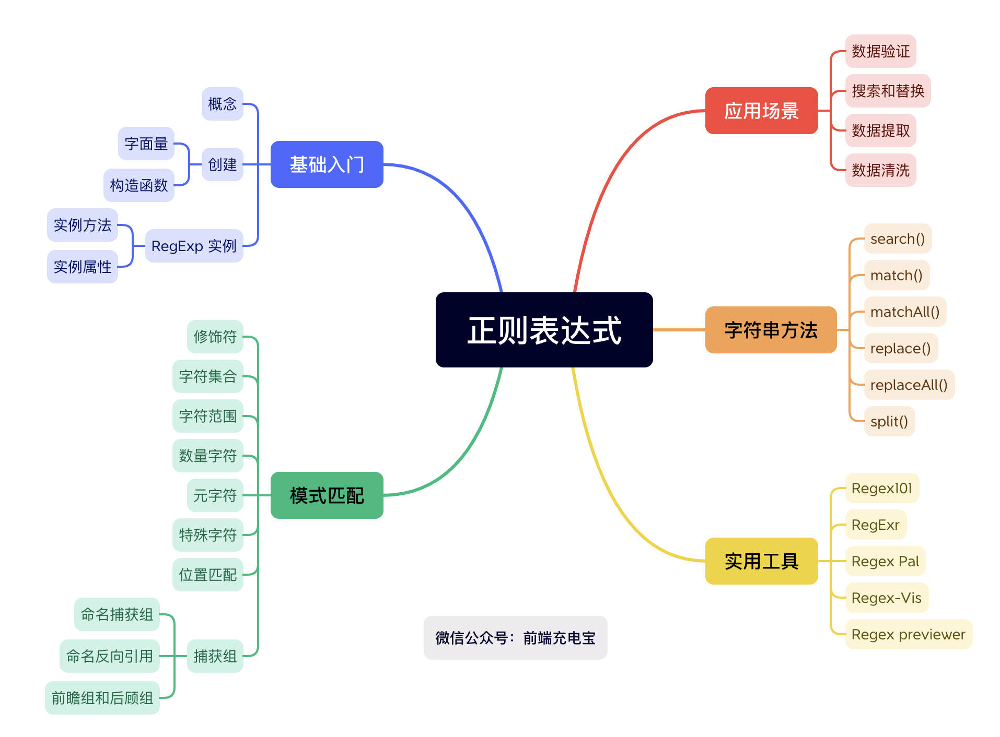

## 基础入门

### 概念

正则表达式（Regular Expression，在代码中常简写为regex、regexp或RE）使用单个字符串来描述、匹配一系列符合某个句法规则的字符串搜索模式。搜索模式可用于文本搜索和文本替换。它用一系列字符定义搜索模式。

正则表达式的用途有很多，比如：

* 表单输入验证；
* 搜索和替换；
* 过滤大量文本文件（如日志）中的信息；
* 读取配置文件；
* 网页抓取；
* 处理具有一致语法的文本文件，例如 CSV。

### 创建

正则表达式的语法如下：

```javascript
/正则表达式主体/修饰符(可选)
```

先来看一个最基本的正则表达式：`/处/`，它只匹配到了字符串中的第一个“处”：

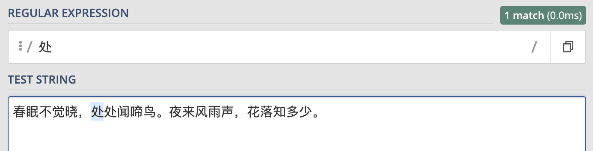

这里，正则表达式的主体就是“处”，没有使用修饰符，我们会在后面来介绍正则表达式的修饰符。

创建正则表达式的方式有两种：

* \*\*字面量：\*\*正则表达式直接放在`/ /`之中：

```javascript
const rex = /pattern/; 
```

* \*\*构造函数：\*\*RegExp 对象表示正则表达式的一个实例：

```javascript
const rex = new RegExp("pattern");
```

这两种方法的一大区别是对象的构造函数允许传递带引号的表达式，通过这种方式就可以**动态创建**正则表达式。

通过这两种方法创建出来的 Regex 对象都具有相同的方法和属性：

```javascript
let RegExp1 = /a|b/

let RegExp2 = new RegExp('a|b')

console.log(RegExp1)  // 输出结果：/a|b/
console.log(RegExp2)  // 输出结果：/a|b/
```

### RegExp 实例

#### 实例方法

RegExp 实例置了`test()`和`exec()` 这两个方法来校验正则表达式。下面来分别看一下这两个方法。

**（1）test()**

`test()`用于检测一个字符串是否匹配某个模式，如果字符串中含有匹配的文本，则返回 true，否则返回 false。

```javascript
const regex1 = /a/ig;
const regex2 = /hello/ig;
const str = "Action speak louder than words";

console.log(regex1.test(str));  // true
console.log(regex2.test(str));  // false
```

**（2）exec()**

`exec()`用于检索字符串中的正则表达式的匹配。该函数返回一个数组，其中存放匹配的结果。如果未找到匹配，则返回值为 null。

```javascript
const regex1 = /a/ig;
const regex2 = /hello/ig;
const str = "Action speak louder than words";

console.log(regex1.exec(str));  // ['A', index: 0, input: 'Action speak louder than words', groups: undefined]
console.log(regex2.exec(str));  // null
```

在当在全局正则表达式中使用 `exec` 时，每隔一次就会返回`null`，如图：

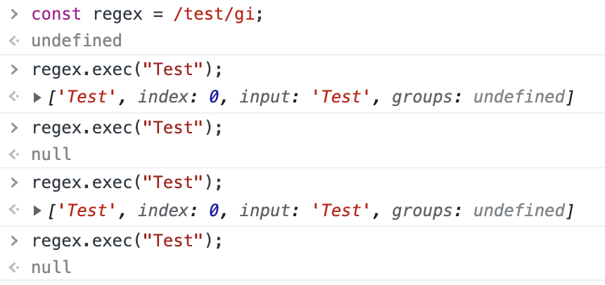

这是怎么回事呢？MDN 的解释如下：

> 在设置了 global 或 sticky 标志位的情况下（如 /foo/g or /foo/y），JavaScript RegExp 对象是有状态的。他们会将上次成功匹配后的位置记录在 lastIndex 属性中。使用此特性，exec() 可用来对单个字符串中的多次匹配结果进行逐条的遍历（包括捕获到的匹配），而相比之下， String.prototype.match() 只会返回匹配到的结果。

为了解决这个问题，我们可以在运行每个exec命令之前将`lastIndex`赋值为 0：

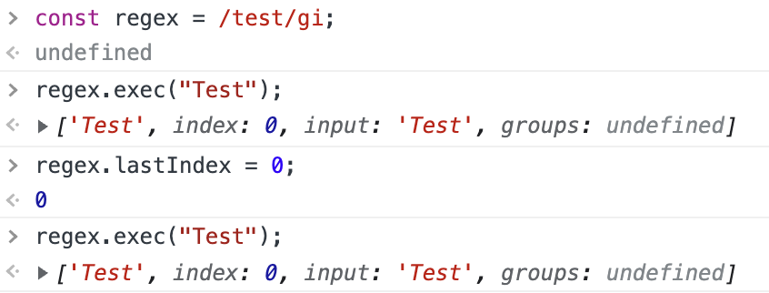

#### 实例属性

RegExp 实例还内置了一些属性，这些属性可以获知一个正则表达式的各方面的信息，但是用处不大。

| **属性** | **描述** |
| :---: | --- |
| `global` | 布尔值，表示是否设置了g标志 |
| `ignoreCase` | 布尔值，表示是否设置了i标志 |
| `lastIndex` | 整数，表示开始搜索下一个匹配项的字符位置，从0算起 |
| `multiline` | 布尔值，表示是否设置了m标志 |
| `source` | 正则表达式的字符串表示，按照字面量形式而非传入构造函数重大的字符串模式匹配 |

## 模式匹配

关于正则表达式最复杂的地方就是如何编写正则规则了，下面就来看如何编写正则表达式。

### 修饰符

正则表达式的修饰符是一种可以在正则表达式模式中添加的标记，用于修改搜索模式的行为。这些修饰符通常以单个字符形式出现在正则表达式的末尾，并且可以通过在正则表达式模式前添加该字符来启用修饰符。

常见的修饰符如下：

* `g`：表示全局模式，即运用于所有字符串；
* `i`：表示不区分大小写，即匹配时忽略字符串的大小写；
* `m`：表示多行模式，强制 $ 和 ^ 分别匹配每个换行符。

最开始的例子中，字符串中有两个“处”，但是只匹配到了一个。这是因为正则表达式默认匹配第一个符合条件的字符。如果想要匹配所有符合条件的字符，就可以使用 `g` 修饰符：

```javascript
/处/g
```

这样就匹配到了所有符合条件的字符：

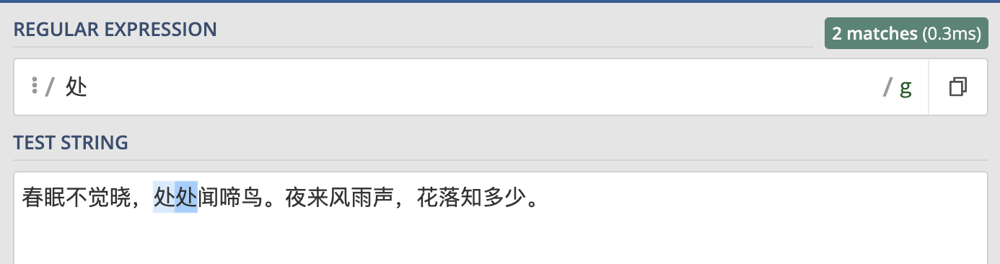

当需要匹配引英文字符串，并且忽略字符串的字母大小写时，`i` 修饰符就派上用场了。先来看下面的表达式：

```javascript
/a/g
```

在进行匹配时，它匹配到了字符串中所有的 `a` 字符。但是最开始的 `A` 是没匹配到的，因为两者大小写不一致：

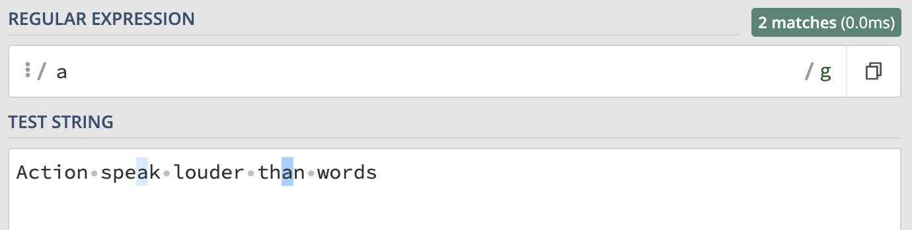

那我们来添加上 `i` 修饰符：

```javascript
/a/gi
```

这时所有的 `a` 都被匹配到了，无论是大写还是小写，总共匹配到了三个 `a`：

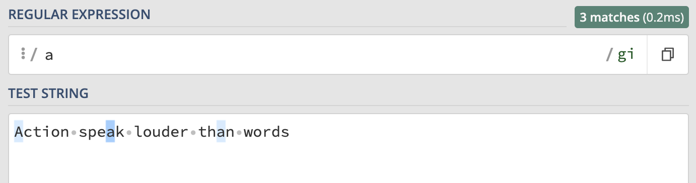

还有一个小疑问， 如果是对象构造函数的方式来构造正则表达式使，如何添加这些修饰符呢？其实很简单，只要将修饰符作为第二个参数传递给 构造函数就可以了：

```javascript
let regExp = new RegExp('[2b|^2b]', 'gi')

console.log(regExp)  // 输出结果：/[2b|^2b]/gi
```

### 字符集合

如果我们想匹配 bat、cat 和 fat 这种类型的字符串该怎么办？可以通过使用**字符集合**来做到这一点，用 \[] 表示，它会匹配包含的任意一个字符。这里就可以使用`/[bcf]at/ig`：

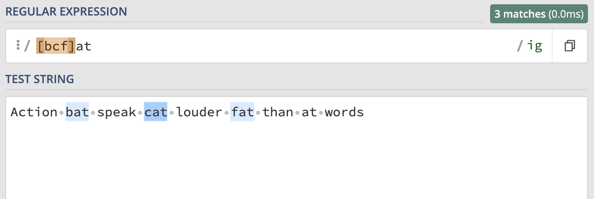

可以看到，这里匹配到了字符串中的 bat、cat、fat。因为我们使用了 g 修饰符，所以匹配到了三个结果。

当然，字符集也可以用来匹配数字：

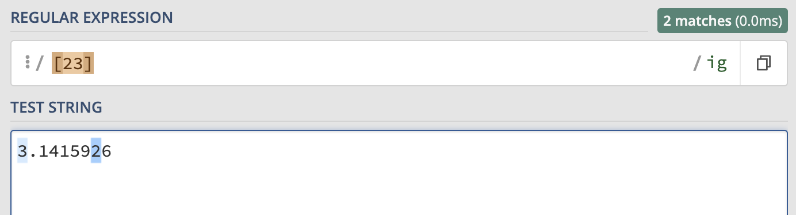

### 字符范围

如果我们想要在字符串中匹配所有以 at 结尾的单词，最直接的方式是使用字符集，并在其中提供所有的字母。对于这种在一个范围中的字符， 就可以直接定义字符范围，用`-`表示。它用来匹配指定范围内的任意字符。这里就可以使用`/[a-z]at/ig`：

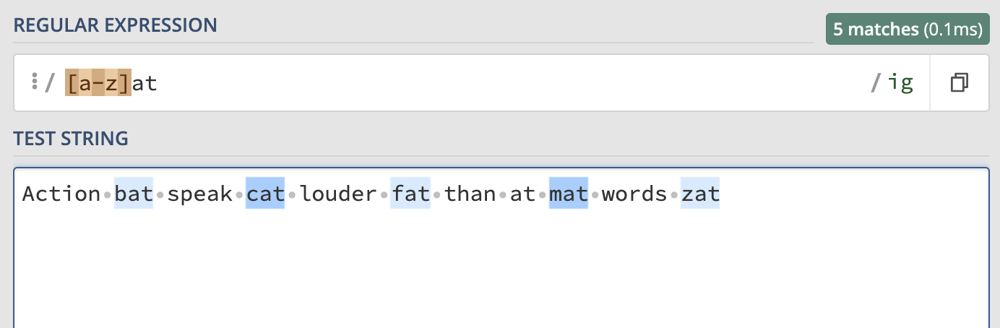

可以看到，正则表达式按照我们的预期匹配了。

常见的使用范围的方式如下：

* **部分范围**：`[a-f]`，匹配 a  到 f 的任意字符；
* **小写范围**：`[a-z]`，匹配 a 到 z 的任意字符；
* **大写范围**：`[A-Z]`，匹配 A 到 Z 的任意字符；
* **数字范围**：`[0-9]`，匹配 0 到 9 的任意字符；
* **符号范围**：`[#$%&@]`；
* **混合范围**：`[a-zA-Z0-9]`，匹配所有数字、大小写字母中的任意字符。

### 数量字符

如果想要匹配三个字母的单词，根据上面我们学到的字符范围，可以这样来写：

```javascript
[a-z][a-z][a-z]
```

这里我们匹配的三个字母的单词，那如果想要匹配10个、20个字母的单词呢？难道要一个个来写范围吗？有一种更好的方法就是使用花括号`{}`来表示，来看例子：

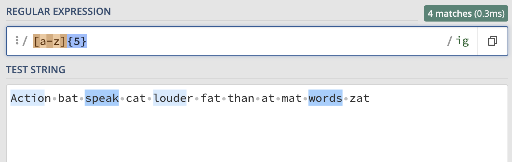

可以看到，这里我们匹配到了所有连续5个字母的单词（包括超过5个字母的单词，不过只会匹配到前5个字母）。

其实匹配重复字符的完整语法是这样的：`{m,n}`，它会匹配前面一个字符至少 m 次至多 n 次重复，{m}表示匹配 m 次，{m,}表示至少 m 次。

所以，当我们给5后面加上逗号时，就表示至少匹配五次：

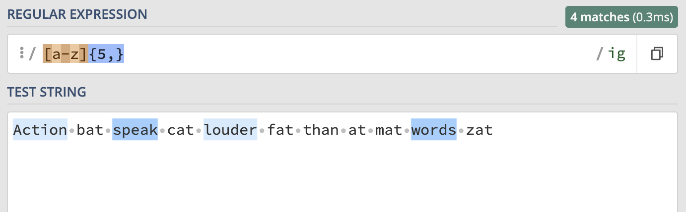

所以这里就匹配到了所有连续5个或5个以上的单词。

当匹配次数为至少4次，至多5次时，匹配结果如下：

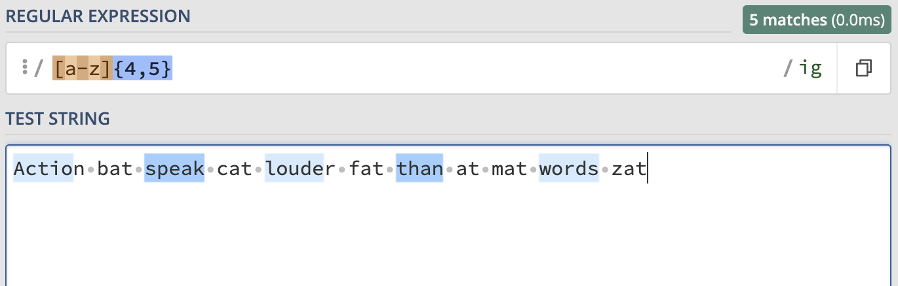

除了可以使用大括号来匹配一定数量的字符，还有三个相关的模式：

* `+`：匹配前面一个表达式一次或者多次，相当于 `{1,}`；
* `*`：匹配前面一个表达式0次或者多次，相当于 `{0,}`；
* `?`：单独使用匹配前面一个表达式零次或者一次，相当于 `{0,1}`，如果跟在量词\*、+、?、{}后面的时候将会使量词变为非贪婪模式（尽量匹配少的字符），默认是使用贪婪模式。

来看一个简单的例子，这里我们匹配的正则表达式为`/a+/ig`，结果如下：

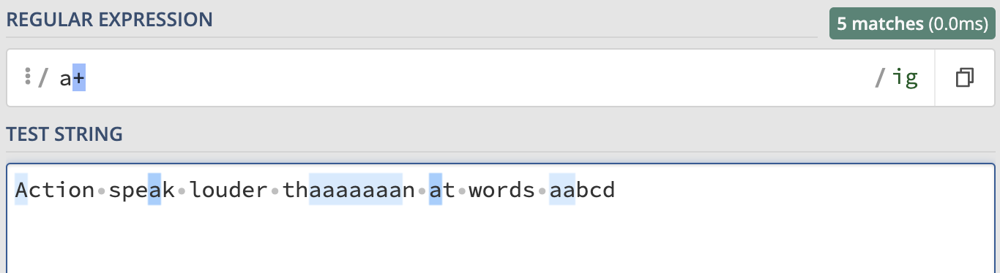

它和`/a{1,}/ig`的匹配结果是一样的：

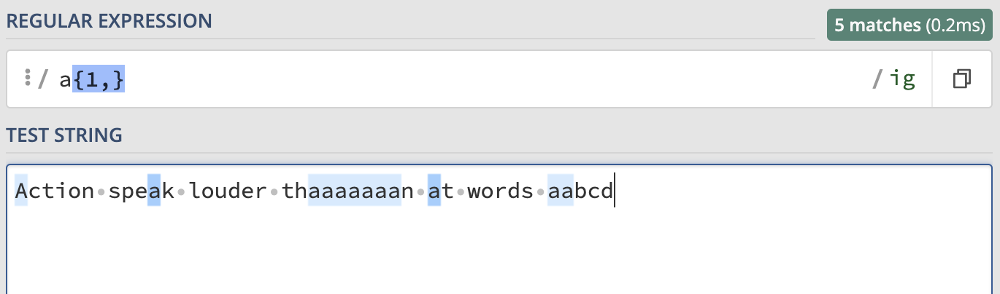

使用`/[a-z]+/ig`就可以匹配任意长度的纯字母单词：

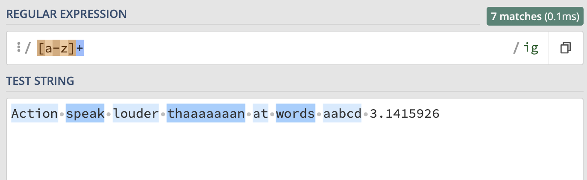

### 元字符

使用元字符可以编写更紧凑的正则表达式模式。常见的元字符如下：

* `\d`：相当于`[0-9]`，匹配任意数字；
* `\D`：相当于`[^0-9]`；
* `\w`：相当于`[0-9a-zA-Z]`，匹配任意数字、大小写字母和下划线；
* `\W`：相当于：\[^0-9a-zA-Z]；
* `\s`：相当于`[\t\v\n\r\f]`，匹配任意空白符，包括空格，水平制表符`\t`，垂直制表符`\v`，换行符`\n`，回车符`\r`，换页符`\f`；
* `\S`：相当于`[^\t\v\n\r\f]`，表示非空白符。

来看一个简单的例子：

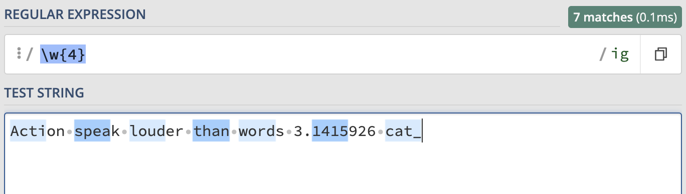

这里使用`\d`来匹配任意数字、字母和下划线。这里就匹配到了7个连续四位的字符。

### 特殊字符

使用特殊字符可以编写更高级的模式表达式，常见的特殊字符如下：

* `.`：匹配除了换行符之外的任何单个字符；
* `\`：将下一个字符标记为特殊字符、或原义字符、或向后引用、或八进制转义符；
* `|`：逻辑或操作符；
* `[^]`：取非，匹配未包含的任意字符。

来看一个简单的例子，如果我们使用 `/ab*/ig` 进行匹配，结果就如下：

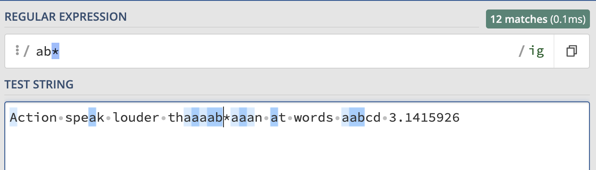

那我们就是想要匹配 \* 怎么办？就可以使用 `\` 对其进行转义：

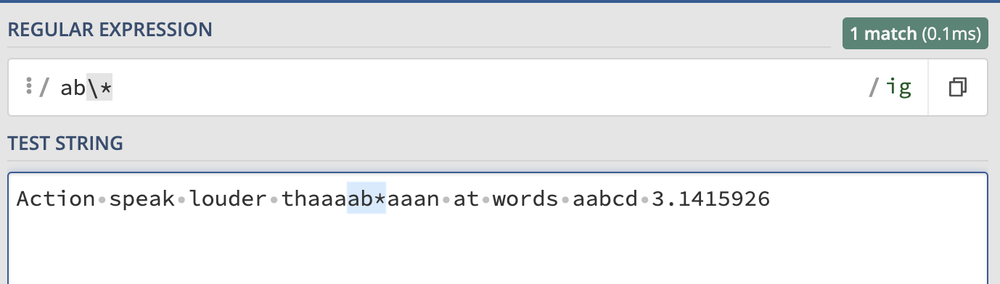

这样就只会匹配到 `ab*` 了。

或匹配也很简单，来看例子，匹配规则为：`/ab|cd/ig`，匹配结果如下：

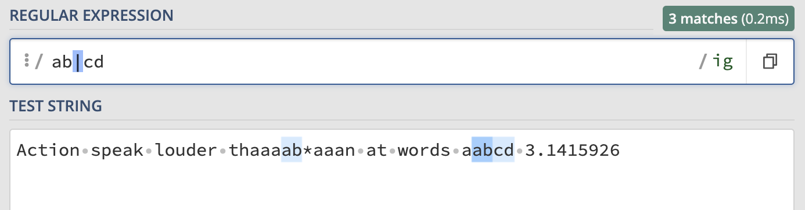这里就会匹配到字符串中所有 `ab` 和 `cd` 字符。那如果想要匹配 `sabz` 或者`scdz`呢？开头和结尾是相同的，只有中间的两个字符是可选的。其实只需要给中间的或部分加上括号就可以了：

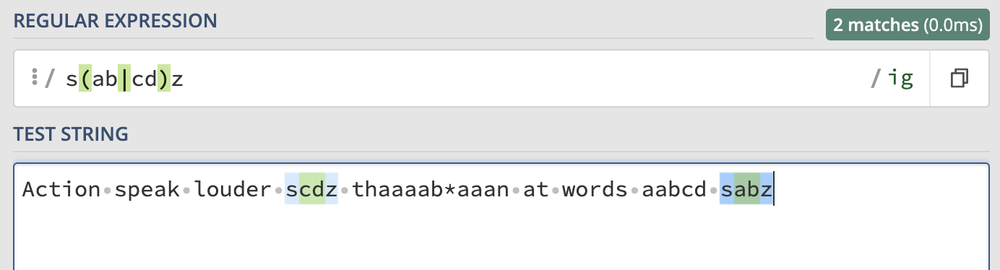

取非规则在范围中使用，来看例子：

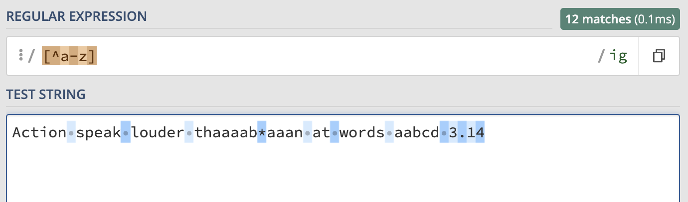

这里匹配到了所有非字母的字符。

### 位置匹配

如果我们想匹配字符串中以某些字符结尾的单词，以某些字符开头的单词该如何实现呢？正则表达式中提供了方法通过位置来匹配字符：

* `\b`：匹配一个单词边界，也就是指单词和空格间的位置；
* `\B`：匹配非单词边界；
* `^`：匹配开头，在多行匹配中匹配行开头；
* `$`：匹配结尾，在多行匹配中匹配行结尾；
* `(?=p)`：匹配 p 前面的位置；
* `(?!=p)`：匹配不是 p 前面的位置。

最常见的就是匹配开始和结束位置。先来看一个开始位置的匹配，这里使用 `/^ex/igm` 来匹配多行中以`ex` 开头的行：

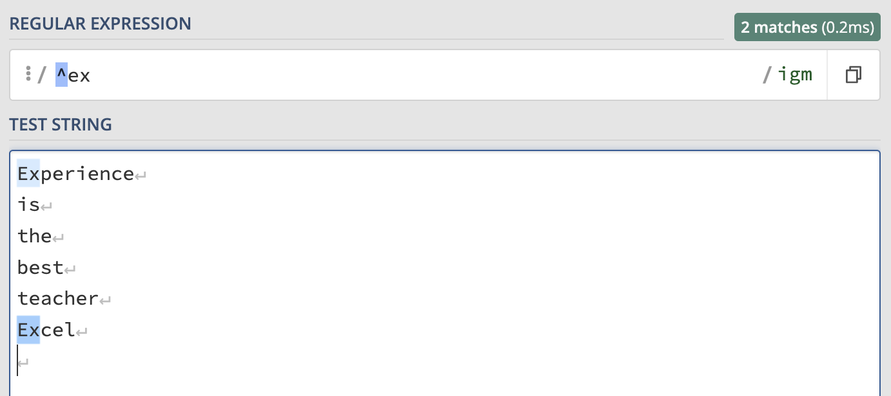

使用`/e$/igm`来匹配以 e 结尾的行：

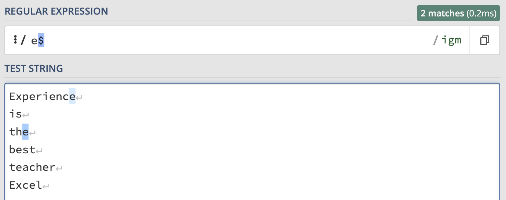

可以使用 `\w+$ `来匹配每一行的最后一个单词：

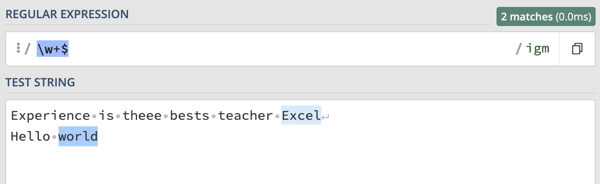

需要注意，这里我们都使用 `m` 修饰符开启了多行模式。

使用 `/(?=the)/ig` 来匹配字符串中`the`前的面的位置：

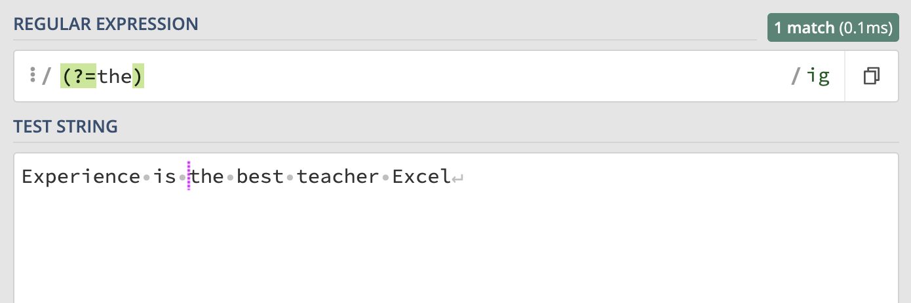

我们可以使用`\b`来匹配单词的边界，匹配的结果如下：

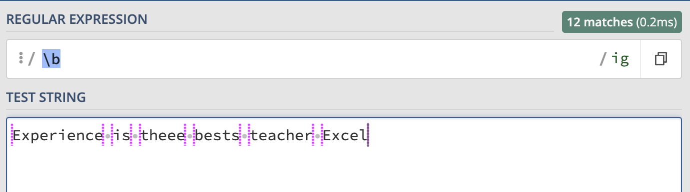

这可能比较难理解，我们可以使用以下正则表达式来匹配完整的单词：`\b\w+\b`，匹配结果如下：

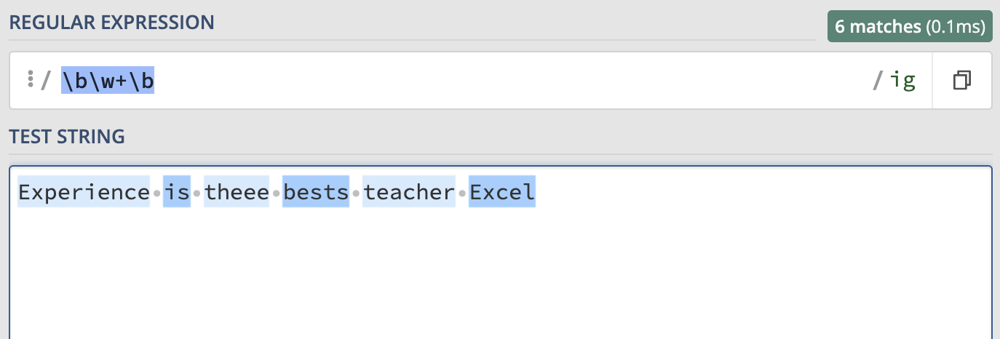

### 捕获组

正则表达式中的“捕获组”是指使用括号 `()` 将子模式括起来，以便于在搜索时同时匹配多个项或将匹配的内容单独提取出来。组可以根据需要进行嵌套，形成复杂的匹配模式。

使用捕获组，可以直接在正则表达式 `/(Testing|tests) 123/ig` 中匹配到 "Testing 123" 和 "Tests 123"，而不需要重复写 "123" 的匹配项。

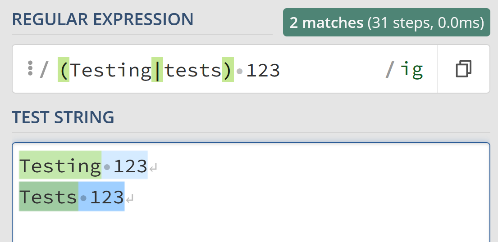

正则表达式中的两种常见组类型：

* `(...)`：捕获组，用于匹配任意三个字符。
* `(?:...)`：非捕获组，也是用于匹配任意三个字符，但不进行捕获。

可以使用以下 JavaScript 将文本替换为`Testing 234`和`tests 234`：

```typescript
const regex = /(Testing|tests) 123/ig;

let str = `
Testing 123
Tests 123
`;

str = str.replace(regex, '$1 234');
console.log(str); 
// Testing 234
// Tests 234
```

被括号包围的子模式称为“捕获组”，捕获组可以从匹配的字符串中提取出指定的部分并单独使用。这里我们使用 `$1` 来引用第一个捕获组 `(Testing|tests)`。也可以匹配多个组，比如同时匹配 `(Testing|tests)` 和 `(123)`。

```typescript
const regex = /(Testing|tests) (123)/ig;

let str = `
Testing 123
Tests 123
`;

str = str.replace(regex, '$1 #$2');
console.log(str); 
// Testing #123
// Tests #123"
```

这只适用于捕获组。如果把上面的正则表达式变成这样：

```typescript
/(?:Testing|tests) (123)/ig;
```

那么只有一个被捕获的组：`(123)`，与之前相同的代码将输出不同的结果：

```typescript
const regex = /(?:Testing|tests) (123)/ig;

let str = `
Testing 123
Tests 123
`;

str = str.replace(regex, '$1');
console.log(str);
// 123
// 123
```

修改后的正则表达式只有一个捕获组 `(123)`。因为 `(?: )` 的语法用于创建非捕获组，所以它不会将其内容作为一个捕获组来使用。

#### 命名捕获组

虽然捕获组非常有用，但是当有很多捕获组时很容易让人困惑。`$3` 和 `$5` 这些名字并不是一目了然的。为了解决这个问题，正则表达式引入了“命名捕获组”的概念。例如，`(?<name>...)` 就是一个命名捕获组，名为 "`name`"，用于匹配任意三个字符。

可以像这样在正则表达式中使用它来创建一个名为 "`num`" 的组，用于匹配三个数字：

```javascript
/Testing (?<num>\d{3})/
```

然后，可以在替换操作中像这样使用它：

```javascript
const regex = /Testing (?<num>\d{3})/
let str = "Testing 123";
str = str.replace(regex, "Hello $<num>")
console.log(str); // "Hello 123"
```

#### 命名反向引用

有时候需要在查询字符串中引用一个命名捕获组，这就是“反向引用”的用武之地。

假设有一个字符串，其中包含多个单词，我们想要找到所有出现两次或以上的单词。可以使用具名捕获组和命名反向引用来实现。

```javascript
const regex = /\b(?<word>\w+)\b(?=.*?\b\k<word>\b)/g;
const str = 'I like to eat pizza, but I do not like to eat sushi.';
const result = str.match(regex);
console.log(result); // like
```

这里使用了具名捕获组 `(?<word>\w+)`来匹配单词，并将其命名为 "`word`"。然后使用命名反向引用 `(?=.*?\b\k<word>\b)` 来查找文本中是否存在具有相同内容的单词。

#### 前瞻组和后顾组

前瞻组（Lookahead）和后顾组（Lookbehind）是正则表达式中非常有用的工具，它们用于在匹配过程中进行条件约束，而不会实际匹配这些约束的内容。它们使得我们可以更精确地指定匹配模式。

前瞻组：

* 正向前瞻（`(?=...)`）：用于查找在某个位置后面存在的内容。例如，`A(?=B)` 可以匹配 "A"，但只有在后面跟着 "B" 时才进行匹配。
* 负向前瞻（`(?!...)`）：用于查找在某个位置后面不存在的内容。例如，`A(?!B)` 可以匹配 "A"，但只有在后面不跟着 "B" 时才进行匹配。

后顾组：

* 正向后顾（`(?<=...)`）：用于查找在某个位置前面存在的内容。例如，`(?<=A)B` 可以匹配 "B"，但只有在其前面跟着 "A" 时才进行匹配。
* 负向后顾（`(?<!...)`）：用于查找在某个位置前面不存在的内容。例如，`(?<!A)B` 可以匹配 "B"，但只有在其前面不跟着 "A" 时才进行匹配。

这些前瞻组和后顾组可以用于各种场景，例如：

* 在匹配邮箱地址时，使用正向前瞻来确保地址的结尾是以特定的域名结尾。
* 在匹配密码时，使用正向前瞻来确保密码满足特定的复杂度要求。
* 在提取文本中的日期时，使用正向后顾来确保日期的前面有特定的前缀。

例如，使用负向前瞻可以匹配 BC，但不会匹配 BA。

```javascript
/B(?!A)/
```

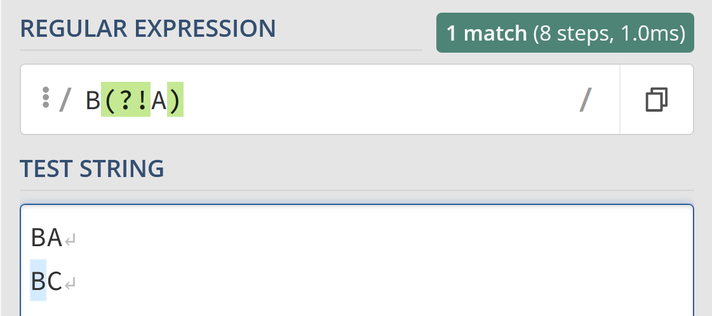

我们甚至可以将负向前瞻组合使用，并使用 ^ 和 $ 这些元字符来尝试匹配完整的字符串。例如，以下的正则表达式将匹配任何不以 "Test" 开头的字符串：

```javascript
/^(?!Test).*$/gm
```

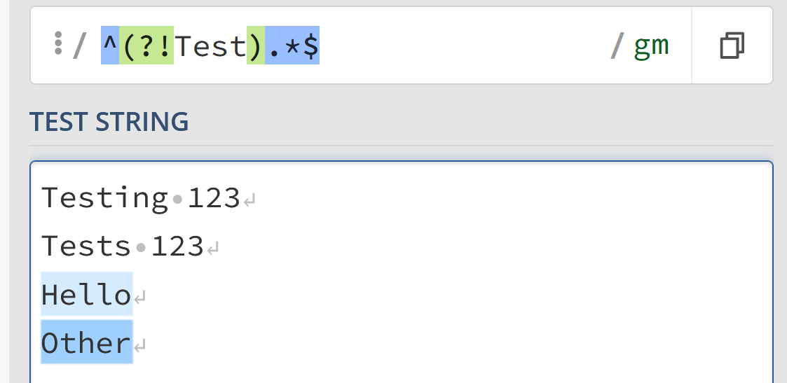

这个正则表达式可以匹配 `Hello` 和 `Other`，但无法匹配 `Testing 123` 和 `Tests 123`。

同样，可以将其切换为正向前瞻，以强制字符串必须以“Test”开头：

```javascript
/^(?=Test).*$/gm
```

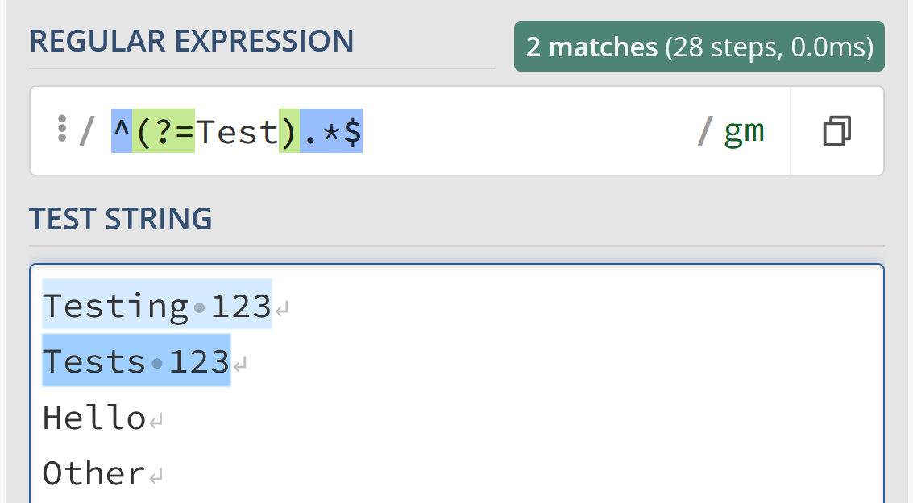

## 字符串方法

在 JavaScript 内置了 6 个常用的方法是支持正则表达式的，下面来分别看看这些方法。

### search()

`search()`  方法用于检索字符串中指定的子字符串，或检索与正则表达式相匹配的子字符串，并返回子串的起始位置。如果没有找到任何匹配的子串，则返回 -1。

```javascript
const regex1 = /a/ig;
const regex2 = /p/ig;
const regex3 = /m/ig;
const str = "Action speak louder than words";

console.log(str.search(regex1));  // 输出结果：0
console.log(str.search(regex2));  // 输出结果：8
console.log(str.search(regex3));  // 输出结果：-1
```

可以看到，`search()` 方法只会返回匹配到的第一个字符的索引值，当没有匹配到相应的值时，就会返回-1。

### match()

`match()` 方法可在字符串内检索指定的值，或找到一个或多个正则表达式的匹配。如果没有找到任何匹配的文本， `match()` 将返回 `null`。否则，它将返回一个数组，其中存放了与它找到的匹配文本有关的信息。

```javascript
const regex1 = /a/ig;
const regex2 = /a/i;
const regex3 = /m/ig;
const str = "Action speak louder than words";

console.log(str.match(regex1));  // 输出结果：['A', 'a', 'a']
console.log(str.match(regex2));  // 输出结果：['A', index: 0, input: 'Action speak louder than words', groups: undefined]
console.log(str.match(regex3));  // 输出结果：null
```

可以看到，当没有 `g` 修饰符时，就只能在字符串中执行一次匹配，如果想要匹配所有符合条件的值，就需要添加 `g` 修饰符。

### **matchAll()**

`matchAll()` 方法返回一个包含所有匹配正则表达式的结果及分组捕获组的迭代器。因为返回的是遍历器，所以通常使用`for...of`循环取出。

```javascript
for (const match of 'abcabc'.matchAll(/a/g)) {
    console.log(match)
}
//["a", index: 0, input: "abcabc", groups: undefined]
//["a", index: 3, input: "abcabc", groups: undefined]
```

需要注意，该方法的第一个参数是一个正则表达式对象，如果传的参数不是一个正则表达式对象，则会隐式地使用 `new RegExp(obj)` 将其转换为一个 `RegExp` 。另外，RegExp必须是设置了全局模式`g`的形式，否则会抛出异常 `TypeError`。

### replace()

`replace()` 用于在字符串中用一些字符串替换另一些字符串，或替换一个与正则表达式匹配的子串。

```javascript
const regex = /A/g;
const str = "Action speak louder than words";

console.log(str.replace(regex, 'a'));  // 输出结果：action speak louder than words
```

可以看到，第一个参数中的正则表达式匹配到了字符串的第一个大写的 A，并将其替换为了第二个参数中的小写的 a。

### replaceAll()

`replaceAll()` 方法用于在字符串中用一些字符替换另一些字符，或替换一个与正则表达式匹配的子串，该函数会替换所有匹配到的子字符串。

```javascript
const regex = /a/g;
const str = "Action speak louder than words";

console.log(str.replaceAll(regex, 'A'));  // 输出结果：Action speAk louder thAn words
```

需要注意，当使用一个 `regex` 时，您必须设置全局（"g"）标志， 否则，它将引发 `TypeError`："必须使用全局 RegExp 调用 replaceAll"。

### split()

`split()` 方法用于把一个字符串分割成字符串数组。其第一个参数是一个字符串或正则表达式，从该参数指定的地方分割字符串。

```javascript
const regex = / /gi;
const str = "Action speak louder than words";

console.log(str.split(regex));  // 输出结果：['Action', 'speak', 'louder', 'than', 'words']
```

这里的 `regex` 用来匹配空字符串，所以最终在字符串的每个空格处将字符串拆成了数组。

## 七、应用场景

上面介绍了正则表达式的用法，下面就来看看正则表达式的实际应用场景。

### 数据验证

数据验证应该是正则表达式最常见的场景了，经常用于用户的输入是否符合所需的条件。数据验证可确保输入或导入的数据准确、一致，并符合预定义的规则。

验证手机号：

```typescript
const phoneNumber = "13712345678";

const regex = /^1[3-9]\d{9}$/;

console.log("手机号格式正确：", regex.test(phoneNumber));
```

验证邮箱：

```typescript
const email = "example@example.com";

const regex = /^[^\s@]+@[^\s@]+\.[^\s@]+$/;

console.log("电子邮件格式正确：", regex.test(email));
```

验证密码（要求：至少包含一个数字，一个字母，一个特殊字符，长度在8~18之间）：

```typescript
const password = "Abcdef.123";

const regex = /^(?=.*\d)(?=.*[a-zA-Z])(?=.*[\W_]).{8,18}$/;

console.log("密码格式正确：", regex.test(password))
```

验证输入内容不能包含 emoji 表情：

```typescript
function hasEmoji(str) {
  const emojiRegex = /[\uD800-\uDFFF]|[\u2600-\u27FF]|[\u1F000-\u1F9FF]/g;
  return emojiRegex.test(str);
}

// 测试样例
const text1 = 'Hello, world!';
const text2 = '你好，🌍！';
console.log(hasEmoji(text1)); // false
console.log(hasEmoji(text2)); // true
```

### 搜索和替换

搜索和替换是正则表达式的很常见的用例。它允许查找文本中的特定模式并将其替换为所需的内容。

笔者之前做个一个需求：

1. 获取 HTML 字符串中所有图片，也就是获取所有 `img` 标签的 `src` 属性值，这个需求属于数据提取，第三部分会讲到；
2. 将获取到的图片转灰度图，转灰度成功的图片的名称会加一个`-gray`后缀，将这个图片替换 HTML 原来的图片。也就将转换成功的图片的`src`地址加`-gray`后缀。

灰度图替换：

```typescript
const grayImgReplace = (html: string, imgUrl: string) => {
    const regex = /(https?:\/\/[^\s"']+\.[^\s"']+(?<!-gray))\.(jpg|jpeg|png)/;
    const match = regex.exec(html);
    if (match) {
        return html.replace(match[0], `${imgUrl}`);
    }
    return html;
};
```

注意：这里仅替换一张图，若需要替换多张，每个图片都执行该方法即可。

另一个例子就是在 IDE 中进行正则表达式搜索和替换操作。比如，在 VS Code 中，只需在搜索栏中点击搜索栏左侧的正则表达式按钮（`.*`）或按下快捷键 `Alt + R`，就可以激活正则表达式搜索模式。

比如，有一个动态接口路径：`/app/api/:modal/list`，想要看看哪些地方调用了这个接口。这个路径中间的 `modal` 是动态的，没办法直接通过字符串进行搜索，怎么办呢？可以借助正则表达式轻松实现：

```typescript
\/app\/api\/([^\/]+)\/list
```

不管 `modal` 是什么，都可以轻松搜索到：

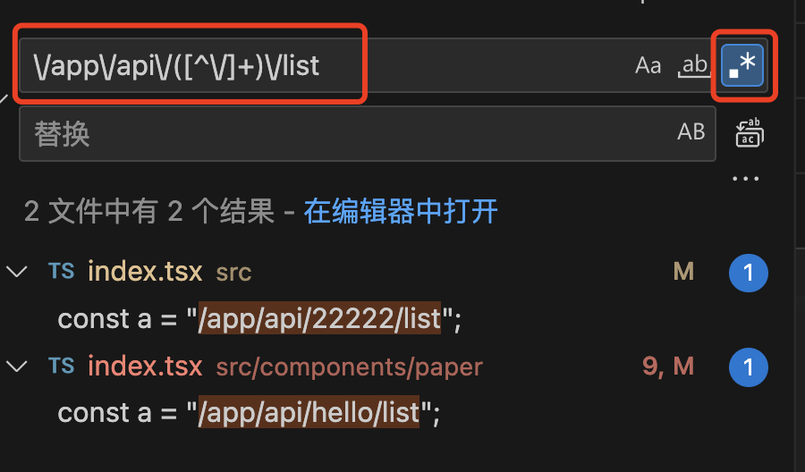

除此之外，还可以通过搜索替换轻松实现数据的格式化。例如，将数字转换为货币格式：

```typescript
const formatMoney = (money) => {
  return money.replace(new RegExp(`(?!^)(?=(\\d{3})+${money.includes('.') ? '\\.' : '$'})`, 'g'), ',')  
}

formatMoney('123456789') // '123,456,789'
formatMoney('123456789.123') // '123,456,789.123'
formatMoney('123') // '123'
```

### 数据提取

数据提取是正则表达式的另一个常见用例。正则表达式使我们能够根据定义的模式从较大的文本中有效地提取特定信息。

上面提到了从 HTML 字符串中获取所有图片 URL 的需求，下面来实现一下：

```typescript
const getImgs = (domContent) => {
  const imgs = [];
  const imgPattern = /]+src=['"]((?!.*\.svg).+?)['"]/g;

  let match = null;
  while ((match = imgPattern.exec(domContent)) !== null) {
    imgs.push(match[1]);
  }

  return imgs;
};
```

再比如，获取所有 `a` 标签链接，也就是获取 `href` 属性值：

```typescript
const html = '<a href="https://www.example.com">Link 1</a> <a href="https://www.google.com">Link 2</a>';

// 使用正则表达式提取 <a> 标签链接
const linkRegex = /<a\s+(?:[^>]*?\s+)?href=(["'])(.*?)\1/g;
const links = [];
let match;

while ((match = linkRegex.exec(html)) !== null) {
  const link = match[2];
  links.push(link);
}

console.log(links);
```

输出结果如下：

```typescript
[
  'https://www.example.com',
  'https://www.google.com'
]
```

再比如，提取 URL 中的域名：

```typescript
const url = 'https://www.example.com/path/to/page?param1=value1&param2=value2#section';
const domainRegex = /https?:\/\/([\w.-]+)/;
const match = url.match(domainRegex);
const domain = match && match[1];

console.log(domain); // www.example.com
```

### 数据清洗

通过适当使用正则表达式，可以轻松地从文本数据中查找、匹配和替换特定的模式和字符，从而对数据进行清理和预处理。以下是一些常见的数据清洗任务，可以使用正则表达式来完成：

* **移除多余空格**：使用正则表达式将连续的多个空格或制表符替换为单个空格，或者完全移除所有空格。
* **格式化日期**：使用正则表达式解析和提取日期字符串，并将其格式化为指定的格式或日期对象。
* **清除特殊字符**：使用正则表达式从文本数据中移除不需要的特殊字符和标点符号，例如 emoji 表情符号、HTML 标签、URL 等。
* **提取信息**：使用正则表达式从文本数据中提取特定的信息，例如电话号码、邮件地址、IP 地址等。
* **替换错误或不一致的数据**：使用正则表达式查找和替换文本数据中的错误拼写、大小写、颠倒顺序等问题，使得数据更加一致和规范化。

比如，删除字符串中的标签和 emoji 表情：

```typescript
const text = 'Hello, <b>world</b>! 🌍';
const cleanText = text.replace(/<\/?[^>]+(>|$)/g, '').replace(/[\uD800-\uDBFF][\uDC00-\uDFFF]/g, '');

console.log(cleanText); // Hello, world!
```

这里使用了两个正则表达式替换操作：

* `/<\/?[^>]+(>|$)/g`：这个正则表达式用于匹配并移除 HTML 标签。它会匹配尖括号内的任何内容，并将其替换为空字符串。
* `/[\uD800-\uDBFF][\uDC00-\uDFFF]/g`：这个正则表达式用于匹配并移除 emoji 表情符号。由于 emoji 符号采用 Unicode 编码的多个字符表示，我们使用这个正则表达式匹配并移除这些字符。

## 八、实用工具

### 1. Regex101

Regex101 是学习正则表达式最有效的工具网站之一。在REGULAR EXPRESSION栏中可以输入正则表达式，可以在输入框右侧选择需要的修饰符，在下面的TEST STRING栏中输入要测试的字符串，即可显示出匹配到的结果。在右侧的EXPLANATION区域会显示出对输入的正则表达式的详细解释。右下角的 QUICK REFERENCE 栏会显示正则表达式速查表。

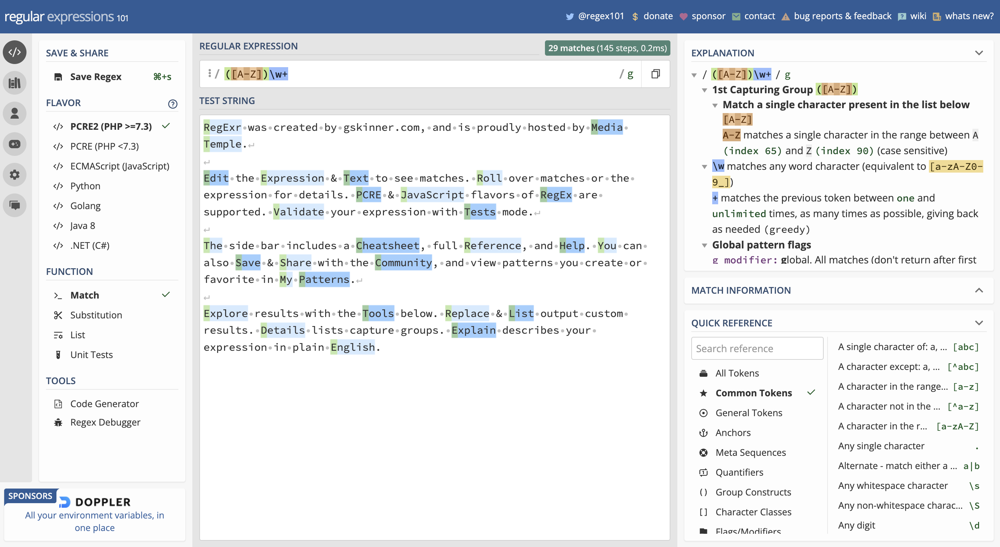

Regex101 还支持在上面练习编写正则表达式：

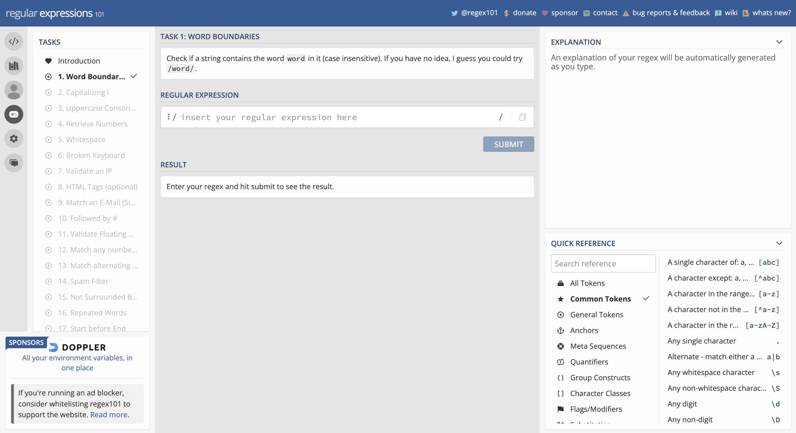

可以在上面搜索一些正则表达式的库：


除此之外，我们还可以使用 RegexDebugger 来跟踪匹配的过程。更多功能可以在Regex101 上进行探索。

***

**官网：**<https://regex101.com/>

### 2. **RegExr**

RegExr 是一个基于 JavaScript 开发的在线工具，用来创建、测试和学习正则表达式。它是一个开源的工具，具有以下特性：

* 输入时，结果会实时更新；
* 支持 JavaScript 和 PHP/PCRE RegEx；
* 将匹配项或表达式移至详细信息；
* 保存并与他人共享表达式；
* 使用工具探索结果；
* 浏览参考以获取帮助和示例；
* 在编辑器中使用 cmd-Z/Y 撤消和重做。

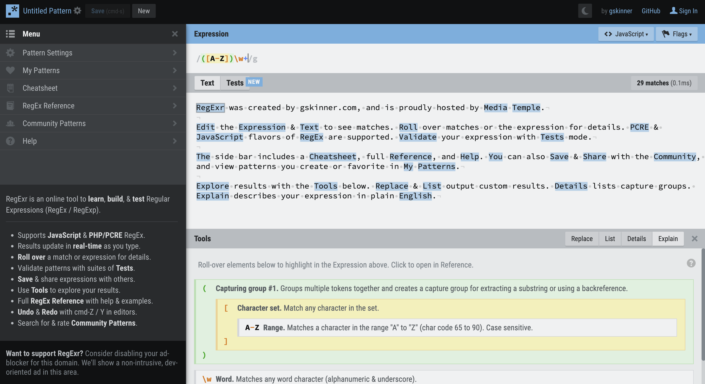

**官网：**<https://regexr.com/>

### 3. Regex Pal

Regexpal 是一个基于 Javascript 的在线正则表达式验证工具。它的页面非常简洁，只有两个输入框，上面的输入框中可以输入正则表达式（匹配规则），下面的输入框可以输入待匹配的数据。此外，根据具体要求，还可以设置忽略大小写、多行匹配等参数。

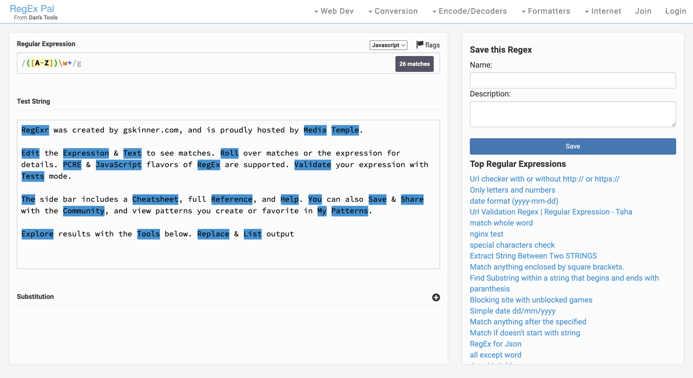

**官网：**<https://www.regexpal.com/>

### 4. Regex-Vis

Regex-Vis 是一个辅助学习、编写和验证正则的工具。它不仅能对正则进行可视化展示，而且提供可视编辑正则的能力。在输入一个正则表达式后，会生成它的可视化图形。然后可以点选或框选图形中的单个或多个节点，再在右侧操作面板对其进行操作，具体操作取决于节点的类型，比如在其右侧插入空节点、为节点编组、为节点增加量词等。

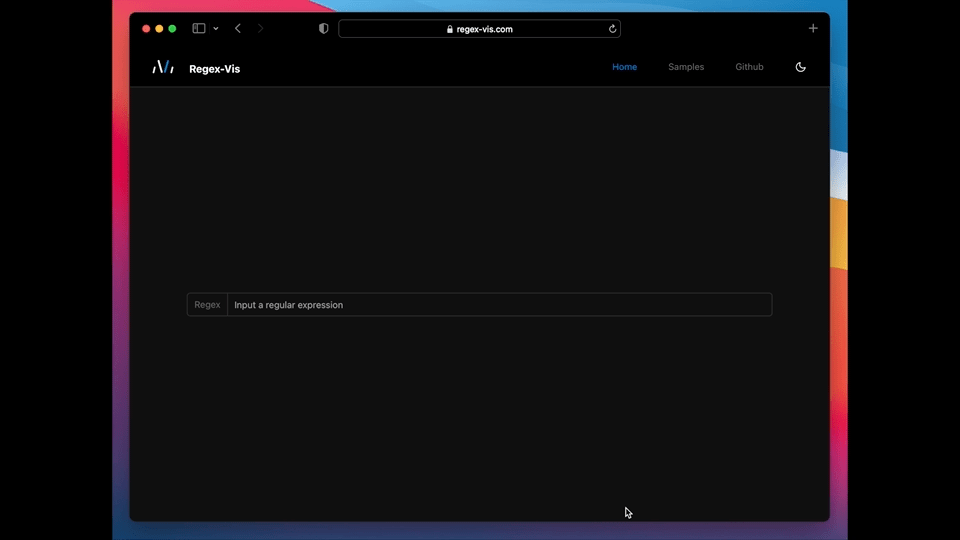

**官网：**<https://regex-vis.com/>

### 5. Regex previewer

Regex previewer 是一个 VScode 插件，在插件市场搜索名称即可安装。当我们在编写正则表达式时，可以直接使用快捷键 **Ctrl+Alt+M** （windows）或者 `⌥+⌘+M`（Mac）在编辑器右侧启动一个标签页，我们可以在这个标签页写一写测试用例，用来测试我们写的正则表达式，写完字符串用例之后，点击我们编写的正则表达式上方的 Test Regex...即可，这样右侧匹配到字符就会高亮显示了，如下图：

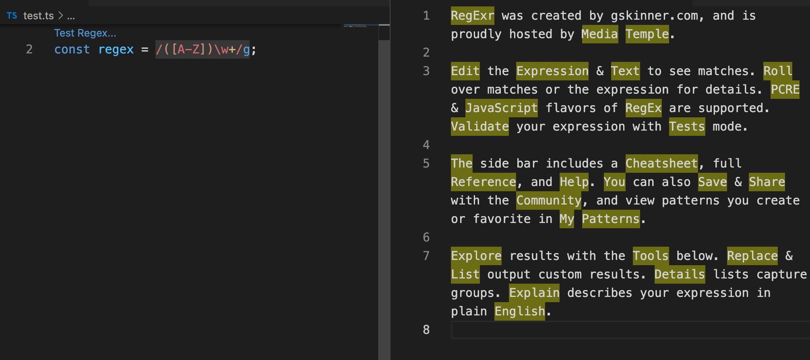


> 更新: 2023-09-22 00:33:38  
> 原文: <https://www.yuque.com/cuggz/feplus/tu9typ>