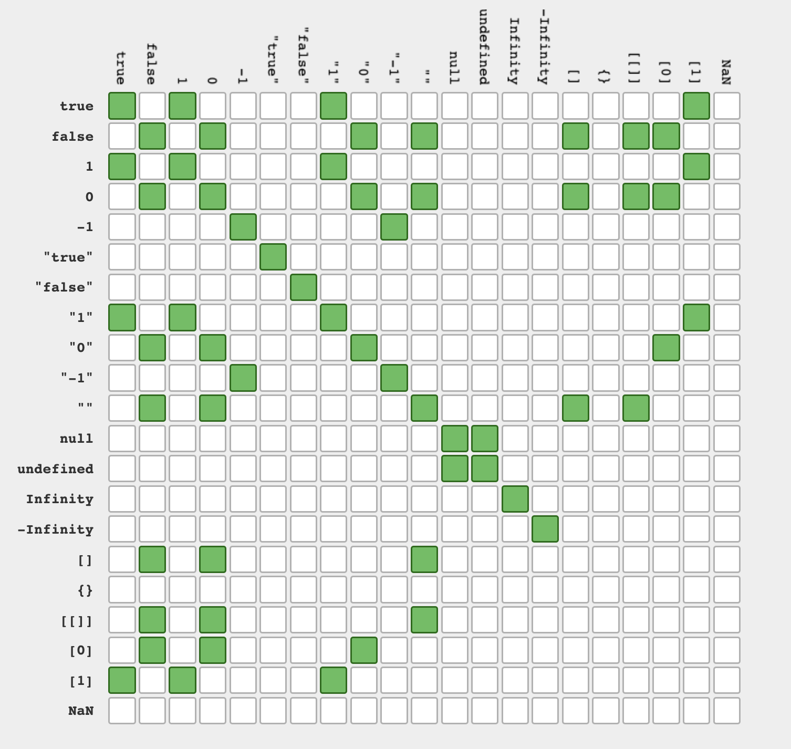
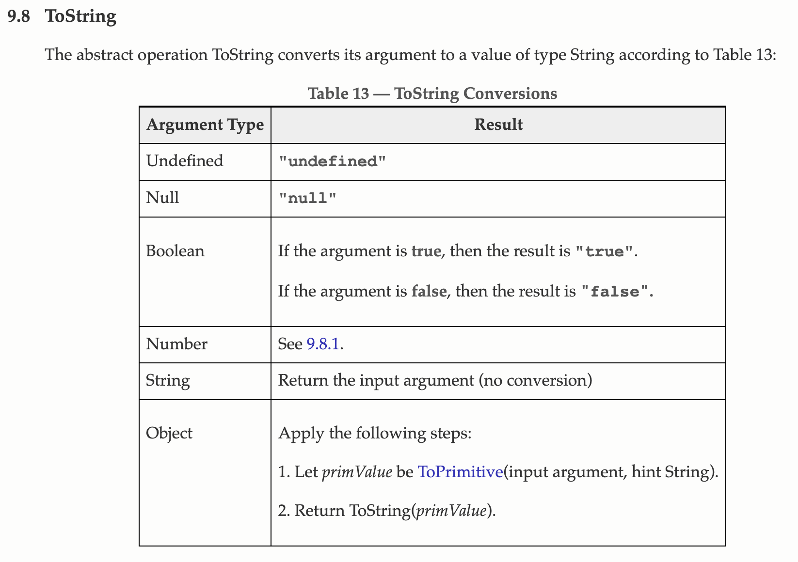
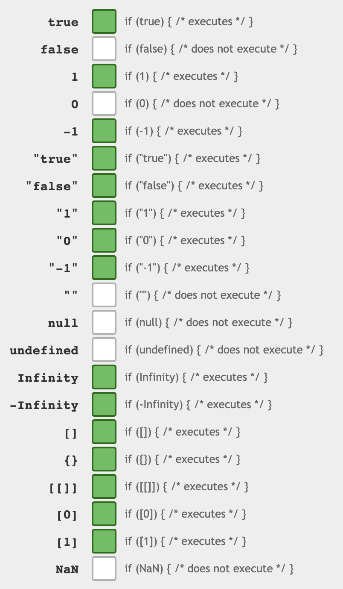
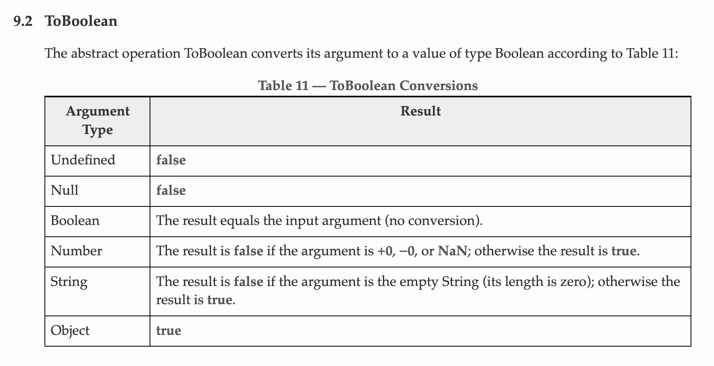
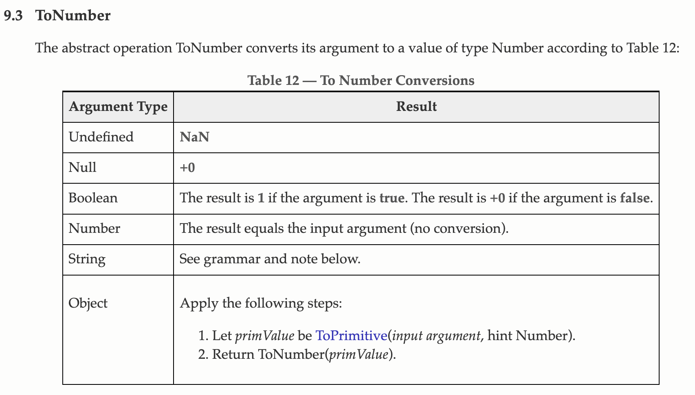
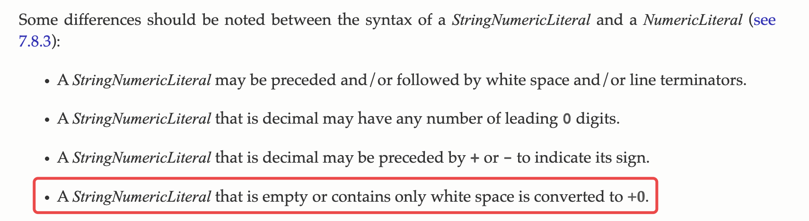
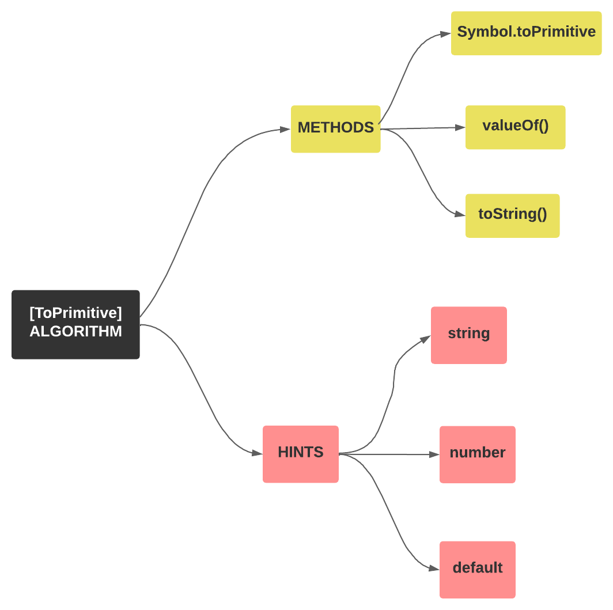

# 类型转换

## 1. 什么是类型转换？

Javascript 是一种弱类型语言，这意味着变量是没有明确类型的，而是由 JavaScript 引擎在编译时隐式完成。类型转换是将一种数据类型转换为另一种数据类型，例如：

```javascript
20 + "twenty" // => "20twenty"
"10" * "10" // => 100 
2 - "x" 
```

Javascript 使用严格相等（===）和宽松相等（==）来测试两个值的相等性，类型转换仅在使用宽松相等运算符时发生。当使用 === 测试严格相等时，要比较的变量的类型和值都必须相同，例如：

```javascript
10 === 10     // true
NaN === NaN   // false
```

在上面的代码中，10和10都是数字并且是完全相等的，所以正如预期的那样返回了`true`，两个 NaN 永远不会相等。当使用 == 测试宽松相等时，可能会发生隐式转换：

```javascript
'20' == 20    // true
false == 0    // true
```

对于任何数据类型，无论是原始类型还是对象，都可以进行类型转换。尽管原始类型和对象的转换逻辑各不相同，但是都只能转换为三种类型：**字符串（string）、数字（number）、布尔值（boolean）**。

JavaScript 中的类型转换有两种方式：

* \*\*隐式类型转换：\*\*由 JavaScript 编译器完成的自动类型转换。
* \*\*显式类型转换：\*\*由开发人员完成的手动类型转换。

下面先来看看 JavaScript 中的显式和隐式类型转换。

### （1）显示类型转换

我们可以通过 JavaScript 内置的一些 API 将一种类型转换为另一种类型，这称为显式类型转化。执行显式类型转换的最简单方法是使用 `Boolean()`、`Number()` 和 `String()`、`parseInt()`等函数，例如：

```javascript
String(2 - true);     // '1'
'56' === String(56);  // true
Number('2350e-2');    // '23.5'
Number('23') + 7;     // 30
Boolean('');          // false
Boolean(2) === true;  //true
```

### （2）隐式类型转换

隐式类型转换是将一种数据类型转换为另一种数据类型（确保在相同数据类型之间完成操作）以使运算符或函数正常工作，这种转换是由 JavaScript 编译器自动完成的，隐式类型转换也称为类型强制。例如：

```javascript
'25' + 15;          // '2515'
23 * '2';           // 46
23 - true;          // 22
true - null;        // 1
false + undefined;  // NaN

const arr = [];
if(arr) { console.log('Hello World') };
```

下面这些常见的操作会触发隐式地类型转换，编写代码时要格外注意：

* 运算相关的操作符：+、-、+=、++、\* 、/、%、<<、& 等。
* 数据比较相关的操作符： >、<、== 、<=、>=、===。
* 逻辑判断相关的操作符： &&、!、||、三目运算符。

#### ① + 运算符

```javascript
/* 一个操作数 */
+ x // 将x转化为数字, 如果不能转化为数组将输出NaN
+ "1234string"   // NaN 
+ 1              // 1
+ '1'            // 1
+ true           // 1
+ undefined      // NaN
+ null           // 0
+ new Date()     // 1660493819396

/* 两个操作数 */
a + b

// 1. 如果其中任何一个是对象，则先将其转换为原始类型
{} + {}          // '[object Object][object Object]'
[] + []          // ''
[] + new Date()  // 'Mon Aug 15 2022 00:18:18 GMT+0800 (中国标准时间)'

// 2. 如果一个是字符串，则将另一个转换为字符串
1 + ''           // '1'
'' + 1           // '1'
'' + true        // 'true'

// 3. 否则，将两者都转换为数字
1 + true         // 2
true + true      // 2
```

#### ② -、\*、/、++、--

```javascript
// 将一个或多个值转换为数字
 - '1'     // -1
 [] - 1    // -1
 [] - {}   // NaN
```

#### ③ ==、!=

```javascript
// 两个操作数
 a == b

// 1. 如果一个是 `null` 而另一个是 `undefined`，它们是相等的
null == undefined    // true

// 2. 如果一个是数字，另一个是字符串，将字符串转换为数字，再比较
1 == '1'             // true

// 3. 如果其中一个是布尔值，将其转换为数字，再次比较
true == 1            // true
false == 0           // true

// 4. 如果一个是对象，另一个是数字或字符串，将对象转换为原始类型，再次比较
[1] == 1             // true
['1'] == '1'         // true
```

下图是在使用 == 时，判断两个操作数是否相等的总结（绿色表示相等，白色表示不等）：



#### ④ >、>=、<、<=

```javascript
// 两个操作数
a > b

// 1. 如果其中一个是对象，则将其转换为原始类型，再次比较
[2] > 1   // true

// 2. 如果两者都是字符串，使用字母顺序比较它们
'b' > 'a' // true

// 3. 如果其中一个是数字，则将一个或两个非数字转换为数字
'2' > 1   // true
```

#### ⑤ in

```javascript
/* 如果左操作数不是字符串，则将其转换为字符串 */
 a in b

'1' in {1: ''}    // true
 1 in {1: 'a'}    // true
 1 in ['a', 'b']  // true
```

## 2. 常见类型转换

### （1）字符串转换

将数据类型转换为字符串称为字符串转换，可以使用 `String()` 函数将数据类型显式转换为字符串。当一个操作数是字符串时，可以通过使用 `+` 运算符来触发隐式字符串转换。

#### ① 数字 => 字符串：

Number对象的 `toString()` 方法会返回指定 Number 对象的字符串表示形式。`String()`和 `new String()` 会把对象的值转换为字符串。

```javascript
String(20);           // '20'
String(10 + 40);      // '50'
(10 + 40).toString(); // '50'
new String(10 + 20);  // '30'
```

#### ② 布尔值 => 字符串：

`String()` 和 `toString()` 方法会将布尔值转化为对应的字符串形式。

```javascript
String(true);     // 'true'
String(false);    // 'false'
true.toString()   // 'true'
false.toString()  // "false"
```

#### ③ 数组 => 字符串：

`String()` 方法会将数组元素通过逗号连接起来，无论嵌套多少层，都会将其展开并返回元素拼接好的字符串。如果是空数字，会返回空字符串：

```javascript
String([1, 2, 3]);                // '1,2,3'
String([1, 2, 3, [4, [5]]]);      // '1,2,3,4,5'
String([1, 2, 3, [4, [5, {}]]]);  // '1,2,3,4,5,[object Object]'
String([]);                       // ''
```

#### ④ 对象 => 字符串：

使用 String() 方法会将对象转化为 `'[object Object]'`，无论对象是否为空对象：

```javascript
String({name: "Hello"});   // '[object Object]'
```

#### ⑤ null / undefined / NaN => 字符串：

使用 `String()` 方法会将  `null`、`undefined`、`NaN` 转化为其对应的字符串形式：

```javascript
String(undefined);    // 'undefined'
String(null);         // 'null'
String(NaN);          // 'NaN'
```

#### ⑥ 日期 => 字符串：

```javascript
String(new Date('2022-08-20')) // 'Sat Aug 20 2022 08:00:00 GMT+0800 (中国标准时间)'
```

#### ⑦ 隐式转换

当任何数据类型使用`+`运算符与字符串连接时会发生到字符串的转换（隐式转换）:

```javascript
"25" + 56;              // '2556'
"25" + null;            // '25null'
"Hello " + undefined;   // 'Hello undefined'
"25" + false;           // '25fasle'
"25" + {};              // '25[object Object]'
"25" + [10];            // '2510'
```

所以，当我们想要创建一个操作并且操作数类型之一是字符串时，应该小心使用类型强制转换。

#### ⑧ 总结

下面是 ECMAScript 规范中将数据类型转换为字符串的规则：



**ECMAScript 规范：**<https://262.ecma-international.org/5.1/#sec-9.8>

### （2）布尔转换

将数据类型转换为布尔值称为布尔转换。这种转换既可以由 `Boolean()` 函数显式完成，也可以在逻辑上下文中隐式完成（如if/else ）或通过使用逻辑运算符（ ||、&&、! ）触发。

#### ① 字符串 => 布尔值：

使用 `Boolean()` 方法转化字符串时，只有当字符串为空时会返回`false`，其他情况都会返回 `true`：

```javascript
Boolean('hello'); // true 
Boolean(' ');     // true 
Boolean('');      // false
```

#### ② 数字 => 布尔值：

使用 `Boolean()` 方法转化数字时，只有 0、-0 或 NaN 会转化为 `false`，其他情况会返回 `true`：

```javascript
Boolean(-123); // true 
Boolean(123);  // true 
Boolean(0);    // false
Boolean(-0);   // false
Boolean(NaN);  // false
```

#### ③ 数组 / 对象 => 布尔值：

使用 `Boolean()` 方法转化数组或对象时，无论数组和对象是否有内容，都会返回`true`：

```javascript
Boolean([1, 2, 3]); // true
Boolean([]);        // true
Boolean({});  // true
Boolean({'hello': 'world'});  // true
```

#### ④ null / undefined => 布尔值：

使用 `Boolean()` 方法转化`null`或`undefined`时，都始终返回 `false`：

```javascript
Boolean(undefined);  // false 
Boolean(null);       // false
```

#### ⑤ 隐式转换

在数学运算中，`true` 转换为 1，`false` 转换为 0：

```javascript
true + 5;    // 6
false + 5;   // 5
5 - true;    // 5
5 - false;   // 4
```

#### ⑥ 逻辑运算符、逻辑上下文

```javascript
// 如果其中一个不是布尔值，则将其转换为布尔值
Boolean( null || undefined || 0 || -0 || NaN || '' )    // false
Boolean( 1 && 'a' && { } && [] && [0] && function(){} ) // true
true && false // false
true && true // true
true || false // true
true || !false // true
```

注意，逻辑运算符，例如 `||` 或 `&&` 内部进行布尔转换，但实际上返回原始操作数的值，即使它们不是布尔值。

```javascript
'hello' && 123;   // 123
```

可以使用双感叹号（`!!`）来将变量转为为布尔值：

```javascript
!!0    // false
!!""   // false
!!" "  // true
!!{}   // true
!![]   // true
!!true // true
```

if、else if、while、do/while 和 for 使用与 &&、||、! 相同的隐式类型转换方式（逻辑表达式）。

下面是在 if 语句（逻辑上下文）中的隐式转换规则（绿色为`true`，白色为`false`）：



#### ⑦ 总结

除了下面这些之外的所有其他值都是真值，包括对象、数组、日期等。甚至所有Symbol、空对象和数组都是真值。

```javascript
Boolean('');        // false
Boolean(0);         // false     
Boolean(-0);        // false
Boolean(NaN);       // false
Boolean(null);      // false
Boolean(undefined); // false
Boolean(false);     // false
```

```javascript
Boolean({})             // true
Boolean([])             // true
Boolean(Symbol())       // true
Boolean(function() {})  // true
```

可以通过以下方式来过滤数组中的假值：

```javascript
[0, "", " ", null, undefined, NaN].map(Boolean); 
// 输出结果：[false, false, true, false, false, false]
```

我们可以会遇到一种情况，当使用 `5 == true` 时，结果为`false`，而使用`if(5) {}`时，则 5 被认为是 `true` 并进入`if/else`语句：

```javascript
5 == true;  // false

if (5) {
    console.log('5');  // 5
};
```

这种情况下，即一个值和数字进行比较时，JavaScript 会试图将这个值转换为数字。所以，当比较`5 == true` 时，JavaScript 倾向于将`true`转换为1，因为 1不等于5，因此结果为 `false`。而在`if(5) {}`的情况下，5 被转换为布尔值，而 5 是一个真值，所以它进入`if`块。在这种情况下，可以选择显式转换以避免错误，因为 5 是一个真值，可以执行`Boolean(5) == true`，这样就会返回`true`了。

下面是 ECMAScript 规范中将数据类型转换为布尔值的规则：



**ECMAScript 规范：**<https://262.ecma-international.org/5.1/#sec-9.2>

### （3）数字转换

将数据类型转换为数字称为数字转换，可以使用`Number()`、`parseInt()`、`parseFloat()`等方法将数据类型显式转换为数字。当一个值不能被强制转换为一个数字时，就会返回 `NaN`。

#### ① 字符串 => 数字：

当把字符串转换为数字时，JavaScript 引擎首先会修剪前导和后置空格、`\n`、`\t` 字符，如果修剪后的字符串不代表有效数字，则返回 `NaN`。 如果字符串为空，则返回 0。

```javascript
Number('123');            // 123
Number("-12.34")          // -12.34
Number("12s");            // NaN
Number("\n")              // 0

parseInt(' 203px');       // 203 
parseInt('10.000')        // 10   
parseInt('10.20')         // 10 
parseFloat('203.212px');  // 203.212
parseFloat('10.20')       // 10.2
parseFloat('10.81')       // 10.81
```

可以看到，`parseInt` 函数会从字符串中读取一个数字并删除它后面所有字符，但是如果数字前面有字符（空格除外），那么它将输出 `NaN`。

#### ② 布尔值 => 数字：

当使用 `Number()` 将布尔值转化为数字时，`true` 会转化为 1，`false` 会转化为 0。

```javascript
Number(true);  // 1
Number(false); // 0
```

#### ③ null  => 数字：

当使用 `Number()` 将 `null` 转化为数字时，会返回 0：

```javascript
Number(null); // 0
null + 5; // 5
```

#### ④ undefined / 数组 / 对象 / NaN => 数字：

当使用 `Number()` 将 `undefined`、数组、对象、`NaN` 转化为数字时，会返回 `NaN`：

```javascript
Number(undefined);  // NaN
Number([1, 2, 3])   // NaN
Number({})          // NaN
Number(NaN)         // NaN
```

#### ⑤ 数组元素

可以使用`map`遍历数组元素，并使用需要的类型来进行类型转换：

```javascript
["1", "9", "-9", "0.003", "yes"].map(Number);
// 输出结果：[1, 9, -9, 0.003, NaN]
```

#### ⑥ 特殊规则

在表达式中，当我们将 `==` 运算符应用于 `null` 或 `undefined` 时，不会发生数字转换。 此外，`null` 只等于 `null` 或 `undefined`，不能等于其他任何值：

```javascript
null == null;           // true 
null == 0;              // false
null == undefined;      // true
undefined == undefined  // true
```

根据运算符优先级，`+` 运算符具有从左到右的关联性，因此如果有一个表达式 `2 + 3 + '4' + 'number'` ，则操作按以下方式完成：

```javascript
2 + 3 + '4' + 'number'
==> 5 + '4' + 'number'
// 数字 5 被隐式转换为字符串，然后连接起来
==> '54' + 'number'
==> '54number'
```

`NaN` 不等于任何其他类型，甚至它本身：

```javascript
NaN == NaN  // false
```

#### ⑦ 总结

上面的例子中，可以清楚地看到一些意想不到的结果：将 `null` 转换为数字时返回了 0，而将 `undefined` 转换为数字返回了 `NaN`。两个操作都应该返回 `NaN`，因为这两种值类型显然都不是有效的数字，将空字符串转换为数字时也返回了 0。

下面是 ECMAScript 规范中将数据类型转换为字符串的规则，清楚的解释了上面的异常现象：



另外，在 ECMAScript 规范中，还提到一点：



意思就是：**为空或仅包含空格的 StringNumericLiteral 将转换为 +0**。这也就解释了为什么将空字符串转换为数字时也返回了 0。

**ECMAScript 规范：**<https://262.ecma-international.org/5.1/#sec-9.3>

## 3. Symbol 类型转换

`Symbol`  只能进行显式转换，不能进行隐式转换。也就是说，`Symbol`不能被强制转换为字符串或数字，这样它们就不会被意外地用作本来应该表现为 `Symbol` 的属性。

```javascript
const mySymbol = Symbol.for("mySymbol");
const str = String(mySymbol);

console.log(str);  // 'Symbol(mySymbol)'

```

当使用 `console.log()` 来打印 `symbol` 时，它之所以有效，是因为 `console.log()` 在 `symbol` 上调用了 `String()` 方法以创建可用的结果。

如果尝试直接使用字符串连接 `symbol`，它将抛出`TypeError`：

```javascript
const mySymbol = Symbol.for("mySymbol");
const sum = mySymbol + "";
console.log(sum);   // Uncaught TypeError: Cannot convert a Symbol value to a string
```

将 `mySymbol` 连接到字符串需要首先将 `mySymbol` 转换为字符串，并且在检测到强制转换时会抛出错误，从而阻止以这种方式使用它。

同样，我们不能将 `symbol` 强制转换为数字，所有数学运算符在与符号一起使用时都会引发错误：

```javascript
const mySymbol = Symbol.for("mySymbol");
const factor = mySymbol / 2;
console.log(factor);   // Uncaught TypeError: Cannot convert a Symbol value to a number
```

## 4. 对象类型转换

介绍完了基本数组类型的转化，下面来看看对象类型的转化。例如，当执行 `obj_1 + obj_2` 或者 `obj_1 - obj_2`时，都会先将对象转换为原始类型，然后将其转换为最终类型。当然，这里的转化仍然只有三种类型：数字、字符串和布尔值。

<font style="color:rgb(10, 10, 35);">对象通过内部的 </font><code><font style="color:rgb(10, 10, 35);">ToPrimitive</font></code><font style="color:rgb(10, 10, 35);"> 方法将其转换为原始类型，</font>该算法允许我们根据使用对象的上下文来选择应如何转换对象。从概念上讲，ToPrimitive 算法可以分为两部分：Hints 和 Object-to-primitive 转换方法。



### （1）Hints

Hints 是 `ToPrimitive` 算法用于确定对象在特定上下文中应转换为什么的信号。有三种情况：

* `string`：在操作需要字符串的上下文中，如果可以转换为字符串，例如 `alert()` 或内置 `String()` 函数：

```javascript
alert(obj);
String(obj)

// 使用对象作为属性key值
anotherObj[obj] = 1000;
```

* `number`：如果可以进行这种转换，则在操作需要数字的上下文中：

```javascript
// 显示转换
let num = Number(obj);

// 数学（二进制加号除外）
let x = +obj; // 一元加
let difference = Date1 - Date2; // 日期对象

// 对象大小比较
let less = Obj1 < obj2;
```

* `default`：在极少数情况下发生，不确定需要什么类型。例如，二元 + 运算符既适用于字符串（连接它们）也适用于数字（添加它们）。在这种情况下，对象可以转换为字符串或数字。 或者当使用宽松相等 == 运算符将对象与字符串、数字或 symbol 进行比较时。

```javascript
// 二元加
let sum = obj1 + obj2;

// obj == string/number/symbol
if (obj == 10 ) { ... };
```

所有内置对象（日期除外）都将`default`认为是`number`，Date 日期对象将`default`认为是`string`。

### （2）Methods

在 ToPrimitive 算法根据 `Hints` 确定对象应转换为的原始值类型之后。 然后使用 Object-to-primitive 转换方法将对象转换为原始值。有三种情况：

* `toString/valueOf`：`toString()` 和 `valueOf()` 被 JavaScript 中的所有对象继承。 它们仅用于对象到原始值的转换。 ToPrimitive 算法首先会尝试 `toString()` 方法。 如果定义了方法，它返回一个原始值，那么 JavaScript 使用原始值（即使它不是字符串）。 如果`toString()` 返回一个对象或不存在，那么 JavaScript 会尝试使用 `valueOf()` 方法，如果该方法存在并返回一个原始值，JavaScript 将使用该值。 否则，转换失败并提示 `TypeError`。
* `toString -> valueOf`：用于 Hints 为`string` 的情况。
* `valueOf -> toString`：其他情况。

```javascript
let Person = {
  name: "Mary",
  age: 22,

  // hint 是 "string"
  toString() {
    return `{name: "${this.name}"}`;
  },

  // hint 是 "number" 或 "default"
  valueOf() {
    return this.age;
  }
};

alert(Person);      // toString -> {name: "Mary"}
alert(+Person);     // valueOf -> 22
alert(Person + 10); // valueOf -> 32
```

在上面的代码中，`Person` 变成了一个对象字符串或数字，具体取决于转换上下文。 `toString()` 方法用于 Hints = "string" 的转换，`valueOf()` 用于其他情况（Hints 为“number”或“default”）。

你可能希望在一个地方处理所有转换。 在这种情况下，只能像这样实现 `toString()` 方法：

```javascript
let Person = {
  name: "Mary",

  toString() {
    return this.name;
  }
};

alert(Person); // toString -> Mary
alert(Person + 1000); // toString -> Mary1000
```

`Symbol.toPrimitive`：与 `toString()` 和 `valueOf()` 方法不同，`Symbol.toPrimitive` 允许覆盖 JavaScript 中的默认对象到原始值的转换（其中 `toString()` 和 `valueOf` 方法由 ToPrimitive 算法使用）并定义我们希望如何将对象转换为原始类型的值。 为此，需要使用此 Symbol 名称定义一个方法，如下所示：

```javascript
obj[Symbol.toPrimitive] = function(hint) {
  // 返回原始类型值
  // hint 等于 "string", "number", "default" 中的一个
}
```

例如，这里的 `Person` 对象使用 `Symbol.toPrimitive` 执行与上面相同的操作：

```javascript
let Person = {
  name: "Mary",
  age: 22,

  [Symbol.toPrimitive](hint) {
    alert(`hint: ${hint}`);
    return hint == "string" ? `{name: "${this.name}"}` : this.age;
  }
};

alert(Person);       // hint: string -> {name: "Mary"}
alert(+Person);      // hint: number -> 22
alert(Person + 10);  // hint: default -> 32
```

可以看到，单个方法 `Person[Symbol.toPrimitive]` 处理了所有转换情况。需要注意，在没有 `Symbol.toPrimitive` 和 `valueOf()` 的情况下，`toString()` 将处理所有原始类型转换。

下面是将对象转化为布尔值、字符串、数字时的执行过程：

**（1）对象到布尔值的转换**

Javascript 中的所有对象都转换为 true，包括包装对象 new Boolean(false) 和空数组。 对象到布尔值的转换不需要对象到原始类型算法。

**（2）对象到字符串的转换**

当需要将对象转换为字符串时，Javascript 首先使用 ToPrimitive 算法（Hints = “string”）将其转换为原始类型，然后将派生的原始类型转换为字符串。例如，如果将对象传递给 String() 这样的内置函数，或者在模板字符串中插入对象时。

**（3）对象到数字的转换**

当需要将对象转换为数字时，Javascript 首先使用  ToPrimitive  算法（Hints = “number”）将其转换为原始类型，然后将派生的原始类型转换为数字。 期望数字参数的内置 Javascript 函数和方法以这种方式将对象参数转换为数字，例如 Math()。

### （3）特殊情况

当某些 Javascript 运算符的操作数是对象时，也会发生类型转换。

* \*\*+ 运算符：\*\*此运算符可以用于执行数字加法和字符串连接。如果其中任何一个操作数是对象，则使用  ToPrimitive 算法（Hints = “default”）将它们转换为原始值。一旦将它们转换为原始值，就会检查它们的类型。如果任一参数是字符串，则将另一个参数转换为字符串并连接字符串。否则，它将两个参数都转换为数字并将它们相加。
* \*\*== 和 !== 运算符：\*\*这些运算符以宽松方式执行相等和不相等测试。如果一个操作数是一个对象而另一个是一个原始值，这些运算符使用  ToPrimitive  算法（Hints = “default”）将对象转换为原始值，然后比较两个原始值。
* \*\*<,<=,> 和 >= 关系运算符：\*\*关系运算符用于比较两个值之间的关系，可用于比较数字和字符串。如果任一操作数是对象，则使用 ToPrimitive 算法将其转换为原始值（Hints = “number”）。但是，与对象到数字的转换不同，返回的原始值不会转换为数字（因为它们被比较并且不被使用）。


> 更新: 2022-08-16 10:11:21  
> 原文: <https://www.yuque.com/cuggz/feplus/ny9beh>