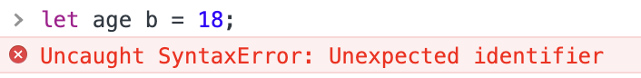
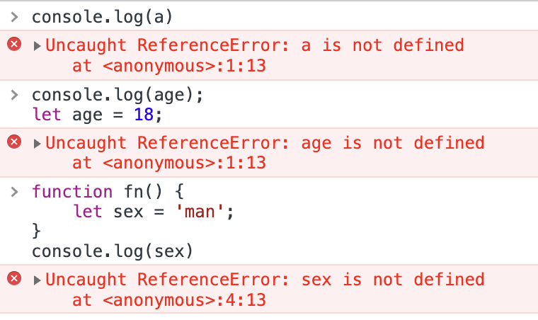
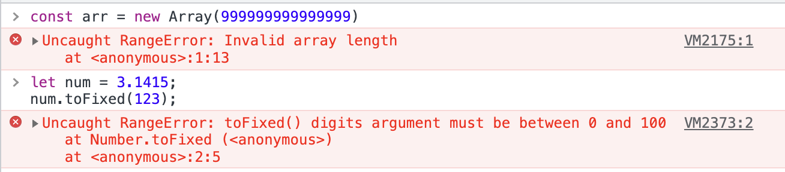

# 错误类型

在使用 JavaScript 时，我们可能会遇到各种各样的错误，那你知道 JavaScript 常见的错误类型有哪些吗？今天就来看看 JavaScript 中常见的错误类型。

## 1.  SyntaxError

SyntaxError 表示语法错误。当我们错误得使用已经预定义的语法时会抛出此错误。

## 2. TypeError

TypeError 表示类型错误。当值不是预期数据类型、调用无效方法时都会抛出此错误。

## 3. ReferenceError

ReferenceError 表示引用错误。当找不到变量的引用、在变量作用域范围之外使用变量、使用未声明的变量时、在暂时性死区期间使用变量时都会抛出此错误。

## 4. RangeError

RangeError 表示范围错误。将变量设置在其限定的范围之外、将值传递给超出范围的方法、调用一个不会终止的递归函数时就会抛出此错误。

## 5. URIError

URIError 表示 URI错误。当 URI 的编码和解码出现问题时，会抛出 URIError。JavaScript 中的 URI 操作函数包括：`decodeURI`、`decodeURIComponent` 等。如果使用了错误的参数（无效字符），就会抛出 URIError。

## 6. EvalError

EvalError 表示 Eval 错误。当 `eval()` 函数调用发生错误时，会抛出 EvalError。不过，当前的 JavaScript 引擎或 ECMAScript 规范不再抛出此错误。但是，为了向后兼容，它仍然是存在的。

## 7. InternalError

InternalError 表示内部错误。当 JavaScript 引擎上的工作负载突然激增时，会抛出此错误。当有太多数据需要处理时，工作量就会激增，比如函数调用包含过多的递归或者过多的switch case时。

\*\*注意：\*\*现代 JavaScript 中不会抛出 EvalError 和 InternalError。

> 更新: 2022-05-24 22:33:30  
> 原文: <https://www.yuque.com/cuggz/feplus/rgzf1v>