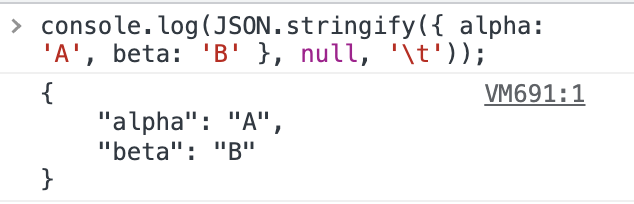

# 开发技巧

### 1. 初始化数组

如果想要初始化一个指定长度的一维数组，并指定默认值，可以这样：

```javascript
const array = Array(6).fill(''); 
// ['', '', '', '', '', '']
```

如果想要初始化一个指定长度的二维数组，并指定默认值，可以这样：

```javascript
const matrix = Array(6).fill(0).map(() => Array(5).fill(0)); 
// [[0, 0, 0, 0, 0],
//  [0, 0, 0, 0, 0],
//  [0, 0, 0, 0, 0],
//  [0, 0, 0, 0, 0],
//  [0, 0, 0, 0, 0],
//  [0, 0, 0, 0, 0]]
```

### 2. 数组求和、求最大值、最小值

```javascript
const array  = [5,4,7,8,9,2];
```

数组求和：

```javascript
array.reduce((a,b) => a+b);
```

数组最大值：

```javascript
array.reduce((a,b) => a > b ? a : b);

Math.max(...array)
```

数组最小值：

```javascript
array.reduce((a,b) => a < b ? a : b);

Math.min(...array)
```

使用数组的reduce方法可以解决很多数组的求值问题。

### 3. 过滤错误值

如果想过滤数组中的false、0、null、undefined等值，可以这样：

```javascript
const array = [1, 0, undefined, 6, 7, '', false];

array.filter(Boolean);
// [1, 6, 7]
```

### 4. 使用逻辑运算符

如果有一段这样的代码：

```javascript
if(a > 10) {
	doSomething(a)
}
```

可以使用逻辑运算符来改写：

```javascript
a > 10 && doSomething(a)
```

这样写就会简洁很多，如果逻辑与&&操作符前面的值为假，就会发生短路操作，直接结束这一句的执行；如果为真，就会继续执行&&后面的代码，并返回后面代码的返回值。使用这种方式可以减少很多if...else判断。

### 5. 判断简化

如果有下面的这样的一个判断：

```javascript
if(a === undefined || a === 10 || a=== 15 || a === null) {
	//...
}
```

就可以使用数组来简化这个判断逻辑：

```javascript
if([undefined, 10, 15, null].includes(a)) {
	//...
}
```

这样代码就会简洁很多，并且便于扩展，如果还有需要等于a的判断，直接在数组中添加即可。

### 6. 清空数组

如果想要清空一个数组，可以将数组的length置于0:

```javascript
let array = ["A", "B", "C", "D", "E", "F"]
array.length = 0 
console.log(array)  // []
```

### 7. 计算代码性能

可以使用以下操作来计算代码的性能：

```javascript
const startTime = performance.now(); 
// 某些程序
for(let i = 0; i < 1000; i++) {
	console.log(i)
}
const endTime = performance.now();
const totaltime = endTime - startTime;
console.log(totaltime); // 30.299999952316284
```

### 8. 拼接数组

如果我们想要拼接几个数组，可以使用扩展运算符：

```javascript
const start = [1, 2] 
const end = [5, 6, 7] 
const numbers = [9, ...start, ...end, 8] // [9, 1, 2, 5, 6, 7 , 8]
```

或者使用数组的concat()方法：

```javascript
const start = [1, 2, 3, 4] 
const end = [5, 6, 7] 
start.concat(end); // [1, 2, 3, 4, 5, 6, 7]
```

但是使用concat()方法时，如果需要合并的数组很大，那么concat() 函数会在创建单独的新数组时消耗大量内存。这时可以使用以下方法来实现数组的合并：

```javascript
Array.push.apply(start, end)
```

通过这种方式就能在很大程度上较少内存的使用。

### 9. 对象验证方式

如果我们有一个这样的对象：

```javascript
const parent = {
	child: {
  	child1: {
    	child2: {
      	key: 10
      }
    }
  }
}
```

很多时候我们会这样去写，避免某一层级不存在导致报错：

```javascript
parent && parent.child && parent.child.child1 && parent.child.child1.child2
```

这样代码看起来就会很臃肿，可以使用JavaScript的可选链运算符：

```javascript
parent?.child?.child1?.child2
```

这样实现和效果和上面的一大长串是一样的。

可选链运算符同样适用于数组：

```javascript
const array = [1, 2, 3];
array?.[5]
```

可选链运算符允许我们读取位于连接对象链深处的属性的值，而不必明确验证链中的每个引用是否有效。在引用为空(null 或者 undefined) 的情况下不会引起错误，该表达式短路返回值是 undefined。与函数调用一起使用时，如果给定的函数不存在，则返回 undefined。

### 10. 验证undefined和null

如果有这样一段代码：

```javascript
if(a === null || a === undefined) {
	doSomething()
}
```

也就是如果需要验证一个值如果等于null或者undefined时，需要执行一个操作时，可以使用空值合并运算符来简化上面的代码：

```javascript
a ?? doSomething()
```

这样，只有a是undefined或者null时，才会执行控制合并运算符后面的代码。空值合并操作符（??）是一个逻辑操作符，当左侧的操作数为 null 或者 undefined 时，返回其右侧操作数，否则返回左侧操作数。

### 11. 数组元素转化为数字

如果有一个数组，想要把数组中的元素转化为数字，可以使用map方法来实现：

```javascript
const array = ['12', '1', '3.1415', '-10.01'];
array.map(Number);  // [12, 1, 3.1415, -10.01]
```

通过这种方式，map会在遍历数组时，对数组的每个元素执行Number构造函数并返回结果。

### 12. 类数组转为数组

可以使用以下方法将类数组arguments转化为数组：

```javascript
Array.prototype.slice.call(arguments);
```

除此之外，还可以使用扩展运算符来实现：

```javascript
[...arguments]
```

### 13. 对象动态声明属性

如果想要给对象动态声明属性，可以这样：

```javascript
const dynamic = 'color';
var item = {
    brand: 'Ford',
    [dynamic]: 'Blue'
}
console.log(item); 
// { brand: "Ford", color: "Blue" }
```

### 14. 缩短console.log()

每次进行调试时书写很多console.log()就会比较麻烦，可以使用以下形式来简化这个代码：

```javascript
const c = console.log.bind(document) 
c(996) 
c("hello world")
```

这样每次执行c方法就行了。

### 15. 获取查询参数

如果我们想要获取URL中的参数，可以使用window对象的属性：

```javascript
window.location.search
```

如果一个URL为https://www.baidu.com?project=js\&type=1，那么通过上面操作就会获取到?project=js\&type=1。如果在想获取到其中某一个参数，可以这样：

```javascript
let type = new URLSearchParams(location.search).get('type');
```

### 16. 数字取整

如果有一个数字包含小数，我们想要去除小数，通过会使用math.floor、math.ceil或math.round方法来消除小数。其实可以使用~~运算符来消除数字的小数部分，它相对于数字的那些方法会快很多。

```javascript
~~3.1415926  // 3
```

其实这个运算符的作用有很多，通常是用来将变量转化为数字类型的，不同类型的转化结果不一样：

* 如果是数字类型的字符串，就会转化为纯数字；
* 如果字符串包含数字之外的值，就会转化为0；
* 如果是布尔类型，true会返回1，false会返回0；

除了这种方式之外，我们还可以使用按位与来实现数字的取整操作，只需要在数字后面加上`|0`即可：

```javascript
23.9 | 0   // 23
-23.9 | 0   // -23
```

这个操作也是直接去除数字后面的小数。这个方法和上面方法类似，使用起来性能都会比JavaScript的的API好很多。

### 17. 删除数组元素

如果我们想删除数组中的一个元素，我们可以使用delete来实现，但是删除完之后的元素会变为undefined，并不会消失，并且执行时会消耗大量的时间，这样多数情况下都不能满足我们的需求。所以可以使用数组的splice()方法来删除数组元素：

```javascript
const array = ["a", "b", "c", "d"] 
array.splice(0, 2) // ["a", "b"]
```

### 18. 检查对象是否为空

如果我们想要检查对象是否为空，可以使用以下方式：

```javascript
Object.keys({}).length  // 0
Object.keys({key: 1}).length  // 1
```

Object.keys()方法用于获取对象的 key，会返回一个包含这些key值的数组。如果返回的数组长度为0，那对象肯定为空了。

### 19. 使用 switch case 替换 if/else

switch case 相对于 if/else 执行性能更高，代码看起来会更加清晰。

```javascript
if (1 == month) {days = 31;}
else if (2 == month) {days = IsLeapYear(year) ? 29 : 28;}
else if (3 == month) {days = 31;}
else if (4 == month) {days = 30;} 
else if (5 == month) {days = 31;} 
else if (6 == month) {days = 30;} 
else if (7 == month) {days = 31;} 
else if (8 == month) {days = 31;} 
else if (9 == month) {days = 30;} 
else if (10 == month) {days = 31;} 
else if (11 == month) {days = 30;} 
else if (12 == month) {days = 31;} 
```

使用switch...case来改写：

```javascript
switch(month) {
		case 1: days = 31; break;
		case 2: days = IsLeapYear(year) ? 29 : 28; break;
		case 3: days = 31; break;
		case 4: days = 30; break;
		case 5: days = 31; break;
		case 6: days = 30; break;
		case 7: days = 31; break;
		case 8: days = 31; break;
		case 9: days = 30; break;
		case 10: days = 31; break;
		case 11: days = 30; break;
		case 12: days = 31; break;
		default: break;
}
```

看起来相对来说简洁了一点。可以根据情况，使用数组或对象来改写if...else。

### 20. 获取数组中的最后一项

如果想获取数组中的最后一项，很多时候会这样来写：

```javascript
const arr = [1, 2, 3, 4, 5];
arr[arr.length - 1]  // 5
```

其实我们还可以使用数组的slice方法来获取数组的最后一个元素：

```javascript
arr.slice(-1)
```

当我们将slice方法的参数设置为负值时，就会从数组后面开始截取数组值，如果我们想截取后两个值，参数传入-2即可。

### 21. 值转为布尔值

在JavaScript中，以下值都会在布尔值转化时转化为false，其他值会转化为true：

* <font style="color:rgb(77, 77, 77);">undefined</font>
* <font style="color:rgb(77, 77, 77);">null  </font>
* <font style="color:rgb(77, 77, 77);">0  </font>
* <font style="color:rgb(77, 77, 77);">-0 </font>
* <font style="color:rgb(77, 77, 77);">NaN  </font>
* <font style="color:rgb(77, 77, 77);">""</font>

<font style="color:rgb(77, 77, 77);"></font>

通常我们如果想显式的值转化为布尔值，会使用Boolean()方法进行转化。其实我们可以使用!!运算符来将一个值转化我布尔值。我们知道，一个！是将对象转为布尔型并取反，两个！是将取反后的布尔值再取反，相当于直接将非布尔类型值转为布尔类型值。这种操作相对于Boolean()方法性能会快很多，因为它是计算机的原生操作：

```javascript
!!undefined // false
!!"996"     // true
!!null      // false
!!NaN       // false
```

### 22. <font style="color:rgb(17, 24, 39);">格式化 JSON 代码</font>

相信大家都使用过JSON.stringify方法，该方法可以将一个 JavaScript 对象或值转换为 JSON 字符串。他的语法如下：

```javascript
JSON.stringify(value, replacer, space)
```

它有三个参数:

* **value**：将要序列化成 一个 JSON 字符串的值。
* **replacer** 可选：如果该参数是一个函数，则在序列化过程中，被序列化的值的每个属性都会经过该函数的转换和处理；如果该参数是一个数组，则只有包含在这个数组中的属性名才会被序列化到最终的 JSON 字符串中；如果该参数为 null 或者未提供，则对象所有的属性都会被序列化。
* **space** 可选：指定缩进用的空白字符串，用于美化输出（pretty-print）；如果参数是个数字，它代表有多少的空格；上限为10。该值若小于1，则意味着没有空格；如果该参数为字符串（当字符串长度超过10个字母，取其前10个字母），该字符串将被作为空格；如果该参数没有提供（或者为 null），将没有空格。

通常情况下，我们都写一个参数来将一个 JavaScript 对象或值转换为 JSON 字符串。可以看到它还有两个可选的参数，所以我们可以用这俩参数来格式化JSON代码：

```javascript
console.log(JSON.stringify({ alpha: 'A', beta: 'B' }, null, '\t'));
```

输出结果如下：



### 23. 避免使用eval()和with()

* with() 会在全局范围内插入一个变量。因此，如果另一个变量具有相同的名称，则可能会导致混淆并覆盖该值。
* eval() 是比较昂贵的操作，每次调用它时，脚本引擎都必须将源代码转换为可执行代码。

### 24. 函数参数使用对象而不是参数列表

当我们使用参数列表给函数传递参数时，如果参数较少还好，如果参数较多时，就会比较麻烦，因为我们必须按照参数列表的顺序来传递参数。如果使用TypeScript来写，那么写的时候还需要让可选参数排在必选参数的后面。

如果我们的函数参数较多，就可以考虑使用对象的形式来传递参数，对象的形式传递参数时，传递可选参数并不需要放在最后，并且参数的顺序不在重要。与参数列表相比，通过对象传递的内容也更容易阅读和理解。

下面来看一个例子：

```javascript
function getItem(price, quantity, name, description) {}

getItem(15, undefined, 'bananas', 'fruit')
```

下面来使用对象传参：

```javascript
function getItem(args) {
    const {price, quantity, name, description} = args
}

getItem({
    name: 'bananas',
    price: 10,
    quantity: 1, 
    description: 'fruit'
})
```

### 25. Promise.all()、Promise.allSettled()

我们可以使用 Promise、async/await 来处理异步请求。当并发处理异步请求时，可以使用 `Promise.all()` 和 `Promise.allSettled()` 来实现。

#### Promise.all()

`Promise.all()` 静态方法接受一个 Promise 可迭代对象作为输入，并返回一个 Promise。当所有输入的 Promise 都被兑现时，返回的 Promise 也将被兑现（即使传入的是一个空的可迭代对象），并返回一个包含所有兑现值的数组。如果输入的任何 Promise 被拒绝，则返回的 Promise 将被拒绝，并带有第一个被拒绝的原因。

```javascript
const promise1 = Promise.resolve(555);
const promise2 = new Promise(resolve => setTimeout(resolve, 100, 'foo'));
const promise3 = 23;

const allPromises = [promise1, promise2, promise3];
Promise.all(allPromises).then(values => console.log(values));

// 输出结果: [ 555, 'foo', 23 ]
```

可以看到，当所有三个 Promise 都被解析时，`Promise.all()` 会被解析并且值会被打印出来。但是，如果有一个或多个 Promise 没有被解析而被拒绝了怎么办呢？

```javascript
const promise1 = Promise.resolve(555);
const promise2 = new Promise(resolve => setTimeout(resolve, 100, 'foo'));
const promise3 = Promise.reject('rejected!');

const allPromises = [promise1, promise2, promise3];

Promise.all(allPromises)
  .then(values => console.log(values))
  .catch(err => console.error(err));

// 输出结果: rejected!
```

如果其中至少一个元素被拒绝，`Promise.all()` 就会被拒绝。 在上面的例子中，如果传递了两个解析的 Promise 和一个立即被拒绝的 Promise，那么 `Promise.all()` 会立即被拒绝。

#### Promise.allSettled()

Promise.allSettled() 方法是在 ES2020 中引入的。它以一个包含多个 Promise 的可迭代对象作为输入参数，与 `Promise.all()` 不同的是，它返回一个 Promise，在所有给定的 Promise 被解析或拒绝后始终会被解析。这个 Promise 会以一个描述每个 Promise 结果的对象数组来进行解析。

对于每个 Promise 的结果，会得到以下两种可能的状态：

1. `fulfilled`：包含结果的值。
2. `rejected`：包含拒绝的原因。

```javascript
const promise1 = Promise.resolve(555);
const promise2 = new Promise(resolve => setTimeout(resolve, 100, 'foo'));
const promise3 = Promise.reject('rejected!');

const allPromises = [promise1, promise2, promise3];

Promise.allSettled(allPromises)
  .then(values => console.log(values))

// 输出结果:
// [
//   { status: 'fulfilled', value: 555 },
//   { status: 'fulfilled', value: 'foo' },
//   { status: 'rejected', reason: 'rejected!' }
// ]
```

**那该如何选择两个方法呢？**

如你希望"快速失败"，那么应该选择 `Promise.all()`。 考虑这样一个场景：需要所有的请求都成功，然后基于这个成功来定义一些逻辑。在这种情况下，快速失败是可以接受的，因为在一个请求失败后，其他的请求的结果就无关紧要了，不希望浪费资源在剩余的请求上。

在其他情况下，希望所有的请求要么被拒绝要么被解析。如果获取的数据用于后续的任务，或者希望显示和访问每个请求的错误信息，那么 `Promise.allSettled()` 就是正确的选择。

### 26. 空值合并运算符：??

空值合并运算符在左操作数为`null`或`undefined`时返回右操作数，否则返回左操作数。它是一种获取两个变量中第一个“定义”的值的简洁语法。

比如，x ?? y 的结果是：

* 如果 x 不是`null`或`undefined`，则返回 x。
* 如果 x 是`null`或`undefined`，则返回 y。

所以，`x ?? y` 可以写作：

```javascript
result = (x !== null && x !== undefined) ? x : y;
```

`??` 的常见用法是提供一个默认值。 例如，下面的例子中，当 `name` 的值不是 `null/undefined` 时，就显示它的值，否则显示 "Unknown"：

```javascript
const name = someValue ?? "Unknown";
console.log(name);
```

如果 `someValue` 不是 `null` 或 `undefined`，那么 `name` 的值将为 `someValue`；如果 `someValue` 是 `null` 或 `undefined`，那么 `name` 的值将为 "Unknown"。

#### `??` vs `||`

逻辑与运算符（||）可以与空值合并运算符（?? ）以相同的方式使用。 可以用 `||` 替换 `??`，仍然能得到相同的结果，例如：

```javascript
let name;
console.log(name ?? "Unknown"); // 输出结果: Unknown
console.log(name || "Unknown"); // 输出结果: Unknown
```

它们之间的**区别**在于：`||` 返回第一个真值。 `??` 返回第一个已定义的值（已定义 = 非 null 或 undefined）。也就是说，|| 运算符不区分 false、0、"" 和 null/undefined，它们都是假值。如果其中任何一个是 || 的第一个参数，那么结果将是第二个参数。例如：

```javascript
let grade = 0;
console.log(grade || 100); // 输出结果: 100
console.log(grade ?? 100); // 输出结果: 0
```

`grade || 100` 检查 `grade` 是否是一个假值，而它的值是 0，确实是一个假值。所以 || 的结果是第二个参数，即 100。而 `grade ?? 100` 检查 grade 是否为 `null` 或 `undefined`，但它并不是，所以 `grade` 的结果为 0。

**那该如何选择两个方法呢？**

* 空值合并运算符 (??) 的使用场景：
  1. 为变量提供默认值：当一个变量可能是 null 或 undefined 时，可以使用空值合并运算符为其提供默认值。 例如：`const name = inputName ?? "Unknown";`
  2. 处理可能缺失的属性：当访问对象属性时，如果该属性可能存在但值为 null 或 undefined，可以使用空值合并运算符提供默认值。 例如：`const address = user.address ?? "Unknown";`
  3. 避免出现假值的情况：当我们只想处理显式定义的值，并避免处理假值（如 false、0、空字符串等）时，可以使用空值合并运算符。 例如：`const value = userInputValue ?? 0;`
* 逻辑或运算符 (||) 的使用场景：
  1. 提供备选值：当我们需要从多个选项中选择一个有效的值时，可以使用逻辑或运算符。 例如：`const result = value1 || value2 || value3;`
  2. 判断条件：当我们需要检查多个条件中的任一条件是否为真时，可以使用逻辑或运算符。 例如：`if (condition1 || condition2) { // 执行操作 }`

### 27. this

"this" 是 JavaScript 中一个常被误解的概念。要在 JavaScript 中正确使用 "this"，你需要真正理解它的工作方式，因为它与其他编程语言有一些不同之处。

下面是一个常见的在使用 "this" 时出现错误的示例：

```javascript
const obj = {
  helloWorld: "Hello World!",
  printHelloWorld: function () {
    console.log(this.helloWorld);
  },
  printHelloWorldAfter1Sec: function () {
    setTimeout(function () {
      console.log(this.helloWorld);
    }, 1000);
  },
};

obj.printHelloWorld();
// 输出结果: Hello World!

obj.printHelloWorldAfter1Sec();
// 输出结果: undefined
```

第一个结果打印出了 "Hello World!"，因为 `this.helloWorld` 正确地指向了对象的 `name` 属性。而第二个结果是 `undefined`，因为 this 已经失去了对对象属性的引用。这是因为 this 的指向取决于调用它所在函数的对象。每个函数中都有一个 this 变量，但它指向的对象由调用它的对象确定。

在`obj.printHelloWorld()` 中，this 直接指向了 `obj`。 在 `obj.printHelloWorldAfter1Sec()` 中，`this` 直接指向了 `obj`。 但是，在 `setTimeout` 的回调函数中，`this` 没有指向任何对象，因为没有对象调用它。默认对象（通常是 `window`）被使用。`name` 在 `window` 上并不存在，所以返回了 `undefined`。

要正确使用 this，需要了解函数调用时它所绑定的对象。如果想在回调函数中访问对象属性，可以使用箭头函数或者显式地通过 `bind()` 方法绑定正确的 this 值，以避免出现错误。

**如何修复这个问题？**

要保持 setTimeout 中的 this 引用，最好的方法是使用箭头函数。与普通函数不同，箭头函数不会创建自己的 this。

因此，下面的代码将保持对 this 的引用：

```javascript
const obj = {
  helloWorld: "Hello World!",
  printHelloWorld: function () {
    console.log(this.helloWorld);
  },
  printHelloWorldAfter1Sec: function () {
    setTimeout(() => {
      console.log(this.helloWorld);
    }, 1000);
  },
};

obj.printHelloWorld();
// 输出结果: Hello World!

obj.printHelloWorldAfter1Sec();
// 输出结果: Hello World!
```

除了使用箭头函数，还可以使用其他方法来解决这个问题。

* 使用 `bind()` 方法：`bind()` 方法创建一个新的函数，并指定其 this 值后返回。可以使用它将函数绑定到特定的对象上，确保 this 始终引用该对象。
* 使用 `call()` 和 `apply()` 方法：这两个方法允许指定一个特定的 `this` 值来调用函数。它们之间的区别在于，`call()` 方法接受一组值作为参数，而 `apply()` 方法接受一个数组作为参数。
* 使用 `self` 变量：这是在引入箭头函数之前常用的一种方法。思路是将 `this` 的引用存储在一个变量中，并在函数内部使用该变量。需要注意的是，这种方法在嵌套函数中可能效果不佳。

总的来说，每种方法都有其优缺点，选择使用哪种方法取决于具体的使用场景。对于大多数情况，默认推荐使用箭头函数。

### 28. 内存使用

有时应用的内存使用会很糟糕，来看下面的例子：

```javascript
const data = [
  { name: 'Frogi', type: Type.Frog },
  { name: 'Mark', type: Type.Human },
  { name: 'John', type: Type.Human },
  { name: 'Rexi', type: Type.Dog }
];
```

我们想要为每个实体添加一些属性，具体取决于它的类型：

```javascript
const mappedArr = data.map((entity) => {
  return {
    ...entity,
    walkingOnTwoLegs: entity.type === Type.Human
  }
});
// ...
const tooManyTimesMappedArr = mappedArr.map((entity) => {
  return {
    ...entity,
    greeting: entity.type === Type.Human ? 'hello' : 'none'
  }
});

console.log(tooManyTimesMappedArr);
// 输出结果:
// [
//   { name: 'Frogi', type: 'frog', walkingOnTwoLegs: false, greeting: 'none' },
//   { name: 'Mark', type: 'human', walkingOnTwoLegs: true, greeting: 'hello' },
//   { name: 'John', type: 'human', walkingOnTwoLegs: true, greeting: 'hello' },
//   { name: 'Rexi', type: 'dog', walkingOnTwoLegs: false, greeting: 'none' }
// ]
```

可以看到，通过使用 map，可以进行简单的转换并多次使用它。对于一个小数组来说，内存消耗是微不足道的，但对于较大的数组来说，肯定会发现内存的显著影响。

那么，在这种情况下有哪些更好的解决方案呢？

首先，需要理解当处理大数组时，会超出空间复杂度。然后，思考如何减少内存消耗。在这个例子中，有几个不错的选择：

1. 链式使用 map 来避免多次克隆：

```javascript
const mappedArr = data
  .map((entity) => {
    return {
      ...entity,
      walkingOnTwoLegs: entity.type === Type.Human
    }
  })
  .map((entity) => {
    return {
      ...entity,
      greeting: entity.type === Type.Human ? 'hello' : 'none'
    }
  });

console.log(mappedArr);
// 输出结果:
// [
//   { name: 'Frogi', type: 'frog', walkingOnTwoLegs: false, greeting: 'none' },
//   { name: 'Mark', type: 'human', walkingOnTwoLegs: true, greeting: 'hello' },
//   { name: 'John', type: 'human', walkingOnTwoLegs: true, greeting: 'hello' },
//   { name: 'Rexi', type: 'dog', walkingOnTwoLegs: false, greeting: 'none' }
// ]
```

2. 更好的方法是减少 map 和克隆操作的数量：

```javascript
const mappedArr = data.map((entity) => 
  entity.type === Type.Human ? {
    ...entity,
    walkingOnTwoLegs: true,
    greeting: 'hello'
  } : {
    ...entity,
    walkingOnTwoLegs: false,
    greeting: 'none'
  }
);

console.log(mappedArr);
// 输出结果:
// [
//   { name: 'Frogi', type: 'frog', walkingOnTwoLegs: false, greeting: 'none' },
//   { name: 'Mark', type: 'human', walkingOnTwoLegs: true, greeting: 'hello' },
//   { name: 'John', type: 'human', walkingOnTwoLegs: true, greeting: 'hello' },
//   { name: 'Rexi', type: 'dog', walkingOnTwoLegs: false, greeting: 'none' }
// ]
```

### 29. 使用 Map 或 Object 代替 switch-case

来看下面的例子：

```javascript
function findCities(country) {
  switch (country) {
    case 'Russia':
      return ['Moscow', 'Saint Petersburg'];
    case 'Mexico':
      return ['Cancun', 'Mexico City'];
    case 'Germany':
      return ['Munich', 'Berlin'];
    default:
      return [];
  }
}

console.log(findCities(null));      // 输出结果: []
console.log(findCities('Germany')); // 输出结果: ['Munich', 'Berlin']
```

上面的代码似乎没有问题，不过可以使用对象字面量以更清晰的语法来实现相同的结果：

```javascript
const citiesCountry = {
  Russia: ['Moscow', 'Saint Petersburg'],
  Mexico: ['Cancun', 'Mexico City'],
  Germany: ['Munich', 'Berlin']
};

function findCities(country) {
  return citiesCountry[country] ?? [];
}

console.log(findCities(null));      // 输出结果: []
console.log(findCities('Germany')); // 输出结果: ['Munich', 'Berlin']
```

Map 是 ES6 中引入的一种对象类型，它允许存储键值对，也可以使用 Map 来实现相同的结果：

```javascript
const citiesCountry = new Map()
  .set('Russia', ['Moscow', 'Saint Petersburg'])
  .set('Mexico', ['Cancun', 'Mexico City'])
  .set('Germany', ['Munich', 'Berlin']);

function findCities(country) {
  return citiesCountry.get(country) ?? [];
}

console.log(findCities(null));      // 输出结果: []
console.log(findCities('Germany')); // 输出结果: ['Munich', 'Berlin']
```

那我们是否应该停止使用 switch 语句？不是的。在可能的情况下使用对象字面量或 Map 可以提高代码水平，使其更加优雅。

Map 和对象字面量之间的主要区别如下：

* **键**： 在 Map 中，键可以是任何数据类型（包括对象和原始值）。而在对象字面量中，键必须是字符串或符号。
* **迭代**： 在 Map 中，可以使用 `for...of` 循环或 `forEach()` 方法迭代。在对象字面量中，需要使用 `Object.keys()`、`Object.values()` 或 `Object.entries()` 来迭代。
* **性能**： 一般来说，在处理大型数据集或频繁添加/删除时，Map 的性能优于对象字面量。对于小型数据集或不经常操作的情况下，性能差异可以忽略不计。 选择使用哪种数据结构取决于具体的用例。


> 更新: 2023-09-22 00:18:44  
> 原文: <https://www.yuque.com/cuggz/feplus/hmasy7>