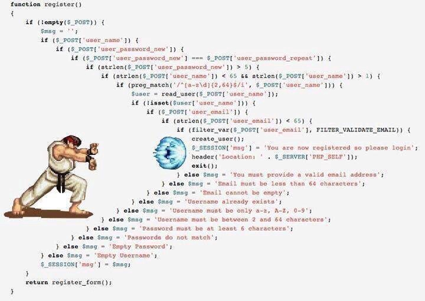

# 条件语句

在日常的开发中，我们经常会编写一些条件语句，过多的 `if...else`会导致代码难以理解和维护，今天来分享几个优化条件语句的小技巧！



## 1. **Array.includes**

来看下面的代码：

```javascript
function test(animal) {
  if (animal == 'lion' || animal == 'dog') {
    return animal;
  }
  return '';
}

test('dog');
```

在`test`方法中包含一个 `if` 语句，用来判断传入的参数`animal`是不是`lion`或者`dog`。这么写从语法上是没问题的，但是如果 `if` 的判断条件中不只有两个动物，而是有四只动物。如果继续使用 `||` 与运算符来写的话，代码就会很难维护并且看起来非常不优雅：

```javascript
if (animal == 'lion' || animal == 'dog' || animal == 'cow' || animal == 'cat') {
    return animal;
}
```

对于这种需要对同一个变量进行多次判断的条件语句，可以使用数组的`includes()`方法来优化，该方法可以用于确定数组中是否存在指定元素，如果存在指定的元素，就会返回 `true`，如果不存在就会返回 `false`。使用 `includes()` 来修改写上面的代码：

```javascript
if (['dog', 'cat', 'cow', 'lion'].includes(animal)) {
    return animal;
}
```

这样代码看起来就简洁了很多，并且如果想继续增加其他的动物，只需在数组中继续增加元素即可。

## 2. **Array.every**

来看下面的代码：

```javascript
const cars = [
    { name: 'car1', color: 'red' },
    { name: 'car2', color: 'blue' },
    { name: 'car3', color: 'purple' }
];
  
function test(cars) {
    let isAllblue = true;
  
    for (let c of cars) {
        if (!isAllblue) break;
        isAllblue = (c.color == 'blue');
    }
  
    return isAllblue;
}

test(cars);
```

JavaScript 中的数组提供了`every()`方法，该方法用于检查数组中所有元素是否满足给定条件。当每个数组元素都满足给定条件时会返回 `true`，否则会返回`false`。可以使用该方法来优化上面的代码：

```javascript
const cars = [
    { name: 'car1', color: 'red' },
    { name: 'car2', color: 'blue' },
    { name: 'car3', color: 'purple' }
];
  
function test(cars) {
   return cars.every(c => c.color == 'blue');
}

test(cars);
```

## 3. 尽早 return

在 JavaScript 中，尽早 `return` 是一种将函数体减少`else`语句的简单方法。来看下面的代码：

```typescript
function test(fruit, quantity) {
  const redFruits = ['apple', 'strawberry', 'cherry', 'cranberries'];

  if (fruit) {
    if (redFruits.includes(fruit)) {
      console.log('red');

      if (quantity > 10) {
        console.log('big quantity');
      }
    }
  } else {
    throw new Error('No fruit!');
  }
}

test(null); // error: No fruits
test('apple'); // red
test('apple', 20); // red, big quantity
```

来使用这种模式来优化上面的代码，可以在<font style="color:rgb(77, 91, 124);">无效条件时尽早返回</font>：

```typescript
function test(fruit, quantity) {
  const redFruits = ['apple', 'strawberry', 'cherry', 'cranberries'];

  if (!fruit) throw new Error('No fruit!');

  if (redFruits.includes(fruit)) {
    console.log('red');

    if (quantity > 10) {
      console.log('big quantity');
    }
  }
}
```

可以进一步优化，如果 `redFruits` 中不包含`fruit`，就提前返回：

```javascript
function test(fruit, quantity) {
  const redFruits = ['apple', 'strawberry', 'cherry', 'cranberries'];

  if (!fruit) throw new Error('No fruit!');
  if (!redFruits.includes(fruit)) return;

  console.log('red');

  if (quantity > 10) {
    console.log('big quantity');
  }
}
```

可以看到，使用这种模式可以消除不必要的`else`语句，使得函数更加清晰和简洁。

## 4. 三元运算符

对于上面例子中的函数，可以使用 JavaScript 的三元运算符来重构：

```typescript
function IsRed(someObject) {
    return typeof someObject !== 'object' || someObject.color !== 'Red' ? false : true;
}
```

对于上面的三元表达式，还可以进行简化：

```typescript
function IsRed(someObject) {
    return !(typeof someObject !== 'object' || someObject.color !== 'Red');
}
```

对于这种`if...else`块中都分别只有一个表达式的情况，就可以使用三元表达式来简化`if...else`语句。

## 5. switch...case

来看下面的代码：

```typescript
function printCars(color) {
    if (color === 'red') {
      return ['Rcar1', 'Rcar2'];
    }
    else if (color === 'blue') {
      return ['Bcar1', 'Bcar2'];
    }
    else if (color === 'purple') {
      return ['Pcar1', 'Pcar2'];
    }
    return [];
}
```

对于这种`if`的判断条件中都是针对一个变量进行判断的情况，可以使用`switch...case`来简化：

```typescript
function printCars(color) {
    switch (color) {
        case 'red':
            return ['Rcar1', 'Rcar2'];
        case 'blue':
            return ['Bcar1', 'Bcar2'];
        case 'purple':
            return ['Pcar1', 'Pcar2'];
        default:
            return [];
    }
}
```

## 6. Map/Object

对于上面的代码，可以使用对象来继续优化：

```typescript
const carColor = {
    red: ['Rcar1', 'Rcar2'],
    blue: ['Bcar1', 'Bcar2'],
    purple: ['Pcar1', 'Pcar2']
};
  
function printcars(color) {
    return carColor[color] || [];
}

console.log(printcars());       // []
console.log(printcars('red'));  // ['Rcar1'，'Rcar2']
console.log(printcars('blue')); // ['Bcar1'，'Bcar2']
```

也可以使用 Map 来实现相同的结果：

```javascript
const carColor = new Map()
    .set('red', ['Rcar1', 'Rcar2'])
    .set('blue', ['Bcar1', 'Bcar2'])
    .set('purple', ['Pcar1', 'Pcar2']);
  
function printcars(color) {
    return carColor.get(color) || [];
}

console.log(printcars());       // []
console.log(printcars('red'));  // ['Rcar1'，'Rcar2']
console.log(printcars('blue')); // ['Bcar1'，'Bcar2']
```

## 7. **默认函数参数和解构**

来看下面的代码：

```javascript
function check(flower, quantity) {
    if (!flower) return;
  
    const num = quantity || 1;
  
    return `${num}朵${flower}`;
}
  
check('玫瑰');    // 1朵玫瑰
check('茉莉', 2); // 2朵茉莉
```

可以使用函数默认参数来简化上面的代码：

```javascript
function check(flower, quantity = 1) {
    if (!flower) return;
    return `${quantity}朵${flower}`;
}

check('玫瑰');    // 1朵玫瑰
check('茉莉', 2); // 2朵茉莉
```

那如果`flower`参数是一个对象怎么办呢？来看下面的代码：

```javascript
function check(flower) {
    if (flower && flower.name) {
        console.log(flower.name);
    } else {
        console.log('unknown');
    }
}

check(undefined);  // unknown
check({});  // unknown
check({ name: '玫瑰', color: 'red' });  // 玫瑰
```

可以从对象中解构需要的属性：

```javascript
function check({name} = {}) {
    console.log (name || 'unknown');
}
  
check(undefined);  // unknown
check({});  // unknown
check({ name: '玫瑰', color: 'red' });  // 玫瑰
```

在函数中需要`flower`对象中的`name`属性，可以使用`{name}`来解构该参数。除此之外，还是用`{}`来作为参数的默认值，这样在`check(undefined)`时，也就是参数不是对象时，参数默认为一个空对象，否则就会报错，因为`undefined`中没有`name`属性。

## 8. 逻辑与运算符

来看下面的代码：

```javascript
if(a < 0 && b > 100 && c === 10) {
  fn()
}
```

对于逻辑与运算符，其左侧的条件如果为`false`，就会直接发生短路，不再继续往后执行；如果左侧的条件为`true`，就会返回其右侧的计算结果。所以，对于这种 `if` 中只有一行表达式的情况，可以使用逻辑与运算符来简化，其中左侧为判断条件，右侧是要执行的逻辑：

```javascript
(a < 0 && b > 100 && c === 10) && fn();
```

**参考：**

> 1. <https://www.digitalocean.com/community/posts/5-tips-to-write-better-conditionals-in-javascript>
> 2. <https://www.geeksforgeeks.org/tips-for-writing-better-conditionals-in-javascript/>


> 更新: 2022-08-09 17:24:57  
> 原文: <https://www.yuque.com/cuggz/feplus/gi28zf>