# 调试技巧

作为前端开发，我们会经常使用 console.log() 来调试程序中的问题。虽然这种方式也能解决一部分问题，但是它的效率不如能执行逐步调试的工具。本文就来学习一下如何使用 Google Chrome developer tools 轻松调试 JavaScript 代码。


多数浏览器都提供了DevTools 供我们调试 JavaScript 应用程序，并且它们的使用方式类似，只要我们学会了如何在一个浏览器上使用调试工具，就很容易在其他浏览器上使用它。


以下就以 Greet Me 程序为例，这个程序非常简单，只需输入名字和愿望，最后就会输出一句话：

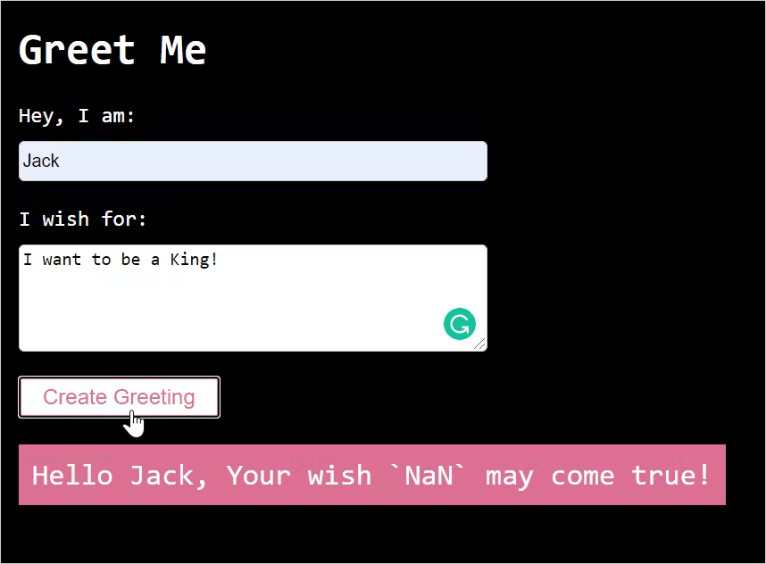

当输入两个表单值之后，“愿望”部分没有正确打印，而是打印出了NaN。代码在线调试：[https://greet-me-debugging.vercel.app/](https://greet-me-debugging.vercel.app/)。接下来，就看看 Chrome DevTools 有什么功能可以调试定位代码的问题。

## 一、了解 Sources 面板
DevTools 提供了许多不同的工具供我们进行调试，包括 DOM 检查、分析和网络调用检查等。这里要说的是 Sources 面板，它可以帮助我们调试 JavaScript。可以使用快捷键 F12 打开控制面板，并单击 Sources 选项卡以导航到 Sources 面板，也可以直接使用快捷键 Command+Option+I（Mac）或 Control+Shift+I（Windows、Linux）来打开。

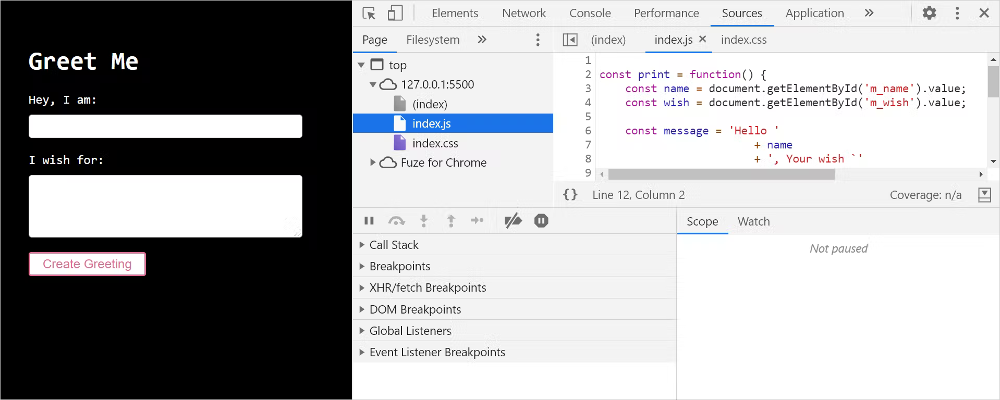

Sources 面板主要由三个部分组成：

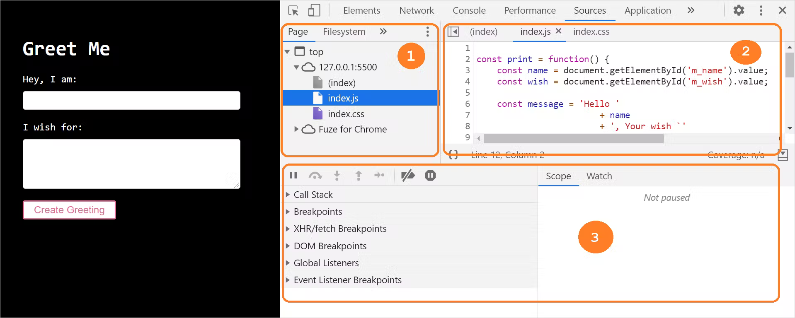

1. 文件导航区：页面请求的所有文件都会在此列出；
2. 代码编辑区：当我们从文件导航栏中选取一个文件时，该文件的内容就会在此列出，我们可以在这里编辑代码；
3. Debugger区：这里会有很多工具可以用来设置断点，检查变量值、观察执行步骤等。


如果 DevTools 窗口较宽或未在单独的窗口中打开，则调试器部分将显示在代码编辑器的右侧：

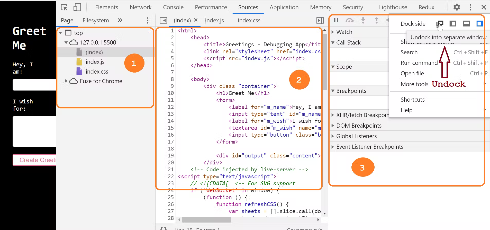

## 二、设置断点
要开始调试代码，首先要做的就是设置断点，断点就是代码执行暂停以便调试它的逻辑点。


DevTools 允许我们以不同的方式来设置断点：

+ 在代码行；
+ 在条件语句中；
+ 在 DOM 节点处；
+ 在事件侦听器上。

### 1. 在代码行设置断点
设置代码行断点的步骤：

+ 单击切换到 Sources 选项卡；
+ 从文件导航部分选中需要调试的源文件；
+ 在右侧代码编辑器区域找到需要调试的代码行；
+ 单击行号以在行上设置断点。

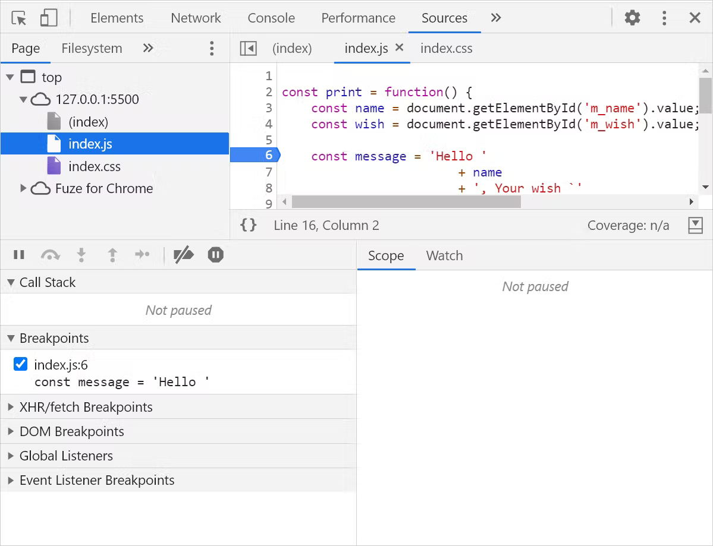

这里就在代码的第6行设置了一个断点，代码在执行到这里时就会暂停。

### 2. 设置条件断点
设置条件断点的步骤：

+ 单击切换到 Sources 选项卡；
+ 从文件导航部分选中需要调试的源文件；
+ 在右侧代码编辑器区域找到需要调试的代码行；
+ 右键单击行号并选择"Add conditional breakpoint"来添加条件断点：

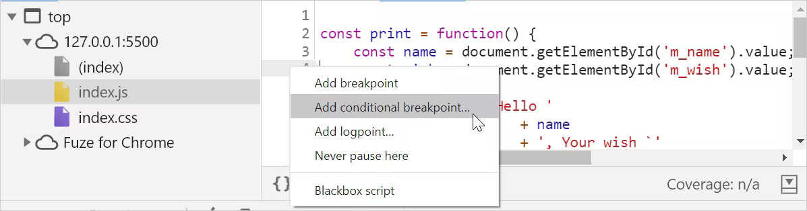

点击之后代码行下方就会出现一个对话框，输入断点的条件即可：

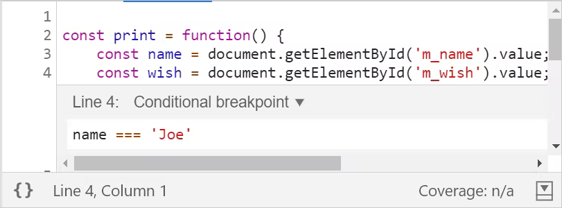

按回车键（Enter）即可激活断点，这时就会在打断点行的顶部出现一个橙色的图标：

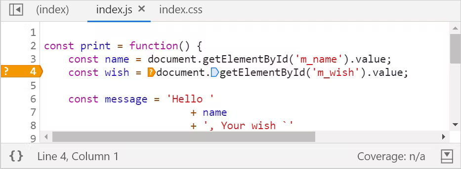

当print()方法中的name变量值为Joe时，代码的执行就会暂停。需要注意，只有我们确定调试的代码的大致范围时，才会使用条件断点。

### 3. 在事件监听器上设置断点
在事件监听器上设置断点的步骤：

+ 单击切换到 Sources 选项卡；
+ 在debugger区域展开Event Listener Breakpoints选项；
+ 从事件列表中选择事件监听器来设置断点。我们的程序中有一个按钮单击事件，这里就选择 Mouse 事件选项中的click。

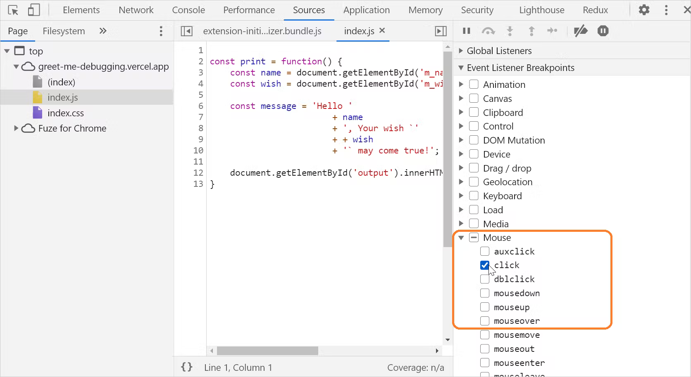

提示：当我们想暂停在事件触发后运行的事件侦听器代码时可以使用此选项。

### 4. 在 DOM 节点中设置断点
DevTools 在 DOM 检查和调试方面同样很强大。当在 DOM 中添加、删除或者修改某些内容时，可以设置断点来暂停代码的执行。


在 DOM 上设置断点的步骤：

+ 单击切换到 <font style="background-color:rgb(240, 239, 237);">Elements </font>选项卡；
+ 找到要设置断点的元素；
+ 右键单击元素以获得上下文菜单，选择Break on选项，然后选择Subtree modifications、Attribute modifications、Node removal中的一个即可：

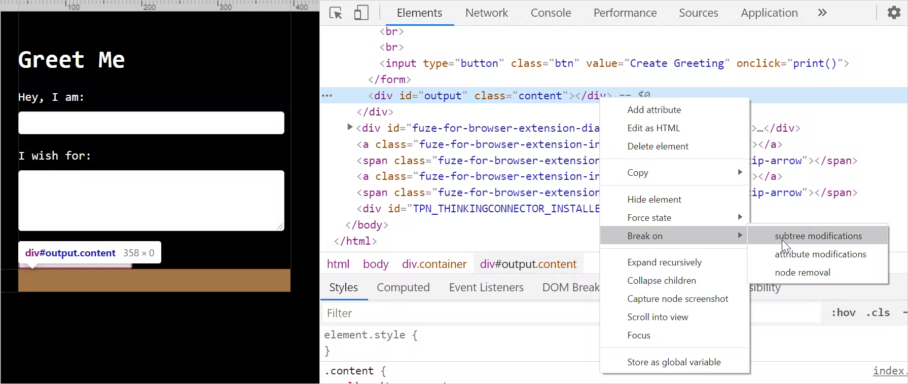

这三个选项的含义如下：

+ Subtree modifications：当节点内部子节点变化时断点；
+ Attribute modifications：当节点属性发生变化时断点；
+ Node removal：当节点被移除时断点。


如上图，我们在输出消息的 div 的 DOM 发生变化时设置了一个断点。当点击按钮后，问候消息输出到 div 中，子节点的内容发生了变化，就会发生中断。


**注意：**当我们怀疑是DOM更改导致了错误时，就可以使用该选项，当 DOM 更改中断时，相关的 JavaScript 代码执行将自动暂停。

## 三、逐步调试
现在我们知道了设置断点的方式。在复杂的调试情况下，我们可能需要使用这些调试的组合。调试器提供了五个控件来逐步执行代码：


下面就分别来看看这些控制都是如何使用的。

### 1. 下一步（快捷键：F9）
此选项使我们能够在JavaScript代码执行时逐行执行，如果中途有函数调用，单步执行也会进入函数内部，逐行执行，然后退出。

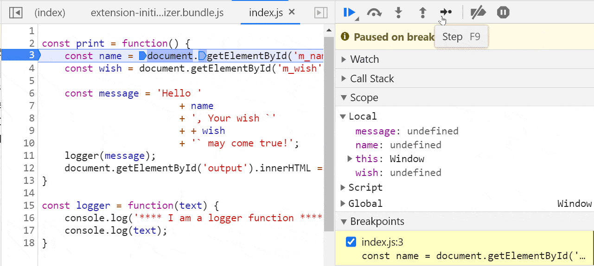

### 2. 跳过（快捷键：F10）
此选项允许我们在执行代码时跳过一些代码。有时我们可能已经确定某些功能是正常的，不想花时间去检查它们，就可以使用跳过选项。


下面就是单步执行logger()函数时，会跳过函数的执行：

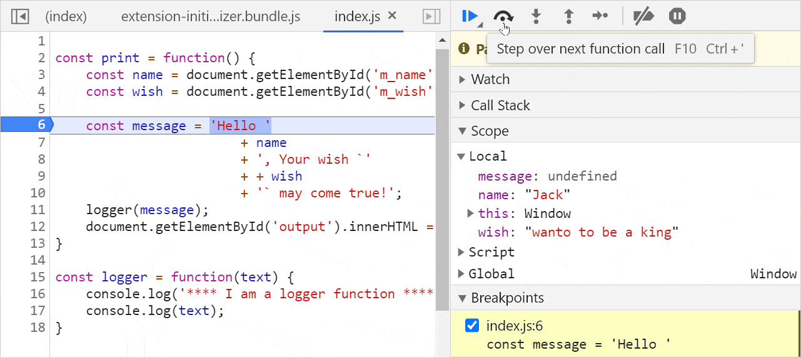

### 3. 进入（快捷键：F11）
使用该选项可以更深入的了解函数。单步执行函数时，当感觉某个函数的行为异常并想检查它时，就可以使用这个选项来进入函数内部并进行调试。


下面就是单步执行 logger() 函数:


### 4. 跳出（快捷键：Shift+F11）
在单步执行一个函数时，我们可能不想再继续执行并退出它，就可以使用这些选项退出函数。


下面就是进入了 logger() 函数内部，然后立即退出：

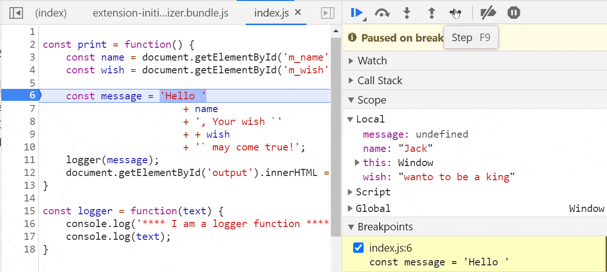

### 5. 跳转（快捷键：F8）
有时，我们希望从一个断点跳转到另一个断点，而无需在它们之间进行任何调试，就可以使用这个选项来跳转到下一个断点：

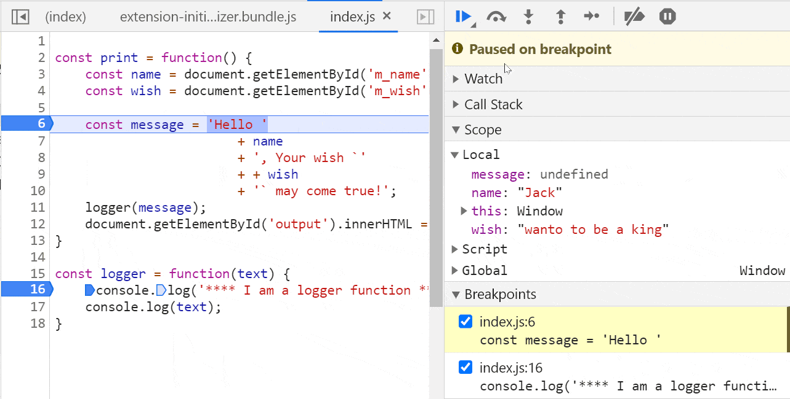

## 四、检查范围、调用堆栈和值
当进行逐行调试时，检查变量的范围和值以及函数调用的调用堆栈。在Debugger区可以这三个选项：

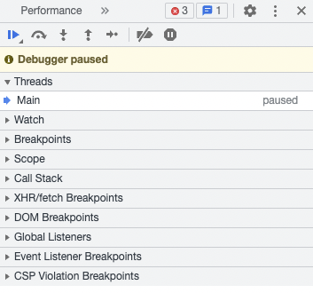

### 1. 范围（Scope）
可以在 Scope 选项中查看局部范围和全局范围内的内容以及变量，还可以看到 this 的实时指向：

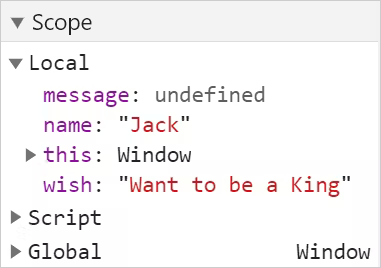

### 2. 调用堆栈
调用堆栈面板有助于识别函数执行堆栈：

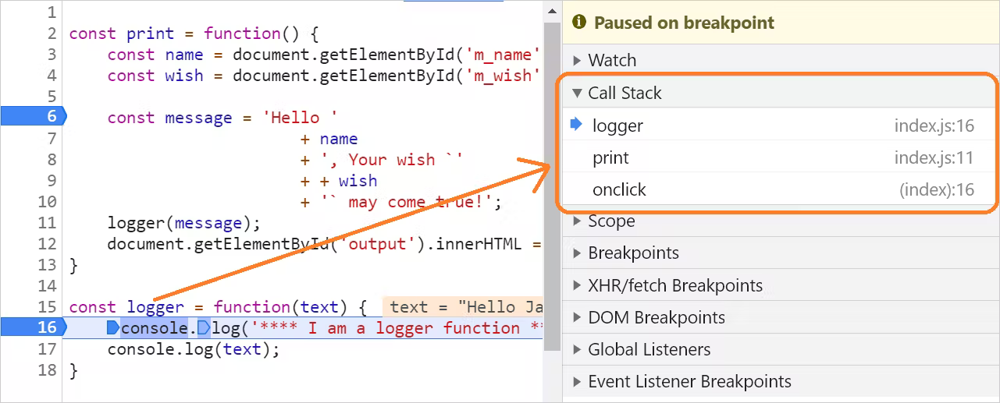

### 3. 值
检查代码中的值是识别代码中错误的主要方法。在单步执行时，我们只需要将鼠标悬停在变量上即可检查值。


下面可以看到变量 name 在代码执行时的检查值：

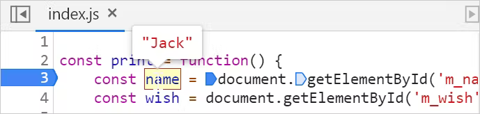

此外，我们可以选择打码的一部分作为表达式来检查值。在下面的例子中，选择了表达式document.getElementById('m_wish') 来检查值：

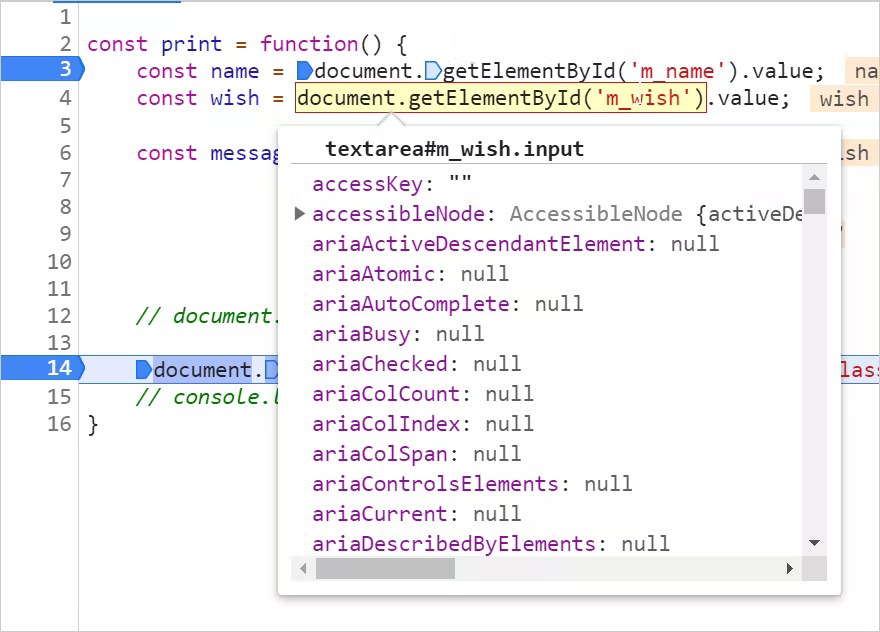

### 4. Watch
Watch 部分允许添加一个或多个表达式，并在执行时监视它们的值。当我们想在代码逻辑之外进行一些计算时，这个功能非常有用。我们可以组合来自代码区域的任何变量，以形成有效的JavaScript表达式。在逐步执行时，就能看到表达式的值。


以下是添加 Watch 的步骤：

1. 单击 Watch 上的 + 按钮：

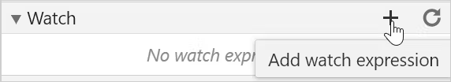

2. 添加要监控的表达式。在这个例子中，添加了一个希望观察其值的变量：

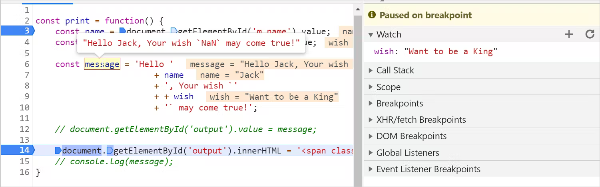

另一种观察表达式值的方法是从控制台的console中添加：

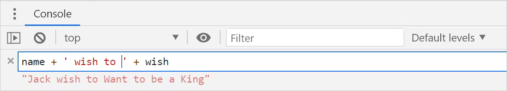

## 五、禁用和删除断点
可以点击以下按钮来禁用所有的断点：


注意，上述方法不会删除断点，只会在暂时停用它们。要再次激活这些断点，只需再点一次这个断点即可。


通过取消选中的复选框，可以从“Breakpoints”面板中删除一个或多个断点。通过右键单击并选择“删除所有断点”选项，可以删除所有断点：

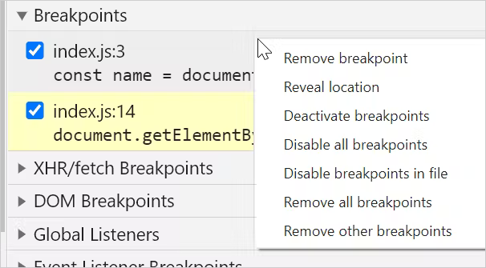

## 六、使用 VS Code 调试 JavaScript
Visual Studio code 中一些实用的插件可以用于 JavaScript 代码的调试。可以安装一个名为“Debugger for Chrome”的插件来调试代码：

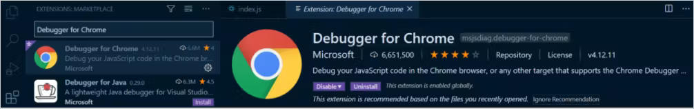

安装之后，单击左侧的 run 选项并创建配置以运行/调试 JavaScript 应用程序。

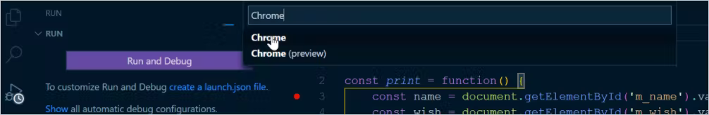

这样就会创建一个名为 launch.json 的文件，其中包含一些设置信息：

```javascript
{
  "version": "0.2.0",
  "configurations": [
      {
          "type": "chrome",
          "request": "launch",
          "name": "Debug the Greet Me app",
          "url": "<http://localhost:5500>",
          "webRoot": "${workspaceFolder}"
      }
  ]
}
```

可以修改以下参数：

+ name : 任意名称；
+ url：本地运行的 URL；
+ webRoot：默认值为 ${workspaceFolder}，即当前文件夹。可能将其更改为 项目入口文件即可。


最后一步是通过单击左上角的播放图标开始调试：


这个调试器类似于DevTools，主要有以下部分：

1. 启用调试。按播放按钮启用调试选项。
2. 用于单步执行断点以及暂停或停止调试的控件。
3. 在源代码上设置断点。
4. 范围面板查看变量范围和值。
5. 用于创建和监视表达式的监视面板。
6. 执行函数的调用栈。
7. 要启用、禁用和删除的断点列表。
8. 调试控制台读取控制台日志消息。

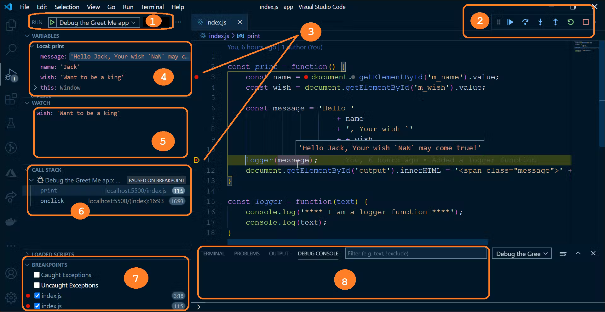

最后，回到最开始的问题，这里不再一步步调试，通过上述的调试方法判定，只需要在 wish 变量前面加一个 + 即可：

```javascript
const message = 'Hello ' 
                        + name 
                        + ', Your wish `' 
                        + + wish 
                        + '` may come true!';
```

本文翻译自 Tapas Adhikary 的原创文章，已获得作者翻译、转载授权！

> 作者：Tapas Adhikary
>
> 译者：CUGGZ
>
> 原文链接：[https://blog.greenroots.info/the-definitive-guide-to-javascript-debugging-2021-edition](https://blog.greenroots.info/the-definitive-guide-to-javascript-debugging-2021-edition)
>


> 更新: 2022-02-09 17:30:46  
> 原文: <https://www.yuque.com/cuggz/feplus/xmipqn>