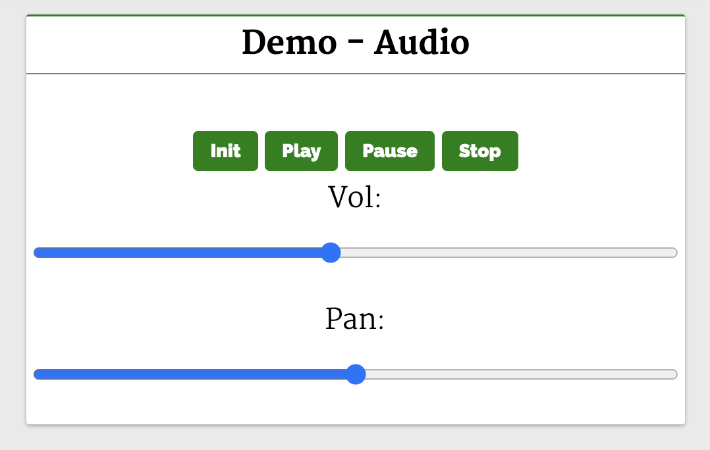
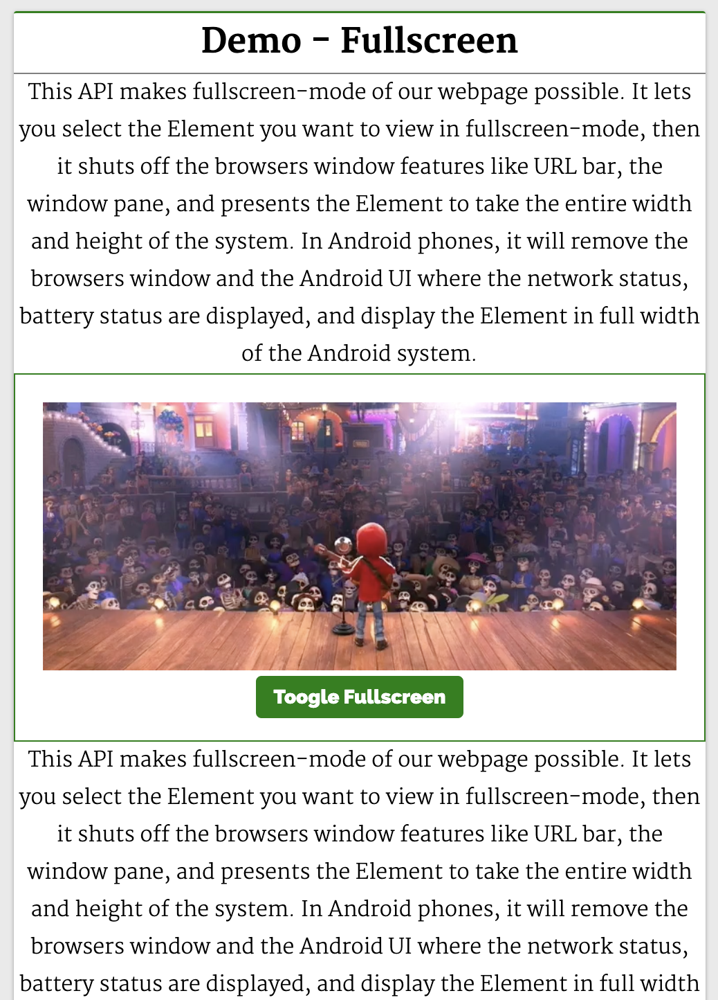
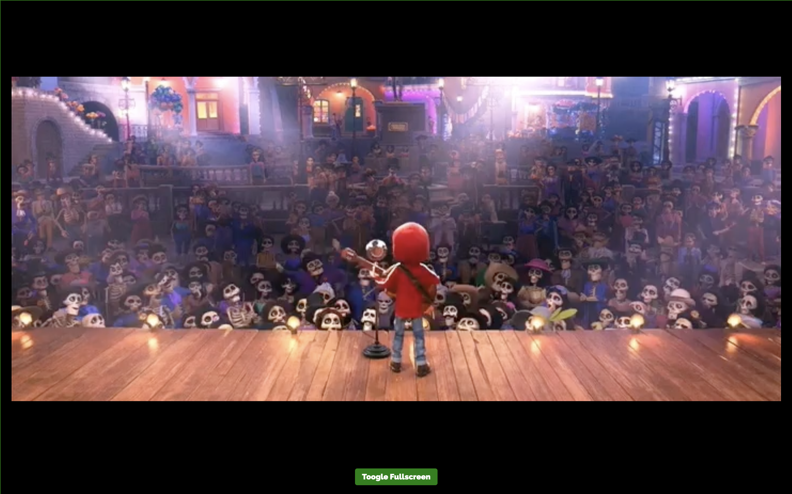
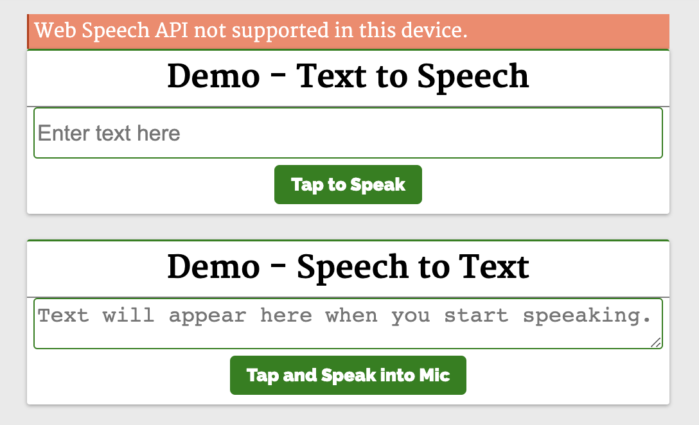
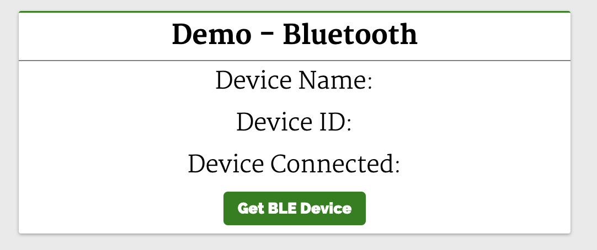
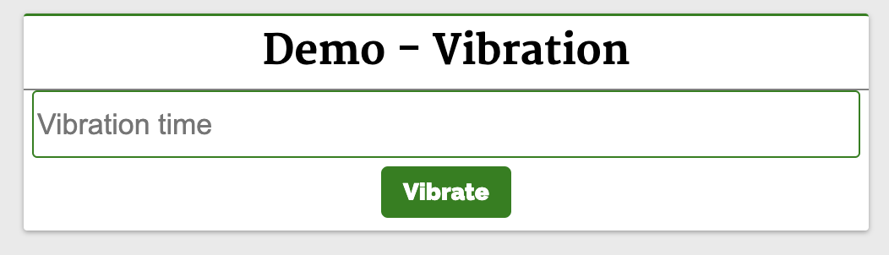
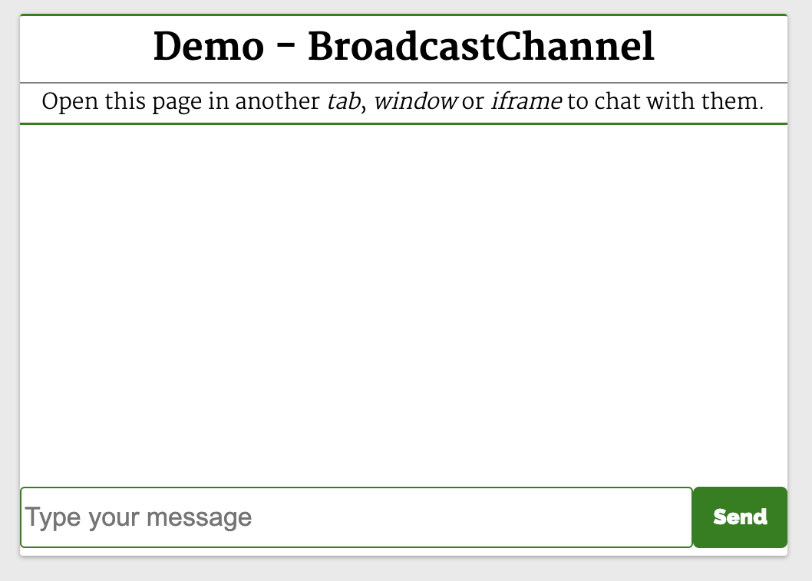

# Web API

<font style="color:rgb(77, 77, 77);">在 Web API 中，有非常有用的对象、属性和函数可用于执行小到访问 DOM 这样的小任务，大到处理音频、视频这样的复杂任务。常见的 API 有 Canvas、</font><font style="color:rgb(41, 41, 41);">Web Worker、</font><font style="color:rgb(77, 77, 77);">History、</font><font style="color:rgb(41, 41, 41);">F</font>etch 等。下面就来看一些不常见但很实用的 Web API！

**全文概览：**

1. Web Audio API
2. Fullscreen API
3. Web Speech API
4. Web Bluetooth API
5. Vibration API
6. Broadcast Channel API
7. Clipboard API
8. Web Share API

## 1. Web <font style="color:rgb(27, 27, 27);">Audio API</font>

<font style="color:rgb(41, 41, 41);"></font><font style="color:rgb(27, 27, 27);">Audio</font><font style="color:rgb(41, 41, 41);"> API 允许我们在 Web 上操作音频流，它可以用于 Web 上的</font>音频源添加效果和过滤器。音频源可以来自`<audio>`、视频/音频源文件或音频网络流。

下面来看一个例子：

```html
<body>
    <header>
        <h2>Web APIs<h2>
    </header>
    <div class="web-api-cnt">

        <div class="web-api-card">
            <div class="web-api-card-head">
                Demo - Audio
            </div>
            <div class="web-api-card-body">
                <div id="error" class="close"></div>
                <div>
                    <audio controls src="./audio.mp3" id="audio"></audio>
                </div>

                <div>
                    <button onclick="audioFromAudioFile.init()">Init</button>
                    <button onclick="audioFromAudioFile.play()">Play</button>
                    <button onclick="audioFromAudioFile.pause()">Pause</button>
                    <button onclick="audioFromAudioFile.stop()">Stop</button>
                </div>
                <div>

                    <span>Vol: <input onchange="audioFromAudioFile.changeVolume()" type="range" id="vol" min="1" max="2" step="0.01" value="1" /></span>
                    <span>Pan: <input onchange="audioFromAudioFile.changePan()" type="range" id="panner" min="-1" max="1" step="0.01" value="0" /></span>
                </div>

            </div>
        </div>

    </div>
</body>

<script>
    const l = console.log
    let audioFromAudioFile = (function() {
        var audioContext
        var volNode
        var pannerNode
        var mediaSource

        function init() {
            l("Init")
        try {
                audioContext = new AudioContext()        
                mediaSource = audioContext.createMediaElementSource(audio)
                volNode = audioContext.createGain()
                volNode.gain.value = 1
                pannerNode = new StereoPannerNode(audioContext, { pan:0 })

                mediaSource.connect(volNode).connect(pannerNode).connect(audioContext.destination)
            }
            catch(e) {
                error.innerHTML = "此设备不支持 Web Audio API"
                error.classList.remove("close")
            }
        }

        function play() {
            audio.play()            
        }

        function pause() {
            audio.pause()
        }

        function stop() {
            audio.stop()            
        }

        function changeVolume() {
            volNode.gain.value = this.value
            l("Vol Range:",this.value)
        }

        function changePan() {
            pannerNode.gain.value = this.value
            l("Pan Range:",this.value)
        }

        return {
            init,
            play,
            pause,
            stop,
            changePan,
            changeVolume
        }
    })()
</script>
```

这个例子中将音频从 `<audio>` 元素传输到 `AudioContext`，声音效果（如平移）在被输出到音频输出（扬声器）之前被添加到音频源。

按钮 Init 在单击时调用 `init` 函数。 这将创建一个 `AudioContext` 实例并将其设置为 `audioContext`。 接下来，它创建一个媒体源 `createMediaElementSource(audio)`，将音频元素作为音频源传递。音量节点 `volNode` 由 `createGain` 创建，可以用来调节音量。接下来使用 `StereoPannerNode` 设置平移效果，最后将节点连接至媒体源。



点击按钮（Play、Pause、Stop）可以播放、暂停和停止音频。页面有一个音量和平移的范围滑块，滑动滑块就可以调节音频的音量和平移效果。

**相关资源：**

* **Demo：**<https://web-api-examples.github.io/audio.html>
* **MDN 文档：**<https://developer.mozilla.org/zh-CN/docs/Web/API/Web_Audio_API>

## <font style="color:rgb(41, 41, 41);">2. Fullscreen API</font>

<font style="color:rgb(41, 41, 41);">Fullscreen API 用于在 Web 应用程序中开启全屏模式，使用它就可以在全屏模式下查看页面/元素。在安卓手机中，它会溢出浏览器窗口和安卓顶部的状态栏（显示网络状态、电池状态等的地方）。</font>

<font style="color:rgb(41, 41, 41);"></font>

<font style="color:rgb(41, 41, 41);">Fullscreen API </font>方法：

* `requestFullscreen`：系统上以全屏模式显示所选元素，会关闭其他应用程序以及浏览器和系统 UI 元素。
* `exitFullscreen`：退出全屏模式并切换到正常模式。

下面来看一个常见的例子，使用全屏模式观看视频：：

```html

<body>
    <header>
        <h2>Web APIs<h2>
    </header>
    <div class="web-api-cnt">
        <div class="web-api-card">
        <div class="web-api-card-head">
            Demo - Fullscreen
        </div>
        <div class="web-api-card-body">
        <div id="error" class="close"></div>
        <div>
            This API makes fullscreen-mode of our webpage possible. It lets you select the Element you want to view in fullscreen-mode, then it shuts off the browsers window features like URL bar, the window pane, and presents the Element to take the entire width and height of the system.

In Android phones, it will remove the browsers window and the Android UI where the network status, battery status are displayed, and display the Element in full width of the Android system.
        </div>
        <div class="video-stage">
            <video id="video" src="./video.mp4"></video>
            <button onclick="toggle()">Toogle Fullscreen</button>
        </div>
        <div>
            This API makes fullscreen-mode of our webpage possible. It lets you select the Element you want to view in fullscreen-mode, then it shuts off the browsers window features like URL bar, the window pane, and presents the Element to take the entire width and height of the system.

In Android phones, it will remove the browsers window and the Android UI where the network status, battery status are displayed, and display the Element in full width of the Android system.
        </div>
        </div>
        </div>
    </div>
</body>

<script>
    const l =console.log

    function toggle() {
        const videoStageEl = document.querySelector(".video-stage")
        if(videoStageEl.requestFullscreen) {
            if(!document.fullscreenElement){
                videoStageEl.requestFullscreen()
            }
            else {
                document.exitFullscreen()
            }
        } else {
            error.innerHTML = "此设备不支持 Fullscreen API"
            error.classList.remove("close")        
        }
    }
</script>
```

可以看到，video 元素在 div#video-stage 元素中，带有一个按钮 Toggle Fullscreen。



当点击按钮切换全屏时，我们想让元素 `div#video-stage` 全屏显示。`toggle` 函数的实现如下：

```javascript
function toggle() {
  const videoStageEl = document.querySelector(".video-stage")
  if(!document.fullscreenElement)
    videoStageEl.requestFullscreen()
  else
    document.exitFullscreen()
}
```

这里通过 `querySelector` 查找 `div#video-stage` 元素并将其 HTMLDivElement 实例保存在 `videoStageEl` 上。

然后，使用 `document.fullsreenElement` 属性来确定 `document` 是否是全屏的，所以可以在 `videoStageEl` 上调用 `requestFullscreen()`。 这将使 `div#video-stage` 占据整个设备的视图。

如果在全屏模式下点击 Toggle Fullscreen 按钮，就会在 `document` 上调用 `exitFullcreen`，这样 UI 视图就会返回到普通视图（退出全屏）。



**相关资源：**

* **Demo：**<https://web-api-examples.github.io/fullscreen.html>
* **MDN 文档：**<https://developer.mozilla.org/zh-CN/docs/Web/API/Fullscreen_API>

## 3. <font style="color:rgb(27, 27, 27);">Web Speech AP</font><font style="color:rgb(41, 41, 41);">I</font>

<font style="color:rgb(41, 41, 41);">Web Speech API </font>提供了将语音合成和语音识别添加到 Web 应用程序的功能。使用此 API，我们将能够向 Web 应用程序发出语音命令，就像在 Android 上通过其 Google Speech 或在 Windows 中使用 Cortana 一样。

下面来看一个简单的例子，使用 Web Speech API 实现文字转语音和语音转文字：

```html
<body>
    <header>
        <h2>Web APIs<h2>
    </header>
    <div class="web-api-cnt">
        <div id="error" class="close"></div>

        <div class="web-api-card">
            <div class="web-api-card-head">
                Demo - Text to Speech
            </div>
            <div class="web-api-card-body">
                <div>
                    <input placeholder="Enter text here" type="text" id="textToSpeech" />
                </div>

                <div>
                    <button onclick="speak()">Tap to Speak</button>
                </div>
            </div>
        </div>

        <div class="web-api-card">
            <div class="web-api-card-head">
                Demo - Speech to Text
            </div>
            <div class="web-api-card-body">
                <div>
                    <textarea placeholder="Text will appear here when you start speeaking." id="speechToText"></textarea>
                </div>

                <div>
                    <button onclick="tapToSpeak()">Tap and Speak into Mic</button>
                </div>
            </div>
        </div>

    </div>
</body>

<script>

    try {
        var speech = new SpeechSynthesisUtterance()
        var SpeechRecognition = SpeechRecognition;
        var recognition = new SpeechRecognition()

    } catch(e) {
        error.innerHTML = "此设备不支持 Web Speech API"
        error.classList.remove("close")                
    }

    function speak() {
        speech.text = textToSpeech.value
        speech.volume = 1
        speech.rate=1
        speech.pitch=1
        window.speechSynthesis.speak(speech)
    }

    function tapToSpeak() {
        recognition.onstart = function() { }

        recognition.onresult = function(event) {
            const curr = event.resultIndex
            const transcript = event.results[curr][0].transcript
            speechToText.value = transcript
        }

        recognition.onerror = function(ev) {
            console.error(ev)
        }

        recognition.start()
    }
</script>
```



第一个演示 Demo - Text to Speech 演示了使用这个 API 和一个简单的输入字段，接收输入文本和一个按钮来执行语音操作。

```javascript
function speak() {
  const speech = new SpeechSynthesisUtterance()
  speech.text = textToSpeech.value
  speech.volume = 1
  speech.rate = 1
  speech.pitch = 1
  window.speechSynthesis.speak(speech)
}
```

它实例化了 `SpeechSynthesisUtterance()` 对象，将文本设置为从输入框中输入的文本中朗读。 然后，使用 `speech` 对象调用 `SpeechSynthesis#speak` 函数，在扬声器中说出输入框中的文本。

第二个演示 Demo - Speech to Text 将语音识别为文字。 点击 Tap and Speak into Mic 按钮并对着麦克风说话，我们说的话会被翻译成文本输入框中的内容。

点击 Tap and Speak into Mic 按钮会调用 tapToSpeak 函数：

```javascript
function tapToSpeak() {
  var SpeechRecognition = SpeechRecognition;
  const recognition = new SpeechRecognition()
  recognition.onstart = function() { }
  recognition.onresult = function(event) {
    const curr = event.resultIndex
    const transcript = event.results[curr][0].transcript
    speechToText.value = transcript
  }
  recognition.onerror = function(ev) {
    console.error(ev)
  }
  recognition.start()
}
```

这里实例化了 `SpeechRecognition`，然后注册事件处理程序和回调。语音识别开始时调用 `onstart`，发生错误时调用 `onerror`。 每当语音识别捕获一条线时，就会调用 `onresult`。

在 `onresult` 回调中，提取内容并将它们设置到 `textarea` 中。 因此，当我们对着麦克风说话时，文字会出现在 `textarea` 内容中。

**相关资源：**

* **Demo：**<https://web-api-examples.github.io/speech.html>
* **MDN 文档：**<https://developer.mozilla.org/zh-CN/docs/Web/API/Web_Speech_API>

## 4. <font style="color:rgb(27, 27, 27);">Web Bluetooth API</font>

<font style="color:rgb(41, 41, 41);">Bluetooth API </font>让我们可以访问手机上的低功耗蓝牙设备，并使用它将网页上的数据共享到另一台设备。

基本 API 是 `navigator.bluetooth.requestDevice`。 调用它将使浏览器提示用户使用设备选择器，用户可以在其中选择一个设备或取消请求。`navigator.bluetooth.requestDevice` 需要一个强制对象。 此对象定义过滤器，用于返回与过滤器匹配的蓝牙设备。

下面来看一个简单的例子，使用 `navigator.bluetooth.requestDevice` API 从 BLE 设备检索基本设备信息：

```html

<body>
  <header>
    <h2>Web APIs<h2>
      </header>
      <div class="web-api-cnt">
        
        <div class="web-api-card">
          <div class="web-api-card-head">
            Demo - Bluetooth
          </div>
          <div class="web-api-card-body">
            <div id="error" class="close"></div>
            <div>
              <div>Device Name: <span id="dname"></span></div>
              <div>Device ID: <span id="did"></span></div>
              <div>Device Connected: <span id="dconnected"></span></div>
            </div>
            
            <div>
              <button onclick="bluetoothAction()">Get BLE Device</button>
            </div>
            
          </div>
        </div>
        
      </div>
      </body>
    
    <script>
      function bluetoothAction(){
        if(navigator.bluetooth) {
          navigator.bluetooth.requestDevice({
            acceptAllDevices: true
          }).then(device => {            
            dname.innerHTML = device.name
            did.innerHTML = device.id
            dconnected.innerHTML = device.connected
          }).catch(err => {
            error.innerHTML = "Oh my!! Something went wrong."
            error.classList.remove("close")
          })
        } else {
          error.innerHTML = "Bluetooth is not supported."            
          error.classList.remove("close")
        }
      }
</script>
```



这里会显示设备信息。 单击 Get BLE Device 按钮会调用 `bluetoothAction` 函数：

```javascript
function bluetoothAction(){
  navigator.bluetooth.requestDevice({
    acceptAllDevices: true
  }).then(device => {            
    dname.innerHTML = device.name
    did.innerHTML = device.id
    dconnected.innerHTML = device.connected
  }).catch(err => {
    console.error("Oh my!! Something went wrong.")
  })
}
```

`bluetoothAction` 函数调用带有 `acceptAllDevices：true` 选项的 `navigator.bluetooth.requestDevice` API，这将使其扫描并列出所有附近的蓝牙活动设备。 它返回了一个 `promise`，所以将它解析为从回调函数中获取一个参数 device，这个 device 参数将保存列出的蓝牙设备的信息。这是我们使用其属性在设备上显示信息的地方。

**相关资源：**

* **Demo：**<https://web-api-examples.github.io/bluetooth.html>
* **MDN 文档：**<https://developer.mozilla.org/en-US/docs/Web/API/Web_Bluetooth_API>

## 5. <font style="color:rgb(41, 41, 41);">Vibration API</font>

<font style="color:rgb(41, 41, 41);">Vibration API 可以</font>使我们的设备振动，作为对我们应该响应的新数据或信息的通知或物理反馈的一种方式。

执行振动的方法是 `navigator.vibrate(pattern)`。`pattern` 是描述振动模式的单个数字或数字数组。

这将使设备振动在 200 毫秒之后停止：

```javascript
navigator.vibrate(200)
navigator.vibrate([200])
```

这将使设备先振动 200 毫秒，再暂停 300 毫秒，最后振动 400 毫秒并停止：

```javascript
navigator.vibrate([200, 300, 400])
```

可以通过传递 0、\[]、\[0,0,0] 来消除振动。

下面来看一个简单的例子：

```html
<body>
  <header>
    <h2>Web APIs<h2>
  </header>
  <div class="web-api-cnt">
    <div class="web-api-card">
      <div class="web-api-card-head">
        Demo - Vibration
      </div>
      <div class="web-api-card-body">
        <div id="error" class="close"></div>
        <div>
          <input id="vibTime" type="number" placeholder="Vibration time" />
        </div>
        <div>
          <button onclick="vibrate()">Vibrate</button>
        </div>
      </div>
    </div>
  </div>
</body>
    
<script>
      if(navigator.vibrate) {
        function vibrate() {
          const time = vibTime.value
          if(time != "")
            navigator.vibrate(time)
        }
      } else {
        error.innerHTML = "Vibrate API not supported in this device."
        error.classList.remove("close")        
      }
</script>
```

这里有一个输入框和一个按钮。 在输入框中输入振动的持续时间并按下按钮。我们的设备将在输入的时间内振动。



**相关资源：**

* **Demo：**<https://web-api-examples.github.io/vibration.html>
* **MDN 文档：**<https://developer.mozilla.org/zh-CN/docs/Web/API/Vibration_API>

## 6. <font style="color:rgb(41, 41, 41);">Broadcast Channel API</font>

<font style="color:rgb(41, 41, 41);">Broadcast Channel API </font>允许从**同源**的不同浏览上下文进行消息或数据的通信。其中，浏览上下文指的是窗口、选项卡、iframe、worker 等。

`BroadcastChannel` 类用于创建或加入频道：

```javascript
const politicsChannel = new BroadcastChannel("politics")
```

`politics` 是频道的名称，任何使用 `politics` 始化 `BroadcastChannel` 构造函数的上下文都将加入 `politics` 频道，它将接收在频道上发送的任何消息，并可以将消息发送到频道中。

如果它是第一个具有 `politics` 的 `BroadcastChannel` 构造函数，则将创建该频道。可以使用 `BroadcastChannel.postMessage API` 来将消息发布到频道。使用 `BroadcastChannel.onmessage` API 要订阅频道消息。

下面来看一个简单的聊天应用：

```html

<body>
  <header>
    <h2>Web APIs<h2>
   </header>
   <div class="web-api-cnt">
       <div class="web-api-card">
          <div class="web-api-card-head">
            Demo - BroadcastChannel
          </div>
          <div class="web-api-card-body">
            <div class="page-info">Open this page in another <i>tab</i>, <i>window</i> or <i>iframe</i> to chat with them.</div>
            <div id="error" class="close"></div>
            <div id="displayMsg" style="font-size:19px;text-align:left;">
            </div>
            <div class="chatArea">
              <input id="input" type="text" placeholder="Type your message" />
              <button onclick="sendMsg()">Send Msg to Channel</button>
            </div>
          </div>
        </div> 
    </div>
</body>
<script>
      const l = console.log;
      try {
        var politicsChannel = new BroadcastChannel("politics")
        politicsChannel.onmessage = onMessage
        var userId = Date.now()
        } catch(e) {
          error.innerHTML = "BroadcastChannel API not supported in this device."
          error.classList.remove("close")
        }
      
      input.addEventListener("keydown", (e) => {
        if(e.keyCode === 13 && e.target.value.trim().length > 0) {
          sendMsg()            
        }
      })
      
      function onMessage(e) {     
        const {msg,id}=e.data   
        const newHTML = "<div class='chat-msg'><span><i>"+id+"</i>: "+msg+"</span></div>"
        displayMsg.innerHTML = displayMsg.innerHTML + newHTML
        displayMsg.scrollTop = displayMsg.scrollHeight
      }
      
      function sendMsg() {
        politicsChannel.postMessage({msg:input.value,id:userId})
        
        const newHTML = "<div class='chat-msg'><span><i>Me</i>: "+input.value+"</span></div>"
        displayMsg.innerHTML = displayMsg.innerHTML + newHTML
        
        input.value = ""
        
        displayMsg.scrollTop = displayMsg.scrollHeight
      }   
</script>
```

这里有一个简单的文本和按钮。 输入消息，然后按按钮发送消息。下面初始化了`politicalChannel`，并在 `politicalChannel` 上设置了一个 `onmessage` 事件监听器，这样它就可以接收和显示消息。



点击按钮就会调用`sendMsg` 函数。 它通过 `BroadcastChannel#postMessage` API 将消息发送到 `politics` 频道。任何初始化此脚本的选项卡、iframe 或工作程序都将接收从此处发送的消息，因此此页面将接收从其他上下文发送的消息。

**相关资源：**

* **Demo：**<https://web-api-examples.github.io/broadcastchannel.html>
* **MDN 文档：**<https://developer.mozilla.org/zh-CN/docs/Web/API/Broadcast_Channel_API>

## 7. <font style="color:rgb(17, 17, 17);">Clipboard API</font>

复制、剪切和粘贴等剪贴板操作是应用程序中最常见的一些功能。 Clipboard API 使 Web 用户能够访问系统剪贴板并执行基本的剪贴板操作。

以前，可以使用 `document.execCommand` 与系统剪贴板进行交互。 现代异步剪贴板 API 提供了直接读取和写入剪贴板内容的访问权限。

从剪贴板读取内容：

```javascript
navigator.clipboard.readText().then(clipText =>
  document.getElementById("outbox").innerText = clipText
);
```

将内容写入剪贴板：

```javascript
function updateClipboard(newClip) {
  navigator.clipboard.writeText(newClip).then(function() {
    /* clipboard successfully set */
  }, function() {
    /* clipboard write failed */
  });
}
```

**相关资源：**

* **MDN 文档：**<https://developer.mozilla.org/zh-CN/docs/Web/API/Clipboard_API>

## 8. <font style="color:rgb(27, 27, 27);">Web Share API</font>

<font style="color:rgb(17, 17, 17);">Share API </font>可帮助我们在 web 应用上实现共享功能。它给人以移动原生共享的感觉。它使共享文本、文件和指向设备上其他应用程序的链接成为可能。

可通过 `navigator.share` 方法访问 Web Share API：

```javascript
if (navigator.share) {
  navigator.share({
    title: '百度',
    text: '百度一下',
    url: '<https://www.baidu.com/>',
  })
    .then(() => console.log('分享成功'))
    .catch((error) => console.log('分享失败', error));
}
```

上面的代码使用原生 JavaScript 实现了文本共享。需要注意，我们只能使用 `onclick` 事件调用此操作：

```javascript
function Share({ label, text, title }) {
  const shareDetails = { title, text };

  const handleSharing = async () => {
    if (navigator.share) {
      try {
        await navigator.share(shareDetails).then(() => console.log("Sent"));
      } catch (error) {
        console.log(`Oops! I couldn't share to the world because: ${error}`);
      }
    } else {
      // fallback code
      console.log(
        "Web share is currently not supported on this browser. Please provide a callback"
      );
    }
  };
  return (
    <button onClick={handleSharing}>
      <span>{label}</span>
    </button>
  );
}

```

**相关资源：**

* **MDN 文档：**<https://developer.mozilla.org/en-US/docs/Web/API/Web_Share_API>


> 更新: 2022-08-11 10:18:15  
> 原文: <https://www.yuque.com/cuggz/feplus/bmrd1v>