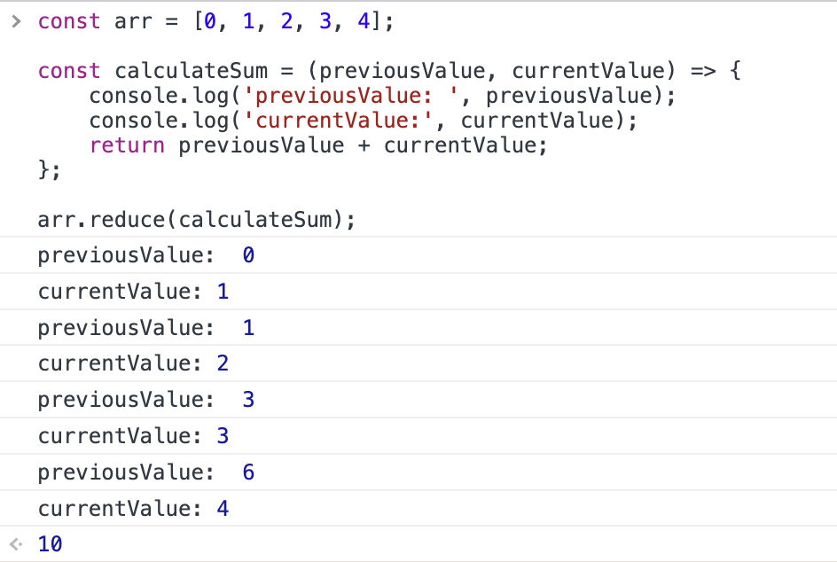
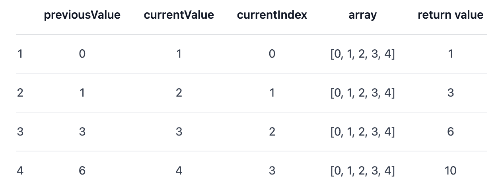
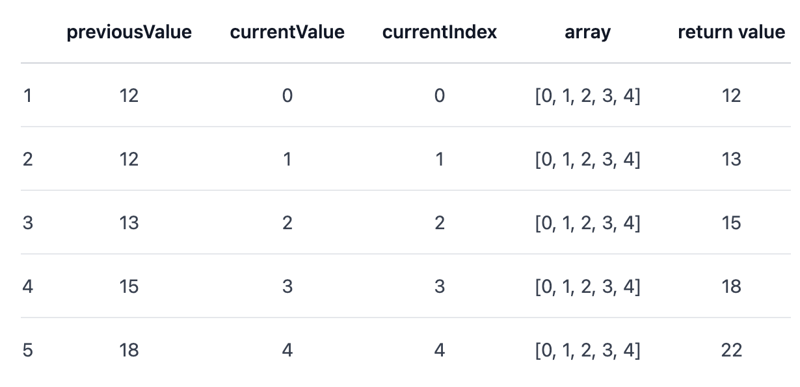
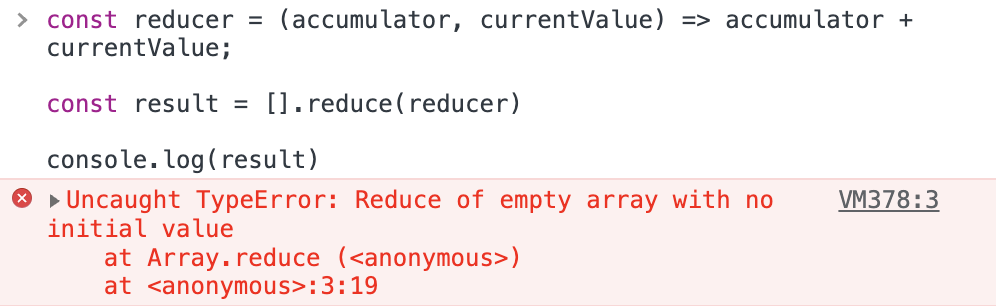
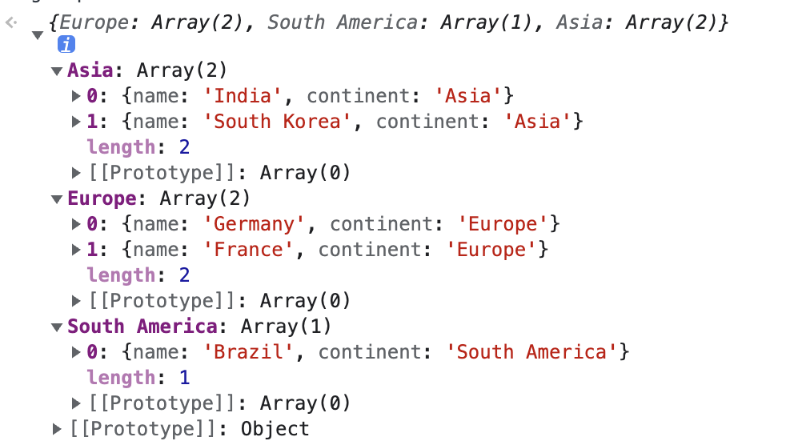
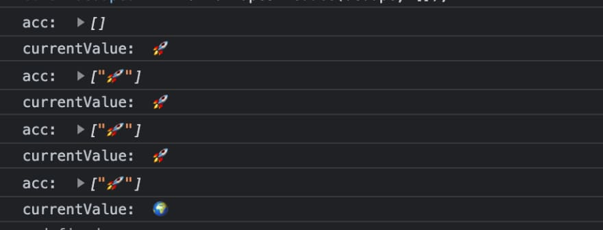

# reduce

在 JavaScript 中，<font style="color:rgb(17, 17, 17);">reduce 是最难理解的数组方法之一，它是一个</font>强大而灵活的<font style="color:rgb(17, 17, 17);">高阶函数，下面就来看看 reduce 的妙用之处！</font>

## 1. 基本用法

`reduce()` 是 JavaScript 中一个很有用的数组方法，MDN 对其解释如下：

> reduce() 方法对数组中的每个元素按序执行一个 reducer 函数，每一次运行 reducer 会将先前元素的计算结果作为参数传入，最后将其结果汇总为单个返回值。

`reduce()` 方法的语法如下：

```javascript
array.reduce(reducer, initialValue)
```

其中有两个参数：

（1）reducer 函数，包含四个参数：

* `previousValue：`上一次调用 callbackFn 时的返回值。在第一次调用时，若指定了初始值 initialValue，其值则为 initialValue，否则为数组索引为 0 的元素 array\[0]。
* `currentValue：`数组中正在处理的元素。在第一次调用时，若指定了初始值 initialValue，其值则为数组索引为 0 的元素 array\[0]，否则为 array\[1]。
* `currentIndex：`数组中正在处理的元素的索引。若指定了初始值 initialValue，则起始索引号为 0，否则从索引 1 起始。
* `array：`用于遍历的数组。

（2）`initialValue `可选

作为第一次调用 callback 函数时参数 previousValue 的值。若指定了初始值 initialValue，则 currentValue 则将使用数组第一个元素；否则 previousValue 将使用数组第一个元素，而 currentValue 将使用数组第二个元素。

下面是一个使用`reduce()` 求数组元素之和的例子：

```javascript
const arr = [0, 1, 2, 3, 4];

const calculateSum = (previousValue, currentValue) => {
    console.log('previousValue: ', previousValue);
    console.log('currentValue:', currentValue);
    return previousValue + currentValue;
};

arr.reduce(calculateSum)
```

reducer 会逐个遍历数组元素，每一步都将当前元素的值与上一步的计算结果相加（上一步的计算结果是当前元素之前所有元素的总和），直到没有更多的元素被相加。

这段代码的输出如下：



其执行过程如下：



当我们给`reduce()`方法一个初始值12时：

```javascript
arr.reduce(calculateSum, 12);
```

其执行过程就如下所示：



如果数组为空且未提供初始值，reduce() 方法就会抛出 TypeError：

```javascript
const reducer = (accumulator, currentValue) => accumulator + currentValue;

const result = [].reduce(reducer)

console.log(result)
```

输出结果如下：



## 2. 使用技巧

### （1）数组求和

`reduce()`方法最直接的用法就是对数组元素求和：

```javascript
const total = [34, 12, 143, 13, 76].reduce(
  (previousValue, currentValue) => previousValue + currentValue,
  0
);
console.log(total);
```

其输出结果如下：

```javascript
278
```

### （2）扁平数组

`reduce()`方法还可以用来扁平化数组：

```javascript
const array = [[0, 1], [2, 3], [4, 5], [5, 6]];

const flattenedArray = array.reduce(
  (previousValue, currentValue) => previousValue.concat(currentValue),
  []
);
console.log(flattenedArray);
```

输出结果如下：

```javascript
[0, 1, 2, 3, 4, 5, 5, 6]
```

如果数组有不止一层嵌套数组，可以递归调用 reduce 函数来扁平化，然后将它们与最终的数组连接起来即可。

```javascript
const nestedArray = [[1, [2, 3]], [4, 5], [[6, 7], [8, 9]]];

function flattenArray(nestedArray) {
  return nestedArray.reduce(
    (accumulator, currentValue) => 
      accumulator.concat(
        Array.isArray(currentValue) ? flattenArray(currentValue) : currentValue
      ),
    []);
}

const flattenedArray = flattenArray(nestedArray);
console.log(flattenedArray)
```

输出结果如下：

```javascript
[1, 2, 3, 4, 5, 6, 7, 8, 9]
```

### （3）数组分组

假设有一个国家对象数组，根据国家所在洲对数组中的每个国家进行分组。可以使用 reduce 方法来完成：

```javascript
cosnt countries = [
    {name: "Germany", continent: "Europe"},
    {name: "Brazil", continent: "South America"},
    {name: "India", continent: "Asia"},
    {name: "France", continent: "Europe"},
    {name: "South Korea", continent: "Asia"},
]

const groupedCountries = countries.reduce(
  (groupedCountries, country) => {
    if (!groupedCountries[country.continent]){
      groupedCountries[country.continent] = []
    }
    groupedCountries[country.continent].push(country)
    return groupedCountries
  },
  {}
);
console.log(groupedCountries)
```

输出结果如下：



### （4）使用 reduce() 代替 filter().map()

在 Javascript 中，数组的 filter 方法可以通过回调过滤数组中的元素，map 方法可以通过回调内部传递的逻辑使用旧数组创建一个新数组。有时我们必须同时使用这两种方法，对某些条件过滤的结果创建一个新数组。

可以使用 reduce 方法来完成相同的工作，这样就只需要遍历数组一次。例如，要创建一个大于 30 的数字的平方根数组，使用 filter().map() 可能会这么写：

```javascript
const numbers = [3, 21, 34, 121, 553, 12, 53, 5, 42, 11];

const newArray = numbers.filter(number => number > 30).map(number => Math.sqrt(number));
```

使用 reduce 实现：

```javascript
const numbers = [3, 21, 34, 121, 553, 12, 53, 5, 42, 11];

const newArray = numbers.reduce((previousValue, currentValue) => {
  if (currentValue > 30) {
    previousValue.push(Math.sqrt(currentValue))
  }
  return previousValue
}, []);

console.log(newArray);
```

输出结果如下：

```javascript
 [5.830951894845301, 11, 23.515952032609693, 7.280109889280518, 6.48074069840786]
```

### （5）统计数组元素出现次数

可以使用`reduce`来统计数组中每个元素出现的次数：

```javascript
const colors = ['green', 'red', 'red', 'yellow', 'red', 'yellow', 'green', 'green'];

const colorMap = colors.reduce((previousValue, currentValue) => {
    previousValue[currentValue] >= 1 ? previousValue[currentValue]++ : previousValue[currentValue] = 1;
    return previousValue;
  }, 
  {}
);

console.log(colorMap);
```

输出结果如下：

```javascript
{green: 3, red: 3, yellow: 2}
```

### （6）串行执行异步函数

有一组需要串行执行的异步函数，可以使用`reduce()`来调用执行：

```javascript
const functions = [
  async function() { return 1; },
  async function() { return 2; },
  async function() { return 3; }
];

const res = await functions.reduce((promise, fn) => promise.then(fn), Promise.resolve());

console.log(res);  // 输出结果：3
```

这里的 res 就相当于执行了：

```javascript
Promise.resolve().then(fn1).then(fn2).then(fn3);
```

### （7）**创建管道**

假设有一组简单的数学函数，这些函数允许我们增加、减少、加倍和减半：

```javascript
function increment(input) { return input + 1;}

function decrement(input) { return input — 1; }

function double(input) { return input * 2; }

function halve(input) { return input / 2; }
```

如果想对一个值进行多次上述操作，就可以使用`reduce()`。管道是用于将某些初始值转换为最终值的函数列表的术语。我们只需将执行过程中每一步用到函数写在管道数组中即可。

```javascript
const pipeline = [increment, double, decrement];

const result = pipeline.reduce((total, func) => {
  return func(total);
}, 5);

console.log(result) // 输出结果：11
```

### （8）反转字符串

可以使用`reduce()`实现字符串的反转：

```javascript
const str = 'hello world';

[...str].reduce((a,v) => v + a);  // 输出结果：'dlrow olleh'
```

### （9）数组去重

<font style="color:rgb(23, 23, 23);">有一个包含重复项的数组，可以使用 </font><code><font style="color:rgb(23, 23, 23);">reduce()</font></code><font style="color:rgb(23, 23, 23);"> 来对数组进行去重：</font>

```javascript
const arr = ["🚀", "🚀", "🚀", "🌍"];


const dedupe = (acc, currentValue) => {
  if (!acc.includes(currentValue)) {
    acc.push(currentValue);
  }
  return acc;
};

const dedupedArr = arr.reduce(dedupe, []); 

console.log(dedupedArr);  // ["🚀", "🌍"];
```

其执行过程如下：



<font style="color:rgb(23, 23, 23);">当 reduce 方法遍历数组时，回调函数将应用于数组中的每一项。它会检查累加器中是否缺少当前值，如果是，则将当前值 push 到累加器中。</font>

<font style="color:rgb(23, 23, 23);"></font>

<font style="color:rgb(23, 23, 23);">注：此示例仅用于说明 reduce 方法的工作原理，在实践中，通常会选择使用 Set 对数组进行去重，这是一种性能更高的方法：</font>

```javascript
dedupedArr = [...new Set(array)];
```


> 更新: 2023-02-04 21:24:13  
> 原文: <https://www.yuque.com/cuggz/feplus/fq6xtg1y8dar4xgq>