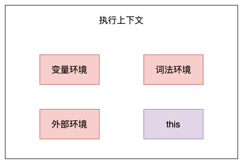
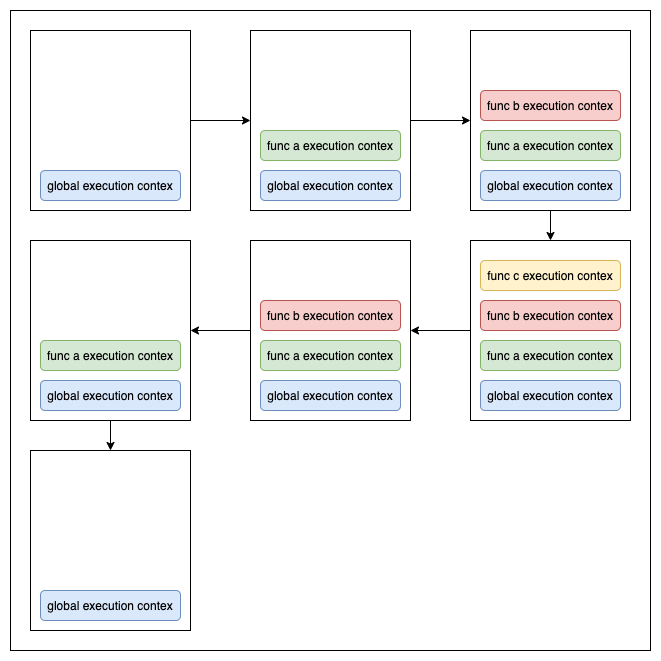
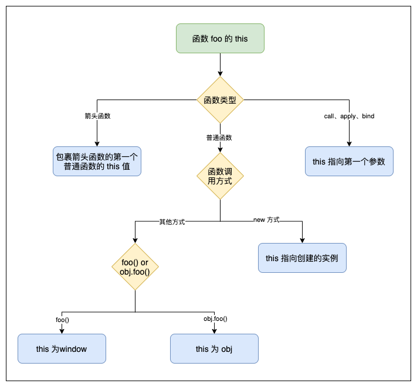

# this

### 1. 执行上下文

关于this，还得从执行上下文说起。在执行上下文中，包含了变量环境、词法环境、外部环境、this：



实际上，this 是和执行上下文绑定的，也就是说每个执行上下文都有一个this，下面就来看看执行上下文的相关概念。

#### （1）执行上下文概念

执行上下文是评估和执行 JavaScript 代码的环境的抽象概念，当 JavaSciprt 代码在运行时，其运行在执行上下文中。JavaScript 中有三种执行上下文类型:

* \*\*全局执行上下文：\*\*任何不在函数内部的都是全局执行上下文，它首先会创建一个全局的window对象，并且设置this的值等于这个全局对象，一个程序中只有一个全局执行上下文。
* \*\*函数执行上下文：\*\*当一个函数被调用时，就会为该函数创建一个新的执行上下文，函数的上下文可以有任意多个。
* <code>**eval**</code>\*\*函数执行上下文：\*\*执行在eval函数中的代码会有属于它自己的执行上下文。

由于eval函数执行上下文用的不多，所以这里只介绍全局执行上下文和函数执行上下文：

* **在全局执行上下文中**，this 是指向 window 对象的；
* **在函数执行上下文中**，默认情况下调用一个函数，其执行上下文的 this 也是指向 window 的。

#### （2）执⾏上下⽂栈

我们知道，浏览器中的JavaScript解释器是单线程的，也就是说浏览器同⼀时间只能做⼀个事情。代码中只有⼀个全局执⾏上下⽂和⽆数个函数执⾏上下⽂，这些组成了执⾏上下⽂栈（Execution Stack）。 ⼀个函数的执⾏上下⽂，在函数执⾏完毕后，会被移出执⾏上下⽂栈。看下面的例子：

```javascript
function c(){
	console.log('ok');
}
function a(){
  function b(){
    c();
  }
  b();
}
a();
```

这段代码的执⾏上下⽂栈是这样的：



### 2. <font style="color:rgb(28, 31, 33);">函数的 this 指向</font>

**this 是 JavaScript 的一个关键字，多数情况下 this 指向调用它的对象。**

这句话有两个意思，首先 this 指向的应该是一个对象（函数执行上下文对象）。其次，这个对象指向的是调用它的对象，如果调用它的不是对象或对象不存在，则会指向全局对象（严格模式下为 undefined）。

其实，this 是在函数被调用时确定的，它的指向取决于函数调用的地方，而不是它被声明的地方（除箭头函数外）。当函数被调用时，会创建一个执行上下文，它包含函数在哪里被调用（调用栈）、函数的调用方式、传入的参数等信息，this 就是这个记录的一个属性，它会在函数执行的过程中被用到。

this 在函数的指向绑定形式有四种：**默认绑定、隐式绑定、显式绑定、new绑定**。

#### （1）默认绑定（全局环境）

函数在浏览器全局环境中直接使用不带任何修饰的函数引用进行调用，非严格模式下 `this` 指向 `window`；在 `use strict` 指明严格模式的情况下就是 `undefined`（严格模式不允许 this 指向全局对象）。

\*\*注意：\*\*在浏览器环境下，全局对象是window；在Node.js环境下，全局对象是global。

```javascript
function fn1 () {
    console.log(this)
}
function fn2 () {
    'use strict'
    console.log(this)
}
fn1() // window
fn2() // undefined
```

需要注意一种情况，来看代码：

```javascript
var num = 1
var foo = {
    num: 10,
    fn: function() {
       console.log(this)
       console.log(this.num)
    }
}
var fn1 = foo.fn
fn1()
```

这里会输出 Window 和 1。这里 `this` 仍然指向 `window`。虽然 `fn` 函数在 `foo` 对象中作为方法被引用，但是在赋值给 `fn1` 之后，`fn1` 的执行仍然是在 `window` 全局环境中。因此输出 `window` 和 `1`，它们相当于：

```javascript
console.log(window)
console.log(window.num)
```

#### （2）隐式绑定（<font style="color:#262626;">上下文对象）</font>

<font style="color:rgb(28, 31, 33);">如果函数在某个上下文对象中调用，那么 this 绑定的是那个上下文对象。</font>来看一个例子：

```javascript
var a = 'hello'

var obj = {
    a: 'world',
    fn: function() {
        console.log(this.a)
    }
}

obj.fn()
```

在上述代码中，最后会输出"world"。这里fn方法是作为对象的属性调用的，此时fn方法执行时，this会指向obj对象。也就是说，此时this指向的是调用这个方法的对象。

那如果嵌套了多层对象，this的指向又是怎样的呢？下面来看一个例子：

```javascript
const obj1 = {
    text: 1,
    fn: function() {
        return this.text
    }
}
const obj2 = {
    text: 2,
    fn: function() {
        return obj1.fn()
    }
}
const obj3 = {
    text: 3,
    fn: function() {
        var fn = obj1.fn
        return fn()
    }
}
console.log(obj1.fn())
console.log(obj2.fn())
console.log(obj3.fn())
```

对于这段代码，最终的三个输出结果：

* 第一个 `console` 输出 `1` ，这时 this 指向了调用 fn 方法的对象 obj1，所以会输出obj1中的属性 `text` 的值 `1`；
* 第二个 `console` 输出 `1`，这里调用了 `obj2.fn()`，最终还是调用 `o1.fn()`，因此仍然会输出 `1`。
* 第二个 `console` 输出 `undefined`，在进行 `var fn = o1.fn` 赋值之后，是直接调用的，因此这里的 `this` 指向 `window`，答案是 `undefined`。

根据上面例子就可以得出结论：<font style="color:rgb(28, 31, 33);">如果嵌套了多个对象，那么指向</font>**<font style="color:rgb(28, 31, 33);">最后一个</font>**<font style="color:rgb(28, 31, 33);">调用这个方法的对象。</font>

那如何让 `console.log(obj2.fn())` 输出 `2` 呢？可以这样：

```javascript
const obj1 = {
    text: 1,
    fn: function() {
        return this.text
    }
}
const obj2 = {
    text: 2,
    fn: o1.fn
}
console.log(obj2.fn())
```

还是上面的结论：`this` 指向**最后**调用它的对象，在 `fn` 执行时，挂到 `obj2` 对象上即可，就相当于提前进行了赋值操作。

#### （3）显示绑定（apply、call、bind）

显式绑定是指需要引用一个对象时进行强制绑定调用，显式绑定可以使用`apply、call、bind`方法来绑定`this`值，使其指向我们指定的对象。

call、apply 和 bind三个方法都可以改变函数 `this` 指向，但是 call 和 apply 是直接进行函数调用；`bind` 不会执行函数，而是返回一个新的函数，这个新的函数已经自动绑定了新的 `this` 指向，需要我们手动调用。<font style="color:rgb(28, 31, 33);">call 和 apply 的区别： call 方法接受的是参数列表，而 apply 方法接受的是一个参数数组。</font>

这三个方法的使用形式如下：

```javascript
const target = {}
fn.call(target, 'arg1', 'arg2')
fn.apply(target, ['arg1', 'arg2'])
fn.bind(target, 'arg1', 'arg2')()
```

需要注意，<font style="color:rgb(28, 31, 33);">如果把 null 或 undefined 作为 this 的绑定对象传入 call、apply、bind，这些值在调用时会被忽略，实际应用的是默认绑定规则：</font>

```css
var a = 'hello'

function fn() {
    console.log(this.a)
}

fn.call(null)   
```

这里会输出 hello，因为将 null 作为 this 传给了 call 方法，这时 this 会使用默认的绑定规则，this指向了全局对象 window，所以输出 window 中 a 的值 hello。

再来看一个例子：

```javascript
const foo = {
    name: 'hello',
    logName: function() {
        console.log(this.name)
    }
}
const bar = {
    name: 'world'
}
console.log(foo.logName.call(bar))
```

这里将会输出：**world。**

那如果对一个函数进行多次 `bind`，那么上下文会是什么呢？

```javascript
let a = {}
let fn = function () { 
  console.log(this) 
}
fn.bind().bind(a)() 
```

这里会输出 `a`吗？可以把上述代码转换成另一种形式：

```javascript
// fn.bind().bind(a) 等于
let fn2 = function fn1() {
  return function() {
    return fn.apply()
  }.apply(a)
}
fn2()
```

可以发现，不管给函数 `bind` 几次，`fn` 中的 `this` 永远由第一次 `bind` 决定，所以结果永远是 `window`。

```javascript
let a = { 
  name: 'CUGGZ' 
}
function fn() {
  console.log(this.name)
}
fn.bind(a)() // CUGGZ
```

#### （4）new绑定（构造函数）

<font style="color:rgb(28, 31, 33);">函数作为构造函数使用 new 调用时， this 绑定的是新创建的构造函数的实例：</font>

```javascript
function Person(name，age){
  this.name = name;
  this.age = age;
  this.say = function(){
    console.log(this.name + ":" + this.age);
  }
}
var person = new Person("CUGGZ",18);
console.log(person.name); // CUGGZ
console.log(person.age);  // 18
person.say(); // CUGGZ:18
```

<font style="color:#4D4D4D;">可以看到，在上面代码中，this 就指向了构造函数 Person 的新对象person，所以使用 this 可以获取到 person 对象的属性和方法。</font>

<font style="color:#4D4D4D;"></font>

<font style="color:#4D4D4D;">实际上，在使用 new 调用构造函数时，会执行以下操作：</font>

1. 创建一个新对象；
2. <font style="color:rgb(28, 31, 33);">构造函数的 prototype 被赋值给这个新对象的 **proto**；</font>
3. <font style="color:rgb(28, 31, 33);">将新对象赋给当前的</font><font style="color:rgb(28, 31, 33);"> </font><font style="color:rgb(28, 31, 33);">this</font><font style="color:rgb(28, 31, 33);">；</font>
4. <font style="color:rgb(28, 31, 33);">执行构造函数；</font>

<font style="color:rgb(28, 31, 33);"></font>

<font style="color:rgb(28, 31, 33);">如果函数没有返回其他对象，那么 new 表达式中的函数调用会自动返回这个新对象，如果返回的不是对象将被忽略。</font>

### 3. this 的优先级

<font style="color:rgb(28, 31, 33);">this 存在很多使用场景，当多个场景同时出现时，就要根据优先级来判断 this 的指向。优先级：</font>**<font style="color:rgb(28, 31, 33);">new 绑定 > 显示绑定 > 隐式绑定 > 默认绑定</font>**

下面来看例子：

```javascript
function foo (a) {
    console.log(this.a)
}
const obj1 = {
    a: 1,
    foo: foo
}
const obj2 = {
    a: 2,
    foo: foo
}
obj1.foo.call(obj2)
obj2.foo.call(obj1)
```

这里会输出：2 和 1，也就是说 `call`、`apply`、`bind` 的**显式绑定相对于隐式绑定优先级更高**。

```javascript
function foo (a) {
    this.a = a
}
const obj1 = {}
var bar = foo.bind(obj1)
bar(2)
console.log(obj1.a)
```

这里将会输出2。通过 `bind` 将 `bar` 函数中的 `this` 绑定为 `obj1` 对象。执行 `bar(2)` 后，`obj1.a` 值为 2。即经过 `bar(2)` 执行后，`obj1` 对象为：`{a: 2}`。

当再使用 `bar` 作为构造函数时：

```javascript
var baz = new bar(3)
console.log(baz.a)
```

这里将会输出 3。`bar` 函数本身是通过 `bind` 方法构造的函数，其内部已经对将 `this` 绑定为 `obj1`，它再作为构造函数，通过 `new` 调用时，返回的实例已经与 `obj1` 解绑。 也就是说：<code>**new**</code>\*\* 绑定修改了 **<code>**bind**</code>** 绑定中的 **<code>**this**</code>**，因此 **<code>**new**</code>** 绑定的优先级比显式 **<code>**bind**</code>** 绑定更高。\*\*

所以，`new` 的方式优先级最高，接下来是 `bind` 这些函数，然后是 `obj.foo()` 这种调用方式，最后是 `foo` 这种调用方式，同时，箭头函数的 `this` 一旦被绑定，就不会再被任何方式所改变。

<font style="color:#333333;"></font>

<font style="color:#333333;">下面是判断this指向的流程图：\ </font>

### 4. 特殊的 this 指向

除了上面几种this指向的规则之外，还有一些特殊的情况，他们的this指向与上述情况有所不同，下面就来看看这些情况。

#### （1）箭头函数

<font style="color:rgb(28, 31, 33);">箭头函数会根据其声明的地方来决定 this：</font>

```javascript
const foo = {  
    fn: function () {  
        setTimeout(function() {  
            console.log(this)
        })
    }  
}  
console.log(foo.fn())
// window
```

这里，`this` 出现在 `setTimeout()` 中的回调函数里，因此 `this` 指向 `window` 对象。如果需要 `this` 指向 `foo` 这个 object 对象，可以使用箭头函数解决：

```javascript
const foo = {  
    fn: function () {  
        setTimeout(() => {  
            console.log(this)
        })
    }  
} 
console.log(foo.fn())
// {fn: ƒ}
```

在箭头函数中，如果多层的嵌套，像下面这种情况：

```javascript
function a() {
  return () => {
    return () => {
      console.log(this)
    }
  }
}
console.log(a()()())
```

由于箭头函数没有 `this` ，\*\*箭头函数中的 **<code>**this**</code>** 只取决包裹箭头函数的第一个普通函数的 \*\*<code>**this**</code>。在这个例子中，因为包裹箭头函数的第一个普通函数是 `a`，所以此时的 `this` 是 `window`。

需要注意，<font style="color:rgb(28, 31, 33);">箭头函数的 this 绑定是无法通过 call、apply、bind 方法修改的。且因为箭头函数没有构造函数 constructor，所以也不可以使用 new 调用，即不能作为构造函数，否则会报错。</font>

#### （2）数组方法

来看下面的代码，在属性 arr 的 forEach 回调函数中输出 this，指向的是什么呢？

```javascript
var obj = {
  arr: [1]
}
obj.arr.forEach(function() {
  console.log(this)
}) 
```

其实输出的仍然是**全局对象**。

forEach 方法语法如下：

```javascript
array.forEach(function(currentValue, index, arr), thisValue)
```

其参数如下：

1）**function(currentValue, index, arr)**：必需。 数组中每个元素需要调用的函数。

* currentValue\_：\_必需，当前元素
* index：可选，当前元素的索引值
* arr：可选，当前元素所属的数组对象

2）**thisValue**：<font style="color:#333333;">可选，传递给函数的值一般用 "this" 值。如果这个参数为空， "undefined" 会传递给 "this" 值</font>

可以看到，forEach方法有两个参数，第一个是回调函数，第二个是 this 指向的对象，这里只传入了回调函数，第二个参数没有传入，默认为 undefined，所以会输出全局对象。

除了forEach方法，需要传入 this 指向的函数还有：every()、find()、findIndex()、map()、some()，在使用的时候需要注意。

#### （3）**立即执行函数**

立即执行函数就是定义后立刻调用的匿名函数：

```javascript
var name = 'hello'
var obj = {
  name: 'world',
  sayHello: function() {
    console.log(this.name)
  },
  hello: function() {
    (function(cb) {
      cb()
    })(this.sayHello)
  }
}
obj.hello() // hello
```

执行结果是 hello，是 window.name 的值。立即执行函数作为一个匿名函数，通常就是直接调用，而不会通过属性访问器（obj.fn）的形式来给它指定一个所在对象，所以它的 this 是确定的，就是默认的全局对象 window。

#### （4）setTimeout 和 setInterval

setTimeout 和 setInterval 中函数的 this 指向规则是一样的：

```javascript
var name = 'hello'
var obj = {
  name: 'world',
  hello: function() {
    setTimeout(function() {
      console.log(this.name)
    })
  }
}
obj.hello() // hello
```

this.name 是在 obj.hello () 里被调用的，结果却输出了 window.name。其实，延时效果（setTimeout）和定时效果（setInterval）都是在全局作用域下实现的。无论是 setTimeout 还是 setInterval 里传入的函数，都会首先被交到全局对象手上。因此，函数中 this 的值，会被自动指向 window。

关于this就说到这里，参考了网络上的几篇文章，也是对this的一个复习。希望这篇文章对你有所帮助，如果觉得有用，就点个赞吧！


> 更新: 2022-01-27 17:10:14  
> 原文: <https://www.yuque.com/cuggz/feplus/ugvzgo>