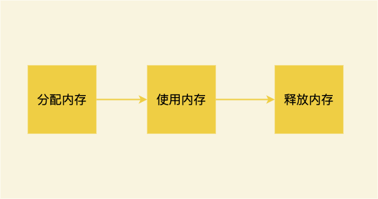
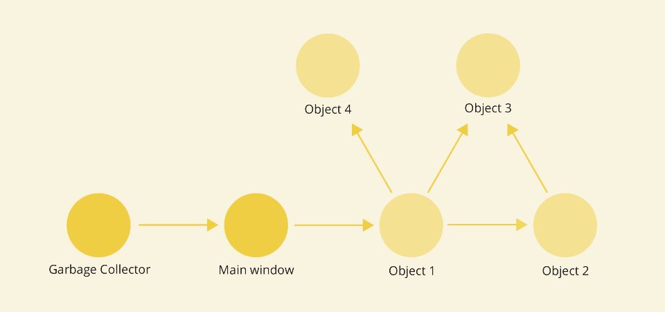
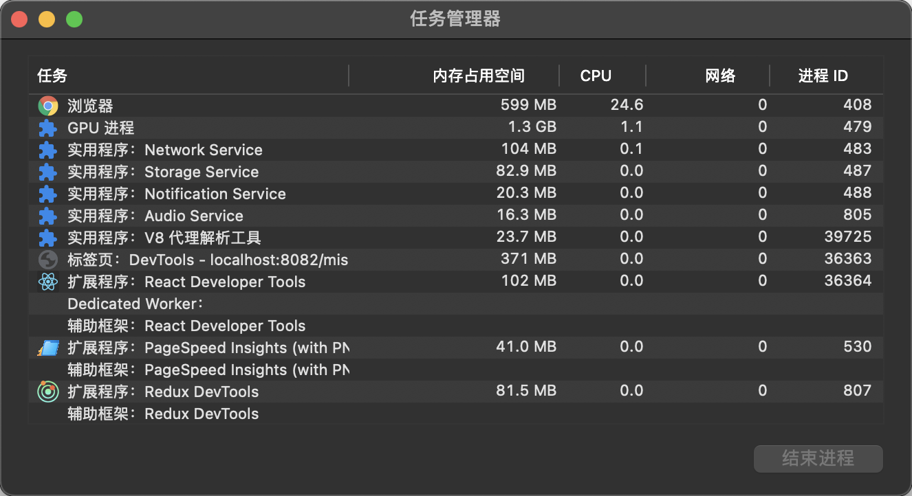
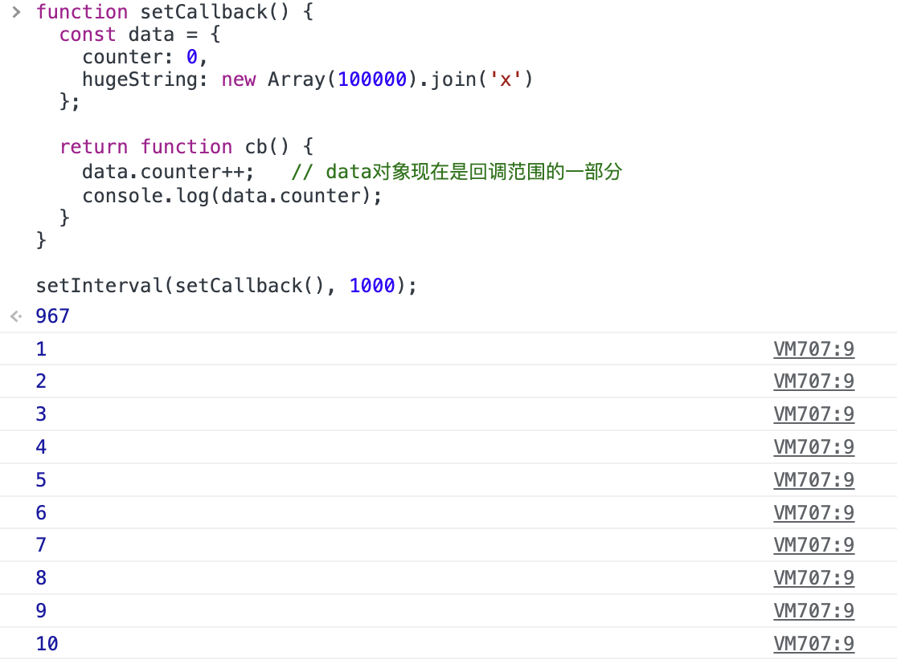
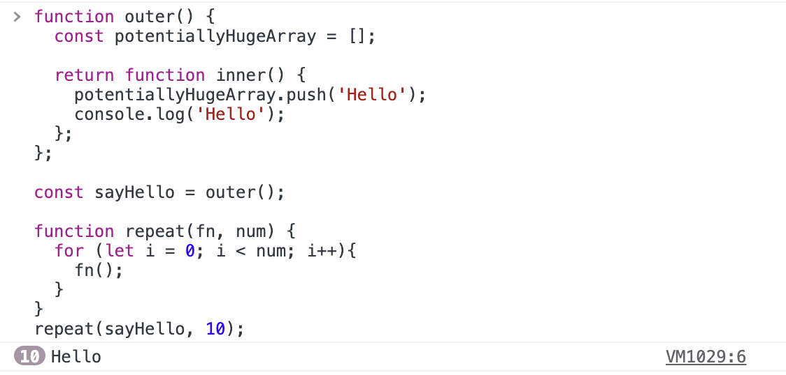
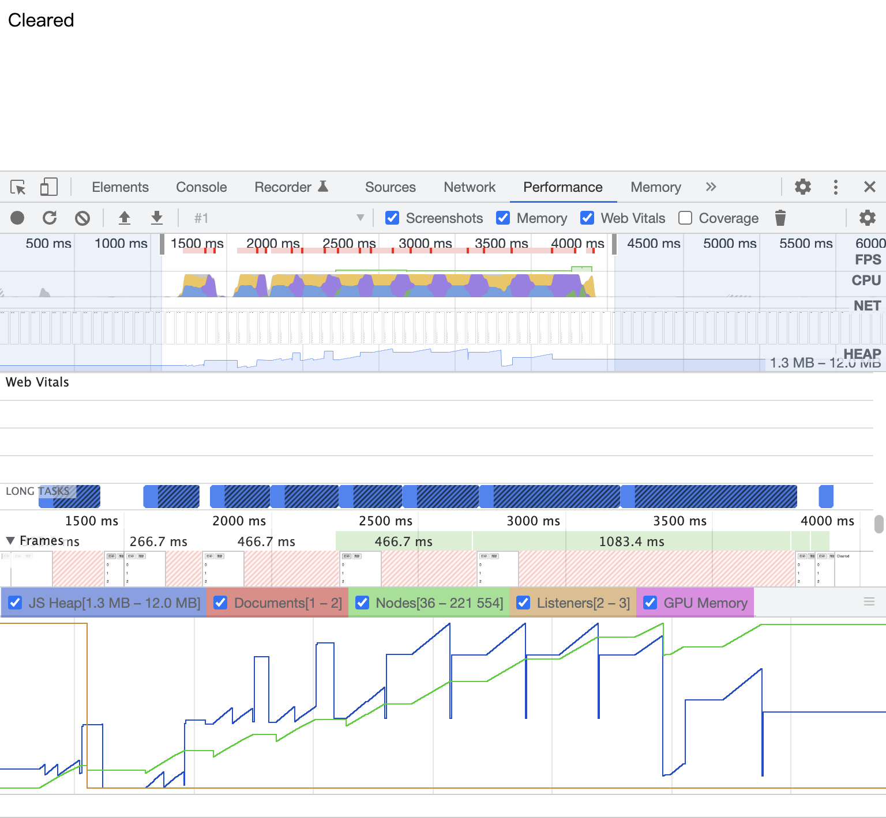
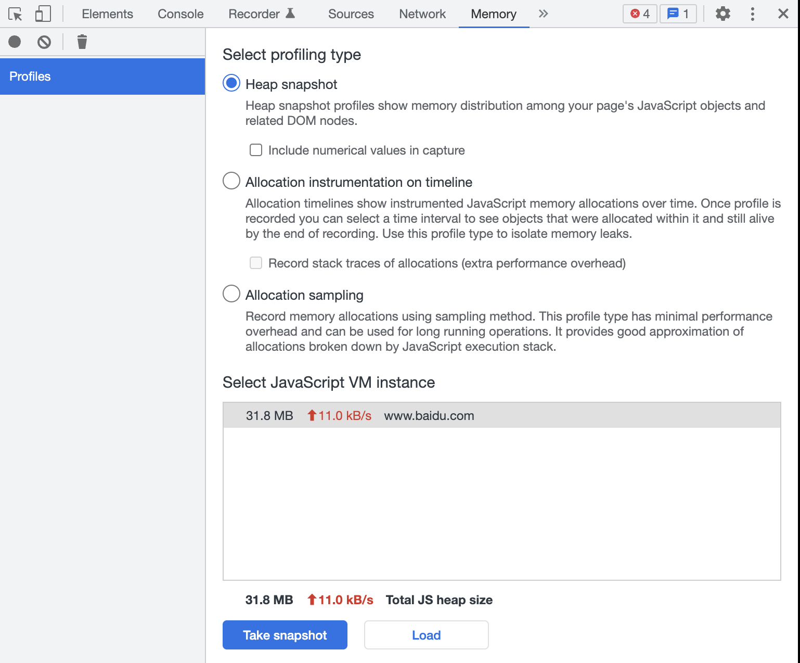
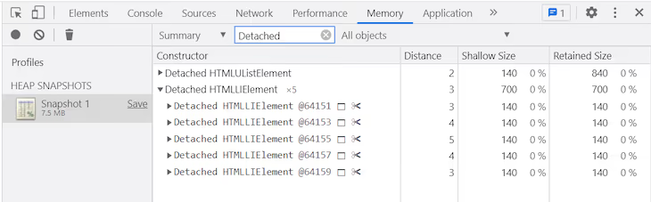

# 内存泄漏

SPA（单页应用程序）的兴起，促使我们更加关注与内存相关的 JavaScript 编码实践。如果应用使用的内存越来越多，就会严重影响性能，甚至导致浏览器的崩溃。下面就来看看JavaScript中常见的内存泄漏以及如何避免内存泄漏。

## 一、什么是内存泄漏？

JavaScript 就是所谓的垃圾回收语言之一，垃圾回收语言通过定期检查哪些先前分配的内存仍然可以从应用程序的其他部分“访问”来帮助开发人员管理内存。垃圾回收语言中泄漏的主要原因是不需要的引用。如果你的 JavaScript 应用程序经常发生崩溃、高延迟和性能差，那么一个潜在的原因可能是内存泄漏。

在 JavaScript 中，内存是有生命周期的：



* **分配内存**：内存由操作系统分配，允许程序使用它。在 JavaScript 中，分配内存是自动完成的。
* **使用内存：**这是程序实际使用先前分配的内存的空间。当在代码中使用分配的变量时，会发生**读取**和**写入操作。**
* **释放内存**：释放不需要的内存，这样内存就会空闲并可以再次利用。在 JavaScript 中，释放内存是自动完成的。

在JavaScript中，对象会保存在堆内存中，可以根据引用链从根访问它们。垃圾收集器是 JavaScript 引擎中的一个后台进程，用于识别无法访问的对象、删除它们并回收内存。

下面是垃圾收集器根到对象的引用链示例：



当内存中应该在垃圾回收周期中清理的对象，通过另一个对象的无意引用从根保持可访问时，就会发生内存泄漏。将冗余对象保留在内存中会导致应用程序内部使用过多的内存，并可能导致性能下降。

那该如何判断代码正在泄漏内存呢？通常，内存泄漏是很难被发现的，并且浏览器在运行它时不会抛出任何错误。如果注意到页面的性能越来越差，浏览器的内置工具可以帮助我们确定是否存在内存泄漏以及导致内存泄漏的对象。

内存使用检查最快的方法就是查看\*\*浏览器的任务管理器。\*\*它们提供了当前在浏览器中运行的所有选项卡和进程的概览。在任务管理器中查看每个选项卡的 JavaScript 内存占用情况。如果网站什么都不做，但是 JavaScript 内存使用量却在逐渐增加，那们很有可能发生了内存泄漏。



## 二、常见的内存泄漏

我们可以通过了解在 JavaScript 中如何创建不需要的引用来防止内存泄漏。以下情况就会导致不需要的引用。

### 1. 意外全局变量

全局变量始终可以从全局对象（在浏览器中，全局对象是window）中获得，并且永远不会被垃圾回收。在非严格模式下，以下行为会导致变量从局部范围泄露到全局范围：

#### （1）为未声明的变量赋值

这里我们给函数中一个未声明的变量bar赋值，这时就会使bar成为一个全局变量：

```javascript
function foo(arg) {
    bar = "hello world";
}
```

这就等价于：

```javascript
function foo(arg) {
    window.bar = "hello world";
}
```

这样就会创建一个多余的全局变量，当执行完foo函数之后，变量bar仍然会存在于全局对象中：

```javascript
foo()
window.bar   // hello world
```

#### （2）使用指向全局对象的 this。

使用以下方式也会创建一个以外的全局变量：

```javascript
function foo() {
    this.bar = "hello world";
}

foo();
```

这里`foo`是在全局对象中调用的，所以其`this`是指向全局对象的（这里是window）:

```javascript
window.bar   // hello world
```

我们可以通过使用严格模式“use strict”来避免这一切。在JavaScript文件的开头，它将开启更严格的JavaScript解析模式，从而防止意外的创建全局变量。

需要特别注意那些用于临时存储和处理大量信息的全局变量。如果必须使用全局变量存储数据，就使用全局变量存储数据，但在不再使用时，就手动将其设置为 null，或者在处理完后重新分配。否则的话，请尽可能的使用局部变量。

### 2. 计时器

使用 setTimeout 或 setInterval 引用回调中的某个对象是防止对象被垃圾收集的最常见方法。如果我们在代码中设置了循环计时器，只要回调是可调用的，计时器回调中对对象的引用就会保持活动状态。

在下面的示例中，只有在清除计时器后，才能对数据对象进行垃圾收集。由于我们没有对setInterval的引用，所以它永远无法被清除和删除数据。hugeString会一直保存在内存中，直到应用程序停止，尽管从未使用过。

```javascript
function setCallback() {
  const data = {
    counter: 0,
    hugeString: new Array(100000).join('x')
  };

  return function cb() {
    data.counter++;   // data对象是回调范围的一部分
    console.log(data.counter);
  }
}

setInterval(setCallback(), 1000); 
```

当执行这段代码时，就会每秒输出一个数字：

\
那我们如何去阻止他呢？尤其是在回调的寿命未定义或不确定的情况下：

* 修改计时器回调中引用的对象；
* 必要时使用从计时器返回的句柄（定时器的标识符）取消它。

```javascript
function setCallback() {
  // 将数据对象解包
  let counter = 0;
  const hugeString = new Array(100000).join('x'); // 在setCallback返回时被删除
  
  return function cb() {
    counter++; // 只有计数器counter是回调范围的一部分
    console.log(counter);
  }
}

const timerId = setInterval(setCallback(), 1000); // 保存定时器的ID

// 合适的时机清除定时器
clearInterval(timerId); 
```

### 3. 闭包

我们知道，函数范围内的变量在函数退出调用堆栈后，如果函数外部没有任何指向它们的引用，则会被清除。尽管函数已经完成执行，其执行上下文和变量环境早已消失，但闭包将保持变量的引用和活动状态。

```javascript
function outer() {
  const potentiallyHugeArray = [];

  return function inner() {
    potentiallyHugeArray.push('Hello');  
    console.log('Hello');
  };
};

const sayHello = outer();

function repeat(fn, num) {
  for (let i = 0; i < num; i++){
    fn();
  }
}
repeat(sayHello, 10);
```

显而易见，这里就形成了一个闭包。其输出结果如下：



这里，potentiallyHugeArray 永远不会从任何函数返回，也无法访问，但它的大小可能会无限增长，这取决于调用函数 inner() 的次数。

那该如何防止这个问题呢？闭包是不可避免的，也是JavaScript不可或缺的一部分，因此重要的是：

* 了解何时创建闭包以及闭包保留了哪些对象；
* 了解闭包的预期寿命和用法（尤其是用作回调时）。

### 4. 事件监听器

活动事件侦听器将防止在其范围内捕获的所有变量被垃圾收集。添加后，事件侦听器将一直有效，直到：

* 使用 removeEventListener() 显式删除
* 关联的 DOM 元素被移除。

对于某些类型的事件，它会一直保留到用户离开页面，就像应该多次单击的按钮一样。但是，有时我们希望事件侦听器执行一定次数。

```javascript
const hugeString = new Array(100000).join('x');

document.addEventListener('keyup', function() { // 匿名内联函数，无法删除它
  doSomething(hugeString); // hugeString 将永远保留在回调的范围内
});
```

在上面的示例中，匿名内联函数用作事件侦听器，这意味着不能使用 removeEventListener() 删除它。同样，document 不能被删除，因此只能使用 listener 函数以及它在其范围内保留的内容，即使只需要启动一次。

那该如何防止这个问题呢？一旦不再需要，我们应该通过创建指向事件侦听器的引用并将其传递给 removeEventListener() 来注销事件侦听器。

```javascript
function listener() {
  doSomething(hugeString);
}

document.addEventListener('keyup', listener); 
document.removeEventListener('keyup', listener);
```

如果事件侦听器只能执行一次，addEventListener() 可以接受第三个参数，这是一个提供附加选项的对象。假定将 {once:true} 作为第三个参数传递给 addEventListener() ，则侦听器函数将在处理一次事件后自动删除。

```javascript
document.addEventListener('keyup', function listener() {
  doSomething(hugeString);
}, {once: true}); 
```

### 5. 缓存

如果我们不断地将内存添加到缓存中，而不删除未使用的对象，并且没有一些限制大小的逻辑，那么缓存可以无限增长。

```javascript
let user_1 = { name: "Peter", id: 12345 };
let user_2 = { name: "Mark", id: 54321 };
const mapCache = new Map();

function cache(obj){
  if (!mapCache.has(obj)){
    const value = `${obj.name} has an id of ${obj.id}`;
    mapCache.set(obj, value);

    return [value, 'computed'];
  }

  return [mapCache.get(obj), 'cached'];
}

cache(user_1); // ['Peter has an id of 12345', 'computed']
cache(user_1); // ['Peter has an id of 12345', 'cached']
cache(user_2); // ['Mark has an id of 54321', 'computed']

console.log(mapCache); // {{…} => 'Peter has an id of 12345', {…} => 'Mark has an id of 54321'}
user_1 = null;

console.log(mapCache); // {{…} => 'Peter has an id of 12345', {…} => 'Mark has an id of 54321'}
```

在上面的示例中，缓存仍然保留 user\_1 对象。因此，我们需要将那些永远不会被重用的变量从缓存中清除。

可以使用 WeakMap 来解决此问题。它是一种具有弱键引用的数据结构，仅接受对象作为键。如果我们使用一个对象作为键，并且它是对该对象的唯一引用——相关变量将从缓存中删除并被垃圾收集。在以下示例中，将 user\_1 对象清空后，相关变量会在下一次垃圾回收后自动从 WeakMap 中删除。

```javascript
let user_1 = { name: "Peter", id: 12345 };
let user_2 = { name: "Mark", id: 54321 };
const weakMapCache = new WeakMap();

function cache(obj){
  // ...

  return [weakMapCache.get(obj), 'cached'];
}

cache(user_1); // ['Peter has an id of 12345', 'computed']
cache(user_2); // ['Mark has an id of 54321', 'computed']
console.log(weakMapCache); // {(…) => "Peter has an id of 12345", (…) => "Mark has an id of 54321"}
user_1 = null;

console.log(weakMapCache); // {(…) => "Mark has an id of 54321"}
```

### 6. 分离的DOM元素

如果DOM节点具有来自 JavaScript 的直接引用，它将防止对其进行垃圾收集，即使在从DOM树中删除该节点之后也是如此。

在下面的示例中，创建了一个div元素并将其附加到 document.body 中。removeChild() 就无法按预期工作，堆快照将显示分离的HTMLDivElement，因为仍有一个变量指向div。

```javascript
function createElement() {
  const div = document.createElement('div');
  div.id = 'detached';
  return div;
}

// 即使在调用deleteElement() 之后，它仍将继续引用DOM元素
const detachedDiv = createElement();

document.body.appendChild(detachedDiv);

function deleteElement() {
  document.body.removeChild(document.getElementById('detached'));
}

deleteElement();
```

要解决此问题，可以将DOM引用移动到本地范围。在下面的示例中，在函数appendElement() 完成后，将删除指向DOM元素的变量。

```javascript
function createElement() {...}

// DOM引用在函数范围内
function appendElement() {
  const detachedDiv = createElement();
  document.body.appendChild(detachedDiv);
}

appendElement();

function deleteElement() {
  document.body.removeChild(document.getElementById('detached'));
}

deleteElement(); 
```

## 三、识别内存泄漏

调试内存问题是一项复杂的工作，我们可以使用 Chrome DevTools 来识别内存图和一些内存泄漏，我们需要关注以下两个方面：

* 使用性能分析器可视化内存消耗；
* 识别分离的 DOM 节点。

### 1. 使用性能分析器可视化内存消耗

以下面的代码为例，有两个按钮：打印和清除。点击“打印”按钮，通过创建 paragraph 节点并将大字符串设置到全局，将1到10000的数字追加到DOM中。

“清除”按钮会清除全局变量并覆盖 body 的正文，但不会删除单击“打印”时创建的节点：

```html
<!DOCTYPE html>
<html lang="en">
  <head>
    <title>Memory leaks</title>
  </head>
  <body>
    <button id="print">打印</button>
    <button id="clear">清除</button>
  </body>
</html>
<script>
  var longArray = [];
  
  function print() {
    for (var i = 0; i < 10000; i++) {
      let paragraph = document.createElement("p");
      paragraph.innerHTML = i;
      document.body.appendChild(paragraph);
    }
    longArray.push(new Array(1000000).join("y"));
  }
  
  document.getElementById("print").addEventListener("click", print);
  document.getElementById("clear").addEventListener("click", () => {
    window.longArray = null;
    document.body.innerHTML = "Cleared";
  });
</script>
```

当每次点击打印按钮时，JavaScript Heap都会出现蓝色的峰值，并逐渐增加，这是因为JavaScript正在创建DOM节点并字符串添加到全局数组。当点击清除按钮时，JavaScript Heap就变得正常了。 除此之外，可以看到节点的数量（绿色的线）一直在增加，因为我们并没有删除这些节点。



在实际的场景中，如果观察到内存持续出现峰值，并且内存消耗一直没有减少，那可能存在内存泄露。

### 2. 识别分离的 DOM 节点

当一个节点从 DOM 树中移除时，它被称为分离，但一些 JavaScript 代码仍然在引用它。让我们使用下面的代码片段检查分离的 DOM 节点。通过单击按钮，可以将列表元素添加到其父级中并将父级分配给全局变量。简单来说，全局变量保存着 DOM 引用：

```javascript
var detachedElement;
function createList(){
  let ul = document.createElement("ul");
  for(let i = 0; i < 5; i++){
    ul.appendChild(document.createElement("li"));
  }
  detachedElement = ul;
}
document.getElementById("createList").addEventListener("click", createList);
```

我们可以使用 heap snapshot 来检查分离的DOM节点，可以在Chrome DevTools 的`Memory`面板中打开`Heap snapshots`选项：

\
点击页面的按钮后，点击下面蓝色的Take snapshot按钮，我们可以在中间的搜索栏目输入Detached来过滤结果以找到分离的DOM节点，如下所示：



当然也可以尝试使用此方法来识别其他内存泄漏。


> 更新: 2023-03-11 21:41:29  
> 原文: <https://www.yuque.com/cuggz/feplus/cqy8az>