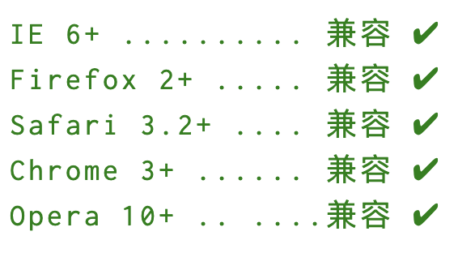
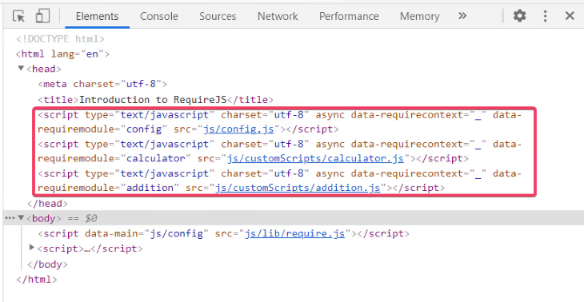
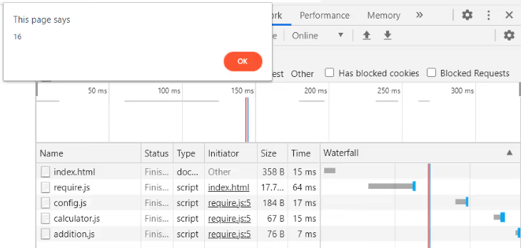
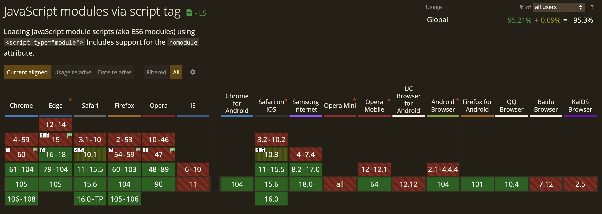

# 前端模块化

随着前端项目越来越大，代码复杂性不断增加，对于模块化的需求越来越大。模块化是工程化基础，只有将代码模块化，拆分为合理单元，才具备调度整合的能力。下面就来看看模块化的概念，以及不同模块化方案的使用方式和优缺点。

## 1. 模块概述

### （1）概念

由于代码之间会发生大量交互，如果结构不合理，这些代码就会变得难以维护、难以测试、难以调试。而使用模块化就解决了这些问题，模块化的**特点**如下：

* \*\*可重用性：\*\*当应用被组织成模块时，可以方便的在其他地方重用这些模块，避免编写重复代码，从而加快开发流程；
* **可读性：当**应用变得越来越复杂时，如果在一个文件中编写所有功能，代码会变得难以阅读。如果使用模块设计应用，每个功能都分布在各自的模块中，代码就会更加清晰、易读；
* \*\*可维护性：\*\*软件的美妙之处在于进化，从长远来看，我们需要不断为应用增加新的功能。当应用被结构化为模块时，可以轻松添加或删除功能。除此之外，修复错误也是软件维护的一部分，使用模块就可以更快速地定位问题。

模块化是一种将系统分离成独立功能部分的方法，可以将系统分割成独立的功能部分，严格定义模块接口，模块间具有透明性。通过将代码进行模块化分隔，每个文件彼此独立，开发者更容易开发和维护代码，模块之间又能够互相调用和通信，这就是现代化开发的基本模式。

### （2）模式

JavaScript 模块包含三个部分：

* \*\*导入：\*\*在使用模块时，需要将所需模块作为依赖项导入。例如，如果想要创建一个 React 组件，就需导入 react 模块。要使用像 Lodash 这样的工具库，就需要安装并导入它作为依赖项；
* \*\*代码：\*\*这一部分指的是模块的实际代码；
* \*\*导出：\*\*这一部分是模块的接口，从模块中导出的内容可供导入模块的任何地方使用。

### （3）类型

模块化的贯彻执行离不开相应的约定，即规范。这是能够进行模块化工作的重中之重。实现模块化的规范有很多，比如：AMD、RequireJS、CMD、SeaJS、UMD、CommonJS、ES6 Module。除此之外，IIFE（立即执行函数）也是实现模块化的一种方案。

本文将介绍其中的六个：

* \*\*IIFE：\*\*立即执行函数
* \*\*AMD：\*\*异步模块加载机制
* \*\*CMD：\*\*通用模块定义
* \*\*UMD：\*\*统一模块定义
* \*\*CommonJS：\*\*Node.js 采用该规范
* \*\*ES6 Module：\*\*内置的 JavaScript 模块系统

## 2. IIFE

在 ECMAScript 6 之前，模块并没有被内置到 JavaScript 中，因为 JavaScript 最初是为小型浏览器脚本设计的。这种模块化的缺乏，导致在代码的不同部分使用了共享全局变量。

比如，对于以下代码：

```javascript
var name = 'JavaScript';
var age = 20;
```

当上面的代码运行时，`name` 和 `age` 变量会被添加到全局对象中。因此，应用中的所有 JavaScript 脚本都可以访问全局变量 `name` 和 `age`，这就很容易导致代码错误，因为在其他不相关的单元中也可以访问和修改这些全局变量。除此之外，向全局对象添加变量会使全局命名空间变得混乱并增加了命名冲突的机会。

所以，我们就需要一种封装变量和函数的方法，并且只对外公开定义的接口。因此，为了实现模块化并避免使用全局变量，可以使用如下方式来创建模块：

```javascript
(function () {
    // 声明私有变量和函数
	
    return {
        // 声明公共变量和函数
    }
})();
```

上面的代码就是一个返回对象的闭包，这就是我们常说的IIFE（Immediately Invoked Function Expression），即立即执行函数。在该函数中，就创建了一个局部范围。这样就避免了使用全局变量（IIFE 是匿名函数），并且代码单元被封装和隔离。

可以这样来使用 IIFE 作为一个模块：

```javascript
var module = (function(){
  var age = 20;
  var name = 'JavaScript'
  
  var fn1 = function(){
    console.log(name, age)
  };
  
  var fn2 = function(a, b){
    console.log(a + b)
  };
  
  return {
    age,
    fn1,
    fn2,
  };
})();

module.age;           // 20
module.fn1();         // JavaScript 20
module.fn2(128, 64);  // 192
```

在这段代码中，`module` 就是我们定义的一个模块，它里面定义了两个私有变量 `age` 和 `name`，同时定义了两个方法 `fn1` 和 `fn2`，其中 `fn1` 中使用 `module` 中定义的私有变量，`fn2` 接收外部传入参数。最后，module 向外部暴露了`age`、`fn1`、`fn2`。这样就形成了一个模块。

当试图在 `module` 外部直接调用`fn1`时，就会报错：

```javascript
fn1(); // Uncaught ReferenceError: fn1 is not defined
```

当试图在 `module` 外部打印其内部的私有变量`name`时，得到的结果是 `undefined`：

```javascript
module.name; // undefined
```

上面的 IIFE 的例子是遵循模块模式的，具备其中的三部分，其中 age、name、fn1、fn2 就是模块内部的代码实现，返回的 age、fn1、fn2 就是导出的内容，即接口。调用 `module` 方法和变量就是导入使用。

## 3. CommonJS

### （1）概念

#### ① 定义

CommonJS 是社区提出的一种 JavaScript 模块化规范，它是为浏览器之外的 JavaScript 运行环境提供的模块规范，Node.js 就采用了这个规范。

> 注意：
>
> * 浏览器不支持使用 CommonJS 规范；
> * Node.js 不仅支持使用 CommonJS 来实现模块，还支持最新的  ES 模块。

CommonJS 规范加载模块是同步的，只有加载完成才能继续执行后面的操作。不过由于 Node.js 主要运行在服务端，而所需加载的模块文件一般保存在本地硬盘，所以加载比较快，而无需考虑使用异步的方式。

#### ② 语法

CommonJS 规范规定每个文件就是一个模块，有独立的作用域，对于其他模块不可见，这样就不会污染全局作用域。在 CommonJS 中，可以分别使用 `export` 和 `require` 来导出和导入模块。在每个模块内部，都有一个 `module` 对象，表示当前模块。通过它来导出 API，它有以下属性：

* `exports`：模块导出值。
* `filename`：模块文件名，使用绝对路径；
* `id`：模块识别符，通常是使用绝对路径的模块文件名；
* `loaded`：布尔值，表示模块是否已经完成加载；
* `parent`：对象，表示调用该模块的模块；
* `children`：数组，表示该模块要用到的其他模块；

#### ③ 特点

CommonJS 规范具有以下特点：

* 文件即模块，文件内所有代码都运行在独立的作用域，因此不会污染全局空间；
* 模块可以被多次引用、加载。第一次被加载时，**会被缓存**，之后都从缓存中直接读取结果。
* 加载某个模块，就是引入该模块的 `module.exports` 属性，该属性**输出的是值拷贝**，一旦这个值被输出，模块内再发生变化不会影响到输出的值。
* 模块加载顺序按照代码引入的顺序。

#### ④ 优缺点

CommonJS 的优点：

* 使用简单
* 很多工具系统和包都是使用 CommonJS 构建的；
* 在 Node.js 中使用，Node.js 是流行的 JavaScript 运行时环境。

CommonJS 的缺点

* 可以在 JavaScript 文件中包含一个模块；
* 如果想在 Web 浏览器中使用它，则需要额外的工具；
* 本质上是同步的，在某些情况下不适合在 Web 浏览器中使用。

### （2）使用

在 CommonJS 中，可以通过 require 函数来导入模块，它会读取、执行 JavaScript 文件，并返回该模块的 exports 对象，该对象只有在模块脚本运行完才会生成。

#### ① 模块导出

可以通过以下两种方式来导出模块内容：

```javascript
module.exports.TestModule = function() {
    console.log('exports');
}

exports.TestModule = function() {
    console.log('exports');
}
```

则合两种方式的导出结果是一样的，`module.exports`和`exports`的区别可以理解为：`exports`是`module.exports`的引用，如果在`exports`调用之前调用了`exports=...`，那么就无法再通过`exports`来导出模块内容，除非通过`exports=module.exports`重新设置`exports`的引用指向。

当然，可以先定义函数，再导出：

```javascript
function testModule() {
    console.log('exports');
}

module.exports = testModule;
```

这是仅导出一个函数的情况，使用时就是这样的：

```javascript
testModule = require('./MyModule');

testModule();
```

如果是导出多个函数，就可以这样：

```javascript
function testModule1() {
    console.log('exports1');
}

function testModule2() {
    console.log('exports2');
}
```

导入多个函数并使用：

```javascript
({testModule1, testModule2} = require('./MyModule'));

testModule1();
testModule2();
```

#### ② 模块导入

可以通过以下方式来导入模块：

```javascript
const module = require('./MyModule');
```

注意，如果 `require` 的路径没有后缀，会自动按照`.js`、`.json`和`.node`的顺序进行补齐查找。

#### ③ 加载过程

在  CommonJS 中，`require` 的加载过程如下：

1. 优先从缓存中加载；
2. 如果缓存中没有，检查是否是核心模块，如果是直接加载；
3. 如果不是核心模块，检查是否是文件模块，解析路径，根据解析出的路径定位文件，然后执行并加载；
4. 如果以上都不是，沿当前路径向上逐级递归，直到根目录的`node_modules`目录。

### （3）示例

下面来看一个购物车的例子，主要功能是将商品添加到购物车，并计算购物车商品总价格：

```javascript
// cart.js

var items = [];

function addItem (name, price) 
    item.push({
    name: name,
    price: price
  });
}

exports.total = function () {
    return items.reduce(function (a, b) {
      return a + b.price;
    }, 0);
};

exports.addItem = addItem;
```

这里通过两种方式在 exports 对象上定义了两个方法：addItem 和 total，分别用来添加购物车和计算总价。

下面在控制台测试一下上面定义的模块：

```javascript
let cart = require('./cart');
```

这里使用相对路径来导入 cart 模块，打印 cart 模块，结果如下：

```javascript
cart // { total: [Function], addItem: [Function: addItem] }
```

向购物车添加一些商品，并计算当前购物车商品的总价格：

```javascript
cart.addItem('book', 60);
cart.total()  // 60

cart.addItem('pen', 6);
cart.total()  // 66
```

这就是创建模块的基本方法，我们可以创建一些方法，并且只公开希望其他文件使用的部分代码。该部分成为 API，即应用程序接口。

这里有一个问题，只有一个购物车，即只有一个模块实例。下面来在控制台执行以下代码：

```javascript
second_cart = require('./cart');
```

那这时会创建一个新的购物车吗？事实并非如此，打印当前购物车的商品总金额，它仍然是66：

```javascript
second_cart.total();  // 66
```

当我们㤇创建多个实例时，就需要再模块内创建一个构造函数，下面来重写 `cart.js` 文件：

```javascript
// cart.js

function Cart () {
    this.items = [];
}

Cart.prototype.addItem = function (name, price) {
    this.items.push({
        name: name,
        price: price
    });
}

Cart.prototype.total = function () {
    return this.items.reduce(function(a, b) {
        return a + b.price;
    }, 0);
};

module.export = Cart;
```

现在，当需要使用此模块时，返回的是 Cart 构造函数，而不是具有 cart 函数作为一个属性的对象。下面来导入这个模块，并创建两个购物车实例：

```javascript
Cart = require('./second_cart');

cart1 = new Cart();
cart2 = new Cart();

cart1.addItem('book', 50);
cart1.total();   // 50
cart2.total();   // 50
```

## 4. AMD

### （1）概念

CommonJS 的缺点之一是它是同步的，AMD 旨在通过规范中定义的 API 异步加载模块及其依赖项来解决这个问题。AMD 全称为 Asynchronous Module Definition，即**异步模块加载机制**。它规定了如何定义模块，如何对外输出，如何引入依赖。

AMD规范重要特性就是异步加载。所谓异步加载，就是指同时并发加载所依赖的模块，当所有依赖模块都加载完成之后，再执行当前模块的回调函数。这种加载方式和浏览器环境的性能需求刚好吻合。

#### ① 语法

AMD 规范定义了一个全局函数 define，通过它就可以定义和引用模块，它有 3 个参数：

```javascript
define(id?, dependencies?, factory);
```

其包含三个参数：

* `id`：可选，指模块路径。如果没有提供该参数，模块名称默认为模块加载器请求的指定脚本的路径。
* `dependencies`：可选，指模块数组。它定义了所依赖的模块。依赖模块必须根据模块的工厂函数优先级执行，并且执行的结果应该按照依赖数组中的位置顺序以参数的形式传入工厂函数中。
* `factory`：为模块初始化要执行的函数或对象。如果是函数，那么该函数是单例模式，只会被执行一次；如果是对象，此对象应该为模块的输出值。

除此之外，要想使用此模块，就需要使用规范中定义的 require 函数：

```javascript
require(dependencies?, callback);
```

其包含两个参数：

* `dependencies`：依赖项数组；
* `callback`：加载模块时执行的回调函数。

有关 AMD API 的更详细说明，可以查看 GitHub 上的 AMD API 规范：<https://github.com/amdjs/amdjs-api/blob/master/AMD.md>。

#### ② 兼容性

该规范的浏览器兼容性如下：



#### ③ 优缺点

AMD 的**优点**：

* 异步加载导致更好的启动时间；
* 能够将模块拆分为多个文件；
* 支持构造函数；
* 无需额外工具即可在浏览器中工作。

AMD 的**缺点**：

* 语法很复杂，学习成本高；
* 需要一个像 RequireJS 这样的加载器库来使用 AMD。

### （2）使用

当然，上面只是 AMD 规范的理论，要想理解这个理论在代码中是如何工作的，就需要来看看 AMD 的实际实现。RequireJS 就是 AMD 规范的一种实现，它被描述为“JavaScript 文件和模块加载器”。下面就来看看 RequireJS 是如何使用的。

#### ① 引入RequireJS

可以通过 npm 来安装 RequireJS：

```shell
npm i requirejs
```

也可以在 html 文件引入 `require.js` 文件：

```html
<script data-main="js/config" src="js/require.js"></script>
```

这里 `script`标签有两个属性：

* `data-main="js/config"`：这是 RequireJS 的入口，也是配置它的地方；
* `src="js/require.js"`：加载脚本的正常方式，会加载 `require.js` 文件。

在 `script` 标签下添加以下代码来初始化 RequireJS：

```html
<script>
    require(['config'], function() {
        //...
    })
</script>
```

当页面加载完配置文件之后， `require()` 中的代码就会运行。这个 `script` 标签是一个异步调用，这意味着当 RequireJS 通过 `src="js/require.js` 加载时，它将异步加载 `data-main` 属性中指定的配置文件。因此，该标签下的任何 JavaScript 代码都可以在 RequireJS 获取时执行配置文件。

那 AMD 中的 `require()` 和 CommonJS 中的 `require()` 有什么区别呢？

* AMD `require(`) 接受一个依赖数组和一个回调函数，CommonJS `require()` 接受一个模块 ID；
* AMD `require()` 是异步的，而 CommonJS `require()` 是同步的。

#### ② 定义 AMD 模块

下面是 AMD 中的一个基本模块定义：

```javascript
define(['dependency1', 'dependency2'], function() {
  // 模块内容
});
```

这个模块定义清楚地显示了其包含两个依赖项和一个函数。

下面来定义一个名为`addition.js`的文件，其包含一个执行加法操作的函数，但是没有依赖项：

```javascript
// addition.js
define(function() {
    return function(a, b) {
        alert(a + b);
    }
});
```

再来定义一个名为 `calculator.js` 的文件：

```javascript
define(['addition'], function(addition) {
    addition(7, 9);
});
```

当 RequireJS 看到上面的代码块时，它会去寻找依赖项，并通过将它们作为参数传递给函数来自动将其注入到模块中。

RequireJS 会自动为 `addition.js` 和 `calculator.js` 文件创建一个 `<script>` 标签，并将其放在HTML `<head>` 元素中，等待它们加载，然后运行函数，这类似于 `require()` 的行为。



下面来更新一下 `index.html` 文件：

```javascript
// index.html
require(['config'], function() {
    require(['calculator']);
});
```

当浏览器加载 `index.html` 文件时，RequireJS 会尝试查找 `calculator.js` 模块，但是没有找到，所以浏览器也不会有任何反应。那该如何解决这个问题呢？我们必须提供配置文件来告诉 RequireJS 在哪里可以找到 `calculator.js`（和其他模块），因为它是引用的入口。

下面是配置文件的基本结构：

```javascript
requirejs.config({
    baseURL: "string",
    paths: {},
    shim: {},
});
```

这里有三个属性值：

* `baseURL`：告诉 RequireJS 在哪里可以找到模块；
* `path`：这些是与 define() 一起使用的模块的名称。 在路径中，可以使用文件的 CDN，这时 RequireJS 将尝试在本地可用的模块之前加载模块的 CDN 版本；
* `shim`：允许加载未编写为 AMD 模块的库，并允许以正确的顺序加载它们

我们的配置文件如下：

```javascript
requirejs.config({
    baseURL: "js",
    paths: {
        // 这种情况下，模块位于 customScripts 文件中
        addition: "customScripts/addition",
        calculator: "customScripts/calculator",
    },
});
```

配置完成之后，重新加载浏览器，就会收到浏览器的弹窗：



这就是在 AMD 中使用 RequireJS 定义模块的方法之一。我们还可以通过指定其路径名来定义模块，该路径名是模块文件在项目目录中的位置。 下面给出一个例子：

```javascript
define("path/to/module", function() {
    // 模块内容
})
```

当然，RequireJS 并不鼓励这种方法，因为当我们将模块移动到项目中的另一个位置时，就需要手动更改模块中的路径名。

在使用 AMD 定义模块时需要注意：

* 在依赖项数组中列出的任何内容都必须与工厂函数中的分配相匹配；
* 尽量不要将异步代码与同步代码混用。当在 index.html 上编写其他 JavaScript 代码时就是这种情况。

## 5. CMD

CMD 全称为 Common Module Definition，即通用模块定义。CMD 规范整合了 CommonJS 和 AMD 规范的特点。sea.js 是 CMD 规范的一个实现 。

CMD 定义模块也是通过一个全局函数 `define` 来实现的，但只有一个参数，该参数既可以是函数也可以是对象：

```javascript
define(factory);
```

如果这个参数是对象，那么模块导出的就是对象；如果这个参数为函数，那么这个函数会被传入 3 个参数：

```javascript
define(function(require, exports, module) {
  //...
});
```

这三个参数分别如下：

（1）`require`：一个函数，通过调用它可以引用其他模块，也可以调用 `require.async` 函数来异步调用模块；

（2）`exports`：一个对象，当定义模块的时候，需要通过向参数 `exports` 添加属性来导出模块 API；

（3）`module` 是一个对象，它包含 3 个属性：

* `uri`：模块完整的 URI 路径；
* `dependencies`：模块依赖；
* `exports`：模块需要被导出的 API，作用同第二个参数 `exports`。

下面来看一个例子，定义一个 `increment` 模块，引用 `math` 模块的 `add` 函数，经过封装后导出成 `increment` 函数：

```javascript
define(function(require, exports, module) {
  var add = require('math').add;
  exports.increment = function(val) {
    return add(val, 1);
  };
  module.id = "increment";
});
```

CMD 最大的特点就是懒加载，不需要在定义模块的时候声明依赖，可以在模块执行时动态加载依赖。除此之外，CMD 同时支持**同步加载模块**和**异步加载模块**。

**AMD 和 CMD 的两个主要区别如下：**

* AMD 需要异步加载模块，而 CMD 在加载模块时，可以同步加载（`require`），也可以异步加载（`require.async`）。
* CMD 遵循依赖就近原则，AMD 遵循依赖前置原则。也就是说，在 AMD 中，需要把模块所需要的依赖都提前在依赖数组中声明。而在 CMD 中，只需要在具体代码逻辑内，使用依赖前，把依赖的模块 `require` 进来。

## 6. UMD

UMD 全程为 Universal Module Definition，即**统一模块定义**。其实 UMD 并不是一个模块管理规范，而是带有前后端同构思想的模块封装工具。

UMD 是一组同时支持 AMD 和 CommonJS 的模式，它旨在使代码无论执行代码的环境如何都能正常工作，通过 UMD 可以在合适的环境选择对应的模块规范。比如在 Node.js 环境中采用 CommonJS 模块管理，在浏览器环境且支持 AMD 的情况下采用 AMD 模块，否则导出为全局函数。

一个UMD模块由两部分组成：

* **立即调用函数表达式 (IIFE)**：它会检查使用模块的环境。其有两个参数：`root` 和 `factory`。 `root` 是对全局范围的 this 引用，而 `factory` 是定义模块的函数。
* \*\*匿名函数：\*\*创建模块，此匿名函数被传递任意数量的参数以指定模块的依赖关系。

UMD 的代码实现如下：

```javascript
(function (root, factory) {
  if (typeof define === 'function' && define.amd) {
    define([], factory);
  } else if (typeof exports === 'object') {
    module.exports,
    module.exports = factory();
  } else {
    root.returnExports = factory();
  }
}(this, function () {
  // 模块内容定义
  return {};
}));
```

它的执行过程如下：

1. 先判断是否支持 Node.js 模块格式（exports 是否存在），存在则使用 Node.js 模块格式；
2. 再判断是否支持 AMD（define 是否存在），存在则使用 AMD 方式加载模块；
3. 若两个都不存在，则将模块公开到全局（Window 或 Global）。

**UMD的特点如下：**

① UMD 的优点：

* 小而简洁；
* 适用于服务器端和客户端。

② UMD 的缺点：

* 不容易正确配置。

## 7. ES 模块

### （1）概念

通过上面的例子，你可能会发现，使用 UMD、AMD、CMD 的代码会变得难以编写和理解。于是在 2015 年，负责 ECMAScript 规范的 TC39 委员会将模块添加为 JavaScript 的内置功能，这些模块称为 ECMAScript模块，简称 ES 模块。

模块和经典 JavaScript 脚本略有不同：

* 模块默认启用\*\*严格模式，\*\*比如分配给未声明的变量会报错：

```javascript
<script type="module">
  a = 5; 
</script>
```

* 模块有一个词法顶级作用域。 这意味着，例如，运行 var foo = 42; 在模块内不会创建名为 foo 的全局变量，可通过浏览器中的 window.foo 访问，尽管在经典JavaScript脚本中会出现这种情况；

```javascript
<script type="module">
  let person = "Alok";
</script>

<script type="module">
   alert(person);{/* Error: person is not defined */}
</script>
```

* 模块中的 this 并不引用全局 this，而是 undefined。 （如果需要访问全局 this，可以使用 globalThis）；

```javascript
<script>
  alert(this); {/* 全局对象 */}
</script>

<script type="module">
  alert(this); {/* undefined */}
</script>
```

* 新的静态导入和导出语法仅在模块中可用，并不适用于经典脚本。
* 顶层 await 在模块中可用，但在经典 JavaScript 脚本中不可用；
* await 不能在模块中的任何地方用作变量名，经典脚本中的变量可以在异步函数之外命名为 await；
* <font style="color:rgb(10, 10, 35);">JavaScript 会</font>提升 <font style="color:rgb(10, 10, 35);">import 语句。因此，可以在模块中的任何位置定义它们。</font>

CommonJS 和 AMD 都是在运行时确定依赖关系，即运行时加载，CommonJS 加载的是拷贝。而 ES 模块是在编译时就确定依赖关系，所有加载的其实都是引用，这样做的好处是可以执行静态分析和类型检查。

### （2）语法

#### ① 导出

当导出模块代码时，需要在其前面添加 export 关键词。导出内容可以是变量、函数或类。任何未导出的代码都是模块私有的，无法在该模块之被外访问。ES 模块支持两种类型的导出：

* **命名导出：**

```javascript
export const first = 'JavaScript';
export function func() {
    return true;
}
```

当然，我们也可以先定义需要导出的变量/函数，最后统一导出这些变量/函数：

```javascript
const first = 'JavaScript';
const second = 'TypeScript';
function func() {
    return true;
}
export {first, second, func};
```

* **默认导出：**

```javascript
function func() {
    return true;
}

export default func;
```

当然，也可以直接默认导出：

```javascript
export default function func() {
    return true;
}
```

默认导出可以省略变量/函数/类名，在导入时可以为其指定任意名称：

```javascript
// 导出
export default function () {
  console.log('foo');
}
// 导入
import customName from './module';
```

\*\*注意：\*\*导入默认模块时不需要大括号，导出默认的变量或方法可以有名字，但是对外是无效的。`export default` 在一个模块文件中只能使用一次。

可以使用 as 关键字来重命名需要暴露出的变量或方法，经过重命名后同一变量可以多次暴露出去：

```javascript
const first = 'test';
export {first as second};
```

#### ② 导入

使用**命名导出**的模块，可以通过以下方式来导入：

```javascript
import {first, second, func} from './module';
```

使用**默认导出**的模块，可以通过以下方式来引入，导入名称可以自定义，无论导出的名称是什么：

```javascript
import customName from './module.js';
```

导入模块位置可以是相对路径也可以是绝对路径，`.js`扩展名是可以省略的，如果不带路径而只是模块名，则需要通过配置文件告诉引擎查找的位置：

```javascript
import {firstName, lastName} from './module';
```

可以使用 as 关键字来将导入的变量/函数重命名：

```javascript
import { fn as fn1 } from './profile';
```

在 ES 模块中，默认导入和命名导入是可以同时使用的，比如在 React 组件中：

```javascript
import React, {usestate, useEffect} from 'react';

const Comp = () => {
	return <React.Fragment>...</React.Fragment> 
}

export default Comp;
```

可以使用 as 关键字来加载整个模块，用于从另一个模块中导入所有命名导出，会忽略默认导出：

```javascript
import * as circle from './circle';
console.log('圆面积：' + circle.area(4));
console.log('圆周长：' + circle.circumference(14));
```

#### ③ 动态导入

上面我们介绍的都是静态导入，使用静态 import 时，整个模块需要先下载并执行，然后主代码才能执行。有时我们不想预先加载模块，而是按需加载，仅在需要时才加载。这可以提高初始加载时的性能，动态 import 使这成为可能：

```html
<script type="module">
  (async () => {
    const moduleSpecifier = './lib.mjs';
    const {repeat, shout} = await import(moduleSpecifier);
    repeat('hello');
    // → 'hello hello'
    shout('Dynamic import in action');
    // → 'DYNAMIC IMPORT IN ACTION!'
  })();
</script>
```

与静态导入不同，动态导入可以在常规脚本中使用。

#### ④ 其他用法

可以使用以下方式来先导入后导出模块内容：

```javascript
export { foo, bar } from './module';
```

上面的代码就等同于：

```javascript
import { foo, bar } from './module';
export { foo, boo};
```

另一个与模块相关的新功能是`import.meta`，它是一个给 JavaScript 模块暴露特定上下文的元数据属性的对象。它包含了这个模块的信息，比如说这个模块的 URL。

默认情况下，图像是相对于 HTML 文档中的当前 URL 加载的。`import.meta.url`可以改为加载相对于当前模块的图像：

```javascript
function loadThumbnail(relativePath) {
  const url = new URL(relativePath, import.meta.url);
  const image = new Image();
  image.src = url;
  return image;
}

const thumbnail = loadThumbnail('../img/thumbnail.png');
container.append(thumbnail);
```

### （3）在浏览器使用

目前主流浏览器都支持 ES 模块：



如果想在浏览器中使用原生 ES 模块方案，只需要在 script 标签上添加 `type="module"` 属性。通过该属性，浏览器知道这个文件是以模块化的方式运行的。而对于不支持的浏览器，需要通过 `nomodule` 属性来指定某脚本为 fallback 方案：

```html
<script type="module">
  import module1 from './module1'
</script>
<script nomodule src="fallback.js"></script>
```

支持 `type="module"` 的浏览器会忽略带有 `nomodule` 属性的脚本。使用 `type="module"` 的另一个作用就是进行 ES Next 兼容性的嗅探。因为支持 ES 模块化的浏览器，都支持 ES Promise 等特性。

由于默认情况下模块是延迟的，因此可能还希望以延迟方式加载 nomodule 脚本：

```html
<script nomodule defer src="fallback.js"></script>
```

### （4）在 Node.js 使用

上面提到，Node.js 使用的是 CommonJS 模块规范，它也是支持 ES 模块的。在 Node.js 13 之前，ES 模块是一项实验性技术，因此，可以通过使用 `.mjs` 扩展名保存模块并通过标志访问它来使用模块。

从 Node.js 13 开始，可以通过以下两种方式使用模块:

* 使用 `.mjs` 扩展名保存模块；
* 在最近的文件夹中创建一个 `type="module"` 的 `package.json` 文件。

那如何在小于等于 12 版本的 Node.js 中使用 ES 模块呢？可以在执行脚本启动时加上 `--experimental-modules`，不过这一用法要求相应的文件后缀名必须为 `.mjs`：

```javascript
node --experimental-modules module1.mjs
import module1 from './module1.mjs'
module1
```


> 更新: 2023-03-11 21:28:18  
> 原文: <https://www.yuque.com/cuggz/feplus/rmyt74>