# 字符编码

在开发过程中经常会遇到各种各样的编码，常见的有 UTF－8、Unicode、Base64 等，但前端世界远不止这三种编码，本文就来介绍前端常见的编码以及其使用方式。

## ASCII

我们知道，计算机只能理解二进制，二进制语言是面向机器的语言，直接来自计算机的指令系统，由 0 和 1 组成。它使用整数来编码数字（0-9）、大写字母（A-Z）、小写字母（A-Z）以及分号（；）、感叹号（！）等。例如，97 用于表示“a”，33用于表示“！”，这样就可以方便地存储在内存中。

互联网的早期只有英文字母，所以不需要担心任何其他字符，ASCII 就可以适用于这种情况的字符编码，例如 bits 对应的二进制如下：

```javascript
01100010 01101001 01110100 01110011
   b        i        t        s
```

ASCII  全称为 American Standard Code for Information Interchange，即“美国信息交换标准代码”，是基于拉丁字母的一套电脑编码系统。ASCII 至今为止共定义了 128 个字符：

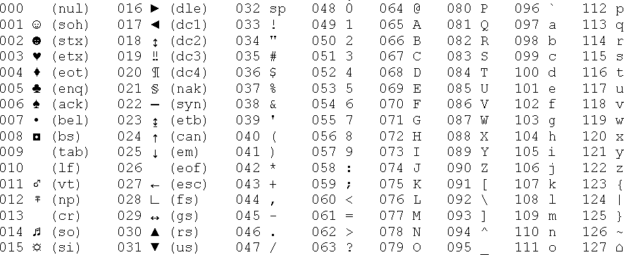

ASCII 可以分为两类：

* **可显示字符**：编号范围是32-126（0x20-0x7E），共 95 个字符：

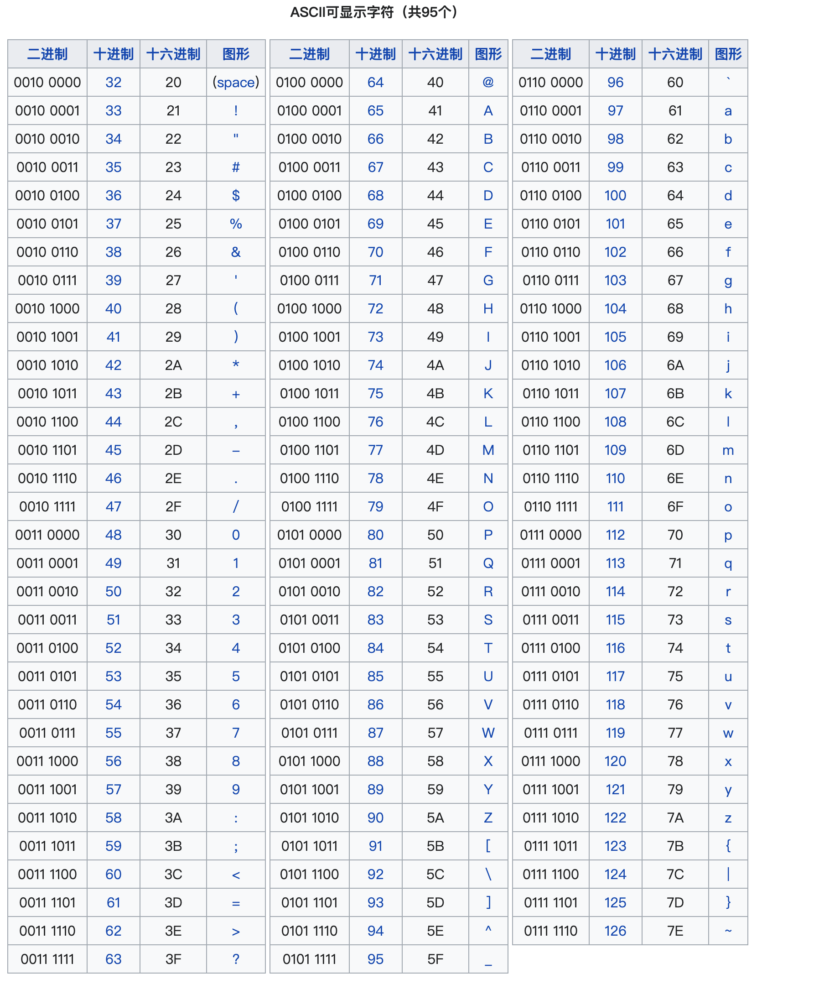

* **控制字符**：编号范围是0-31和127（0x00-0x1F和0x7F），共 33 个字符：

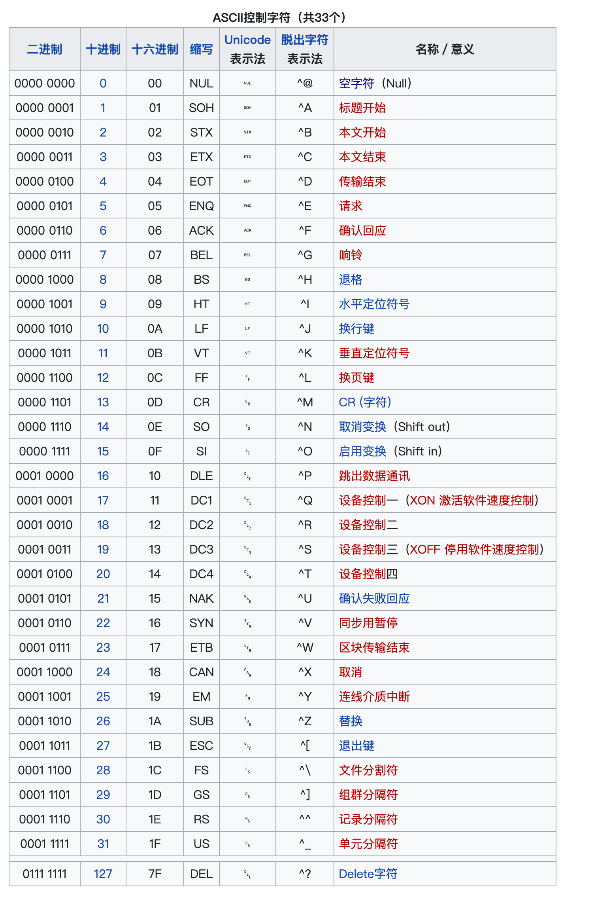

可以看到，ASCII 码实际上是一种映射，是从二进制字符到字母数字字符的映射。所以当计算机收到以下二进制文件时：

```javascript
01001000 01100101 01101100 01101100 01101111 00100000 01110111 01101111 01110010 01101100 01100100
```

使用 ASCII 码进行映射，上面的二进制编码可以翻译成“Hello world”。

“K” 在ASCII 中是75，可以将它转化为二进制，将 75 除以 2，然后继续，直到得到 0。如果除法不准确，则加 1 作为余数：

```css
75 / 2 = 37 + 1
37 / 2 = 18 + 1
18 / 2 =  9 + 0
9 / 2 =   4 + 1
4 / 2 =   2 + 0
2 / 2 =   1 + 0
1 / 2 =   0 + 1
```

现在，提取“余数”并以相反的顺序放入它们：

```css
1101001 => 1001011 
```

因此，在 ASCII 中，“K”在二进制中被编码为 1001011。

ASCII 的主要缺点是它只能表示 256 个不同的字符，因为它只能使用 8 位。ASCII 不能用于对世界各地发现的许多类型的字符进行编码。但是如果想在计算机上使用中文、俄语、日语时，就需要一个不同的编码标准。Unicode 进一步扩展为 UTF-8、UTF-16、UTF-32以对各种类型的字符进行编码。因此，**ASCII 和 Unicode 之间的主要区别就是用于编码的位数**。下面就来看看 Unicode 的概念以及使用方式。

## Unicode

Unicode 是另一种字符编码，它仍然是：位查找 -> 字符，由 Unicode Consortium 维护，其负责制定国际使用的软件标准。IT 行业将 Unicode 标准化以对计算机和其他电子和通信设备中的字符进行编码和表示。

Unicode 由许多代码点组成（将来自世界各地的大量字符映射到所有计算机都可以引用的键），代码点的集合称为字符集，这就是 Unicode。开发 Unicode 的目标是通过一种独特的方式将世界上任何语言的任何字符或符号转换成唯一的数字。可以在 [unicode.org](https://home.unicode.org/) 上查找任何 Unicode 字符的编号，包括表情符号！

Unicode 看起来像这样：

```css
U+0048：拉丁文大写字母 H
U+0065：拉丁文小写字母 e
U+006C：拉丁文小写字母 l
U+006C：拉丁文小写字母 l
U+006F：拉丁文小写字母 o
U+0020：空格 [SP]
U+0057：拉丁文大写字母 W
U+006F：拉丁文小写字母 o
U+0072：拉丁文小写字母 r
U+006C：拉丁文小写字母 l
U+0064：拉丁文小写字母 d
```

可以使用以下格式在 JavaScript 字符串中添加 unicode 序列 \uXXXX：

```css
const s1 = '\u00E9' //é
```

可以通过组合两个 unicode 序列来创建一个序列：

```css
const s2 = '\u0065\u0301' //é
```

虽然两个字符串的结果都是 é，但它们是两个不同的字符串，并且长度也不相同：

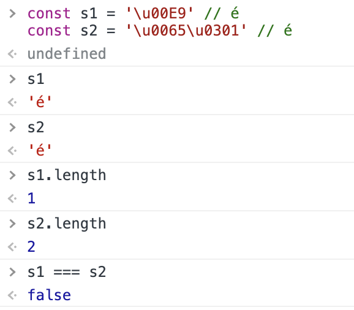

ASCII 和 Unicode 是两种流行的编码方案。ASCII 编码符号、数字、字母等，而 Unicode 编码来自不同语言、字母、符号等的特殊文本，可以说 **ASCII 是 Unicode 编码方案的一个子集**。它们两个的区别如下：

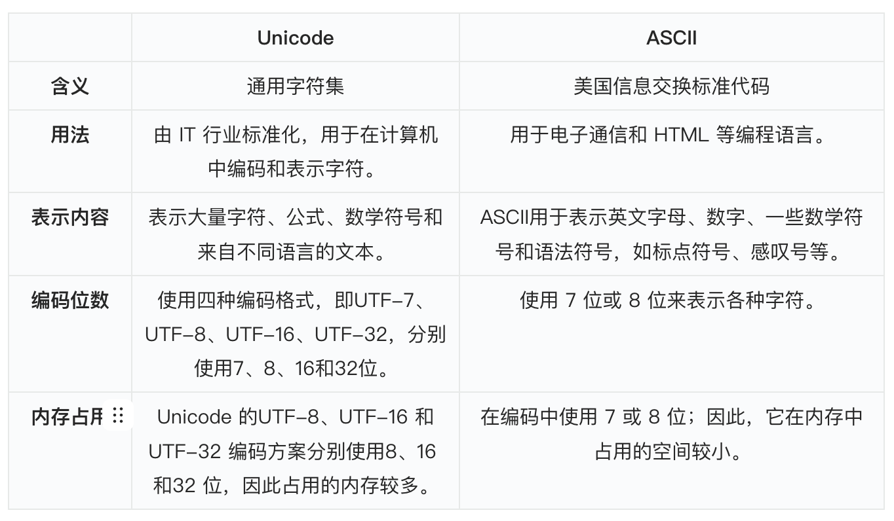

## UTF-8、UTF-16、UTF-32

#### （1）基本概念

**UTF 是 Unicode 编码方式的一种**。UTF 编码由 Unicode 标准定义，能够对需要的每个 Unicode 代码点进行编码。Unicode 编码方案根据用于对字符进行编码的位数进行分类。目前使用的 Unicode 编码方案有 UTF-7、UTF-8、UTF-16 和 UTF-32 ，分别使用 7 位、8 位、16 位和 32 位来表示字符。

那如何知道文件将使用哪种编码呢？有一种称为字节顺序标记(BOM，即 Byte Order Mark) 的东西，也称为编码签名。BOM是文件开头的一个两字节标记，用于标识文件是采用哪种格式的编码。

\*\*UTF-8 \*\*在互联网上使用最多，在 HTML5 中也被指定为文档的首选编码，所以下面将主要介绍 UTF-8。

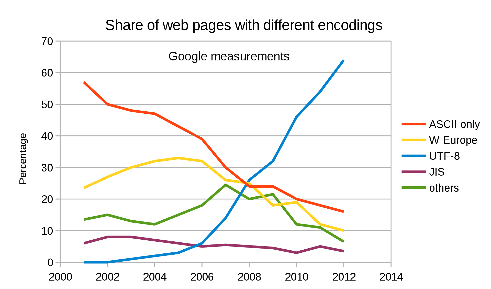

UTF-8 将 0-127 的所有 Unicode 代码点编码为 1 个字节（与ASCII相同）。这意味着如果使用 ASCII 对程序进行编码，而用户使用 UTF-8，将不会有任何错误。1993年创建 UTF-8 时，很多数据都是 ASCII 格式的，所以通过兼容 UTF-8，在使用前不需要对数据进行转换。本质上，ASCII 格式的文件可以被视为 UTF-8 格式，而且可以正常工作。

#### （2）工作原理

下面来详细看看 UTF-8 是如何工作的，以及为什么它会根据被编码的字符具有不同的长度。

UTF-8 以**动态方式**存储数字。Unicode 列表中的第一个占用 1 个字节，最后一个最多占用 4 个字节，如果处理的是英文文件，大多数字符可能只占用 1 个字节，与 ASCII 中的相同。**这是通过用不同的字节数覆盖 Unicode 中的不同范围来实现的**。

例如，要编码原始 ASCII 表中的字符（0-127），只需要 7 位，因为 2<sup>7</sup>= 128。因此，可以将所有内容存储在 8 位的 1 字节中，并且仍然剩余一个空闲空间。而对于下一个范围（128-2047），就需要 11 bits，因为2<sup>11</sup>＝2048，在 UTF-8 中就是 2 个字节。

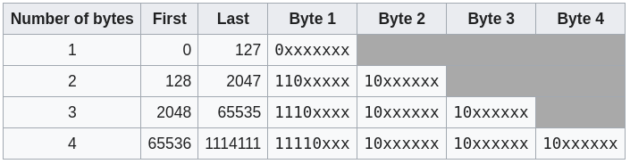

计算机在读取 UTF-8 中以 0 开头的内容时，就知道只需要读取一个字节并显示 Unicode 中 0-127 范围内的正确字符即可。如果遇到两个 1，就需要读取 2 个字节，范围为128-2047，3 个 1 在一起表示需要读取三个字节。

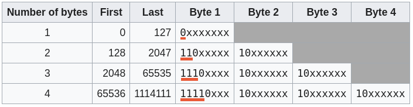

#### （3）UTF-16、UTF-32

世界范围内使用的大量字符是无法全部使用 8 位表示法进行编码，导致在 Unicode 编码下产生了 UTF-16 和 UTF-32 编码格式。在解释这些编码格式之前，先来看看平面的概念：

> Unicode 编码中有很多很多的字符，它并不是一次性定义的，而是分区进行定义的，每个区存放65536（2<sup>16</sup>）个字符，这称为一个平面，目前总共有17 个平面。最前面的一个平面称为基本平面，它的码点从0 — 2<sup>16</sup>-1，写成16进制就是U+0000 — U+FFFF，那剩下的16个平面就是辅助平面，码点范围是 U+10000—U+10FFFF。

UTF-16 是 Unicode 编码集的一种编码形式，把 Unicode 字符集的抽象码位映射为16位长的整数（即码元）的序列，用于数据存储或传递。Unicode字符的码位需要1个或者2个16位长的码元来表示，因此UTF-16也是用变长字节表示的。

**UTF-16 编码规则：**

* 编号在 U+0000—U+FFFF 的字符（常用字符集），直接用两个字节表示。
* 编号在 U+10000—U+10FFFF 之间的字符，需要用四个字节表示。

那么问题来了，当遇到两个字节时，怎么知道是把它当做一个字符还是和后面的两个字节一起当做一个字符呢？

UTF-16 编码肯定也考虑到了这个问题，在基本平面内，从 U+D800 — U+DFFF 是一个空段，也就是说这个区间的码点不对应任何的字符，因此这些空段就可以用来映射辅助平面的字符。

辅助平面共有 220 个字符位，因此表示这些字符至少需要 20 个二进制位。UTF-16 将这 20 个二进制位分成两半，前 10 位映射在 U+D800 — U+DBFF，称为高位（H），后 10 位映射在 U+DC00 — U+DFFF，称为低位（L）。这就相当于，将一个辅助平面的字符拆成了两个基本平面的字符来表示。

因此，当我们遇到两个字节时，发现它的码点在 U+D800 —U+DBFF之间，就可以知道，它后面的两个字节的码点应该在 U+DC00 — U+DFFF 之间，这四个字节必须放在一起进行解读。

UTF-32 就是字符所对应编号的整数二进制形式，每个字符占四个字节，这个是直接进行转换的。该编码方式占用的储存空间较多，所以使用较少。比如“马” 字的 Unicode 编号是：U+9A6C，整数编号是39532，直接转化为二进制：1001 1010 0110 1100，这就是它的 UTF-32 编码。

#### （4）指定编码方式

如果没有显式指定编码方式，浏览器假定任何程序的源代码都是用本地字符集编写的，这会因国家/地区而异，可能会出现意料之外的情况。因此，给 JavaScript 文档设置字符集非常重要。那该如何指定 UTF 编码呢？

如果使用 HTTP（或 HTTPS）获取文件，则 `Content-Type` 标头可以指定编码标准：

```css
Content-Type: application/javascript; charset=utf-8
```

如果没有设置，可以检查 `script` 标签的 `charset` 属性：

```css
<script src="./app.js" charset="utf-8">
```

如果未设置，可以将它嵌入到 `<head>` 的顶部。

```css
<!DOCTYPE html>
<html lang="zh-CN">
<head>
  <meta charset="utf-8">
</head>
```

注意，这两种情况下的 `charset` 属性都不区分大小。

虽然 JavaScript 源文件可以是任何类型的编码，但 JavaScript 会在执行之前在内部将其转换为 UTF-16。正如 ECMAScript 标准所说，JavaScript 字符串都是 UTF-16 序列：

> 当 String 包含实际文本数据时，每个元素都被视为单个 UTF-16 代码单元。

## Base64

#### （1）基本概念

Base64 也称为 Base64 内容传输编码。Base64 是将二进制数据编码为 ASCII 文本。但它只使用了 64 个字符，再加上大多数字符集中存在的一个填充字符。所以它是一种仅使用可打印字符表示二进制数据的方法。Base64 常用于在通常处理文本数据的场景，表示、传输、存储一些二进制数据，包括MIME的电子邮件及XML的一些复杂数据。

Base64 编码用于通过不能正确处理二进制数据的介质传输数据。因此，对数据进行 Base64 编码以确保数据完整，无需通过此介质进行任何修改。base 64 编码结果形式如下：

```css
OWRjNGJjMDY5MzVmNGViMGExZTdkMzNjOGMwZTI3ZWI==
```

#### （2）Base64 编码

Base64 编码会将每 3 个字节的数据翻译成 4 个编码字符。它将从左到右开始扫描，然后选择代表 3 个字符的数据的前 3 个字节。这 3 个字节将是 24 位。现在它将把这 24 位分成四部分，每部分 6 位。然后每个 6 位组将在下表中进行索引以得到映射的字符：

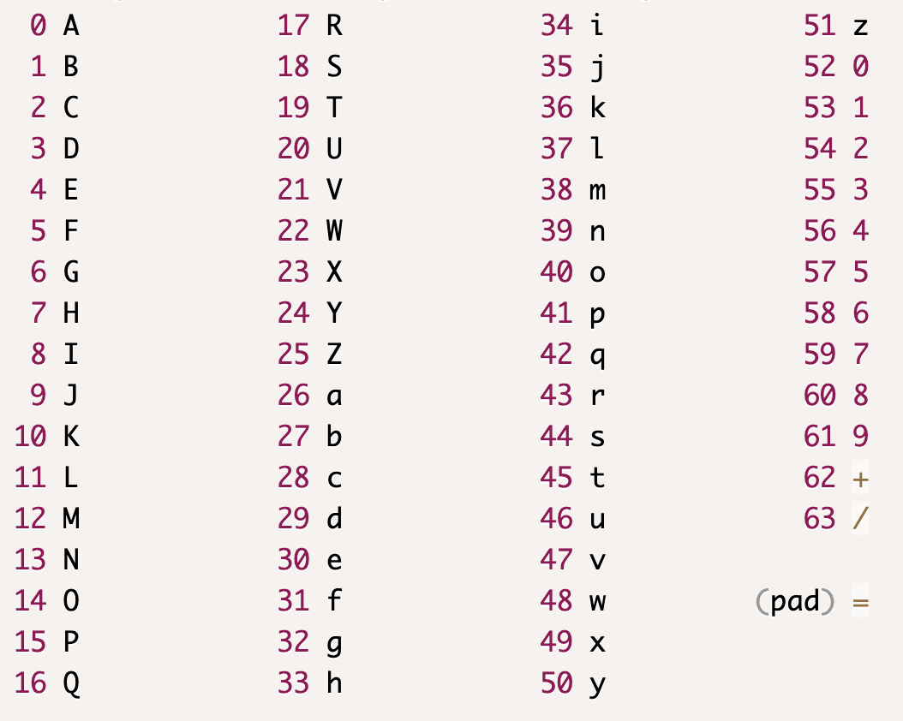

比如，有以下字符串：

```css
ab@
```

它的位表示将是：

```css
   a          b        @
01100001  01100010  01000000
```

这些总共 24 位将被分为 4 组，每组 6 位：

```css
011000 010110 001001 000000
```

它的数字表示为：

```css
  24    22     9      0
011000 010110 001001 000000
```

使用上面的数字索引到 base64 表中，映射结果如下：

* 24 → Y
* 22 → W
* 9 → J
* 0 → A

所以，这个字符串的base64编码就是：

```css
YWJA
```

那如果输入的字符串不是 3 的倍数怎么办？这种情况下，就会使用填充字符<code>**=**</code>\*\*。\*\*假设字符串有 4 个字符

```css
ab@c
```

它的位表示将是：

```css
   a          b        @        c
01100001  01100010  01000000 01100011
```

前三个字节将组合在一起。最后的字节将用 4 个额外的 0 填充，以使总位可以被 6 整除：

```css
011000 010110 001001 000000 011000 110000
  24     22     9      0      24     48
```

使用上面的数字索引到 base64 表中，映射结果如下：

* 24 → Y
* 22 → W
* 9 → J
* 0 → A
* 24 → Y
* 48 → w

结果如下：

```css
YWJAYw==
```

这里，每两个额外的 0 由 = 字符表示。由于添加了 4 个额外的零，因此最后有两个 =。

#### （3）Base64 解码

说完了 Base64 编码，下面来尝试将 base64 编码的字符串解码为原始字符串。以以下 Base64 字符串为例：

```css
YWJAY2Q=
```

将其分组为 4 个字符一组：

```css
YWJA 
Y2Q=
```

现在从每个组中删除最后的 = 字符。对于剩余的字符串，将其转换为上表中相应的位表示形式。

```css
  Y      W       J      A     
011000 010110 001001 000000

  Y      2      Q
011000 110110 010000
```

现在将其分组为一组 8 位，保留尾随的 0：

```css
01100001  01100010  01000000 
01100011  01100100
```

现在对于上面的每个字节，根据 ASCII 表分配字符：

```javascript
01100001  01100010  01000000
   a          b         @   

01100011  01100100
   c          d
```

因此最终的字符串就是：**ab@cd**

#### （4）填充

那为什么要将 Base64 编码后的字符串分成 4 个一组进行解码呢？就是因为填充`=`。填充 `=` 对于 base64 编码是否有必要呢，因为在解码时又丢弃了填充。主要考虑两种情况：

* 发送单个字符的字符串时不需要填充；
* 发送多个字符的字符串的 base64 编码时，填充就很重要。如果连接未填充的字符串，则将无法获得原始字符串，因为有关添加的字节的信息将丢失。

来看下面的例子：

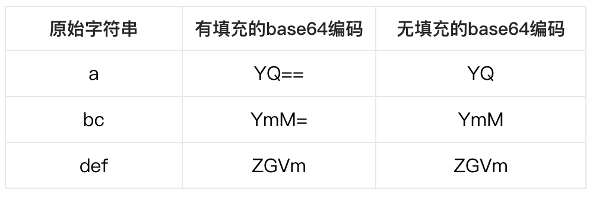

\*\*当发送连接时没有填充，\*\*合并的 Base64 字符串将是：YQYmMZGVm，尝试解码它时，会得到如下字符串，这是不正确的：

```javascript
a&1
```

\*\*当使用填充发送连接时，\*\*合并的 Base64 字符串将是：YQ==YmM=ZGVm，尝试解码它时，会得到以下字符串，这是正确的：

```javascript
abcdef
```

所以，当传输多个字符时，填充是很有必要的。

因为基本上 Base64 在填充的情况下会将 3 个字节编码为 4 个 ASCII 字符。四个 ASCII 字符中的每一个都将作为 1 个字节通过网络发送。因此，最终的尺寸总是比原来的尺寸大 33.33%。因此，如果字符串的原始大小为 n 个字节，则经过 base64 编码后的大小将为：

```javascript
n * 4/3
```

## JavaScript 编解码

最后来看看 JavaScript 中提供的关于编解码的方法。

#### （1）UTF-8

URL 只能包含标准的 ASCII 字符，所以必须对其他特殊字符进行编码。在 JavaScript 中，可以通过了以下方法对 URL 来做 UTF-8 编码与解码：

* `encodeURI`、`decodeURI`
* `encodeURIComponent`、`decodeURIComponent`

这里的编码指的就是将二进制数据转换为 ASCII 格式的方式，解码反之亦然，即将 ASCII 格式转换回原始内容。

那 `encodeURI` 和 `encodeURIComponent` 有什么区别呢？

* encodeURI 用于**编码完整的 URL**：

```javascript
encodeURI('https://domain.com/path to a document.pdf');

// 结果：'https://domain.com/path%20to%20a%20document.pdf'
```

* `encodeURIComponent` 用于编码 URI 组件，例如查询字符串：

```javascript
`http://domain.com/?search=${encodeURIComponent('name=zhang san&age=19')}`;

// 结果：'http://domain.com/?search=name%3Dzhang%20san%26age%3D19'
```

需要注意，有 11 个字符不能使用 `encodeURI` 编码，而需要使用 `encodeURIComponent` 进行编码：

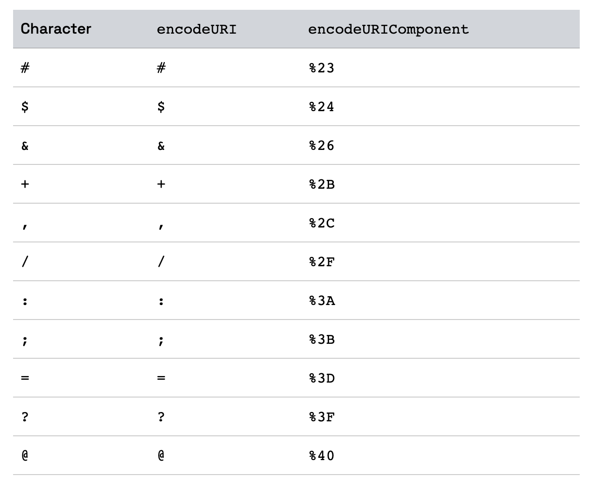

另外，decodeURI 和 decodeURIComponent 是对分别由 encodeURI 和 encodeURIComponent 编码的字符串进行解码的方法。

```javascript
decodeURI('https://domain.com/path%20to%20a%20document.pdf');

// 结果：'https://domain.com/path to a document.pdf'

`http://domain.com/?search=${decodeURIComponent('name%3Dzhang%20san%26age%3D19')}`;

// 结果：'http://domain.com/?search=name=zhang san&age=19'
```

需要注意，`encodeURIComponent` 不编码 `- _ . ! ~ * ' ( )`。 如果要对这些字符进行编码，则必须将它们替换为相应的 UTF-8 字符序列：

```javascript
const encode = (str) =>
    encodeURIComponent(str)
        .replace(/\-/g, '%2D')
        .replace(/\_/g, '%5F')
        .replace(/\./g, '%2E')
        .replace(/\!/g, '%21')
        .replace(/\~/g, '%7E')
        .replace(/\*/g, '%2A')
        .replace(/\'/g, '%27')
        .replace(/\(/g, '%28')
        .replace(/\)/g, '%29');
```

解码函数如下所示：

```javascript
const decode = (str) =>
    decodeURIComponent(
        str
            .replace(/\\%2D/g, '-')
            .replace(/\\%5F/g, '_')
            .replace(/\\%2E/g, '.')
            .replace(/\\%21/g, '!')
            .replace(/\\%7E/g, '~')
            .replace(/\\%2A/g, '*')
            .replace(/\\%27/g, "'")
            .replace(/\\%28/g, '(')
            .replace(/\\%29/g, ')')
    );
```

#### （2）Base64

在JavaScript 中，可以使用 `btoa()`（binary to ASCII）和 `atob()`（ASCII to binary）方法来做 Base64 的编码和解码。主要是用于 Data URIs。

下面来对字符串 HelloWorld 做 Base64 的编码与解码：

```javascript
const encodedData = btoa('HelloWorld'); // "SGVsbG9Xb3JsZA=="
const decodedData = atob(encodedData); // "HelloWorld"
```

由于ASCII 无法表示中文，因此要先做 UTF-8 编码，然后再做Base64 编码；解码方式为先做 Base64 解码，再做UTF-8 解码：

```javascript
const encodedData = btoa(encodeURI('你好')); //  "JUU0JUJEJUEwJUU1JUE1JUJE"
const decodedData = decodeURI(atob(encodedData)); // "你好"
```


> 更新: 2023-01-25 17:28:53  
> 原文: <https://www.yuque.com/cuggz/feplus/dbouy2q94dr0smn9>