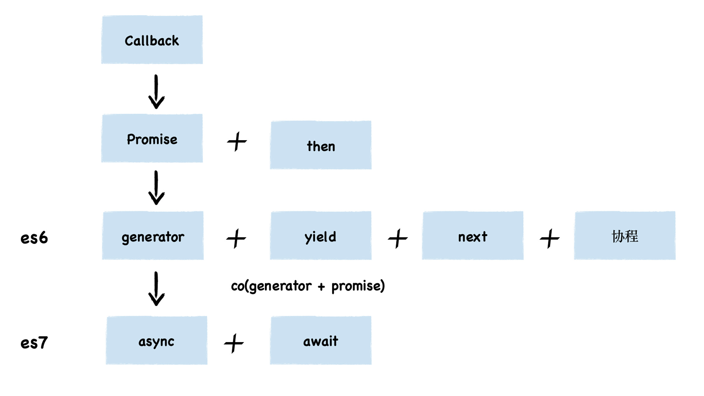
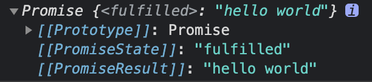

# 异步编程

浏览器中的JavaScript程序是典型的事件驱动型程序，即它们会等待用户触发后才真正的执行，而基于的JavaScript的服务器通常要等待客户端通过网络发送请求，然后才能执行。这种异步编程在JavaScript是很常见的，下面就来介绍几个异步编程的重要特性，它们可以使编写异步代码更容易。

本文将按照异步编程的出现时间来归纳整理：



## 一、什么是异步

下面先来看看同步和异步的概念：

* \*\*同步：\*\*在执行某段代码时，在没有得到返回结果之前，其他代码暂时是无法执行的，但是一旦执行完成拿到返回值，即可执行其他代码。也就是说，在此段代码执行完未返回结果之前，会阻塞之后的代码执行，这样的情况称为同步。
* \*\*异步：\*\*当某一代码执行异步过程调用发出后，这段代码不会立刻得到返回结果。而是在异步调用发出之后，一般通过回调函数处理这个调用之后拿到结果。异步调用发出后，不会影响阻塞后面的代码执行，这样的情况称为异步。

下面来看一个例子：

```javascript
// 同步
function syncAdd(a, b) {
  return a + b;
}

syncAdd(1, 2) // 立即得到结果：3

// 异步
function asyncAdd(a, b) {
  setTimeout(function() {
    console.log(a + b);
  }, 1000)
}

asyncAdd(1, 2) // 1s后打印结果：3
```

<font style="color:#404952;">这里定义了同步函数 syncAdd 和异步函数 asyncAdd，调用 syncAdd(1, 2) 函数时会等待得到结果之后再执行后面的代码。而调用 asyncAdd(1, 2) 时则会在得到结果之前继续执行，直到 1 秒后得到结果并打印。</font>

<font style="color:#404952;"></font>

我们知道，JavaScript 是单线程的，如果代码同步执行，就可能会造成阻塞；而如果使用异步则不会阻塞，不需要等待异步代码执行的返回结果，可以继续执行该异步任务之后的代码逻辑。因此，在 JavaScript 编程中，会大量使用异步。

那为什么单线程的JavaScript还能实现异步呢，其实也没有什么魔法，只是<font style="color:#404952;">把一些操作交给了其他线程处理，然后采用了</font>**事件循环**<font style="color:#404952;">的机制来处理返回结果。这里不再多介绍事件循环，之前写过一篇相关文章，仅供参考：</font>[《彻底搞懂JavaScript事件循环》](https://juejin.cn/post/6992167223523541023)。

## 二、回调函数

在最基本的层面上，JavaScript的异步编程式通过回调实现的。回调的是函数，可以传给其他函数，而其他函数会在满足某个条件时调用这个函数。下面就来看看常见的不同形式的基于回调的异步编程。

### 1. 定时器

一种最简单的异步操作就是在一定时间之后运行某些代码。如下面代码：

```javascript
setTimeout(asyncAdd(1, 2), 8000)
```

`setTimeout()`方法的第一个参数是一个函数，第二个参数是以毫秒为单位的时间间隔。`asyncAdd()`方法可能是一个回调函数，而`setTimeout()`方法就是注册回调函数的函数。它还代指在什么异步条件下调用回调函数。`setTimeout()`方法只会调用一次回调函数。

### 2. 事件监听

给目标 DOM 绑定一个监听函数，用的最多的是 `addEventListener`：

```javascript
document.getElementById('#myDiv').addEventListener('click', (e) => {
  console.log('我被点击了')
}, false);
```

通过给 id 为 `myDiv` 的一个元素绑定了点击事件的监听函数，把任务的执行时机推迟到了点击这个动作发生时。此时，**任务的执行顺序与代码的编写顺序无关，只与点击事件有没有被触发有关**。

这里使用`addEventListener`注册了回调函数，这个方法的第一个参数是一个字符串，指定要注册的事件类型，如果用户点击了指定的元素，浏览器就会调用回调函数，并给他传入一个对象，其中包含着事件的详细信息。

### 3. 网络请求

JavaScript中另外一种常见的异步操作就是网络请求：

```javascript
const SERVER_URL = "/server";
let xhr = new XMLHttpRequest();
// 创建 Http 请求
xhr.open("GET", SERVER_URL, true);
// 设置状态监听函数
xhr.onreadystatechange = function() {
  if (this.readyState !== 4) return;
  // 当请求成功时
  if (this.status === 200) {
    handle(this.response);
  } else {
    console.error(this.statusText);
  }
};
// 设置请求失败时的监听函数
xhr.onerror = function() {
  console.error(this.statusText);
};
// 发送 Http 请求
xhr.send(null);
```

这里使用`XMLHttpRequest`类及回调函数来发送HTTP请求并异步处理服务器返回的响应。

### 4. Node中的回调与事件

Node.js服务端JavaScript环境底层就是异步的，定义了很多使用回调和事件的API。例如读取文件默认的API就是异步的，它会在读取文件内容之后调用一个回调函数：

```javascript
const fs = require('fs');
let options = {}

//  读取配置文件，调用回调函数
fs.readFile('config.json', 'utf8', (err, data) => {
    if(err) {
      throw err;
    }else{
    	Object.assign(options, JSON.parse(data))
    }
		startProgram(options)
});
```

`fs.readFile()`方法以接收两个参数的回调作为最后一个参数。它会异步读取指定文件，如果读取成功就会将第二个参数传递给回调的第二个参数，如果发生错误，就会将错误传递给回调的第一个参数。

## 三、Promise

### 1. Promise的概念

Promise是一种为简化异步编程而设计的核心语言特性，它是一个对象，表示异步操作的结果。在最简单的情况下，Promise就是一种处理回调的不同方式。不过，使用Promise也有实际的用处，基于回调的异步编程会有一个很现实的问题，那就是**经常出现回调多层嵌套**的情况，会造成代码难以理解。Promise可以让这种嵌套回调以一种更线性的链式形式表达出来，因此更容易阅读和理解。

回调的另一个问题就是\*\*难以处理错误，\*\*如果一个异步函数抛出异常，则该异常没有办法传播到异步操作的发起者。异步编程的一个基本事实就是它破坏了异常处理。而Promise则标准化了异步错误处理，通过Promise链提供一种让错误正确传播的途经。

实际上，Promise就是一个容器，里面保存着某个未来才会结束的事件（通常是异步操作）的结果。从语法上说，Promise 是一个对象，它可以获取异步操作的消息。Promise 提供了统一的 API，各种异步操作都可以用同样的方法进行处理。

（1）Promise实例有**三个状态**:

* pending 状态：表示进行中。Promise 实例创建后的初始态；
* fulfilled 状态：表示成功完成。在执行器中调用 resolve 后达成的状态；
* rejected 状态：表示操作失败。在执行器中调用 reject 后达成的状态。

（2）Promise实例有**两个过程**：

* pending -> fulfilled : Resolved（已完成）；
* pending -> rejected：Rejected（已拒绝）。

**Promise的特点：**

* 一旦状态改变就不会再变，promise对象的状态改变，只有两种可能：从`pending`变为`fulfilled`，从`pending`变为`rejected`。<font style="color:#404952;">当 Promise 实例被创建时，内部的代码就会立即被执行，而且无法从外部停止。比如无法取消超时或消耗性能的异步调用，容易导致资源的浪费；</font>
* 如果不设置回调函数，Promise内部抛出的错误，不会反映到外部；
* <font style="color:#404952;">Promise 处理的问题都是“一次性”的，因为一个 Promise 实例只能 resolve 或 reject 一次，所以面对某些需要持续响应的场景时就会变得力不从心。比如上传文件获取进度时，默认采用的就是事件监听的方式来实现。</font>

下面来看一个例子：

```javascript
const https = require('https');

function httpPromise(url){
  return new Promise((resolve,reject) => {
    https.get(url, (res) => {
      resolve(data);
    }).on("error", (err) => {
      reject(error);
    });
  })
}

httpPromise().then((data) => {
  console.log(data)
}).catch((error) => {
  console.log(error)
})
```

<font style="color:#000000;">可以看到，Promise 会接收一个执行器，在这个执行器里，需要把目标异步任务给放进去。在 Promise 实例创建后，执行器里的逻辑会立刻执行，在执行的过程中，根据异步返回的结果，决定如何使用 resolve 或 reject 来改变 Promise实例的状态。</font>

<font style="color:#000000;"></font>

<font style="color:#000000;">在这个例子里，当用 resolve 切换到了成功态后，Promise 的逻辑就会走到 then 中传入的方法里去；用 reject 切换到失败态后，Promise 的逻辑就会走到 catch 传入的方法中。</font>

<font style="color:#000000;"></font>

<font style="color:#000000;">这样的逻辑，本质上与回调函数中的成功回调和失败回调没有差异。但这种写法大大地提高了代码的质量。当我们进行大量的异步链式调用时，回调地狱不复存在了。取而代之的是层级简单、赏心悦目的 Promise 调用链：</font>

```javascript
httpPromise(url1)
    .then(res => {
        console.log(res);
        return httpPromise(url2);
    })
    .then(res => {
        console.log(res);
        return httpPromise(url3);
    })
    .then(res => {
      console.log(res);
      return httpPromise(url4);
    })
    .then(res => console.log(res));
```

### 2. Promise的创建

Promise对象代表一个异步操作，有三种状态：pending（进行中）、fulfilled（已成功）和rejected（已失败）。

Promise构造函数接受一个函数作为参数，该函数的两个参数分别是`resolve`和`reject`。

```javascript
const promise = new Promise((resolve, reject) => {
  if (/* 异步操作成功 */){
    resolve(value);
  } else {
    reject(error);
  }
});
```

一般情况下，我们会用`new Promise()`来创建Promise对象。除此之外，还也可以使用`promise.resolve`和 `promise.reject`这两个方法来创建：

**（1）Promise.resolve**

`Promise.resolve(value)`的返回值是一个promise对象，我们可以对返回值进行.then调用，如下代码：

```javascript
Promise.resolve(11).then(function(value){
  console.log(value); // 打印出11
});
```

`resolve(11)`会让promise对象进入确定(`resolve`状态)，并将参数`11`传递给后面`then`中指定的`onFulfilled` 函数；

**（2）Promise.reject**

`Promise.reject` 的返回值也是一个promise对象，如下代码：

```javascript
Promise.reject(new Error("我错了！"));
```

上面是以下代码的简单形式：

```javascript
new Promise((resolve, reject) => {
   reject(new Error("我错了！"));
});
```

下面来综合看看resolve方法和reject方法：

```javascript
function testPromise(ready) {
  return new Promise(resolve,reject) => {
    if(ready) {
      resolve("hello world");
    }else {
      reject("No thanks");
    }
  });
};

testPromise(true).then((msg) => {
  console.log(msg);
},(error) => {
  console.log(error);
});
```

上面的代码给`testPromise`方法传递一个参数，返回一个promise对象，如果为`true`，那么调用Promise对象中的`resolve()`方法，并且把其中的参数传递给后面的`then`第一个函数内，因此打印出 “`hello world`”, 如果为`false`，会调用promise对象中的`reject()`方法，则会进入`then`的第二个函数内，会打印`No thanks`。

### 3. Promise的作用

在开发中可能会碰到这样的需求：使用ajax发送A请求，成功后拿到数据，需要把数据传给B请求，那么需要这样编写代码：

```javascript
let fs = require('fs')
fs.readFile('./a.txt','utf8',function(err,data){
  fs.readFile(data,'utf8',function(err,data){
    fs.readFile(data,'utf8',function(err,data){
      console.log(data)
    })
  })
})
```

这段代码之所以看上去很乱，归结其原因有两点：

* **第一是嵌套调用**，下面的任务依赖上个任务的请求结果，并**在上个任务的回调函数内部执行新的业务逻辑**，这样当嵌套层次多了之后，代码的可读性就变得非常差了。
* **第二是任务的不确定性**，执行每个任务都有两种可能的结果（成功或者失败），所以体现在代码中就需要对每个任务的执行结果做两次判断，这种对每个任务都要进行一次额外的错误处理的方式，明显增加了代码的混乱程度。

既然原因分析出来了，那么问题的解决思路就很清晰了：

* 消灭嵌套调用；
* 合并多个任务的错误处理。

这么说可能有点抽象，不过 Promise 解决了这两个问题。接下来就看看 Promise 是怎么消灭嵌套调用和合并多个任务的错误处理的。

`Promise`出现之后，代码可以这样写：

```javascript
let fs = require('fs')
function read(url){
  return new Promise((resolve,reject)=>{
    fs.readFile(url,'utf8',function(error,data){
      error && reject(error)
      resolve(data)
    })
  })
}
read('./a.txt').then(data=>{
  return read(data) 
}).then(data=>{
  return read(data)  
}).then(data=>{
  console.log(data)
})
```

<font style="color:#353535;">通过引入 Promise，上面这段代码看起来就非常线性了，也非常符合人的直觉</font>。Promise 利用了三大技术手段来解决回调地狱：**回调函数延迟绑定、返回值穿透、错误冒泡。**

下面来看一段代码：

```javascript
let readFilePromise = (filename) => {
  fs.readFile(filename, (err, data) => {
    if(err) {
      reject(err);
    }else {
      resolve(data);
    }
  })
}
readFilePromise('1.json').then(data => {
  return readFilePromise('2.json')
});
```

可以看到，回调函数不是直接声明的，而是通过后面的 then 方法传入的，即延迟传入，这就是回调函数延迟绑定。接下来针对上面的代码做一下调整，如下：

```javascript
let x = readFilePromise('1.json').then(data => {
  return readFilePromise('2.json')  //这是返回的Promise
});
x.then()
```

根据 then 中回调函数的传入值创建不同类型的 Promise，然后把返回的 Promise 穿透到外层，以供后续的调用。这里的 x 指的就是内部返回的 Promise，然后在 x 后面可以依次完成链式调用。这便是返回值穿透的效果，这两种技术一起作用便可以将深层的嵌套回调写成下面的形式。

```javascript
readFilePromise('1.json').then(data => {
    return readFilePromise('2.json');
}).then(data => {
    return readFilePromise('3.json');
}).then(data => {
    return readFilePromise('4.json');
});
```

这样就显得清爽许多，更重要的是，它更符合人的线性思维模式，开发体验更好，两种技术结合产生了链式调用的效果。

这样解决了多层嵌套的问题，那另外一个问题，即每次任务执行结束后分别处理成功和失败的情况怎么解决的呢？Promise 采用了错误冒泡的方式。下面来看效果：

```javascript
readFilePromise('1.json').then(data => {
    return readFilePromise('2.json');
}).then(data => {
    return readFilePromise('3.json');
}).then(data => {
    return readFilePromise('4.json');
}).catch(err => {
  // xxx
})
```

这样前面产生的错误会一直向后传递，被 catch 接收到，就不用频繁地检查错误了。从上面的这些代码中可以看到，Promise 解决效果也比较明显：实现链式调用，解决多层嵌套问题；实现错误冒泡后一站式处理，解决每次任务中判断错误、增加代码混乱度的问题。

### 4. Promise的方法

Promise常用的方法：then()、catch()、all()、race()、finally()、allSettled()、any()。

#### （1）then()

当Promise执行的内容符合成功条件时，调用`resolve`函数，失败就调用`reject`函数。那Promise创建完了，该如何调用呢？这时就该then出场了：

```javascript
promise.then(function(value) {
  // success
}, function(error) {
  // failure
});
```

`then`方法接受两个回调函数作为参数。第一个回调函数是Promise对象的状态变为`resolved`时调用，第二个回调函数是Promise对象的状态变为`rejected`时调用。其中第二个参数可以省略。

`then`方法返回的是一个新的Promise实例。因此可以采用**链式写法**，即`then`方法后面再调用另一个then方法。当写有顺序的异步事件时，需要串行时，可以这样写：

```javascript
let promise = new Promise((resolve,reject)=>{
    ajax('first').success(function(res){
        resolve(res);
    })
})
promise.then(res=>{
    return new Promise((resovle,reject)=>{
        ajax('second').success(function(res){
            resolve(res)
        })
    })
}).then(res=>{
    return new Promise((resovle,reject)=>{
        ajax('second').success(function(res){
            resolve(res)
        })
    })
}).then(res=>{
    
})
```

#### （2）catch()

Promise对象的catch方法相当于`then`方法的第二个参数，指向`reject`的回调函数。

不过`catch`方法还有一个作用，就是在执行`resolve`回调函数时，如果出现错误，抛出异常，不会停止运行，而是进入`catch`方法中：

```javascript
p.then((data) => {
     console.log('resolved',data);
},(err) => {
     console.log('rejected',err);
}); 
```

#### （3）all()

`all`方法可以完成**并行任务**， 它接收一个数组，数组的每一项都是一个`promise`对象。当数组中所有的`promise`的状态都达到`resolved`时，`all`方法的状态就会变成`resolved`，如果有一个状态变成了`rejected`，那么`all`方法的状态就会变成`rejected`：

```javascript
let promise1 = new Promise((resolve,reject)=>{
	setTimeout(()=>{
       resolve(1);
	},2000)
});
let promise2 = new Promise((resolve,reject)=>{
	setTimeout(()=>{
       resolve(2);
	},1000)
});
let promise3 = new Promise((resolve,reject)=>{
	setTimeout(()=>{
       resolve(3);
	},3000)
});

Promise.all([promise1,promise2,promise3]).then(res=>{
    console.log(res);  //结果为：[1,2,3] 
})
```

调用`all`方法时的结果成功的时候是回调函数的参数也是一个数组，这个数组按顺序保存着每一个promise对象`resolve`执行时的值。

#### （4）race()

`race`方法和`all`一样，接受的参数是一个每项都是`promise`的数组，但与`all`不同的是，当最先执行完的事件执行完之后，就直接返回该`promise`对象的值。

如果第一个`promise`对象状态变成`resolved`，那自身的状态变成了`resolved`；反之，第一个`promise`变成`rejected`，那自身状态就会变成`rejected`。

```javascript
let promise1 = new Promise((resolve,reject) => {
	setTimeout(() =>  {
       reject(1);
	},2000)
});
let promise2 = new Promise((resolve,reject) => {
	setTimeout(() => {
       resolve(2);
	},1000)
});
let promise3 = new Promise((resolve,reject) => {
	setTimeout(() => {
       resolve(3);
	},3000)
});
Promise.race([promise1,promise2,promise3]).then(res => {
	console.log(res); //结果：2
},rej => {
    console.log(rej)};
)
```

那么`race`方法有什么实际作用呢？当需要执行一个任务，超过多长时间就不做了，就可以用这个方法来解决：

```javascript
Promise.race([promise1, timeOutPromise(5000)]).then(res => console.log(res))
```

#### （5）finally()

`finally`方法用于指定不管 Promise 对象最后状态如何，都会执行的操作。该方法是 ES2018 引入标准的。

```javascript
promise.then(result => {···})
			 .catch(error => {···})
       .finally(() => {···});
```

上面代码中，不管`promise`最后的状态如何，在执行完`then`或`catch`指定的回调函数以后，都会执行`finally`方法指定的回调函数。

下面来看例子，服务器使用 Promise 处理请求，然后使用`finally`方法关掉服务器。

```javascript
server.listen(port)
  .then(function () {
    // ...
  })
  .finally(server.stop);
```

`finally`方法的回调函数不接受任何参数，这意味着没有办法知道，前面的 Promise 状态到底是`fulfilled`还是`rejected`。这表明，`finally`方法里面的操作，应该是与状态无关的，不依赖于 Promise 的执行结果。

`finally`本质上是`then`方法的特例：

```javascript
promise
.finally(() => {
  // 语句
});

// 等同于
promise
.then(
  result => {
    // 语句
    return result;
  },
  error => {
    // 语句
    throw error;
  }
);
```

上面代码中，如果不使用`finally`方法，同样的语句需要为成功和失败两种情况各写一次。有了`finally`方法，则只需要写一次。

#### （6）allSettled()

Promise.allSettled 的语法及参数跟 Promise.all 类似，其参数接受一个 Promise 的数组，返回一个新的 Promise。唯一的不同在于，执行完之后不会失败，也就是说当 Promise.allSettled 全部处理完成后，我们可以拿到每个 Promise 的状态，而不管其是否处理成功。

下面使用 allSettled 实现的一段代码：

```javascript
const resolved = Promise.resolve(2);
const rejected = Promise.reject(-1);
const allSettledPromise = Promise.allSettled([resolved, rejected]);
allSettledPromise.then(function (results) {
  console.log(results);
});
// 返回结果：
// [
//    { status: 'fulfilled', value: 2 },
//    { status: 'rejected', reason: -1 }
// ]
```

可以看到，Promise.allSettled 最后返回的是一个数组，记录传进来的参数中每个 Promise 的返回值，这就是和 all 方法不太一样的地方。你也可以根据 all 方法提供的业务场景的代码进行改造，其实也能知道多个请求发出去之后，Promise 最后返回的是每个参数的最终状态。

#### （7）any()

any 方法返回一个 Promise，只要参数 Promise 实例有一个变成 fullfilled 状态，最后 any 返回的实例就会变成 fullfilled 状态；如果所有参数 Promise 实例都变成 rejected 状态，包装实例就会变成 rejected 状态。

下面对上面 allSettled 这段代码进行改造，来看下改造完的代码和执行结果：

```javascript
const resolved = Promise.resolve(2);
const rejected = Promise.reject(-1);
const allSettledPromise = Promise.any([resolved, rejected]);
allSettledPromise.then(function (results) {
  console.log(results);
});
// 返回结果：2
```

可以看出，只要其中一个 Promise 变成 fullfilled 状态，那么 any 最后就返回这个 Promise。由于上面 resolved 这个 Promise 已经是 resolve 的了，故最后返回结果为 2。

### 5. Promise的异常处理

错误处理是所有编程范型都必须要考虑的问题，在使用 JavaScript 进行异步编程时，也不例外。如果我们不做特殊处理，会怎样呢？来看下面的代码，先定义一个必定会失败的方法

```javascript
let fail = () => {
	setTimeout(() => {
		throw new Error("fail");
	}, 1000);
};
```

调用：

```javascript
console.log(1);
try {
  fail();
} catch (e) {
	console.log("captured");
}
console.log(2);
```

可以看到打印出了 1 和 2，并在 1 秒后，获得一个“Uncaught Error”的错误打印，注意观察这个错误的堆栈：

```javascript
Uncaught Error: fail
    at <anonymous>:3:9
```

可以看到，其中的 setTimeout (async) 这样的字样，表示着这是一个异步调用抛出的堆栈。但是，captured”这样的字样也并未打印，因为母方法 fail() 本身的原始顺序执行并没有失败，这个异常的抛出是在回调行为里发生的。 从上面的例子可以看出，对于异步编程来说，我们需要使用一种更好的机制来捕获并处理可能发生的异常。

Promise 除了支持 resolve 回调以外，还支持 reject 回调，前者用于表示异步调用顺利结束，而后者则表示有异常发生，中断调用链并将异常抛出：

```javascript
const exe = (flag) => () => new Promise((resolve, reject) => {
    console.log(flag);
    setTimeout(() => {
        flag ? resolve("yes") : reject("no");
    }, 1000);
});
```

上面的代码中，flag 参数用来控制流程是顺利执行还是发生错误。在错误发生的时候，no 字符串会被传递给 reject 函数，进一步传递给调用链：

```javascript
Promise.resolve()
	     .then(exe(false))
	     .then(exe(true));
```

上面的调用链，在执行的时候，第二行就传入了参数 false，它就已经失败了，异常抛出了，因此第三行的 exe 实际没有得到执行，执行结果如下：

```javascript
false
Uncaught (in promise) no
```

这就说明，通过这种方式，调用链被中断了，下一个正常逻辑 exe(true) 没有被执行。 但是，有时候需要捕获错误，而继续执行后面的逻辑，该怎样做？这种情况下就要在调用链中使用 catch 了：

```javascript
Promise.resolve()
       .then(exe(false))
       .catch((info) => { console.log(info); })
       .then(exe(true));
```

这种方式下，异常信息被捕获并打印，而调用链的下一步，也就是第四行的 exe(true) 可以继续被执行。将看到这样的输出：

```javascript
false
no
true
```

### 6. Promise的实现

这一部分就来简单实现一下Promise及其常用的方法。

#### （1）Promise

```javascript
const PENDING = "pending";
const RESOLVED = "resolved";
const REJECTED = "rejected";

function MyPromise(fn) {
  // 保存初始化状态
  var self = this;

  // 初始化状态
  this.state = PENDING;

  // 用于保存 resolve 或者 rejected 传入的值
  this.value = null;

  // 用于保存 resolve 的回调函数
  this.resolvedCallbacks = [];

  // 用于保存 reject 的回调函数
  this.rejectedCallbacks = [];

  // 状态转变为 resolved 方法
  function resolve(value) {
    // 判断传入元素是否为 Promise 值，如果是，则状态改变必须等待前一个状态改变后再进行改变
    if (value instanceof MyPromise) {
      return value.then(resolve, reject);
    }

    // 保证代码的执行顺序为本轮事件循环的末尾
    setTimeout(() => {
      // 只有状态为 pending 时才能转变，
      if (self.state === PENDING) {
        // 修改状态
        self.state = RESOLVED;

        // 设置传入的值
        self.value = value;

        // 执行回调函数
        self.resolvedCallbacks.forEach(callback => {
          callback(value);
        });
      }
    }, 0);
  }

  // 状态转变为 rejected 方法
  function reject(value) {
    // 保证代码的执行顺序为本轮事件循环的末尾
    setTimeout(() => {
      // 只有状态为 pending 时才能转变
      if (self.state === PENDING) {
        // 修改状态
        self.state = REJECTED;

        // 设置传入的值
        self.value = value;

        // 执行回调函数
        self.rejectedCallbacks.forEach(callback => {
          callback(value);
        });
      }
    }, 0);
  }

  // 将两个方法传入函数执行
  try {
    fn(resolve, reject);
  } catch (e) {
    // 遇到错误时，捕获错误，执行 reject 函数
    reject(e);
  }
}

MyPromise.prototype.then = function(onResolved, onRejected) {
  // 首先判断两个参数是否为函数类型，因为这两个参数是可选参数
  onResolved =
    typeof onResolved === "function"
      ? onResolved
      : function(value) {
          return value;
        };

  onRejected =
    typeof onRejected === "function"
      ? onRejected
      : function(error) {
          throw error;
        };

  // 如果是等待状态，则将函数加入对应列表中
  if (this.state === PENDING) {
    this.resolvedCallbacks.push(onResolved);
    this.rejectedCallbacks.push(onRejected);
  }

  // 如果状态已经凝固，则直接执行对应状态的函数

  if (this.state === RESOLVED) {
    onResolved(this.value);
  }

  if (this.state === REJECTED) {
    onRejected(this.value);
  }
};
```

#### （2）Promise.then

`then` 方法返回一个新的 `promise` 实例，为了在 `promise` 状态发生变化时（`resolve` / `reject` 被调用时）再执行 `then` 里的函数，我们使用一个 `callbacks` 数组先把传给then的函数暂存起来，等状态改变时再调用。

**那么，怎么保证后一个 **<code>**then**</code>** 里的方法在前一个 **<code>**then**</code>**（可能是异步）结束之后再执行呢？**

可以将传给 `then` 的函数和新 `promise` 的 `resolve` 一起 `push` 到前一个 `promise` 的 `callbacks` 数组中，达到承前启后的效果：

* 承前：当前一个 `promise` 完成后，调用其 `resolve` 变更状态，在这个 `resolve` 里会依次调用 `callbacks` 里的回调，这样就执行了 `then` 里的方法了
* 启后：上一步中，当 `then` 里的方法执行完成后，返回一个结果，如果这个结果是个简单的值，就直接调用新 `promise` 的 `resolve`，让其状态变更，这又会依次调用新 `promise` 的 `callbacks` 数组里的方法，循环往复。。如果返回的结果是个 `promise`，则需要等它完成之后再触发新 `promise` 的 `resolve`，所以可以在其结果的 `then` 里调用新 `promise` 的 `resolve`

```javascript
then(onFulfilled, onReject){
    // 保存前一个promise的this
    const self = this; 
    return new MyPromise((resolve, reject) => {
      // 封装前一个promise成功时执行的函数
      let fulfilled = () => {
        try{
          const result = onFulfilled(self.value); // 承前
          return result instanceof MyPromise? result.then(resolve, reject) : resolve(result); //启后
        }catch(err){
          reject(err)
        }
      }
      // 封装前一个promise失败时执行的函数
      let rejected = () => {
        try{
          const result = onReject(self.reason);
          return result instanceof MyPromise? result.then(resolve, reject) : reject(result);
        }catch(err){
          reject(err)
        }
      }
      switch(self.status){
        case PENDING: 
          self.onFulfilledCallbacks.push(fulfilled);
          self.onRejectedCallbacks.push(rejected);
          break;
        case FULFILLED:
          fulfilled();
          break;
        case REJECT:
          rejected();
          break;
      }
    })
   }
```

**注意：**

* 连续多个 `then` 里的回调方法是同步注册的，但注册到了不同的 `callbacks` 数组中，因为每次 `then` 都返回新的 `promise` 实例（参考上面的例子和图）
* 注册完成后开始执行构造函数中的异步事件，异步完成之后依次调用 `callbacks` 数组中提前注册的回调

#### （3）Promise.all

该方法的参数是 Promise 的实例数组, 然后注册一个 then 方法。 待数组中的 Promise 实例的状态都转为 fulfilled 之后则执行 then 方法.，这里主要就是一个计数逻辑, 每当一个 Promise 的状态变为 fulfilled 之后就保存该实例返回的数据, 然后将计数减一, 当`计数器`变为 `0` 时, 代表数组中所有 Promise 实例都执行完毕.

```javascript
Promise.all = function (arr) {
  let args = Array.prototype.slice.call(arr)
  return new Promise(function (resolve, reject) {
    if (args.length === 0) return resolve([])
    let remaining = args.length
    function res(i, val) {
      try {
        if (val && (typeof val === 'object' || typeof val === 'function')) {
          let then = val.then
          if (typeof then === 'function') {
            then.call(val, function (val) { // 这里如果传入参数是 promise的话需要将结果传入 args, 而不是 promise实例
              res(i, val) 
            }, reject)
            return
          }
        }
        args[i] = val
        if (--remaining === 0) {
          resolve(args)
        }
      } catch (ex) {
        reject(ex)
      }
    }
    for (let i = 0; i < args.length; i++) {
      res(i, args[i])
    }
  })
}
```

#### （4）Promise.race

该方法的参数是 Promise 实例数组, 然后其 then 注册的回调方法是数组中的某一个 Promise 的状态变为 fulfilled 的时候就执行. 因为 Promise 的状态**只能改变一次**, 那么我们只需要把 Promise.race 中产生的 Promise 对象的 resolve 方法, 注入到数组中的每一个 Promise 实例中的回调函数中即可：

```javascript
oPromise.race = function (args) {
  return new oPromise((resolve, reject) => {
    for (let i = 0, len = args.length; i < len; i++) {
      args[i].then(resolve, reject)
    }
  })
}
```

## 四、Generator

### 1. Generator 概述

#### （1）Generator

Generator（生成器）是 ES6 中的关键词，通俗来讲 Generator 是一个带星号的函数（它并不是真正的函数），可以配合 yield 关键字来暂停或者执行函数。先来看一个例子：

```javascript
function* gen() {
  console.log("enter");
  let a = yield 1;
  let b = yield (function () {return 2})();
  return 3;
}
var g = gen()           // 阻塞，不会执行任何语句
console.log(typeof g)   // 返回 object 这里不是 "function"
console.log(g.next())
console.log(g.next())
console.log(g.next())
console.log(g.next()) 
```

输出结果如下：

```javascript
object
enter
{ value: 1, done: false }
{ value: 2, done: false }
{ value: 3, done: true }
{ value: undefined, done: true }
```

Generator 中配合使用 yield 关键词可以控制函数执行的顺序，每当执行一次 next 方法，Generator 函数会执行到下一个存在 yield 关键词的位置。

总结，Generator 的执行的关键点如下：

* 调用 gen() 后，程序会阻塞，不会执行任何语句；
* 调用 g.next() 后，程序继续执行，直到遇到 yield 关键词时执行暂停；
* 一直执行 next 方法，最后返回一个对象，其存在两个属性：value 和 done。

#### （2）yield

yield 同样也是 ES6 的关键词，配合 Generator 执行以及暂停。yield 关键词最后返回一个迭代器对象，该对象有 value 和 done 两个属性，其中 done 属性代表返回值以及是否完成。yield 配合着 Generator，再同时使用 next 方法，可以主动控制 Generator 执行进度。

下面来看看多个 Generator 配合 yield 使用的情况：

```javascript
function* gen1() {
    yield 1;
    yield* gen2();
    yield 4;
}
function* gen2() {
    yield 2;
    yield 3;
}
var g = gen1();
console.log(g.next())
console.log(g.next())
console.log(g.next())
console.log(g.next())
```

执行结果如下：

```javascript
{ value: 1, done: false }
{ value: 2, done: false }
{ value: 3, done: false }
{ value: 4, done: false }
{value: undefined, done: true}
```

可以看到，使用 yield 关键词的话还可以配合着 Generator 函数嵌套使用，从而控制函数执行进度。这样对于 Generator 的使用，以及最终函数的执行进度都可以很好地控制，从而形成符合你设想的执行顺序。即便 Generator 函数相互嵌套，也能通过调用 next 方法来按照进度一步步执行。

#### （3）生成器原理

其实，在生成器内部，如果遇到 yield 关键字，那么 V8 引擎将返回关键字后面的内容给外部，并暂停该生成器函数的执行。生成器暂停执行后，外部的代码便开始执行，外部代码如果想要恢复生成器的执行，可以使用 result.next 方法。

<font style="background-color:transparent;">那 V8 是怎么实现生成器函数的暂停执行和恢复执行的呢？</font>

它用到的就是**协程**，协程是—种比线程更加轻量级的存在。我们可以把协程看成是跑在线程上的任务，一个线程上可以存在多个协程，但是在线程上同时只能执行一个协程。比如，当前执行的是 A 协程，要启动 B 协程，那么 A 协程就需要将主线程的控制权交给 B 协程，这就体现在 A 协程暂停执行，B 协程恢复执行; 同样，也可以从 B 协程中启动 A 协程。通常，如果从 A 协程启动 B 协程，我们就把 A 协程称为 B 协程的父协程。

正如一个进程可以拥有多个线程一样，一个线程也可以拥有多个协程。每一时刻，该线程只能执行其中某一个协程。最重要的是，协程不是被操作系统内核所管理，而完全是由程序所控制（也就是在用户态执行）。这样带来的好处就是性能得到了很大的提升，不会像线程切换那样消耗资源。<font style="background-color:transparent;"></font>

### 2. Generator 和 thunk 结合

下面先来了解一下什么是 thunk 函数，以判断数据类型为例：

```javascript
let isString = (obj) => {
  return Object.prototype.toString.call(obj) === '[object String]';
};
let isFunction = (obj) => {
  return Object.prototype.toString.call(obj) === '[object Function]';
};
let isArray = (obj) => {
  return Object.prototype.toString.call(obj) === '[object Array]';
};
....
```

可以看到，这里出现了很多重复的判断逻辑，平常在开发中类似的重复逻辑的场景也同样会有很多。下面来进行封装：

```javascript
let isType = (type) => {
  return (obj) => {
    return Object.prototype.toString.call(obj) === `[object ${type}]`;
  }
}
```

封装之后就可以这样使用，从而来减少重复的逻辑代码：

```javascript
let isString = isType('String');
let isArray = isType('Array');
isString("123");    // true
isArray([1,2,3]);   // true
```

相应的 isString 和 isArray 是由 isType 方法生产出来的函数，通过上面的方式来改造代码，明显简洁了不少。像 isType 这样的函数称为 thunk 函数，它的**基本思路都是接收一定的参数，会生产出定制化的函数，最后使用定制化的函数去完成想要实现的功能。**

这样的函数在 JS 的编程过程中会遇到很多，抽象度比较高的 JS 代码往往都会采用这样的方式。那 Generator 和 thunk 函数的结合是否能带来一定的便捷性呢？

下面以文件操作的代码为例，看一下 Generator 和 thunk 的结合能够对异步操作产生的效果：

```javascript
const readFileThunk = (filename) => {
  return (callback) => {
    fs.readFile(filename, callback);
  }
}
const gen = function* () {
  const data1 = yield readFileThunk('1.txt')
  console.log(data1.toString())
  const data2 = yield readFileThunk('2.txt')
  console.log(data2.toString)
}
let g = gen();
g.next().value((err, data1) => {
  g.next(data1).value((err, data2) => {
    g.next(data2);
  })
})
```

readFileThunk 就是一个 thunk 函数，上面的这种编程方式就让 Generator 和异步操作关联起来了。上面第三段代码执行起来嵌套的情况还算简单，如果任务多起来，就会产生很多层的嵌套，可读性不强，因此有必要把执行的代码进行封装优化：

```javascript
function run(gen){
  const next = (err, data) => {
    let res = gen.next(data);
    if(res.done) return;
    res.value(next);
  }
  next();
}
run(g);
```

可以看到， run 函数和上面的执行效果其实是一样的。代码虽然只有几行，但其包含了递归的过程，解决了多层嵌套的问题，并且完成了异步操作的一次性的执行效果。这就是通过 thunk 函数完成异步操作的情况。

### 3. Generator 和 Promise 结合

其实 Promise 也可以和 Generator 配合来实现上面的效果。还是利用上面的输出文件的例子，对代码进行改造，如下所示：

```javascript
const readFilePromise = (filename) => {
  return new Promise((resolve, reject) => {
    fs.readFile(filename, (err, data) => {
      if(err) {
        reject(err);
      }else {
        resolve(data);
      }
    })
  }).then(res => res);
}
// 这块和上面 thunk 的方式一样
const gen = function* () {
  const data1 = yield readFilePromise('1.txt')
  console.log(data1.toString())
  const data2 = yield readFilePromise('2.txt')
  console.log(data2.toString)
}
// 这里和上面 thunk 的方式一样
function run(gen){
  const next = (err, data) => {
    let res = gen.next(data);
    if(res.done) return;
    res.value(next);
  }
  next();
}
run(g);
```

可以看到，thunk 函数的方式和通过 Promise 方式执行效果本质上是一样的，只不过通过 Promise 的方式也可以配合 Generator 函数实现同样的异步操作。

### 4. co 函数库

co 函数库用于处理 Generator 函数的自动执行。核心原理其实就是通过和 thunk 函数以及 Promise 对象进行配合，包装成一个库。它使用起来非常简单，比如还是用上面那段代码，第三段代码就可以省略了，直接引用 co 函数，包装起来就可以使用了，代码如下：

```javascript
const co = require('co');
let g = gen();
co(g).then(res =>{
  console.log(res);
})
```

这段代码比较简单，几行就完成了之前写的递归的那些操作。那么为什么 co 函数库可以自动执行 Generator 函数，它的处理原理如下：

1. 因为 Generator 函数就是一个异步操作的容器，它需要一种自动执行机制，co 函数接受 Generator 函数作为参数，并最后返回一个 Promise 对象。
2. 在返回的 Promise 对象里面，co 先检查参数 gen 是否为 Generator 函数。如果是，就执行该函数；如果不是就返回，并将 Promise 对象的状态改为 resolved。
3. co 将 Generator 函数的内部指针对象的 next 方法，包装成 onFulfilled 函数。这主要是为了能够捕捉抛出的错误。
4. 关键的是 next 函数，它会反复调用自身。

## 五、Async/Await

### 1. async/await 的概念

<font style="background-color:transparent;">ES7 新增了两个关键字： async和await，代表异步JavaScript编程范式的迁移。它改进了生成器的缺点，提供了在不阻塞主线程的情况下使用同步代码实现异步访问资源的能力。</font>其实 async/await 是 Generator 的语法糖，它能实现的效果都能用then链来实现，它是为优化then链而开发出来的。

从字面上来看，async是“异步”的简写，await则为等待，所以 async 用来声明异步函数，这个关键字可以用在函数声明、函数表达式、箭头函数和方法上。因为异步函数主要针对不会马上完成的任务，所以自然需要一种暂停和恢复执行的能力，使用await关键字可以暂停异步代码的执行，等待Promise解决。async 关键字可以让函数具有异步特征，但总体上代码仍然是同步求值的。

它们的用法很简单，首先用 async 关键字声明一个异步函数：

```javascript
async function httpRequest() {
}
```

然后就可以在这个函数内部使用 await 关键字了：

```javascript
async function httpRequest() {
  let res1 = await httpPromise(url1)
  console.log(res1)
}
```

这里，await关键字会接收一个期约并将其转化为一个返回值或一个抛出的异常。通过情况下，我们不会使用await来接收一个保存期约的变量，更多的是把他放在一个会返回期约的函数调用面前，比如上述例子。这里的关键就是，await关键字并不会导致程序阻塞，代码仍然是异步的，而await只是掩盖了这个事实，这就意味着任何使用await的代码本身都是异步的。

下面来看看async函数返回了什么：

```javascript
async function testAsy(){
   return 'hello world';
}
let result = testAsy(); 
console.log(result)
```



可以看到，async 函数返回的是 Promise 对象。如果异步函数使用return关键字返回了值（如果没有return则会返回undefined），这个值则会被 `Promise.resolve()` 包装成 Promise 对象。异步函数始终返回Promise对象。

### 2. await 到底在等啥？

**那a\*\*\*\*wait到底在等待什么呢？**

一般我们认为 await 是在等待一个 async 函数完成。不过按语法说明，await 等待的是一个表达式，这个表达式的结果是 Promise 对象或其它值。

因为 async 函数返回一个 Promise 对象，所以 await 可以用于等待一个 async 函数的返回值——这也可以说是 await 在等 async 函数。但要清楚，它等的实际是一个返回值。注意，await 不仅用于等 Promise 对象，它可以等任意表达式的结果。所以，await 后面实际是可以接普通函数调用或者直接量的。所以下面这个示例完全可以正确运行：

```javascript
function getSomething() {
    return "something";
}
async function testAsync() {
    return Promise.resolve("hello async");
}
async function test() {
    const v1 = await getSomething();
    const v2 = await testAsync();
    console.log(v1, v2);
}
test(); // something hello async
```

await 表达式的运算结果取决于它等的是什么：

* 如果它等到的不是一个 Promise 对象，那 await 表达式的运算结果就是它等到的内容；
* 如果它等到的是一个 Promise 对象，await 就就会阻塞后面的代码，等着 Promise 对象 resolve，然后将得到的值作为 await 表达式的运算结果。

下面来看一个例子：

```javascript
function testAsy(x){
   return new Promise(resolve=>{setTimeout(() => {
       resolve(x);
     }, 3000)
    }
   )
}
async function testAwt(){    
  let result =  await testAsy('hello world');
  console.log(result);    // 3秒钟之后出现hello world
  console.log('cuger')   // 3秒钟之后出现cug
}
testAwt();
console.log('cug')  //立即输出cug
```

这就是 await 必须用在 async 函数中的原因。async 函数调用不会造成阻塞，它内部所有的阻塞都被封装在一个 Promise 对象中异步执行。await暂停当前async的执行，所以'cug''最先输出，hello world'和 cuger 是3秒钟后同时出现的。

### 3. async/await的优势

单一的 Promise 链并不能凸显 async/await 的优势。但是，<font style="color:#353535;">如果处理流程比较复杂，那么整段代码将充斥着 then，语义化不明显，代码不能很好地表示执行流程，这时async/await的</font>优势就能体现出来了。

假设一个业务，分多个步骤完成，每个步骤都是异步的，而且依赖于上一个步骤的结果。首先用 `setTimeout` 来模拟异步操作：

```javascript
/**
 * 传入参数 n，表示这个函数执行的时间（毫秒）
 * 执行的结果是 n + 200，这个值将用于下一步骤
 */
function takeLongTime(n) {
    return new Promise(resolve => {
        setTimeout(() => resolve(n + 200), n);
    });
}
function step1(n) {
    console.log(`step1 with ${n}`);
    return takeLongTime(n);
}
function step2(n) {
    console.log(`step2 with ${n}`);
    return takeLongTime(n);
}
function step3(n) {
    console.log(`step3 with ${n}`);
    return takeLongTime(n);
}
```

现在用 Promise 方式来实现这三个步骤的处理：

```javascript
function doIt() {
    console.time("doIt");
    const time1 = 300;
    step1(time1)
        .then(time2 => step2(time2))
        .then(time3 => step3(time3))
        .then(result => {
            console.log(`result is ${result}`);
            console.timeEnd("doIt");
        });
}
doIt();
// c:\var\test>node --harmony_async_await .
// step1 with 300
// step2 with 500
// step3 with 700
// result is 900
// doIt: 1507.251ms
```

输出结果 `result` 是 `step3()` 的参数 `700 + 200` = `900`。`doIt()` 顺序执行了三个步骤，一共用了 `300 + 500 + 700 = 1500` 毫秒，和 `console.time()/console.timeEnd()` 计算的结果一致。

如果用 async/await 来实现呢，会是这样：

```javascript
async function doIt() {
    console.time("doIt");
    const time1 = 300;
    const time2 = await step1(time1);
    const time3 = await step2(time2);
    const result = await step3(time3);
    console.log(`result is ${result}`);
    console.timeEnd("doIt");
}
doIt();
```

结果和之前的 Promise 实现是一样的，但是这个代码看起来会清晰得多，几乎和同步代码一样。

async/await对比Promise的优势就显而易见了：

* 代码读起来更加同步，Promise虽然摆脱了回调地狱，但是then的链式调⽤也会带来额外的理解负担；
* Promise传递中间值很麻烦，⽽async/await⼏乎是同步的写法，⾮常优雅；
* 错误处理友好，async/await可以⽤成熟的try/catch，Promise的错误捕获比较冗余；
* 调试友好，Promise的调试很差，由于没有代码块，不能在⼀个返回表达式的箭头函数中设置断点，如果在⼀个.then代码块中使⽤调试器的步进(step-over)功能，调试器并不会进⼊后续的.then代码块，因为调试器只能跟踪同步代码的每⼀步。

### 4. async/await 的异常处理

利用 async/await 的语法糖，可以像处理同步代码的异常一样，来处理异步代码，这里还用上面的示例：

```javascript
const exe = (flag) => () => new Promise((resolve, reject) => {
    console.log(flag);
    setTimeout(() => {
        flag ? resolve("yes") : reject("no");
    }, 1000);
});
```

```javascript
const run = async () => {
	try {
		await exe(false)();
		await exe(true)();
	} catch (e) {
		console.log(e);
	}
}
run();
```

这里定义一个异步方法 run，由于 await 后面需要直接跟 Promise 对象，因此通过额外的一个方法调用符号 () 把原有的 exe 方法内部的 Thunk 包装拆掉，即执行 exe(false)() 或 exe(true)() 返回的就是 Promise 对象。在 try 块之后，使用 catch 来捕捉。运行代码会得到这样的输出：

```javascript
false
no
```

这个 false 就是 exe 方法对入参的输出，而这个 no 就是 setTimeout 方法 reject 的回调返回，它通过异常捕获并最终在 catch 块中输出。就像我们所认识的同步代码一样，第四行的 exe(true) 并未得到执行。


> 更新: 2021-09-01 23:32:47  
> 原文: <https://www.yuque.com/cuggz/feplus/vhmm7y>