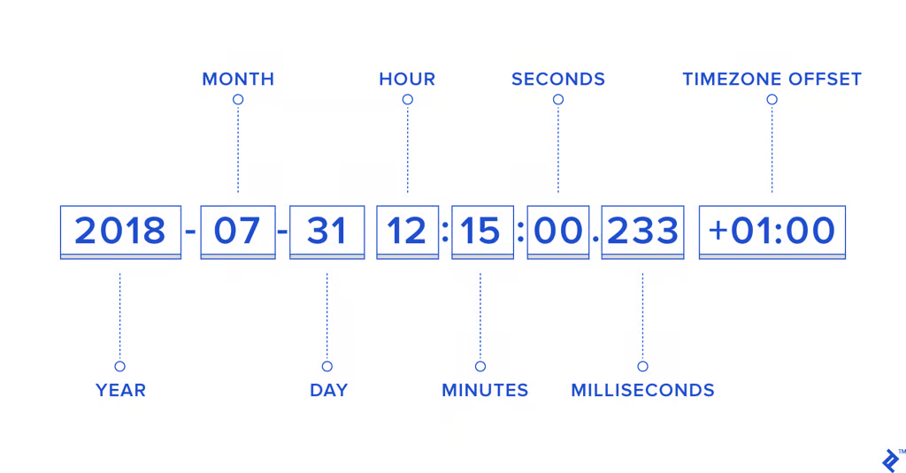
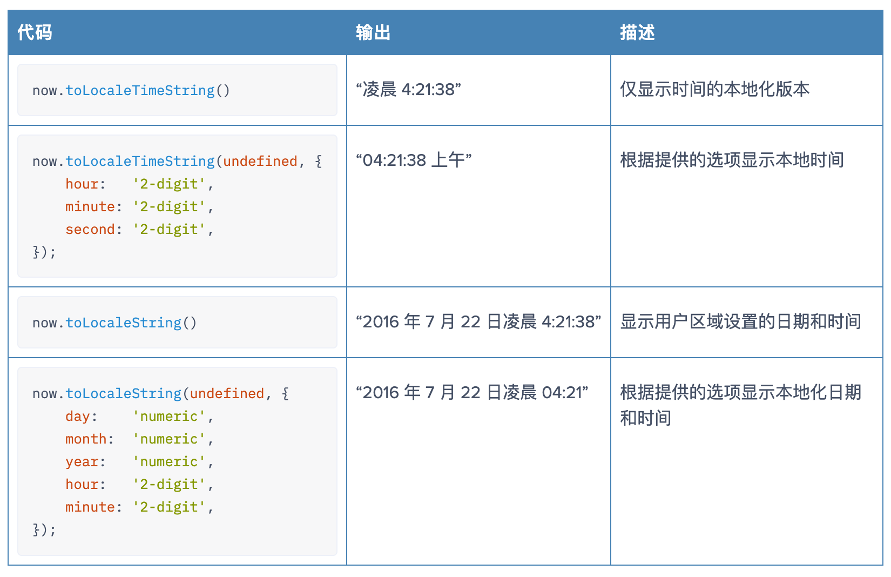
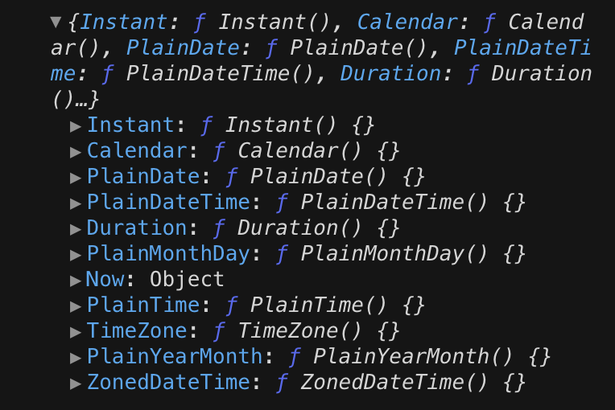
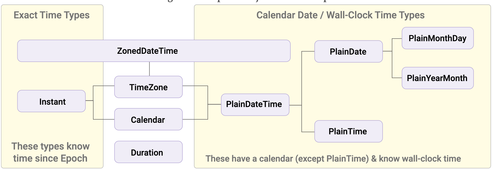
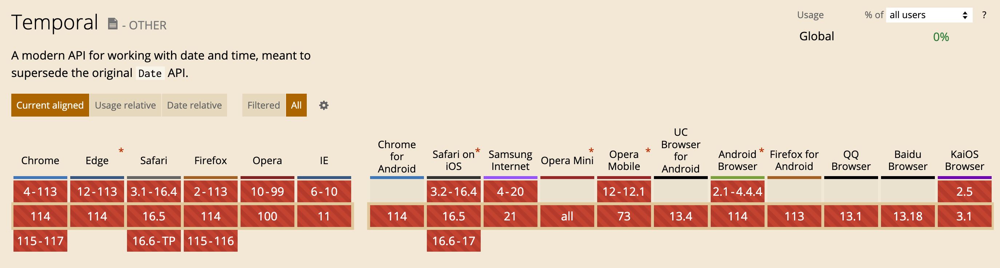

# 日期时间

JavaScript 中的日期和时间操作相对复杂且具有一些特殊的行为，处理日期和时间时常常会遇到很多挑战。下面就来深入理解日期和时间操作，并提供一些日期/时间操作的最佳实践！

**本文大纲：**

1. 标准化时间
2. 日期/时间操作
3. 日期/时间操作最佳实践
4. 现代日期/时间处理 API：Temporal
5. <font style="color:rgb(38, 38, 38);">日期/时间操作库</font>

## 标准化时间

标准化时间是指使用一套公认的标准来表示和衡量时间的方法。这种标准化使得不同地区和系统之间能够统一地解读和比较时间。目前最常用的标准化时间系统是**协调世界时**（Coordinated Universal Time，简称UTC）。UTC 是基于原子钟的国际标准时间，被广泛应用于全球各个领域，包括科学、航空、计算机网络等。

在 Web 应用中，只要知道用户所在的时区，就可以随时转换、展示时间。如果知道用户当地的时间和时区，就可以将其转换为 UTC。计算机中的时间采用 ISO 日期格式，它是 ISO-8601 扩展格式的简化版本，如下所示：



## 日期/时间操作

下面先来看看如何使用 JavaScript 进行日期/时间操作。

### Date对象

Date 对象基于 [Unix Time Stamp](https://pubs.opengroup.org/onlinepubs/9699919799/basedefs/V1_chap04.html#tag_04_16)，即自 1970 年 1 月 1 日（UTC）起经过的毫秒数。其语法如下：

```javascript
new Date();
new Date(value);
new Date(dateString);
new Date(year, monthIndex [, day [, hours [, minutes [, seconds [, milliseconds]]]]]);
```

注意， 创建一个新Date对象的唯一方法是通过 `new` 操作符，例如：`let now = new Date();` 若将它作为常规函数调用（即不加 `new` 操作符），将返回一个字符串，而非 `Date` 对象。

### 获取当前时间

```javascript
const currentDate = new Date();
```

如果不向 Date 构造函数传递任何内容，则返回的日期对象就是当前的日期和时间。然后，就可以将其格式化为仅提取日期部分，如下所示：

```javascript
const currentDate = new Date();

const currentDayOfMonth = currentDate.getDate();
const currentMonth = currentDate.getMonth();
const currentYear = currentDate.getFullYear();

const dateString = currentDayOfMonth + "-" + (currentMonth + 1) + "-" + currentYear;
// '4-7-2023'
```

需要注意，月份是从 0 开始的，一月就是 0，依此类推。

### 获取当前时间戳

可以创建一个新的 Date 对象并使用 `getTime()` 方法来获取当前时间戳：

```javascript
const currentDate = new Date();
const timestamp = currentDate.getTime();
```

在 JavaScript 中，时间戳是自 1970 年 1 月 1 日以来经过的毫秒数。如果不需要支持\<IE8，可以使用`Date.now()`直接获取时间戳，而无需创建新的 Date 对象。

### 解析日期

可以通过不同的方式将字符串转换为 JavaScript 日期对象。Date 对象的构造函数接受多种日期格式：

```javascript
const date1 = new Date("Wed, 27 July 2016 13:30:00");
const date2 = new Date("Wed, 27 July 2016 07:45:00 UTC");
const date3 = new Date("27 July 2016 13:30:00 UTC+05:45");
```

需要注意，这里字符串不需要包含星期几，因为 JS 可以确定任何日期是星期几。

我们还可以传入年、月、日、小时、分钟和秒作为单独的参数：

```javascript
const date = new Date(2016, 6, 27, 13, 30, 0);
```

当然，也可以使用 ISO 日期格式：

```javascript
const date = new Date("2016-07-27T07:45:00Z");
```

但是，如果不明确提供时区，就会有问题：

```javascript
const date1 = new Date("25 July 2016");
const date2 = new Date("July 25, 2016");
date1 === date2;   // false
```

这两个都会展示当地时间 2016 年 7 月 25 日 00:00:00，但是两者是不相等的。

如果使用 ISO 格式，即使只提供日期而不提供时间和时区，它也会自动接受时区为 UTC。

```javascript
new Date("25 July 2016").getTime() !== new Date("2016-07-25").getTime()
new Date("2016-07-25").getTime() === new Date("2016-07-25T00:00:00Z").getTime()
```

### 设置日期格式

现代 JavaScript 在标准命名空间中内置了一些方便的国际化函数`Intl`，使日期格式化变得简单。

为此，我们需要两个对象：`Date` 和 `Intl.DateTimeFormat`，并使用输出首选项进行初始化。假设想使用美国 (M/D/YYYY) 格式，则如下所示：

```javascript
const firstValentineOfTheDecade = new Date(2020, 1, 14);
const enUSFormatter = new Intl.DateTimeFormat('en-US');
console.log(enUSFormatter.format(firstValentineOfTheDecade));
// 2/14/2020
```

如果想要荷兰 (D/M/YYYY) 格式，只需将不同的区域性代码传递给 `DateTimeFormat` 构造函数即可：

```javascript
const nlBEFormatter = new Intl.DateTimeFormat('nl-BE');
console.log(nlBEFormatter.format(firstValentineOfTheDecade));
// 14/2/2020
```

或者美国格式的较长形式，并拼写出月份名称：

```javascript
const longEnUSFormatter = new Intl.DateTimeFormat('en-US', {
    year:  'numeric',
    month: 'long',
    day:   'numeric',
});
console.log(longEnUSFormatter.format(firstValentineOfTheDecade));
// February 14, 2020
```

### 更改日期格式

我们知道了如何解析日期并对其进行格式化，将日期从一种格式更改为另一种格式只需将两者结合起来即可。

例如，如果日期格式为 Jul 21, 2013，并且想要将格式更改为 21-07-2013，可以这样实现：

```javascript
const myDate = new Date("Jul 21, 2013");
const dayOfMonth = myDate.getDate();
const month = myDate.getMonth();
const year = myDate.getFullYear();

function pad(n) {
    return n<10 ? '0'+n : n
}

const ddmmyyyy = pad(dayOfMonth) + "-" + pad(month + 1) + "-" + year;
// "21-07-2013"
```

### 本地化日期

上面讨论的日期格式化方法应该适用于大多数应用，但如果想本地化日期的格式，建议使用 `Date` 对象的`toLocaleDateString()`方法：

```javascript
const today = new Date().toLocaleDateString('en-GB', {  
    day:   'numeric',
    month: 'short',
    year:  'numeric',
});

console.log(today); // '4 Jul 2023'
```

如果想显示日期的数字版本，建议使用以下解决方案：

```javascript
const today = new Date().toLocaleDateString(undefined, {
    day:   'numeric',
    month: 'numeric',
    year:  'numeric',
}); 
```

这里输出了 7/26/2016. 如果想确保月份和日期是两位数，只需更改选项：

```javascript
const today = new Date().toLocaleDateString(undefined, {
    day:   '2-digit',
    month: '2-digit',
    year:  'numeric',
});
```

这样就会输出 07/26/2016。

还可以使用其他一些相关函数来本地化时间和日期的显示方式：



### 计算相对日期和时间

下面是在 JavaScript 日期中添加 20 天的示例（即计算出已知日期后 20 天的日期）：

```javascript
const myDate = new Date("July 20, 2016 15:00:00");
const nextDayOfMonth = myDate.getDate() + 20;
myDate.setDate(nextDayOfMonth);
const newDate = myDate.toLocaleString();
```

原始的日期对象现在表示7月20日之后20天的日期，newDate包含的是表示该日期的本地化字符串。`newDate`的值是`2016/8/9 15:00:00`。

要计算相对时间戳，并得到更精确的差异，可以使用`Date.getTime()`和`Date.setTime()`来处理表示自某个特定时刻（即1970年1月1日）以来的毫秒数的整数。例如，如果想知道距离现在17小时后的时间：

```javascript
const msSinceEpoch = (new Date()).getTime();
const seventeenHoursLater = new Date(msSinceEpoch + 17 * 60 * 60 * 1000);
```

### 比较时间

在比较时间时，首先需要创建日期对象，<、>、<= 和 >= 都可以工作。 因此，比较 2014 年 7 月 19 日和 2014 年 7 月 18 日就很简单：

```javascript
const date1 = new Date("July 19, 2014");
const date2 = new Date("July 28, 2014");

if(date1 > date2) {
    console.log(date1);
} else {
    console.log(date2);
}
```

检查相等性比较棘手，因为表示同一日期的两个日期对象仍然是两个不同的日期对象并且不相等。 比较日期字符串不是一个好主意，因为例如“July 20, 2014”和“20 July 2014”表示相同的日期，但具有不同的字符串表示形式。 下面的代码片段说明了第一点：

```javascript
const date1 = new Date("June 10, 2003");
const date2 = new Date(date1);

const equalOrNot = date1 == date2 ? "相等" : "不等";
console.log(equalOrNot);
```

这里将输出“不等”，这种特殊情况可以通过比较日期的**时间戳**来解决，如下所示：

```javascript
date1.getTime() == date2.getTime()
```

这个例子不太符合实际的应用，因为通常不会从另一个日期对象创建日期对象。下面来看一个更实际的例子。比较用户输入的生日是否与从后端获得的幸运日期相同。

```javascript
const userEnteredString = "12/20/1989"; // MM/DD/YYYY format
const dateStringFromAPI = "1989-12-20T00:00:00Z";

const dateFromUserEnteredString = new Date(userEnteredString)
const dateFromAPIString = new Date(dateStringFromAPI);

if (dateFromUserEnteredString.getTime() == dateFromAPIString.getTime()) {
    transferOneMillionDollarsToUserAccount();
} else {
    doNothing();
}
```

两者都代表相同的日期，但不幸的是用户将无法获得这百万美元。问题在于：JavaScript 会假定时区是浏览器提供的时区，除非另有明确指定。

这意味着，`new Date ("12/20/1989")` 将创建一个日期 `1989-12-20T00:00:00+5:45` 或 `1989-12-19T18:15:00Z` ，而这与时间戳为 1989-12-20T00:00:00Z 是不同的。

不能只更改现有日期对象的时区，因此现在的目标是创建一个新的日期对象，但使用 UTC 而不是本地时区。

在创建日期对象时将忽略用户的时区并使用 UTC。有两种方法可以做到这一点：

1. 根据用户输入日期创建 ISO 格式的日期字符串，并使用它创建 Date 对象。 使用有效的 ISO 日期格式创建 Date 对象，同时明确指定使用的是 UTC 而不是本地时区。

```javascript
const userEnteredDate = "12/20/1989";
const parts = userEnteredDate.split("/");

const userEnteredDateISO = parts[2] + "-" + parts[0] + "-" + parts[1];

const userEnteredDateObj = new Date(userEnteredDateISO + "T00:00:00Z");
const dateFromAPI = new Date("1989-12-20T00:00:00Z");

const result = userEnteredDateObj.getTime() == dateFromAPI.getTime(); // true
```

如果不指定时间，这也适用，因为默认为午夜（即 00:00:00Z）：

```javascript
const userEnteredDate = new Date("1989-12-20");
const dateFromAPI = new Date("1989-12-20T00:00:00Z");
const result = userEnteredDate.getTime() == dateFromAPI.getTime(); // true
```

注意，如果向日期构造函数传递了正确的 ISO 日期格式 YYYY-MM-DD 的字符串，则它会自动采用 UTC。

2. JavaScript 提供了一个简洁的 Date.UTC() 函数，可以使用它来获取日期的 UTC 时间戳。从日期中提取组件并将它们传递给函数。

```javascript
const userEnteredDate = new Date("12/20/1989");
const userEnteredDateTimeStamp = Date.UTC(userEnteredDate.getFullYear(), userEnteredDate.getMonth(), userEnteredDate.getDate(), 0, 0, 0);

const dateFromAPI = new Date("1989-12-20T00:00:00Z");
const result = userEnteredDateTimeStamp == dateFromAPI.getTime(); // true
```

### 日期差异

下面来讨论两个用例：

* **计算两个日期之间的天数**

将两个日期转换为 UTC 时间戳，找出以毫秒为单位的差异并找到等效的天数。

```javascript
const dateFromAPI = "2016-02-10T00:00:00Z";

const now = new Date();
const datefromAPITimeStamp = (new Date(dateFromAPI)).getTime();
const nowTimeStamp = now.getTime();

const microSecondsDiff = Math.abs(datefromAPITimeStamp - nowTimeStamp);

// 使用 Math.round 代替 Math.floor 来考虑某些 DST 情况
// 每天的毫秒数 = 24 小时/天 * 60 分钟/小时 * 60 秒/分钟 * 1000 毫秒/秒
const daysDiff = Math.round(microSecondsDiff / (1000 * 60 * 60  * 24));

console.log(daysDiff);
```

* **根据出生日期计算用户的年龄**

```javascript
const birthDateFromAPI = "12/10/1989";
```

## 日期/时间操作最佳实践

### 从用户获取日期和时间

如果需要从用户那里获取日期和时间，那么很可能需要的是他们的本地日期时间。我们在日期计算部分看到`Date`构造函数可以接受多种不同的日期格式。

为了消除任何混淆，建议使用`new Date(year, month, day, hours, minutes, seconds, milliseconds)`格式来创建日期，这是使用`Date`构造函数时能够做到的最明确的方式。

可以使用允许省略最后四个参数的变体，如果它们为零；例如，`new Date(2012, 10, 12)`与`new Date(2012, 10, 12, 0, 0, 0, 0)`是相同的，因为未指定的参数默认为零。

例如，如果正在使用一个日期和时间选择器，它给出了日期`2012-10-12`和时间`12:30`，可以提取这些部分并创建一个新的`Date`对象，如下所示：

```javascript
const datePickerDate = '2012-10-12';
const timePickerTime = '12:30';

const [year, month, day] = datePickerDate.split('-').map(Number);
const [hours, minutes] = timePickerTime.split(':').map(Number);

const dateTime = new Date(year, month - 1, day, hours, minutes);

console.log(dateTime); // Fri Oct 12 2012 12:30:00 GMT+0800 (中国标准时间)
```

在上述示例中，首先将日期和时间分别存储在`datePickerDate`和`timePickerTime`变量中。然后，使用`split()`方法将日期字符串和时间字符串拆分为数值数组，并将其存储在`[year, month, day]`和`[hours, minutes]`变量中。最后，使用这些值创建一个新的`Date`对象，注意按照 JavaScript 的月份规则，需要将月份减去1。这样就得到了一个包含用户所选日期和时间的`Date`对象。

通过遵循这种方法，可以明确地指定日期和时间，以便消除不同日期解析格式可能带来的混乱。

```javascript
const dateFromPicker = "2012-10-12";
const timeFromPicker = "12:30";

const dateParts = dateFromPicker.split("-");
const timeParts = timeFromPicker.split(":");
const localDate = new Date(dateParts[0], dateParts[1]-1, dateParts[2], timeParts[0], timeParts[1]);
```

注意，尽量避免从字符串创建日期，除非它是 ISO 日期格式。 请改用 `Date(year, month, date, hours, minutes, seconds, microseconds)` 方法。

### 仅获取日期

如果只获取日期（例如用户的生日），最好将格式转换为有效的 ISO 日期格式，以消除任何可能导致日期在转换为 UTC 时向前或向后移动的时区信息。 例如：

```javascript
const dateFromPicker = "12/20/2012";
const dateParts = dateFromPicker.split("/");
const ISODate = dateParts[2] + "-" + dateParts[0] + "-" + dateParts[1];
const birthDate = new Date(ISODate).toISOString();
```

如果使用有效的 ISO 日期格式 (YYYY-MM-DD) 输入创建一个 Date 对象，它将默认为 UTC，而不是默认为浏览器的时区。

### 存储日期

始终以 UTC 格式存储日期时间，始终将 ISO 日期字符串或时间戳保存到数据库。实践证明，在后端存储本地时间是一个坏主意，最好让浏览器在前端处理到本地时间的转换。不应该将“July 20, 1989 12:10 PM”之类的日期时间字符串发送到后端。

可以使用 Date 对象的 `toISOString()` 或 `toJSON()` 方法将本地时间转换为 UTC。

```javascript
const dateFromUI = "12-13-2012";
const timeFromUI = "10:20";
const dateParts = dateFromUI.split("-");
const timeParts = timeFromUI.split(":");

const date = new Date(dateParts[2], dateParts[0]-1, dateParts[1], timeParts[0], timeParts[1]);

const dateISO = date.toISOString();

$.post("http://example.com/", {date: dateISO}, ...)
```

### 显示日期和时间

1. 从 API 获取时间戳或 ISO 格式的日期。
2. 创建一个日期对象。
3. 使用 `toLocaleString()` 或 `toLocaleDateString()` 和 `toLocaleTimeString()` 方法或日期库来显示本地时间。

```javascript
const dateFromAPI = "2016-01-02T12:30:00Z";

const localDate = new Date(dateFromAPI);
const localDateString = localDate.toLocaleDateString(undefined, {  
    day:   'numeric',
    month: 'short',
    year:  'numeric',
});


const localTimeString = localDate.toLocaleTimeString(undefined, {
    hour:   '2-digit',
    minute: '2-digit',
    second: '2-digit',
});
```

## 现代日期/时间处理 API：Temporal

JavaScript 中的日期处理 Date() 对象一直是饱受诟病，该对象是1995 年受到 Java 的启发而实现的，自此就一直没有改变过。虽然Java已经放弃了这个对象，但是 `Date()` 仍保留在 JavaScript 中来实现浏览器的兼容。

Date() API 存在的问题：

* 只支持UTC和用户的PC时间；
* 不支持公历以外的日历；
* 字符串到日期解析容易出错；
* Date 对象是可变的，比如：

```javascript
const today = new Date();
const tomorrow = new Date(today.setDate(today.getDate() + 1));

console.log(tomorrow);  
console.log(today);
```

此时，两个时间输出是一样的，不符合我们的预期。正因为 Date() 对象存在的种种问题。平时我们经常需要借助 moment.js、Day.js等日期库，但是它们的体积较大，有时一个简单的日期处理就需要引入一个库，得不偿失。

目前，由于Date API 在很多库和浏览器引擎中的广泛使用，没有办法修复API的不好的部分。而改变Date API 的工作方式也很可能会破坏许多网站和库。

正因如此，TC39提出了一个全新的用于处理日期和时间的标准对象和函数——Temporal。新的Temporal API 提案旨在解决Date API的问题。它为 JavaScript 日期/时间操作带来了以下修复：

* 仅可以创建和处理不可变Temporal对象；
* 提供用于日期和时间计算的简单 API；
* 支持所有时区；
* 从 ISO-8601 格式进行严格的日期解析；
* 支持非公历。

Temporal 将取代 Moment.js 之类的库，这些库很好地填补了 JavaScript 中的空白，这种空白非常普遍，因此将功能作为语言的一部分更有意义。

由于该提案还未正式发布，所以，可以借助官方提供的prlyfill来测试。首选进行安装：

```javascript
npm install @js-temporal/polyfill
```

导入并使用：

```javascript
import { Temporal } from '@js-temporal/polyfill';

console.log(Temporal);
```

Temporal 对象如下：



下面就来看看 Temporal 对象有哪些实用的功能。



### 当前时间和日期

`Temporal.Now` 会返回一个表示当前日期和时间的对象：

```javascript
// 自1970年1月1日以来的时间（秒和毫秒）
Temporal.Now.instant().epochSeconds;
Temporal.Now.instant().epochMilliseconds;

// 当前位置的时间
Temporal.Now.zonedDateTimeISO();

// 当前时区
Temporal.Now.timeZone();

// 指定时区的当前时间
Temporal.Now.zonedDateTimeISO('Europe/London');
```

### 实例时间和日期

`Temporal.Instant` 根据 ISO 8601 格式的字符串返回一个表示日期和时间的对象，结果会精确到纳秒：

```javascript
Temporal.Instant.from('2022-02-01T05:56:78.999999999+02:00[Europe/Berlin]');
// 输出结果：2022-02-01T03:57:18.999999999Z 
Temporal.Instant.from('2022-02-011T05:06+07:00');
// 输出结果：2022-01-31T22:06:00Z
```

除此之外，还可以获取纪元时间的对应的日期（UTC 1970年1月1日0点是纪元时间）：

```javascript
Temporal.Instant.fromEpochSeconds(1.0e8);
// 输出结果：1973-03-03T09:46:40Z
```

### 时区日期和时间

`Temporal.ZonedDateTime` 返回一个对象，该对象表示在特定时区的日期/时间：

```javascript
new Temporal.ZonedDateTime(
  1234567890000, // 纪元时间
  Temporal.TimeZone.from('Europe/London'), // 时区
  Temporal.Calendar.from('iso8601') // 默认日历
);

Temporal.ZonedDateTime.from('2025-09-05T02:55:00+02:00[Africa/Cairo]');

Temporal.Instant('2022-08-05T20:06:13+05:45').toZonedDateTime('+05:45');
// 输出结果：

Temporal.ZonedDateTime.from({
  timeZone: 'America/New_York',
  year: 2025,
  month: 2,
  day: 28,
  hour: 10,
  minute: 15,
  second: 0,
  millisecond: 0,
  microsecond: 0,
  nanosecond: 0
});
// 输出结果：2025-02-28T10:15:00-05:00[America/New_York]
```

### 简单的日期和时间

我们并不会总是需要使用精确的时间，因此 Temporal API 提供了独立于时区的对象。这些可以用于更简单的活动。

* `Temporal.PlainDateTime`：指日历日期和时间；
* `Temporal.PlainDate`：指特定的日历日期；
* `Temporal.PlainTime`：指一天中的特定时间；
* `Temporal.PlainYearMonth`：指没有日期成分的日期，例如“2022 年 2 月”；
* `Temporal.PlainMonthDay`：指没有年份的日期，例如“10 月 1 日”。

它们都有类似的构造函数，以下有两种形式来创建简单的时间和日期：

```javascript
new Temporal.PlainDateTime(2021, 5, 4, 13, 14, 15);
Temporal.PlainDateTime.from('2021-05-04T13:14:15');

new Temporal.PlainDate(2021, 5, 4);
Temporal.PlainDate.from('2021-05-04');

new Temporal.PlainTime(13, 14, 15);
Temporal.PlainTime.from('13:14:15');

new Temporal.PlainYearMonth(2021, 4);
Temporal.PlainYearMonth.from('2019-04');

new Temporal.PlainMonthDay(3, 14);
Temporal.PlainMonthDay.from('03-14');
```

### 日期和时间值

所有 Temporal 对象都可以返回特定的日期/时间值。例如，使用`ZonedDateTime`：

```javascript
const t1 = Temporal.ZonedDateTime.from('2025-12-07T03:24:30+02:00[Africa/Cairo]');

t1.year;        // 2025
t1.month;       // 12
t1.day;         // 7
t1.hour;        // 3
t1.minute;      // 24
t1.second;      // 30
t1.millisecond; // 0
t1.microsecond; // 0
t1.nanosecond;  // 0
```

其他有用的属性包括：

* dayOfWeek（周一为 1 至周日为 7）
* dayOfYear（1 至 365 或 366）
* weekOfYear（1 到 52，有时是 53）
* daysInMonth（28、29、30、31）
* daysInYear（365 或 366）
* inLeapYear（true或false）

### 比较和排序日期

所有 Temporal 对象都可以使用 `compare()` 返回整数的函数进行比较。例如，比较两个`ZonedDateTime`对象：

```javascript
Temporal.ZonedDateTime.compare(t1, t2);
```

这个比较结果会有三种情况：

* 当两个时间值相等时，返回 0；
* 当 t1 在 t2 之后时，返回 1；
* 当 t1 在 t2 之前时，但会 -1；

```javascript
const date1 = Temporal.Now,
const date2 = Temporal.PlainDateTime.from('2022-05-01');

Temporal.ZonedDateTime.compare(date1, date2); // -1
```

`compare()` 的结果可以用于数组的 `sort()` 方法来对时间按照升序进行排列（从早到晚）：

```javascript
const t = [
  '2022-01-01T00:00:00+00:00[Europe/London]',
  '2022-01-01T00:00:00+00:00[Africa/Cairo]',
  '2022-01-01T00:00:00+00:00[America/New_York]'
].map(d => Temporal.ZonedDateTime.from(d))
  .sort(Temporal.ZonedDateTime.compare);
```

### 日期计算

提案还提供了几种方法来对任何 Temporal 对象执行日期计算。当传递一个`Temporal.Duration`对象时，它们都会返回一个相同类型的新的 Temporal，该对象使用years, months, weeks, days, hours, minutes, seconds, milliseconds, microseconds 和 nanoseconds 字段来设置时间。

```javascript
const t1 = Temporal.ZonedDateTime.from('2022-01-01T00:00:00+00:00[Europe/London]');

t1.add({ hours: 8, minutes: 30 }); // 往后8小时30分

t1.subtract({ days: 5 });  // 往前5天

t1.round({ smallestUnit: 'month' });  // 四舍五入到最近的月份
```

until() 和 since() 方法会返回一个对象，该 Temporal.Duration 对象描述基于当前日期/时间的特定日期和时间之前或之后的时间，例如：

```javascript
t1.until().months; // 到t1还有几个月

t2.until().days;  // 到t2还有几天

t3.since().weeks; // t3已经过去了几周
```

`equals()` 方法用来确定两个日期/时间值是否相同：

```javascript
const d1 = Temporal.PlainDate.from('2022-01-31');
const d2 = Temporal.PlainDate.from('2023-01-31');
d1.equals(d2);  // false
```

### 格式化日期

虽然这不是 Temporal API 的一部分，但 JavaScript Intl（国际化）API提供了一个 `DateTimeFormat()` 构造函数，可以用于格式化 Temporal 或 Date 对象：

```javascript
const d = new Temporal.PlainDate(2022, 3, 14);

// 美国日期格式：3/14/2022
new Intl.DateTimeFormat('en-US').format(d);

// 英国日期格式：14/3/2022
new Intl.DateTimeFormat('en-GB').format(d);

// 西班牙长日期格式：miércoles, 14 de abril de 2022
new Intl.DateTimeFormat('es-ES', { dateStyle: 'full' }).format(d);
```

### 浏览器支持

目前还没有浏览器支持 Temporal API：



**Temporal 提案**：https://tc39.es/proposal-temporal/

## 日期/时间操作库

在 JavaScript 中进行日期/时间操作是一个很麻烦的事，JS的生态中有很多实用的日期操作库，最后就来分享几个实用的日期库。

### Moment.js

[Moment.js](https://github.com/moment/moment) 是一个轻量级 JavaScript 日期库，用于解析、验证、操作和格式化日期，是一个很受欢迎的日期操作库。

不过，Moment.js 是一个遗留项目，现在处于维护模式。维护者认为，无法重构 \*\*Moment.js \*\*来满足现代 JavaScript 开发的需求，例如不变性和 tree shaking。Lighthouse（Chrome 的内置审核工具）警告不要使用 Moment，因为它的大小较大 (329 kb)。

#### 安装Moment.js

可以通过以下任一方式来安装该库：

```shell
npm install moment --save   # npm
yarn add moment             # Yarn
Install-Package Moment.js   # NuGet
spm install moment --save   # spm
meteor add momentjs:moment  # meteor
```

#### 导入Moment.js

在 JavaScript 文件中，导入Moment.js库：

```javascript
const moment = require('moment');
```

#### 创建日期对象

可以传递一个日期字符串或日期对象给`moment()`函数，然后返回一个Moment对象：

```javascript
const date = moment('2023-07-04');
```

#### 格式化日期显示

Moment.js 提供了丰富的日期格式化选项。可以使用`format()`方法将日期格式化为所需的字符串格式：

```javascript
const formattedDate = date.format('YYYY-MM-DD');
console.log(formattedDate); // 输出：2023-07-04
```

#### 日期运算

Moment.js提供了许多方便的方法来进行日期和时间的运算。下面是一些示例：

```javascript
// 添加一天
const tomorrow = date.add(1, 'day');
console.log(tomorrow.format('YYYY-MM-DD')); // 输出：2023-07-05

// 减去一个月
const lastMonth = date.subtract(1, 'month');
console.log(lastMonth.format('YYYY-MM-DD')); // 输出：2023-06-04

// 比较日期
const otherDate = moment('2023-07-10');
console.log(date.isBefore(otherDate)); // 输出：true
console.log(date.isAfter(otherDate)); // 输出：false
```

Moment.js还提供了许多其他常用的功能，如获取当前日期、解析日期字符串、计算日期之间的差异等。

### Date-fns

[Date-fns](https://www.skypack.dev/view/date-fns) 是一个现代、轻量级的JavaScript日期处理库，用于在浏览器和Node.js环境中处理日期和时间。它的设计目标是提供一组简单、纯函数式的API来执行各种日期操作，而不依赖于全局对象。

以下是Date-fns 的特点：

1. **轻量级**：Date-fns非常小巧，只包含所需的功能，可以减少项目的文件大小。
2. **纯函数**：Date-fns的函数都是纯函数，即相同的输入总是产生相同的输出，不存在副作用。这使得代码更可预测、易测试和可维护。
3. **易于使用**：Date-fns的API设计简单易懂，与现代JavaScript的语法和惯用法保持一致。它提供了大量的日期处理功能，如格式化、解析、比较、计算等。
4. **兼容性**：Date-fns支持所有现代的浏览器和Node.js版本。

#### 安装Date-fns

可以使用npm或yarn等包管理工具来安装Date-fns。在项目目录下运行以下命令安装Date-fns：

```javascript
npm install date-fns
```

#### 导入Date-fns

在JavaScript文件中导入所需的Date-fns函数：

```javascript
import { format, parseISO, differenceInDays } from 'date-fns';
```

#### 使用Date-fns函数

使用导入的函数来执行各种日期操作。以下是一些示例：

```javascript
const date = new Date();

// 格式化日期
const formattedDate = format(date, 'yyyy-MM-dd');
console.log(formattedDate); // 输出：2023-07-04

// 解析日期字符串
const parsedDate = parseISO('2023-07-04');
console.log(parsedDate); // 输出：Tue Jul 04 2023 00:00:00 GMT+0530 (India Standard Time)

// 计算日期之间的差异
const startDate = new Date(2023, 6, 1);
const endDate = new Date(2023, 6, 10);
const diff = differenceInDays(endDate, startDate);
console.log(diff); // 输出：9
```

在上述示例中，使用了`format()`函数将日期格式化为指定的字符串格式，使用了`parseISO()`函数解析日期字符串为日期对象，以及使用了`differenceInDays()`函数计算两个日期之间的天数差异。

### Day.js

[Day.js](https://www.skypack.dev/view/dayjs) 是一个轻量级的JavaScript日期处理库，用于解析、操作和格式化日期对象。它的设计目标是提供一个简单、灵活的API，使得处理日期和时间变得更加方便。

以下是 Day.js 的特点：

1. **轻量级**：Day.js非常小巧，压缩后仅有2 KB左右的大小，可以减少项目的文件大小。
2. **易用性**：Day.js的API设计简洁明了，与现代JavaScript的语法和惯用法保持一致。你可以轻松地对日期进行解析、格式化、计算、比较等操作。
3. **不可变性**：Day.js的日期对象是不可变的，即每次对日期进行操作都会返回一个新的日期对象，而不会修改原始对象。这种设计模式有助于避免副作用，并提高代码的可预测性。
4. **Moment.js兼容性**：Day.js的API设计与Moment.js类似，因此可以很容易地从Moment.js迁移到Day.js，而无需更改太多代码。

#### 安装Day.js

可以使用npm或yarn等包管理工具来安装Day.js。在项目目录下运行以下命令安装Day.js：

```javascript
npm install dayjs
```

#### 导入Day.js

在JavaScript文件中导入Day.js：

```javascript
import dayjs from 'dayjs';
```

#### 使用Day.js函数

使用Day.js的函数来进行日期操作。以下是一些示例：

```javascript
const date = dayjs();

// 格式化日期
const formattedDate = date.format('YYYY-MM-DD');
console.log(formattedDate); // 输出：2023-07-04

// 解析日期字符串
const parsedDate = dayjs('2023-07-04');
console.log(parsedDate); // 输出：Tue Jul 04 2023 00:00:00 GMT+0530 (India Standard Time)

// 计算日期之间的差异
const startDate = dayjs('2023-07-01');
const endDate = dayjs('2023-07-10');
const diff = endDate.diff(startDate, 'day');
console.log(diff); // 输出：9
```

在上述示例中，使用了`format()`函数将日期格式化为指定的字符串格式，使用了`dayjs()`函数解析日期字符串为日期对象，以及使用了`diff()`函数计算两个日期之间的天数差异。

### Luxon

[Luxon](https://www.skypack.dev/view/luxon) 是一个用于处理日期、时间和时区的先进 JavaScript 库。它提供了一组强大的功能，可以帮助你在浏览器和 Node.js 环境中轻松处理日期和时间。

以下是 Luxon 的特点：

1. **强大的日期和时间处理**：Luxon 提供了丰富的 API，用于解析、格式化、操作和比较日期和时间。它支持多种标准和自定义的日期和时间格式，包括 ISO 8601、RFC 2822 等。
2. **支持时区处理**：Luxon 支持全球各地的时区，并提供了灵活的时区转换功能。它使用 IANA（Olson）时区数据库，确保准确的时区信息。
3. **不可变性**：Luxon 的日期对象是不可变的，每次对日期进行操作都会返回一个新的日期对象，而不会修改原始对象。这种设计模式有助于避免副作用，并提高代码的可预测性。
4. **链式调用**：Luxon 的 API 允许你使用链式调用，使得代码更简洁、易读。你可以按顺序执行多个操作，而无需多次引用日期对象。

#### 安装 Luxon

使用 npm 或 yarn 等包管理工具，在项目目录下运行以下命令安装 Luxon：

```javascript
npm install luxon
```

#### 导入 Luxon

在 JavaScript 文件中导入 Luxon：

```javascript
import { DateTime } from 'luxon';
```

#### 使用 Luxon 函数

使用 Luxon 的函数来处理日期和时间。以下是一些示例：

```javascript
const now = DateTime.now();

// 格式化日期
const formattedDate = now.toFormat('yyyy-MM-dd');
console.log(formattedDate); // 输出：2023-07-04

// 解析日期字符串
const parsedDate = DateTime.fromISO('2023-07-04');
console.log(parsedDate); // 输出：DateTime { ... }

// 计算日期之间的差异
const startDate = DateTime.fromISO('2023-07-01');
const endDate = DateTime.fromISO('2023-07-10');
const diff = endDate.diff(startDate, 'days').toObject().days;
console.log(diff); // 输出：9
```

在上述示例中，使用了 `toFormat()` 函数将日期格式化为指定的字符串格式，使用了 `fromISO()` 函数解析 ISO 8601 格式的日期字符串为日期对象，以及使用了 `diff()` 函数计算两个日期之间的天数差异。


> 更新: 2023-07-17 15:58:44  
> 原文: <https://www.yuque.com/cuggz/feplus/etizvyma9k6pfo8r>