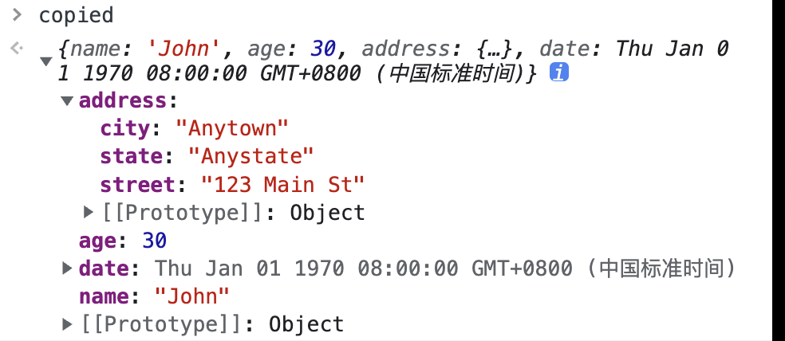
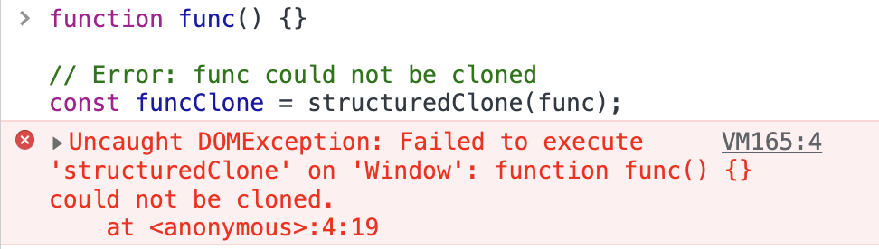
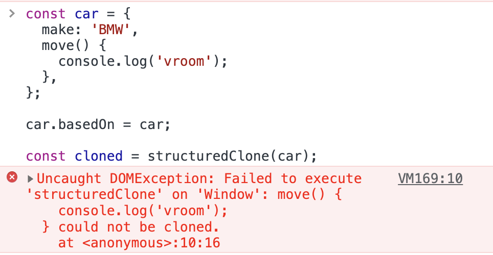
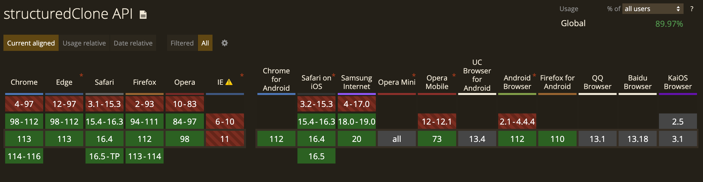
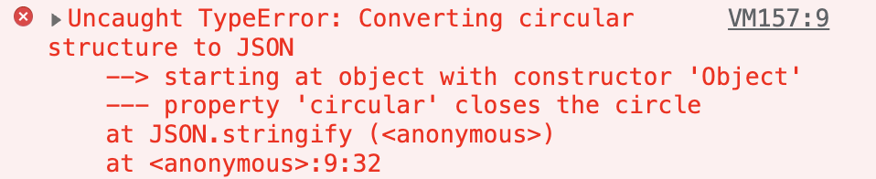

# 现代深拷贝

在前端开发中深拷贝是一个常见需求，我们可以通过 JSON 转换、递归、Lodash `_.cloneDeep()` 等方式实现。实际上，JavaScript 中提供了一个原生 API 来执行对象的深拷贝：`structuredClone`。它可以通过结构化克隆算法创建一个给定值的深拷贝，并且还可以传输原始值的可转移对象。本文将深入探讨 `structuredClone()` 函数的原理、使用方法及注意事项，以帮助开发者更好地应用现代 JavaScript 技术实现深拷贝。

## 基本使用

`structuredClone()` 的实用方式很简单，只需<font style="color:rgb(36, 36, 36);">将原始对象传递给该函数，它将返回具有不同引用和对象属性引用的深层副本·</font>：

```javascript
const originalObject = {
  name: "John",
  age: 30,
  address: {
    street: "123 Main St",
    city: "Anytown",
    state: "Anystate"
  },
  date: new Date(123),
  
}

const copied = structuredClone(originalObject);
```

这里 `copied` 的结果如下：



可以看到，这里不仅拷贝了对象，还拷贝了嵌套的对象和数组，甚至 Date 对象。`structuredClone()` 不仅可以做到这些，还可以：

* 拷贝无限嵌套的对象和数组；
* 拷贝循环引用；
* 拷贝各种 JavaScript 类型，例如Date、Set、Map、Error、RegExp、ArrayBuffer, Blob、File、ImageData等；
* 拷贝<font style="color:rgb(36, 36, 36);">同样，所使用的结构化克隆算法也</font><font style="color:rgb(36, 36, 36);background-color:rgb(240, 240, 240);">structuredClone()</font><font style="color:rgb(36, 36, 36);">不能克隆 DOM 元素。将 HTMLElement 对象传递给</font><font style="color:rgb(36, 36, 36);background-color:rgb(240, 240, 240);">structuredClone()</font><font style="color:rgb(36, 36, 36);">将导致如上所示的错误。</font>
* 任何**可转移的对象。**

> 在 JavaScript 中，可转移对象（Transferable Objects）是指 ArrayBuffer 和 MessagePort 等类型的对象，它们可以在主线程和 Web Worker 线程之间相互传递，同时还可以实现零拷贝内存共享，提高性能。这是由于可转移对象具有两个特点：
>
> 1. **可共享**：可转移对象本身没有所有权，可以在多个线程之间共享，实现零拷贝内存共享。
> 2. **可转移**：调用 Transferable API 时，可转移对象会从发送方（发送线程）转移到接收方（接收线程），不再存在于原始线程中，因此可以避免内存拷贝和分配等开销。
>
> 要注意的是，使用可转移对象时必须小心处理，因为一旦对象被转移，原线程将不再拥有该对象的所有权，因此在发送线程中不能再访问该对象。此外，在接收线程中使用可转移对象时，也需要根据需求进行显式释放，否则可能会导致内存泄漏和其他问题。

例如，对于以下结构，仍然可以使用`structuredClone()`进行深拷贝：

```javascript
const originalObject = {
  set: new Set([1, 3, 3]),
  map: new Map([[1, 2]]),
  regex: /foo/,
  deep: { array: [ new File(someBlobData, 'file.txt') ] },
  error: new Error('Hello!')
}
originalObject.circular = originalObject

const copied = structuredClone(originalObject)
```

当对象中存在循环引用时，仍然可以通过 `structuredClone()` 进行深拷贝。

## 缺点

当然，`structuredClone()` 也并不是完美的，下面就来看看有哪些 `structuredClone()` 不能拷贝的数据类型。

### 函数或方法

当拷贝函数时，就会抛出异常：

```javascript
function func() {}

const funcClone = structuredClone(func);
```

输出结果如下：



当拷贝方法时，也会抛出异常：

```javascript
const car = {
  make: 'BMW',
  move() {
    console.log('vroom');
  },
};

car.basedOn = car;

const cloned = structuredClone(car);
```

输出结果如下：



### DOM 节点

当拷贝 DOM 节点时，也会抛出异常：

```javascript
const input = document.querySelector('#text-field');

// ❌ Failed: HTMLInputElement object could not be cloned.
const clone = structuredClone(input);
```

### 属性描述符、setter 和 getter

属性描述符、`setter` 和 `getter` 以及类似的元数据都不能被克隆。例如，对于 `getter`，结果值被克隆，但 `getter` 函数本身没有被克隆（或任何其他属性元数据）：

```javascript
structuredClone({ get foo() { return 'bar' } })
```

输出结果如下：

```javascript
{ foo: 'bar' }
```

### 对象原型

原型链不能被遍历或拷贝。所以如果克隆一个实例 `MyClass`，克隆的对象将不再是这个类的一个实例（但是这个类的所有有效属性都将被拷贝）

```javascript
class MyClass { 
  foo = 'bar' 
  myMethod() { /* ... */ }
}
const myClass = new MyClass()

const cloned = structuredClone(myClass)
// { foo: 'bar' }

cloned instanceof myClass // false
```

## 支持拷贝的类型

`structuredClone()` 支持拷贝的类型如下：

### JS 内置对象

Array（数组）、ArrayBuffer（数据缓冲区）、Boolean（布尔类型）、DataView（数据视图）、Date（日期类型）、Error（错误类型，包括下面列出的具体类型）、Map（映射类型）、Object （仅指纯对象，如从对象字面量中创建的对象）、原始类型（除`symbol`外，即 number、string、null、undefined、boolean、BigInt）、RegExp（正则表达式）、Set（集合类型）、TypedArray（类型化数组）。

### Error 类型

Error、EvalError、RangeError、ReferenceError、SyntaxError、TypeError、URIError。

### Web/API 类型

AudioData、Blob、CryptoKey、DOMException、DOMMatrix、DOMMatrixReadOnly、DOMPoint、DomQuad、DomRect、File、FileList、FileSystemDirectoryHandle、FileSystemFileHandle、FileSystemHandle、ImageBitmap、ImageData、RTCCertificate、VideoFrame。

## 浏览器支持

目前主流浏览器都支持 structuredClone API：



## 为什么不用 `JSON.parse(JSON.stringify(x))`？

我们平时可能会通过 `JSON.parse(JSON.stringify(x))` 来进行深拷贝，那它有什么缺点呢？来看下面的例子：

```javascript
const originalObject = {
  title: "hello",
  date: new Date(123),
  attendees: ["Steve"]
}

const copied = JSON.parse(JSON.stringify(originalObject))
```

通过这种方式，得到的 `copied` 值如下：

```javascript
{
    title: "hello",
    date: "1970-01-01T00:00:00.123Z",
    attendees: [
        "Steve"
    ]
}
```

可以看到，这里的 date 并不是我们想要的 Date 对象，而是一个字符串。发生这种情况就是因为 `JSON.stringify` 只能处理基本对象、数组和基本类型，而其他类型的值在转换之后都可能出现出乎意料的结果，例如 Date 会转化为字符串， Set 会转化为 `{}`。`JSON.stringify`甚至完全忽略某些内容，比如`undefined`或函数。

例如：

```javascript
const originalObject = {
  set: new Set([1, 3, 3]),
  map: new Map([[1, 2]]),
  regex: /foo/,
  deep: { array: [ new File(someBlobData, 'file.txt') ] },
  error: new Error('Hello!')
}

const copied = JSON.parse(JSON.stringify(originalObject))
```

这里得到的 `copied` 值如下：

```javascript
{
  set: {},
  map: {},
  regex: {},
  deep": {
    array: [
      {}
    ]
  },
  error: {},
}
```

除此之外，`JSON.parse(JSON.stringify(x))` 无法对包含循环引用的对象进行深克隆：

```javascript
const originalObject = {
  set: new Set([1, 3, 3]),
  map: new Map([[1, 2]]),
  regex: /foo/,
  error: new Error('Hello!')
}
originalObject.circular = originalObject

const copied = JSON.parse(JSON.stringify(originalObject))
```

当执行上述代码时，就会报错：



所以，如果对象没有上面说的这些情况，使用 `JSON.parse(JSON.stringify(x))` 进行深克隆是完全没有问题的。如果有，就可以使用 `structuredClone()` 来进行深拷贝。


> 更新: 2023-05-30 15:04:15  
> 原文: <https://www.yuque.com/cuggz/feplus/swgywsqpn542bv6l>