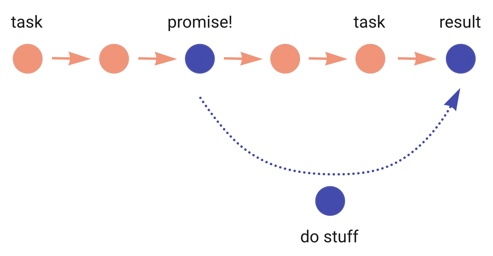
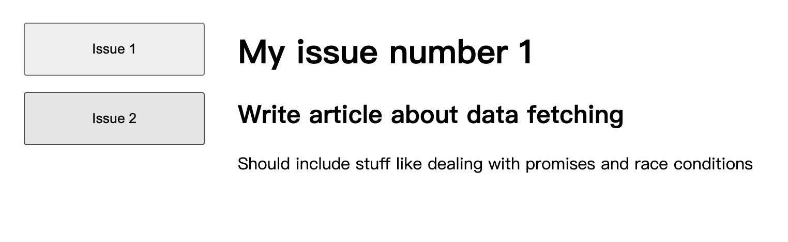
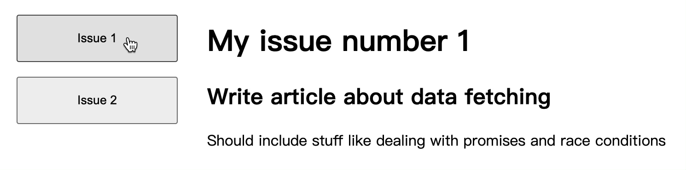
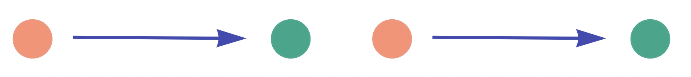
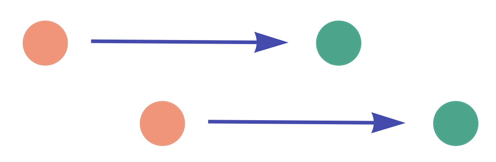
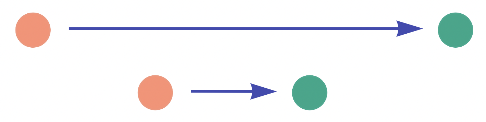
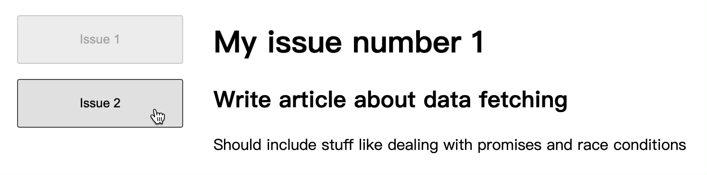
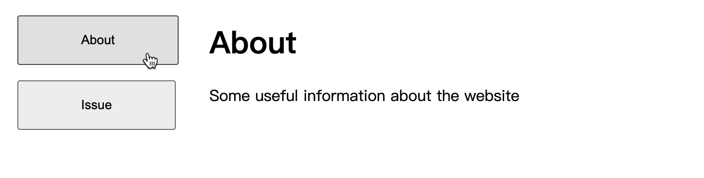
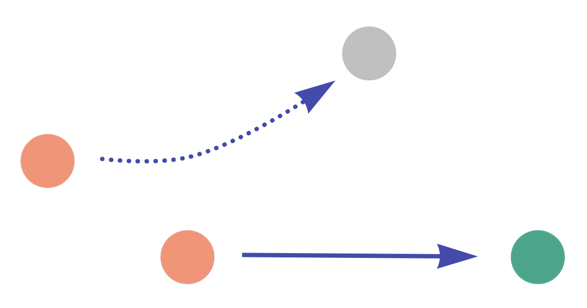

# 竞态条件

本文将深入研究 Promise 是如何导致竞态条件的，以及防止竞态条件发生的几种方法！

## 1. Promise和竞态条件

### （1）Promise

我们知道，JavaScript 是单线程的，代码会同步执行，即按顺序从上到下执行。Promise 是可供我们异步执行的方法之一。使用 Promise，可以触发一个任务并立即进入下一步，而无需等待任务完成，该任务承诺它会在完成时通知我们。

最重要和最广泛使用 Promise 的情况之一就是数据获取。不管是 fetch 还是 axios，Promise 的行为都是一样的。

从代码的角度来看，就是这样的：

```javascript
console.log('first step');

fetch('/some-url') // 创建 Promise
  .then(() => { // 等待 Promise 完成
      console.log('second step'); // 成功
    }
  )
  .catch(() => {
    console.log('something bad happened'); // 发生错误
  })

console.log('third step');
```

这里会创建 Promise fetch('/some-url')，并在 `.then` 中获得结果时执行某些操作，或者在 `.catch` 中处理错误。



### （2）实际应用

Promise 中最有趣的部分之一是它可能会导致竞态条件。 下面是一个非常简单的应用：

```javascript
import "./styles.scss";
import { useState, useEffect } from "react";

type Issue = {
  id: string;
  title: string;
  description: string;
  author: string;
};

const url1 =
  "https://run.mocky.io/v3/ebf1b8f3-0368-4e3b-a965-1c5fdcc5d490?mocky-delay=2000ms";
const url2 =
  "https://run.mocky.io/v3/27398801-05e2-4a62-8719-2a2d40974e52?mocky-delay=2000ms";

const Page = ({ id }: { id: string }) => {
  const [data, setData] = useState<Issue>({} as Issue);
  const [loading, setLoading] = useState(false);
  const url = id === "1" ? url1 : url2;

  useEffect(() => {
    setLoading(true);
    fetch(url)
      .then((r) => r.json())
      .then((r) => {
        setData(r);
        console.log(r);
        setLoading(false);
      });
  }, [url]);

  if (!data.id || loading) return <>loading issue {id}</>;

  return (
    <div>
      <h1>My issue number {data.id}</h1>
      <h2>{data.title}</h2>
      <p>{data.description}</p>
    </div>
  );
};

const App = () => {
  const [page, setPage] = useState("1");

  return (
    <div className="App">
      <div className="container">
        <ul className="column">
          <li>
            <button onClick={() => setPage("1")}>Issue 1</button>
          </li>
          <li>
            <button onClick={() => setPage("2")}>Issue 2</button>
          </li>
        </ul>

        <Page id={page} />
      </div>
    </div>
  );
};

export default App;
```

**在线实例：**<https://codesandbox.io/s/app-with-race-condition-fzyrj5?from-embed>

页面效果如下：



可以看到，在左侧有两个选项卡，切换选项卡就会发送一个数据请求，请求的数据会在右侧展示。当我们在选项卡之间进行快速切换时，内容会发生闪烁，数据也是随机出现。如下：



为什么会这样呢？我们来看一下这个应用是怎么实现的。这里有两个组件，一个是根组件 APP，它会管理活动页面的状态，并渲染导航按钮和实际的 Page 组件。

```javascript
const App = () => {
  const [page, setPage] = useState("1");

  return (
    <>
      <!-- 左侧按钮 -->
      <button onClick={() => setPage("1")}>Issue 1</button>
      <button onClick={() => setPage("2")}>Issue 2</button>

      <!-- 实际内容 -->
      <Page id={page} />
    </div>
  );
};
```

另一个就是 Page 组件，它接受活动页面的 id 作为 prop，发送一个 fetch 请求来获取数据，然后渲染它。 简化的实现（没有加载状态）如下所示：

```javascript
const Page = ({ id }: { id: string }) => {
  const [data, setData] = useState({});

  // 通过 id 获取相关数据
  const url = `/some-url/${id}`;

  useEffect(() => {
    fetch(url)
      .then((r) => r.json())
      .then((r) => {
        setData(r);
      });
  }, [url]);

  return (
    <>
      <h2>{data.title}</h2>
      <p>{data.description}</p>
    </>
  );
};
```

这里通过 id 来确定获取数据的 url。 然在 useEffect 中发送 fetch 请求，并将获取到的数据存储在 state 中。那么竞态条件和奇怪的行为是从哪里来的呢？

### （3）竞态条件

这可以归结于两个方面：**Promises 的本质**和 **React 生命周期**。

从生命周期的角度来看，执行如下：

1. App 组件挂载；
2. Page 组件使用默认的 prop 值 1 挂载；
3. Page 组件中的 useEffect 首次执行

那么 Promises 的本质就生效了：useEffect 中的 fetch 是一个 Promise，它是异步操作。 它发送实际的请求，然后 React 继续它的生命周期而不会等待结果。 大约 2 秒后，请求完成，`.then` 开始执行，在其中我们调用 setData 来将获取到的数据保存状态中，Page 组件使用新数据更新，我们在屏幕上看到它。

如果在所有内容渲染完成后再点击导航按钮，事件流如下：

1. App 组件将其状态更改为另一个页面；
2. 状态改变触发 App 组件的重新渲染；
3. Page 组件也会重新渲染；
4. Page 组件中的 useEffect 依赖于 id，id变了，就会再次触发 useEffect；
5. useEffect 中的 fetch 将使用新 id 触发，大约 2 秒后 setData 将再次调用，Page 组件更新，我们将在屏幕上看到新数据。



但是，如果在第一次 fetch 正在进行但尚未完成时单击导航按钮，这时 id 发生了变化，会发生什么呢？

1. App 组件将再次触发 Page 的重新渲染；
2. useEffect 将再次被触发（因为依赖的 id 更改）；
3. fetch 将再次被触发；
4. 第一次 fetch 完成，setData 被触发，Page 组件使用第一次 fecth 的数据进行更新；
5. 第二次 fetch 完成，setData 被触发，Page 组件使用第二次 fetch 的数据进行更新。

这样，竞态条件就产生了。在导航到新页面后，我们会看到内容的闪烁：第一次 fetch 的内容先被渲染，然后被第二次 fetch 的内容替换。



如果第二次 fetch 在第一次 fetch 之前完成，这种效果会更加有趣。我们会先看到下一页的正确内容，然后将其替换为上一页的错误内容。



来看下面的例子，等到第一次加载完所有内容，然后导航到第二页，然后快速导航回第一页。页面效果如下：



**在线实例：**<https://codesandbox.io/s/app-without-race-condition-reversed-yuoqkh?from-embed>

可以看到，我们先点击Issues 2，再点击的 Issue 1。而最终先显示了 1 的结果，后显示了 2的结果。那我们该如何解决这个问题呢？

## 2. 修复竞态条件

### （1）强制重新挂载

其实这一个并不是解决方案，它更多地解释了为什么这些竞态条件实际上并不会经常发生，以及为什么我们通常在常规页面导航期间看不到它们。

想象一下如下组件：

```javascript
const App = () => {
  const [page, setPage] = useState('issue');

  return (
    <>
      {page === 'issue' && <Issue />}
      {page === 'about' && <About />}
    </>
  )
}
```

这里我们并没有传递 props，Issue 和 About 组件都有各自的 url，它们可以从中获取数据。并且数据获取发生在 useEffect Hook 中：

```javascript
const About = () => {
  const [about, setAbout] = useState();

  useEffect(() => {
    fetch("/some-url-for-about-page")
      .then((r) => r.json())
      .then((r) => setAbout(r));
  }, []);
  ...
}
```

这次导航时没有发生竞态条件。尽可能多地和尽可能快地进行导航：应用运行正常。



**在线实例：**<https://codesandbox.io/s/issue-and-about-no-bug-5udo04?from-embed>

这是为什么呢？答案就在这里：<code>{page === ‘issue’ && <Issue />}</code>。当 page 值发生更改时，Issue 和 About 页面都不会重新渲染，而是会重新挂载。当值从 issue 更改为 about 时，Issue 组件会自行卸载，而 About 组件会进行挂载。

从 fetch 的角度来看：

1. App 组件首先渲染，挂载 Issue 组件，并获取相关数据；
2. 当 fetch 仍在进行时导航到下一页时，App 组件会卸载 Issue 页面并挂载 About 组件，它会执行自己的数据获取。

当 React 卸载一个组件时，就意味着它已经完全消失了，从屏幕上消失，其中发生的一切，包括它的状态都丢失了。将其与前面的代码进行比较，我们在其中编写了 `<Page id={page} />`，这个 Page 组件从未被卸载，我们只是在导航时重新使用它和它的状态。

回到卸载的情况，当我们跳转到在 About 页面时，Issue 的 fetch 请求完成时，Issue 组件的 `.then` 回调将尝试调用 setIssue，但是组件已经消失了，从 React 的角度来看，它已经不存在了。所以 Promise 会消失，它获取的数据也会消失。



顺便说一句，React 中经常会提示：`Can't perform a React state update on an unmounted component`，**当组件已经消失后完成数据获取等异步操作时**就会出现这个警告\*\*。\*\*

***

理论上，这种行为可以用来解决应用中的竞态条件：**只需要强制页面组件重新挂载**。可以使用 [key 属性](https://beta.reactjs.org/learn/preserving-and-resetting-state#option-2-resetting-state-with-a-key)：

```javascript
<Page id={page} key={page} />
```

**在线实例：**<https://codesandbox.io/s/app-without-race-condition-twv1sm?file=/src/App.tsx>

⚠️ 这并不是推荐使用的竞态条件问题的解决方案，其影响较大：性能可能会受到影响，状态的意外错误，渲染树下的 useEffect 意外触发。有更好的方法来处理竞争条件（见下文）。

### （2）丢弃错误的结果

解决竞争条件的另外一种方法就是确保传入 `.then` 回调的结果与当前“active”的 id 匹配。

如果结果可以返回用于生成 url 的“id”，就可以比较它们，如果不匹配就忽略它。 这里的技巧就是在函数中避免 React 生命周期和本地数据，并在 useEffect 中访问最新的 id。 React ref 就非常适合：

```javascript
const Page = ({ id }) => {
  // 创建 ref
  const ref = useRef(id);

  useEffect(() => {
    // 用最新的 id 更新 ref 值
    ref.current = id;

    fetch(`/some-data-url/${id}`)
      .then((r) => r.json())
      .then((r) => {
        // 将最新的 id 与结果进行比较，只有两个 id 相等时才更新状态
        if (ref.current === r.id) {
          setData(r);
        }
      });
  }, [id]);
}
```

**在线示例：**<https://codesandbox.io/s/app-with-race-condition-fixed-with-id-and-ref-jug1jk?file=/src/App.tsx>

我们也可以直接比较 url：

```javascript
const Page = ({ id }) => {
  // 创建 ref
  const ref = useRef(id);

  useEffect(() => {
    // 用最新的 url 更新 ref 值
    ref.current = url;

    fetch(`/some-data-url/${id}`)
      .then((result) => {
        // 将最新的 url 与结果进行比较，仅当结果实际上属于该 url 时才更新状态
        if (result.url === ref.current) {
          result.json().then((r) => {
            setData(r);
          });
        }
      });
  }, [url]);
}
```

**在线示例：**<https://codesandbox.io/s/app-with-race-condition-fixed-with-url-and-ref-whczob?file=/src/App.tsx>

### （3）丢弃以前的结果

useEffect 有一个清理函数，可以在其中清理订阅等内容。它的语法如下所示：

```javascript
useEffect(() => {
  return () => {
    // 清理的内容
  }
}, [url]);
```

清理函数会在组件卸载后执行，或者在每次更改依赖项导致的重新渲染之前执行。因此重新渲染期间的操作顺序将如下所示：

* url 更改；
* 清理函数被触发；
* useEffect 的实际内容被触发。

JavaScript 中函数和闭包的性质允许我们这样做：

```javascript
useEffect(() => {
  // useEffect中的局部变量
  let isActive = true;

  // 执行 fetch 请求

  return () => {
    // 上面的局部变量
    isActive = false;
  }
}, [url]);
```

我们引入了一个局部布尔变量 isActive，并在 useEffect 运行时将其设置为 true，在清理时将其设置为 false。每次重新渲染时都会重新创建 useEffect 中的变量，因此最新的 useEffect 会将 isActive 始终重置为 true。但是，在它之前运行的清理函数仍然可以访问前一个变量的作用域，并将其重置为 false。这就是 JavaScript 闭包的工作方式。

虽然 fetch 是异步的，但仍然只存在于该闭包中，并且只能访问启动它的 useEffect 中的局部变量。因此，当检查 .then 回调中的 isActive 时，只有最近的运行（即尚未清理的运行）才会将变量设置为 true。所以，现在只需要检查是否处于活动闭包中，如果是，则将获取的数据设置状态。 如果不是，什么都不做，数据将再次消失。

```javascript
useEffect(() => {
  // 将 isActive 设置为 true
  let isActive = true;

  fetch(`/some-data-url/${id}`)
    .then((r) => r.json())
    .then((r) => {
      // 如果闭包处于活动状态，更新状态
      if (isActive) {
        setData(r);
      }
    });

  return () => {
    // 在下一次重新渲染之前将 isActive 设置为 false
    isActive = false;
  }
}, [id]);
```

**在线示例：**<https://codesandbox.io/s/app-with-race-condition-fixed-with-cleanup-4du0wf?file=/src/App.tsx>

### （4）取消之前的请求

对于竞态条件问题，我们可以取消之前的请求，而不是清理或比较结果。如果之前的请求不能完成（取消），那么使用过时数据的状态更新将永远不会发生，问题也就不会存在。可以为此使用 AbortController 来取消请求。

我们可以在 useEffect 中创建 AbortController 并在清理函数中调用 `.abort()`：

```javascript
useEffect(() => {
  // 创建 controller
  const controller = new AbortController();

  // 将 controller 作为signal传递给 fetch
  fetch(url, { signal: controller.signal })
    .then((r) => r.json())
    .then((r) => {
      setData(r);
    });

  return () => {
    // 中止请求
    controller.abort();
  };
}, [url]);
```

这样，在每次重新渲染时，正在进行的请求将被取消，新的请求将是唯一允许解析和设置状态的请求。

中止一个正在进行的请求会导致 Promise 被拒绝，所以需要在 Promise 中捕捉错误。由于 AbortController 而拒绝会给出特定类型的错误，因此很容易将其排除在常规错误处理之外。

```javascript
fetch(url, { signal: controller.signal })
  .then((r) => r.json())
  .then((r) => {
    setData(r);
  })
  .catch((error) => {
    // 由于 AbortController 导致的错误
    if (error.name === 'AbortError') {
      // ...
    } else {
      // ...
    }
  });
```

**在线示例：**<https://codesandbox.io/s/app-with-race-condition-fixed-with-abort-controller-6u0ckk?file=/src/App.tsx>

## 3. Async/await

上面我们说了 Promise 的竞态条件的解决方案，那 Async/await 会有所不同吗？其实，Async/await 只是编写 Promise 的一种更好的方式。它只是将 Promise 变成“同步”函数，但不会改变它们的异步的性质。

对于 Promise：

```javascript
fetch('/some-url')
  .then(r => r.json())
  .then(r => setData(r));
```

使用 Async/await 这样写：

```javascript
const response = await fetch('/some-url');
const result = await response.json();
setData(result);
```

使用 async/await 而不是“传统”promise 实现的完全相同的应用，将具有完全相同的竞态条件。以上所有解决方案和原因都适用，只是语法会略有不同。可以在在线示例中查看：<https://codesandbox.io/s/app-with-race-condition-async-away-q39lgi?file=/src/App.tsx>

> **参考文章**：[https://www.developerway.com/posts/fetching-in-react-lost-promises](https://www.developerway.com/posts/fetching-in-react-lost-promises#part7)


> 更新: 2022-11-12 20:32:53  
> 原文: <https://www.yuque.com/cuggz/feplus/nrngmatvo1swgso3>