# 虚拟键盘 API

你是否在遇到过这样的问题：**移动设备上有一个固定元素，当激活虚拟键盘时，该元素被隐藏在了键盘下方？**

多年来，这一直是 Web 上的默认行为，在本文中，我们将探讨这个问题、为什么会发生以及如何使用虚拟键盘 API 来解决这个问题。

## 虚拟键盘 API

在探讨这个问题之前，我们先来看看什么是虚拟键盘 API。

### 基本概念

当屏幕虚拟键盘在平板电脑、手机或其他可能没有硬件键盘的设备上出现和隐藏时，虚拟键盘 API 使开发人员能够控制应用的布局。Web 浏览器通常通过调整视口高度并在聚焦时滚动到输入字段来自行处理虚拟键盘。

下图说明了当设备隐藏和显示屏幕虚拟键盘时，网页上视口高度和滚动位置的差异。

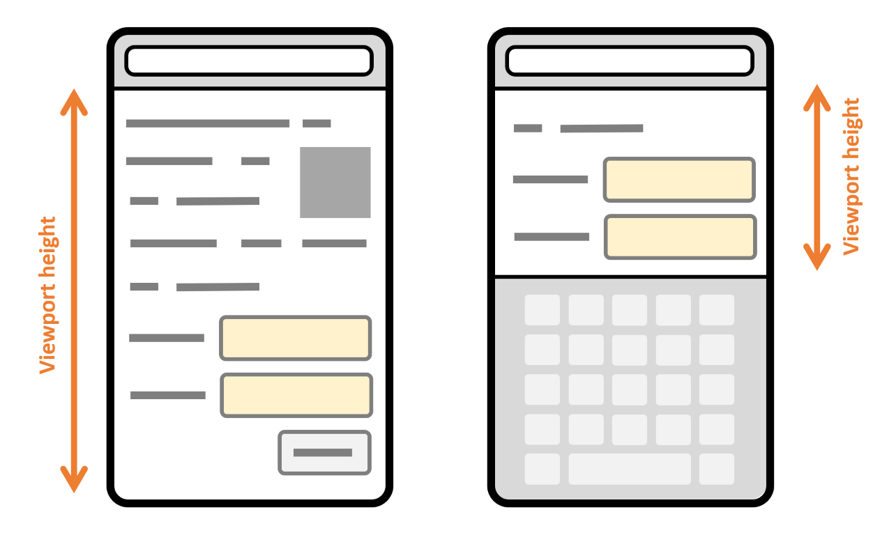

更复杂的应用或特定设备（例如多屏手机）在虚拟键盘出现时可能需要对布局进行更多控制。

下图显示了当虚拟键盘仅出现在两个屏幕之一上时，双屏设备上发生的情况。两个屏幕上的视口都会变小以容纳虚拟键盘，从而在屏幕上留下不显示虚拟键盘的浪费空间。

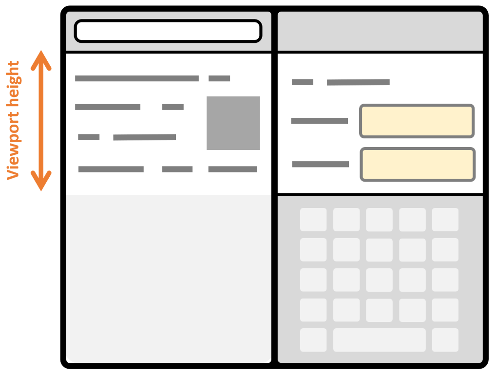

虚拟键盘 API 可以用于选择退出浏览器自动处理虚拟键盘的方式，并完全控制它。使用虚拟键盘 API，当表单控件获得焦点时，键盘仍然会根据需要出现和消失，但视口不会更改，并且可以使用 JavaScript 和 CSS 来调整布局。

### 使用方式

虚拟键盘 API 包括三个部分：

* 虚拟键盘 API 接口，通过 `navigator.virtualKeyboard` 访问，用于取消自动虚拟键盘行为、以编程方式显示或隐藏虚拟键盘，以及获取虚拟键盘的当前位置和大小。
* CSS 环境变量 `keyboard-inset-*` 提供了有关虚拟键盘位置和大小的信息。
* `virtualkeyboardpolicy` 属性指定虚拟键盘是否应出现在可编辑元素上。

#### 取消浏览器的自动虚拟键盘行为

要取消浏览器的自动虚拟键盘行为，可以使用 `navigator.virtualKeyboard.overlaysContent = true`。这样，浏览器就不会自动调整视口大小以为虚拟键盘腾出空间，而是将虚拟键盘覆盖在内容上。

#### 使用 JavaScript 检测虚拟键盘的几何属性

一旦取消了默认的浏览器行为，可以使用 `navigator.virtualKeyboard.boundingRect` 获取当前虚拟键盘的几何属性，并使用 CSS 和 JavaScript 进行相应的布局调整。此外，还可以通过使用 `geometrychange` 事件监听几何属性的变化，例如键盘的显示或隐藏。

这对于将重要的用户界面元素定位在虚拟键盘不覆盖的区域非常有用。

下面的代码片段使用 `geometrychange` 事件来检测虚拟键盘几何属性的变化；然后通过访问 `boundingRect` 属性来查询虚拟键盘的大小和位置：

```javascript
if ("virtualKeyboard" in navigator) {
  navigator.virtualKeyboard.overlaysContent = true;

  navigator.virtualKeyboard.addEventListener("geometrychange", (event) => {
    const { x, y, width, height } = event.target.boundingRect;
  });
}
```

#### 使用CSS环境变量检测虚拟键盘的几何属性

虚拟键盘 API 还提供了以下 CSS 环境变量：

* `keyboard-inset-top`
* `keyboard-inset-right`
* `keyboard-inset-bottom`
* `keyboard-inset-left`
* `keyboard-inset-width`
* `keyboard-inset-height`

`keyboard-inset-*` 环境变量可用于使用CSS调整布局以适应虚拟键盘的显示。它们通过距离视口边缘的上、右、下和左插图定义一个矩形。如果需要，也可以使用宽度和高度变量。

下面的代码片段使用`keyboard-inset-height` 变量来为虚拟键盘在聊天式应用程序中的消息列表和输入字段下方预留空间。当虚拟键盘隐藏时，`env()`函数返回`0px`，`keyboard`网格区域被隐藏。消息和输入元素可以占据整个视口的高度。当虚拟键盘出现时，`keyboard`网格区域的高度与虚拟键盘的高度相同。

```html
<style>
  body {
    display: grid;
    margin: 0;
    height: 100vh;
    grid-template:
      "messages" 1fr
      "input" auto
      "keyboard" env(keyboard-inset-height, 0px);
  }
</style>
<ul id="messages"></ul>
<input type="text" />
<script>
  if ("virtualKeyboard" in navigator) {
    navigator.virtualKeyboard.overlaysContent = true;
  }
</script>

```

#### 控制可内容编辑元素上的虚拟键盘

默认情况下，使用 `contenteditable` 属性的元素在点击或触摸时也会触发虚拟键盘。 在某些情况下，可能需要防止这种行为，并在不同的事件之后显示虚拟键盘。

将 `virtualkeyboardpolicy` 属性设置为 `manual`，以阻止浏览器对虚拟键盘的默认处理，并通过使用虚拟键盘 API 的 `show()` 和 `hide()` 方法自行处理。

下面的代码展示了如何使用 `virtualkeyboardpolicy` 属性和 `navigator.virtualKeyboard.show()` 方法，在双击事件上显示虚拟键盘：

```html
<div contenteditable virtualkeyboardpolicy="manual" id="editor"></div>
<script>
  if ("virtualKeyboard" in navigator) {
    navigator.virtualKeyboard.overlaysContent = true;

    const editor = document.getElementById("editor");
    editor.addEventListener("dblclick", () => {
      navigator.virtualKeyboard.show();
    });
  }
</script>

```

### 浏览器支持

注意，虚拟键盘 API 是一个实验性功能，其支持性有限：

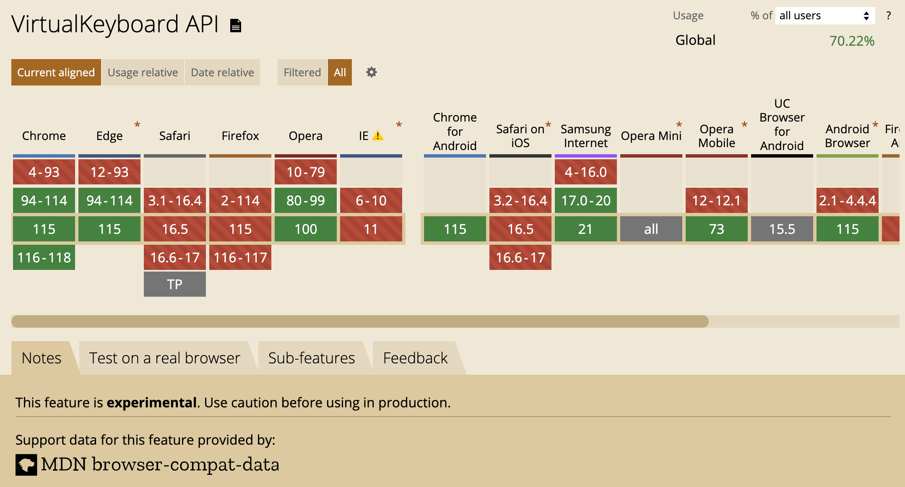

## 问题探讨

上面介绍了虚拟键盘 API 的基本使用，听起来可能比较抽象，下面就来看一个实际的例子，通过这个例子来深入讨论问题的细节。

这是一个具有以下内容的 UI：

* 粘性标题
* 粘性浮动操作按钮

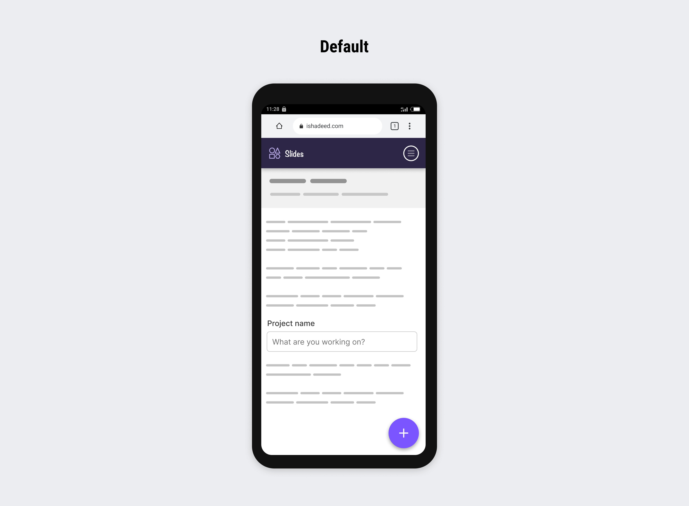

当用户专注于输入时，虚拟键盘就会显示。这时，浏览器将向上滚动以使输入位于键盘上方，因此粘性标题和浮动按钮将消失。看起来像是这样的：

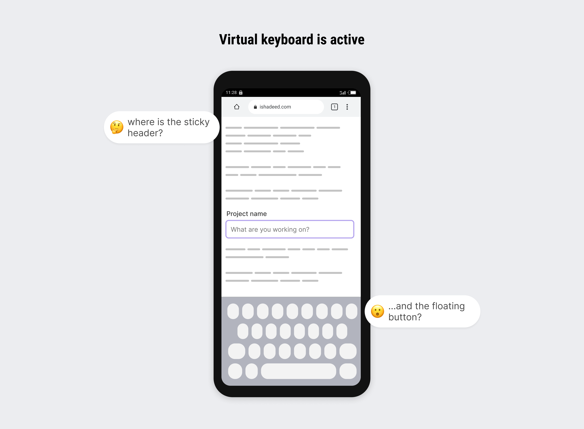

一般来说，这是移动浏览器中的默认行为。从用户体验的角度来看，隐藏部分 UI 可能会很困惑，尤其是那些与键盘处于激活状态时正在执行的当前操作相关的部分。

在幕后，发生的事情类似于下图这样：

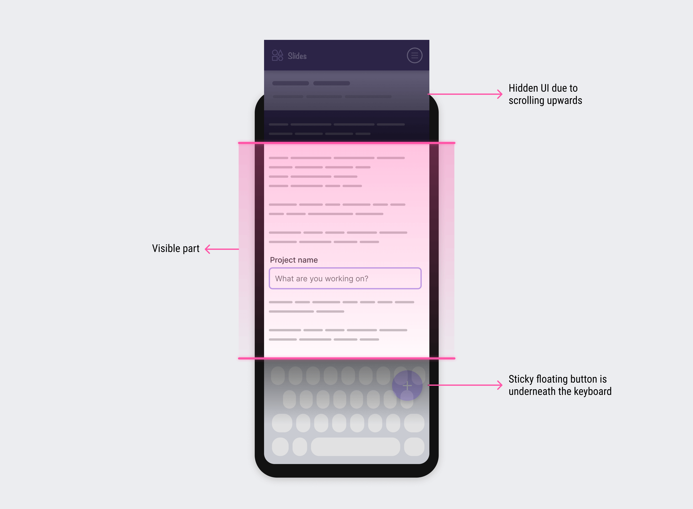\
用技术术语来说，可见部分称为**视觉视口**，隐藏部分+页面上所有元素的其余部分称为**布局视口**。

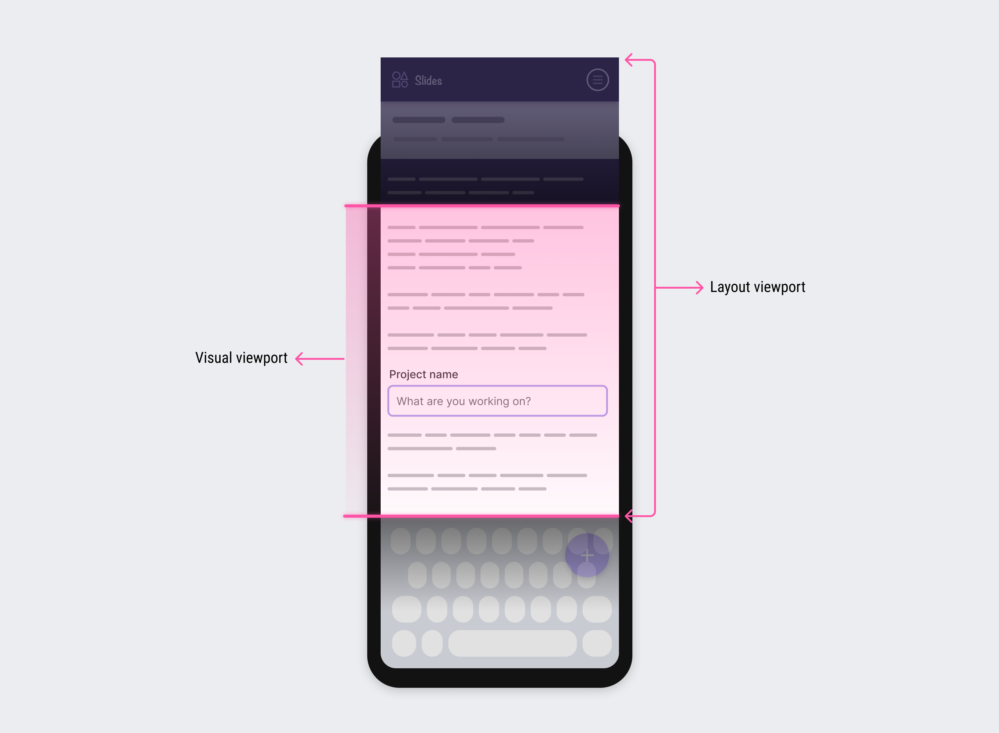

这时问题就出现了：**当虚拟键盘处于激活状态时，视觉视口的尺寸会缩小。**

下面来使用虚拟键盘 API 修复隐藏在键盘下的内容。借助虚拟键盘 API，可以定义**视觉视口**和**布局视口**是一样的。这样就可以使用以下 CSS 环境变量来检测键盘位置和尺寸：

* `keyboard-inset-top`
* `keyboard-inset-right`
* `keyboard-inset-bottom`
* `keyboard-inset-left`
* `keyboard-inset-width`
* `keyboard-inset-height`

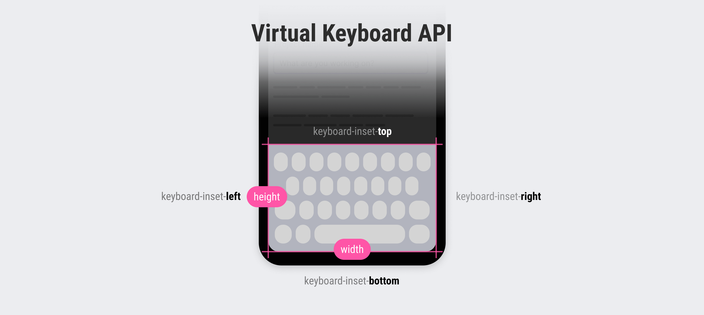

通过使用上述变量，可以在虚拟键盘处于激活状态时更改布局。

### 启用虚拟键盘 API

默认情况下，虚拟键盘 API 是不可用的，需要使用 Javascript 来启用它。

```javascript
if ("virtualKeyboard" in navigator) {
  navigator.virtualKeyboard.overlaysContent = true
}
```

这有点奇怪，还需使用 Javascript 来启用。当然，我们也可以使用这样的 `meta` 标签来启用：

```html
<meta
  name="viewport"
  content="width=device-width, initial-scale=1.0, virtual-keyboard=overlays-content"
/>
```

或者使用 CSS 属性：

```css
html {
  virtual-keyboard: overlays-content;
}
```

### 虚拟键盘 API 的用例

#### 底部固定操作

在较小的视口上，我们可能需要将按钮或页脚固定在 UI 底部：

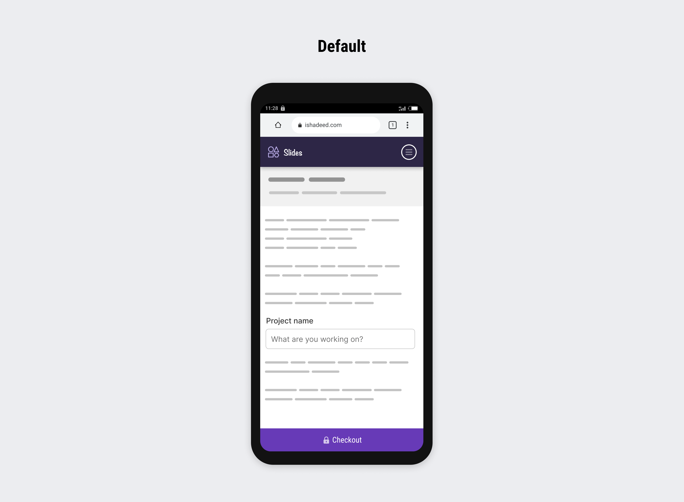

当输入框处于激活状态时，`checkout` 按钮将位于虚拟键盘下方，因此它被隐藏了。

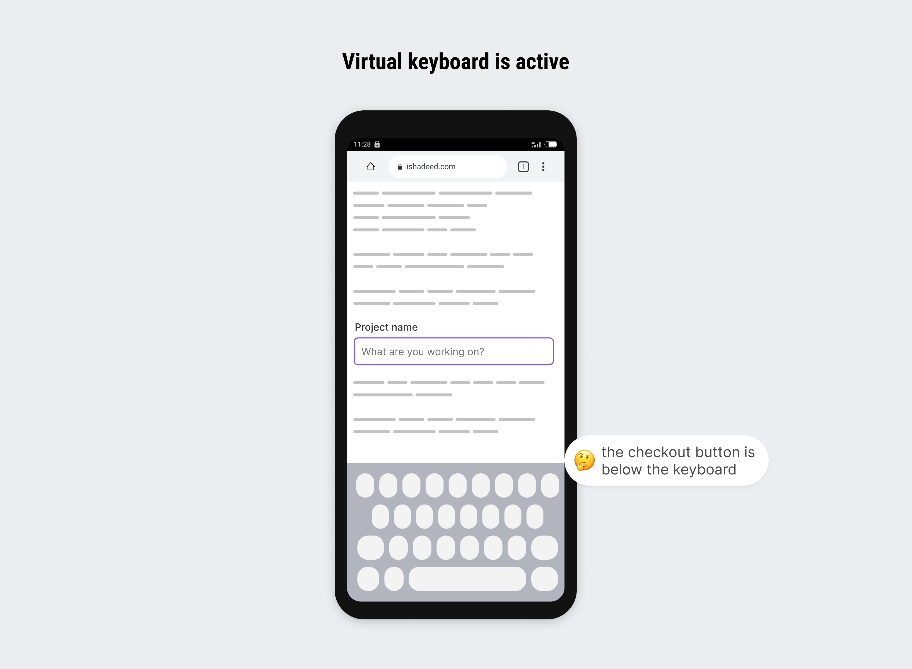

可以使用虚拟键盘 API 轻松解决这个问题：

```css
input {
  font-size: 16px;
}
.cta {
  bottom: env(keyboard-inset-height, 0);
}
```

在移动设备上，`bottom` 值将等于键盘高度，从而用该值偏移 `checkout` 按钮。 如果浏览器不支持该 API，则默认为零。

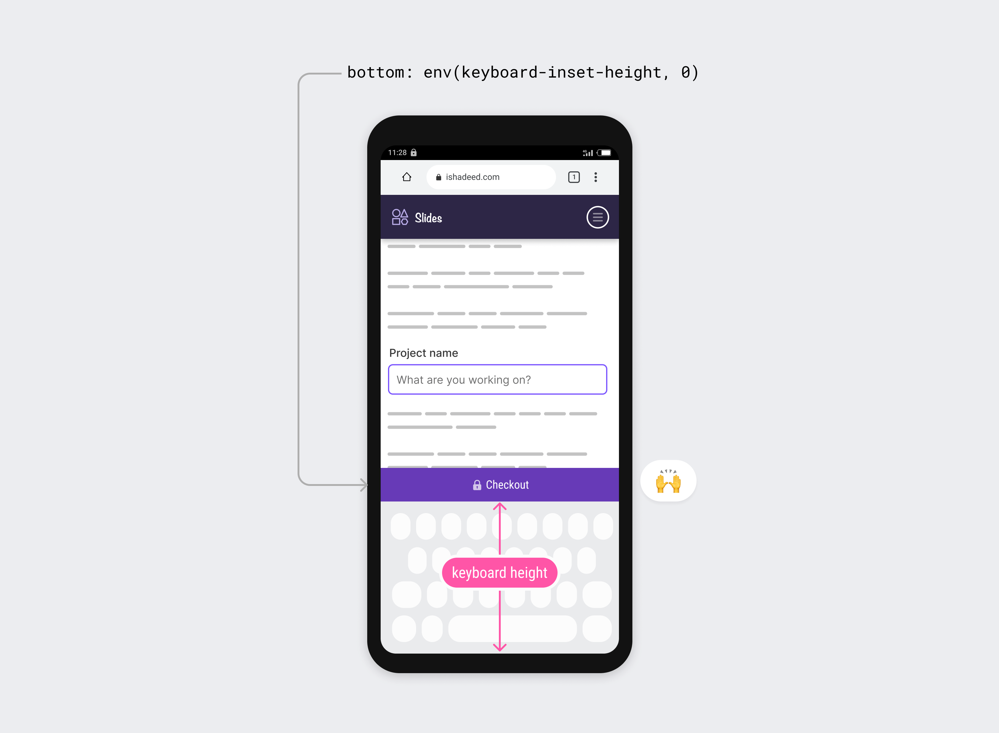

可以看到，由于头部和固定底部的存在空间减少了。如果垂直空间足够，就可以使用垂直媒体查询来显示头部。

#### 无法滚动到页面的最后

当页面底部有一个使用 `position: fixed` 定位的元素时，通常会添加一个 `padding-bottom` 来抵消页面高度，以便用户可以滚动到最底部。

例如，假设有一个位于页面底部的固定定位元素，就可以通过为内容区域添加一个与该元素（cta）高度相等的 `padding-bottom` 来实现滚动到页面最底部：

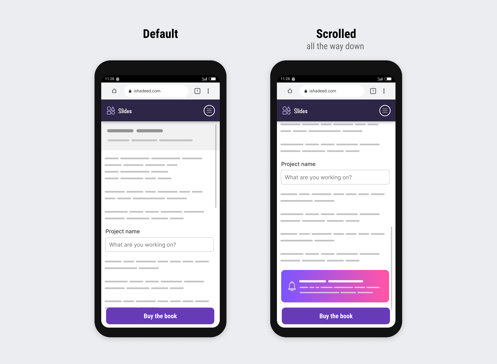

```css
body {
  --cta-height: 60px;
  padding-bottom: var(--cta-height);
}

.cta {
  bottom: env(keyboard-inset-height, 0);
}
```

`padding-bottom`应该是一个等于或大于固定元素高度的值。

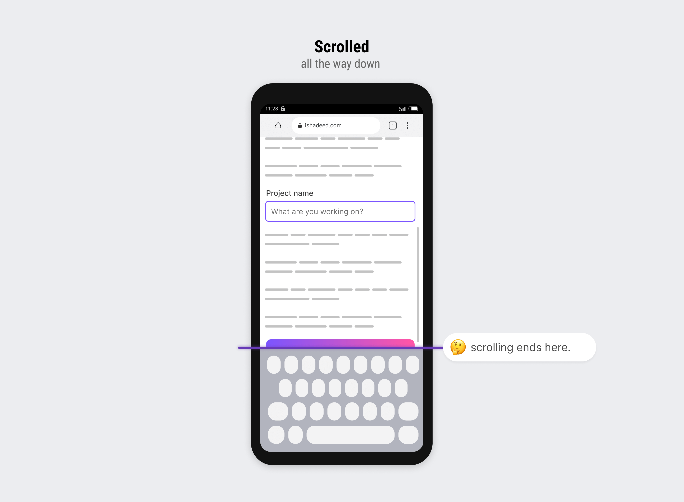

那么当使用虚拟键盘时会发生什么呢？考虑以下示意图：


当虚拟键盘处于激活状态时，使用固定元素的高度作为`padding-bottom`的值是不够的。我们需要将键盘高度也考虑在内。如下所示：

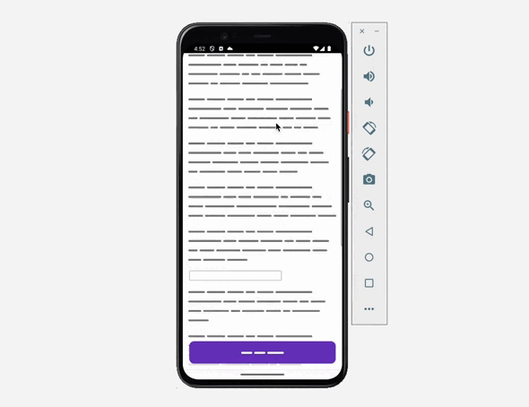

为了解决这个问题，就需要检测输入框是否处于焦点状态，并根据焦点状态来改变`padding-bottom`的值。

```css
body:has(input:focus) {
  padding-bottom: calc(
    var(--cta-height) + env(keyboard-inset-height, 0)
  );
}
```

那在桌面浏览器上会发生什么呢？这种情况下，`env()` 函数将回退到 0，并且将得到 `var(--cta-height)` 的值。

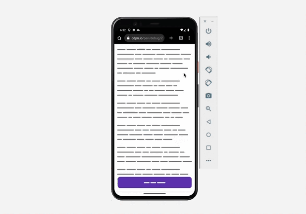

#### 浮动操作按钮

在页面右下角有一个浮动操作按钮。

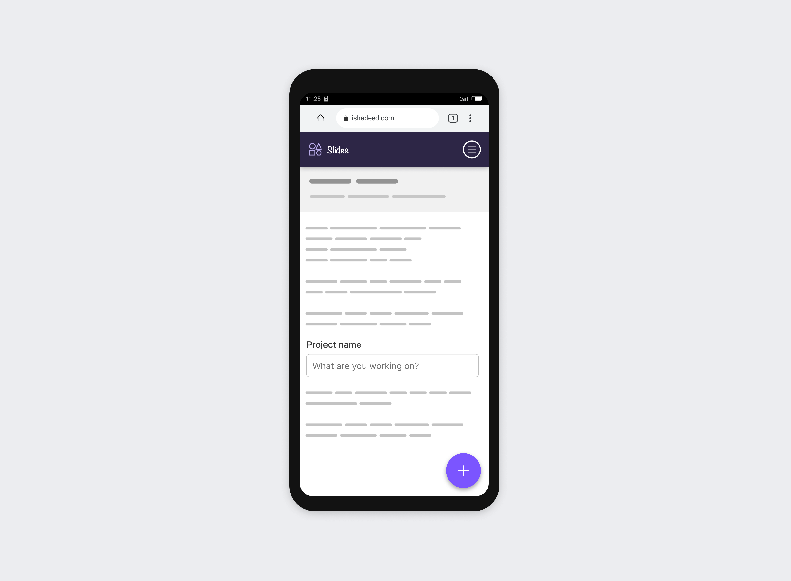

<font style="color:rgb(36, 41, 47);background-color:rgb(244, 246, 248);">当虚拟键盘激活时，悬浮按钮应该移动到虚拟键盘上方。但是，就像最初的例子中一样，浮动按钮会被键盘遮挡。</font>

<font style="color:rgb(36, 41, 47);background-color:rgb(244, 246, 248);"></font>

<font style="color:rgb(36, 41, 47);background-color:rgb(244, 246, 248);">为了解决这个问题，可以使用 </font><code><font style="color:rgb(36, 41, 47);background-color:rgb(244, 246, 248);">env(keyboard-inset-height)</font></code><font style="color:rgb(36, 41, 47);background-color:rgb(244, 246, 248);"> 值。</font>

```css
.fab {
  bottom: calc(1rem + env(keyboard-inset-height, 0rem));
}
```

这里<font style="color:rgb(36, 41, 47);background-color:rgb(244, 246, 248);">使用了 </font><code><font style="color:rgb(36, 41, 47);background-color:rgb(244, 246, 248);">1rem</font></code><font style="color:rgb(36, 41, 47);background-color:rgb(244, 246, 248);"> 加上键盘的高度，以避免悬浮按钮直接位于键盘顶部边缘。在使用 CSS 比较函数时，需要注意的是，在 </font><code><font style="color:rgb(36, 41, 47);background-color:rgb(244, 246, 248);">env()</font></code><font style="color:rgb(36, 41, 47);background-color:rgb(244, 246, 248);"> 函数中使用无单位的数值作为回退值会导致 Safari 上的整个布局出现问题，所以必须添加 </font><code><font style="color:rgb(36, 41, 47);background-color:rgb(244, 246, 248);">rem</font></code><font style="color:rgb(36, 41, 47);background-color:rgb(244, 246, 248);"> 单位。</font>

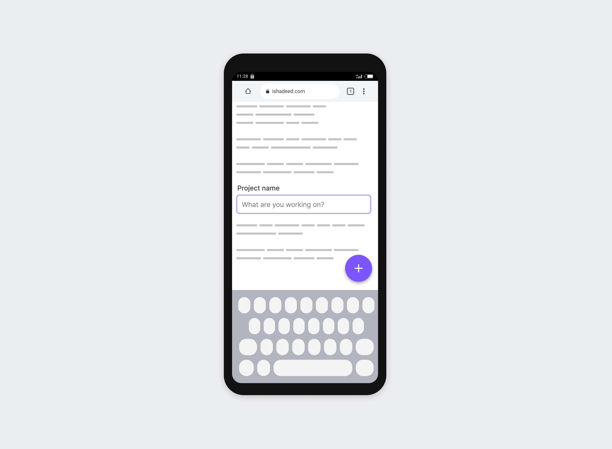

#### 对桌面使用不同的值

假设想在桌面浏览器上稍微偏移悬浮按钮，该怎么做呢？ 可以使用 `max()` 比较函数，它是有效的。

```css
.fab {
  bottom: max(2rem, 1rem + env(keyboard-inset-height, 0rem));
}
```

<font style="color:rgb(36, 41, 47);background-color:rgb(244, 246, 248);">它的工作原理如下：</font>

* <font style="color:rgb(36, 41, 47);background-color:rgb(244, 246, 248);">比较函数将在两个值之间进行比较。由于在桌面上，</font><code><font style="color:rgb(36, 41, 47);background-color:rgb(244, 246, 248);">env(keyboard-inset-height)</font></code><font style="color:rgb(36, 41, 47);background-color:rgb(244, 246, 248);"> 的计算结果为零，所以最大值是 </font><code><font style="color:rgb(36, 41, 47);background-color:rgb(244, 246, 248);">2rem</font></code><font style="color:rgb(36, 41, 47);background-color:rgb(244, 246, 248);">。</font>
* <font style="color:rgb(36, 41, 47);background-color:rgb(244, 246, 248);">在移动设备上，最大值是第二个值。</font>

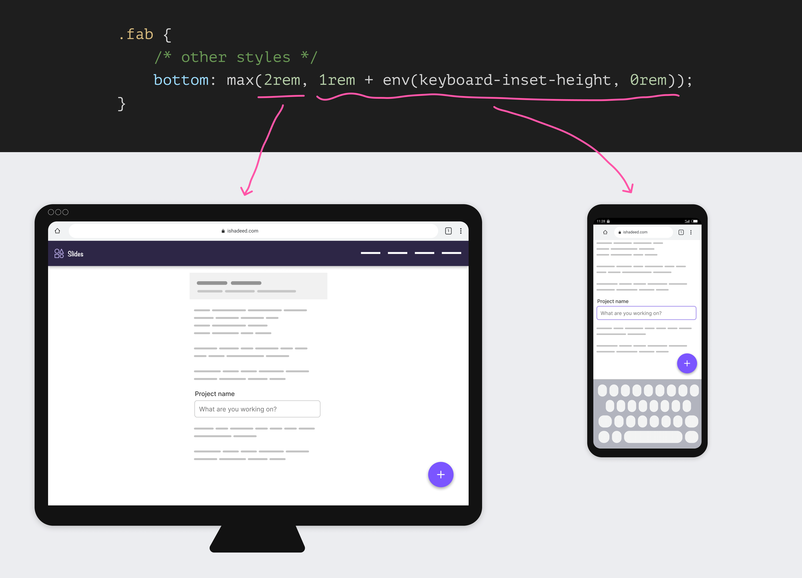

### 聊天布局

先来看下面的图：

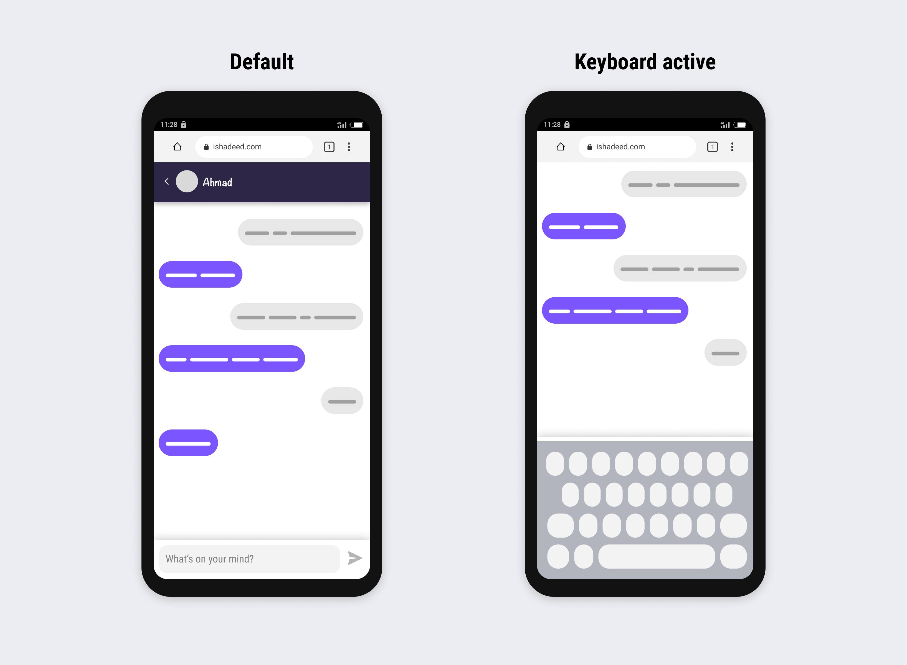

<font style="color:rgb(36, 41, 47);background-color:rgb(244, 246, 248);">当虚拟键盘激活时，标题和消息输入框都会被隐藏起来。可以使用 </font><code><font style="color:rgb(36, 41, 47);background-color:rgb(244, 246, 248);">env(keyboard-inset-height)</font></code><font style="color:rgb(36, 41, 47);background-color:rgb(244, 246, 248);"> 作为 </font><code><font style="color:rgb(36, 41, 47);background-color:rgb(244, 246, 248);">grid-row</font></code><font style="color:rgb(36, 41, 47);background-color:rgb(244, 246, 248);"> 属性的值。</font>

```css
.layout {
  display: grid;
  grid-template-rows: auto minmax(0, 1fr) auto env(keyboard-inset-height, 0);
  height: 100dvh;
}
```

以下是经过上述修复后的效果：

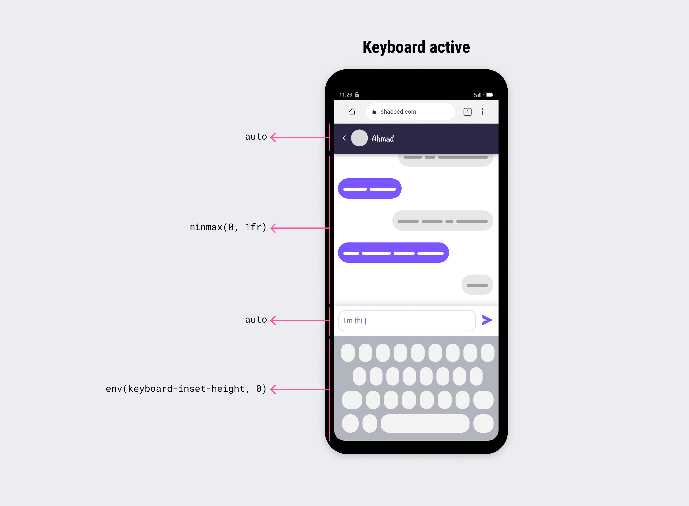

#### <font style="color:rgb(85, 85, 85);">LinkedIn 帖子表单和导航</font>

<font style="color:rgb(85, 85, 85);">虚拟键盘 API 一个很适用的例子就是 Linkedin 帖子的表单和导航的显示方式。</font>

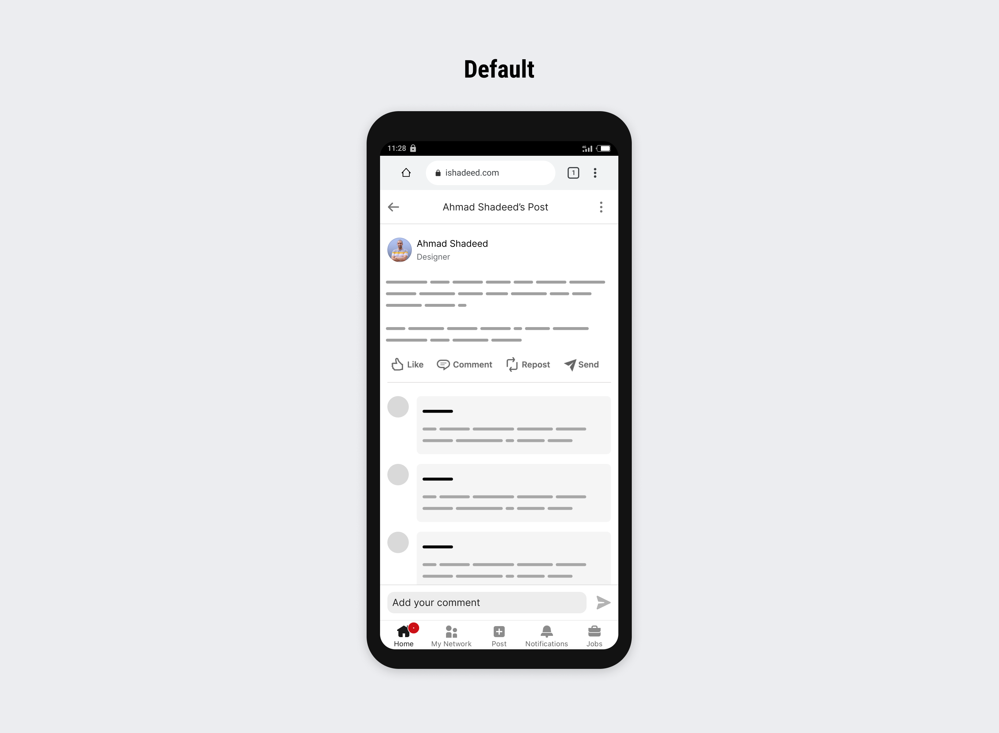

<font style="color:rgb(85, 85, 85);">帖子表单和导航固定在底部。当用户激活输入框时，它看起来像这样：</font>

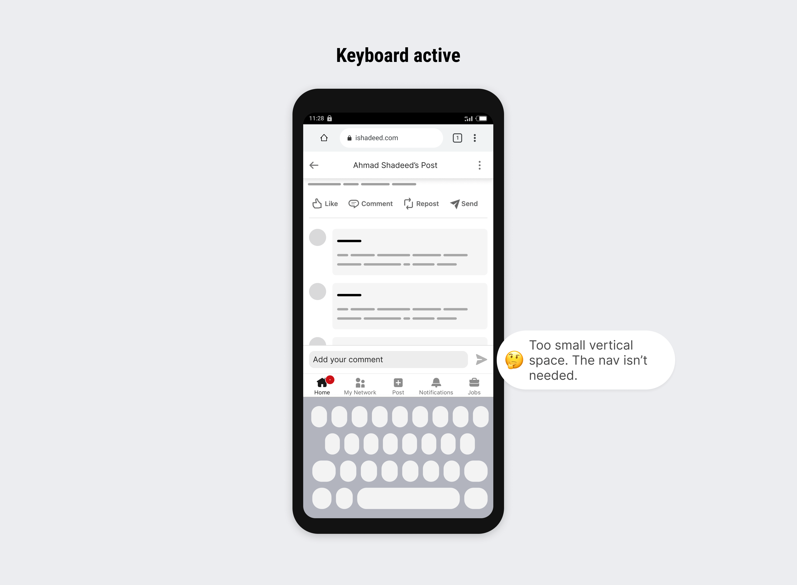

<font style="color:rgb(85, 85, 85);">注意，垂直空间太小。该怎么办呢？通过使用比较函数和虚拟键盘 API，可以在显示键盘时隐藏导航。</font>

```css
.post-form,
.nav {
  position: fixed;
  left: 0;
  right: 0;
}

.post-form {
  bottom: max(48px, env(keyboard-inset-height, 0px));
}

.nav {
  bottom: max(0px, env(keyboard-inset-height, 0) - 100px);
}
```

##### 帖子表单

默认状态下，表单距离底部偏移 `48px`。 在此状态下，`max()` 函数的第二部分处于非激活状态。

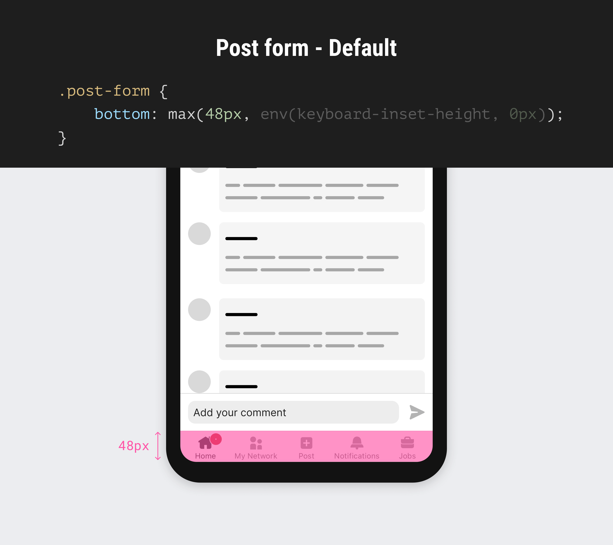

当虚拟键盘激活时，`max()` 函数的第二个部分将生效，`bottom` 值将变为键盘的高度。

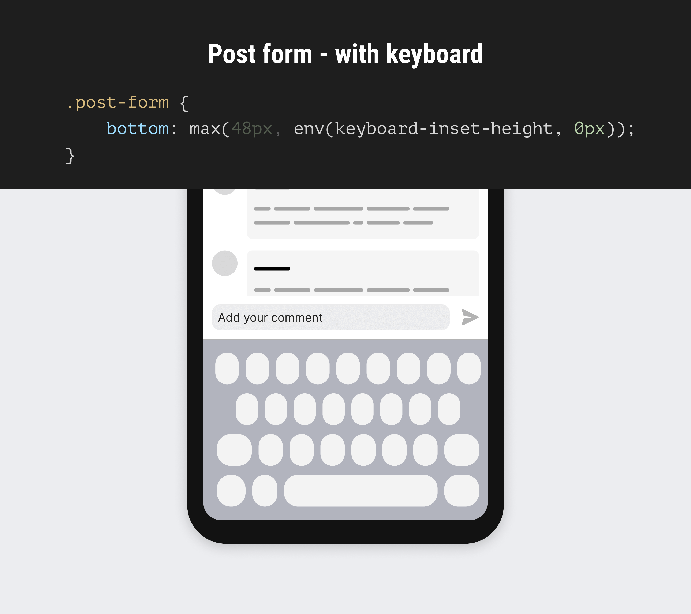

##### 导航

导航栏的位置是 `bottom: 0`。现在激活的是 `max()` 函数的第一部分。

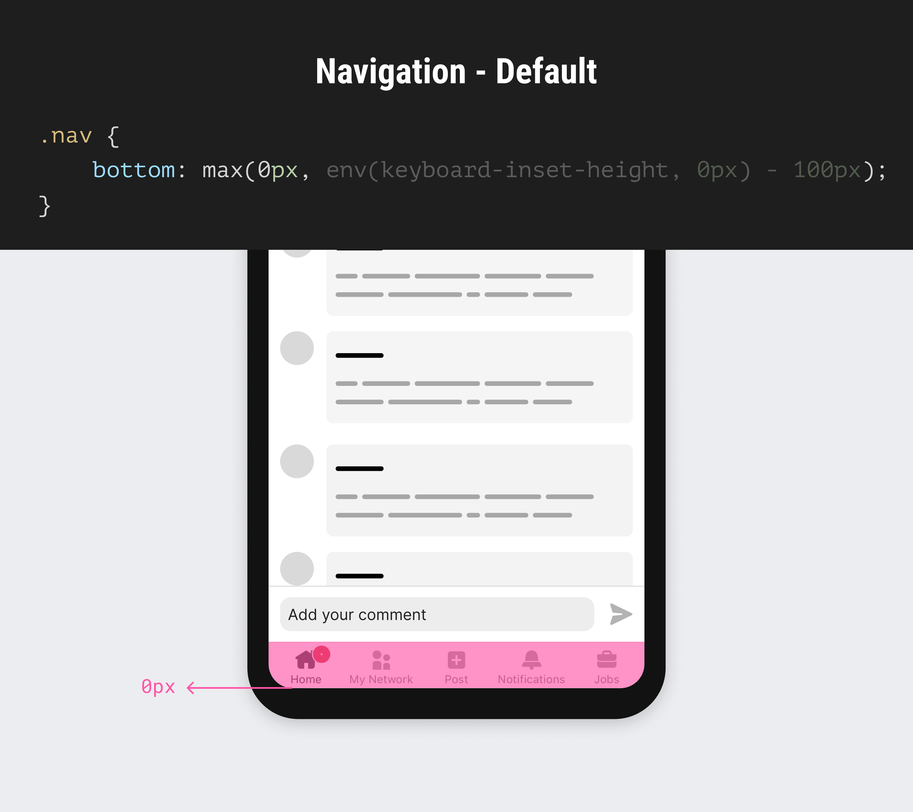

<font style="color:rgb(36, 41, 47);background-color:rgb(244, 246, 248);">当虚拟键盘激活时，我们将把导航栏移动到键盘下方。这里的 </font><code><font style="color:rgb(36, 41, 47);background-color:rgb(244, 246, 248);">100px</font></code><font style="color:rgb(36, 41, 47);background-color:rgb(244, 246, 248);"> 是一个随机数，重点是添加一个大于导航栏高度的值。</font>

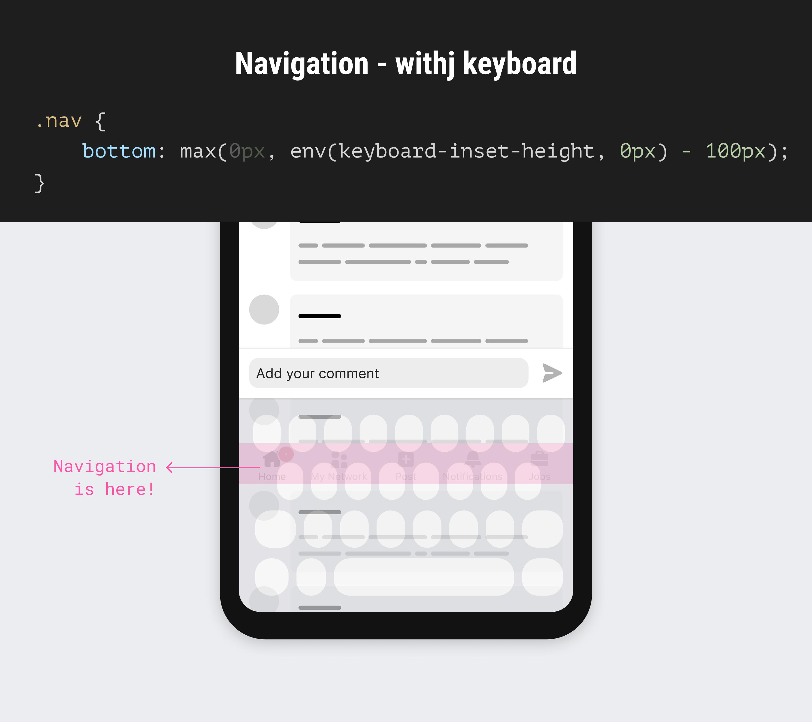

效果如下：

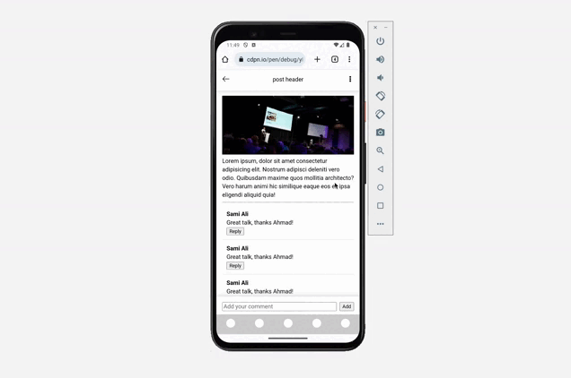


> 更新: 2023-09-22 00:11:34  
> 原文: <https://www.yuque.com/cuggz/feplus/gu31ozp9i7uyoxhg>