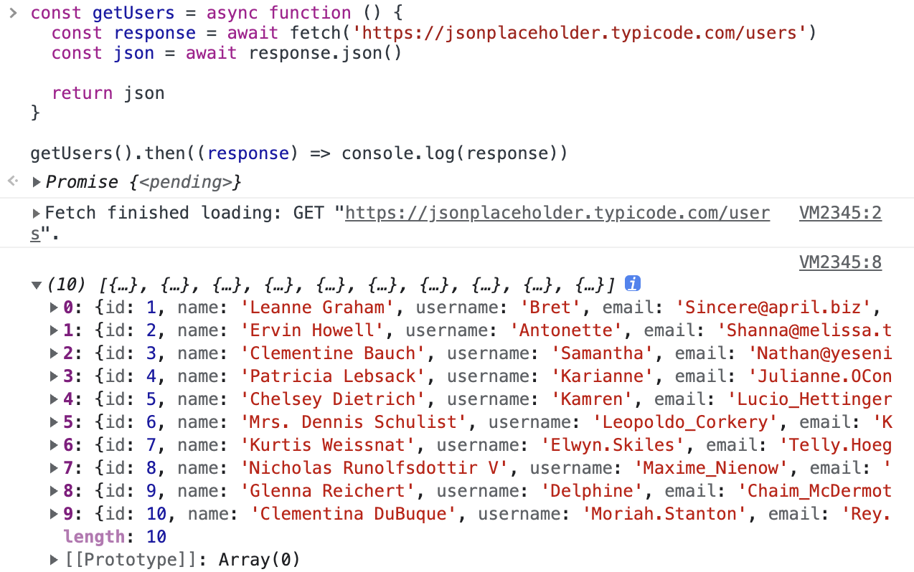
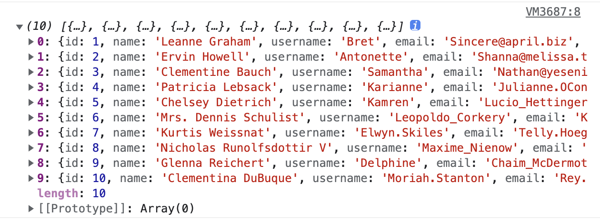

# 迭代器&生成器

迭代器和生成器是 ES6 中引入的特性。迭代器通过一次消费一个项目列表来提高效率，类似于数据流。生成器是一种能够暂停执行的特殊函数。调用生成器允许以块的形式（一次一个）生成数据，而无需先将其存储在列表中。下面就来深入理解 JavaScript 中的迭代器和生成器，看看它们是如何使用的，又有何妙用！

## 迭代器

JavaScript 中的迭代器可以分别两种：**同步迭代器**和**异步迭代器**。

### 1. 同步迭代器

#### （1）迭代器和可迭代对象

在 JavaScript 中有很多方法可以遍历数据结构。例如，使用 `for` 循环或使用 `while` 循环。迭代器具有类似的功能，但有显着差异。

迭代器只需要知道集合中的当前位置，而其他循环则需要预先加载整个集合才能循环遍历它。迭代器使用 `next()` 方法访问集合中的下一个元素。 但是，为了使用迭代器，值或数据结构应该是可迭代的。 数组、字符串、映射、集合是 JavaScript 中的可迭代对象。普通对象是不可迭代的。

#### （2）定义迭代器

下面来看看集合不可迭代的场景：

```javascript
const favouriteMovies = {
  a: '哈利波特',
  b: '指环王',
  c: '尖峰时刻',
  d: '星际穿越',
  e: '速度与激情',
}
```

这个对象是不可迭代的。如果使用普通的 for 循环遍历它，就会抛出错误。 随着 ES6 中迭代器的引入，可以将其转换为可迭代对象以便遍历它。 这些称为**自定义迭代器**。 下面看看如何实现对象的遍历并打印出来：

```javascript
favouriteMovies[Symbol.iterator] = function() {
  const ordered = Object.values(this).sort((a, b) => a - b);
  let i = 0;
  return {
    next: () => ({
      done: i >= ordered.length,
      value: ordered[i++]
    })
  }
}

for (const v of favouriteMovies) {
  console.log(v);
}
```

输出结果如下：

```javascript
哈利波特
指环王
尖峰时刻
星际穿越
速度与激情
```

这里使用 `Symbol.iterator()` 来定义迭代器。任何具有 `Symbol.iterator` 键的结构都是可迭代的。

可迭代对象具有以下行为：

1. 当 `for..of` 循环开始时，它首先查找错误。如果未找到，则它会访问方法和定义该方法的对象。
2. 以 `for..of` 循环方式迭代该对象。
3. 使用该输出对象的 `next()` 方法来获取要返回的下一个值。
4. 返回的值的格式为 `done:boolean`, `value: any`。 返回 `done:true` 时循环结束。

下面来创建一个 LeapYear 对象，该对象返回范围为 (start, end) 的闰年列表，并在后续闰年之间设置间隔。

```javascript
class LeapYear {
  constructor(start = 2020, end = 2040, interval = 4) {
    this.start = start;
    this.end = end;
    this.interval = interval;
  }
  [Symbol.iterator]() {
    let nextLeapYear = this.start;
    return {
      next: () => {
        if (nextLeapYear <= this.end) {
          let result = { value: nextLeapYear, done: false };
          nextLeapYear += this.interval;
          return result;
        }
        return { value: undefined, done: true };
      },
    };
  }
}
```

在上面的代码中，为自定义类型 LeapYear 实现了 Symbol.iterator() 方法。分别在 `this.start` 和 `this.end` 字段中有迭代的起点和终点。 使用 `this.interval`来跟踪迭代的第一个元素和下一个元素之间的间隔。

现在，可以在自定义类型上调用 `for...of` 循环，并查看其行为和输出值，就像默认数组类型一样：

```javascript
let leapYears = new LeapYear();
for (const leapYear of leapYears) {
    console.log(leapYear);
}
```

输出结果如下：

```javascript
2020
2024
2028
2032
2036
2040
```

这里的 `LeapYear` 通过 `Symbol.iterator(`) 变成了可迭代对象。

在一些情况下，迭代器会比普通迭代更好。 例如，在没有随机访问的有序集合（如数组）中，迭代器的性能会更好，因为它可以直接根据当前位置检索元素。但是，对于无序集合，由于没有顺序，就不会体验到性能上的重大差异。

使用普通循环算法，例如 `for` 循环或 `while` 循环，您只能循环遍历允许迭代的集合：

```javascript
const favourtieMovies = [
  '哈利波特',
  '指环王',
  '尖峰时刻', 
  '星际穿越',
  '速度与激情',
];

for (let i=0; i < favourtieMovies.length; i++) {
  console.log(favouriteMovies[i]);
}

let i = 0;
while (i < favourtieMovies.length) {
  console.log(favourtieMovies[i]);
  i++;
}
```

由于数组是可迭代的，因此可以使用 for 循环遍历。 我们也可以为上面实现一个迭代器，这将允许更好地访问基于当前位置的元素，而无需加载整个集合。代码如下：

```javascript
const iterator = favourtieMovies[Symbol.iterator]();
 
iterator.next();  // { value: '哈利波特', done: false }
iterator.next();  // { value: '指环王', done: false }
iterator.next();  // { value: '尖峰时刻', done: false }
iterator.next();  // { value: '星际穿越', done: false }
iterator.next();  // { value: '速度与激情', done: false }
iterator.next();  // { value: undefined, done: true }
```

next() 方法将返回迭代器的结果。它包括两个值； **集合中的元素**和**完成状态**。 可以看到，当遍历完成后，即使访问数组外的元素，也不会抛出错误。 它只会返回一个具有 `undefined` 值和完成状态为 `true` 的对象。

#### （3）使用场景

那为什么向自定义对象中添加迭代器呢？我们也可以编写自定义函数来遍历对象以完成同样的事情。

实际上，迭代器是一种标准化自定义对象的优雅实现方式，它为自定义数据结构提供了一种在更大的 JS 环境中很好地工作的方法。因此，提供自定义数据结构的库经常会使用迭代器。例如，  [Immutable.JS](https://immutable-js.github.io/immutable-js/) 库就使用迭代器为其自定义对象（如Map）。**所以，如果需要为封装良好的自定义数据结构提供原生迭代功能，就考虑使用迭代器。**

### 2. 异步迭代器

JavaScript 中的异步迭代对象是实现 `Symbol.asyncIterator` 的对象：

```javascript
const asyncIterable = {
  [Symbol.asyncIterator]: function() {
 
  }
};
```

我们可以将一个函数分配给 `[Symbol.asyncIterator]` 以返回一个迭代器对象。迭代器对象应符合带有 `next()` 方法的迭代器协议（类似于同步迭代器）。

下面来添加迭代器：

```javascript
const asyncIterable = {
  [Symbol.asyncIterator]: function() {
    let count = 0;

    return {
      next() {
        count++;
        if (count <= 3) {
          return Promise.resolve({ value: count, done: false });
        }

        return Promise.resolve({ value: count, done: true });
      }
    };
  }
};

```

这里用 `Promise.resolve` 包装了返回的对象。下面来执行 `next()` 方法：

```javascript
const go = asyncIterable[Symbol.asyncIterator]();

go.next().then(iterator => console.log(iterator.value));
go.next().then(iterator => console.log(iterator.value));
```

输出结果如下：

```javascript
1
2
```

也可以使用 `for await...of` 来对异步迭代对象进行迭代：

```javascript
async function consumer() {
  for await (const asyncIterableElement of asyncIterable) {
    console.log(asyncIterableElement);
  }
}

consumer();
```

异步迭代器和迭代器是异步生成器的基础，后面会介绍异步生成器。

## 生成器

JavaScript 中的生成器可以分别两种：**同步生成器**和**异步生成器**。

### 1. 同步生成器

#### （1）基本概念

生成器是一个可以**暂停**和**恢复**并可以产生多个值的过程。JavaScript 中的生成器由一个生成器函数组成，它返回一个可迭代 Generator 对象。

生成器是对 JavaScript 的强大补充。它们可以维护状态，提供一种制作迭代器的有效方法，并且能够处理无限数据流，可用于在前端实现无限滚动等。此外，当与 Promises 一起使用时，生成器可以模拟 async/await 功能，这使我们能够以更直接和可读的方式处理异步代码。尽管 async/await 是处理常见、简单的异步用例（例如从 API 获取数据）的一种更普遍的方式，但生成器具有更高级的功能。

生成器函数是返回生成器对象的函数，由 `function` 关键字后面跟星号 (\*) 定义，如下所示：

```javascript
function* generatorFunction() {}
```

有时，我们可能会在函数名称旁边看到星号，而不是 `function` 关键字，例如 `function *generatorFunction()`，它的工作原理是相同的，但 `function*` 是一种更广泛接受的语法。

生成器函数也可以在表达式中定义，就像常规函数一样：

```javascript
const generatorFunction = function* () {}
```

生成器甚至可以是**对象或类的方法**：

```javascript
// 生成器作为对象的方法
const generatorObj = {
  *generatorMethod() {},
}

// 生成器作为类的方法
class GeneratorClass {
  *generatorMethod() {}
}
```

下面的例子都将使用生成器函数声明得语法。

> **注意**：与常规函数不同，生成器不能使用 new 关键字构造，也不能与箭头函数结合使用。

现在我们知道了如何声明生成器函数，下面来看看生成器返回的可迭代生成器对象。

#### （2）生成器对象

传统的 JavaScript 函数会在遇到`return` 关键字时返回一个值。 如果省略 `return` 关键字，函数将隐式返回 `undefined`。

例如，在下面的代码中，我们声明了一个 `sum()` 函数，它返回一个值，该值是两个整数参数的和：

```javascript
function sum(a, b) {
  return a + b
}
```

调用该函数会返回一个值，该值是参数的总和：

```javascript
const value = sum(5, 6) // 11
```

而生成器函数不会立即返回值，而是返回一个可迭代的生成器对象。 在下面的例子中，我们声明了一个函数并给它一个单一的返回值，就像一个标准的函数：

```javascript
function* generatorFunction() {
  return 'Hello, Generator!'
}
```

当调用生成器函数时，它将返回生成器对象，我们可以将其分配给一个变量：

```javascript
const generator = generatorFunction()
```

如果这是一个常规函数，我们希望生成器为我们提供函数中返回的字符串。 然而，我们实际得到的是一个**处于挂起状态的对象**。 因此，调用生成器将提供类似于以下内容的输出：

```javascript
generatorFunction {<suspended>}
  [[GeneratorLocation]]: VM335:1
  [[Prototype]]: Generator
  [[GeneratorState]]: "suspended"
  [[GeneratorFunction]]: ƒ* generatorFunction()
  [[GeneratorReceiver]]: Window
```

函数返回的生成器对象是一个**迭代器**。迭代器是一个具有可用的 `next()` 方法的对象，该方法用于迭代一系列值。 `next()` 方法返回一个对象，其包含两个属性：

* `value`：当前步骤的值；
* `done`：布尔值，指示生成器中是否有更多值。

`next()` 方法必须遵循以下规则：

* 返回一个带有 `done: false` 的对象来**继续**迭代；
* 返回一个带有 `done: true` 的对象来**停止**迭代。

下面就来在生成器上调用 `next()` 并获取迭代器的当前值和状态：

```javascript
generator.next()
```

这将得到以下输出结果：

```javascript
{value: "Hello, Generator!", done: true}
```

调用 `next()` 时的返回值为 `Hello, Generator!`，并且 `done` 的状态为 `true`，因为该值来自关闭迭代器的返回值。 由于迭代器完成，生成器函数的状态将从挂起变为关闭。这时再次调用生成器将输出以下内容：

```javascript
generatorFunction {<closed>}
```

除此之外，生成器函数也有区别于普通函数的独特特征。下面我们就来了解一下 `yield` 运算符并看看生成器如何暂停和恢复执行。

#### （3）yield 运算符

生成器为 JavaScript 引入了一个新的关键字：`yield`。 <code>**yield**</code>\*\* 可以暂停生成器函数并返回 **<code>**yield**</code>** 之后的值，从而提供一种轻量级的方法来遍历值。\*\*

***

在下面的例子中，我们将使用不同的值暂停生成器函数三次，并在最后返回一个值。 然后将生成器对象分配给 `generator` 变量。

```javascript
function* generatorFunction() {
  yield 'One'
  yield 'Two'
  yield 'Three'

  return 'Hello, Generator!'
}

const generator = generatorFunction()
```

现在，当我们在生成器函数上调用 `next()` 时，它会在每次遇到 yield 时暂停。 `done` 会在每次 `yield` 后设置为 `false`，表示生成器还没有结束。 一旦遇到 `return`，或者函数中没有更多的 `yield` 时，`done` 就会变为 `true`，生成器函数就结束了。

连续四次调用 `next()` 方法：

```javascript
generator.next()
generator.next()
generator.next()
generator.next()
```

这些将按顺序得到以下结果：

```javascript
{value: "One", done: false}
{value: "Two", done: false}
{value: "Three", done: false}
{value: "Hello, Generator!", done: true}
```

`next()` 非常适合从迭代器对象中提取有限数据。

> **注意**，生成器不需要 `return`； 如果省略，最后一次迭代将返回 {value: undefined, done: true}，生成器完成后对 `next()` 的任何后续调用也是如此。

#### （4）遍历生成器

使用 `next()` 方法可以遍历生成器对象，接收完整对象的所有 `value` 和 `done` 属性。 不过，就像 Array、Map 和 Set 一样，Generator 遵循迭代协议，并且可以使用 `for...of` 进行迭代：

```javascript
function* generatorFunction() {
  yield 'One'
  yield 'Two'
  yield 'Three'

  return 'Hello, Generator!'
}

const generator = generatorFunction()

for (const value of generator) {
  console.log(value)
}
```

输出结果如下：

```javascript
One
Two
Three
```

扩展运算符也可用于将生成器的值分配给数组：

```javascript
const values = [...generator]

console.log(values)
```

输出结果如下：

```javascript
 ['One', 'Two', 'Three']
```

可以看到，扩展运算符和 `for...of` 都不会将 `return` 的值计入 `value`。

**注意**：虽然这两种方法对于有限生成器都是有效的，但如果生成器正在处理无限数据流，则无法在不创建无限循环的情况下直接使用扩展运算符或 `for...of`。

我们还可以从迭代结果中解构值：

```javascript
const [a, b, c]= generator;
console.log(a);
console.log(b);
console.log(c);
```

输出结果如下：

```javascript
One
Two
Three
```

#### （5）关闭生成器

如我们所见，生成器可以通过遍历其所有值将其 `done` 属性设置为 `true` 并将其状态设置为 `closed` 。除此之外，还有两种方法可以立即关闭生成器：使用 `return()` 方法和使用 `throw()` 方法。

使用 `return()`，生成器可以在任何时候终止，就像在函数体中的 `return` 语句一样。可以将参数传递给 `return()`，或将其留空以表示未定义的值。

下面来创建一个具有 `yield` 值但在函数定义中没有 `return` 的生成器：

```javascript
function* generatorFunction() {
  yield 'One'
  yield 'Two'
  yield 'Three'
}

const generator = generatorFunction()
```

第一个 `next()` 将返回“`One`”，并将 `done` 设置为 `false`。 如果在那之后立即在生成器对象上调用 `return()` 方法，将获得传递的值并将 `done` 设置为 `true`。 对 `next()` 的任何额外调用都会给出默认的已完成生成器响应，其中包含一个 undefined 值。

```javascript
generator.next()
generator.return('Return！')
generator.next()
```

输出结果如下：

```javascript
{value: "Neo", done: false}
{value: "Return！", done: true}
{value: undefined, done: true}
```

`return()` 方法会强制生成器对象完成并忽略任何其他 `yield` 关键字。 **当需要使函数可取消时，这在异步编程中特别有用**，例如当用户想要执行不同的操作时中断数据请求，因为无法直接取消 Promise。

如果生成器函数的主体有捕获和处理错误的方法，则可以使用 `throw()` 方法将错误抛出到生成器中。这将启动生成器，抛出错误并终止生成器。

下面来在生成器函数体内放一个 `try...catch` 并在发现错误时记录错误：

```javascript
function* generatorFunction() {
  try {
    yield 'One'
  	yield 'Two'
  } catch (error) {
    console.log(error)
  }
}

const generator = generatorFunction()
```

现在来运行 `next()` 方法，然后运行 `throw()` 方法：

```javascript
generator.next()
generator.throw(new Error('Error！'))
```

输出结果如下：

```javascript
{value: "One", done: false}
Error: Error！
{value: undefined, done: true}
```

使用 `throw()` 可以将错误注入到生成器中，该错误被 `try...catch` 捕获并记录到控制台。

#### （6）生成器对象方法和状态

下面是生成器对象的**方法**：

* `next()`：返回生成器中的后面的值；
* `return()`：在生成器中返回一个值并结束生成器；
* `throw()`：抛出错误并结束生成器。

下面是生成器对象的**状态**：

* `suspended`：生成器已停止执行但尚未终止。
* `closed`：生成器因遇到错误、返回或遍历所有值而终止。

#### （7）yield 委托

除了常规的 `yield` 运算符之外，生成器还可以使用 `yield*` 表达式将更多值委托给另一个生成器。当在生成器中遇到 `yield*` 时，它将进入委托生成器并开始遍历所有 `yield` 直到该生成器关闭。**这可以用于分离不同的生成器函数以在语义上组织代码，同时仍然让它们的所有 **<code>**yield**</code>** 都可以按正确的顺序迭代。**

***

下面来创建两个生成器函数，其中一个将对另一个进行 `yield*` 操作：

```javascript
function* delegate() {
  yield 3
  yield 4
}

function* begin() {
  yield 1
  yield 2
  yield* delegate()
}
```

接下来，遍历 `begin()` 生成器函数：

```javascript
const generator = begin()

for (const value of generator) {
  console.log(value)
}
```

输出结果如下：

```javascript
1
2
3
4
```

外部的生成器（begin）生成值 1 和 2，然后使用 `yield*` 委托给另一个生成器（delegate），返回 3 和 4。

`yield*` 还可以委托给任何可迭代的对象，例如 Array 或 Map。 `yield` 委托有助于组织代码，因为生成器中任何想要使用 `yield` 的函数也必须是一个生成器。

#### （8）在生成器中传递值

上面的例子中，我们使用生成器作为迭代器，并且在每次迭代中产生值。 除了产生值之外，生成器还可以使用 `next()` 中的值。在这种情况下，`yield` 将包含一个值。

需要注意，调用的第一个 `next()` 不会传递值，而只会启动生成器。为了证明这一点，可以记录 `yield` 的值并使用一些值调用 `next()` 几次。

```javascript
function* generatorFunction() {
  console.log(yield)
  console.log(yield)

  return 'End'
}

const generator = generatorFunction()

generator.next()
generator.next(100)
generator.next(200)
```

输出结果如下：

```javascript
100
200
{value: "End", done: true}
```

除此之外，也可以为生成器提供初始值。下面来创建一个 `for` 循环并将每个值传递给 `next()` 方法，同时将一个参数传递给 `inital` 函数：

```javascript
function* generatorFunction(value) {
  while (true) {
    value = yield value * 10
  }
}

const generator = generatorFunction(0)

for (let i = 0; i < 5; i++) {
  console.log(generator.next(i).value)
}
```

这将从 `next()` 中检索值并为下一次迭代生成一个新值，该值是前一个值乘以 10。 输出结果如下：

```javascript
0
10
20
30
40
```

处理启动生成器的另一种方法是将生成器包装在一个函数中，该函数将会在执行任何其他操作之前调用 `next()` 一次。

#### （9）async/await

async/await 使处理异步数据更简单、更容易理解。生成器具有比异步函数更广泛的功能，但能够复制类似的行为。以这种方式实现异步编程可以增加代码的灵活性。

下面来构建一个异步函数，它使用 Fetch API 获取数据并将响应记录到控制台。

首先定义一个名为 `getUsers` 的异步函数，该函数从 API 获取数据并返回一个对象数组，然后调用 `getUsers`：

```javascript
const getUsers = async function () {
  const response = await fetch('https://jsonplaceholder.typicode.com/users')
  const json = await response.json()

  return json
}

getUsers().then((response) => console.log(response))
```

输出结果如下：



使用生成器可以创建几乎相同但不使用 `async/await` 关键字的效果。 相反，它将使用我们创建的新函数，并产生值而不是等待 Promise。

```javascript
const getUsers = asyncAlt(function* () {
  const response = yield fetch('https://jsonplaceholder.typicode.com/users')
  const json = yield response.json()

  return json
})

getUsers().then((response) => console.log(response))
```

如我们所见，它看起来与 async/await 实现几乎相同，除了有一个生成器函数被传入以产生值。

现在可以创建一个类似于异步函数的 `asyncAlt` 函数。`asyncAlt` 有一个 `generatorFunction` 参数，它是产生 fetch 返回的 Promise 的函数。`asyncAlt` 返回函数本身，并 resolve 它得到的每个 Promise，直到最后一个：

```javascript
function asyncAlt(generatorFunction) {
  return function () {
    // 创建并分配生成器对象
    const generator = generatorFunction()

    // 定义一个接受生成器下一次迭代的函数
    function resolve(next) {
      // 如果生成器关闭并且没有更多的值可以生成，则解析最后一个值
      if (next.done) {
        return Promise.resolve(next.value)
      }

      // 如果仍有值可以产生，那么它们就是Promise，必须 resolved。
      return Promise.resolve(next.value).then((response) => {
        return resolve(generator.next(response))
      })
    }

    // 开始 resolve Promise
    return resolve(generator.next())
  }
}
```

这样就会得到和`async/await`一样的结果：



尽管这个方法可以为代码增加灵活性，但通常 async/await 是更好的选择，因为它抽象了实现细节并让开发者专注于编写高效代码。

#### （10）使用场景

很多开发人员认为生成器函数视为一种奇特的 JavaScript 功能，在现实中几乎没有应用。在大多数情况下，确实用不到生成器。

**生成器的优点：**

* **惰性求值**：除非需要，否则不计算值。 它提供按需计算。只有需要它时，`value` 才会存在。
* **内存效率高**：由于惰性求值，生成器的内存效率非常高，因为它不会为预先生成的未使用值分配不必要的内存位置。
* **更简洁的代码**：生成器提供更简洁的代码，尤其是在异步行为中。

生成器在对性能要求高的场景中有很大的用处。特别是，它们适用于以下场景：

* 处理大文件和数据集。
* 生成无限的数据序列。
* 按需计算昂贵的逻辑。

[Redux sagas](redux-saga/redux-saga) 就是实践中使用的生成器的一个很好的例子。它是一个用于管理redux应用异步操作的中间件，redux-saga 通过创建 sagas 将所有异步操作逻辑收集在一个地方集中处理，可以用来代替 redux-thunk 中间件。

### 2. 异步生成器

ECMAScript 2018 中引入了异步生成器的概念，它是一种特殊类型的异步函数，可以随意停止和恢复其执行。

同步生成器函数和异步生成器函数的区别在于，后者从迭代器对象返回一个异步的、基于 Promise 的结果。

要想创建异步生成器函数，需要声明一个带有星号 \* 的生成器函数，前缀为 `async`：

```javascript
async function* asyncGenerator() {

}
```

一旦进入函数，就可以使用 `yield` 来暂停执行：

```javascript
async function* asyncGenerator() {
  yield 'One'
  yield 'Two'
}
```

这里 `yield` 会暂停执行并返回一个迭代器对象给调用者。这个对象既是可迭代对象，又是迭代器。

异步生成器函数不会像常规函数那样在一步中计算出所有结果。相反，它会逐步提取值。我们可以使用两种方法从异步生成器解析 Promise：

* 在迭代器对象上调用 `next()`；
* 使用 `for await...of` 异步迭代。

对于上面的例子，可以这样做：

```javascript
async function* asyncGenerator() {
  yield 'One';
  yield 'Two';
}

const go = asyncGenerator();

go.next().then(iterator => console.log(iterator.value));
go.next().then(iterator => console.log(iterator.value));
```

输出结果如下：

```javascript
'One';
'Two'
```

另一种方法使用异步迭代 `for await...of`。要使用异步迭代，需要用 async 函数包装它：

```javascript
async function* asyncGenerator() {
  yield 'One';
  yield 'Two';
}

async function consumer() {
  for await (const value of asyncGenerator()) {
    console.log(value);
  }
}

consumer();
```

`for await...of` 非常适合提取非有限数据流。


> 更新: 2023-04-20 21:13:36  
> 原文: <https://www.yuque.com/cuggz/feplus/luw5q0yuggbyzh4f>