# 错误处理

本文将带你了解 JavaScript 中常见的错误类型，处理同步和异步 JavaScript/Node.js 代码中错误和异常的方式，以及错误处理最佳实践！

## 1. 错误概述

JavaScript 中的错误是一个对象，在发生错误时会抛出该对象以停止程序。在 JavaScript 中，可以通过构造函数来创建一个新的通用错误：

```javascript
const err = new Error("Error");
```

当然，也可以省略 new 关键字：

```javascript
const err = Error("Error");
```

Error 对象有三个属性：

* `message`：带有错误消息的字符串；
* `name`: 错误的类型；
* `stack`：函数执行的堆栈跟踪。

例如，创建一个 TypeError 对象，该消息将携带实际的错误字符串，其 name 将是“TypeError”：

```javascript
const wrongType = TypeError("Expected number");

wrongType.message; // 'Expected number'
wrongType.name;    // 'TypeError'
```

堆栈跟踪是发生异常或警告等事件时程序所处的方法调用列表：

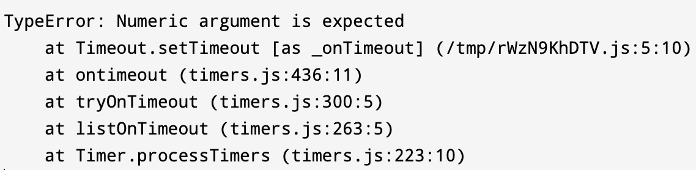

它首先会打印错误名称和消息，然后是被调用的方法列表。每个方法调用都说明其源代码的位置和调用它的行。可以使用此数据来浏览代码库并确定导致错误的代码段。此方法列表以堆叠的方式排列。它显示了异常首先被抛出的位置以及它如何通过堆栈方法调用传播。为异常实施捕获不会让它通过堆栈向上传播并使程序崩溃。

对于 Error 对象，Firefox 还实现了一些非标准属性：

* `columnNumber`：错误所在行的列号；
* `filename`：发生错误的文件
* `lineNumber`：发生错误的行号

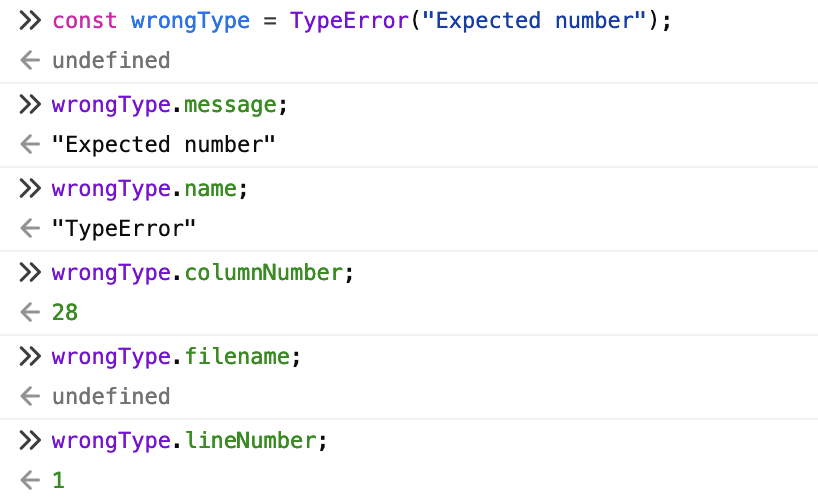

## 2. 错误类型

JavaScript 中有一系列预定义的错误类型。只要使用者没有明确处理应用程序中的错误，它们就会由 JavaScript 运行时自动选择和定义。

JavaScript中的错误类型包括：

* EvalError
* InternalError
* RangeError
* ReferenceError
* SyntaxError
* TypeError
* URIError

这些错误类型都是实际的构造函数，旨在返回一个新的错误对象。最常见的就是 TypeError。大多数时候，大部分错误将直接来自 JavaScript 引擎，例如 InternalError 或 SyntaxError。

JavaScript 提供了 `instanceof` 运算符可以用于区分异常类型：

```javascript
try {
  If (typeof x !== ‘number’) {
       throw new TypeError(‘x 应是数字’);
  } else if (x <= 0) {
       throw new RangeError('x 应大于 0');
  } else {
       // ...
  }
} catch (err) {
    if (err instanceof TypeError) {
      // 处理 TypeError 错误
    } else if (err instanceof RangeError) {
      // 处理 RangeError 错误
  } else {
      // 处理其他类型错误
  }
}
```

下面来了解 JavaScript 中最常见的错误类型，并了解它们发生的时间和原因。

### （1）SyntaxError

SyntaxError 表示语法错误。这些错误是最容易修复的错误之一，因为它们表明代码语法中存在错误。由于 JavaScript 是一种解释而非编译的脚本语言，因此当应用程序执行包含错误的脚本时会抛出这些错误。在编译语言的情况下，此类错误在编译期间被识别。因此，在修复这些问题之前，不会创建应用程序二进制文件。

SyntaxError 发生的一些常见原因是：

* 缺少引号
* 缺少右括号
* 大括号或其他字符对齐不当


### （2）TypeError

TypeError 是 JavaScript 应用程序中最常见的错误之一，当某些值不是特定的预期类型时，就会产生此错误。

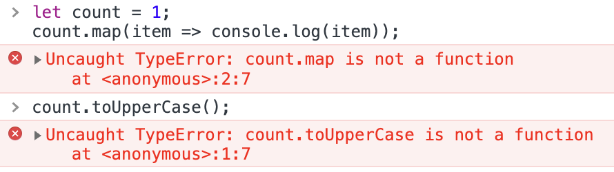

TypeError 发生的一些常见原因是：

* 调用不是方法的对象。
* 试图访问 null 或未定义对象的属性
* 将字符串视为数字，反之亦然

### （3）ReferenceError

ReferenceError 表示引用错误。当代码中的变量引用有问题时，会发生 ReferenceError。可能忘记在使用变量之前为其定义一个值，或者可能试图在代码中使用一个不可访问的变量。在任何情况下，通过堆栈跟踪都可以提供充足的信息来查找和修复有问题的变量引用。

ReferenceErrors 发生的一些常见原因如下：

* 在变量名中输入错误。
* 试图访问其作用域之外的块作用域变量。
* 在加载之前从外部库引用全局变量。


### （4）RangeError

RangeError 表示范围错误。当变量设置的值超出其合法值范围时，将抛出 RangeError。它通常发生在将值作为参数传递给函数时，并且给定值不在函数参数的范围内。当使用记录不完整的第三方库时，有时修复起来会很棘手，因为需要知道参数的可能值范围才能传递正确的值。

RangeError 发生的一些常见场景如下：

* 试图通过 Array 构造函数创建非法长度的数组。
* 将错误的值传递给数字方法，例如 `toExponential()`、`toPrecision()`、`toFixed()` 等。
* 将非法值传递给字符串函数，例如 `normalize()`。


### （5）URIError

URIError 表示 URI错误。当 URI 的编码和解码出现问题时，会抛出 URIError。JavaScript 中的 URI 操作函数包括：`decodeURI`、`decodeURIComponent` 等。如果使用了错误的参数（无效字符），就会抛出 URIError。

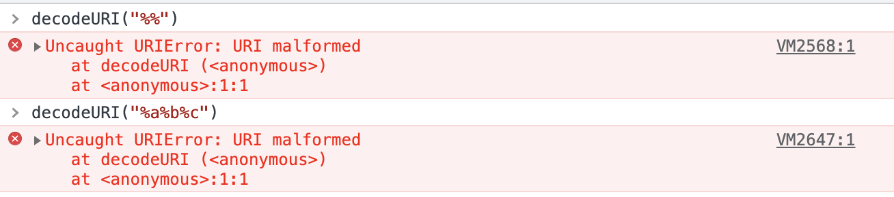

### （6）EvalError

EvalError 表示 Eval 错误。当 `eval()` 函数调用发生错误时，会抛出 EvalError。不过，当前的 JavaScript 引擎或 ECMAScript 规范不再抛出此错误。但是，为了向后兼容，它仍然是存在的。

如果使用的是旧版本的 JavaScript，可能会遇到此错误。在任何情况下，最好调查在eval()函数调用中执行的代码是否有任何异常。

### （7）InternalError

InternalError 表示内部错误。在 JavaScript 运行时引擎发生异常时使用。它表示代码可能存在问题也可能不存在问题。

InternalError 通常只发生在两种情况下：

* 当 JavaScript 运行时的补丁或更新带有引发异常的错误时（这种情况很少发生）；
* 当代码包含对于 JavaScript 引擎而言太大的实体时（例如，数组初始值设定项太大、递归太多）。

解决此错误最合适的方法就是通过错误消息确定原因，并在可能的情况下重构应用逻辑，以消除 JavaScript 引擎上工作负载的突然激增。

\*\*注意：\*\*现代 JavaScript 中不会抛出 EvalError 和 InternalError。

### （8）创建自定义错误类型

虽然 JavaScript 提供了足够的错误类型类列表来涵盖大多数情况，但如果这些错误类型不能满足要求，还可以创建新的错误类型。这种灵活性的基础在于 JavaScript 允许使用 throw 命令抛出任何内容。

可以通过扩展 Error 类以创建自定义错误类：

```javascript
class ValidationError extends Error {
    constructor(message) {
        super(message);
        this.name = "ValidationError";
    }
}
```

可以通过以下方式使用它：

```javascript
throw ValidationError("未找到该属性: name")
```

可以使用 `instanceof` 关键字识别它：

```javascript
try {
    validateForm() // 抛出 ValidationError 的代码
} catch (e) {
    if (e instanceof ValidationError) {
      
    }
    else {
      
    }
}
```

## 3. 抛出错误

很多人认为错误和异常是一回事。实际上，**Error 对象只有在被抛出时才会成为异常**。

在 JavaScript 中抛出异常，可以使用 throw 来抛出 Error 对象：

```javascript
throw TypeError("Expected number");
```

或者：

```javascript
throw new TypeError("Expected number");
```

来看一个简单的例子：

```javascript
function toUppercase(string) {
  if (typeof string !== "string") {
    throw TypeError("Expected string");
  }

  return string.toUpperCase();
}
```

在这里，我们检查函数参数是否为字符串。如果不是，就抛出异常。

从技术上讲，我们可以在 JavaScript 中抛出任何东西，而不仅仅是 Error 对象：

```javascript
throw Symbol();
throw 33;
throw "Error!";
throw null;
```

但是，最好避免这样做：**要抛出正确的 Error 对象，而不是原语**。

## 4. 抛出异常时会发生什么？

异常一旦抛出，就会在程序堆栈中冒泡，除非在某个地方被捕获。

来看下面的例子：

```javascript
function toUppercase(string) {
  if (typeof string !== "string") {
    throw TypeError("Expected string");
  }

  return string.toUpperCase();
}

toUppercase(4);
```

在浏览器或 Node.js 中运行此代码，程序将停止并抛出错误：

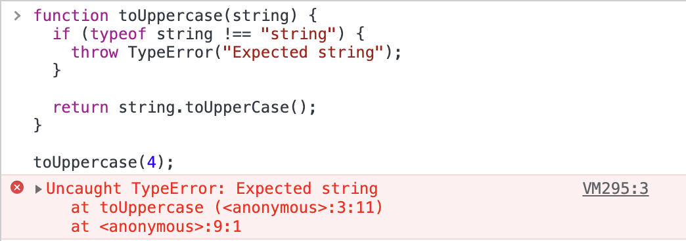

这里还显示了发生错误的确切行。这个错误就是一个**堆栈跟踪**，有助于跟踪代码中的问题。堆栈跟踪从下到上：

```javascript
at toUppercase (<anonymous>:3:11)
at <anonymous>:9:1
```

toUppercase 函数在第 9 行调用，在第 3 行抛出错误。除了在浏览器的控制台中查看此堆栈跟踪之外，还可以在 Error 对象的 `stack` 属性上访问它。

介绍完这些关于错误的基础知识之后，下面来看看同步和异步 JavaScript 代码中的错误和异常处理。

## 5. 同步错误处理

### （1）常规函数的错误处理

同步代码会按照代码编写顺序执行。让我们再看看前面的例子：

```javascript
function toUppercase(string) {
  if (typeof string !== "string") {
    throw TypeError("Expected string");
  }

  return string.toUpperCase();
}

toUppercase(4);
```

在这里，引擎调用并执行 toUppercase，这一切都是同步发生的。 要捕获由此类同步函数引发的异常，可以使用 try/catch/finally：

```javascript
try {
  toUppercase(4);
} catch (error) {
  console.error(error.message);
} finally {
  // ...
}
```

通常，try 会处理正常的路径，或者可能进行的函数调用。catch 就会捕获实际的异常，它接收 Error 对象。而不管函数的结果如何，finally 语句都会运行：无论它失败还是成功，finally 中的代码都会运行。

### （2）生成器函数的错误处理

JavaScript 中的生成器函数是一种特殊类型的函数。它可以随意暂停和恢复，除了在其内部范围和消费者之间提供双向通信通道。为了创建一个生成器函数，需要在 function 关键字后面加上一个 `*`：

```javascript
function* generate() {
//
}
```

只要进入函数，就可以使用 yield 来返回值：

```javascript
function* generate() {
  yield 33;
  yield 99;
}
```

生成器函数的返回值是一个迭代器对象。要从生成器中提取值，可以使用两种方法：

* 在迭代器对象上调用 `next()`
* 使用 `for...of` 进行迭代

以上面的代码为例，要从生成器中获取值，可以这样做：

```javascript
function* generate() {
  yield 33;
  yield 99;
}

const go = generate();
```

当我们调用生成器函数时，这里的 go 就是生成的迭代器对象。接下来，就可以调用 go.next() 来继续执行：

```javascript
function* generate() {
  yield 33;
  yield 99;
}

const go = generate();

const firstStep = go.next().value; // 33
const secondStep = go.next().value; // 99
```

生成器也可以接受来自调用者的值和异常。除了 next()，从生成器返回的迭代器对象还有一个 throw() 方法。使用这种方法，就可以通过向生成器中注入异常来停止程序：

```javascript
function* generate() {
  yield 33;
  yield 99;
}

const go = generate();

const firstStep = go.next().value; // 33

go.throw(Error("Tired of iterating!"));

const secondStep = go.next().value; // never reached
```

要捕获此类错误，可以使用 try/catch 将代码包装在生成器中：

```javascript
function* generate() {
  try {
    yield 33;
    yield 99;
  } catch (error) {
    console.error(error.message);
  }
}
```

生成器函数也可以向外部抛出异常。 捕获这些异常的机制与捕获同步异常的机制相同：try/catch/finally。

下面是使用 for...of 从外部使用的生成器函数的示例：

```javascript
function* generate() {
  yield 33;
  yield 99;
  throw Error("Tired of iterating!");
}

try {
  for (const value of generate()) {
    console.log(value);
  }
} catch (error) {
  console.error(error.message);
}
```

输出结果：

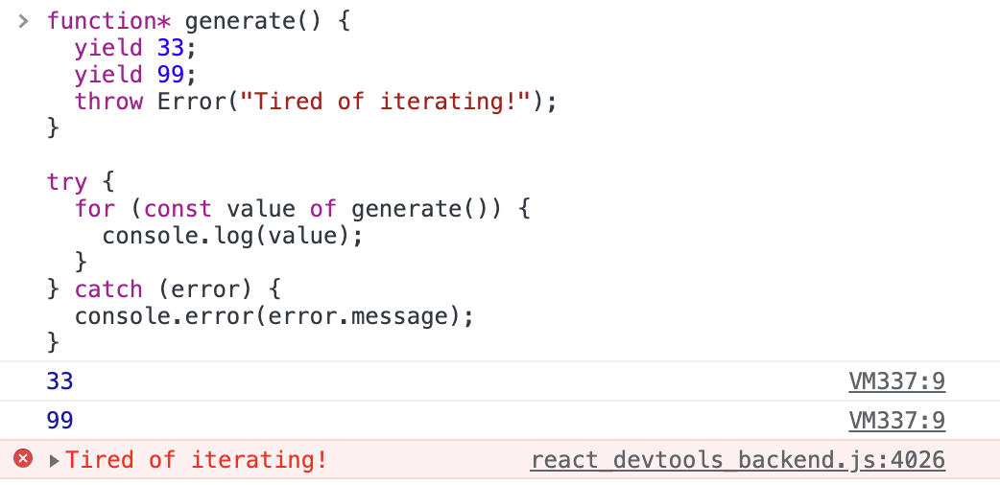

这里，try 块中包含正常的迭代。如果发生任何异常，就会用 catch 停止它。

## 6. 异步错误处理

浏览器中的异步包括定时器、事件、Promise 等。异步世界中的错误处理与同步世界中的处理不同。下面来看一些例子。

### （1）定时器的错误处理

上面我们介绍了如何使用 try/catch/finally 来处理错误，那异步中可以使用这些来处理错误吗？先来看一个例子：

```javascript
function failAfterOneSecond() {
  setTimeout(() => {
    throw Error("Wrong!");
  }, 1000);
}
```

此函数在大约 1 秒后会抛出错误。那处理此异常的正确方法是什么？以下代码是无效的：

```javascript
function failAfterOneSecond() {
  setTimeout(() => {
    throw Error("Wrong!");
  }, 1000);
}

try {
  failAfterOneSecond();
} catch (error) {
  console.error(error.message);
}
```

我们知道，try/catch是同步的，所以没办法这样来处理异步中的错误。当传递给 setTimeout的回调运行时，try/catch 早已执行完毕。程序将会崩溃，因为未能捕获异常。它们是在两条路径上执行的：

```javascript
A: --> try/catch
B: --> setTimeout --> callback --> throw
```

### （2）事件的错误处理

我们可以监听页面中任何 HTML 元素的事件，DOM 事件的错误处理机制遵循与任何异步 Web API 相同的方案。

来看下面的例子：

```javascript
const button = document.querySelector("button");

button.addEventListener("click", function() {
  throw Error("error");
});
```

这里，在单击按钮后立即抛出了异常，我们该如何捕获这个异常呢？这样写是不起作用的，也不会阻止程序崩溃：

```javascript
const button = document.querySelector("button");

try {
  button.addEventListener("click", function() {
    throw Error("error");
  });
} catch (error) {
  console.error(error.message);
}
```

与前面的 setTimeout 例子一样，任何传递给 addEventListener 的回调都是异步执行的：

```javascript
Track A: --> try/catch
Track B: --> addEventListener --> callback --> throw
```

如果不想让程序崩溃，为了正确处理错误，就必须将 try/catch 放到 addEventListener 的回调中。不过这样做并不是最佳的处理方式，与 setTimeout 一样，异步代码路径抛出的异常无法从外部捕获，并且会使程序崩溃。

下面会介绍 Promises 和 async/await 是如何简化异步代码的错误处理的。

### （3）onerror

HTML 元素有许多事件处理程序，例如 `onclick`、`onmouseenter`、`onchange` 等。除此之外，还有 `onerror`，每当 `` 标签或 `<script>` 等 HTML 元素命中不存在的资源时，onerror 事件处理程序就会触发。

来看下面的例子：

```html
<body>
  
</body>
```

当访问的资源缺失时，浏览器的控制台就会报错：

```css
GET http://localhost:5000/nowhere-to-be-found.png
[HTTP/1.1 404 Not Found 3ms]
```

在 JavaScript 中，可以使用适当的事件处理程序“捕获”此错误：

```javascript
const image = document.querySelector("img");

image.onerror = function(event) {
  console.log(event);
};
```

或者使用 addEventListener 来监听 error 事件，当发生错误时进行处理：

```javascript
const image = document.querySelector("img");

image.addEventListener("error", function(event) {
  console.log(event);
});

```

此模式对于加载备用资源以代替丢失的图像或脚本很有用。不过需要记住：onerror 与 throw 或 try/catch 是无关的。

### （4）Promise 的错误处理

下面来通过最上面的 toUppercase 例子看看 Promise 是如何处理错误的：

```javascript
function toUppercase(string) {
  if (typeof string !== "string") {
    throw TypeError("Expected string");
  }

  return string.toUpperCase();
}

toUppercase(4);
```

对上面的代码进行修改，不返回简单的字符串或异常，而是分别使用 `Promise.reject` 和 `Promise.resolve` 来处理错误和成功：

```javascript
function toUppercase(string) {
  if (typeof string !== "string") {
    return Promise.reject(TypeError("Expected string"));
  }

  const result = string.toUpperCase();

  return Promise.resolve(result);
}
```

从技术上讲，这段代码中没有任何异步的内容，但它可以很好地说明 Promise 的错误处理机制。

现在我们就可以在 then 中使用结果，并使用 catch 来处理被拒绝的 Promise：

```javascript
toUppercase(99)
  .then(result => result)
  .catch(error => console.error(error.message));
```

执行结果如下：

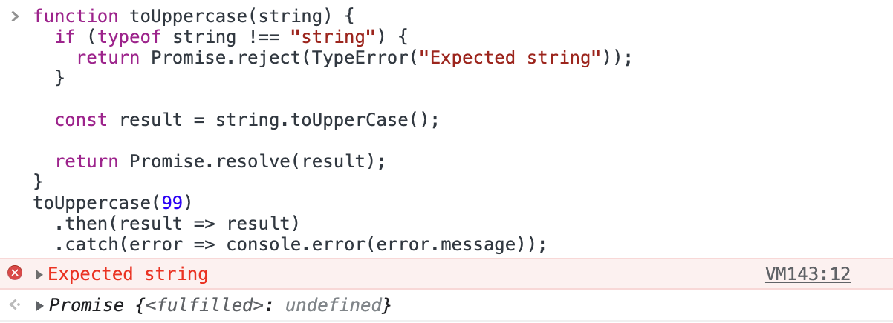

在 Promise 中，catch 是用来处理错误的。除了 catch 还有 finally，类似于 try/catch 中的finally。不管 Promise 结果如何，finally 都会执行：

```javascript
toUppercase(99)
  .then(result => result)
  .catch(error => console.error(error.message))
  .finally(() => console.log("Finally"));
```

结果如下：

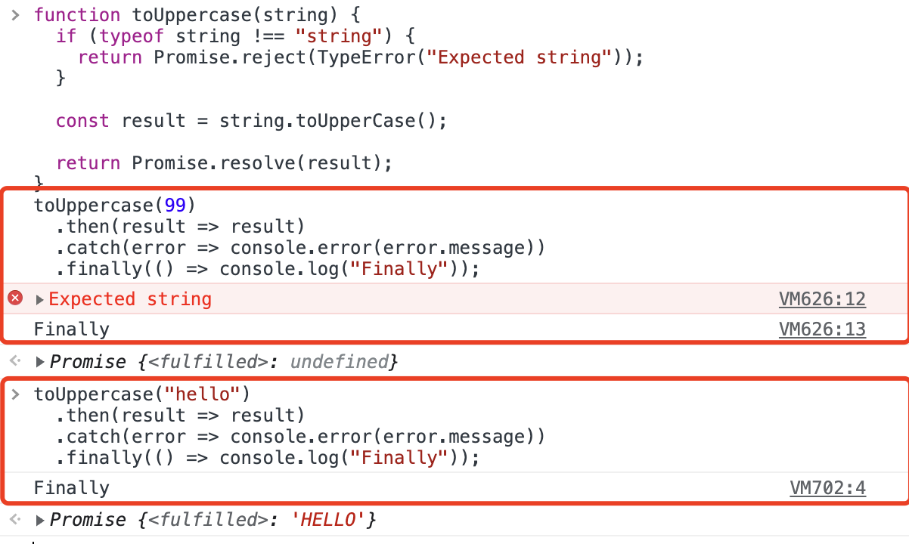

需要记住，任何传递给 then/catch/finally 的回调都是由微任务队列异步处理的。 它们是微任务，优先于事件和计时器等宏任务。

### （5）Promise, error, throw

作为拒绝 Promise 时的最佳实践，可以传入 error 对象：

```javascript
Promise.reject(TypeError("Expected string"));
```

这样，在整个代码库中保持错误处理的一致性。 其他团队成员总是可以访问 error.message，更重要的是可以检查堆栈跟踪。

除了 `Promise.rejec`t 之外，还可以通过抛出异常来退出 Promise 执行链。来看下面的例子：

```javascript
Promise.resolve("A string").then(value => {
  if (typeof value === "string") {
    throw TypeError("Expected number!");
  }
});
```

这里使用 字符串来 resolve 一个 Promise，然后执行链立即使用 throw 断开。为了停止异常的传播，可以使用 catch 来捕获错误：

```javascript
Promise.resolve("A string")
  .then(value => {
    if (typeof value === "string") {
      throw TypeError("Expected number!");
    }
  })
  .catch(reason => console.log(reason.message));
```

这种模式在 fetch 中很常见，可以通过检查 response 对象来查找错误：

```javascript
fetch("https://example-dev/api/")
  .then(response => {
    if (!response.ok) {
      throw Error(response.statusText);
    }

    return response.json();
  })
  .then(json => console.log(json));
```

这里的异常可以使用 catch 来拦截。 如果失败了，并且没有拦截它，异常就会在堆栈中向上冒泡。这本身并没有什么问题，但不同的环境对未捕获的拒绝有不同的反应。

例如，Node.js 会让任何未处理 Promise 拒绝的程序崩溃：

```javascript
DeprecationWarning: Unhandled promise rejections are deprecated. In the future, promise rejections that are not handled will terminate the Node.js process with a non-zero exit code.
```

所以，最好去捕获错误。

### （6）使用 Promise 处理定时器错误

对于计时器或事件，不能捕获回调抛出的异常。上面有一个例子：

```javascript
function failAfterOneSecond() {
  setTimeout(() => {
    throw Error("Error");
  }, 1000);
}

// 不生效
try {
  failAfterOneSecond();
} catch (error) {
  console.error(error.message);
}
```

我们可以使用 Promise 来包装计时器：

```javascript
function failAfterOneSecond() {
  return new Promise((_, reject) => {
    setTimeout(() => {
      reject(Error("Error"));
    }, 1000);
  });
}
```

这里通过 reject 捕获了一个 Promise 拒绝，它带有一个 error 对象。此时就可以用 catch 来处理异常了：

```javascript
failAfterOneSecond().catch(reason => console.error(reason.message));
```

这里使用 value 作为 Promise 的返回值，使用 reason 作为拒绝的返回对象。

### （7）Promise.all 的错误处理

Promise.all 方法接受一个 Promise 数组，并返回所有解析 Promise 的结果数组：

```javascript
const promise1 = Promise.resolve("one");
const promise2 = Promise.resolve("two");

Promise.all([promise1, promise2]).then((results) => console.log(results));

// 结果： ['one', 'two']
```

如果这些 Promise 中的任何一个被拒绝，Promise.all 将拒绝并返回第一个被拒绝的 Promise 的错误。

为了在 Promise.all 中处理这些情况，可以使用 catch：

```javascript
const promise1 = Promise.resolve("good");
const promise2 = Promise.reject(Error("Bad"));
const promise3 = Promise.reject(Error("Bad+"));

Promise.all([promise1, promise2, promise3])
  .then(results => console.log(results))
  .catch(error => console.error(error.message));
```

如果想要运行一个函数而不考虑 Promise.all 的结果，可以使用 finally：

```javascript
Promise.all([promise1, promise2, promise3])
  .then(results => console.log(results))
  .catch(error => console.error(error.message))
  .finally(() => console.log("Finally"));
```

### （8）Promise.any 的错误处理

Promise.any 和 Promise.all 恰恰相反。Promise.all 如果某一个失败，就会抛出第一个失败的错误。而 Promise.any 总是返回第一个成功的 Promise，无论是否发生任何拒绝。

相反，如果传递给 Promise.any 的所有 Promise 都被拒绝，那产生的错误就是 AggregateError。 来看下面的例子：

```javascript
const promise1 = Promise.reject(Error("Error"));
const promise2 = Promise.reject(Error("Error+"));

Promise.any([promise1, promise2])
  .then(result => console.log(result))
  .catch(error => console.error(error))
  .finally(() => console.log("Finally"));
```

执行结果如下：

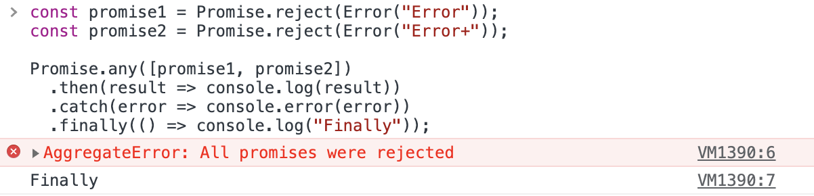

这里用 catch 处理错误。AggregateError 对象具有与基本错误相同的属性，外加一个 errors 属性：

```javascript
const promise1 = Promise.reject(Error("Error"));
const promise2 = Promise.reject(Error("Error+"));

Promise.any([promise1, promise2])
  .then(result => console.log(result))
  .catch(error => console.error(error.errors))
  .finally(() => console.log("Finally"));
```

此属性是一个包含所有被拒绝的错误信息的数组：

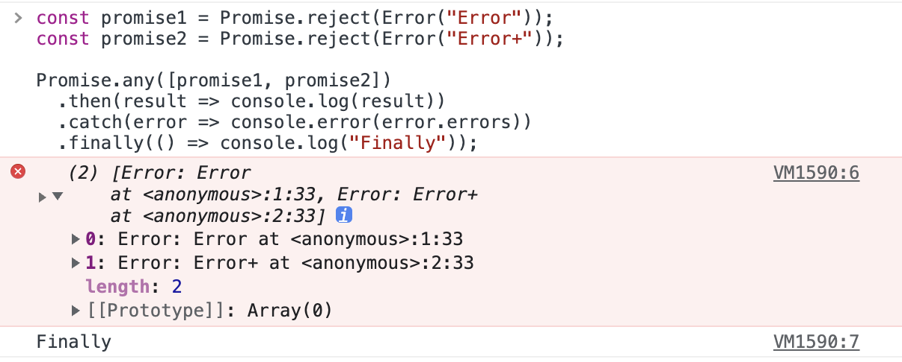

### （9）Promise.race 的错误处理

Promise.race 接受一个 Promise 数组，并返回第一个成功的 Promise 的结果：

```javascript
const promise1 = Promise.resolve("one");
const promise2 = Promise.resolve("two");

Promise.race([promise1, promise2]).then(result => 
  console.log(result)
);

// 结果：one
```

那如果有被拒绝的 Promise，但它不是传入数组中的第一个呢：

```javascript
const promise1 = Promise.resolve("one");
const rejection = Promise.reject(Error("Bad"));
const promise2 = Promise.resolve("two");

Promise.race([promise1, rejection, promise2]).then(result =>
  console.log(result)
);

// 结果：one
```

这样结果还是 one，不会影响正常的执行。

如果被拒绝的 Promise 是数组的第一个元素，则 Promise.race 拒绝，就必须要必须捕获拒绝：

```javascript
const promise1 = Promise.resolve("one");
const rejection = Promise.reject(Error("Bad"));
const promise2 = Promise.resolve("two");

Promise.race([rejection, promise1, promise2])
  .then(result => console.log(result))
  .catch(error => console.error(error.message));

// Bad
```

### （10）Promise.allSettled 的错误处理

Promise.allSettled 是 ECMAScript 2020 新增的 API。它和 Promise.all 类似，不过不会被短路，也就是说当Promise全部处理完成后，可以拿到每个 Promise 的状态, 而不管其是否处理成功。

来看下面的例子：

```javascript
const promise1 = Promise.resolve("Good!");
const promise2 = Promise.reject(Error("Bad!"));

Promise.allSettled([promise1, promise2])
  .then(results => console.log(results))
  .catch(error => console.error(error))
  .finally(() => console.log("Finally"));
```

这里向 Promise.allSettled 传递了一个包含两个 Promise 的数组：一个已解决，另一个已拒绝。

输出结果如下：

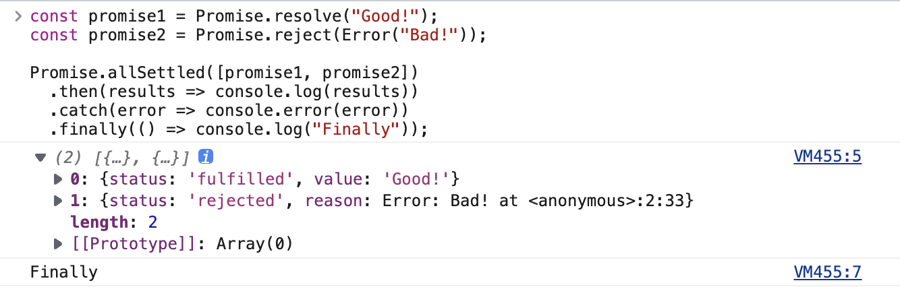

### （11）async/await 的错误处理

JavaScript 中的 async/await 表示异步函数，用同步的方式去编写异步，可读性更好。

下面来改编上面的同步函数 toUppercase，通过将 async 放在 function 关键字之前将其转换为异步函数：

```javascript
async function toUppercase(string) {
  if (typeof string !== "string") {
    throw TypeError("Expected string");
  }

  return string.toUpperCase();
}
```

只需在 function 前加上 async 前缀，就可以让函数返回一个 Promise。这意味着我们可以在函数调用之后链式调用 then、catch 和 finally：

```javascript
toUppercase("hello")
  .then(result => console.log(result))
  .catch(error => console.error(error.message))
  .finally(() => console.log("Always runs!"));
```

当从 async 函数中抛出异常时，异常会成为底层 Promise 被拒绝的原因。任何错误都可以从外部用 catch 拦截。

除此之外，还可以使用 try/catch/finally 来处理错误，就像在同步函数中一样。

例如，从另一个函数 consumer 中调用 toUppercase，它方便地用 try/catch/finally 包装了函数调用：

```javascript
async function toUppercase(string) {
  if (typeof string !== "string") {
    throw TypeError("Expected string");
  }

  return string.toUpperCase();
}

async function consumer() {
  try {
    await toUppercase(98);
  } catch (error) {
    console.error(error.message);
  } finally {
    console.log("Finally");
  }
}

consumer();
```

执行结果如下：

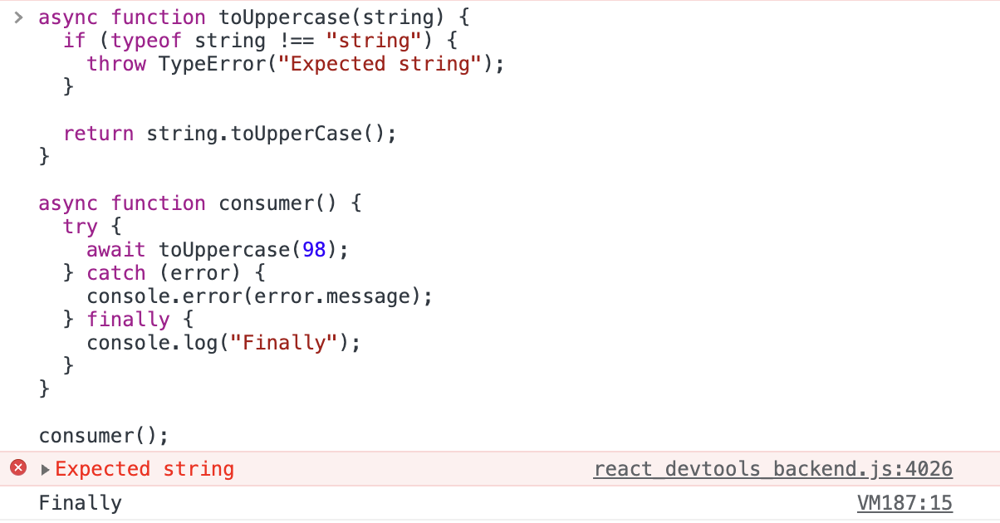

### （12）异步生成器的错误处理

JavaScript 中的异步生成器是能够生成 Promise 而不是简单值的生成器函数。它将生成器函数与异步相结合，结果是一个生成器函数，其迭代器对象向消费者公开一个 Promise。

要创建一个异步生成器，需要声明一个带有星号 \* 的生成器函数，前缀为 async：

```javascript
async function* asyncGenerator() {
  yield 33;
  yield 99;
  throw Error("Bad!"); // Promise.reject
}
```

因为异步生成器是基于 Promise，所以同样适用 Promise 的错误处理规则，在异步生成器中，throw 会导致 Promise 拒绝，可以用 catch 拦截它。

要想从异步生成器处理 Promise，可以使用 then：

```javascript
const go = asyncGenerator();

go.next().then(value => console.log(value));
go.next().then(value => console.log(value));
go.next().catch(reason => console.error(reason.message));
```

执行结果如下：

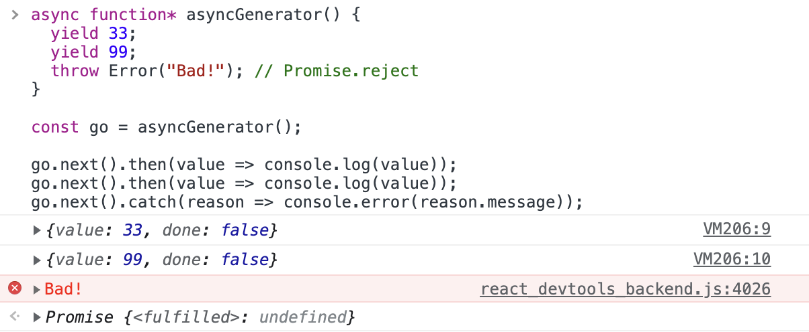

也使用异步迭代 for await...of。 要使用异步迭代，需要用 async 函数包装 consumer：

```javascript
async function* asyncGenerator() {
  yield 33;
  yield 99;
  throw Error("Bad"); // Promise.reject
}

async function consumer() {
  for await (const value of asyncGenerator()) {
    console.log(value);
  }
}

consumer();
```

与 async/await 一样，可以使用 try/catch 来处理任何异常：

```javascript
async function* asyncGenerator() {
  yield 33;
  yield 99;
  throw Error("Bad"); // Promise.reject
}

async function consumer() {
  try {
    for await (const value of asyncGenerator()) {
      console.log(value);
    }
  } catch (error) {
    console.error(error.message);
  }
}

consumer();
```

输出结果如下：

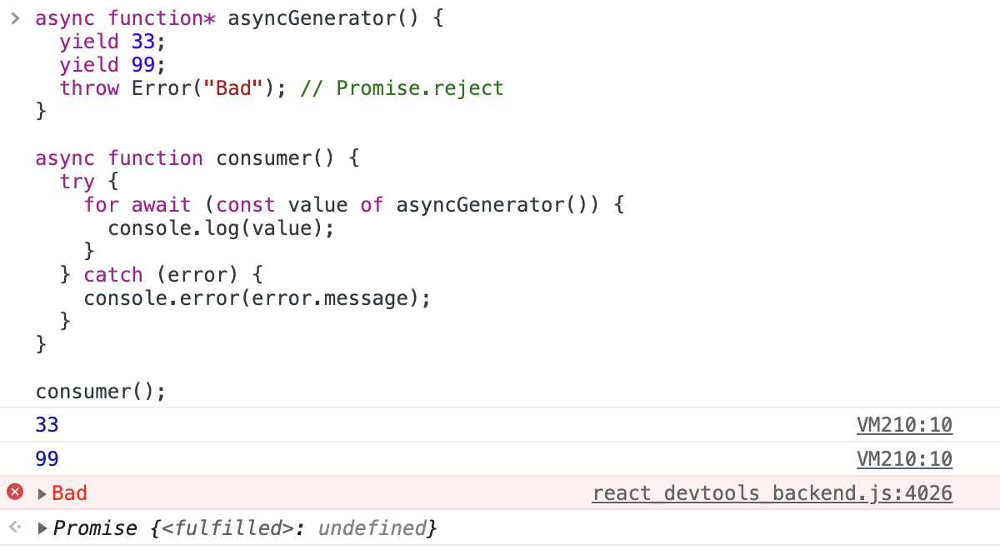

从异步生成器函数返回的迭代器对象也有一个 `throw()` 方法。在这里对迭代器对象调用 throw() 不会抛出异常，而是 Promise 拒绝：

```javascript
async function* asyncGenerator() {
  yield 33;
  yield 99;
  yield 11;
}

const go = asyncGenerator();

go.next().then(value => console.log(value));
go.next().then(value => console.log(value));

go.throw(Error("Reject!"));

go.next().then(value => console.log(value)); 
```

输出结果如下：

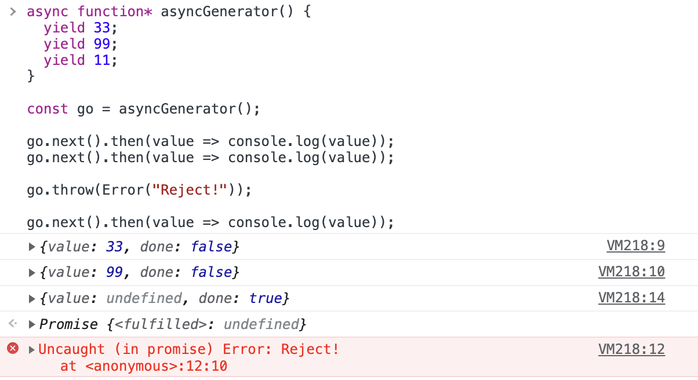

可以通过以下方式来捕获错误：

```javascript
go.throw(Error("Let's reject!")).catch(reason =>
  console.error(reason.message)
);
```

我们知道，迭代器对象的 throw() 是在生成器内部发送异常的。所以还可以使用以下方式来处理错误：

```javascript
async function* asyncGenerator() {
  try {
    yield 33;
    yield 99;
    yield 11;
  } catch (error) {
    console.error(error.message);
  }
}

const go = asyncGenerator();

go.next().then(value => console.log(value));
go.next().then(value => console.log(value));

go.throw(Error("Reject!"));

go.next().then(value => console.log(value));
```

## 5. Node.js 错误处理

### （1）同步错误处理

Node.js 中的同步错误处理与 JavaScript 是一样的，可以使用 try/catch/finally。

### （2）异步错误处理：回调模式

对于异步代码，Node.js 强烈依赖两个术语：

* 事件发射器
* 回调模式

在回调模式中，异步 Node.js API 接受一个函数，该函数通过事件循环处理并在调用堆栈为空时立即执行。

来看下面的例子：

```javascript
const { readFile } = require("fs");

function readDataset(path) {
  readFile(path, { encoding: "utf8" }, function(error, data) {
    if (error) console.error(error);
    // data操作
  });
}
```

这里可以看到回调中错误处理：

```javascript
function(error, data) {
    if (error) console.error(error);
    // data操作
}
```

如果使用 fs.readFile 读取给定路径时出现任何错误，我们都会得到一个 error 对象。这时我们可以：

* 单地记录错误对象。
* 抛出异常。
* 将错误传递给另一个回调。

要想抛出异常，可以这样做：

```javascript
const { readFile } = require("fs");

function readDataset(path) {
  readFile(path, { encoding: "utf8" }, function(error, data) {
    if (error) throw Error(error.message);
    // data操作
  });
}
```

但是，与 DOM 中的事件和计时器一样，这个异常会使程序崩溃。 使用 try/catch 停止它的尝试将不起作用：

```javascript
const { readFile } = require("fs");

function readDataset(path) {
  readFile(path, { encoding: "utf8" }, function(error, data) {
    if (error) throw Error(error.message);
    // data操作
  });
}

try {
  readDataset("not-here.txt");
} catch (error) {
  console.error(error.message);
}
```

如果不想让程序崩溃，可以将错误传递给另一个回调：

```javascript
const { readFile } = require("fs");

function readDataset(path) {
  readFile(path, { encoding: "utf8" }, function(error, data) {
    if (error) return errorHandler(error);
    // data操作
  });
}
```

这里的 errorHandler 是一个简单的错误处理函数：

```javascript
function errorHandler(error) {
  console.error(error.message);
  // 处理错误：写入日志、发送到外部logger
}
```

### （3）异步错误处理：事件发射器

Node.js 中的大部分工作都是基于事件的。大多数时候，我们会与发射器对象和一些侦听消息的观察者进行交互。

Node.js 中的任何事件驱动模块（例如 net）都扩展了一个名为 EventEmitter 的根类。EventEmitter 有两个基本方法：on 和 emit。

下面来看一个简单的 HTTP 服务器：

```javascript
const net = require("net");

const server = net.createServer().listen(8081, "127.0.0.1");

server.on("listening", function () {
  console.log("Server listening!");
});

server.on("connection", function (socket) {
  console.log("Client connected!");
  socket.end("Hello client!");
});
```

这里我们监听了两个事件：listening 和 connection。除了这些事件之外，事件发射器还公开一个错误事件，在出现错误时触发。

如果这段代码监听的端口是 80，就会得到一个异常：

```javascript
const net = require("net");

const server = net.createServer().listen(80, "127.0.0.1");

server.on("listening", function () {
  console.log("Server listening!");
});

server.on("connection", function (socket) {
  console.log("Client connected!");
  socket.end("Hello client!");
});
```

输出结果如下：

```javascript
events.js:291
      throw er;
      ^

Error: listen EACCES: permission denied 127.0.0.1:80
Emitted 'error' event on Server instance at: ...
```

为了捕获它，可以为 error 注册一个事件处理函数：

```javascript
server.on("error", function(error) {
  console.error(error.message);
});
```

这样就会输出：

```javascript
listen EACCES: permission denied 127.0.0.1:80
```

## 6. 异常处理最佳实践

最后，我们来看看处理 JavaScript 异常的最佳实践！

### （1）不要过度处理异常

异常处理的第一个最佳实践就是**不要过度使用“异常处理”**。通常，我们会在外层处理异常，从内层抛出异常，这样一旦发生异常，就可以更好地理解是什么原因导致的。

然而，开发人员常犯的错误之一是过度使用异常处理。有时这样做是为了让代码在不同的文件和方法中看起来保持一致。但是，不幸的是，这些会对应用程序和错误检测造成不利影响。

因此，只关注代码中可能导致错误的地方，异常处理将有助于提高代码健壮性并增加检测到错误的机会。

### （2）**避免浏览器特定的非标准方法**

尽管许多浏览器都遵循一个通用标准，但某些特定于浏览器的 JavaScript 实现在其他浏览器上却失败了。例如，以下语法仅适用于 Firefox。

```javascript
catch(e) { 
  console.error(e.filename + ': ' + e.lineNumber); 
}
```

因此，在处理异常时，尽可能使用跨浏览器友好的 JavaScript 代码。

### （3）远程异常记录

当发生异常时，我们应该得到通知以了解出了什么问题。这就是异常日志的用武之地。JavaScript 代码是在用户的浏览器中执行的。因此，我们需要一种机制来跟踪客户端浏览器中的这些错误，并将它们发送到服务器进行分析。

可以尝试使用以下工具来监控并上报错误：

* **Sentry（**[https://sentry.io/](https://sentry.io/welcome/)\*\*）：\*\*专注于异常（应用崩溃）而不是信息错误。它提供了应用中错误的完整概述，包括受影响的用户数量、调用堆栈、受影响的浏览器以及导致错误的提交等详细信息。
* **Rollbar（**<https://rollbar.com/>**）**：用于前端、后端和移动应用的无代理错误监控工具。它提供人工智能辅助的工作流程，使开发人员能够在错误影响用户之前立即采取行动。它会显示受错误影响的客户数量、受影响的平台或浏览器的类型以及之前是否发生过类似错误或是否已经存在解决方案等数据。

### （4）错误处理中间件（Node.js）

Node.js 环境支持使用中间件向服务端应用中添加功能。因此可以创建一个错误处理中间件。使用中间件的最大好处是所有错误都在一个地方集中处理。可以选择启用/禁用此设置以轻松进行测试。

以下是创建基本中间件的方法：

```javascript
const logError = err => {
    console.log("ERROR: " + String(err))
}

const errorLoggerMiddleware = (err, req, res, next) => {
    logError(err)
    next(err)
}

const returnErrorMiddleware = (err, req, res, next) => {
    res.status(err.statusCode || 500)
       .send(err.message)
}

module.exports = {
    logError,
    errorLoggerMiddleware,
    returnErrorMiddleware
}
```

可以像下面这样在应用中使用此中间件：

```javascript
const { errorLoggerMiddleware, returnErrorMiddleware } = require('./errorMiddleware')

app.use(errorLoggerMiddleware)

app.use(returnErrorMiddleware)
```

现在可以在中间件内定义自定义逻辑以适当地处理错误。而无需再担心在整个代码库中实现单独的错误处理结构。

### （5）捕获所有未捕获的异常（Node.js）

我们可能永远无法涵盖应用中可能发生的所有错误。因此，必须实施回退策略以捕获应用中所有未捕获的异常。

可以这样做：

```javascript
process.on('uncaughtException', error => {
    console.log("ERROR: " + String(error))
    // 其他处理机制
})
```

还可以确定发生的错误是标准错误还是自定义操作错误。根据结果，可以退出进程并重新启动它以避免意外行为。

### （6）捕获所有未处理的Promise拒绝（Node.js）

与异常不同的是，promise 拒绝不会抛出错误。因此，一个被拒绝的 promise 可能只是一个警告，这让应用有可能遇到意外行为。因此，实现处理 promise 拒绝的回退机制至关重要。

可以这样做：

```javascript
const promiseRejectionCallback = error => {
    console.log("PROMISE REJECTED: " + String(error))
}

process.on('unhandledRejection', callback)
```


> 更新: 2022-11-16 00:58:51  
> 原文: <https://www.yuque.com/cuggz/feplus/snnov8lukstugn0h>