# Astro

前端技术日新月异，最初的静态网站逐渐被由服务端生成的网站所取代，后来又逐渐向客户端渲染的应用转变。不过客户端渲染也存在一些问题，如加载时间变长和搜索引擎优化难度等。Astro 这个新的前端框架结合了服务端渲染和客户端渲染的优点，可以更好地解决这些问题。

本文就来介绍一下这两年爆火的前端框架 Astro，它在两年的时间新增了 30k+ star: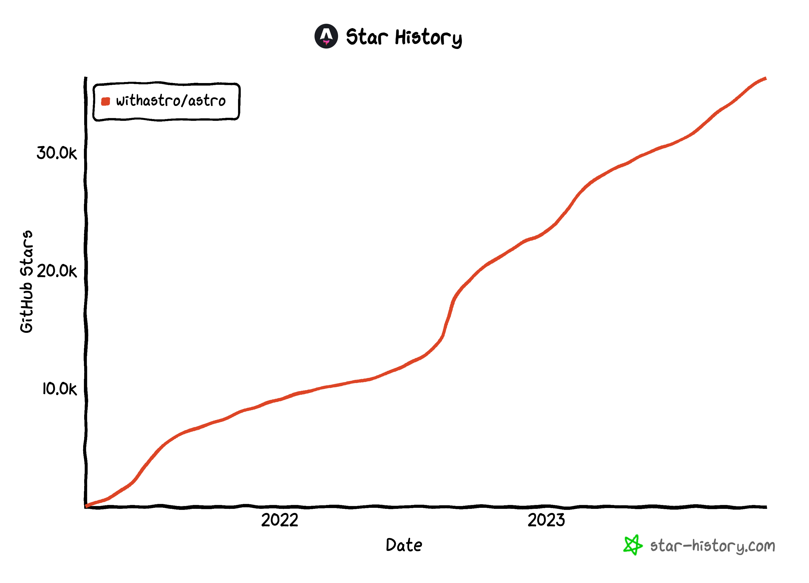

这个前端框架，有点不一样。

## Astro 基本概念

Astro 是一个开源的 JavaScript 框架，用于在流行的UI框架（如React、Preact、Vue 或 Svelte）之上生成 Web 应用。Astro 的页面由多个独立的组件组成。为了提高加载速度，Astro 会在服务端对页面进行预渲染，并剥离所有 JavaScript，除非将某个组件标记为交互式，此时 Astro 将发送必要的最小量 JavaScript 以实现交互功能。

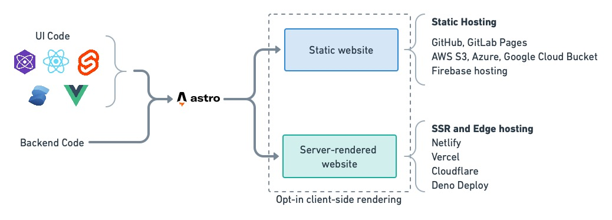

通过这种策略，Astro 页面加载速度快，因为在首次渲染时不需要执行任何 JavaScript。在注水的过程中，Astro会将 JavaScript “注入”到组件中，使它们变成动态的。

## Astro 历史发展

Astro 是由 Fred Schott 和 Nate Moore 创建，最初用于构建快速静态内容站点，如博客和落地页等。它最初的独特优势就是简单易用。可以从各种来源获取内容，包括 API、CMS、MDX 文件或 Markdown 文件，并在 Astro 站点上展示。

Astro 最初的设计并非与 React 或 Vue 等竞争，而是为了支持互操作性。简而言之，就是可以在 Astro 中使用喜欢的工具！它提供了对 React、Vue、Svelte 和 Tailwind CSS 等前端工具的一流支持。

然而，Astro 真正的亮点是名为岛屿的前端架构范式转变。Astro的岛屿架构能够提高应用的速度，它将 UI 拆分为更小的、隔离的组件，并在静态页面中部分启动交互式组件，这是一个大胆的创新。

现在，Astro 已经发展成一个现代 Web 框架，可用于构建快速的多页面应用、动态服务器端点和注重内容性能的网站。尽管保留了简单性和核心功能，如服务器端点、内容集合、视图过渡以及出色的开发者体验，但 Astro 正不断演进，成为一个功能强大的现代Web应用程序框架。

## Astro 工作原理

Astro 的核心是其岛屿架构。那么 Astro 中的岛屿是如何运作的呢？这就不得不说它的岛屿架构和部分水合了。

我们知道，客户端和服务端是向用户提供应用的两个主要参与者：

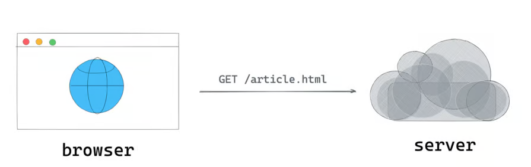

下面来看一个在客户端上重新水合的服务端渲染的应用的例子，服务端渲染简化的过程如下：

1. 在服务端渲染应用
2. 在客户端上重新水合整个应用

这是描述部分水合作用的简单方法。我们没有对整个应用进行水合处理，而是专注于应用的较小交互部分并独立地对这些部分进行水合处理：

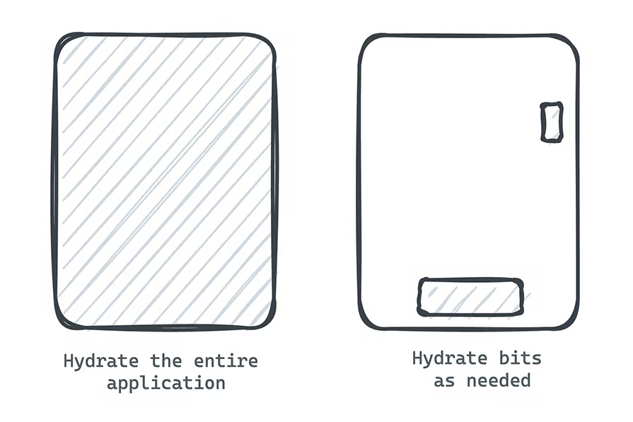

Astro 岛屿就是嵌入静态HTML页面中的交互式UI组件。一个页面上可以存在多个岛。每个岛都是通过独立的部分水合方式进行渲染。也就是说，每个岛都是独立水合的。

那这么做有什么好处呢？

通过利用岛屿，Astro 应用可以具有出色的初始加载时间，而不会受到 JavaScript 的限制。大部分站点保持静态状态，只有在初始页面加载之后需要时才会对交互部分或岛进行水合。

## Astro 关键功能

上面了解了Astro 的岛屿架构和部分水合，下面来看看 Astro 的核心功能，以更有效的使用它。

### 组件

**Astro 应用的最小单位是组件。组件构成了每个 Astro 应用的基础：**

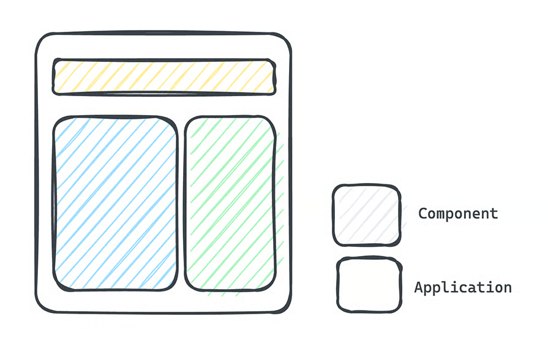

Astro 组件文件都以 `.astro` 结尾。

与大多数其他前端框架类似，组件内的抽象程度由开发者自己决定。例如，组件可以是 UI 的一小部分可重用的组件，例如页眉或页脚，或者组件可以足够大以构成整个页面或布局。

来看看下面的 Hello World Astro 组件：

```javascript
// HelloWorld.astro 
---
const name = "前端充电宝"
---

<h1>Hello world, {name} </h1>
```

可以看到，Astro 包含两个部分：组件脚本和组件模板

组件脚本是包含在 `---` 虚线之间的部分，与 Markdown 前面的内容块相同。在脚本部分中，默认情况下，可以编写任何有效的 JavaScript 和 TypeScript！在上面的例子中，定义了一个 `name`变量：

```javascript
---
const name = "前端充电宝"
---
```

组件模板就是定义组件 HTML 的地方。如果组件需要向浏览器渲染一些 UI 元素或 HTML，可以在此处定义它。在上面的例子中，定义了以下内容：

```javascript
<h1>Hello world, {name} </h1>
```

Astro 组件模板决定了组件的 HTML 输出并支持纯 HTML！不过，Astro 组件模板语法是 HTML 的超集。它添加了强大的插值功能，因此可以充分利用 JavaScript 和 TypeScript 来编写组件模板。

***

除了简单的字符串插值之外，组件模板语法还支持很多功能，例如添加`<style>`和`<script>`标签、利用动态属性、条件渲染、动态HTML等。以下是其中一些功能的演示：

```html
---
const isActive = false 
---

<h1>前端充电宝</h1>

{/** 条件渲染 **/}
{isActive && <p>Hello World from 前端充电宝</p>}

{/** 样式：默认情况下样式是有作用域的 **/}
<style>
 h1 {
   color: red, 
}

{/** 添加脚本 **/}
<script>
<!-- 也可以在此处编写TypeScript。Astro 原生支持 TypeScript -->
const header = document.querySelector("h1")
header.textContent = "Updated LogRocket Header"
</script>
```

### 页面和路由

Astro 应用的入口点是页面，它利用基于文件的路由方式来管理页面。

假设正在构建一个具有两个不同路由的 Web 应用：`index.html` 和 `about.html`，那该如何表示呢？

Astro 项目的 `src/pages/` 子目录中的每个文件对应一个页面。在这个例子中，需要两个页面 ：`src/pages/index.astro` 和 `src/pages/about.astro`：

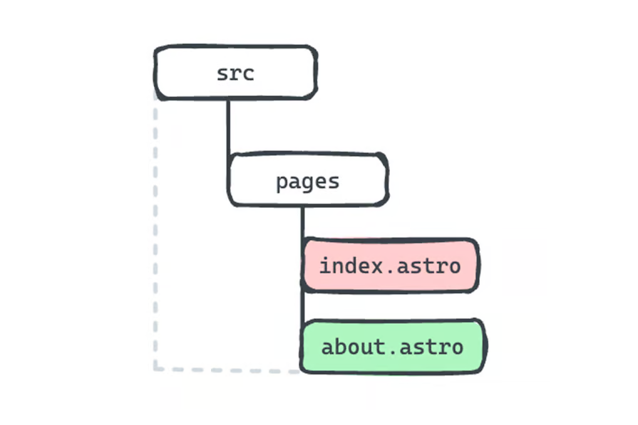

在构建应用时，可以通过像`npm build`这样的简单命令来进行构建，`index.astro`和`about.astro`将被构建成应用中相应的`index.html`和`about.html文`件。

Astro 是一个多页面 Web 框架。也就是说，默认情况下，每个路由都对应一个单独的 HTML 文档。

可以按照以下步骤来尝试使用 Astro：

1. 通过运行 `npm create astro@latest` 命令创建一个新的 Astro 项目
2. 按照终端中的提示设置新项目
3. 使用 `astro dev` 命令启动应用
4. 在代码编辑器中打开项目
5. 查看 `src/pages` 目录并创建两个新页面：`index.astro` 和 `about.astro`
6. 通过 `astro build` 构建应用
7. 查看构建输出并观察两个单独的 HTML 文件——每个路径一个

在 Astro 中，不仅可以使用 `.astro` 组件作为页面，还可以使用以下方式构建页面：

* Markdown 和 HTML 文件
* 安装了 MDX 集成的 MDX 文件
* JavaScript 或 TypeScript 作为静态文件或 API 端点

### 动态路由

上面我们讨论了页面和 HTML 输出之间的一对一映射，不过，在 Astro 中也可以通过一个页面处理多个路由。

Astro 页面可以在**文件名**中指定动态路由参数，这将生成多个匹配的页面。例如，构建一个博客应用，其中每篇博客都有自己的路由，可以通过以下方式表示该页面：

```html
src/pages/blogs/[blog].astro
```

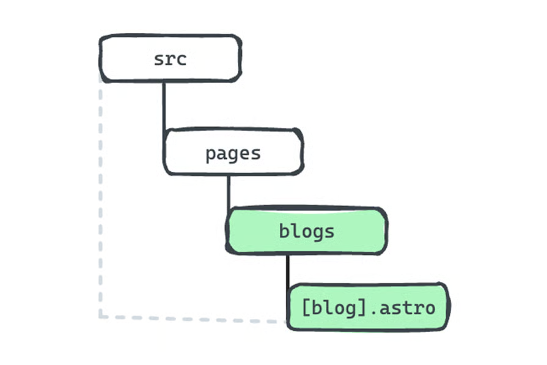

注意，组件文件名中的方括号：`[blog].astro`。在静态模式下，所有路由都必须在构建时确定。因此，动态路由必须导出 `getStaticPaths()` 方法，该方法返回具有 `params` 属性的对象数组。这告诉 Astro 在构建时生成哪些页面。

例如：

```javascript
// src/pages/blogs/[blog.astro]
---
export function getStaticPaths() {
   return [
     {params: {blog: "how-to-learn-astro"}},
     {params: {blog: "how-to-learn-ai"}},
     {params: {blog: "how-to-learn-astro-ai"}},
  ]
}

// 可以从 Astro 全局对象中解构参数
const { blog } = Astro.params 
--- 

<h1> Hello Blog, {blog} </h1>
```

当构建此应用时，`src/pages/blogs/[blog.astro]` 将生成三个博客页面：

* `/blogs/how-to-learn-astro.html`
* `/blogs/how-to-learn-ai.html`
* `/blogs/how-to-learn-astro-ai.html`

**Astro 还支持服务端渲染，在这种情况下，路由是在运行时而不是构建时生成的。这意味着不需要指定 **<code>**getStaticPaths()**</code>** 方法，并且页面可以大大简化，如下所示：**

```javascript
// src/pages/blogs/[blog.astro]
---
// 可以从 Astro 全局对象中解构参数
const { blog } = Astro.params 
--- 

<h1> Hello Blog, {blog} </h1>
```

在实践中，使用SSR，这里的博客参数很可能是博客的唯一标识符，例如 ID。当用户尝试查看 `/blogs/id` 时，可以通过 `Astro.params` 获取 `id` 并在服务端获取所需的博客内容。

### 布局

除了正常的组件和特殊的组件“页面”，下面来了解另一种类型的组件：布局。

大多数 Web 应用都包含一些可重用的结构，这些结构为页面提供了结构，例如页眉、页脚和侧面导航元素。这些可以被抽象为可重用的 Astro 组件，称为布局。

可以通过在 `src/layouts` 目录中添加 Astro 组件来创建布局组件：

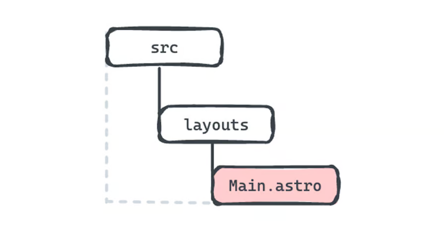

在布局组件中，可以抽象公共组件并在任意应用页面中重用它们。

***

**来看下面的布局组件：**

```javascript
// src/layouts/Main.astro
---
const { title } = Astro.props;
---
<!doctype html>
<html lang="en">
  <head>
    <meta charset="UTF-8" />
    <meta name="description" content="Astro description" />
    <meta name="viewport" content="width=device-width" />
    <link rel="icon" type="image/svg+xml" href="/favicon.svg" />
    <meta name="generator" content={Astro.generator} />
    <title>{title}</title>
  </head>
  <body>
    {/** 注意，下面使用了 <slot/> 标签 **/}
    <slot />
  </body>
</html>
```

可以在任何页面中使用此组件：

```javascript
---
import Main from '../layouts/Main.astro';
---

{/** 像渲染HTML元素一样渲染 Main 组件：<Main></Main> **/}
<Main title="Home page.">
  <main> 
    <h1> Hello world, again </h1>
   <main>
</Main>
```

注意这里是如何使用布局组件的。在页面组件的 HTML 部分中，渲染了布局组件，并将页面的元素作为子元素传递给了`<Main>`组件。

可以通过在`<Main>`组件中添加一个`<slot/>`来渲染这个内容。简而言之，每个传递给`<Main>`布局组件的子元素都将被渲染到`<Main>`中的`<slot/>`中：

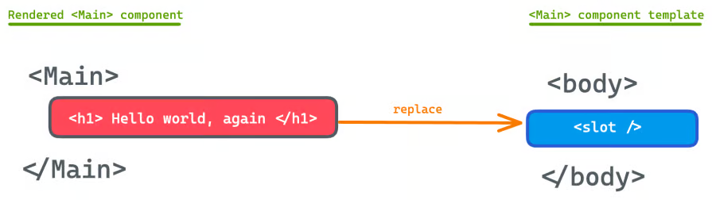

还可以通过提供 `props` 来提高 Astro 组件的可重用性。例如：

```html
<Main title="Hello world" />
<Main title="Another title" />
<Main title="Hello again" />
```

上面的例子就是在布局组件渲染时将不同的标题传递给它：

```javascript
// src/layouts/Main.astro
---
const { title } = Astro.props;
---

<h1>{title} </h1>
```

### 主题和模板

Astro 在过去几年中的增长很大程度上归功于它的易于采用和开发。Astro 通过提供多样化的模板，为工开发者快速启动项目并编写更少的代码提供了极大的便利。


### 中间件

中间件在帮助 Astro 转变为成熟的 Web 框架的过程中发挥了重要作用。

大多数全栈 Web 框架都有中间件实现，例如 NestJS。中间件位于客户端请求和服务器应用逻辑的其余部分之间，起到中心化逻辑的作用，例如身份验证、日志记录、特性标志等。

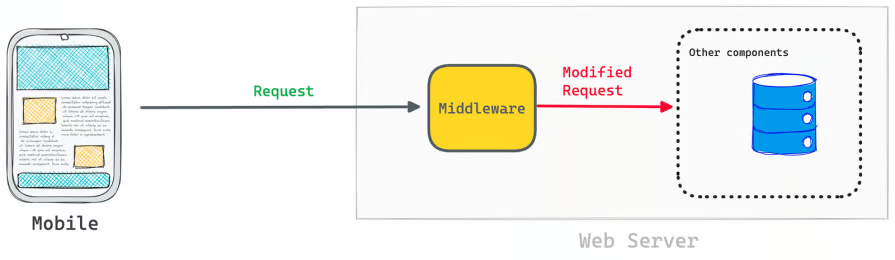

Astro 也提供了中间件，下面是 Astro 中基本中间件的结构：

```javascript
// src/middleware.js|ts
import { defineMiddleware } from "astro/middleware";
const middleware = defineMiddleware((context, next) => {
  // 在这里对请求进行一些操作
  return next() // 不进行任何操作，原样转发请求
});
export const onRequest = middleware;
```

为了类型安全，可以从 Astro 包中导入 `MiddlewareResponseHandler` 类型以及 `defineMiddleware` 实用程序。然后，通过 `defineMiddleware` 实用程序定义中间件变量：

```javascript
const middleware = definedMiddleware(...)
```

最后，导出一个指向`middleware`的`onRequest`函数。

```javascript
export const onRequest = defineMiddleware(...)
```

### Markdown 和 **Content Collections API**

假设你正在构建一个大型的内容驱动应用，这样的项目预计会使用大量的Markdown、MDX、JSON或YAML文件。

**组织项目内容的最佳实践是将内容数据保存在数据库中，可以在数据库中验证文档结构并确保所需的内容符合我们想要的数据模型。**

***

**使用此解决方案时，可以将它们表示为存储在具有预定义架构的数据库中的数据集合：**

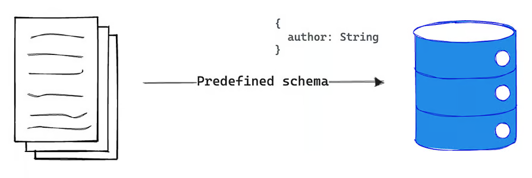

在大多数静态站点生成器中，验证本地模式很困难。Astro 通过其 Content Collections API （内容集合）提供了强类型安全性，改变了这种情况。

**内容集合是 Astro 项目的 src/content 文件夹中的任何顶级目录：**

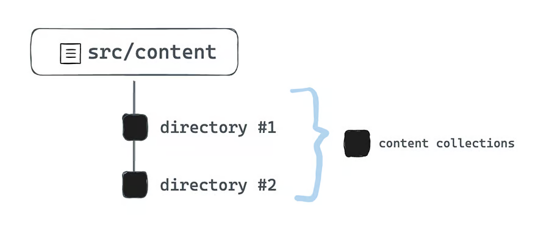

**集合中的单个文档被称为集合项：**

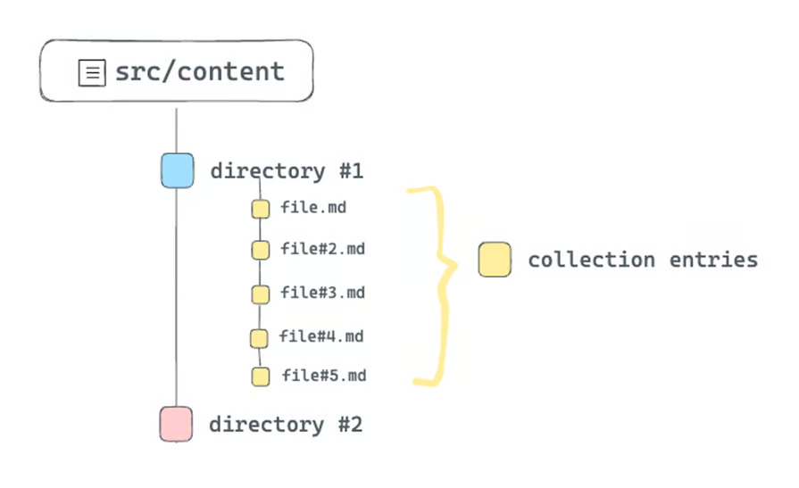

以这种方式组织大型内容驱动的网站的好处在于，可以利用Astro的类型安全性来查询和处理内容集合。例如，可以为内容集合引入一个模式，如下所示：

```javascript
// 📂 src/content/config.ts
// 从 astro:content 导入工具
import { z, defineCollection } from "astro:content";

// 定义一个或多个集合的类型和模式
const blogCollection = defineCollection({
  type: 'content',
  // 一个包含字符串类型的对象 - 标题（title）、年份（year）、月份（month）和日期（day）
  schema: z.object({
    title: z.string(),
    year: z.string(),
    month: z.string(),
    day: z.string(),
  }),
});

// 导出一个单独的 collections 对象以注册集合。
// 键应该与“src/content”中的集合目录名称匹配。
export const collections = {
  blog: blogCollection, // add the blog collection 
};
```

现在，src/content/blog 集合中的每一项都必须遵守此结构。

下面来验证一下每个 Markdown 的标题。例如，如果有以下内容，就会收到 TypeScript 错误，因为不满足我们定义的结构：

```javascript
<!-- src/content/blog/initial-blog.md -->

---
title="Hello World"
<!-- 缺少年份（year）、月份（month）和日期（day）的模式定义 --> 
--- 

# 前端充电宝
hello world！
```

无论 Astro 项目有多大，内容集合都是组织内容文档、验证文档结构以及在查询或操作内容集合时享受开箱即用的 TypeScript 支持的最佳方式。

### 视图转换 API

清晰且炫酷的页面过渡不仅可以增强用户体验，还可以建立流动方向并突出展示了不同页面之间元素的关系。这就是 View Transitions API 发挥作用的地方。

Astro的 View Transitions 是一组新的API，旨在使用 View Transitions 浏览器 API 原生地操纵页面过渡。Astro 是第一个将 View Transitions 引入主流的重要 Web 框架。

要开始在 Astro 项目中使用 View Transitions API，只需导入 ViewTransitions。然后，在希望提供页面转换的源页面和目标页面的头部渲染组件：

```javascript
// some-page.astro 
---
import { ViewTransitions } from "astro:transitions";
---

<head>
  <ViewTransitions />
</head>

// ... 
```

ViewTransitions 负责将客户端脚本添加到原始页面，以拦截对其他页面的点击。

## Astro 使用场景

说完了 Astro 的核心功能，下面来看看 Astro 的一些常见用例，如果需要开发内容驱动的网站，低延迟是很重要的，Astro 就是一个很好的选择。

### 博客、作品集

如果你的个人博客或作品集是一个静态网站，那么使用 Astro 是一个明智的选择。除了提高网站性能外，Astro 的组件化架构还允许你在适当的位置轻松地添加动态功能。

还可以集成 Markdown 以获得更好的创作体验，并利用 Astro 的服务端渲染来保持 SEO 友好。简而言之，如果要在 2024 年构建静态网站，Astro 是你的最佳选择。

### 文档站点

文档站点通常具有大量内容，Astro 在这方面表现出色。Astro 还有一个名为 Starlight 的专用文档框架，可以快速启动和运行。如果需要一个干净、直观的文档网站，可以快速加载以提供所需的信息，那么 Astro 是一个不错的选择。

### Web 应用

Astro 不仅限于静态网站。理论上，它还可以为动态 Web 应用提供动力。

然而，在这方面需要小心。尽管可以轻松地使用React、Vue、Svelte等选项开发完整的Web应用，但只有在确实有意义的情况下才应考虑使用 Astro。

对于是否在全栈应用中使用 Astro，应该考虑：能否利用islands来提升应用的性能？换句话说，是否想要构建一个大部分是静态的、具有按需加载的islands的多页面应用？

如果答案是肯定的，可以尝试使用 Astro。

## Astro vs Next.js

Astro 和 Next.js 都是现代 JavaScript 框架，旨在创建高性能的应用。然而，Astro 最初是作为静态站点生成器开发的，而 Next 最初是作为构建具有状态管理功能的丰富应用的框架：

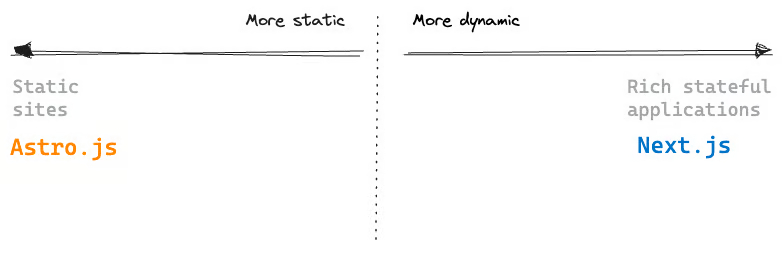

尽管 Astro 仍然是静态网站的绝佳选择，但它也努力缩小差距，以创建更多有状态的应用。然而，即使可以在 Astro 中渲染完整的 React 客户端应用，这并不一定意味着你应该这样做。

如果你的网站大部分是静态的并且性能是优先考虑的，可以考虑使用 Astro。如果正在构建一个功能丰富、有状态的应用，Next 可能是更好的选择。

值得注意的是，静态和有状态之间的区别可能并不总是很清楚。完全可以拥有一个混合了两者的应用。最终，框架的选择取决于具体用例和业务要求。


> 更新: 2024-01-09 16:52:16  
> 原文: <https://www.yuque.com/cuggz/feplus/mgfp8q5hu7x32e7k>