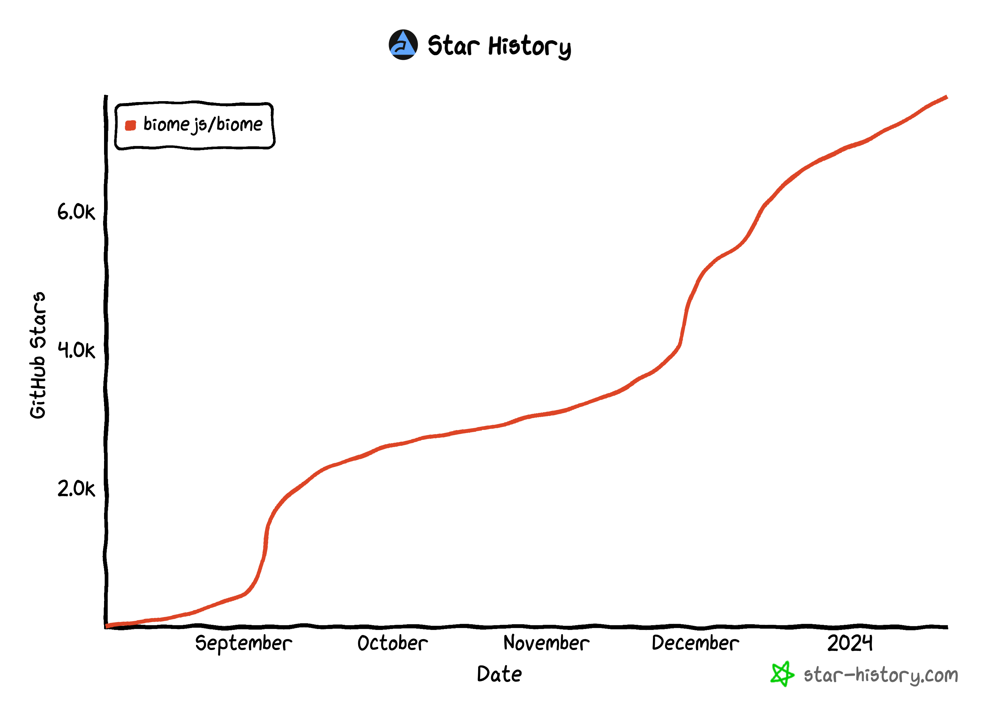
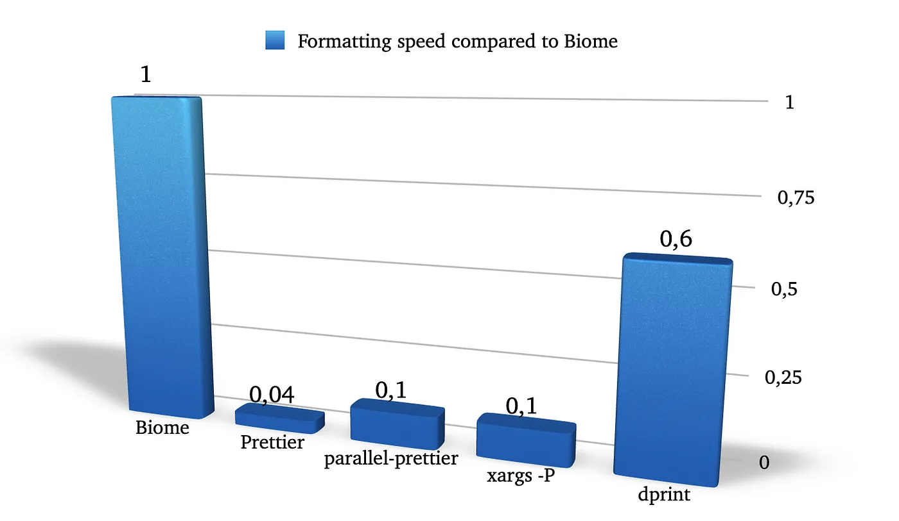
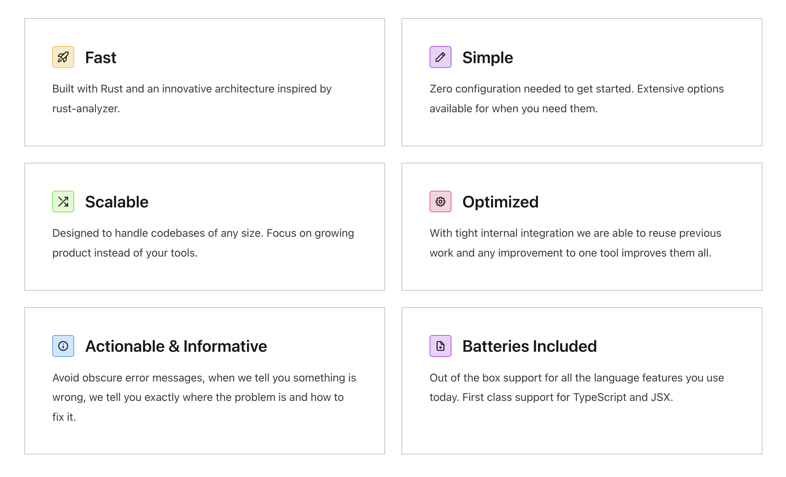
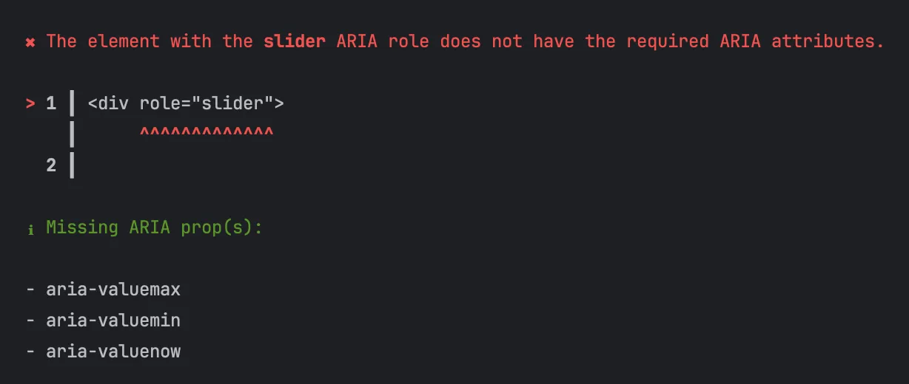
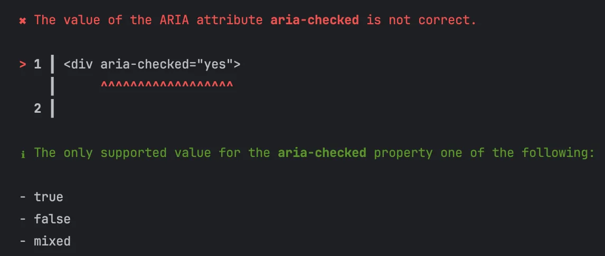
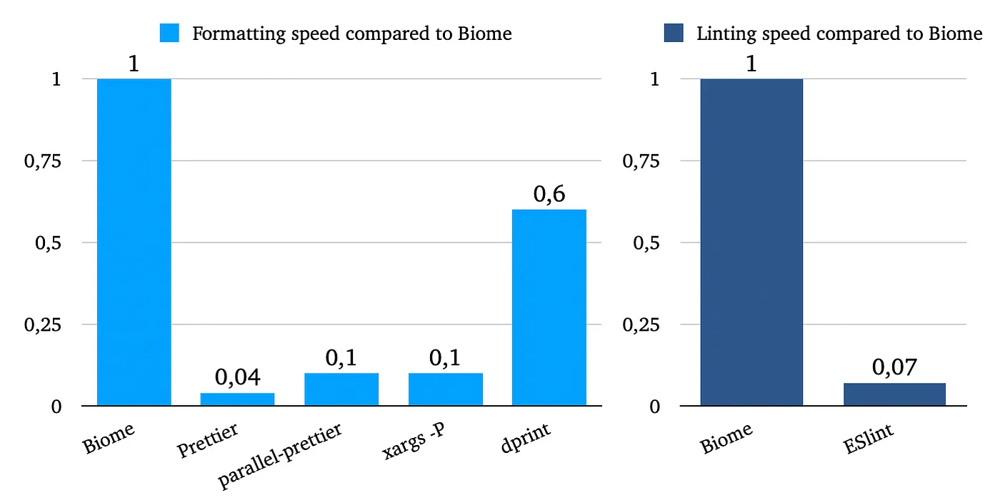

# Biome

<font style="color:rgb(5, 7, 59);background-color:rgb(253, 253, 254);">多年来，Prettier凭借其强大的功能，在开发者中赢得了广泛的赞誉，成为了格式化JavaScript、TypeScript、JSON等多种代码的首选工具。然而，随着前端项目的日益庞大和复杂，Prettier在性能上的不足逐渐凸显。幸运的是，一款新兴的开源Web开发工具链—— </font>**<font style="color:rgb(5, 7, 59);background-color:rgb(253, 253, 254);">Biome</font>**<font style="color:rgb(5, 7, 59);background-color:rgb(253, 253, 254);"> 应运而生。它融合了更高效的格式器和代码检查器，成功解决了这一性能瓶颈。</font>



<font style="color:rgb(5, 7, 59);background-color:rgb(253, 253, 254);">Biome 以 Rust 为基石，充分利用了Rust语言的速度和效率优势，从而在性能上实现了对Prettier的显著超越。值得一提的是，在最近一场由Prettier创始人亲自发起的性能挑战赛中，Biome团队使用Rust成功重构了Prettier，充分展现了其在代码优化和性能提升方面的卓越能力。</font>

<font style="color:rgb(5, 7, 59);background-color:rgb(253, 253, 254);"></font>

<font style="color:rgb(5, 7, 59);background-color:rgb(253, 253, 254);">作为一款集成了代码检查器和格式器的全能工具，Biome堪称基于Rust的ESLint与Prettier的完美结合。它为开发者提供了极致的便捷与高效，让代码开发变得更加轻松、流畅。</font>



## 基本使用

Biome是一款集代码分析、格式化和检查于一体的强大工具，具有来自 ESLint、TypeScript ESLint 和其他来源的 190 多个规则，格式化程序现在与Prettier 的**兼容性超过 96%**。只需一个简单的`check`命令，就能轻松完成代码的检查与格式化，无需在多个工具之间切换。

```javascript
npx @biomejs/biome check --apply 
```

我发现Biome的代码检查器相较于 Prettier 更为前瞻，它能够在问题尚处于萌芽状态时就及时发现并处理，从而有效避免了后续可能出现的严重问题。这款检查器能够迅速识别出多种潜在问题，例如未使用的变量、括号位置错误等，使得我们能够以更高的效率解决这些问题，进而让代码更加清晰有条理。

```javascript
complexity/useFlatMap.js:2:1 lint/complexity/useFlatMap  FIXABLE  ━━━━━━━━━━━━━━━━━━━━━━━━━━━━━━━━━━

  ✖ The call chain .map().flat() can be replaced with a single .flatMap() call.

    1 │ const array = ["split", "the text", "into words"];
  > 2 │ array.map(sentence => sentence.split(' ')).flat();
      │ ^^^^^^^^^^^^^^^^^^^^^^^^^^^^^^^^^^^^^^^^^^^^^^^^^
    3 │ 

  ℹ Safe fix: Replace the chain with .flatMap().

    1 1 │   const array = ["split", "the text", "into words"];
    2   │ - array.map(sentence·=>·sentence.split('·')).flat();
      2 │ + array.flatMap(sentence·=>·sentence.split('·'));
    3 3 │   
```

## 核心优势

* **速度与效率**：凭借基于Rust语言的构建，Biome展现出无与伦比的性能，为开发者带来极速的代码处理体验。
* **简洁易用**：Biome省去了繁杂的配置步骤，让开发者能够立即上手。同时，它也提供了丰富的选项，支持根据个人偏好进行细致调整。
* **强大扩展性**：无论项目规模大小，Biome都能轻松应对，保持一致的高性能表现，满足各种复杂代码库的需求。
* **IDE完美集成**：Biome与主流IDE和代码编辑器如VS Code、IntelliJ IDEA等无缝集成，同时支持通过插件和钩子进行功能扩展，为开发者打造顺畅的编码环境。
* **精准错误诊断**：Biome提供详尽且具有上下文的错误报告，为开发者指明问题所在，助力快速定位并解决各类编码难题。



## 无障碍检查

在当今的Web开发领域，对HTML进行无障碍检查已变得越来越重要。Biome在这方面表现出色，它能够准确地识别出可访问性问题，并提供简明扼要的错误提示以及相应的解决方案。下面来看两个例子。



Biome 精确地指出了在`div`元素中需要修复的问题。在上面的例子中，当发现`role="slider"`的不当使用时，Biome清晰地指明了应如何修正。



对于上面的例子，Biome 提供了修复的解决方案。这使得在开发过程中更容易识别和解决问题。

## 性能测试

Biome 建立了一个专门的存储库，用于执行与Prettier和parallel-prettier的对比基准测试。这些基准测试聚焦于不同规模和复杂度的JavaScript及TypeScript文件的格式化过程，以全面评估 Biome 的性能表现。



**测试结果：**

* 格式化性能：
  * Biome 比 Prettier 快约 25 倍。
  * Biome 比 parallel-prettier 快约 20 倍。
  * Biome 比 xargs-P1 快约 20 倍。
  * Biome 比 dprint 快约 1.5-2 倍。
  * 即使在单线程模式下，Biome 的速度也大约是 Prettier 的 7 倍。
* Linting 性能：
  * Biome 的 Linting 速度大约是 ESLint 的 15 倍。
  * 在单线程模式下，Biome 的 Linting 效率也高出 ESLint 约 4 倍。

<font style="color:rgb(5, 7, 59);background-color:rgb(253, 253, 254);">显然，Biome在格式化和linting方面的性能均显著优于Prettier和Eslint。</font>

* <font style="color:rgb(5, 7, 59);background-color:rgb(253, 253, 254);">在格式化器速度上，Biome展现出了惊人的效率。尽管Prettier有望通过优化提升其速度，尤其在单线程环境下，但Biome凭借其原生实现的优势，依旧能够保持领先地位，为开发者带来更为流畅的体验。</font>
* <font style="color:rgb(5, 7, 59);background-color:rgb(253, 253, 254);">在linting工具方面，尽管Biome已经表现出色，但在构建语义模型、生成控制流图以及匹配查询等关键环节上，仍存在进一步优化的可能。此外，针对代码修复的差异计算成本较高的问题，Biome在这方面仍需改进，有时可能需要长达3秒的处理时间，这也为未来版本的优化指明了方向。</font>

> 注意：
>
> * 基于 MacBook Pro (13-inch, M1, 2020) 进行测试。
> * 多线程基准测试的速度提升可能因硬件配置和使用环境的不同而有显著变化。例如，在配备 10 个内核的 M1 Max 芯片上，Biome 的速度甚至可以比 Prettier 快 100 倍。

## <font style="color:rgb(5, 7, 59);">是否要切换到 Biome？</font>

<font style="color:rgb(5, 7, 59);background-color:rgb(253, 253, 254);">尽管 Biome 以其出色的速度崭露头角，但作为一个早期开发阶段的项目，它在某些方面仍存在局限。</font>

<font style="color:rgb(5, 7, 59);background-color:rgb(253, 253, 254);"></font>

<font style="color:rgb(5, 7, 59);background-color:rgb(253, 253, 254);">比如，Biome 在类型检查 lint 规则方面的覆盖不如 ESLint 全面。基于Rust的linter能够快速识别语法错误和常见样式问题，但在涉及依赖</font>**<font style="color:rgb(5, 7, 59);background-color:rgb(253, 253, 254);">类型信息</font>**<font style="color:rgb(5, 7, 59);background-color:rgb(253, 253, 254);">的问题时，它可能会力不从心。相比之下，ESLint 与 typescript-eslint 的结合提供了更强大的类型检查功能。</font>

<font style="color:rgb(5, 7, 59);background-color:rgb(253, 253, 254);"></font>

<font style="color:rgb(5, 7, 59);background-color:rgb(253, 253, 254);">截至 2024 年 1 月，Biome 已经集成了 64 条 typescript-eslint 规则，但这仍然只是整个 typescript-eslint 规则集的一部分。例如，与 typescript-eslint 相比：</font>

* <font style="color:rgb(5, 7, 59);background-color:rgb(253, 253, 254);">Biome 并未包含“prefer-readonly”规则。该规则的作用在于，当私有成员在构造函数外未被修改时，强制将其标记为只读，以确保数据的不变性。这种规则对于维护数据的完整性和减少意外的状态变更至关重要。</font>
* <font style="color:rgb(5, 7, 59);background-color:rgb(253, 253, 254);">Biome 也缺少了“explicit-function-return-type”规则。按照这一规则，所有函数都必须明确声明其返回类型，无论其是否总是返回同一类型。这种明确性有助于增强代码的类型安全性和可读性，使得开发者能够清晰理解函数的预期返回值。</font>

<font style="color:rgb(5, 7, 59);background-color:rgb(253, 253, 254);"></font>

<font style="color:rgb(5, 7, 59);">还有一些 Biome 当前尚未包含的规则，但值得注意的是，Biome仍在积极开发中，并且其规则库也在不断扩展中。</font>

<font style="color:rgb(5, 7, 59);"></font>

<font style="color:rgb(5, 7, 59);">在选择工具时，应该基于项目的具体需求进行权衡。如果对性能有严格要求，并且愿意在 typescript-eslint 规则方面做出一些妥协，那么 Biome 可能是一个值得考虑的选择。然而，如果项目需要全面的类型检查功能，那么继续使用 Prettier 和 ESLint 可能是更稳妥的选择，同时可以密切关注 Biome 的后续发展，以便在将来做出更合适的选择。</font>

<font style="color:rgb(5, 7, 59);background-color:rgb(253, 253, 254);">与此同时，Prettier 也在不断优化其性能。未来，Prettier有望通过改进解析引擎、AST（抽象语法树）表示、空白处理以及利用硬件加速技术等方式，实现显著的速度提升。因此，如果对Prettier的表现感到满意，继续沿用它可能是一个不错的选择。</font>

## <font style="color:rgb(5, 7, 59);background-color:rgb(253, 253, 254);">小结</font>

<font style="color:rgb(5, 7, 59);">随着 Biome 的不断更新和完善，它在优化Web应用开发方面展现出了巨大的潜力。其卓越的性能表现、出色的兼容性以及以用户体验为核心的易用性设计，为开发者提供了一个极具吸引力的解决方案。展望未来，我坚信Biome将有望在Web开发领域确立其作为标准工具链的重要地位。</font>


> 更新: 2024-02-24 16:16:42  
> 原文: <https://www.yuque.com/cuggz/feplus/dbc7qlk5l5m6cypn>