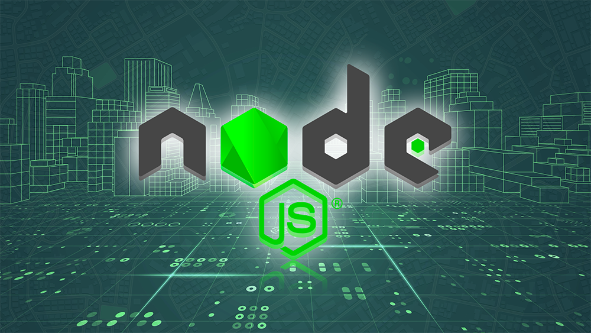
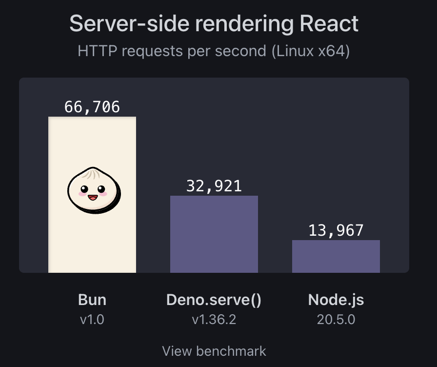
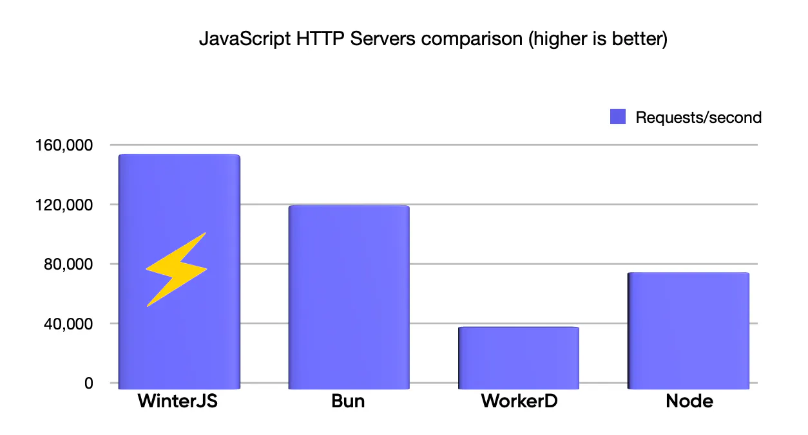
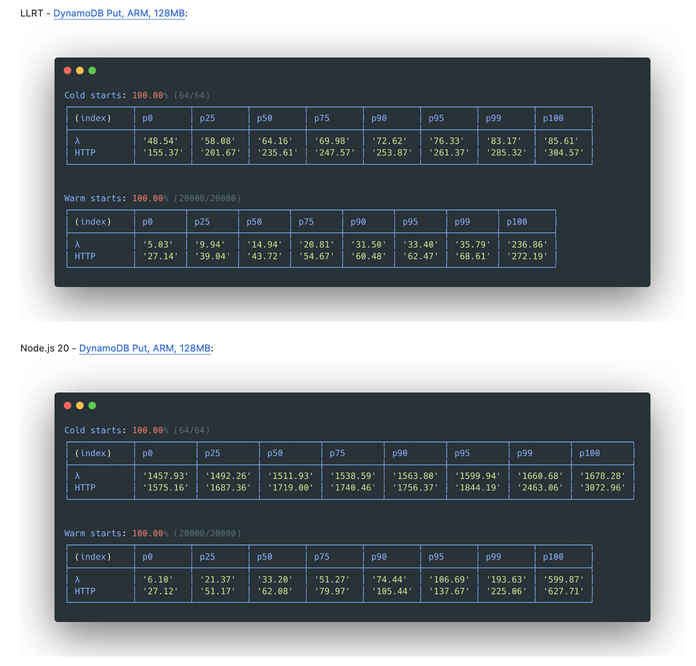

# JS 运行时

在前端技术日新月异的今天，新的 JavaScript 运行时环境不断涌现，它们为开发者提供了更多的选择和可能性。近期，诸如亚马逊的 LLRT 和 WinterJS 等新型运行时环境的发布，进一步丰富了 JavaScript 运行时的生态。本文将对现有的 JavaScript 运行时进行盘点，探讨它们各自的用途、优势以及可能存在的不足之处。

> JavaScript 运行时是执行 JavaScript 代码的环境或平台。它负责解析和执行 JavaScript 代码，提供所需的功能和接口，以便在特定的操作系统或设备上运行。
>

## Node.js
Node.js 是一个基于 Google V8 引擎的 JavaScript 运行时环境，也是目前使用最多的 JavaScript 运行时。它允许开发者在服务端使用 JavaScript 进行编程，从而实现了全栈 JavaScript 的开发模式。Node.js 的出现，极大地推动了 JavaScript 在服务端的应用，并且改变了许多传统的 Web 开发模式。

以下是 Node.js 的一些主要特点：

+ **非阻塞 I/O**：Node.js 采用了非阻塞 I/O 模型，使其在处理高并发请求时具有出色的性能。这意味着 Node.js 可以同时处理多个请求，而不会像传统的阻塞模型那样等待一个请求处理完成后再处理下一个请求。
+ **事件驱动**：Node.js 的事件驱动架构使其能够高效地处理大量并发连接。
+ **单线程**：尽管 Node.js 是单线程的，但由于其非阻塞 I/O 和事件驱动的特性，它仍然能够高效地处理大量并发请求。当然，这也意味着开发者需要避免在 Node.js 中执行 CPU 密集型任务，以免阻塞事件循环。
+ **跨平台**：Node.js 可以在多种操作系统上运行，包括 Windows、Linux 和 macOS 等。这使得开发者可以灵活地选择适合自己的开发环境。
+ **丰富的生态系统**：Node.js 拥有一个庞大的开源社区和丰富的生态系统，提供了大量的第三方模块和工具，可以方便地实现各种功能。
+ **用途广泛：** Node.js 适用于构建各种类型的应用，包括 Web 服务器、API 服务器、实时应用程序（如聊天应用）、命令行工具等。

Node.js 存在以下几个问题：

+ **安全性问题**：Node.js 的默认安全设置相对较为宽松，这可能增加在处理敏感数据或执行未验证代码时的安全风险。虽然可以通过额外的安全措施进行增强，但这增加了开发者的负担，并可能引入潜在的配置错误。
+ **TypeScript 支持不足**：Node.js 对于 TypeScript 的支持相对较弱，需要额外的配置和工具链来实现。这增加了开发复杂性和维护成本，尤其是对于那些倾向于使用 TypeScript 的开发者。
+ **模块系统兼容性挑战**：Node.js 主要使用 CommonJS 模块系统，而现代 JavaScript 开发中越来越倾向于使用 ES 模块。尽管 Node.js 已经开始逐步支持 ES 模块，但仍然存在与 CommonJS 模块之间的兼容性问题，这可能导致在项目中混合使用不同模块系统时的混乱和复杂性。
+ **性能瓶颈**：Node.js 的单线程模型在处理高并发 I/O 操作时表现出色，但它在处理 CPU 密集型任务时可能受到限制。对于需要大量计算资源的任务，Node.js 的性能可能不如多线程或编译型语言。

## Deno
Deno 最初由 Node.js 的原始创建者 Ryan Dahl 于 2018 年创建，旨在解决他认为 Node.js 中存在的一些问题，比如性能、安全性。它专注于安全性、现代 JavaScript 实践和开发人员体验。基于 V8 JavaScript 引擎构建并用 Rust 编写。

Deno的核心特性包括：

+ **默认安全**：Deno 默认没有文件、网络或环境访问权限，除非用户明确授权。这种设计使得Deno在处理敏感数据或执行不受信任的代码时更为安全。
+ **支持TypeScript**：Deno 开箱即用地支持TypeScript，无需额外的配置或工具链。这使得开发者能够直接编写TypeScript代码，并在Deno环境中执行。。
+ **Node生态兼容**：Deno 向后兼容 Node.js 的内置API和 npm 上超过200万个模块，这使得开发者能够更容易地迁移或集成现有的Node.js代码库。

与 Node.js 相比，Deno 具有更全面的功能。它对 Web API 和现代标准有很好的支持，并且还支持大多数 NPM 包。Deno 还提供了出色的开发体验，特别是如果使用 TypeScript，它是开箱即用的。Deno 还具有内置 linting、代码格式化程序等优势，节省一些配置和引导时间。如果你倾向于开箱即用的设置，只需启动编辑器，创建一个main.ts文件，然后就可以开始快乐编码了！

除此之外，Deno 还拥有自己的工具集，如分布式数据库 Deno KV、JavaScript 注册表 JSR、分布式部署系统Deno Deploy、专为边缘设计的Web 框架 Fresh 等！

Deno 作为一个相对较新的运行时环境，仍然需要时间来建立其生态系统和社区。与已经拥有庞大社区和丰富生态的Node.js相比，Deno的社区规模和生态发展尚显不足，这限制了其普及的速度。

## Bun
Bun是一个现代化的JavaScript运行时，它围绕WebKit的JavaScriptCore构建，而非像Node.js或Deno那样基于V8引擎。Bun 被设计为 Node.js 的更快、更精简、更现代的替代品，旨在成为一个全功能的运行时环境和工具包，重点关注速度、打包、测试和与 Node.js 包的兼容性。最大的优势之一是它的性能。事实证明，Bun 比 Node.js 和 Deno 都要快。如果 Bun 能够完成这些目标，那么它将成为一个非常有吸引力的选择。

Bun具有以下特性：

+ **一体化工具包**：Bun不仅仅是一个运行时环境，它还集成了Web API、打包工具、测试框架等多种功能，形成了一个完整且一体化的工具包。这使得开发者能够在一个统一的平台上进行项目的开发、构建、测试和调试，提高了工作效率。
+ **基于 JavaScriptCore**：Bun 基于 Apple Safari 浏览器的引擎 JavaScriptCore，具有快速的启动时间和更好的内存使用效率。
+ **无外部依赖**：与 Node.js 不同，Bun 不依赖于 npm 或外部依赖项。它具有内置的标准库，提供了多种协议和模块的功能，包括环境变量、HTTP、WebSocket、文件系统等。
+ **内置 TypeScript 支持**：Bun 提供了对 TypeScript 的内置支持。它会内部转译每个 JavaScript 或 TypeScript 源文件，使得可以直接运行 TypeScript 文件，无需额外的配置或转译。
+ **强大的命令行界面工具**：Bun 配备了强大的命令行界面工具（CLI），可以使用简单的命令来运行、格式化、检查、测试和打包代码。

值得一提的是，Bun 目前尚不支持在 Windows 系统上使用，这让许多 Windows 用户感到失望。官方对于 Windows 版本的发布多次推迟，最新的测试进度显示，Bun的Windows版本已经完成了94%的开发工作，这意味着它离正式发布可能已经不远了。

## WinterJS
WinterJS 是一个兼容 WinterCG 的运行时环境，它使用 Rust 编写，并利用 SpiderMonkey 引擎和 Tokio 处理 HTTP 请求。WinterJs 的速度将远超 Bun 和 Node。它还支持 Next.js、React Server Components、Svelte 以及更多功能。

WinterJS 的特性如下：

+ **与Cloudflare无缝配合**：WinterJS被设计为与Cloudflare的工具（如Workers和Pages）协同工作，有助于在全球范围内加速网站的运行。
+ **极速性能**：WinterJS在单个CPU核心上能够达到每秒超过58,000个请求，几乎比类似的工具（如Deno和Bun）快2倍。这种性能的提升主要得益于它使用的Wasmer技术，使其几乎能像直接在本地计算机上运行应用程序一样快速。
+ **WebAssembly兼容性**：WinterJS支持直接与WebAssembly模块一起使用，这使得开发者能够利用诸如Rust之类的语言来加速应用程序的特定部分，从而获得更高的性能。
+ **适用于React Server Components**：WinterJS可以与React Server Components配合使用，使得服务器可以运行React应用，从而减少了在浏览器中运行JavaScript的需求，进一步提升了网站的速度。

## LLRT
LLRT（Low Latency Runtime，低延迟运行时）是亚马逊开源的一个轻量级的 JavaScript 运行时，其主要目标是为 Serverless 应用提供显著更快的启动时间和改进的效率。与在 AWS Lambda 上运行的其他JavaScript运行时相比，LLRT提供高达 10 倍以上的启动速度，总体成本降低高达2倍。

LLRT 具有以下特点：

+ **更快的启动时间**：LLRT 的启动速度比其他在 AWS Lambda 上运行的 JavaScript 运行时快 10 倍以上。这种速度优势对于需要快速响应传入请求的 Serverless 函数至关重要。
+ **节省成本**：LLRT 的整体成本比其他运行时低 2 倍以上。通过优化内存使用和减少启动时间，它有助于最小化运行无 Serverless 工作负载的成本。
+ **基于 Rust 构建**：LLRT 使用 Rust 实现，这是一种系统编程语言，以其性能、安全性和内存效率而闻名。
+ **QuickJS 引擎**：LLRT 使用 QuickJS JavaScript 引擎。QuickJS 是一个小巧且可嵌入的用 C 语言编写的引擎，非常适合像 LLRT 这样的轻量级运行时。

与像 Node.js、Bun 或 Deno 这样的通用运行时不同，**LLRT 专注于 Serverless 环境的需求**。以下是一些关键区别：

+ **无 JIT 编译器**：与 Node.js 依赖即时（JIT）编译不同，LLRT 不包含 JIT 编译器。这种设计选择简化了系统复杂性，减少了运行时大小，同时节省了 CPU 和内存资源。
+ **打包依赖项**：为了实现加速，LLRT 要求开发者将他们的代码和依赖项打包到一个单独的 .js 文件中。这消除了模块解析期间的文件系统查找，这是其他运行时中常见的瓶颈。
+ **预编译 AWS SDK**：LLRT 将 AWS SDK 的部分内容预打包和预编译为字节码。这种方法进一步有助于加快应用程序的启动时间。 

LLRT 可以用于以下情况：

+ **数据转换**：LLRT 在需要低延迟的数据处理任务中表现出色。
+ **实时处理**：对于实时工作负载，例如事件驱动处理或流式数据，LLRT 的快速启动时间是无价的。
+ **AWS 服务集成**：在与 AWS 服务如 DynamoDB 或 S3 集成时，LLRT 确保快速响应。

## 总结
+ **Node.js**：Node.js是基于Google V8引擎的JavaScript运行时，以非阻塞I/O和事件驱动架构为特色，实现全栈开发。它跨平台且拥有丰富的生态系统，但也面临安全性、TypeScript支持和性能等挑战。
+ **Deno**：Deno是Ryan Dahl创建的JavaScript运行时，强调安全性和现代实践。它默认安全，内置TypeScript支持，并与Node.js兼容。然而，其社区和生态系统尚处于发展阶段。
+ **Bun**：Bun是一个基于WebKit JavaScriptCore构建的现代化JavaScript运行时，旨在提供卓越的性能和一体化的工具包。它无外部依赖，内置TypeScript支持，并专注于速度、打包、测试以及与Node.js包的兼容性。
+ **WinterJS**：WinterJS是一个以速度为傲的JavaScript Web服务器运行时，与Cloudflare无缝配合，支持React Server Components，并擅长处理高并发和WebAssembly模块。它的目标是提供快速且功能强大的Web应用程序解决方案。
+ **LLRT**：LLRT是亚马逊开源的轻量级JavaScript运行时，专为Serverless应用设计。它基于Rust和QuickJS引擎构建，以快速启动时间和成本节省为优势，适用于Serverless环境的需求，要求预编译和打包依赖项。

> 更新: 2024-06-07 17:15:04  
> 原文: <https://www.yuque.com/cuggz/feplus/co2zzzliu2milw73>