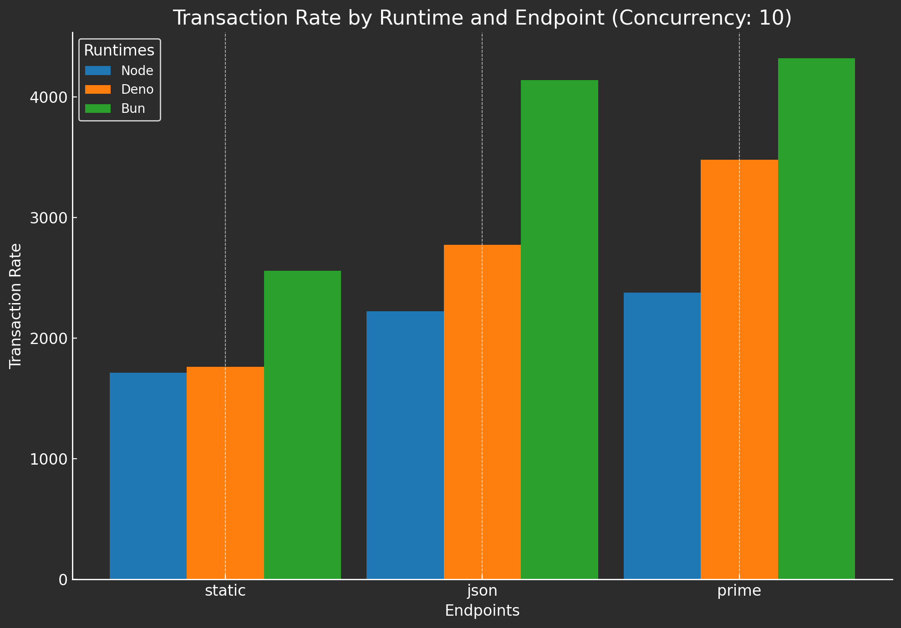
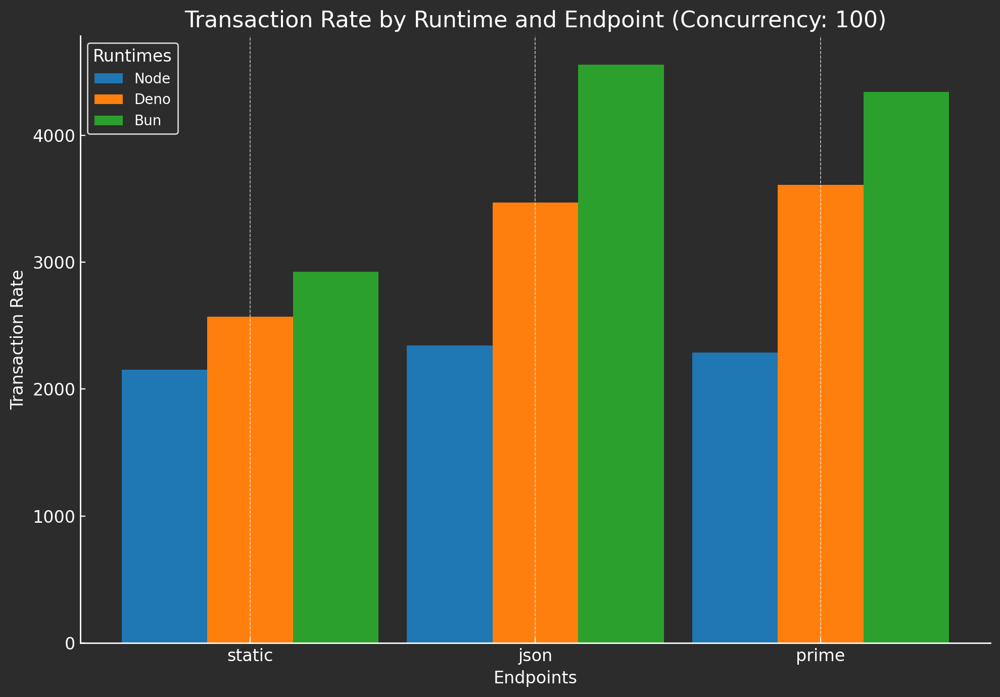
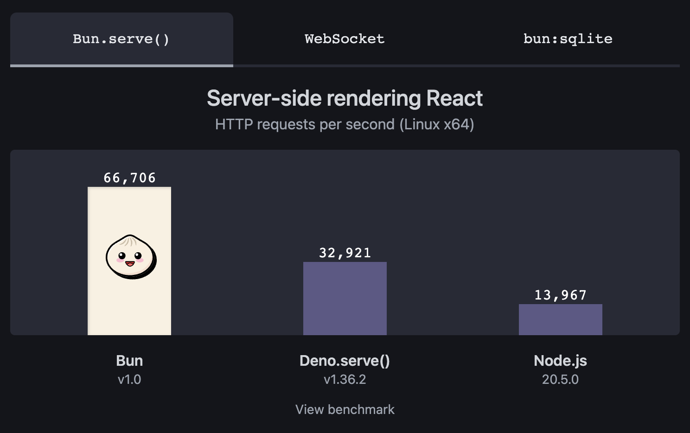
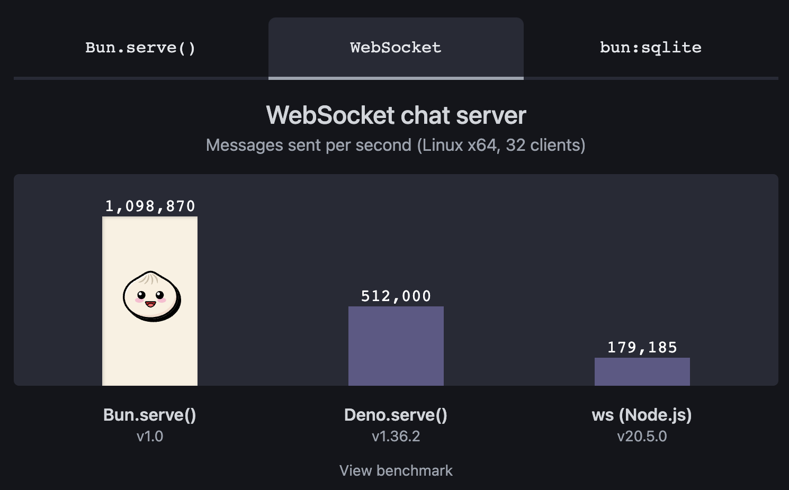
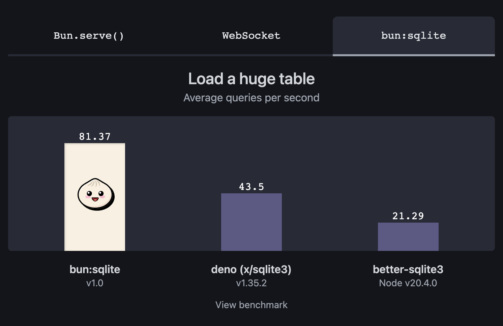
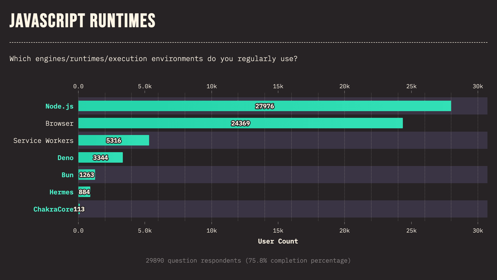

# Node.js vs Bun vs Deno

JavaScript 运行时是指**执行 JavaScript 代码的环境**。它提供了一组核心功能，包括解析和执行 JavaScript 代码、管理变量和对象、处理事件等。目前，JavaScript 生态中有三大运行时，包括 Node.js、Bun、Deno。老牌运行时 Node.js 的霸主地位正受到 Deno 和 Bun 的挑战，下面就来看看这三个 JS 运行时有什么区别！


## JS 运行时概述

### Node.js

Node.js 在 2023 年被 Stack Overflow 开发者评为最受欢迎的 Web 技术。Node.js 于 2009 年推出，允许开发人员在浏览器之外使用 JavaScript，彻底改变了服务端编程。它拥有强大的生态系统、庞大的社区，并且经过验证且稳定。为大型应用程序提供 LTS 构建。基于 V8 JavaScript 引擎构建。

多年来，Node.js 一直是服务端 JavaScript 开发的支柱，通过第三方工具支持了无数功能。其提供了巨大的功能和灵活性。丰富的文档、教程和社区支持使开发者可以更轻松地克服挑战。如果考虑内置工具和与 Web API 的兼容性，它是落后于竞争对手的。

从历史上看，Node.js 因其安全方法（尤其是在包方面）而受到批评。然而，社区和维护者已经显着改善了这一方面。权限模型已经在 Node.js v20 中实现，这使 Node.js 更加安全。

### Deno

Deno 最初由 Node.js 的原始创建者 Ryan Dahl 于 2018 年创建，旨在解决他认为 Node.js 中存在的一些问题，比如性能、安全性。它专注于安全性、现代 JavaScript 实践和开发人员体验。基于 V8 JavaScript 引擎构建并用 Rust 编写。

与 Node.js 相比，Deno 具有更全面的功能。它对 Web API 和现代标准有很好的支持，并且还支持大多数 NPM 包。Deno 还提供了出色的开发体验，特别是如果使用 TypeScript，它是开箱即用的。Deno 还具有内置 linting、代码格式化程序等优势，节省一些配置和引导时间。如果你倾向于开箱即用的设置，只需启动编辑器，创建一个`main.ts`文件，然后就可以开始快乐编码了！

### Bun

Bun 是 2021 年发布的 JavaScript 运行时，它被设计为 Node.js 的更快、更精简、更现代的替代品。它构建在 JavaScript Core 和 Zig 之上。旨在成为一个全功能的运行时环境和工具包，重点关注速度、打包、测试和与 Node.js 包的兼容性。最大的优势之一是它的性能。事实证明，Bun 比 Node.js 和 Deno 都要快。如果Bun能够完成这些目标，那么它将成为一个非常有吸引力的选择。

Bun 的核心卖点是它的**性能**，其提供了许多基准测试，显示出令人惊叹的速度。使用 Bun 作为包管理器比使用标准 NPM 命令要快得多。在现实应用中，尤其是 Web 应用，性能差异可能不像基准测试中那么显着。

Bun 优先考虑简单性和速度。凭借其内置的包管理器，以及与 Node.js 相比改进的开发体验，开发人员可以快速入门，而无需遇到其他运行时可能带来的初始设置障碍。

## 功能对比

首先来看看这三个运行时的功能对比，图示如下：

* ✅：内置，指本身提供的功能或特性，无需额外安装或引入其他库或框架。
* 📦：通过第三方提供的库、框架或工具支持。
* ❌：不可用。
* 💡：实验特性。

### 运行时特性

| **特性** | **Deno** | **Bun** | **Node.js** |
| :---: | :---: | :---: | :---: |
| 升级工具 | ✅ | ✅ | ❌ |
| 单个可执行文件安装 | ✅ | ✅ | ❌ |
| LSP | ✅ | ❌ | ❌ |
| REPL | ✅ | 📦 | ✅ |
| 编译器 | ✅ | ✅ | ❌ |
| 持久存储驱动程序 | ✅ | ✅ | ❌ |

* **升级工具**：更新和管理项目所依赖的软件包和库。
* **单个可执行文件安装**：将所有程序文件和依赖项打包成一个单独的可执行文件，以便用户可以简单地通过运行该文件进行安装和部署。
* **LSP**（Language Server Protocol，语言服务器协议）：一种用于提供代码编辑器功能的通信协议。它使得编辑器可以与语言服务器进行交互，从而获得代码补全、跳转到定义、重构等功能。
* **REPL**（Read-Eval-Print Loop，读取-求值-输出循环）：一种交互式编程环境，在其中可以逐行输入代码，并立即执行并输出结果。REPL通常用于快速测试和验证代码，无需编译和构建过程。
* **编译器**：是一种将高级编程语言源代码转换为低级机器代码或字节码的工具。编译器将代码进行词法分析、语法分析和转换等处理，最终生成可执行文件或中间代码，以供计算机执行。
* **持久存储驱动程序**：一种软件组件或接口，用于与持久化存储介质进行交互和管理数据的读取和写入操作。它提供了对持久化数据的访问和操作的接口。

### 测试

| **特性** | **Deno** | **Bun** | **Node.js** |
| :---: | :---: | :---: | :---: |
| 基准测试运行器 | ✅ | 💡 | 💡 |
| 测试运行器 | ✅ | ✅ | ✅ |

* **基准测试运行器**：用于运行基准测试的工具或框架。基准测试用于评估代码的性能和效率，通常通过执行一系列测试用例并测量其执行时间来进行。
* **测试运行器**：用于管理和运行测试套件的工具或框架。它可以自动化执行单元测试、集成测试或端到端测试，并提供结果报告和日志记录等功能。

### 操作系统/平台支持

| **特性** | **Deno** | **Bun** | **Node.js** |
| :---: | :---: | :---: | :---: |
| Linux | ✅ | ✅ | ✅ |
| Mac OS | ✅ | ✅ | ✅ |
| Windows | ✅ | 💡 | ✅ |
| ARM64 | 💡 | 💡 | ✅ |

### 包管理器

| **特性** | **Deno** | **Bun** | **Node.js** |
| :---: | :---: | :---: | :---: |
| package.json 兼容性 | ✅ | ✅ | ✅ |
| NPM 取消选择 | ✅ | ❌ | ❌ |
| 内置包管理器 | 📦 | ✅ | 📦 |
| URL 引入 | ✅ | ❌ | ❌ |

* **package.json 兼容性**：指项目中的 package.json 文件与特定工具、平台或环境的兼容性。package.json 是用于描述和管理项目依赖和配置的文件。
* **NPM 取消选择**：在使用 NPM作为包管理器时，选择不使用某个特定的功能或设置。这可能是根据项目需求或个人偏好，有意选择不采用某种功能或行为。
* **内置包管理器**：集成在特定开发环境或平台中的默认包管理器。这个包管理器通常提供了一套工具和命令，用于下载、安装、更新和管理项目的依赖项。
* **URL 引入**：通过提供远程资源的 URL 地址来导入模块或库的功能。使用 URL Imports 可以从远程位置直接引入代码或资源，而无需事先下载和安装。

### Web API 兼容性

| **特性** | **Deno** | **Bun** | **Node.js** |
| :---: | :---: | :---: | :---: |
| Fetch | ✅ | ✅ | ✅ |
| Web Crypto | ✅ | ✅ | ✅ |
| Web Storage | ✅ | ❌ | ❌ |
| WebSocket | ✅ | 📦 | ❌ |
| Web Workers | ✅ | ✅ | ❌ |
| Import Maps | ✅ | ❌ | ❌ |

* **Fetch（Fetch）**：一种用于发起网络请求的现代 JavaScript API。它提供了一种更简洁和强大的方式来进行数据请求和响应处理，取代了传统的 XMLHttpRequest 方法。
* **Web Crypto（Web 加密）**：一组用于在 Web 浏览器中执行加密操作的 API。它提供了一种安全的方式来处理密码学操作，例如生成随机数、进行加密和解密等。
* **Web Storage（Web 存储）**：用于在客户端浏览器中存储和检索数据的 API。它提供了本地存储和会话存储两种机制，分别用于长期保持数据和临时存储数据。
* **WebSocket**：一种在客户端和服务器之间实现双向通信的协议。通过 WebSocket，可以建立持久性的连接，并实现实时数据传输和交互。
* **Web Workers**：一种在浏览器中使用多线程进行并行计算的机制。Web Workers 允许在后台运行脚本，以避免主线程的阻塞，并提高 Web 应用的响应性能。
* **Import Maps（导入映射）**：一种在 JavaScript 模块加载器中配置模块路径和别名的功能。导入映射可以简化模块导入的过程，并提供更灵活的方式来管理模块依赖。

### 安全性

| **特性** | **Deno** | **Bun** | **Node.js** |
| :---: | :---: | :---: | :---: |
| 权限模型 | ✅ | ❌ | ✅ |
| 可信赖的依赖项 | ❌ | ✅ | ❌ |

* **权限模型**：应用中用于管理用户或应用对资源和功能的访问权限的系统。权限模型定义了不同级别的权限和许可规则，并确保只有被授权的实体才能执行特定操作。
* **可信赖的依赖项**：开发中使用的第三方库或模块，已经得到验证和认可，可以放心地被项目所使用。可信赖的依赖项通常具有良好的安全性、稳定性和质量保证。

### 开发工具

| **特性** | **Deno** | **Bun** | **Node.js** |
| :---: | :---: | :---: | :---: |
| 代码格式化工具 | ✅ | 📦 | 📦 |
| 静态代码分析工具 | ✅ | 📦 | 📦 |
| 类型检查工具 | ✅ | 📦 | 📦 |
| 代码压缩工具 | 📦 | ✅ | 📦 |
| 代码打包工具 | ✅ | ✅ | 📦 |
| 依赖项查看器 | ✅ | 📦 | 📦 |

* **代码格式化工具**：用于自动调整代码的格式，例如缩进、空格和换行符等。通过使用代码格式化工具，可以统一代码样式，提高代码的可读性和一致性。
* **静态代码分析工具**：用于检查源代码中的潜在问题、错误或不良实践。静态代码分析器会对代码进行扫描，并给出相应的提示或警告，帮助开发人员发现并修复问题。
* **类型检查工具**：用于静态检查编程语言中的类型错误。通过类型检查工具，可以在编译或运行前捕获到类型相关的错误，从而提高代码质量和可靠性。
* **代码压缩工具**：用于减小源代码文件的大小。代码压缩工具通常会移除源代码中的空白字符、注释和不必要的字符，从而降低文件大小，并提高加载速度。
* **代码打包工具**：用于将多个模块或文件打包成一个或多个最终部署的文件。通过使用代码打包工具，可以减少网络请求次数，提高前端应用的性能和加载速度。
* **依赖项查看器**：用于查看项目或应用中的各个依赖项之间的关系和依赖情况。依赖项查看器可以帮助开发人员了解项目的依赖结构，以便更好地管理和维护依赖关系。

### 语言支持

| **特性** | **Deno** | **Bun** | **Node.js** |
| :---: | :---: | :---: | :---: |
| TypeScript / TSX | ✅ | ✅ | 📦 |

## 性能对比

接下来看看这三个运行时的网络性能比较。重点关注：静态文件传递、JSON响应和计算密集型任务（素数计算）。

* **静态文件传递**：提供静态资源服务，将服务器上指定目录中的静态文件传递给客户端。
* **JSON响应**：接收客户端请求，生成包含JSON数据的响应并返回给客户端。
* **计算密集型任务**：接收客户端传来的数值，执行大量的CPU计算操作来判断该数是否为质数，并将结果返回给客户端。

为了进行准确的比较，构建了一个自定义的基准测试工具，并使用 Express.js 作为服务端平台。Express.js 是一个很好的选择，因为可以在所有三种运行时中使用完全相同的服务端脚本。源代码可以在 GitHub 上找到：[jsrbench](https://github.com/hexagon/jsrbench)。为了对服务端添加负载，这里使用了 [Siege](https://github.com/JoeDog/siege)，这是一个经过试验和测试的网络服务器基准测试实用工具。

下面是用于基准测试的服务端脚本：

```javascript
import express from "express";

const app = express();

// 使用 BigInt 进行修改，并移除 NaN/Infinity 检查
const checkPrime = function (n) {
  if (n % 1n || n < 2n) return 0;
  if (n == leastFactor(n)) return 1;
  return 0;
};

const leastFactor = function (n) {
  if (n == 0n) return 0;
  if (n % 1n || n * n < 2n) return 1;
  if (n % 2n == 0) return 2;
  if (n % 3n == 0) return 3;
  if (n % 5n == 0) return 5;
  for (let i = 7n; i * i <= n; i += 30n) {
    if (n % i == 0n) return i;
    if (n % (i + 4n) == 0) return i + 4n;
    if (n % (i + 6n) == 0) return i + 6n;
    if (n % (i + 10n) == 0) return i + 10n;
    if (n % (i + 12n) == 0) return i + 12n;
    if (n % (i + 16n) == 0) return i + 16n;
    if (n % (i + 22n) == 0) return i + 22n;
    if (n % (i + 24n) == 0) return i + 24n;
  }
  return n;
};

// 静态资源中间件
app.use("/static", express.static("public"));

// JSON 响应
app.get("/json", (req, res) => {
  res.json({
    message: "Hello, World!",
    number: 5,
    literal: `(${4}+${4})*${21.2}/${2}=${84.8}`,
  });
});

// 模拟 CPU 密集型操作
app.get("/compute-prime", (_req, res) => {
  const toCheck = 263n;
  if (checkPrime(263n)) {
    res.send(`Prime number ${toCheck} is a prime!`);
  } else {
    res.send(`Prime number ${toCheck} is not a prime!`);
  }
});

// 将端点收集到数组中
const endpoints = ["/static/index.html", "/json", "/compute-prime"];

// 通过提供 '0' 自动分配端口
const server = app.listen(0, () => {
  const fullEndpoints = endpoints.map(
    (endpoint) => `http://127.0.0.1:${server.address().port}${endpoint}`,
  );
  console.log(JSON.stringify({
    BENCHMARKABLE_ENDPOINTS: fullEndpoints,
  }));
});
```

#### 10个并发用户（每秒请求数）

| **路径** | **Node.js** | **Deno** | **Bun** |
| :---: | :---: | :---: | :---: |
| 静态文件传递 | 1712.37 | 1761.87 | 2559.35 |
| JSON响应 | 2223.57 | 2772.39 | 4138.38 |
| 计算密集型任务 | 2377.44 | 3480.13 | 4321.48 |



#### 100个并发用户（每秒请求数）

| **路径** | **Node.js** | **Deno** | **Bun** |
| :---: | :---: | :---: | :---: |
| 静态文件传递 | 2153.87 | 2571.72 | 3468.01 |
| JSON响应 | 2344.44 | 3468.01 | 4555.89 |
| 计算密集型任务 | 2286.53 | 3609.09 | 4341.41 |



根据给定的条件和具体的基准测试运行结果：

* Deno 比 Node.js 快大约33%。
* Bun 比 Node.js 快大约73%。

Bun 官方也给出了一个基准测试的数据：

* React 服务端渲染（每秒 HTTP 请求数 （Linux x64））：



* WebSocket 聊天服务器（每秒发送的消息数（Linux x64，32 个客户端））：



* 加载一个巨大的表（每秒平均查询次数）



可以看到， Bun 是 Deno 的速度两倍，是 Node.js 速度的四倍。

## 支持和社区

这三个项目都是开源的，但并非所有项目都完全得到社区的支持。Node.js 由 OpenJS 基金会支持，并且严格以社区和志愿者为基础。Deno 和 Bun 得到了营利性组织和风险投资支持的项目的支持。

Node.js有一个成熟的生态系统和庞大的社区。相比之下，Deno和Bun则较为新颖，遇到问题时可能解决难度更大，但仍然有很多热情的开发者愿意分享相关知识。此外，Deno 1.28 引入了更好的与 npm 包兼容性，使得从Node.js迁移过来的开发者更容易接受。

以下是显示Stack Overflow上每个运行时标记的问题的数量（截至2023年9月）：

| **运行时** | **问题数量** |
| :---: | :---: |
| Node.js | 466762 |
| Deno | 917 |
| Bun | 52 |

如你所见，Node.js相关的问题最多，这也意味着当遇到问题时，更容易得到解决方案。



在 2022 年 State of JavaScript 调查中，有一个问题是关于参与者经常使用哪种运行时，有将近 30000 名受访者回答了这个问题。调查结果显示 Node.js 是遥遥领先的，Deno 得票数约为 5300，Bun 得票数约为 1200。也许我们会在 2023 年看到 Deno 和 Bun 出现一些新的趋势。

官方的Node.js文档包括各种指南、大量的API参考和入门信息。还提供了有关其依赖关系的信息。

Deno 的网站包括一个非常详细的手册，帮助你熟悉运行时并在项目中开始使用它。第三方模块页面很方便，可以了解生态系统中可用的内容。截至 2023 年 8 月，它包含了超过6000 个模块，并提供一些示例代码。

Bun 的主页链接到了其 Discord、文档和GitHub页面。自从它发布以来，文档已经显著改善。现在官方文档中包含了各种主题的信息，例如入门指南、使用打包器和测试运行器以及API参考，甚至还有指南展示如何使用Bun完成常见任务。

## 从 Node.js 迁移到 Deno 或 Bun

用纯 JavaScript 或 TypeScript 编写的代码应该可以在任何运行时无缝运行。但是，如果使用过 Node.js 的特定功能，那么迁移到其他运行时可能会比较困难。

### 从 Node.js 迁移到 Deno

过去，Node.js 模块的兼容性是 Deno 迁移中的一个主要问题。不过，现在只需在导入语句前加上`node:`前缀即可。至于npm包，可以在它们前面加上`npm:`前缀，或者创建一个`deno.js`文件，描述 <code>[import maps](https://deno.land/manual@v1.36.1/basics/import_maps)</code> 以供 Deno 解析它们。

如果正在构建软件包/库，可以查看 [Denoify](https://github.com/garronej/denoify)。这是一个旨在在迁移时自动更改某些文件，并使项目维护更加容易，适用于 npm 和 [deno.land/x](https://deno.land/x) 的项目。

### 从 Node.js 迁移到 Bun

Bun实现了大多数Node-API函数。如果项目较小或仅使用常见函数，可能可以直接将其放入Bun中并开始使用。对于大型项目，可能需要重写代码来解决挑战。

Bun 还具有自己的API。例如，Bun使用自己的API来提供Web文件服务。

```javascript
Bun.serve({
  fetch(req) {
    return new Response("Hello!!!");
  },
  tls: {
    key: Bun.file("./key.pem"),
    cert: Bun.file("./cert.pem"),
  }
});
```

可以看到，迁移到Deno或Bun时，使用它们的原生API意味着代码与在Node.js中使用的代码有所不同。这是在转换现有项目时需要牢记的重要事项，同时在开始新项目时也要考虑到，因为如果遇到在Node.js中不存在的且难以解决的问题，可能会难以回退到Node.js。

## 总结

Bun 显然是速度上的赢家，并且在功能上带来了很多创新。但由于它仍然很新，所以使用它存在风险。

Node.js 的一大优势在于其成熟度和生态系统的规模。其仍然是目前最安全的选择，并久经考验。

与 Node.js 相比， Deno 还具有很多优势，其强大的功能使开发更加顺畅，并且可以轻松构建高质量的复杂项目。它很安全，虽然比 Node.js 更快，但与 Bun 相比，它还是有点慢的。

总的来说，Node.js 仍然是目前最好的选择，Deno 具有很多现代化的功能，值得尝试。如果最关心速度或只是想了解新技术的前沿，那么 Bun 就是你的首选工具。

**<font style="color:rgb(56, 63, 118);"></font>**


> 更新: 2024-01-09 17:00:23  
> 原文: <https://www.yuque.com/cuggz/feplus/owd8ybkmqh4f88nn>