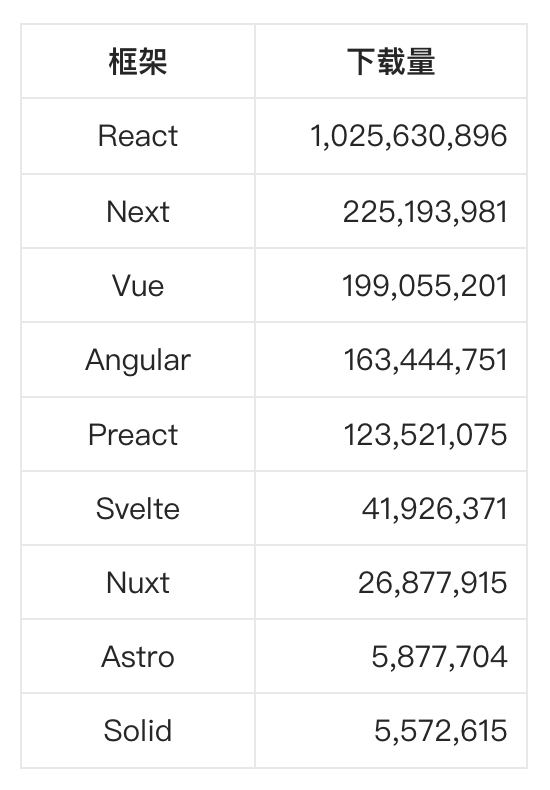

# Preact

最近盘点了 2023 年度热门前端框架的 npm 下载量，发现 Preact 已经跻身前五名，年度下载量高达 1.23 亿次。本文就来看看 Preact 是什么，它和 React 又有何区别！



## Preact 是什么？
Preact 是一个轻量级的前端库，用于构建用户界面（UI），其功能和 React 相似，但体积更小，只有大约 3 KB。Preact 具有与 React 类似的现代 API，因此可以视为 React 的一个快速、轻量级的替代方案。Preact 的核心目标是高性能、轻量级和即时生产，其名称中的"P"代表 performance（性能）。


Preact并非 React 的翻版，两者之间存在显著差异。尽管其中许多差异看似微不足道，但通过preact/compat，可以实现与React的高度兼容。Preact 不追求包含 React 的所有功能，而是致力于保持其代码的简洁和专注。这种策略避免了不必要的复杂性，使得 Preact 更加高效。

## Preact 的起源
Jason Miller，Preact 的创始人，长期致力于为Web创造各种UI框架和模板引擎。然而，他发现始终难以创建一个完全满足他所有需求的完美框架，尤其是在处理 DOM 时遇到诸多挑战。直到他发现了JSX和React，这两个工具完美满足了他对框架的所有期待和需求。为了更深入地理解React的工作原理，Jason决定亲手打造一个与React类似的项目，他坚信通过实践学习能取得更好的效果。


起初，Preact只是一个简单的Codepen文件，但Jason通过持续不断的优化和新功能的添加，使其逐渐成长为能够像React一样渲染大量DOM元素的强大工具。当他在桌面和移动设备上对自己的项目进行速度测试时，结果令人惊喜：Preact的性能几乎与纯JavaScript相当，甚至在某些方面超越了React。


受到这一鼓舞，Jason决定将Preact继续发展下去，并将其打造成为一个开源库。这个库旨在为那些因React的高性能成本而犹豫不决的开发者提供一个替代选择。Preact不仅在功能上与React相近，而且更加轻量级和高效。该库于2015年11月13日首次在GitHub上发布（v2.0.0）。


自那时以来，Preact社区不断发展壮大，吸引了越来越多的用户、贡献者和维护者。如今，Preact已成为一个备受推崇的前端库，为开发者提供了另一种构建高效、现代化用户界面的选择。

## Preact vs React
### 大小
React 功能丰富，其生态系统中预置了众多的实现、功能和函数。然而，这种全面性的代价是相对较大的打包体积。对于那些大量使用第三方库或依赖项的应用来说，这可能会导致初始页面加载时间受到影响。


Preact 因其小巧的体积而备受称赞，从而在运行时提供了更低的资源占用。它聚焦于核心视图库，仅包含如事件处理和差异比较等基础实现。为了更好地优化性能和内存管理，Preact 完全摒弃了 React 中的调试功能和其他冗余特性。这种有针对性的设计策略使得打包后的体积大幅减少，同时确保了更高效的内存使用。


具体来说，React 本身大小约 6KB，而 ReactDOM 大小约 130KB，压缩（Gzip）后的大小约为 42KB。而 Preact 的压缩后的大小仅为 4KB。

### 合成事件
Preact 与 React 在事件系统的实现上有显著差异：

+ React 为了实现更好的性能和更小的包体积，引入了合成事件系统。这一系统为所有事件提供了一个跨浏览器的抽象层，确保了事件对象在不同浏览器中的一致性。
+ 相比之下，Preact则选择了更贴近浏览器原生行为的方式。它直接使用浏览器的标准 addEventListener 方法来注册事件函数。这意味着在Preact中，事件名称和事件对象的行为与原生JavaScript/DOM中的行为完全一致。

### 性能
Preact 因其卓越的性能和精简的特性而备受赞誉。得益于其小巧的体积、简练的代码库以及轻量级的虚拟DOM，Preact 能够以比React更高的效率和速度更新组件。由于Preact的虚拟DOM设计得更为简洁，它大幅减少了更新操作所需的工作量，从而实现了更快的运行时性能。


React之所以在性能方面与Preact相比稍显逊色，是因为其虚拟DOM提供了更为全面和复杂的特性，以满足复杂应用所面临的挑战。然而，这种全面的特性集在一定程度上牺牲了性能。

### 版本兼容
Preact 旨在与 React 完全兼容，这使得现有的 React 应用能够无缝地迁移到 Preact，仅需最少的代码更改。


Preact 和 Preact/Compat 的版本兼容性是根据它们与 React 的当前版本和前一个主要版本的兼容性来衡量的。当 React 团队宣布新的功能或更新时，Preact 团队会评估这些新功能是否符合 Preact 项目的目标。如果新功能对 Preact 有意义且符合项目的方向，那么这些功能可能会被纳入 Preact 的核心代码中。Preact 团队会公开讨论这些决策，并鼓励社区成员通过问题、拉取请求等方式参与决策过程。

### 调试
React 提供了一系列丰富的调试工具，配备了适当的错误消息和调试功能。然而，将这些工具配置得完全适合项目可能具有挑战性，需要仔细考虑和定制。虽然与 React 相比，Preact 提供的调试信息相对较少，但它确保开发人员能够有效地排除和诊断应用中的关键问题。


Preact 灵活的架构允许插件以任何想要的方式增强 Preact 体验。其中 preact/debug 插件添加了帮助性的警告和错误信息且附加了 [Preact Developer Tools](https://preactjs.github.io/preact-devtools/) 浏览器插件。这些能帮助开发者在开发 Preact 应用时更容易发现问题。

### Hooks
Preact 引入了与 React 类似的 Hooks，为管理函数组件的状态和副作用提供了类似的功能。不过，Hooks 不是 Preact 核心的一部分。它们已被分离出来，以保持主包较小，因此需要单独导入。可以从 preact/hooks 或 preact/compat 中导入 Hook。

```javascript
import { useState } from 'preact/hooks';

const App = () => {
  const [number, setNumber] = useState(0);
  const increment = () => setNumber(count + 1);
  const decrement = () => setNumber((currentNumber) => currentNumber - 1);

  return (
    <div>
      <p>Number: {Number}</p>
      <button onClick={increment}>Increment</button>
      <button onClick={decrement}>Decrement</button>
    </div>
  )
};
```

### 如何选择？
<font style="color:rgb(5, 7, 59);">在选择Preact和React时，需要考虑多个因素，包括项目需求、性能要求、开发体验、社区支持和生态系统等：</font>

1. <font style="color:rgb(5, 7, 59);">项目需求：如果你的项目需要构建轻量级、高性能的应用，特别是针对移动端或低带宽环境，Preact可能是一个更好的选择。Preact的体积更小，渲染性能更好，适用于这些场景。然而，如果你的项目需要更丰富的功能和更大的社区支持，React可能更适合。</font>
2. <font style="color:rgb(5, 7, 59);">性能要求：Preact在性能方面通常优于React，特别是在大型应用中。Preact的代码库较小，内存占用和执行时间更少，因此在某些情况下可能更快。如果你对性能有严格要求，Preact可能是一个更好的选择。</font>
3. <font style="color:rgb(5, 7, 59);">开发体验：如果你已经熟悉React，那么使用Preact将非常容易，因为Preact与React的API在很大程度上是兼容的。这意味着你可以利用你在React中学到的知识和经验来开发Preact应用。此外，Preact的社区正在稳定增长，出现了许多示例、文档和工具，这也将提高你的开发体验。</font>
4. <font style="color:rgb(5, 7, 59);">社区支持和生态系统：React作为最受欢迎的JavaScript库之一，拥有庞大的社区和丰富的生态系统。这意味着你可以找到大量的教程、库、插件和社区支持来帮助你解决问题。相比之下，Preact的社区虽然也在增长，但相对较小。然而，Preact的社区仍然非常活跃，并且正在不断发展壮大。</font>

## 


> 更新: 2024-02-24 16:15:59  
> 原文: <https://www.yuque.com/cuggz/feplus/ml0tilxtrrortemu>