# TanStack

今天来分享一个高质量开源前端工具集：**TanStack**。TanStack 包括各种库和实用工具，用于状态管理、路由、数据可视化、图表、表格等方面，都是前端日常开发中的常用工具，这些工具累计在 Github 上获得了 78k Star。相信很多同学对 React Query 并不陌生，它就是 TanStack query。目前 **TanStack **中包含了 8 个工具，并且未来可能还会增加！

> TanStack** **官网：[https://tanstack.com/](https://tanstack.com/)
>

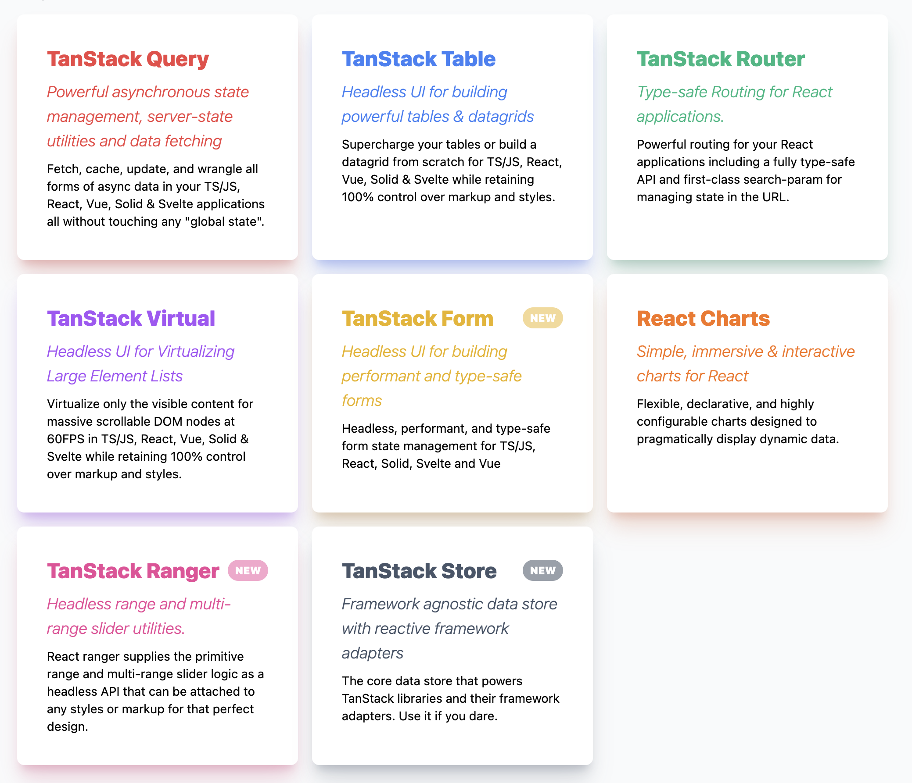

## Query
TanStack Query 也就是我们常说的 React Query，在 Github 上有 **38k** Star。它是一个适用于 React Hooks 的请求库，它为任何类型的异步数据提供了 React 状态管理功能。这个库简化了许多任务，例如处理 HTTP 请求状态、在客户端保存数据以防止多次请求，以及使用 Hooks 共享数据等。它还提供了一些方便的特性，如自动处理缓存、同步和更新服务器数据，以及处理用户交互的中间状态（如 loading 状态和错误信息）等。


TanStack Query 不仅适用于 React，还适用于 Solid、Vue、Svelte、Angular 等框架。

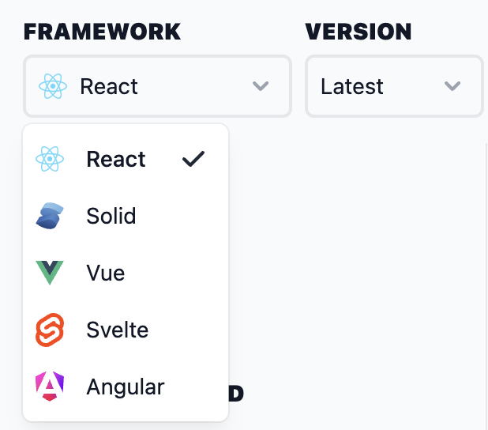

TanStack Query 的特性如下：

+ **专用开发工具**：提供专门的开发工具，使开发、调试和性能优化更加轻松。
+ **自动缓存**：自动缓存查询结果，提高性能和响应速度。
+ **自动重新获取**：当数据发生变化时，自动重新获取数据，确保实时性。
+ **窗口焦点重新获取**：当用户聚焦在某个窗口或组件上时，自动重新获取数据。
+ **轮询/实时查询**：支持轮询和实时查询，满足不同场景的需求。
+ **并行查询**：支持并行查询，提高数据获取效率。
+ **依赖查询**：支持依赖查询，根据其他查询的结果进行数据获取。
+ **Mutations API**：提供 Mutations API，用于执行插入、更新和删除操作。
+ **自动垃圾回收**：自动管理内存，避免内存泄漏和性能问题。
+ **分页/光标查询**：支持分页和光标查询，方便处理大量数据。
+ **加载更多/无限滚动查询**：支持加载更多和无限滚动查询，提供流畅的用户体验。
+ **滚动恢复**：当用户滚动页面时，自动恢复查询状态。
+ **请求取消**：支持请求取消功能，避免不必要的网络请求。
+ **Suspense 支持**：与 React Suspense 集成，实现按需加载和延迟渲染。
+ **按需渲染**：根据需要渲染数据，提高性能和用户体验。
+ **预取**：支持预取功能，提前获取即将需要的数据。
+ **可变长度并行查询**：支持可变长度的并行查询，进一步提高数据获取效率。
+ **离线支持**：即使在离线状态下，也能正常执行查询操作。
+ **服务端渲染（SSR）支持**：与各种服务器端渲染框架无缝集成，提供一致的用户体验。

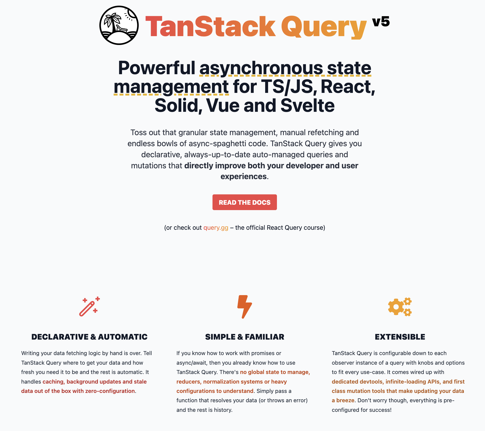

举个例子：

```javascript
import {
  useQuery,
  useMutation,
  useQueryClient,
  QueryClient,
  QueryClientProvider,
} from '@tanstack/react-query'
import { getTodos, postTodo } from '../my-api'

const queryClient = new QueryClient()

function App() {
  return (
    <QueryClientProvider client={queryClient}>
      <Todos />
    </QueryClientProvider>
  )
}

function Todos() {
  const queryClient = useQueryClient()

  const query = useQuery({ queryKey: ['todos'], queryFn: getTodos })

  const mutation = useMutation({
    mutationFn: postTodo,
    onSuccess: () => {
      queryClient.invalidateQueries({ queryKey: ['todos'] })
    },
  })

  return (
    <div>
      <ul>{query.data?.map((todo) => <li key={todo.id}>{todo.title}</li>)}</ul>

      <button
        onClick={() => {
          mutation.mutate({
            id: Date.now(),
            title: 'Do Laundry',
          })
        }}
      >
        Add Todo
      </button>
    </div>
  )
}

render(<App />, document.getElementById('root'))
```

## Router
TanStack Router 是一款专为构建 React 应用程序设计的路由器，近期发布了 1.0 版本。


TanStack Router 具备以下特性：

+ **TypeScript的完整支持**：提供100%的类型推断，提升代码安全性与健壮性。
+ **类型安全的导航**：确保在路由间的跳转始终安全可靠。
+ **嵌套路由与布局路由**：支持复杂的路由结构，满足各种应用需求。
+ **内置路由加载器与SWR缓存**：与SWR等数据获取库无缝集成，实现高效的数据获取与缓存。
+ **专为客户端数据缓存设计**：与TanStack Query、SWR等库完美配合，优化数据获取与更新。
+ **自动路由预取**：提前预取所需的路由数据，提升用户体验。
+ **异步路由元素与错误边界**：确保在数据加载或出错时，应用仍能稳定运行。
+ **类型安全的JSON-first搜索参数状态管理API**：提供强大的搜索参数管理功能，确保状态的安全与一致性。
+ **路径与搜索参数架构验证**：确保路由路径与搜索参数的正确性，减少错误与潜在问题。
+ **搜索参数导航API**：提供丰富的API，简化搜索参数的处理与导航。
+ **自定义搜索参数解析器/串行化支持**：满足你对搜索参数处理的特殊需求。
+ **搜索参数中间件**：提供强大的中间件功能，方便进行搜索参数相关的操作与处理。
+ **路由匹配/加载中间件**：让你对路由的处理拥有更细致的控制权，提升应用的灵活性与响应性。

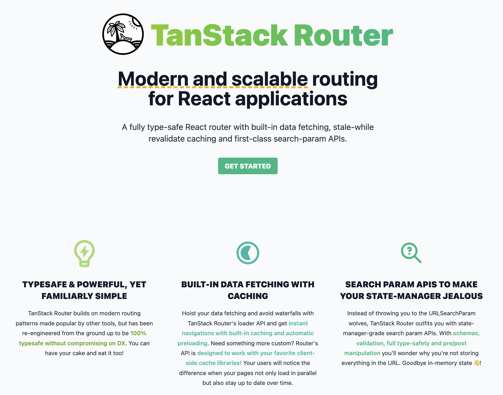

React Router 和 TanStack Router 都是为 React 应用提供路由功能的工具，它们的区别如下：

+ 类型安全：React Router是一个基于React之上的强大路由库，而TanStack Router是一个完全类型安全的路由器，具有类型安全的绝对和相对导航、嵌套路由和布局路由等功能。
+ 数据获取与缓存：React Router并不提供数据获取或缓存机制，而TanStack Router内置路由加载器与SWR缓存等库无缝集成，实现高效的数据获取与缓存，专为客户端数据缓存设计。
+ 导航API：React Router提供了一些基本的导航API，而TanStack Router则提供了更丰富的搜索参数导航API，以及自定义搜索参数解析器/串行化支持。
+ 错误处理与边界：React Router没有提供详细的错误处理机制，而TanStack Router提供了异步路由元素和错误边界等功能，确保在数据加载或出错时，应用仍能稳定运行。
+ 路由匹配与加载：React Router的路由匹配效率较高，而TanStack Router则提供了自动路由预取、路由匹配/加载中间件等功能，进一步提升应用的性能与响应性。

  
举个例子：

```javascript
import React, { StrictMode } from 'react'
import ReactDOM from 'react-dom/client'
import {
  Outlet,
  RouterProvider,
  Link,
  Router,
  Route,
  RootRoute,
} from '@tanstack/react-router'
import { TanStackRouterDevtools } from '@tanstack/router-devtools'

const rootRoute = new RootRoute({
  component: () => (
    <>
      <div className="p-2 flex gap-2">
        <Link to="/" className="[&.active]:font-bold">
          Home
        </Link>{' '}
        <Link to="/about" className="[&.active]:font-bold">
          About
        </Link>
      </div>
      <hr />
      <Outlet />
      <TanStackRouterDevtools />
    </>
  ),
})

const indexRoute = new Route({
  getParentRoute: () => rootRoute,
  path: '/',
  component: function Index() {
    return (
      <div className="p-2">
        <h3>Welcome Home!</h3>
      </div>
    )
  },
})

const aboutRoute = new Route({
  getParentRoute: () => rootRoute,
  path: '/about',
  component: function About() {
    return <div className="p-2">Hello from About!</div>
  },
})

const routeTree = rootRoute.addChildren([indexRoute, ])

const router = new Router({ routeTree })

declare module '@tanstack/react-router' {
  interface Register {
    router: typeof router
  }
}

const rootElement = document.getElementById('app')!
if (!rootElement.innerHTML) {
  const root = ReactDOM.createRoot(rootElement)
  root.render(
    <StrictMode>
      <RouterProvider router={router} />
    </StrictMode>,
  )
}
```

## Table
TanStack Table 是一个 Headless UI 库，用于为TS/JS、React、Vue、Solid和Svelte构建功能强大的表和数据网格。

> Headless UI 是一种用于构建复杂UI的库和工具，它专注于提供UI元素和交互的逻辑、状态、处理和API，但不涉及标记、样式或预构建的实现。无头UI的目标是使UI逻辑和组件更加模块化和可重用，同时减少与状态、事件、副作用、数据计算/管理等复杂任务相关的关注点。通过将逻辑与UI解耦，无头UI库支持高度自定义的UI体验，同时提供丰富的API来支持标记和样式的定制。使用无头UI库可以简化开发过程，让开发人员专注于更高层次的决策和实现，而无需担心底层细节。
>

TanStack Table 的特性如下：

+ **轻量级与高效**：总包大小仅10-15kb，通过Tree-Shaking技术进一步减少不必要的代码。
+ **无头模式**：适用于任何前端框架，不依赖任何特定UI组件库。
+ **丰富的单元格定制功能**：允许自定义单元格的内容、格式和行为。
+ **自动状态管理**：内部状态得到自动管理，同时提供灵活的选项以完全控制状态。
+ **强大的排序功能**：支持基本排序和多排序，满足复杂的排序需求。
+ **全局与列筛选器**：提供全局和列级的筛选功能，帮助用户快速过滤数据。
+ **丰富的数据展示与交互**：包括分页、行分组、行选择、行展开、列顺序调整、列可见性调整、列大小调整等功能。
+ **虚拟化支持**：适用于展示大量数据，提供流畅的用户体验。
+ **支持服务器端数据与外部数据源**：可以轻松集成外部数据源，提高数据管理和查询的灵活性。
+ **嵌套与分组头部**：提供更丰富的头部定制选项，增强表格的可读性和信息展示。
+ **页脚定制**：允许在表格底部添加自定义内容或功能。

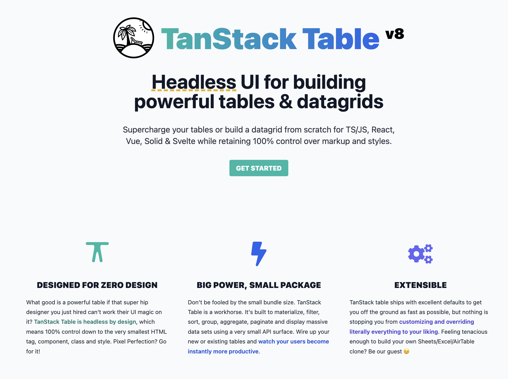  
举个例子：

```javascript
//vanilla js
const table = createTable({ columns, data })

//react
const table = useReactTable({ columns, data })

//solid
const table = createSolidTable({ columns, data })

//svelte
const table = createSvelteTable({ columns, data })

//vue
const table = useVueTable({ columns, data })
```

## Charts
React Charts 是一个开箱即用、功能强大、使用简单的React组件，它能够渲染各种类型的X/Y图表，包括但不限于线图、面积图、条形图、柱状图和气泡图。对于不熟悉SVG的用户来说，React Charts的使用非常简单，无需担心如何转换元素的属性或计算复杂的图形算法。


React Charts 的特新如下：

+ **超灵敏响应**：无论在何种设备或浏览器上查看图表，都能获得一致且出色的体验。
+ **丰富多样的图表类型**：折线图、条形图、柱状图、气泡图、散点图、面积图等，满足各种数据可视化需求。
+ **灵活的轴配置**：支持轴线堆叠、反转轴等高级配置，以及多轴显示。
+ **强大的定制能力**：我们提供丰富的定制选项，根据需求调整图表外观和行为。
+ **基于 D3.js**：React Charts 底层使用 D3.js，确保了图表的高性能和精确度。同时，无需直接与 D3.js 打交道，让复杂的技术细节变得简单。
+ **声明式编程**：通过简单的声明方式，可以轻松地定义和配置图表，无需关心底层的渲染逻辑。

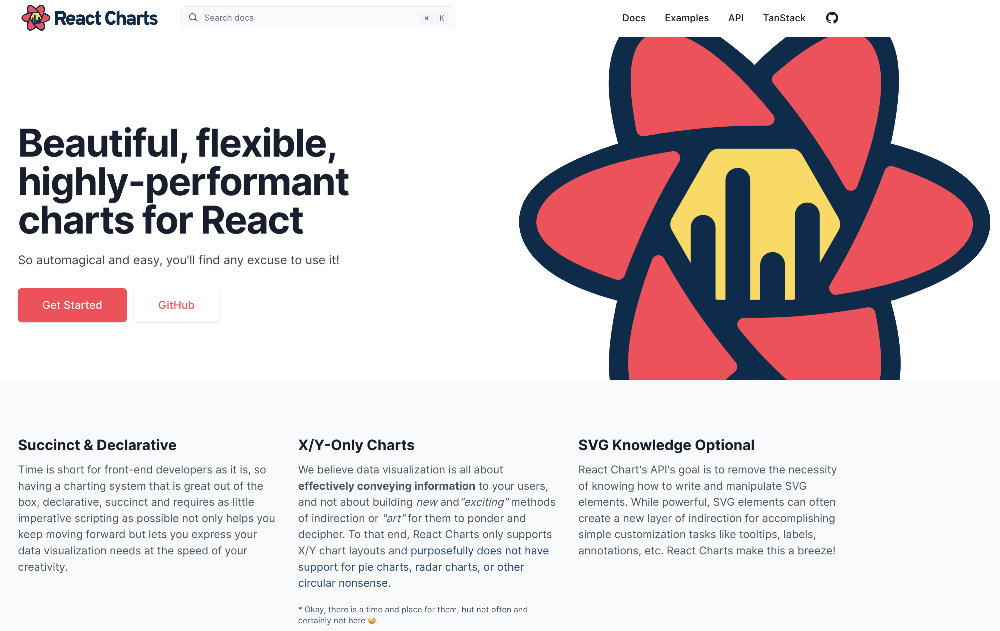

React Charts 只支持X/Y图表布局，并且有意不支持饼图、雷达图或其他无意义的圆形图表，因为他们认为这些饼图是一种糟糕的传递信息的方式。

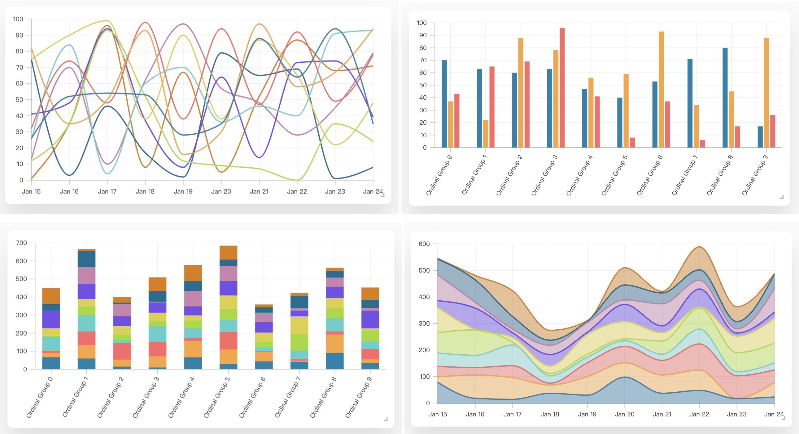

举个例子：

```javascript
import "./styles.css";
import useLagRadar from "./useLagRadar";
import React from "react";
import ReactDOM from "react-dom";

//

import Area from "./components/Area";
import Band from "./components/Band";
import Bar from "./components/Bar";
import BarStacked from "./components/BarStacked";
import Bubble from "./components/Bubble";
import CustomStyles from "./components/CustomStyles";
import DarkMode from "./components/DarkMode";
import DynamicContainer from "./components/DynamicContainer";
import InteractionMode from "./components/InteractionMode";
import Line from "./components/Line";
import MultipleAxes from "./components/MultipleAxes";
import Steam from "./components/Steam";
import BarHorizontal from "./components/BarHorizontal";
import BarHorizontalStacked from "./components/BarHorizontalStacked";
import SparkChart from "./components/SparkChart";
import SyncedCursors from "./components/SyncedCursors";
import StressTest from "./components/StressTest";

const components = [
  ["Line", Line],
  ["Bar", Bar],
  ["Bar (Stacked)", BarStacked],
  ["Bar (Horizontal)", BarHorizontal],
  ["Bar (Horizontal + Stacked)", BarHorizontalStacked],
  ["Band", Band],
  ["Area", Area],
  ["Bubble", Bubble],
  ["Steam", Steam],
  ["Spark Chart", SparkChart],
  ["Multiple Axes", MultipleAxes],
  ["Interaction Modes", InteractionMode],
  ["Dark Mode", DarkMode],
  ["Dynamic / Overflow Container", DynamicContainer],
  ["Custom Styles", CustomStyles],
  ["Synced Cursors", SyncedCursors],
  ["Stress Test", StressTest],
];

export default function App() {
  useLagRadar();

  return (
    <div>
      {components.map(([label, Comp]) => {
        return (
          <div key={label + ""}>
            <h1>{label}</h1>
            <div>
              <Comp />
            </div>
          </div>
        );
      })}
      <div style={{ height: "50rem" }} />
    </div>
  );
}

const rootElement = document.getElementById("root");
ReactDOM.render(<App />, rootElement);
```

## Virtaul
TanStack Virtual 是一个无头UI工具，用于在JS/TS、React、Vue、Svelte和Solid中虚拟化长列表元素。它不是一个组件，因此不会附带或呈现任何HTML或样式，用户可以 100% 控制样式、设计和实现。


TanStack Table 的主要特性如下：

+ **轻量级**：仅需10-15kb，轻松加载，高效运行。
+ **Tree-Shaking**：自动消除未使用的代码，进一步减少体积。
+ **无头模式**：专注于提供逻辑、状态和API，而不涉及标记和样式。
+ **垂直和水平虚拟化**：高效渲染大量数据，保持60FPS的流畅体验。
+ **网格虚拟化**：适用于更复杂的布局需求。
+ **窗口滚动**：与页面滚动无缝集成。
+ **固定、可变和动态尺寸**：满足各种尺寸需求。
+ **滚动实用程序**：提供额外的滚动功能和优化。
+ **粘性项目**：实现元素在滚动到特定位置时的固定效果。

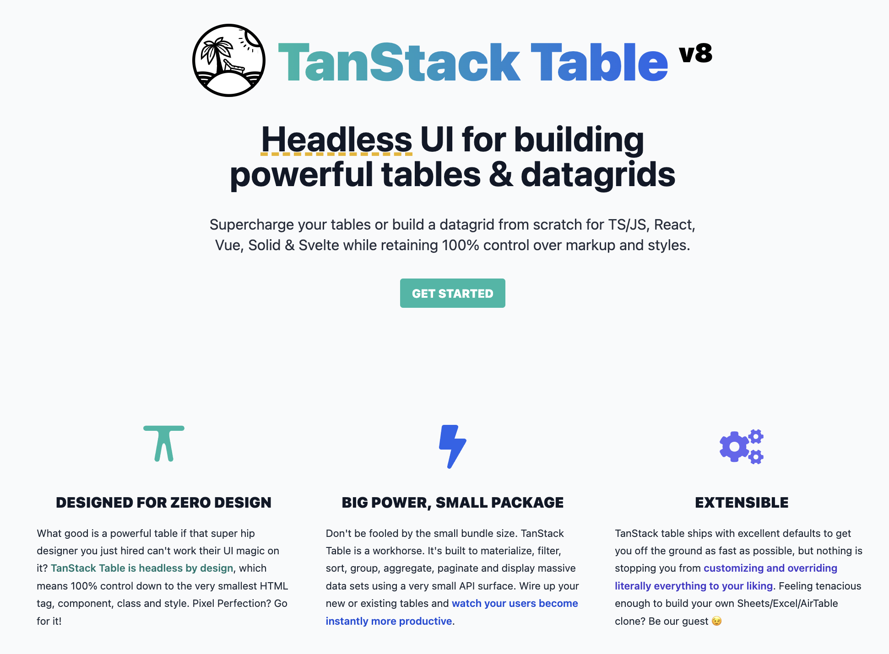

举个例子：

```javascript
import { useVirtualizer } from '@tanstack/react-virtual';

function App() {
  const parentRef = React.useRef()

  const rowVirtualizer = useVirtualizer({
    count: 10000,
    getScrollElement: () => parentRef.current,
    estimateSize: () => 35,
  })

  return (
    <>
      <div
        ref={parentRef}
        style={{
          height: `400px`,
          overflow: 'auto', 
        }}
      >
        <div
          style={{
            height: `${rowVirtualizer.getTotalSize()}px`,
            width: '100%',
            position: 'relative',
          }}
        >
          {rowVirtualizer.getVirtualItems().map((virtualItem) => (
            <div
              key={virtualItem.key}
              style={{
                position: 'absolute',
                top: 0,
                left: 0,
                width: '100%',
                height: `${virtualItem.size}px`,
                transform: `translateY(${virtualItem.start}px)`,
              }}
            >
              Row {virtualItem.index}
            </div>
          ))}
        </div>
      </div>
    </>
  )
}
```

## Form
TanStack Form 是一款强大的表单管理解决方案，专为Web应用程序设计。它充分利用TypeScript的强大功能，采用无头UI组件，并确保与各种前端框架的完美兼容。通过简化表单处理流程，提供灵活的表单管理方式，确保用户在各种应用场景中都能获得流畅、一致的体验，目前支持在 React、Vue、Solid 中使用。


TanStack Form 的特新如下：

+ **框架无关设计**：与各种前端框架无缝集成，提供一致的体验。
+ **一流的TypeScript支持**：充分利用TypeScript的优势，提供强大的类型安全和开发体验。
+ **无头UI组件**：专注于提供逻辑和组件，不涉及标记和样式，让你拥有100%的控制权。
+ **微小/零依赖**：轻量级设计，不影响其他库或代码。
+ **响应式组件与Hooks**：提供灵活的组件和 Hooks，适应各种使用场景。
+ **可扩展性与插件架构**：易于定制和扩展，满足独特的业务需求。
+ **验证功能**：内置表单和字段验证，支持异步验证和防抖。
+ **深度嵌套对象与数组字段**：轻松处理复杂的数据结构，满足各种数据需求。

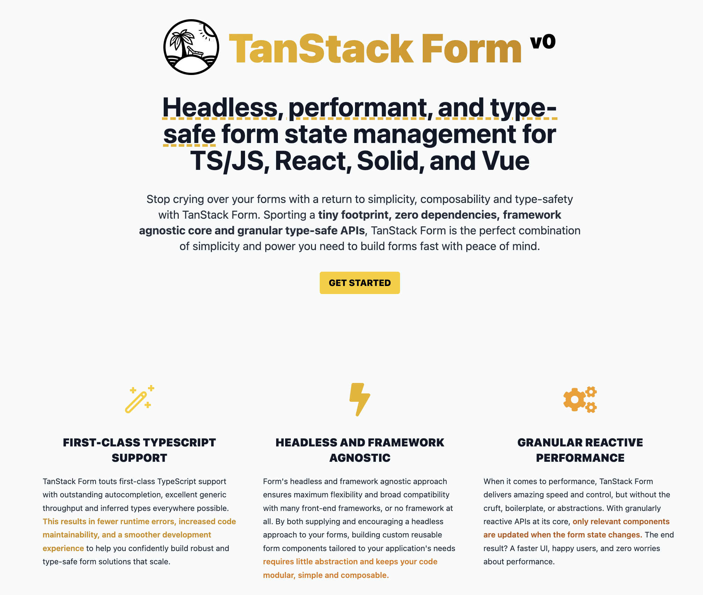

举个例子：

```javascript
import * as React from 'react'
import { createRoot } from 'react-dom/client'
import { useForm } from '@tanstack/react-form'
import type { FieldApi } from '@tanstack/react-form'

function FieldInfo({ field }: { field: FieldApi<any, any, any, any> }) {
  return (
    <>
      {field.state.meta.touchedErrors ? (
        <em>{field.state.meta.touchedErrors}</em>
      ) : null}
      {field.state.meta.isValidating ? 'Validating...' : null}
    </>
  )
}

export default function App() {
  const form = useForm({
    defaultValues: {
      firstName: '',
      lastName: '',
    },
    onSubmit: async ({ value }) => {
      console.log(value)
    },
  })

  return (
    <div>
      <h1>Simple Form Example</h1>
      <form.Provider>
        <form
          onSubmit={(e) => {
            e.preventDefault()
            e.stopPropagation()
            void form.handleSubmit()
          }}
        >
          <div>
            {/* A type-safe field component*/}
            <form.Field
              name="firstName"
              validators={{
                onChange: ({ value }) =>
                  !value
                    ? 'A first name is required'
                    : value.length < 3
                      ? 'First name must be at least 3 characters'
                      : undefined,
                onChangeAsyncDebounceMs: 500,
                onChangeAsync: async ({ value }) => {
                  await new Promise((resolve) => setTimeout(resolve, 1000))
                  return (
                    value.includes('error') &&
                    'No "error" allowed in first name'
                  )
                },
              }}
              children={(field) => {
                // Avoid hasty abstractions. Render props are great!
                return (
                  <>
                    <label htmlFor={field.name}>First Name:</label>
                    <input
                      id={field.name}
                      name={field.name}
                      value={field.state.value}
                      onBlur={field.handleBlur}
                      onChange={(e) => field.handleChange(e.target.value)}
                    />
                    <FieldInfo field={field} />
                  </>
                )
              }}
            />
          </div>
          <div>
            <form.Field
              name="lastName"
              children={(field) => (
                <>
                  <label htmlFor={field.name}>Last Name:</label>
                  <input
                    id={field.name}
                    name={field.name}
                    value={field.state.value}
                    onBlur={field.handleBlur}
                    onChange={(e) => field.handleChange(e.target.value)}
                  />
                  <FieldInfo field={field} />
                </>
              )}
            />
          </div>
          <form.Subscribe
            selector={(state) => [state.canSubmit, state.isSubmitting]}
            children={([canSubmit, isSubmitting]) => (
              <button type="submit" disabled={!canSubmit}>
                {isSubmitting ? '...' : 'Submit'}
              </button>
            )}
          />
        </form>
      </form.Provider>
    </div>
  )
}

const rootElement = document.getElementById('root')!

createRoot(rootElement).render(<App />)
```

## Ranger
TanStack Ranger 是一个用于构建范围和多范围滑块的 React Hooks库。它的特新如下：

+ **类型安全**：Ranger 提供了100%的类型安全，确保代码的准确性和可靠性。
+ **无头实用程序**：它是一个无头库，意味着它不包含任何预设的UI元素，也不渲染或提供实际的UI元素。
+ **易于维护**：Ranger 设计简洁，易于理解和维护。
+ **可扩展性**：Ranger 不强制规定UI，允许开发人员根据其独特的用例设计和扩展UI。

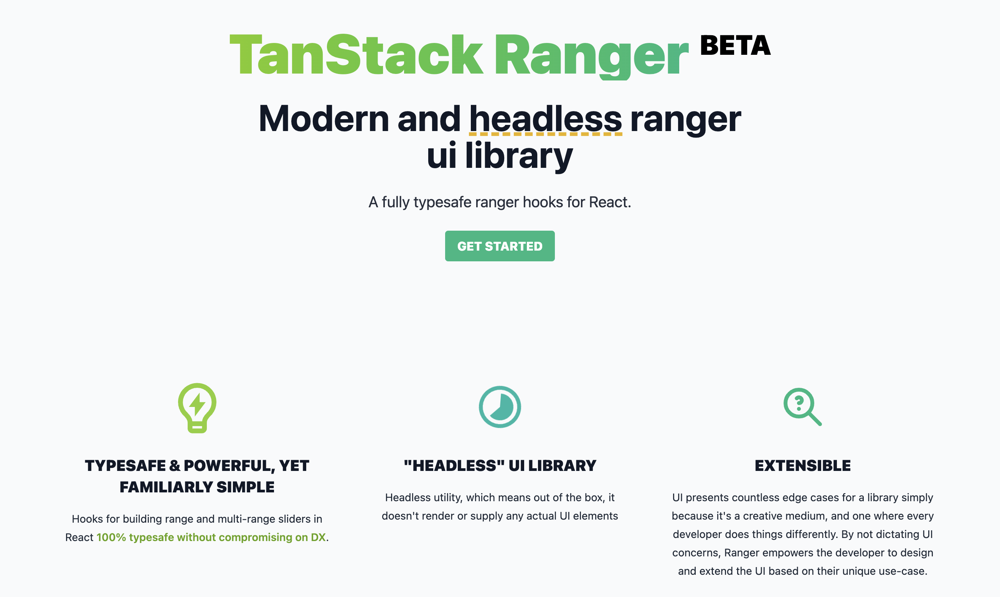

举个例子：

```javascript
import React from 'react'
import ReactDOM from 'react-dom'
import { useRanger, Ranger } from '@tanstack/react-ranger'

function App() {
  const rangerRef = React.useRef<HTMLDivElement>(null)
  const [values, setValues] = React.useState<ReadonlyArray<number>>([
    10, 15, 50,
  ])

  const rangerInstance = useRanger<HTMLDivElement>({
    getRangerElement: () => rangerRef.current,
    values,
    min: 0,
    max: 100,
    stepSize: 5,
    onChange: (instance: Ranger<HTMLDivElement>) =>
      setValues(instance.sortedValues),
  })

  return (
    <div className="App" style={{ padding: 10 }}>
      <h1>Basic Range</h1>
      <span>Active Index: {rangerInstance.activeHandleIndex}</span>
      <br />
      <br />
      <div
        ref={rangerRef}
        style={{
          position: 'relative',
          userSelect: 'none',
          height: '4px',
          background: '#ddd',
          boxShadow: 'inset 0 1px 2px rgba(0,0,0,.6)',
          borderRadius: '2px',
        }}
      >
        {rangerInstance
          .handles()
          .map(
            (
              {
                value,
                onKeyDownHandler,
                onMouseDownHandler,
                onTouchStart,
                isActive,
              },
              i,
            ) => (
              <button
                key={i}
                onKeyDown={onKeyDownHandler}
                onMouseDown={onMouseDownHandler}
                onTouchStart={onTouchStart}
                role="slider"
                aria-valuemin={rangerInstance.options.min}
                aria-valuemax={rangerInstance.options.max}
                aria-valuenow={value}
                style={{
                  position: 'absolute',
                  top: '50%',
                  left: `${rangerInstance.getPercentageForValue(value)}%`,
                  zIndex: isActive ? '1' : '0',
                  transform: 'translate(-50%, -50%)',
                  width: '14px',
                  height: '14px',
                  outline: 'none',
                  borderRadius: '100%',
                  background: 'linear-gradient(to bottom, #eee 45%, #ddd 55%)',
                  border: 'solid 1px #888',
                }}
              />
            ),
          )}
      </div>
      <br />
      <br />
      <br />
      <pre
        style={{
          display: 'inline-block',
          textAlign: 'left',
        }}
      >
        <code>
          {JSON.stringify({
            values,
          })}
        </code>
      </pre>
    </div>
  )
}

ReactDOM.render(
  <React.StrictMode>
    <App />
  </React.StrictMode>,
  document.getElementById('root'),
)
```

## Store
TanStack Store 是一种灵活的数据存储解决方案，它不依赖于特定的框架，而是提供了与React、Solid、Vue和Svelte等主要框架集成的适配器。这使得开发者可以轻松地将其集成到自己喜欢的框架中。作为TanStack库系列的核心组件之一，TanStack Store主要用于内部状态管理，帮助开发者更高效地管理应用的状态。同时，由于其独立性和通用性，它也可以作为任何框架或应用的独立数据存储库使用。

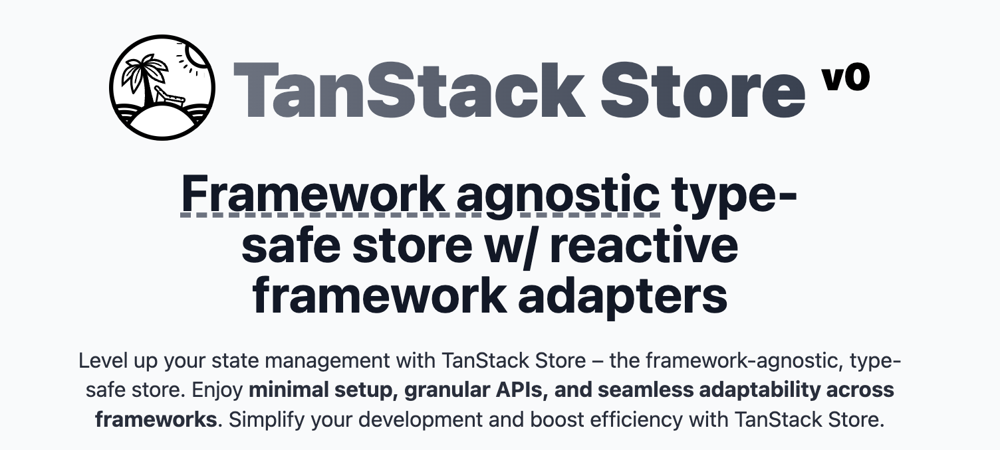


> 更新: 2024-02-24 16:17:02  
> 原文: <https://www.yuque.com/cuggz/feplus/qnctbwadmpdd0zpv>