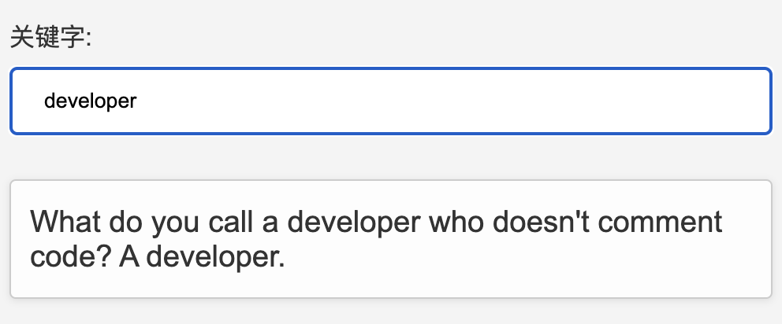
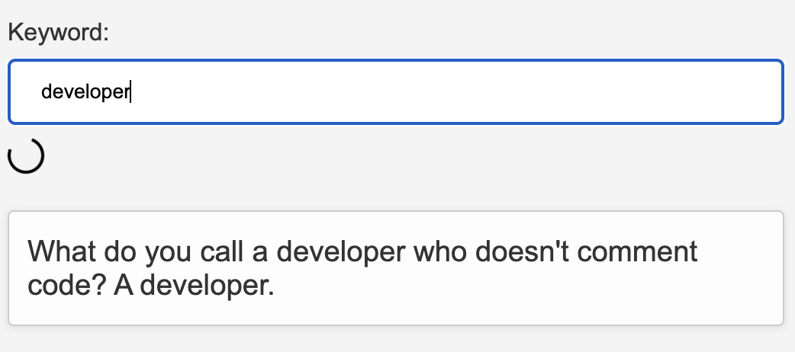

# htmx

如今，Web 用户期望得到单页应用（SPA）提供的流畅、动态的体验。然而，创建SPA往往需要使用复杂的框架，如 React 和 Vue，学习和使用起来可能比较困难。这就是htmx的用武之地：一种通过直接在HTML中利用Ajax和CSS过渡效果等功能，为构建动态 Web 体验带来新思路的工具库。下面就来看看 htmx 是什么，它有什么强大之处！

## htmx 概述

HTMX 允许在不使用 JavaScript 的情况下添加现代浏览器功能。可以直接在 HTML 中使用属性来访问 AJAX、CSS 过渡效果、WebSockets 和服务器推送等功能，以便以超文本的简单性和强大性构建现代用户界面。

HTMX的设计理念是通过解除HTML在前端开发中的一些限制，使其成为一个更加完整和强大的超文本工具。通常情况下，在传统的Web开发中，只有`<a>`和`<form>`标签可以发起HTTP请求，只有点击和提交事件可以触发这些请求，只有GET和POST方法可用，并且只能替换整个屏幕内容。而HTMX打破了这些限制，允许使用额外的HTML属性来实现更多的功能，而不需要编写大量的JavaScript代码。例如，在HTML中使用特定的属性即可实现进度条、懒加载、无限滚动、内联验证等特性。

与其他前端框架（如Vue.js和React）不同，HTMX的工作方式是：当向服务器发送请求时，服务器返回完整的HTML响应，并更新页面中的相应部分，而不是以JSON格式返回数据。这使得HTMX可以与任何服务器端技术进行集成，因为应用的逻辑和处理都发生在后端。这种方式简化了前端开发并减少了对JavaScript的依赖。

可以通过如下方式使用npm安装HTMX：

```javascript
npm install htmx.org
```

## htmx 使用

HTMX提供了一组属性，可以直接从 HTM L中进行AJAX请求：

* `hx-post`：发送一个POST请求到指定的URL。
* `hx-get`：发送一个GET请求到指定的URL。
* `hx-put`：发送一个PUT请求到指定的URL。
* `hx-patch`：发送一个PATCH请求到指定的URL。
* `hx-delete`：发送一个DELETE请求到指定的URL。

这些属性都接受一个 URL 作为参数，用于发送AJAX请求。因此，每当触发元素时，它会向指定的URL发送指定类型的请求。来看下面的例子：

```html
<button hx-get="/api/resource">加载数据</button>
```

在上面的例子中，按钮元素被赋予了`hx-get`属性。一旦点击该按钮，就会向`/api/resource` URL发送一个GET请求。

那当从服务器返回数据时会发生什么呢？默认情况下，htmx 会将这个响应直接注入到发起请求的元素中，也就是示例中的按钮元素。然而，htmx 并不局限于这种行为，它提供了将响应数据指定为不同元素的目标的能力，接下来将深入探讨这个功能。

## 使用htmx触发请求

htmx根据特定元素上发生的特定事件来触发Ajax请求：

* 对于`input`、`textarea`和`select`元素，触发事件是`change`事件。
* 对于表单元素，触发事件是`submit`事件。
* 对于其他所有元素，触发事件是`click`事件。

下面来看一个例子：

```html
<label>关键词：
  <input
    type="text"
    placeholder="输入关键词"
    hx-get="https://v2.jokeapi.dev/joke/Any?format=txt&safe-mode"
    hx-target="#joke-container"
    name="contains"
  />
</label>

<p id="joke-container">笑话内容</p>
```

为了触发搜索，需要激活`change`事件。对于`<input>`元素而言，当元素失去焦点且其值已被改变时就会触发`change`事件。因此，当在文本框中输入一些内容，然后点击页面上其他地方，一个笑话就会出现在`<p>`元素中。简而言之，在输入关键词后，光标离开输入框，笑话就会自动显示出来。

这很不错，但通常用户希望在输入时就看到搜索结果更新，也就是说，当用户在输入框中输入内容时，将自动触发Ajax请求，并在后台获取最新的搜索结果，并将其更新到页面上相应的位置。因此，用户不需要手动点击其他地方以触发搜索，而是实时地在输入的同时获得更新的搜索结果。为了实现这一点，可以给`<input>`元素添加一个htmx `trigger`属性：

```html
<input
  ...
  hx-trigger="keyup"
/>
```

现在结果会立即更新。但同时引入了一个新的问题：**现在会在每次输入时都进行一次API调用**。为了避免这个问题，可以使用修饰符来改变触发器的行为。htmx 提供了以下修饰符选项：

* `once`：如果希望请求只执行一次，可以使用此修饰符。
* c`hanged`：此修饰符确保只有在元素的值发生变化时才发出请求。
* `delay:<时间间隔>`：此修饰符设置一个等待期（如1秒），在此等待期间再次触发事件将重新计时。
* `throttle:<时间间隔>`：使用此修饰符，可以在发出请求之前设置一个等待期（例如1秒）。然而，与`delay`不同的是，如果在设定的时间内触发了新的事件，则该事件将被忽略，确保请求仅在定义的时间后触发。
* `from:<CSS选择器>`：此修饰符使得可以在特定的元素上监听事件，而不是原始元素。

在这种情况下，`delay`是我们想要的修饰符：

```html
<input
  ...
  hx-trigger="keyup delay:500ms"
/>
```

现在，当在输入框中输入内容时（尝试输入一个较长的词，比如"developer"），只有在暂停或完成输入时才会触发请求。

```html
<label>关键字:
  <input
    type="text"
    placeholder="E输入关键字d"
    hx-get="https://v2.jokeapi.dev/joke/Any?format=txt&safe-mode"
    hx-target="#joke-container"
    name="contains"   
    hx-trigger="keyup delay:500ms"
  />
</label>

<p id="joke-container">笑话内容</p>
```



正如你所见，这种做法只需要几行客户端代码就可以实现一个搜索框模式。

## 请求指示器

在Web开发中，当用户执行某个操作并且该操作可能需要一段时间才能完成（如进行网络请求），我们通常需要给用户提供反馈。其中一种常见的反馈方式是使用请求指示器，以可视化的方式提示用户该操作正在进行中。

htmx集成了对请求指示器的支持，让我们能够向用户提供这种反馈。它使用`hx-indicator`类来指定一个元素作为请求指示器。具有此类的任何元素的默认不透明度为 0，使其在DOM中不可见但存在。

当htmx发起一个Ajax请求时，它会在触发元素上应用`htmx-request`类。`htmx-request`类会导致该元素或任何具有`htmx-indicator`类的子元素的不透明度变为 1。

例如，下面是一个具有加载旋转图标作为其请求指示器的元素：

```html
<button hx-get="/api/data">
  加载数据
  
</button>
```

当具有`hx-get`属性的按钮被点击并且请求开始时，按钮会自动添加一个`htmx-request`类。这个类可以让请求指示器（例如加载旋转图标）在按钮上显示，当请求完成后，这个类会被移除，请求指示器也会停止显示。还可以使用`htmx-indicator`属性来指示接收`htmx-request`类的元素（显示请求指示器的元素）。

```html
<label>关键字:
  <input
    type="text"
    placeholder="输入关键字"
    hx-get="https://v2.jokeapi.dev/joke/Any?format=txt&safe-mode"
    hx-target="#joke-container"
    name="contains"   
    hx-trigger="keyup delay:500ms"
    hx-indicator=".loader"
  />
</label>

<span class="loader htmx-indicator"></span>

<p id="joke-container">笑话内容</p>
```



## 定位元素和更新内容

在某些情况下，我们可能需要在发送请求的元素之外更新其他元素。htmx 允许我们`hx-target`属性来指定Ajax响应应该更新的特定元素。可以通过在`hx-target`属性中设置一个CSS选择器来指定要更新的元素。例如有一个用于发布新评论的表单，希望将新评论添加到评论列表中，而不是更新表单本身。

```html
<button
  hx-get="https://v2.jokeapi.dev/joke/Any?format=txt&safe-mode&type=single"
  hx-target="#joke-container"
>
  Hello htmx!
</button>
```

当用户点击按钮并发起请求时，获取到的响应数据将会更新显示在页面上具有"`joke-container`"这个ID的元素内部，而不是替换按钮本身的内容。这样可以实现在特定位置更新内容，而不影响其他部分的效果。

### 扩展CSS选择器

htmx提供了一些扩展的CSS选择器，用于更高级的元素选择和内容加载：

* `this` ：指定带有 `hx-target` 属性的元素作为实际更新目标。
* `closest` ：找到与给定CSS选择器匹配的最近的祖先元素。
* `next` 和 `previous` ：在DOM中查找与给定CSS选择器匹配的后续或前置元素。
* `find` ：查找与给定CSS选择器匹配的第一个子元素。

通过使用这些关键字，我们可以更灵活地选择要更新的元素。例如，在之前的例子中，我们可以使用 `hx-target="next p"` 来指定更新目标元素，而不是使用具体的 ID。这样可以简化代码，并且使得更新更加动态和通用。

### 更新内容

默认情况下，htmx会用Ajax响应替换目标元素的内容。但是，如果希望追加新内容而不是替换它，那就可以使用`hx-swap`属性。该属性允许指定新内容应该如何插入目标元素中。可能的取值包括`outerHTML`、`innerHTML`、`beforebegin`、`afterbegin`、`beforeend`和`afterend`。例如，使`用hx-swap="beforeend"`会将新内容追加到目标元素的末尾，这对于新评论的场景非常合适。

## CSS 过渡

可以使用CSS过渡效果来使元素在不使用JavaScript的情况下平滑地改变样式。要实现这一点，需要在多个HTTP请求之间保持相同的元素 ID。这样，当 htmx 接收到新的内容并更新元素时，它将能够应用CSS过渡效果，使样式的改变过渡得更加平滑。

```html
<button hx-get="/new-content" hx-target="#content">
  请求数据
</button>

<div id="content">
  初始内容
</div>
```

在htmx发起到`/new-content`的Ajax请求后，服务器返回以下内容：

```html
<div id="content" class="fadeIn">
  新内容
</div>
```

尽管内容发生了变化，但是`<div>`元素保持了相同的ID。然而，新增的内容中添加了一个`fadeIn`类。通过为新内容添加`fadeIn`类，我们可以定义相应的CSS规则，例如`opacity`和`transition`属性，来实现淡入效果。这样，当htmx接收到新的内容并更新元素时，CSS过渡效果将被触发，使元素的变化过渡得更加平滑。

下面来创建一个 CSS 过渡效果，使元素从初始状态平滑过渡到新状态：

```css
.fadeIn {
  animation: fadeIn 2.5s;
}

@keyframes fadeIn {
  0% {opacity: 0;}
  100% {opacity: 1;}
}
```

当htmx加载新内容时，它会触发CSS过渡效果，从而创建一个流畅的视觉过渡到更新后的状态。

## 使用 View Transitions API

全新的View Transitions API提供了一种在DOM元素的不同状态之间进行动画转换的方式。与涉及元素CSS属性变化的CSS过渡不同，视图过渡是用于动画元素内容的变化。

View Transitions API 是一个正在积极开发中的全新实验性功能。该API已经在Chrome 111+中实现，并预计将来会有更多的浏览器支持它。htmx提供了与View Transitions API一起使用的接口，并在不支持该API的浏览器中回退到非过渡机制。

在 htmx 中，View Transitions API 的使用方法如下：

* 将`htmx.config.globalViewTransitions`配置变量设置为`true`。这将对所有交换使用过渡效果。
* 在`hx-swap`属性中使用`transition:true`选项。 可以使用CSS定义和配置视图过渡效果。

下面是一个“弹跳”过渡效果的示例，其中旧内容弹出，新内容弹入：

```css
@keyframes bounce-in {
  0% { transform: scale(0.1); opacity: 0; }
  60% { transform: scale(1.2); opacity: 1; }
  100% { transform: scale(1); }
}

@keyframes bounce-out {
  0% { transform: scale(1); }
  45% { transform: scale(1.3); opacity: 1; }
  100% { transform: scale(0); opacity: 0; }
}

.bounce-it {
  view-transition-name: bounce-it;
}

::view-transition-old(bounce-it) {
  animation: 600ms cubic-bezier(0.4, 0, 0.2, 1) both bounce-out;
}

::view-transition-new(bounce-it) {
  animation: 600ms cubic-bezier(0.4, 0, 0.2, 1) both bounce-in;
}
```

在使用htmx时，可以在`hx-swap`属性中添加`transition:true`选项来启用过渡效果。然后，可以将`bounce-it`类添加到想要进行动画处理的内容上。

```html
<button
  hx-get="https://v2.jokeapi.dev/joke/Any?format=txt&safe-mode" 
  hx-swap="innerHTML transition:true" 
  hx-target="#joke-container"
>
  加载新动画
</button>

<div id="joke-container" class="bounce-it">
  <p>初始动画内容</p>
</div>
```

在这个例子中，当`<div>`的内容被更新时，旧内容会以弹跳的方式退出视图，而新内容会以弹跳的方式进入视图，从而产生一种生动的视觉效果。

## 表单校验

htmx 与 HTML5 Validation API 可以良好的集成，在表单提交时，htmx会利用浏览器原生的验证功能进行表单验证。

例如，当用户点击提交按钮时，只有当输入字段包含有效的电子邮件地址时，才会向`/contact`发送POST请求。

```html
<form hx-post="/contact">
  <label>Email:
    <input type="email" name="email" required>
  </label>
  <button>提交</button>
</form>
```

值得注意的是，htmx在验证过程中会触发一系列事件，可以利用这些事件来添加自己的验证逻辑和错误处理方法。例如，如果想要在JavaScript代码中实现邮箱检查，可以这样做：

```html
form hx-post="/contact">
  <label>Email:
    <input type="email" name="email" required>
  </label>
  <button>提交</button>
</form>

<script>
  const emailInput = document.querySelector('input[type="email"]');

  emailInput.addEventListener('htmx:validation:validate', function() {
    const  pattern = /@gmail\.com$/i;

    if (!pattern.test(this.value)) {
      this.setCustomValidity('只接受谷歌邮箱!');
      this.reportValidity();
    }
  });
</script>
```

这里使用了htmx的`htmx:validation:validate`事件，该事件在调用元素的`checkValidity()`方法之前被触发。

现在，当尝试提交带有非`gmail.com`地址的表单时，将会看到一样的错误提示。

## 其他功能

除了上述提到的功能外，htmx 还具有很多其他功能，旨在增强HTML的能力，并为处理Web应用中的动态内容更新提供简单而强大的方式。它的功能不仅限于已经介绍的内容，还包括一些设计用于创建更具交互性和响应性的网站的功能，而无需使用复杂的JavaScript框架。

### 扩展

扩展是htmx工具中功能强大的工具。这些可定制的JavaScript组件使我们能够根据我们的特定需求进一步增强和定制库的行为。扩展包括在请求中启用JSON编码、操作HTML元素上类的添加和删除、调试元素、支持客户端模板处理等。有了这些，我们就可以将htmx自定义为更精细的粒度。

### Boosting

htmx的“Boosting”功能允许我们将标准的HTML锚点（即链接）和表单转换为Ajax请求。在传统的Web开发中，点击链接或提交表单通常会导致整个页面刷新。而通过使用htmx的"boosting"功能，这些链接和表单将通过Ajax请求来处理，只更新需要更新的部分内容，而不需要刷新整个页面。这使得网站的加载速度更快，并提供了更流畅的用户体验。类似的技术在过去被称为pjax，现在在htmx中也可以实现类似的效果。

```html
<div hx-boost="true">
  <a href="/blog">Blog</a>
</div>
```

这个 `div` 中的锚点标签会发出一个 Ajax GET 请求到 `/blog`，并将 HTML 响应替换到 `<body>` 标签中。

通过利用这个功能，可以为用户创建更流畅的导航和表单提交体验，使我们的 Web 应用更像单页面应用（SPA）。

### 历史记录管理

htmx 内置了对浏览器历史记录的支持，可以与标准的浏览器历史API对接。这样，可以将URL添加到浏览器导航栏，并将页面当前状态存储在浏览器的历史记录中，确保"返回"按钮按照用户的期望进行操作。这样一来，我们就可以创建出类似于SPA的网页，能够在不重新加载整个页面的情况下维护状态和处理导航。

### 与第三方库一起使用

htmx 可以很容易的与其他库进行集成。它可以无缝地与许多第三方库进行整合，利用它们的事件来触发请求。

## 总结

htmx是一个多功能、轻量级且易于使用的工具。它成功地将HTML的简洁性与通常与复杂JavaScript库相关的动态功能相结合，为创建交互式网络应用程序提供了一个全新的选择。

然而，它并不是适用于所有情况的解决方案。对于更复杂的应用，我们可能仍然需要使用JavaScript框架。但是，如果目标是创建一个快速、交互性强且用户友好的Web应用，而又不增加太多复杂性，那么 htmx 绝对是值得考虑的。


> 更新: 2024-01-09 16:53:22  
> 原文: <https://www.yuque.com/cuggz/feplus/tbbzoribtlpb1g4b>