# 前端构建工具

今天来盘点一下目前市场上前端构建工具。

| **构建工具** | **实现语言** | **Github Star** |
| :---: | :---: | :---: |
| [Bun](https://github.com/oven-sh/bun) | Zig | 71.3k |
| [Vite](https://github.com/vitejs/vite) | TypeScript | 65.4k |
| [Webpack](https://github.com/webpack/webpack) | JavaScript | 64.3k |
| [Parcel](https://github.com/parcel-bundler/parcel) | JavaScript | 43.2k |
| [esbuild](https://github.com/evanw/esbuild) | Go | 37.5k |
| [Gulp](https://github.com/gulpjs/gulp) | JavaScript | 32.9k |
| [SWC](https://github.com/swc-project/swc) | Rust | 30.2k |
| [Turbopack](https://github.com/vercel/turbo) | Rust | 25.2k |
| [Rollup](https://github.com/rollup/rollup) | JavaScript | 24.9k |
| [Nx](https://github.com/nrwl/nx) | TypeScript | 22.4k |
| [Rspack](https://github.com/web-infra-dev/rspack) | Rust  | 7.5k |
| [Rolldown](https://github.com/rolldown/rolldown) | Rust | 6.9k |
| [Farm](https://github.com/farm-fe/farm) | Rust | 2.5k |
| [Rsbuild](https://github.com/web-infra-dev/rsbuild) | TypeScript | 0.8k |

## Bun
Bun 是一个爆火的 JavaScript 运行时，它不仅仅局限于运行时，更是一个全能的工具集，集成了包管理、测试、构建和转译等多项功能。作为构建工具，Bun 的速度表现尤为出色，其性能远超其他主流构建工具，实现了质的飞跃。受到 edbuild 的启发，Bun不仅继承了其优秀的设计理念，还提供了与之兼容的插件API，确保了生态的延续性和扩展性。另外，Bun 引入了JS宏的概念，使得在打包过程中可以直接运算JS函数，并将结果内联到代码中，极大地提升了代码的执行效率和可维护性。

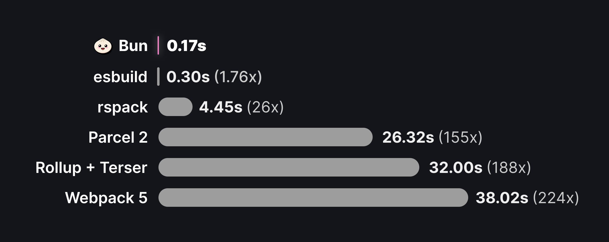

## Vite
Vite，由 Vue 团队精心打造，是一款基于浏览器原生 ES 模块化的前端构建工具，旨在为用户提供极速且流畅的开发体验。Vite 凭借其卓越的性能和强大的扩展性，已成为前端构建工具的佼佼者。

Vite 的核心优势在于其出色的速度和简易性。通过其独特的开发服务器，它支持原生 ES 模块并提供了一系列内置功能，包括超快速的模块热更新（HMR），从而显著提升了开发效率。不仅如此，Vite 还拥有一套强大的构建指令，它基于 Rollup 进行代码打包，并经过预配置以输出适用于生产环境的高度优化过的静态资源。值得注意的是，Vite 正计划在未来采用其自研的 Rolldown 打包工具，以进一步提升打包效率和性能。

如今，越来越多的 Vue 项目和 React 用户都选择 Vite 作为他们的构建工具。仅用了四年时间，Vite 的周下载量便高达每周 260 万次，并且这一数字仍在持续增长。这充分证明了 Vite 在前端开发领域的广泛认可和巨大潜力。

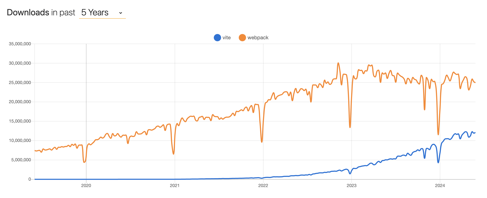

## Webpack
Webpack 是一个老牌的模块打包工具，也是目前最流行的前端构建工具。它可以将各种资源文件（如 JavaScript、CSS、图片等）视为模块，在打包时统一处理和优化。Webpack 的优点不用多说，这里主要说说它的缺点：Webpack 在冷启动和热更新时相对较慢；配置相对复杂，需要了解和配置多个概念，包括加载器 loader、插件 plugin等，对新手不友好；打包结果比一些工具体积更大，影响应用性能。

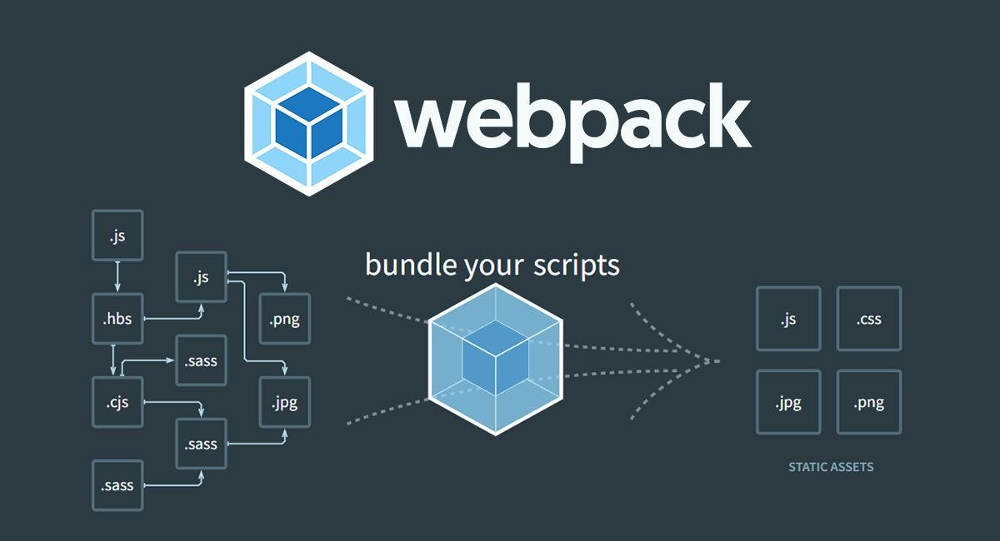

## Parcel
Parcel 是一个快速、易于使用的打包工具，主要用于前端项目，特别是那些寻求简单配置和快速启动时间的项目。它利用多核处理提供了极快的速度，并且不需要任何配置。它内置了对多种资源的转换功能，并支持多种模块规范。

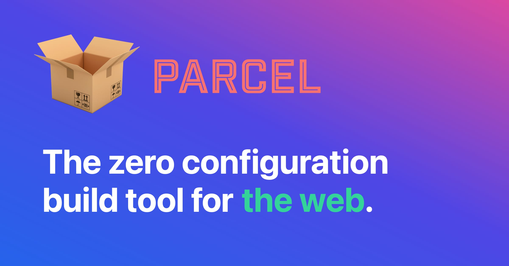

## esbuild
esbuild 是一个高效且可扩展的 JavaScript 打包工具，专为现代前端应用构建而设计。其主要特点包括：

+ **极速构建**：esbuild 的构建速度是同类工具的几十倍，这得益于其使用 Go 语言编写和基于多核并行处理的架构，能够充分发挥现代计算机硬件的性能优势。
+ **多类型支持**：它不仅支持 JavaScript 和 TypeScript，还兼容 CSS、图片以及多种插件，为前端项目提供了全面的支持。
+ **简单易用**：esbuild 的使用方式简单直观，支持命令行、JavaScript 和 Go 三种调用方式，方便开发者根据项目需求灵活选择。
+ **低内存占用**：相比其他构建工具，esbuild 在构建过程中具有较低的内存占用，这对于资源受限的环境尤为友好。

## Gulp
Gulp 是一个拥有悠久历史的基于 Node.js 的自动化构建工具，用于简化开发过程中的一些**简单的任务处理**，例如文件压缩、合并、重命名、图片压缩等。 最近，Gulp 发布了 5.0 版本，目前新应用应该用的不多了，主要是一些老项目在用。 

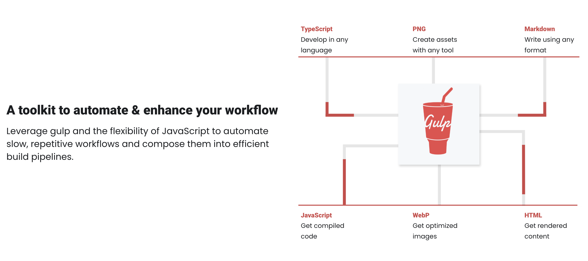

## swc
swc（全称 Super-fast Web Compiler）是一款基于 Rust 编写的 JavaScript 和 TypeScript 编译器，目标是提供比 Babel 更快的编译速度和更好的压缩效果。swc 通过多线程编译和直接解析代码到 AST 的方式，显著提升了编译速度，远超 Babel。同时，swc 提供了优秀的代码压缩效果，支持最新的 ECMAScript 标准，包括 ES6、ES7、ES8 等，并兼容主流浏览器和 Node.js。swc 的 API 友好易用，可轻松集成到现有的构建系统，如 webpack、rollup、Parcel 等。

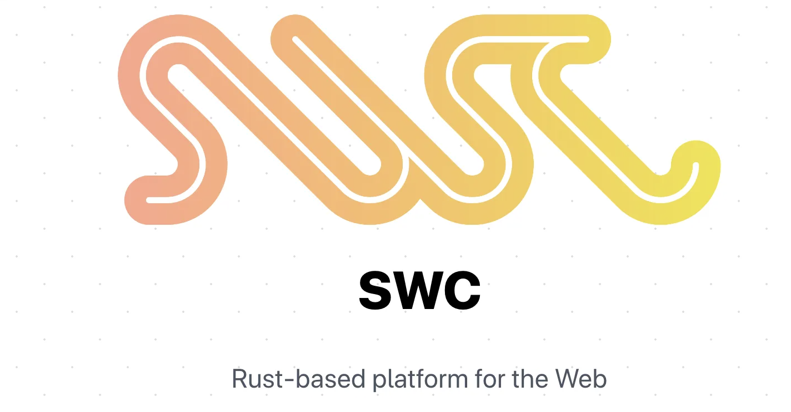

## Turbopack
Turbopack，由Vercel开源，是下一代高性能的JavaScript应用构建工具，目前用于 Next.js 中。Turbopack旨在通过革新JavaScript应用的打包流程来显著提升应用性能，它专注于缩短加载时间，降低CPU和网络资源的使用，并减小应用的体积和启动时间。Vercel 宣称 Turbopack 是 Webpack 的继任者，用 Rust 编写，其在大型应用中的表现令人瞩目，展现了相较于Vite快10倍、相较于Webpack快达700倍的速度。

Turbopack颠覆了传统JavaScript打包工具（如webpack、Rollup）的使用体验，它无需用户手动创建复杂的配置文件或处理繁琐的插件和依赖关系。相反，它通过智能分析应用并自动检测运行时所需特性，来精准确定依赖项，并使用高效的JavaScript模块打包器Rollup进行打包。

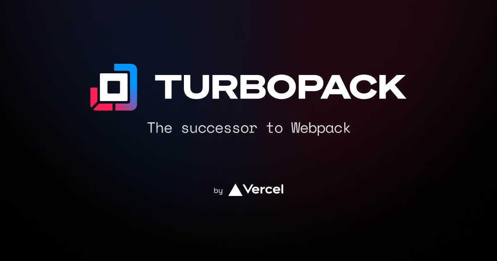

## Rollup
Rollup是一个JavaScript模块打包器，可以将JavaScript模块打包成单个文件。与其他打包工具相比，Rollup更加注重ES6模块的支持，可以将ES6模块转换成ES5模块，并可以进行tree-shaking优化，减小打包后文件的体积。Rollup 的目标是产生更小、更快、更高效的代码，因此在构建 JavaScript 库时非常有用。

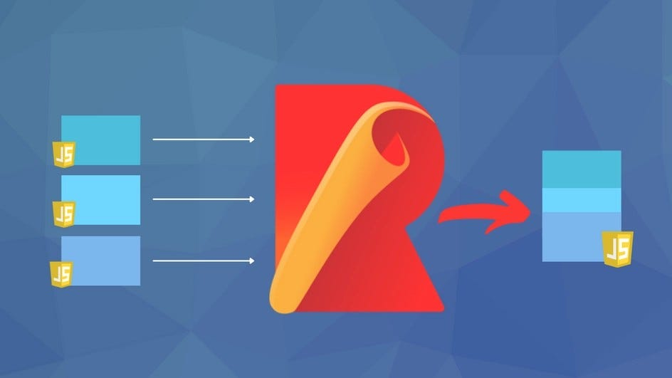

## Nx
Nx 是一个具有内置工具和高级 CI 功能的构建系统。它可以在本地和 CI 上维护和扩展 monorepos。

Nx 的核心功能包括：高效并行执行任务并依据依赖关系智能排序，通过在多台虚拟机间分发任务以优化大型仓库的CI性能，利用本地和远程缓存机制避免重复执行，自动拆分大型端到端测试并智能识别重跑不稳定的测试，支持通过插件实现代码库和依赖项的自动更新，以及提供高度的可定制性和可扩展性，允许用户创建并分享自定义插件以满足特定需求。

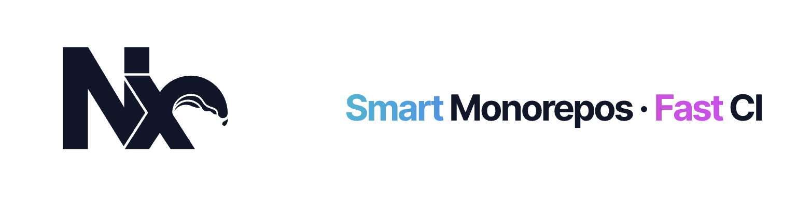

## Rspack
Rspack 是由字节跳动 Web Infra 团队孵化的基于 Rust 语言开发的 Web 构建工具。它拥有高性能、兼容 Webpack 生态、定制性强等多种优点，旨在打造高性能的前端工具链。

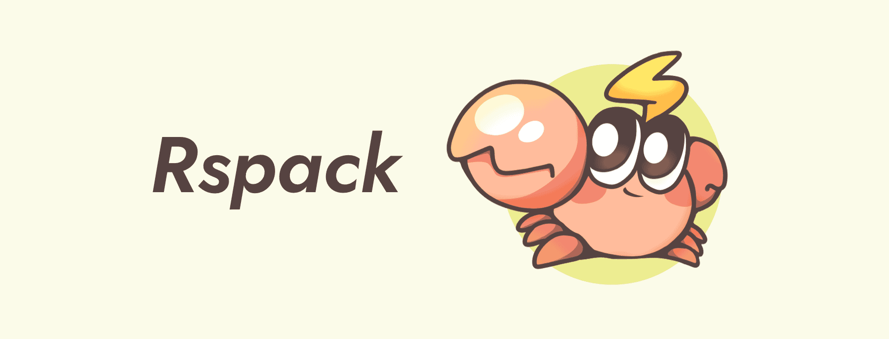

## Rolldown
Rolldown 是 Vue 团队近期开源的一个用 Rust 编写的 JavaScript 打包器，它提供了与 Rollup 兼容的 API 和插件接口，但在功能范围上与 esbuild 更相似。Rolldown 旨在作为 Vite 未来使用的底层打包器，以替换现在的 Rollup，也可以作为单独的构建工具使用，目前处于开发阶段，尚不可用于生产环境。

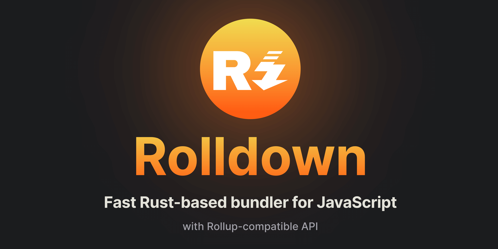

## Farm
Farm 是国内个人开发者开发的一个使用 Rust 编写的极速 Web 构建工具，兼容 Vite 插件生态。Farm 设计为极速、强大、一致的构建工具，旨在提供更好的 web 开发体验，是真正意义的下一代构建工具。

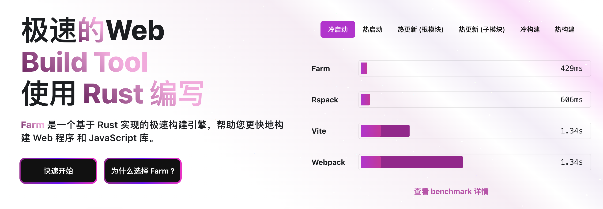

## Rsbuild
Rsbuild 是基于 Rspack 的 Web 构建工具，是一个增强版的 Rspack CLI，更易用、更开箱即用。作为 Rspack 团队对 Web 构建最佳实践的探索，Rsbuild 提供从 Webpack 到 Rspack 的顺畅迁移方案，大幅减少配置需求，提升构建速度达 10 倍。

## 相关链接
[1] **Bun: **_**https://github.com/oven-sh/bun**_

[2] **Vite: **_**https://github.com/vitejs/vite**_

[3] **Webpack: **_**https://github.com/webpack/webpack**_

[4] **Parcel: **_**https://github.com/parcel-bundler/parcel**_

[5] **esbuild: **_**https://github.com/evanw/esbuild**_

[6] **Gulp: **_**https://github.com/gulpjs/gulp**_

[7] **SWC: **_**https://github.com/swc-project/swc**_

[8] **Turbopack: **_**https://github.com/vercel/turbo**_

[9] **Rollup: **_**https://github.com/rollup/rollup**_

[10] **Nx: **_**https://github.com/nrwl/nx**_

[11] **Rspack: **_**https://github.com/web-infra-dev/rspack**_

[12] **Rolldown: **_**https://github.com/rolldown/rolldown**_

[13] **Farm: **_**https://github.com/farm-fe/farm**_

[14] **Rsbuild: **_**https://github.com/web-infra-dev/rsbuild**_

> 更新: 2024-06-07 17:23:53  
> 原文: <https://www.yuque.com/cuggz/feplus/rshsg6bxgit5oh1c>