# 前端框架新势力

近年来，前端领域持续蓬勃发展，新的框架不断涌现，为开发者提供了更多选择和解决方案。尽管 React、Vue、Angular、Next.js、Preact 等老牌框架依然稳坐市场主流，但新势力前端框架的崛起也为特定场景带来了更佳的适配和优化。接下来，我们将一探**近三年涌现的前端新势力框架**，深入了解它们的特点以及主要解决的问题，共同探索这些新势力框架如何为前端开发注入新的活力与可能性。

## Astro

Astro 最初于 2021 年 3 月发布，目前在 Github 上有 41.9k Star。

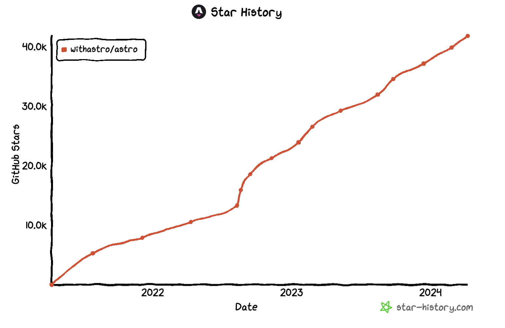

Astro 是一个**集多功能于一体的 Web 框架**，专为内容丰富的网站而设计，是最适合构建像博客、营销网站、电子商务网站这样**以内容驱动的网站**的 Web 框架。

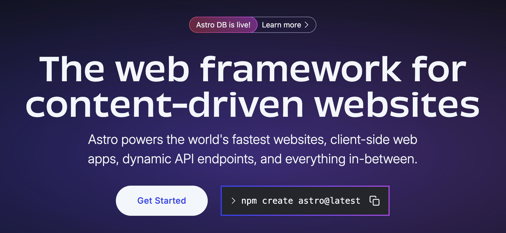

Astro 的特性如下：

* **框架无关**：可以使用React、Svelte、Vue、Preact、Web Components，或者只是简单的HTML + JavaScript来构建网站。
* **默认无 JavaScript**：Astro 默认将页面渲染为100%静态HTML，默认移除了最终构建中的JavaScript，这有助于提升页面加载速度和用户体验。
* **按需加载组件**：当页面上的组件变为可见时，Astro 能够自动实现组件的交互性（即“水合”组件），如果用户从未看到某个组件，那么该组件的JavaScript代码也不会被加载，这进一步提高了性能和效率。
* **功能全面**：Astro支持TypeScript、Scoped CSS、CSS Modules、Sass、Tailwind 等，同时还支持Markdown、MDX以及任何npm包，这使得开发者能够充分利用现有的工具和库，构建功能丰富的网站。
* **内置SEO功能**：为了简化SEO和网站内容的分发，Astro内置了自动生成站点地图、RSS源、分页和集合的功能，帮助开发者更轻松地优化网站在搜索引擎中的排名和可见性。
* **文档支持**：Astro 官方提供了详细的文档，并且提供了中文版文档。

Astro 独创了一种前端架构，名为“**群岛**”。这种架构旨在避免传统的单体JavaScript模式，通过自动剥离页面中所有非必需的JavaScript，显著提升了前端性能。所谓的“岛屿”，是指页面上的每一个交互式UI组件。这些岛屿各自独立运行，互不干扰，一个页面上可以同时存在多个岛屿。尽管岛屿在不同的组件环境中运作，但它们之间仍然能够共享状态并相互通信，保持了高度的灵活性和交互性。这种设计使得Astro能够轻松支持多种UI框架，如 React、Preact、Svelte、Vue 和 SolidJS。由于岛屿的独立性，你甚至可以在同一个页面上混合使用多种框架，实现前所未有的前端体验。

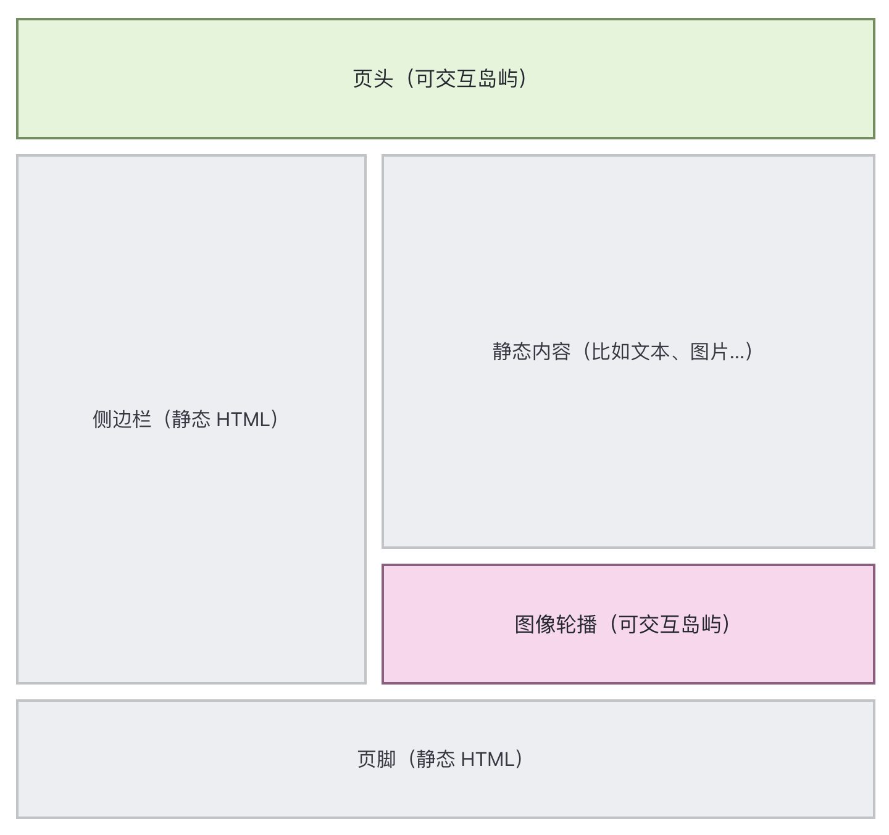

Astro 自发布之后，一直在快速的更新迭代，同时发布了一些周边产品，如：

* Astro DB：专为 Astro 设计的全托管 SQL 数据库。
* Starlight：基于 Astro 框架构建的全功能文档主题。

Astro 的使用场景包括：营销网站、出版网站、文档网站、博客、个人作品集、落地页、社区网站以及电子商务网站。无论是需要展示产品、发布内容、分享知识还是促进交易，只要有内容需要快速传递给读者，Astro 都是一个理想的选择。它以其高效的性能和灵活的架构，帮助用户轻松构建出高性能、内容丰富的网站，满足各种业务需求。

**Github**：<https://github.com/withastro/astro>

## Qwik

Qwik 最初于 2021 年 5 月发布，目前在 Github 上有 20.1k Star。

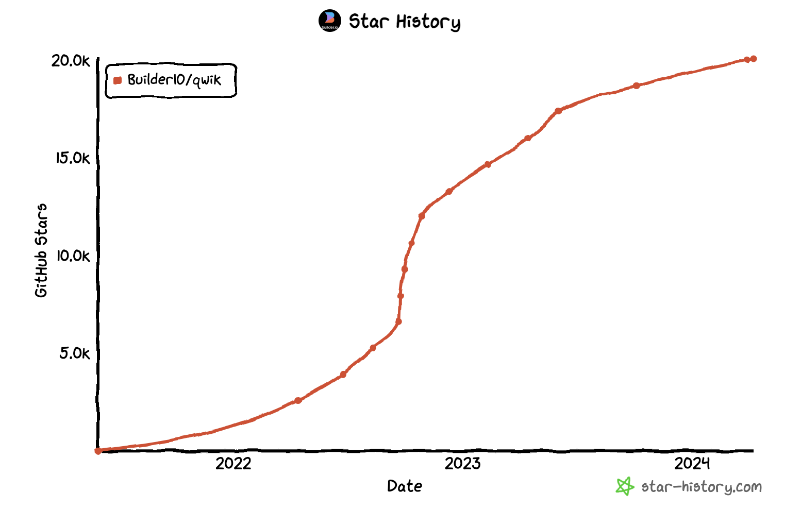

Qwik 是一个 Web 框架，其独特之处在于通过延迟执行和下载JavaScript以及序列化应用的执行状态来实现即时启动应用的目标。

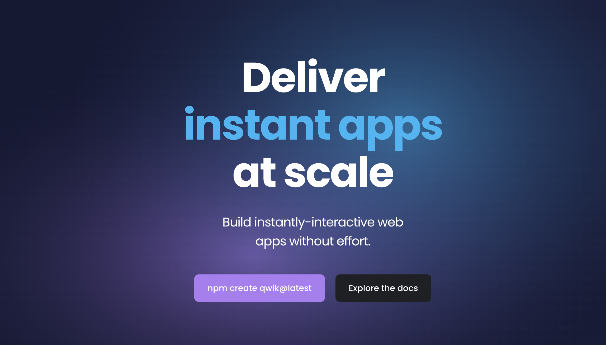

Qwik的特点包括：

* 延迟执行和下载JavaScript：通过尽可能延迟JavaScript代码的执行和下载，Qwik能够提供接近即时启动性能，这是当前一代Web框架无法匹敌的。
* 序列化和恢复执行状态：Qwik通过在服务器和客户端之间序列化应用的执行状态，包括监听器、内部数据结构和应用状态，从而实现应用在客户端继续执行的能力。

Qwik 解决了现代网站在启动时需要大量JavaScript代码的问题，这导致了网络带宽和启动时间上的瓶颈。Qwik的设计目标是尽可能减少应用需要下载和执行的JavaScript代码量，从而实现更快的页面加载速度和更好的用户交互体验。

Qwik适用于需要快速加载和即时交互的Web应用程序，尤其适用于对性能要求较高的场景，如移动应用、动态内容网站、实时交互应用等。通过Qwik，开发者可以构建出具有出色性能和用户体验的Web应用，满足用户在不同设备和网络环境下的需求。

**Github**：<https://github.com/BuilderIO/qwik>

## Remix

Remix 最初于 2021 年 10 月开源，目前在 Github 上有 27.2k Star。

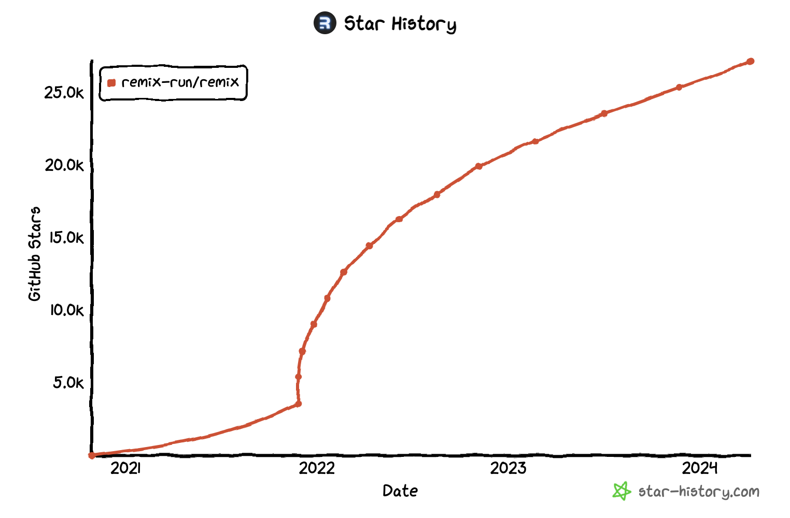

Remix 是一个面向 React 开发者的全栈框架，直接对标 Next.js，其旨在提供更好的开发体验和更高的性能。该框架由 Ryan Florence 和 Michael Jackson 创建，他们是 React Router 库的作者。Remix 最初是一个收费框架，名为 Remix Run，提供了一种新的方式来构建动态网站。Remix Run 于 2021 年 3 月首次发布，最初是商业产品，需要购买许可证才能使用。

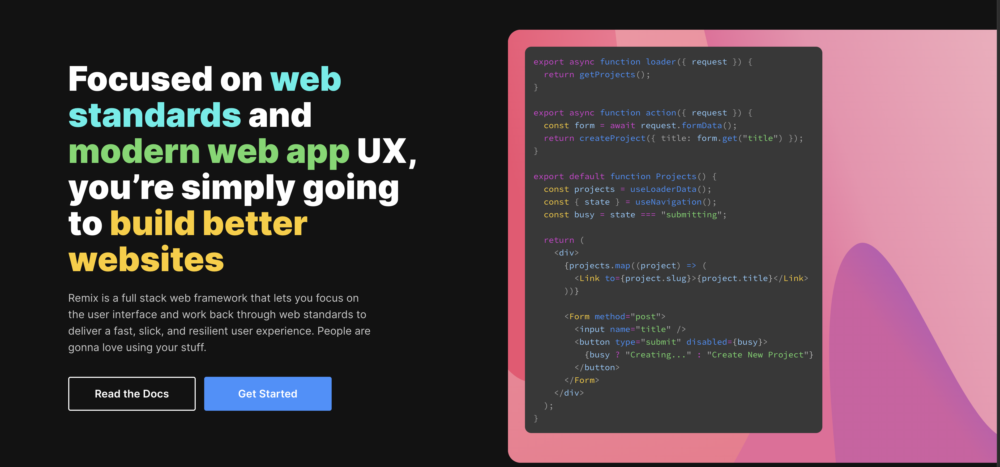

2021 年 10 月，Remix团队宣布将Remix Run转变为一个开源项目，并更名为 Remix。通过开源，Remix团队希望能够吸引更多的开发者并建立一个更加活跃的社区，从而推动框架的发展和改进。

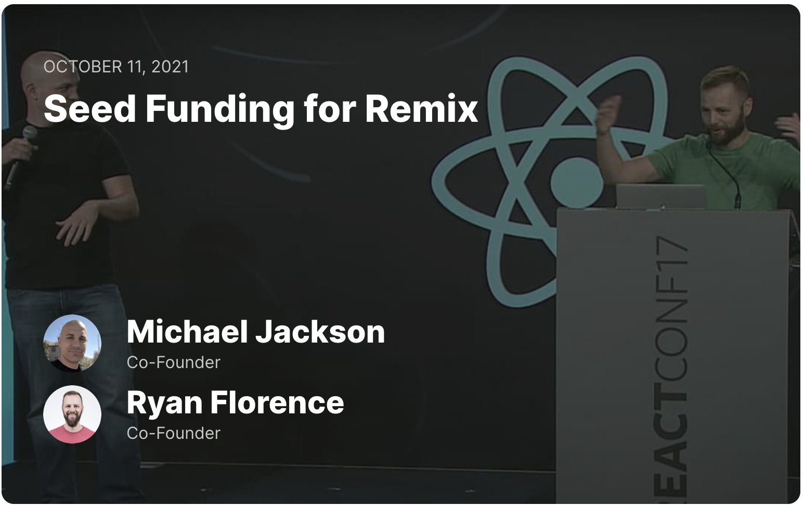

Remix 构建在 React Router 之上，通过以下以下四点实现了一种高效且灵活的全栈Web开发体验：

* **编译器**：：Remix的核心在于其编译器，通过执行如`remix vite:build`的命令，Remix能够生成服务器端HTTP处理程序、浏览器版本和资产清单。这些生成物可直接部署至任何支持JavaScript的托管服务，极大地简化了部署流程。
* **服务端HTTP处理程序与适配器**：Remix并非一个完整的服务器，而是提供了一组处理程序，供实际运行的JavaScript服务器使用。这些处理程序基于Web Fetch API，因此能在多种Node.js及非Node.js环境中运行。适配器的引入使得Remix能够在不同服务器架构间无缝切换，通过转换服务器的请求/响应API至Fetch API，确保了跨平台的兼容性。
* **服务端框架**：Remix借鉴了传统服务器端MVC框架的设计思路，但更侧重于UI的呈现。其路由模块不仅承担了视图和控制器的角色，还提供了loader（用于数据加载）、action（处理POST等请求）和default（组件）导出，使得开发者能够更高效地组织和管理代码。
* **浏览器框架**：在浏览器端，Remix利用JavaScript模块实现页面的“水合”，确保了页面的快速更新和出色的性能。同时，Remix提供了客户端导航优化，通过预取页面资源等方式，极大地提升了用户体验。此外，Remix的客户端API也为开发者提供了丰富的用户体验改进手段，如表单提交时禁用按钮、显示动画验证消息等。

**Github**：<https://github.com/remix-run/remix>

## Refine

最初于 2021 年 4 月发布，目前在 Github 上有 23.9k Star。

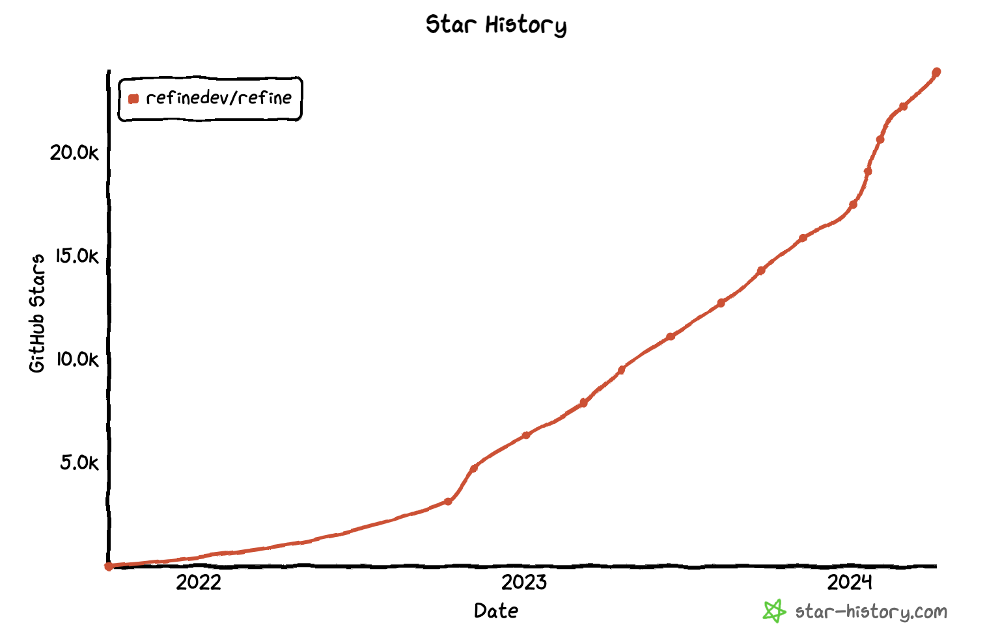

Refine是一个针对CRUD密集型Web应用的React元框架。它旨在解决包括内部工具、管理面板、仪表板和B2B应用在内的广泛企业用例。

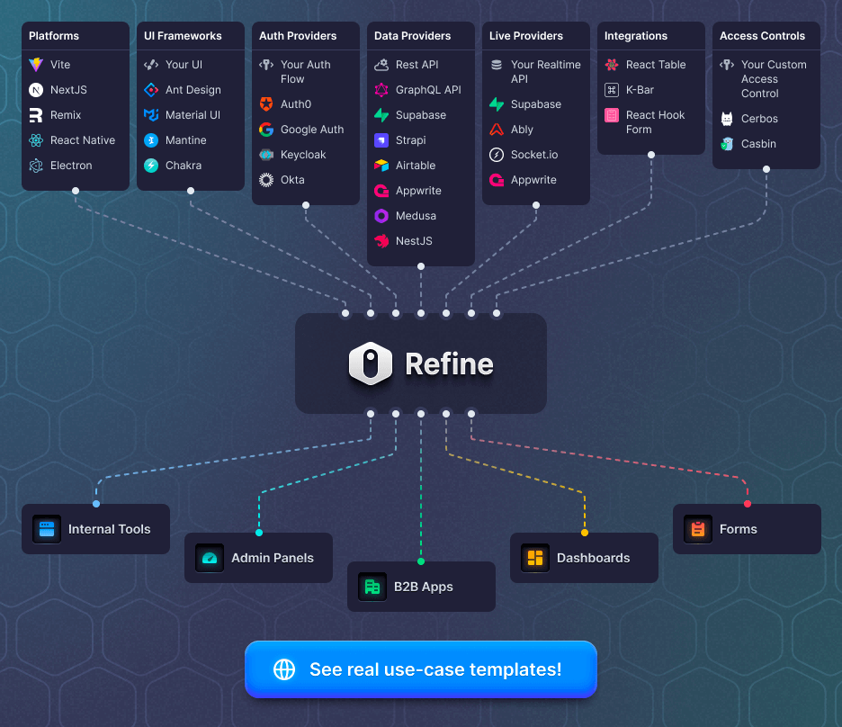

Refine 的特点如下：

* **一站式解决方案**：Refine 提供了核心 hooks 和组件，为项目的关键方面，如认证、访问控制、路由、网络、状态管理和国际化（i18n），提供了行业标准解决方案，从而简化了开发过程。
* **高度可定制**：Refine 采用无头（headless）架构，将业务逻辑与UI和路由解耦，使得构建高度可定制的应用成为可能。这种架构允许开发者灵活选择UI框架和设计，如TailwindCSS，并内置支持Ant Design、Material UI、Mantine和Chakra UI等。
* **跨平台集成**：Refine通过简单的路由接口，可以轻松地与各种平台集成，包括Next.js、Remix、React Native、Electron等，无需额外的设置步骤。
* **专注于CRUD操作**：作为一个专注于CRUD（创建、读取、更新、删除）操作的框架，Refine特别适用于那些需要频繁进行数据库交互的Web应用。
* **企业级功能**：Refine不仅关注开发效率，还提供了企业级的功能，如认证和访问控制，满足企业应用对于安全性和可管理性的需求。

***

**Github**：<https://github.com/refinedev/refine>

## Nue

Nue 最初于 2023 年 9 月发布，目前在 Github 上有 5.7k Star。

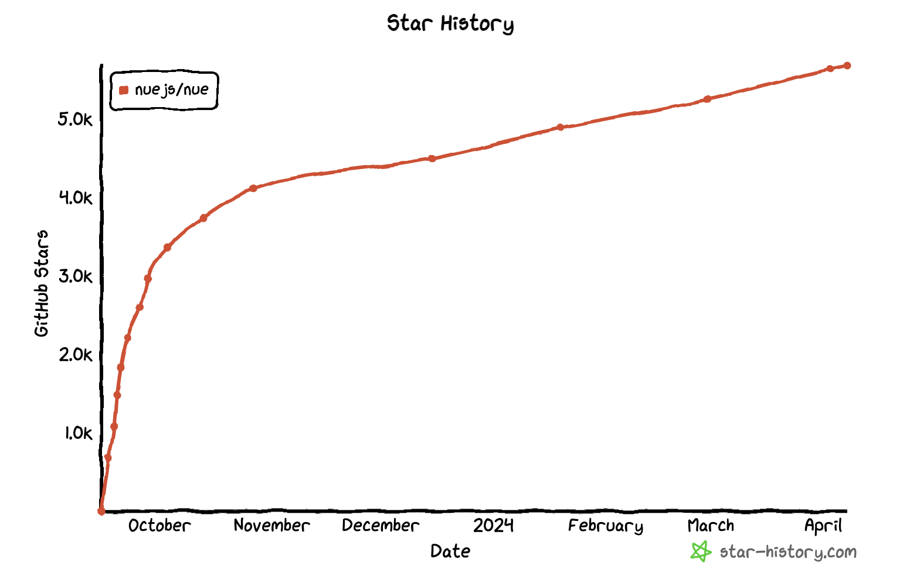

Nue.js 是一款采用内容优先开发模型的 Web 框架，它使网站内容编辑和创建更加优化，通过简单的语法和关注点分离，减少了构建同样功能的代码量，从而提高了开发效率。Nue.js 的创作者 Tero Piirainen 表示，Nue.js 是 React、Vue、Next.js、Svelte 和 Astro 的替代品。

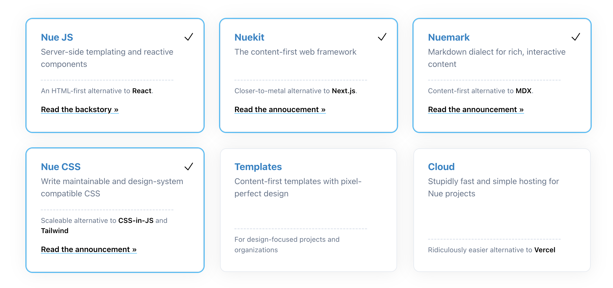

Nue.js 表现出极致的性能，通过加载更少的资源、实现客户端的即时页面切换、显著提升构建速度、提供缓存友好的分发方式以及使用更简洁的 CSS 来构建更快的网站。

Nue.js 更加贴近标准，项目比 Next.js 更简洁，减少了抽象和学习的成本，降低了出错的可能性。它实现了关注点分离，为内容创作者、UX 开发人员和 JS 开发人员提供了明确的职责划分。此外，Nue.js 坚持使用经久不衰的标准，而非短暂流行的 CSS-in-JS，确保代码经受住时间的考验。

**Github**：<https://github.com/nuejs/nue>

## VanJS

VanJS 最初于 2023 年 5 月发布，目前在 Github 上有 3.4k Star。

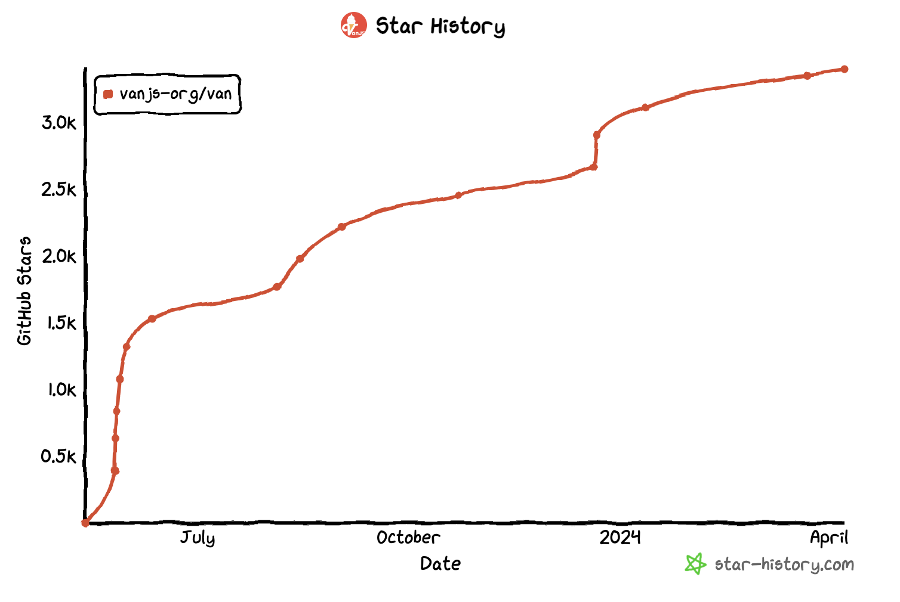

VanJS 是一个超轻量级、零依赖的响应式 UI 框架，基于纯粹的原生JavaScript和DOM。它允许开发者使用几行代码在任何设备上构建有用的UI应用程序，无需React/JSX或其他复杂的配置。

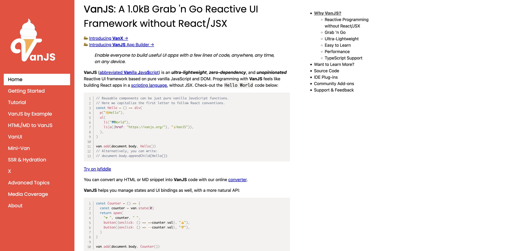

VanJS 的特点如下：

* **超轻量级**：VanJS 是世界上最小的响应式 UI 框架，压缩后仅为1.0kB，比大多数流行的替代方案小50~100倍，但可以获得所有现代Web框架的基本功能，如DOM模板、状态、状态绑定、状态推导、Effect、SPA、客户端路由甚至水合等。
* **零依赖**：无需安装、配置或依赖其他库或工具，只需向脚本或HTML文件添加一行代码即可开始编码。
* **原生JavaScript和DOM**：使用VanJS编程感觉就像在脚本语言中构建React应用程序，而无需使用JSX。它完全基于原生JavaScript和DOM，无需转译或虚拟DOM。
* **状态管理**：VanJS提供了易于使用的状态管理功能，允许开发者轻松管理UI的状态和绑定。
* **易于学习**：核心功能简单明了，仅有 5 个主要函数，整个教程和API参考易于理解，可以在短时间内掌握。
* **开箱即用**：无需安装、无需配置、无需依赖、无需转译、无需IDE设置。只需向脚本或HTML文件添加一行代码即可开始编码。任何使用VanJS的代码都可以直接粘贴并在浏览器的 Devtools 中执行。VanJS 允许专注于应用程序的业务逻辑，而不是陷入框架和工具中。
* **高性能**：根据测试，VanJS是最快的Web框架之一，对于服务端渲染（SSR），其效率甚至超过React。
* **Typ\*\*\*\*eScript支持**：VanJS提供对TypeScript的一流支持，允许开发者利用类型检查、智能感知等高级功能。

**Github**：<https://github.com/vanjs-org/van>

## Waku

最初于 2023 年 6 月发布，目前在 Github 上有 3.7k Star。

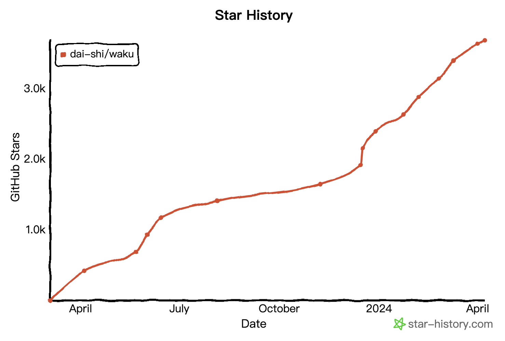

Waku 是一个轻量级的 React 框架，设计用于加速初创公司和机构开发小型到中型React项目的工作。它适用于构建营销网站、轻量级电商网站和Web应用。Waku 的目标是在现代 React 服务端组件时代带来快速的开发者体验，让React开发再次变得快速。需要注意的是，Waku目前正处于快速发展阶段，一些功能可能还不完善。因此，建议用户先在非生产项目上进行尝试，并报告遇到的任何问题。

**Github**：<https://github.com/dai-shi/waku>

> 更新: 2024-06-07 17:35:01  
> 原文: <https://www.yuque.com/cuggz/feplus/smnticx1i5ox0w9n>